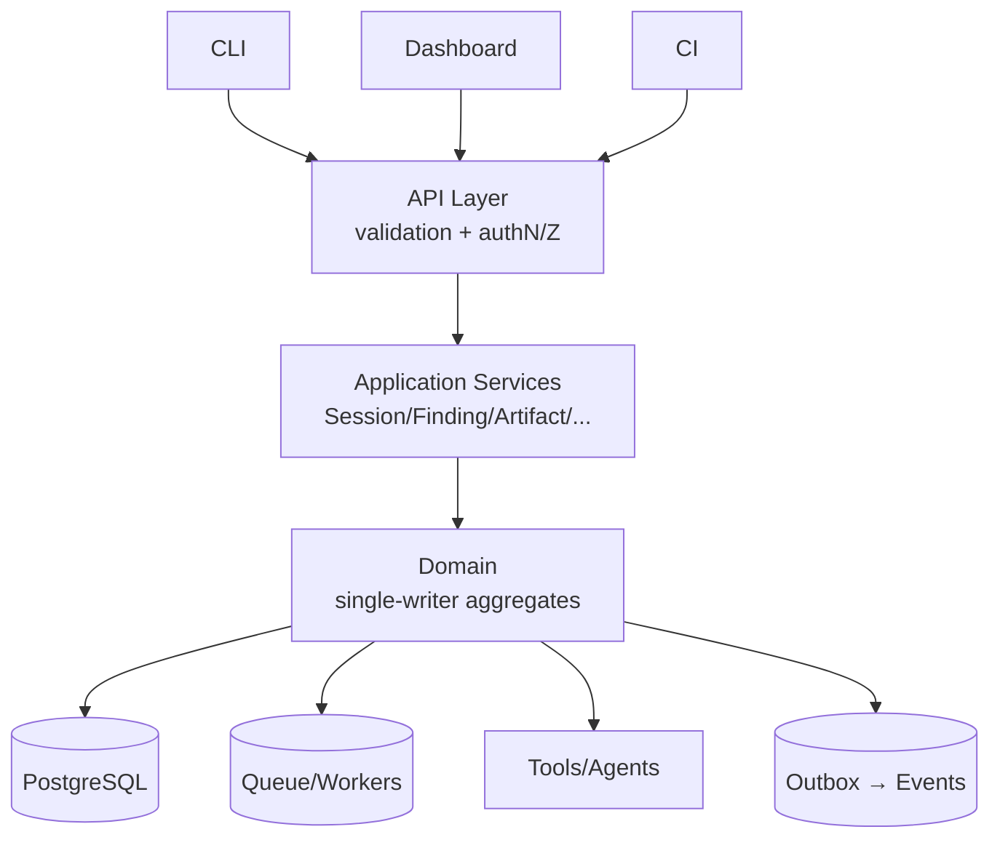
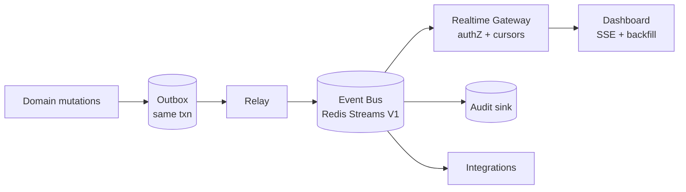
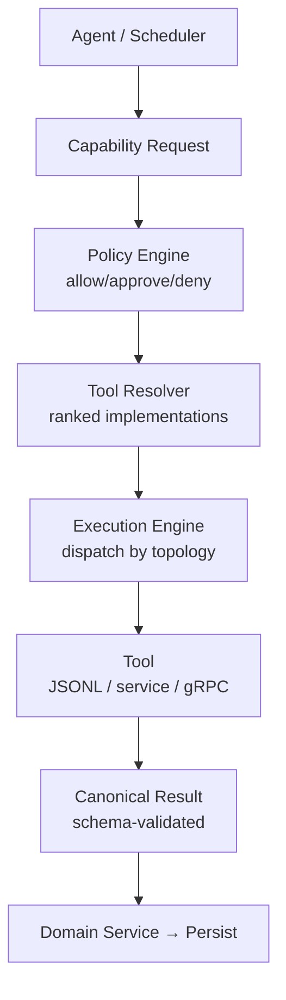
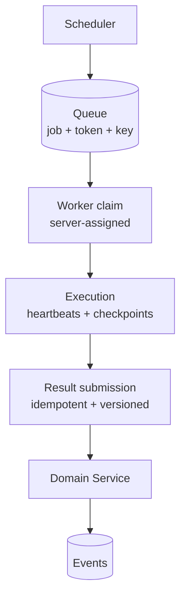
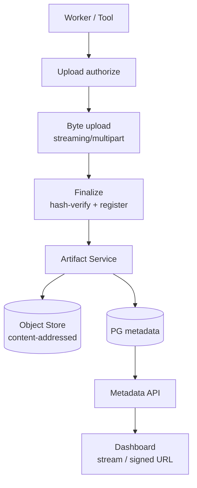

# WTT — Website Testing Tool
## API, Contract, Realtime & Integration Specification

> `API.md` — canonical contracts connecting product, architecture, rules, phases, design, tools, and data.

| Field | Value |
|---|---|
| Document Status | **Canonical — Draft for Review** |
| Version | 0.1.0 (Pre-implementation) |
| Last Updated | 2026-09-07 |
| Source PRD | `PRD.md` v0.1.0 (Pre-implementation) |
| Source Architecture | `ARCHITECTURE.md` v0.1.0 (Pre-implementation) |
| Source Rules | `RULES.md` v0.1.0 (Pre-implementation) |
| Source Phases | `PHASES.md` v0.2.0 (`WTT-P00–P48`) |
| Source Design | `DESIGN.md` v0.1.0 (Pre-implementation) |
| Source Tools | `TOOLS.md` v0.1.0 (Pre-implementation) |
| Source Tool Matrix | `TOOL-MATRIX.md` v0.1.0 (Pre-implementation) |
| Source Database | `DATABASE.md` v0.1.0 |
| API Decision Status | Decisions: §104 matrix · Open: §106 · Conflicts: §3.3 (none blocking) |
| API Version Status | Product REST: `/api/v1` (ADOPTED from ARCH §22.4/§51) · Event/contract versions: §12 |

WTT-API-DOC-001: This document is the canonical API, contract, realtime, and integration specification for WTT. It defines **which interfaces exist, who owns them, who may call them, and under which contracts** — for the product API, internal service contracts, realtime/event interfaces, and the strict separation from target-application APIs. It creates no runtime code; implementation phases implement only their scoped slices (§91, §221-rule).

WTT-API-DOC-002: Identifiers follow `WTT-API-<AREA>-<NNN>`, are stable across versions, and MUST be cited in implementation plans, reviews, and exceptions. Deprecated identifiers are marked `DEPRECATED`, never reused.

WTT-API-DOC-003: Normative language follows the PRD (`MUST`/`SHOULD`/`MAY`). Status vocabulary follows ARCH/DESIGN/DATABASE (never invented): session states (ARCH §13.1), finding states (ARCH §38 / DATABASE §40), execution statuses (TOOLS §29), worker states (ARCH §32), gate verdicts (`READY | CONDITIONALLY_READY | NOT_READY`, ARCH §22.5), risk classes (ARCH §53.2 / TOOLS §18).

WTT-API-DOC-004: All eight source documents were read in full at authorship. Every section cites its normative source(s). Where this document recommends (rather than adopts) a selection, the status is marked `RECOMMENDED` with the decision recorded in §104/`API-OD-NNN`.

---

## Table of Contents

1. [Document Control](#1-document-control)
2. [Purpose](#2-purpose)
3. [Source-of-Truth Hierarchy](#3-source-of-truth-hierarchy)
4. [API Goals](#4-api-goals)
5. [API Principles](#5-api-principles)
6. [Interface Domains](#6-interface-domains)
7. [Product API](#7-product-api)
8. [Internal Contracts](#8-internal-contracts)
9. [Target API Separation](#9-target-api-separation)
10. [REST Strategy](#10-rest-strategy)
11. [Base URL](#11-base-url)
12. [Versioning](#12-versioning)
13. [Content Types](#13-content-types)
14. [Request/Response Conventions](#14-requestresponse-conventions)
15. [Error Model](#15-error-model)
16. [HTTP Status Codes](#16-http-status-codes)
17. [Request IDs](#17-request-ids)
18. [Authentication](#18-authentication)
19. [Authorization](#19-authorization)
20. [Tenant Isolation](#20-tenant-isolation)
21. [Input & Output Validation](#21-input--output-validation)
22. [Pagination](#22-pagination)
23. [Filtering](#23-filtering)
24. [Sorting](#24-sorting)
25. [Search](#25-search)
26. [Idempotency](#26-idempotency)
27. [Concurrency](#27-concurrency)
28. [Async Operations](#28-async-operations)
29. [Cancellation & Actions](#29-cancellation--actions)
30. [Projects](#30-projects)
31. [Targets](#31-targets)
32. [Environments](#32-environments)
33. [Sessions](#33-sessions)
34. [Discovery](#34-discovery)
35. [Application Graph](#35-application-graph)
36. [Tests](#36-tests)
37. [Workflows](#37-workflows)
38. [Browser](#38-browser)
39. [DevTools](#39-devtools)
40. [Network](#40-network)
41. [Console](#41-console)
42. [Target API Testing](#42-target-api-testing)
43. [Authentication Testing](#43-authentication-testing)
44. [Authorization Testing](#44-authorization-testing)
45. [Visual](#45-visual)
46. [Accessibility](#46-accessibility)
47. [Performance](#47-performance)
48. [Security](#48-security)
49. [Load](#49-load)
50. [Target Database Testing](#50-target-database-testing)
51. [Files / Email](#51-files--email)
52. [Findings](#52-findings)
53. [Evidence](#53-evidence)
54. [Artifacts](#54-artifacts)
55. [Root Cause](#55-root-cause)
56. [Code Intelligence](#56-code-intelligence)
57. [Remediation](#57-remediation)
58. [Verification](#58-verification)
59. [Quality Gates](#59-quality-gates)
60. [Reports](#60-reports)
61. [Tools](#61-tools)
62. [Capabilities](#62-capabilities)
63. [Workers](#63-workers)
64. [Jobs](#64-jobs)
65. [AI Agents](#65-ai-agents)
66. [MCP](#66-mcp)
67. [Local Tool Protocol](#67-local-tool-protocol)
68. [gRPC](#68-grpc)
69. [Queue Contracts](#69-queue-contracts)
70. [Event System](#70-event-system)
71. [Realtime](#71-realtime)
72. [Webhooks](#72-webhooks)
73. [Configuration](#73-configuration)
74. [Integrations](#74-integrations)
75. [Audit](#75-audit)
76. [Health](#76-health)
77. [Rate Limiting & Payload Limits](#77-rate-limiting--payload-limits)
78. [Timeouts](#78-timeouts)
79. [Retries](#79-retries)
80. [Circuit Breakers](#80-circuit-breakers)
81. [CORS / CSRF / Headers](#81-cors--csrf--headers)
82. [SSRF & URL Policy](#82-ssrf--url-policy)
83. [Filesystem, Command & Database API Security](#83-filesystem-command--database-api-security)
84. [Secret Handling](#84-secret-handling)
85. [Logging](#85-logging)
86. [Observability](#86-observability)
87. [OpenAPI](#87-openapi)
88. [JSON Schema & Protobuf](#88-json-schema--protobuf)
89. [Contract Testing](#89-contract-testing)
90. [API Testing](#90-api-testing)
91. [Phase Mapping](#91-phase-mapping)
92. [V1 API](#92-v1-api)
93. [Post-V1 API](#93-post-v1-api)
94. [Enterprise API](#94-enterprise-api)
95. [API Ownership Matrix](#95-api-ownership-matrix)
96. [Permission Matrix](#96-permission-matrix)
97. [Client Matrix](#97-client-matrix)
98. [Transport Matrix](#98-transport-matrix)
99. [Sync/Async Matrix](#99-syncasync-matrix)
100. [Idempotency Matrix](#100-idempotency-matrix)
101. [Event Matrix](#101-event-matrix)
102. [Error Registry](#102-error-registry)
103. [API Decision Matrix](#103-api-decision-matrix)
104. [API Invariants](#104-api-invariants)
105. [Acceptance Criteria](#105-acceptance-criteria)
106. [Open Decisions](#106-open-decisions)
107. [Final Validation Checklist](#107-final-validation-checklist)
- [Appendix A — Spec Templates](#appendix-a--spec-templates)
- [Appendix B — Data Lineage Flows](#appendix-b--data-lineage-flows)
- [Appendix C — Architecture Diagrams](#appendix-c--architecture-diagrams)
- [Appendix D — Worked API Examples](#appendix-d--worked-api-examples)
- [Appendix E — Final Matrices (consolidated)](#appendix-e--final-matrices-consolidated)
- [Appendix F — Version History](#appendix-f--version-history)

---

## 1. Document Control

Covered by the header table plus `WTT-API-DOC-001..004` above. Change control: breaking contract changes follow §12 (versioning) and §218-rule (impact analysis, client impact, migration, tests, documentation, version decision). Terminology disputes defer to PRD Appendix B, then ARCH, then DATABASE entity names; unresolved items enter §106 as `API-OD-NNN`.

## 2. Purpose

WTT-API-PUR-001: `API.md` is the contract layer of the specification chain. It MUST answer, for every WTT interface: what exists, who owns it, who may call it, which authentication/authorization applies, request/response/error contracts, versioning, pagination, filtering, sorting, idempotency, concurrency, sync-vs-async treatment, job representation, event delivery, realtime delivery, worker/tool/agent communication, webhook ingress, artifact upload/download, security, testing, and evolution policy.

WTT-API-PUR-002: `API.md` defines **boundaries and contracts**, not implementations. It MUST NOT invent completed endpoints, permission names where the RBAC specification is unresolved (proposed names are explicitly marked `PROPOSED`), or API versions where unresolved (`/api/v1` is ADOPTED because ARCH §22.4/§51 already decides it).

WTT-API-PUR-003: Success test (master-prompt §264): an engineering agent receiving all nine specs and instructed `Implement the WTT-P01 Session API` MUST be able to determine owner, entities, route family, schemas, validation, authN/authZ, error codes, state transitions, idempotency, events, audit, and tests from §§33/95/96/98/99/100/101/102 without redesigning the contract.

## 3. Source-of-Truth Hierarchy

### 3.1 Hierarchy

```text
PRD.md            = what the product must do
   ↓
ARCHITECTURE.md  = service/module boundaries
   ↓
RULES.md         = safety/security/engineering constraints
   ↓
PHASES.md        = when APIs become necessary
   ↓
DESIGN.md        = frontend/user API needs
   ↓
TOOLS.md         = capability and tool contracts
   ↓
TOOL-MATRIX.md   = tool implementation/routing mapping
   ↓
DATABASE.md      = persistent entities and ownership
   ↓
API.md (this doc)= canonical contracts connecting all of them
```

### 3.2 Precedence rules

WTT-API-SRC-001: Higher sources win. ARCH operationalizations of PRD concepts (state machines, envelopes, endpoint namespaces) are adopted where they refine without contradicting. DATABASE entity names and ownership (§86) are adopted verbatim for resource modeling. PHASES gates timing: an API family MUST NOT be implemented before its owning phase (§91).

WTT-API-SRC-002: Recommendation statuses used in this document: `ADOPTED` (decided by a higher source) · `RECOMMENDED` (this document's selection, recorded in §103) · `PROPOSED` (candidate awaiting ratification, recorded in §106) · `DEFERRED` (explicitly out of scope for the stated release).

### 3.3 Source-variance register (conflicts and dispositions)

WTT-API-SRC-003: Two variances were found during source analysis. **Neither blocks this specification.** Both are dispositioned below in the required `API_DECISION_REQUIRED` record format; the first is already resolved downstream by DATABASE.md and is adopted here.

**API_DECISION_REQUIRED-001 — Finding-lifecycle vocabulary.**

| Field | Value |
|---|---|
| Concern | Finding lifecycle state names differ between sources. |
| Conflicting Sources | PRD `WTT-FND-003` (`open → triaged → accepted/false-positive/deferred → in-fix → fixed → verified → closed/regressed`) vs ARCH §38 + DESIGN App. B (`OPEN → INVESTIGATING → FIX_PROPOSED → FIX_APPLIED → VERIFYING → RESOLVED` + `FALSE_POSITIVE`, `ACCEPTED`, `REGRESSED`). |
| Affected API | Finding resource (§52), finding status transitions, `finding.*` events (§70). |
| Impact | API status enum, transition validation, dashboard rendering, report mapping. |
| Decision Required | Ratify canonical enum. |
| Disposition | **RESOLVED BY DATABASE.md §40** (adopted here): ARCH/DESIGN names are canonical; DATABASE carries the explicit PRD↔ARCH mapping. This document uses ARCH names everywhere and reproduces the mapping in §52. PRD intent is preserved (every PRD stage maps to an ARCH state); no PRD requirement is weakened. Status: `ADOPTED (via DATABASE)`. |

**API_DECISION_REQUIRED-002 — V1 verification scope.**

| Field | Value |
|---|---|
| Concern | DESIGN §78/P30 lists `Verification records (§40)` as V1-selected, while DATABASE §82 explicitly excludes `verifications/checks/regressions` tables from V1 migrations. |
| Conflicting Sources | DESIGN.md §78 vs DATABASE.md §§81–82. |
| Affected API | Verification API family (§58). |
| Impact | Whether V1 ships dedicated verification resources/endpoints or derived read-only summaries. |
| Decision Required | V1-freeze ratification. |
| Disposition | **RECOMMENDED (this document)**: V1 exposes verification *information* derived from `test_executions`/`tool_executions` re-runs (read-only summaries, no dedicated tables); the dedicated Verification API (verifications, checks, regression plans/executions) is POST_V1 per DATABASE §83. Rationale: honors DATABASE's migration prohibition while satisfying DESIGN's display need. Status: `RECOMMENDED`, ratify at V1 freeze (`API-OD-001`). |

## 4. API Goals

WTT-API-GOAL-001: The API architecture MUST support the full `wtt <URL>` flow end-to-end: CLI → Control Plane → Session → Dashboard → Browser/Discovery/Tests → Tools/Agents/Workers → Evidence/Artifacts → Findings → Root Cause → Remediation → Verification → Quality Gate → Reports — with every hop contract-typed, authorized, observable, and auditable.

WTT-API-GOAL-002: Goals (traced): preserve `wtt <URL>` as primary entrypoint (ARCH-G-001) · run excellently on one machine, scale by configuration (ARCH-G-002) · keep AI subordinate to deterministic policy (ARCH-G-003) · every claim evidence-backed, every mutation reversible and auditable (ARCH-G-004) · every integration replaceable behind versioned contracts (ARCH-G-005) · bound blast radius per failure domain (ARCH-G-006) · ship V1 on stable contracts later capabilities plug into unchanged (ARCH-G-007).

## 5. API Principles

WTT-API-PRN-001: Canonical principles (all normative):

```text
Contract-first · Version-aware · Server-authoritative · Security-first ·
Consistent · Predictable · Idempotent where required · Observable ·
Pagination-aware · Async-aware · Failure-explicit · Schema-validated ·
Backward-compatible · Capability-driven · Evidence-linked · Policy-gated
```

WTT-API-PRN-002: Prohibited (RULES §21 + ARCH-510): ad hoc controller responses · per-module error formats · frontend-specific hidden endpoints · raw database exposure · vendor-specific tool payloads as product contracts · unbounded list endpoints · silent breaking changes · optimistic verdicts by clients (DESIGN invariant 9).

WTT-API-PRN-003: Layering (master-prompt §207, ARCH §14): `Route → Validation → Authorization → Application Service → Domain → Repository/Tool`. Controllers/routes MUST NOT own complex business logic or touch tables outside their repository boundary (DATABASE §10, RULES `WTT-RULE-DB-003`).

## 6. Interface Domains

WTT-API-DOM-001: Four interface domains are legally distinct. Confusing them is a design violation (ARCH §23.3).

### A. WTT Product API

Consumers: Dashboard, CLI, desktop/UI clients, CI integrations, approved external clients. Transport: REST + JSON at `/api/v1/...` (ARCH §22.4/§51) plus realtime streams (§71). Example: `/api/v1/sessions`, `/api/v1/findings`, `/api/v1/reports`. Specified in §§7, 10–60, 73–75.

### B. WTT Internal Service Contracts

Consumers: control plane ↔ workers ↔ tools ↔ agents ↔ services. Transports per ARCH §31 / TOOL-MATRIX §20: in-process calls, stdio JSON Lines, local HTTP/gRPC (Unix socket/named pipe/loopback), distributed gRPC + queue + event relay, MCP (enterprise/partner only). Never exposed publicly unless explicitly promoted. Specified in §§8, 61–69.

### C. WTT Realtime/Event Interfaces

Consumers: dashboard live updates, worker activity, browser events, tool progress, finding updates, fix/verification status. Transports: event bus (Redis Streams V1, ARCH §34–35) + dashboard delivery via SSE primary / WebSocket where bidirectional (§71). Specified in §§70–71.

### D. Target Application APIs

Definition: APIs **discovered and tested by** WTT (e.g., `GET /api/orders`, `POST /api/login`, target GraphQL/gRPC/WebSocket). These are test subjects recorded in `api_endpoints` (DATABASE §26), NEVER WTT control-plane routes. WTT's records *about* target API testing live in §42 under `/api/v1/...` resource paths that cannot collide with target paths (different host/origin by construction, ARCH §16.1).

## 7. Product API

WTT-API-PROD-001: The Product API is versioned REST + JSON (ARCH §22.4): `/api/v1/projects|targets|sessions|tests|findings|artifacts|tools|workers|fixes|reports|gates|config|audit` (+ families below), OpenAPI-published, with local-token auth V1 (OIDC/OAuth enterprise), RBAC, idempotency keys, pagination/filter/sort, stable error envelope, rate limits, and mutation audit (ARCH-510).

WTT-API-PROD-002: Product resource families (route-family summary; full specs §§30–60, 73–75):

| Family | Root path(s) | Owner (DATABASE §86) |
|---|---|---|
| Projects | `/api/v1/projects` | Project Service |
| Targets | `/api/v1/targets`, nested under projects | Target Manager |
| Environments | `/api/v1/environments` | Environment Service |
| Sessions | `/api/v1/sessions` | Session Manager |
| Runs | `/api/v1/sessions/{id}/runs` | Session Manager |
| Discovery | `/api/v1/sessions/{id}/discovery/...` | Discovery Engine |
| Application graph | `/api/v1/sessions/{id}/graph/...` | Graph Store |
| Tests | `/api/v1/sessions/{id}/tests`, `/test-plans` | Test Planning / Execution Engine |
| Workflows | `/api/v1/workflows`, `/sessions/{id}/workflows` | Workflow Service |
| Browser | `/api/v1/sessions/{id}/browser` | Browser Workers (via CP) |
| DevTools/network/console | `/api/v1/sessions/{id}/devtools/...`, `/network`, `/console` | Collectors |
| Target API testing | `/api/v1/sessions/{id}/api-endpoints`, `/api-executions` | API Services |
| AuthN/AuthZ testing | `/api/v1/sessions/{id}/auth/...`, `/authz-matrix` | Auth Services |
| Visual | `/api/v1/sessions/{id}/visual/...` | Visual Service |
| Accessibility | `/api/v1/sessions/{id}/accessibility/...` | A11y Services |
| Performance | `/api/v1/sessions/{id}/performance/...` | Perf Services |
| Security | `/api/v1/sessions/{id}/security/...` | Security Services |
| Load | `/api/v1/sessions/{id}/load/...` | Load Services |
| Target DB | `/api/v1/target-db/...` | DB Testing Service |
| Files/email | `/api/v1/sessions/{id}/files`, `/emails` | File/Email Services |
| Findings | `/api/v1/findings`, `/api/v1/sessions/{id}/findings` | Finding Engine |
| Evidence | `/api/v1/evidence` | Evidence Collector |
| Artifacts | `/api/v1/artifacts` | Artifact Service |
| Root cause | `/api/v1/findings/{id}/root-cause` | Root Cause Engine |
| Code intelligence | `/api/v1/projects/{id}/code/...` | Code Intelligence |
| Remediation | `/api/v1/fixes`, `/checkpoints`, `/patches` | Remediation Service |
| Verification | `/api/v1/verifications` | Verification Service |
| Quality gates | `/api/v1/gates`, `/quality-policies` | Gate Evaluator |
| Reports | `/api/v1/reports` | Report Builder |
| Tools | `/api/v1/tools` | Tool Registry |
| Capabilities | `/api/v1/capabilities` | Tool Registry |
| Workers | `/api/v1/workers` | Scheduler |
| Jobs | `/api/v1/jobs` | Scheduler |
| Agents/AI | `/api/v1/agents`, `/ai-invocations` | AI Orchestrator |
| Events (read) | `/api/v1/sessions/{id}/events` | Event Router |
| Configuration | `/api/v1/config` | Config Service |
| Integrations | `/api/v1/integrations` | Integration Hub |
| Audit | `/api/v1/audit-events` | Audit Sink |
| History/compare | `/api/v1/history`, `/compare` | Analytics Services |
| Search | `/api/v1/search` | Federated Search |
| Webhooks (inbound) | `/api/v1/webhooks/{provider}` | Integration Hub |

WTT-API-PROD-003: Dashboard uses product APIs only. It MUST NOT query PostgreSQL directly, call tool/carrier APIs directly, call AI providers directly, or invoke local binaries directly (§217-rule, DATABASE §10).

## 8. Internal Contracts

WTT-API-INT-001: Internal surfaces (ARCH §51): **Internal Worker API** (job claim/heartbeat/result/artifact-upload; mTLS/token, network-restricted) and **Tool Execution Protocol** (stdio-JSONL / local-RPC / gRPC per ARCH §31; never public). Plus: AI invocation gateway contract, queue message contracts, and (enterprise) MCP server bindings.

WTT-API-INT-002: Internal contracts are versioned independently of the product API (§12.3) but with the same discipline: typed schemas in `contracts/` (ARCH-310), generated TS/Python/Java bindings, version negotiation with actionable mismatch errors (ARCH-510), never silent skew.

WTT-API-INT-003: No premature microservices (§206-rule): V1 is a modular monolith (ARCH §2/§8); internal interfaces are logical/library-first and become network boundaries only when deployment requires. A module boundary becoming a network boundary requires an ADR + versioned contract + authN/authZ (§219 review trigger).

## 9. Target API Separation

WTT-API-SEP-001 (NON-NEGOTIABLE): WTT control-plane/user APIs and target-application APIs are always separate (§254 invariant 1). Enforcement: distinct origins (dashboard vs controlled browser share no origin/storage/trust, ARCH §16.1); target traffic flows through the Target Manager + Network Policy + scope (§82); target-derived data is untrusted (§21) and sanitized before API/UI use.

WTT-API-SEP-002: Naming discipline: product paths describe WTT resources (`/api/v1/sessions/{id}/api-endpoints` = WTT's *records* of discovered target endpoints). WTT MUST NEVER proxy arbitrary target paths under its own API namespace, and MUST NEVER route a target path to a control-plane handler.

WTT-API-SEP-003: Protocol-neutral target testing (ARCH §22.1) is capability-driven (`api.*`, `graphql.*`, `grpc.*`, `soap.*`, `websocket.*`, `messaging.*`, `contract.*`, `mock.*`); the adapters are internal tools, and their results surface only as normalized WTT resources (§42).

## 10. REST Strategy

WTT-API-REST-001: Approved external/product style: **REST + JSON** with OpenAPI + JSON Schema contracts (ADOPTED, ARCH §22.4/§31/§51). Other protocols only where technically justified:

| Need | Protocol | Authority |
|---|---|---|
| Dashboard live updates | SSE (primary V1) / WebSocket (bidirectional) | ARCH §35, §71 |
| Local short-lived tools | stdin/stdout JSON Lines | ARCH §31, §67 |
| Local persistent services | Unix socket / named pipe → loopback HTTP → gRPC | ARCH §31 |
| Distributed workers | gRPC + message queue + event relay | ARCH §31–33, §§68–69 |
| Hot/typed internal paths | Protobuf | ARCH §31, §88 |
| Approved partner integrations | MCP (enterprise only, not V1) | TOOLS §42, §66 |
| Async distributed execution | Queue / event bus (BullMQ-class + Redis Streams V1) | ARCH §49, §69 |

WTT-API-REST-002: No GraphQL product API in V1 (RECOMMENDED): REST + `include` (§14.8) + federated search (§25) + realtime streams cover DESIGN's needs without a second query runtime. GraphQL *target* testing (§42) is unrelated to this decision. Status: `RECOMMENDED` (`API-OD-002`).

## 11. Base URL

WTT-API-URL-001: Product API namespace is `/api/v1` (ADOPTED, ARCH §22.4/§51). Examples: `/api/v1/sessions`, `/api/v1/findings`, `/api/v1/tools`. Internal worker/tool surfaces MUST NOT live under `/api/v1` (separate bind address/path with network restriction, ARCH §51).

WTT-API-URL-002: The control plane serves the product API on loopback by default in local mode; team/enterprise deployments bind per deployment config with TLS termination at the deployment edge (§205: no mandatory enterprise gateway for local WTT).

## 12. Versioning

### 12.1 Product API versioning

WTT-API-VER-001: URI versioning (ADOPTED via ARCH `/api/v1`). Breaking changes require a new version + migration period + deprecation notice + compatibility documentation (ARCH-510: additive changes minor; removals major with deprecation window).

WTT-API-VER-002: Compatibility classes (§148): `NON_BREAKING` (new optional field, new endpoint, new enum value where clients are tolerant) · `BREAKING` (rename/remove required field, change enum meaning, remove endpoint, tighten validation) · `BEHAVIORAL` (same schema, different semantics — treated as breaking for gated operations) · `SECURITY` (may break insecure usage with expedited notice + migration path).

WTT-API-VER-003: Deprecation protocol (§147): deprecated endpoints/fields MUST return `Deprecation` + `Sunset` headers and a `meta.deprecation` notice (§14.3) naming replacement, migration guidance, and removal plan. Silent removal is a defect.

### 12.2 What "V1" means here

WTT-API-VER-004: `/api/v1` is the API major version, independent of product release phases. V1 product scope ships a *subset* of v1 families (§92); post-V1 families extend v1 additively until a breaking change forces `/api/v2`.

### 12.3 Independent contract versioning

WTT-API-VER-005: Versioned separately (never assumed to evolve together): REST API (`/api/vN`) · Event schemas (`version` per event type, ARCH §34) · Tool Contract (contract version, gateway rejects incompatible majors, ARCH-280) · Worker contract · Queue message schemas · Webhook contracts · Report model (versioned, ARCH §51.3) · Quality-gate logic (versioned, PRD `WTT-GATE-002`).

## 13. Content Types

WTT-API-CT-001: Default `application/json; charset=utf-8` for product REST request/response bodies.

WTT-API-CT-002: Special cases only where required: `multipart/form-data` (file upload legs) · `application/octet-stream` (artifact streaming) · `text/event-stream` (SSE) · `application/x-ndjson` (log/event export streams) · renderer media types for report downloads (`text/html`, `application/pdf`, `text/csv`, etc., §60).

WTT-API-CT-003: JSON MUST be UTF-8, objects with string keys, no duplicate keys, no `NaN`/`Infinity` (use `null` + explicit status, §14.6).

## 14. Request/Response Conventions

### 14.1 Canonical success envelope (DECIDED)

WTT-API-ENV-001: All normal product-API JSON responses use ONE envelope (RECOMMENDED, no source conflict — ARCH mandates "stable error envelope" and leaves success shape open):

```json
{
  "data": {},
  "meta": {
    "requestId": "req_01J...",
    "timestamp": "2026-09-07T12:00:00.000Z",
    "deprecation": null,
    "page": { "nextCursor": "...", "limit": 50 }
  }
}
```

Rules: `data` is the resource, collection (`items` + paging in `meta.page`, §22), or operation result; `meta.requestId` echoes §17; `meta.page` appears only on paginated reads; `meta.deprecation` appears only on deprecated surfaces (§12.1). Binary/streaming downloads and realtime frames are exempt (their own framing, §§54/71). `204 No Content` carries no body.

### 14.2 Error envelope

See §15 (canonical `{ "error": { code, category, severity, retryable, userMessage, technicalMessage, correlationId, ... } }`, ADOPTED from ARCH §51/§60).

### 14.3 Meta rules

WTT-API-ENV-002: Unknown `meta` members MUST be ignored by clients (forward-compatible). Servers MUST NOT place domain data in `meta` (it belongs in `data`).

### 14.4 Timestamps

WTT-API-FMT-001: ISO 8601 / RFC 3339 UTC (`2026-09-07T12:00:00.000Z`) for all API timestamps (DATABASE §13 `timestamptz`). No ambiguous formats.

### 14.5 Units

WTT-API-FMT-002: Explicit unit suffixes: `durationMs`, `sizeBytes`, `latencyMs`, `timeoutMs`. Bare `duration`/`size` are prohibited in v1 contracts.

### 14.6 Nullability

WTT-API-FMT-003: `missing` (field absent) = not requested/not applicable to this view · `null` = applicable but no value · `NOT_RUN`/`NOT_EVALUATED`/`UNKNOWN` status enums = capability never ran — NEVER `score: 0` or `pass` (DESIGN invariant 5, §149). Empty collections are `[]`, never `null`.

### 14.7 Enum evolution

WTT-API-FMT-004: Clients MUST handle unknown future enum values safely (render `Unknown (<value>)`, never crash) (§150). Servers add enum values as `NON_BREAKING` only when old-client tolerance is specified; changing an enum's meaning is `BREAKING`.

### 14.8 Field selection / include

WTT-API-FMT-005: `include` is supported ONLY where it avoids expensive child loading (explicit per-endpoint allowlist, e.g., `GET /sessions/{id}?include=summary`). No general GraphQL-like selection in REST v1 (§28).

### 14.9 Resource IDs in the API

WTT-API-FMT-006: Public API uses `public_id` (`ses_…`, `run_…`, `tst_…`, `fnd_…`, `art_…`, `fix_…`, `ver_…`, DATABASE §12), never internal UUIDs or sequential integers. Human refs (`WTT-YYYYMMDD-NNNNNN`, PRD `WTT-SES-001`) are display-only (`displayRef`). IDs are opaque: possession implies nothing about permission (§19.4).

### 14.10 URLs in responses

WTT-API-FMT-007: Responses MUST NOT contain local filesystem paths. Artifact access uses capability URLs/references (§54). Target URLs are data (untrusted, §21), never control-plane links. No HATEOAS (§156): explicit documented routes suffice.

### 14.11 Boolean / naming conventions

WTT-API-FMT-008: Booleans use `is*`/`has*`/`requires*`/`supports*` prefixes consistently (`isHealthy`, `requiresAuthorization`). Resource fields are `camelCase` in JSON (database columns remain `snake_case`; the API layer translates — RECOMMENDED for TS/Python/Java binding consistency, `API-OD-003`).

## 15. Error Model

WTT-API-ERR-001: ONE canonical error model (ADOPTED field set from ARCH-510/ARCH §60, wrapped in `{ "error": … }`):

```json
{
  "error": {
    "code": "SESSION_NOT_FOUND",
    "category": "SESSION",
    "severity": "ERROR",
    "retryable": false,
    "userMessage": "Session not found. It may have been deleted or you may lack access.",
    "technicalMessage": "session public_id=ses_... has no row",
    "correlationId": "req_01J...",
    "fieldErrors": [{ "field": "target", "code": "INVALID_URL", "message": "..." }],
    "details": { "resource": "session", "id": "ses_..." }
  }
}
```

Field rules: `code` (required, `NAMESPACE_SPECIFIC`, §102) · `category` (required, §102 families) · `severity` (`INFO | WARNING | ERROR | CRITICAL`) · `retryable` (required boolean, drives §79) · `userMessage` (required, safe, actionable: what happened + what was preserved + exact next command, ARCH §60) · `technicalMessage` (required, safe detail — NEVER stack/SQL/path/secret, RULES §21) · `correlationId` (required, = request correlation, §17) · `fieldErrors` (validation only) · `details` (optional safe structured context).

WTT-API-ERR-002: Forbidden in errors: stack traces, SQL, filesystem paths, credentials, secrets, internal hostnames beyond need (RULES `WTT-RULE-API-003`). Detailed diagnostics stay in secure server logs keyed by `correlationId`.

WTT-API-ERR-003: Error taxonomy namespaces (ADOPTED pattern from ARCH §60 + TOOLS §32, extended per domain):

```text
VALIDATION_* · AUTH_* · PERMISSION_* · TARGET_* · SCOPE_* · SESSION_* ·
RUN_* · BROWSER_* · DISCOVERY_* · GRAPH_* · TEST_* · WORKFLOW_* · API_TEST_* ·
AUTHN_* · AUTHZ_* · VISUAL_* · A11Y_* · PERF_* · SECURITY_* · LOAD_* ·
TARGET_DB_* · FILE_* · EMAIL_* · TOOL_* · CAPABILITY_* · WORKER_* · JOB_* · QUEUE_* ·
AGENT_* · AI_* · ARTIFACT_* · EVIDENCE_* · FINDING_* · RCA_* · CODE_* · FIX_* ·
VERIFICATION_* · GATE_* · REPORT_* · CONFIG_* · SECRET_* · INTEGRATION_* ·
WEBHOOK_* · AUDIT_* · RATE_LIMIT_* · TIMEOUT_* · CONFLICT_* · NOT_FOUND_* · INTERNAL_*
```

## 16. HTTP Status Codes

WTT-API-HTTP-001: Consistent mapping (ADOPTED from ARCH-510 + §13 guidance):

| Status | Meaning | Use for |
|---|---|---|
| 200 | OK | Successful read/update; sync action result |
| 201 | Created | Resource created (`Location` header + body) |
| 202 | Accepted | Async work accepted; returns operation handle (§28) |
| 204 | No content | Successful operation with no body |
| 400 | Bad request | Malformed syntax, failed validation (`VALIDATION_*`) |
| 401 | Unauthorized | Not authenticated (`AUTH_*`) |
| 403 | Forbidden | Authenticated but forbidden OR policy-blocked (`PERMISSION_*`, `TOOL_BLOCKED_BY_POLICY`, scope denial — Appendix D.4) |
| 404 | Not found | No such resource (or hidden by authorization — §19.4) |
| 409 | Conflict | State conflict, idempotency-key reuse with different payload, version mismatch |
| 412 | Precondition failed | `If-Match` / precondition failure (§27) |
| 422 | Unprocessable | Well-formed but semantically invalid operation (adopted for v1: illegal state transition, unsatisfiable capability request) |
| 429 | Rate limited | Quota/rate exceeded (`RATE_LIMIT_*`, with `Retry-After`) |
| 500 | Internal | Unexpected failure (`INTERNAL_*`) |
| 502/503 | Bad gateway / Unavailable | Dependency unavailable (DB/queue/model-provider), with `retryable` + degraded semantics (ARCH §61) |
| 504 | Gateway timeout | Bounded upstream timeout surfaced (§78) |

WTT-API-HTTP-002: Never `200` with `{ success:false }` for real failures. CLI exit codes (PRD `WTT-CLI-041`: 0/1/2/3/4/5/6) map from verdicts + error categories, not raw HTTP statuses.

## 17. Request IDs

WTT-API-REQ-001: Every inbound request receives `requestId` (`req_<sortable>`). Distributed operations carry `correlationId` (= requestId of the originating request unless joining an existing trace), `traceId` (OTel), and `sessionId` where relevant (ARCH §34 envelope carries `correlationId` + `causationId`; PRD `WTT-EVT-003`).

WTT-API-REQ-002: `requestId` is returned in `meta.requestId` and in the `X-Request-Id` response header; `correlationId` appears in errors (§15). CLI `--json` output and structured logs (PRD `WTT-CLI-043`) MUST include the same IDs. Logs record IDs, never secrets (§85).

## 18. Authentication

WTT-API-AUTHN-001: Modes (ADOPTED, ARCH §22.4/§23.3/§51): **local single-user** (loopback token + OS-user trust — V1 default; `wtt <URL>` MUST work with zero auth ceremony, §19 local-first) · **authenticated local/remote** · **enterprise multi-user** (OIDC/OAuth, P47) · **CI/service-account** (scoped tokens, ARCH §67 pre-approval tokens).

WTT-API-AUTHN-002: V1 mechanism: local token (`Authorization: Bearer <token>`, loopback-bound, file-permission-protected). Enterprise: OIDC/OAuth (+ SSO/SCIM panels, DESIGN §80). Service/CI: short-lived scoped tokens with least privilege. Worker/internal: mTLS or signed short-lived worker tokens, network-restricted (ARCH §51, §63).

WTT-API-AUTHN-003: AuthN matrix (§175, summarized; full matrix Appendix E): local CLI → loopback token/implicit OS trust · dashboard (local) → same-origin token · dashboard (remote/team) → session/OIDC per deployment · CI → service token · remote worker → mTLS/token · external integration → webhook signatures (§72), never ambient trust · admin → elevated enterprise auth + MFA policy (P47).

WTT-API-AUTHN-004: Unauthenticated surface is minimal and explicit: `/healthz` (+ version/build metadata), no domain reads, no mutations, no diagnostics beyond liveness (§76). `wtt doctor` richer diagnostics stay local/privileged (§135-rule).

## 19. Authorization

WTT-API-AUTHZ-001: Every product/internal API enforces server-side authorization (ARCH-510 RBAC; RULES §21). Platform permissions are **disjoint** from target-application roles under test — confusing them is a design violation (ARCH §23.3).

WTT-API-AUTHZ-002: Platform permission concepts (ADOPTED as concepts from ARCH §23.3: run sessions, approve gates, manage scope/policy, reveal secrets, administer). Final RBAC names are owned by P47; this document uses the following `PROPOSED` identifiers so endpoint families can state requirements today (ratify in P47, `API-OD-004`):

```text
project.view · project.manage · session.view · session.run · session.cancel ·
finding.view · finding.manage · tool.view · tool.execute ·
security.active.execute · load.execute · fix.propose · fix.apply ·
verification.run · report.view · report.export · gate.approve ·
scope.manage · policy.manage · secret.reveal · worker.view · worker.manage ·
config.view · config.manage · audit.view · admin.*
```

WTT-API-AUTHZ-003: Tool *execution* permissions are the separate TOOLS §17 namespace (`browser.control`, `network.target`, `filesystem.project.write`, …) granted to tool executions via policy tokens — NOT user permissions. User permission `tool.execute` gates *requesting* execution; the tool permission set gates *what the execution may touch* (TOOLS §17/§19, ARCH §14.3).

WTT-API-AUTHZ-004: Resource scope: IDs alone are not authorization (§17-rule). A caller with `session.view` MUST still be scoped to the project/workspace/organization owning the session; cross-project/cross-tenant access is denied (and SHOULD return 404 rather than 403 where existence itself is sensitive).

WTT-API-AUTHZ-005: Deny wins; absence of authorization denies gated classes (ARCH §14.3). Policy decisions are versioned, logged, and auditable (PHASES P02: principal/target/class/rule/version).

## 20. Tenant Isolation

WTT-API-TEN-001: V1 is single-operator local-first (DATABASE §14): no org/workspace tables, no RLS. Enterprise (P47/DATABASE §84): all tenant-scoped reads/writes MUST enforce `organization/workspace` server-side (RLS evaluated then, DATABASE §72).

WTT-API-TEN-002: Never trust `organizationId`/`workspaceId` from the client without authorization validation. Tenant context derives from the authenticated principal; request-supplied tenant fields are either ignored or verified and rejected on mismatch (`PERMISSION_TENANT_MISMATCH`).

## 21. Input & Output Validation

WTT-API-VAL-001: Validate ALL external input at API boundaries (RULES `WTT-RULE-API-002`): path/query params, headers, JSON, multipart, webhook payloads, tool results, worker results, AI results. Treat all as untrusted — including target-derived content (RULES invariant 2) and AI output (untrusted until schema-validated, ARCH §26.1 four-strata model).

WTT-API-VAL-002: Critical outputs are validated before crossing boundaries: tool outputs (gateway schema validation, ARCH-280), worker submissions, AI structured outputs (schema-conformant or rejected/retried, §65), external provider data, webhook payloads. Invalid AI output for automation schemas (`TestPlanProposal`, `RootCauseAnalysis`, `FixProposal`, `ToolSelectionRecommendation`, …) is rejected/retried safely, never applied.

WTT-API-VAL-003: Schema enforcement points: product REST (OpenAPI request validation, §87) · worker/tool (JSON Schema/Protobuf, ARCH-310 `contracts/`) · configuration (versioned schemas, §73) · scope files (`apiVersion`'d, PHASES P02) · manifests (TOOLS §41 registration flow).

## 22. Pagination

WTT-API-PAGE-001: High-volume resources REQUIRE pagination: sessions, runs, events, tests, executions, findings, artifacts, evidence, network exchanges, console logs, tool executions, workers/jobs, audit events, reports. Unbounded `GET /events` (or any list) is prohibited.

WTT-API-PAGE-002: Cursor-based pagination is the default for session-scoped/high-volume/realtime histories (RECOMMENDED): opaque `cursor` query param + `limit`; response `meta.page = { nextCursor, prevCursor?, limit }`. Offset (`page`/`offset`) is permitted ONLY for small, stable registries (tool catalog, config lists) and MUST still enforce max page size. Rationale: cursor stability under concurrent inserts; offset simplicity where churn is nil. (`API-OD-005` ratifies cursor encoding: base64url of `(seq,id)` tuple — PROPOSED.)

WTT-API-PAGE-003: Page size: `default` + `maximum` are policy-configured per resource family (no invented global numbers in this spec); responses MUST echo effective `limit`. Clients MUST NOT assume a default.

## 23. Filtering

WTT-API-FILT-001: Explicit per-endpoint filter allowlists only (status, severity, category, environment, tool, capability, target, date range, …). Unknown filter keys are rejected (`VALIDATION_UNKNOWN_FILTER`), never ignored silently (silent ignore hides operator error).

WTT-API-FILT-002: Date ranges use `from`/`to` (RFC 3339). Multi-value filters repeat the key (`?status=OPEN&status=INVESTIGATING`) or use documented comma form per endpoint — one form per endpoint, documented in OpenAPI.

## 24. Sorting

WTT-API-SORT-001: One syntax (RECOMMENDED): `?sort=<field>&order=<asc|desc>`, `order` default `desc` for time-series, else endpoint-documented. Sortable fields are whitelisted per endpoint; never interpolate client fields into SQL (DATABASE §78). (`API-OD-006`.)

## 25. Search

WTT-API-SEARCH-001: Resource search (`?search=` on list endpoints) is per-endpoint substring/prefix over documented fields — never wildcard SQL across tables. Global/federated search (DESIGN Command Palette need) is ONE endpoint, `GET /api/v1/search?q=&types=&limit=`, permission-filtered (never leaks inaccessible projects), with bounded result counts per type (POST_V1 depth; V1 minimal per §92).

## 26. Idempotency

WTT-API-IDEM-001: Mutations likely to be retried MUST support idempotency via `Idempotency-Key` header (ADOPTED pattern, ARCH-510/§61): session creation, job submission, tool-result submission, artifact finalize, webhook ingestion, report generation, fix apply, baseline approval.

WTT-API-IDEM-002: Semantics: same key + same payload → same result (replay); same key + different payload → `409 IDEMPOTENCY_CONFLICT`. Scope: per authenticated principal + operation family; keys expire per policy (PROPOSED default 24h, `API-OD-007`); storage in `idempotency_keys` (DATABASE §82 V1). Full matrix §100.

## 27. Concurrency

WTT-API-CONC-001: Optimistic concurrency for important mutable resources (configuration, quality policy, finding manual state, project settings, visual baselines): `version` integer + `ETag` / `If-Match` (RECOMMENDED mechanism; `API-OD-008`). Stale writes fail `409`/`412` with current representation — never silent overwrite. Session transitions use the Session Manager single-writer + version column (ARCH-120).

WTT-API-CONC-002: Locking prefers narrow over global (RULES `WTT-RULE-QUE-002`); scheduler protects CPU/RAM/browser slots/DB/AI budgets.

## 28. Async Operations

WTT-API-ASYNC-001: Long-running work MUST NOT hold HTTP requests open (ARCH §15 job contract; TOOLS §29). Pattern: `POST` → `202 Accepted` + operation handle → status endpoint + realtime events:

```json
{ "data": { "operationId": "op_...", "status": "QUEUED", "resourceType": "report", "resourceId": "rpt_..." } }
```

WTT-API-ASYNC-002: Operation lifecycle (aligned with TOOLS §29 execution statuses): `QUEUED → PREPARING → RUNNING → SUCCEEDED | FAILED | CANCELLED | TIMED_OUT | BLOCKED | DEGRADED`. `GET /api/v1/operations/{id}` (or the resource's status view) returns state + progress + result link + error. Matrix §99.

WTT-API-ASYNC-003: Session start itself is async after creation: `POST /sessions → 201 (CREATED)` then progression via transitions + `session.*` events; the CLI polls/streams rather than blocking (§33).

## 29. Cancellation & Actions

WTT-API-ACT-001: Long-running operations support cancellation where technically possible (TOOLS §31: `cancellable` declaration; graceful drain + checkpoint, forced escalation, cleanup, partial salvage): `POST /sessions/{id}/cancel`, `POST /tool-executions/{id}/cancel`, `POST /jobs/{id}/cancel`, `POST /load-runs/{id}/abort`, `POST /security-scans/{id}/abort` (security/load MUST stop promptly).

WTT-API-ACT-002: Action endpoints are used sparingly, ONLY for non-CRUD lifecycle transitions: `/pause`, `/resume`, `/cancel`, `/fixes/{id}/apply`, `/fixes/{id}/rollback`, `/verifications/{id}/run`→(POST_V1 `/verifications`), `/baselines/{id}/approve`. Plain field updates use `PATCH` on the resource. Every action is authorized, policy-checked, evented, and audited.

---

# PRODUCT API DOMAIN SPECIFICATIONS (§§30–60)

Conventions for §§30–60: each family states Purpose · Phase · Release · Visibility · Owner · routes table · auth/permission/risk · I/O summary · errors · idempotency/concurrency · events · audit · notes. Full JSON Schemas live in `contracts/` + OpenAPI (§87); this document fixes semantics, not every field. `Status: SPECIFIED` means specified here, not implemented (no implementation claims — §222-rule).

## 30. Projects

Purpose: durable containers for targets, environments, scope, policy, history (PRD `WTT-SES-001`). Phase: P01. Release: V1_REQUIRED. Visibility: product. Owner: Project Service (entities `projects`, DATABASE §15).

| Method | Path | Purpose |
|---|---|---|
| GET | `/api/v1/projects` | List (paginated, scoped) |
| POST | `/api/v1/projects` | Create (local CLI may auto-create on `wtt <URL>`) |
| GET | `/api/v1/projects/{id}` | Read incl. settings refs |
| PATCH | `/api/v1/projects/{id}` | Update settings (concurrency-guarded) |
| GET | `/api/v1/projects/{id}/targets` | Targets in project |
| GET | `/api/v1/projects/{id}/sessions` | Session history (summary) |

Auth: local-token V1 / OIDC enterprise. Permission: `project.view` (reads), `project.manage` (mutations) — PROPOSED names §19. Risk: reads `READ_ONLY`; mutations `PROJECT_WRITE` (local) and audited. Request: name/slug, defaults (scope profile, gate policy ref, retention policy ref). Response: project + `displayRef`. Errors: `VALIDATION_*`, `NOT_FOUND_PROJECT`, `CONFLICT_SLUG`. Idempotency: create supports `Idempotency-Key`. Concurrency: `version`/`If-Match` on PATCH. Events: `project.created/updated` (plan.* family note §70). Audit: create/update. Notes: V1 local-first auto-manages projects; enterprise UI manages explicitly (P47).

## 31. Targets

Purpose: normalized URL + environment + scope context under test (PRD `WTT-SES-001`, ARCH §13). Phase: P01/P02. Release: V1_REQUIRED. Visibility: product. Owner: Target Manager (`targets`, DATABASE §16).

| Method | Path | Purpose |
|---|---|---|
| POST | `/api/v1/targets/resolve` | Normalize + classify URL, resolve project/env/scope (pre-session) |
| GET/POST | `/api/v1/projects/{id}/targets` | List / register target |
| GET/PATCH | `/api/v1/targets/{id}` | Read (fingerprint, scope refs) / update metadata |
| GET | `/api/v1/targets/{id}/scope` | Effective scope evaluation for target |
| POST | `/api/v1/targets/{id}/validate-scope` | Dry-run scope check for an intended operation class |

Auth/Permission: `project.view` / `project.manage` (+ `scope.manage` for scope changes). Risk: `READ_ONLY` (resolve/validate) · scope changes audited. Request (`resolve`): `{ url, environment?, projectRef? }` — server normalizes, classifies locality (localhost/LAN/remote/staging/prod, PHASES P02), and evaluates deny-wins registries. Response: normalized target + classification + scope decision refs. Errors: `TARGET_INVALID_URL`, `TARGET_UNREACHABLE` (precheck), `SCOPE_DENIED`, `TARGET_UNAVAILABLE`. Notes: server resolves authoritative classifications — never trust client-supplied ones (§36-rule); redirect/escape policy §82; SSRF §82.

## 32. Environments

Purpose: named deployment context (`local/development/qa/staging/production/custom`) + credential/scope/policy refs + data classification (ARCH §13). Phase: P01/P02. Release: V1_REQUIRED. Visibility: product. Owner: Environment Service (`environments`, DATABASE §17).

| Method | Path | Purpose |
|---|---|---|
| GET/POST | `/api/v1/projects/{id}/environments` | List / define environment |
| GET/PATCH | `/api/v1/environments/{id}` | Read / update (policy refs, classification) |
| GET | `/api/v1/environments/{id}/policy` | Effective environment policy (defaults §53.3 + overrides) |

Permission: `project.view` / `project.manage`. Risk: policy-affecting writes audited; production restrictions enforced backend-side (§254.11). Notes: LOCAL/STAGING/PRODUCTION defaults per ARCH §53.3; Safe Mode profile = read-only inspection.

## 33. Sessions

Purpose: one `wtt <URL>` lifecycle — unit of planning, evidence, verdict, audit (ARCH §13, PRD §14). Phase: P01 (domain) → P04 (state/events) → P05 (dashboard). Release: V1_REQUIRED. Visibility: product. Owner: Session Manager (`sessions`, `session_transitions`, `runs`; DATABASE §§19–20).

State machine: ARCH §13.1 (ADOPTED): `CREATED → INITIALIZING → DISCOVERING → PLANNING → TESTING → ANALYZING → REMEDIATING → VERIFYING → REPORTING → COMPLETED`, plus `FAILED`/`CANCELLED` from any active state, `PAUSED` ↔ active (pausable states), `resume` from `FAILED`/`CANCELLED`/`PAUSED`. All transitions single-writer, optimistic-concurrency guarded, event-sourced (`session.state_changed {from,to,reason,actor}`, ARCH-120), checkpointed with per-stage idempotency keys.

| Method | Path | Purpose |
|---|---|---|
| POST | `/api/v1/sessions` | Create (resolves project/target/env/authZ/config) → `201` + `CREATED` |
| GET | `/api/v1/sessions` | List (cursor, filters: status/env/project/date) |
| GET | `/api/v1/sessions/{id}` | Read full session incl. `version`, config snapshot refs |
| GET | `/api/v1/sessions/{id}/summary` | Derived summary (status, coverage, counts, gate rollup) |
| GET | `/api/v1/sessions/{id}/timeline` | Ordered state/transition + key-event timeline (cursor) |
| GET | `/api/v1/sessions/{id}/events` | Session event stream (cursor + realtime cursor, §71) |
| POST | `/api/v1/sessions/{id}/pause` | → `PAUSED` (freeze scheduling, preserve leases w/ timeout) |
| POST | `/api/v1/sessions/{id}/resume` | Resume from `PAUSED`/`FAILED`/`CANCELLED` via checkpoints |
| POST | `/api/v1/sessions/{id}/cancel` | → `CANCELLED` (release resources promptly) |
| GET | `/api/v1/sessions/{id}/runs` | Runs (initial + reruns/regressions, shared lineage) |
| POST | `/api/v1/sessions/{id}/runs` | Start rerun/regression pass |

Auth/Permission: `session.view` (reads), `session.run` (create/resume/rerun), `session.cancel` (pause/cancel). Risk: create/run = `SAFE_TEST` minimum (escalates with profile); cancel = safe-interrupt. Request (create): `{ target, profile?: STANDARD|..., projectRef?, environment?, scopeRef?, budgets?, approvals? }` — server resolves authoritative target/env/authorization/config. Response: session (`id`, `displayRef WTT-YYYYMMDD-NNNNNN`, `status`, `version`). Errors: `SESSION_NOT_FOUND`, `SESSION_INVALID_STATE` (422), `SCOPE_DENIED` (403), `TARGET_UNAVAILABLE`, `VALIDATION_*`. Idempotency: create/rerun keyed. Concurrency: `version` on transitions. Rate limit: session-create is quota-guarded (§77). Events: `session.created/started/state_changed/paused/resumed/cancelled/completed/failed`. Audit: create/pause/resume/cancel + scope snapshot ref. Notes: `PAUSED` MUST NOT mutate unintentionally; resume continues from persisted checkpoints, never blindly restarts unsafe actions (RULES `WTT-RULE-QUE-003`); crash recovery marks interrupted, offers resume/report (PRD `WTT-CLI-052`).

## 34. Discovery

Purpose: normalized application inventory (pages, routes, links, forms, assets, technologies) before intelligent testing (PHASES P09). Phase: P09. Release: V1_REQUIRED. Visibility: product. Owner: Discovery Engine (`crawl_frontier`, `pages`, `routes`, `observed_urls`, `technology_fingerprints`; DATABASE §81).

| Method | Path | Purpose |
|---|---|---|
| GET | `/api/v1/sessions/{id}/discovery/pages` | Pages (cursor, filters) |
| GET | `/api/v1/sessions/{id}/discovery/routes` | Canonical route patterns |
| GET | `/api/v1/sessions/{id}/discovery/forms` | Forms + params |
| GET | `/api/v1/sessions/{id}/discovery/assets` | JS/CSS/media/fonts |
| GET | `/api/v1/sessions/{id}/discovery/technologies` | Fingerprints + confidence + evidence refs |
| GET | `/api/v1/sessions/{id}/discovery/status` | Frontier progress, budgets, caveats |

Permission: `session.view`. Risk: `READ_ONLY` (reads); crawl execution is internal, scope-confined (out-of-scope never actively fetched, redirect-chain cap, PHASES P09). Response: normalized WTT shapes — never raw crawler vendor structures (§38-rule). Errors: `DISCOVERY_NOT_RUN` (vs empty — §14.6), `SESSION_NOT_FOUND`. Events: `discovery.started/progress/completed`. Notes: auth-walled areas marked-not-mapped (deep auth P16); budget exhaustion yields partial + caveat, not failure.

## 35. Application Graph

Purpose: connected application knowledge (nodes/edges/traversal/overlays), relational nodes/edges + JSONB, no graph DB unless justified (PHASES P10). Phase: P10. Release: V1_REQUIRED. Visibility: product. Owner: Graph Store (`graph_nodes`, `graph_edges`; DATABASE §24).

| Method | Path | Purpose |
|---|---|---|
| GET | `/api/v1/sessions/{id}/graph/nodes` | Nodes (type filter, cursor — bounded) |
| GET | `/api/v1/sessions/{id}/graph/edges` | Edges (vocabulary filter, cursor) |
| GET | `/api/v1/sessions/{id}/graph/query` | Bounded traversal (depth cap, node cap) |
| GET | `/api/v1/sessions/{id}/graph/coverage` | Coverage overlay (TESTED_BY/AFFECTED_BY) |
| GET | `/api/v1/graph/nodes/{id}` | Entity lookup + related findings |

Edge vocabulary (ADOPTED, PHASES P10): `NAVIGATES_TO/CALLS/REQUIRES_ROLE/CONTAINS/TRIGGERS/READS/WRITES/DEPENDS_ON/TESTED_BY/AFFECTED_BY/DUPLICATE_OF/HEALS`. Permission: `session.view`. Risk: `READ_ONLY`. Limits: depth/node caps enforced server-side; large graphs are filtered/paginated, never dumped. Errors: `GRAPH_NOT_BUILT`, `VALIDATION_TRAVERSAL_LIMIT`. Notes: project-scoped overlays; P31 extends with code graph (POST_V1).

## 36. Tests

Purpose: test plans, scenarios, definitions, executions, steps, assertions — definition separated from execution (DATABASE §11). Phase: P11 (+P12 unit/component, P14 generation). Release: V1_REQUIRED. Visibility: product. Owners: Test Planning Service (definitions) · Execution Engine + Test Verdicting (executions).

Test statuses (ADOPTED from DESIGN App. B + lifecycle needs): `RUNNING · PASSED · FAILED · SKIPPED · BLOCKED · FLAKY · QUARANTINED · NOT_RUN`, plus `CANCELLED` (lifecycle) and `INCONCLUSIVE` (verdicting could not decide — used sparingly, never as silent pass). `NOT_RUN` MUST NOT render as pass/zero (DESIGN invariant 5).

| Method | Path | Purpose |
|---|---|---|
| GET/POST | `/api/v1/sessions/{id}/test-plans` | Plans (+versions) |
| GET | `/api/v1/test-plans/{id}` | Plan incl. include/exclude rationale (P13/P14) |
| GET | `/api/v1/sessions/{id}/tests` | Test definitions (filters: status/suite/kind) |
| GET | `/api/v1/tests/{id}` | Definition + steps + assertions |
| GET | `/api/v1/sessions/{id}/test-executions` | Executions (cursor) |
| GET | `/api/v1/test-executions/{id}` | Execution + step executions + assertion results + evidence links |
| POST | `/api/v1/sessions/{id}/test-executions/{id}/rerun` | Targeted rerun (idempotent-keyed) |
| POST | `/api/v1/test-executions/{id}/cancel` | Cancel running execution |

Permission: `session.view` / `session.run` (rerun/cancel). Risk: reruns inherit session scope; quarantined/flaky transitions (P33 full) audited. Errors: `TEST_NOT_FOUND`, `TEST_INVALID_STATE`, `SESSION_INVALID_STATE`. Events: `test.created/started/passed/failed/skipped/blocked/cancelled`. Notes: never report `PASSED` if required assertions never executed (§41-rule); healing/quarantine write paths are POST_V1 (P33) except V1-conditional indicators (DESIGN `WTT-DES-V1-003`).

## 37. Workflows

Purpose: business workflow versions, executions, paths (PHASES P15). Phase: P15. Release: V1_REQUIRED. Visibility: product. Owner: Workflow Service (`workflows`, versions, nodes, edges, executions; DATABASE §23).

| Method | Path | Purpose |
|---|---|---|
| GET/POST | `/api/v1/workflows` | Definitions + versions |
| GET | `/api/v1/workflows/{id}` | Version + nodes/edges (bounded graph response) |
| GET/POST | `/api/v1/sessions/{id}/workflow-executions` | List / start execution |
| GET | `/api/v1/workflow-executions/{id}` | Execution + path taken + step evidence |

Permission: `session.view` / `session.run`. Risk: executions scope-bound; fault-injection variants (P19) only against virtualized dependencies, never production (ARCH §22.2). Events: `workflow.started/step/completed/failed`. Notes: visual builder is FUTURE (DESIGN §80) — API models explicit node/edge CRUD only.

## 38. Browser

Purpose: read/control surface for the controlled target browser (Surface B), isolated from dashboard origin (ARCH §16). Phase: P06. Release: V1_REQUIRED. Visibility: product (constrained). Owner: Browser Workers via control plane.

Control modes (ADOPTED, ARCH §63 / DESIGN §17): `AI_CONTROLLED ⇄ USER_CONTROLLED ⇄ SHARED`, with action leases preventing conflicting simultaneous actions; every takeover/return evented + audited.

| Method | Path | Purpose |
|---|---|---|
| GET | `/api/v1/sessions/{id}/browser/status` | Status, current URL, viewport, control mode/owner, leases |
| POST | `/api/v1/sessions/{id}/browser/take-control` | Request USER control (lease) |
| POST | `/api/v1/sessions/{id}/browser/return-control` | Return to AI / shared |
| POST | `/api/v1/sessions/{id}/browser/actions` | Validated action primitives (allowlisted set) |
| POST | `/api/v1/sessions/{id}/browser/screenshot` | Capture → artifact ref |

Permission: `session.view` (status) / `session.run` (control/actions). Risk: actions validated against allowlist + session + control mode + permissions + policy (§44-rule). **Prohibited**: unrestricted arbitrary JS evaluation endpoint for normal clients — no `POST /browser/eval {javascript}` (extremely restricted internal use only, if ever, with ADR + audit). Errors: `BROWSER_NOT_ATTACHED`, `BROWSER_CONTROL_CONFLICT` (lease held), `BROWSER_ACTION_DENIED`. Events: `browser.started/navigation/action/control_changed`. Notes: per-session isolated contexts; download quarantine; crash → canonical error + salvage + session survives (PHASES P06).

## 39. DevTools

Purpose: dashboard consumption of console/network/storage/screenshots/trace metadata (PHASES P07). Phase: P07. Release: V1_REQUIRED. Visibility: product. Owner: DevToolsBridge + Collectors (telemetry); Evidence Collector (captures).

| Method | Path | Purpose |
|---|---|---|
| GET | `/api/v1/sessions/{id}/devtools/console` | → §41 (canonical console API) |
| GET | `/api/v1/sessions/{id}/devtools/network` | → §40 (canonical network API) |
| GET | `/api/v1/sessions/{id}/devtools/traces` | Trace metadata list (bodies = artifact refs) |
| GET | `/api/v1/sessions/{id}/devtools/storage` | Cookies/storage/IDB/SW snapshots (redacted) |

Permission: `session.view`. Risk: `READ_ONLY`; capture-time redaction (PHASES P07); throttling/blocking scoped + auto-reverted + labeled. Notes: pagination/streaming mandatory; large bodies are artifact references (§§40/53/54).

## 40. Network

Purpose: request/response metadata for target traffic observation (PHASES P07; diagnostics depth P23). Phase: P07 (+P23 diagnostics). Release: V1_REQUIRED. Visibility: product. Owner: Network Collectors (`network_exchanges`; DATABASE §11).

| Method | Path | Purpose |
|---|---|---|
| GET | `/api/v1/sessions/{id}/network` | Exchanges (cursor, filters: URL/method/status/mime) |
| GET | `/api/v1/network-exchanges/{id}` | Metadata + headers (redacted) + body refs |
| GET | `/api/v1/network-exchanges/{id}/request-body` | Body fetch (authorized, size-capped or artifact redirect) |
| GET | `/api/v1/network-exchanges/{id}/response-body` | Body fetch (authorized, size-capped or artifact redirect) |

Permission: `session.view`. Risk: `READ_ONLY`; bodies NEVER inline in list endpoints (§46-rule); redaction of auth/cookies/tokens at capture (TOOLS §39). Notes: high-volume → batching/sampling/aggregation (RULES `WTT-RULE-EVT-004`); realtime via `network.*` events with backpressure (§71).

## 41. Console

Purpose: target console/exception observation. Phase: P07. Release: V1_REQUIRED. Visibility: product. Owner: Console Collectors (`console_logs`).

| Method | Path | Purpose |
|---|---|---|
| GET | `/api/v1/sessions/{id}/console` | Logs (cursor; filters: level/source/page/search/dedup group) |

Permission: `session.view`. Risk: `READ_ONLY`. Notes: target console content is untrusted — escaped/sanitized, never raw HTML (§47-rule, RULES invariant 2); dedup grouping server-side; high-volume sampling rules as §40.

## 42. Target API Testing

Purpose: WTT's **records/results** for target API testing (REST P17; GraphQL/gRPC/SOAP/WS/SSE/messaging P18; contracts/mocks P19) — NOT a generic HTTP proxy. Phase: P17/P18/P19. Release: V1_REQUIRED (REST + contracts; P18 protocols discovery-gated per DESIGN §78). Visibility: product. Owners: API Services (`api_endpoints`, versions, observations; DATABASE §26).

| Method | Path | Purpose |
|---|---|---|
| GET | `/api/v1/sessions/{id}/api-endpoints` | Discovered/declared endpoint inventory |
| GET | `/api/v1/api-endpoints/{id}` | Endpoint + versions + observations |
| GET | `/api/v1/sessions/{id}/api-executions` | Executions (request/response redacted pairs + assertions) |
| GET | `/api/v1/api-executions/{id}` | Execution detail + evidence links |
| GET | `/api/v1/sessions/{id}/contract-results` | Contract diff/fuzz/conformance results (P19) |

Permission: `session.view` / `session.run` (execute). Risk: execution scope-bound via `api.*` capabilities; auth injection via broker-scoped tokens (ARCH §22.1); fault-injection only vs virtualized doubles (ARCH §22.2); messaging adapters only when discovery/config indicates relevance, broker creds = scoped refs (ARCH §22.3). Errors: `API_TEST_*`, `CONTRACT_*`. Events: `apitest.*` (under `test.*` family envelope). Notes: no arbitrary public-internet proxying — every request flows through Target Manager + scope (§82).

## 43. Authentication Testing

Purpose: target authN under test — profiles, flows, executions, session/MFA/SSO tests (PHASES P16, ARCH §23.1). Phase: P16. Release: V1_REQUIRED. Visibility: product. Owner: Auth Services (records via `test_executions` + findings; DATABASE §81).

| Method | Path | Purpose |
|---|---|---|
| GET | `/api/v1/sessions/{id}/auth/profiles` | AuthenticationProfiles (mechanism/flow/scope — refs only) |
| GET | `/api/v1/sessions/{id}/auth/executions` | Flow executions + assertions (cookie/token/storage/session state) |
| GET | `/api/v1/auth-executions/{id}` | Detail + restricted-retention auth artifacts |

Permission: `session.view` / `session.run`. Risk: credentials are `CredentialReference` (opaque refs, never values); derived `*AuthState` TTL'd + sensitive-labeled; raw credentials never touch logs/events/artifacts/reports (ARCH §23.1); auth artifacts restricted retention. **Never return password/token secrets** (§49-rule). Events: `auth.*` under session/test families. Notes: teardown (logout/invalidate/cleanup) is part of the flow contract.

## 44. Authorization Testing

Purpose: target authZ under test — Identity × Role × Permission × Resource × Action matrix, probed across UI affordance, direct route, API call, and (configured) DB effect (ARCH §23.2, PHASES P16). Phase: P16. Release: V1_REQUIRED. Visibility: product. Owner: AuthZ Services.

| Method | Path | Purpose |
|---|---|---|
| GET | `/api/v1/sessions/{id}/authz-matrix` | Matrix cells (expected vs actual + verdict) |
| GET | `/api/v1/authz-cells/{id}` | Cell detail + per-surface evidence |
| GET | `/api/v1/sessions/{id}/tenant-isolation` | Tenant-isolation probe results (target-side) |

Permission: `session.view` / `session.run`. Risk: probing is scope-gated, rate-limited, audited; production defaults to read-only mapping (ARCH §23.2); defensive reporting only (no exploitation beyond in-scope proof-of-grant/deny). Notes: never expose hidden privileged credentials; target-role vocabulary MUST NOT leak into platform permission names (§19).

## 45. Visual

Purpose: captures, baselines, comparisons, approval (PHASES P20). Phase: P20. Release: V1_REQUIRED. Visibility: product. Owner: Visual Service (`visual_baselines`, `visual_captures`, `visual_comparisons`; DATABASE §11).

| Method | Path | Purpose |
|---|---|---|
| GET | `/api/v1/sessions/{id}/visual/captures` | Captures (artifact refs, never inline base64) |
| GET | `/api/v1/sessions/{id}/visual/comparisons` | Diffs + verdicts |
| GET/POST | `/api/v1/projects/{id}/visual/baselines` | Baseline versions |
| POST | `/api/v1/visual/baselines/{id}/approve` | Approve/change baseline (sensitive) |

Permission: `session.view` / `project.manage`-scoped approval (PROPOSED: `visual.baseline.approve` — see §96). Risk: baseline mutation requires permission + current version + explicit action + audit (§52-rule); never auto-approve diffs. Concurrency: `If-Match` on baseline version. Events: `visual.captured/compared/baseline.approved`. Notes: images travel as artifact references (§54); base64 inline prohibited without ADR.

## 46. Accessibility

Purpose: normalized WTT a11y results (PHASES P21; `accessibility.axe` RECOMMENDED, TOOLS §15). Phase: P21. Release: V1_REQUIRED. Visibility: product. Owner: A11y Services (results via findings + summaries; DATABASE §81).

| Method | Path | Purpose |
|---|---|---|
| GET | `/api/v1/sessions/{id}/accessibility/results` | Normalized results (rule/severity/WCAG/element/page/evidence/tool-source) |
| GET | `/api/v1/accessibility-results/{id}` | Result detail + node inspection refs |

Permission: `session.view`. Risk: `READ_ONLY`. Notes: never expose axe/Pa11y-specific schema as product API (§53-rule) — adapters map to canonical `AccessibilityResult` (TOOLS §35); severity mapping transparent (TOOLS §35.2); AT-integration consoles are FUTURE seams only (DESIGN §80).

## 47. Performance

Purpose: normalized lab metrics with test context (PHASES P22; `performance.lighthouse` RECOMMENDED). Phase: P22. Release: V1_REQUIRED (lab; field/RUM depth later). Visibility: product. Owner: Perf Services.

| Method | Path | Purpose |
|---|---|---|
| GET | `/api/v1/sessions/{id}/performance/metrics` | LCP/INP/CLS/FCP/TTFB + budgets |
| GET | `/api/v1/performance-runs/{id}` | Run detail (browser/device/network/CPU profile/env/timestamp) |

Response MUST include context: browser, device, network profile, CPU profile, environment, timestamp — metrics without context are incomplete (§54-rule). Permission: `session.view`. Risk: `READ_ONLY`. Notes: canonical `PerformanceResult` (TOOLS §35); tool-native reports are artifacts (ARCH §51.3); Sitespeed/DKR alternates POST_V1 (TOOL-MATRIX §20).

## 48. Security

Purpose: passive findings (P24, V1-selected), active/authorized DAST (P25, POST_V1), source/supply-chain/infra security (P26, POST_V1). Phase: P24/P25/P26. Release: V1_SELECTED (passive) / POST_V1 (active + P26). Visibility: product. Owners: Security Services.

| Method | Path | Purpose |
|---|---|---|
| GET | `/api/v1/sessions/{id}/security/passive` | Passive header/config findings (P24) |
| POST | `/api/v1/sessions/{id}/security/scans` | Request active scan (P25, async §28) |
| GET | `/api/v1/security-scans/{id}` | Scan status/result (async handle) |
| POST | `/api/v1/security-scans/{id}/abort` | Abort promptly |
| GET | `/api/v1/sessions/{id}/security/supply-chain` | SAST/SCA/secrets/SBOM/container results (P26) |

Active-request contract (§56-rule): `{ target, scope, profile, capability/tool, rate/concurrency policy, authorizationRef }` — server revalidates authorization; client confirmation is insufficient. Permission: `session.view` (reads); active execution requires `security.active.execute` + environment eligibility + authorization artifact (TOOLS §19: non-prod `USER_APPROVAL_REQUIRED`, staging `ADMIN_APPROVAL_REQUIRED`, prod default-deny). Risk: `SECURITY_ACTIVE`; SAST/SCA/secret/SBOM/IaC/K8s-config *reads* are `READ_ONLY` unless executing payloads (TOOLS §18). Errors: `TOOL_BLOCKED_BY_POLICY` (403) on denial — never 500 (Appendix D.4). Events: `security.scan.requested/started/progress/completed/aborted/blocked`. Audit: full `WTT-AUTHZ-013` fields (TOOLS §38). Notes: defensive wording only (DESIGN §34); ZAP RECOMMENDED adapter, auth-gated (TOOLS §15).

## 49. Load

Purpose: load/stress/spike/soak execution (PHASES P34; `load.k6` RECOMMENDED). Phase: P34. Release: POST_V1 (load panels are V1-roadmap-gated, DESIGN `WTT-DES-V1-002`). Visibility: product. Owner: Load Services.

| Method | Path | Purpose |
|---|---|---|
| POST | `/api/v1/sessions/{id}/load/runs` | Request load run (async, approval-gated) |
| GET | `/api/v1/load-runs/{id}` | Status/samples/result |
| POST | `/api/v1/load-runs/{id}/abort` | Abort (must stop promptly) |

Request: `{ profile, authorizationRef, target, durationPolicy, concurrency, abortConditions }` (§57-rule). Permission: `load.execute` + env eligibility (non-prod approval; staging admin; prod default-deny; TOOLS §19). Risk: `LOAD_ACTIVE` (smoke ≤ thresholds = `SAFE_TEST`, TOOLS §18). Errors: `LOAD_*`, `TOOL_BLOCKED_BY_POLICY`. Events: `load.requested/started/sample/completed/aborted`. Audit: mandatory. Notes: isolated execution location (TOOL-MATRIX §22 REMOTE_WORKER); quotas + monitoring + abort plan required (ARCH §53.3).

## 50. Target Database Testing

Purpose: target DB testing via controlled capabilities — MUST NOT be confused with WTT control-database APIs (DATABASE vs target-DB separation). Phase: P27. Release: POST_V1. Visibility: product. Owner: DB Testing Service (`target_db_profiles`, query evidence; DATABASE §51).

| Method | Path | Purpose |
|---|---|---|
| GET | `/api/v1/target-db/profiles` | Connection profile refs (never credentials) |
| POST | `/api/v1/sessions/{id}/target-db/queries` | Controlled read/test operation (policy-gated) |
| GET | `/api/v1/target-db/query-evidence/{id}` | Result metadata + evidence |

Contract: `{ connectionProfileRef, readWritePolicy, operation, assertions }`. Risk: reads `READ_ONLY`-class; writes fixture-scoped `SAFE_WRITE` only (`database.write` TOOLS §17); prod DB writes default `PROHIBITED` (TOOLS §19). **No arbitrary unrestricted SQL endpoint** for dashboard/AI (§58/§127-rules, §254.24). Permission: `session.run` + profile-scoped grant. Errors: `TARGET_DB_*`, `TOOL_BLOCKED_BY_POLICY`. Audit: query text (parameterized) + profile + policy decision.

## 51. Files / Email

Purpose: file upload/download testing + email capture/assertions (PHASES P28). Phase: P28. Release: POST_V1 (V1_SEL none). Visibility: product. Owners: File Services · Email Services (Mailpit-class adapters, TOOLS §15).

| Method | Path | Purpose |
|---|---|---|
| POST | `/api/v1/sessions/{id}/files/upload` | Streaming/multipart upload leg (validated) |
| GET | `/api/v1/sessions/{id}/files` | File test records + artifact refs |
| GET | `/api/v1/sessions/{id}/emails` | Captured message metadata + assertions |
| GET | `/api/v1/emails/{id}` | Message detail (profile ref, never credentials) |

Validation: size/type/MIME/permissions/storage policy; never trust extension alone (§59-rule). Email uses `mail profile reference` + metadata (§60-rule). Permission: `session.view` / `session.run`. Risk: uploads quarantined/scanned per policy (ARCH §53.1 download quarantine); email creds brokered refs. Notes: large transfers stream via artifact service (§54), never JSON-embedded.

## 52. Findings

Purpose: THE major WTT API — normalized, deduplicated, scored, owned quality observations (PRD §56, ARCH §38, DATABASE §§34–37). Phase: P30 (V1-selected slice) → depth post-V1. Release: V1_REQUIRED (slice). Visibility: product. Owner: Finding Engine (`raw_findings`, `normalized_findings`, `canonical_findings`, `finding_sources`, `finding_evidence`, `finding_status_history`, `finding_suppressions`).

Pipeline (ARCH §38): `Raw Tool Finding (immutable, vendor-shaped) → Normalized → Canonical (deduped, correlated, owned, lifecycle-managed)`. Product API exposes **canonical** findings; raw/normalized are internal/diagnostic (queryable with `finding.view` where justified, never authoritative).

States (ADOPTED, ARCH §38 / DESIGN App. B; PRD mapping per DECISION-001): `OPEN → INVESTIGATING → FIX_PROPOSED → FIX_APPLIED → VERIFYING → RESOLVED` (+ `FALSE_POSITIVE`, `ACCEPTED` deferred-with-expiry, `REGRESSED`). PRD `WTT-FND-003` mapping: open→OPEN · triaged→INVESTIGATING · accepted→ACCEPTED · false-positive→FALSE_POSITIVE · deferred→ACCEPTED(+expiry) · in-fix→FIX_PROPOSED/FIX_APPLIED · fixed→VERIFYING · verified→RESOLVED · closed→RESOLVED · regressed→REGRESSED. Severity `critical/high/medium/low/info` (PRD `WTT-FND-004`, transparent inputs) · confidence `0–1` + rationale, separate (never conflated).

| Method | Path | Purpose |
|---|---|---|
| GET | `/api/v1/sessions/{id}/findings` | List (cursor; filters: status/severity/category/confidence/tool/source) |
| GET | `/api/v1/findings` | Cross-session list (scoped; same filters + session/project) |
| GET | `/api/v1/findings/{id}` | Canonical finding + sources summary + RCA/fix/verification status (Appendix D.2) |
| PATCH | `/api/v1/findings/{id}` | Manual triage update (guarded — see below) |
| GET | `/api/v1/findings/{id}/sources` | Contributing tool sources |
| GET | `/api/v1/findings/{id}/evidence` | Evidence links (→ §53; downloads via §54) |
| GET | `/api/v1/findings/{id}/history` | Status history (attributed, evented) |
| POST | `/api/v1/findings/{id}/suppress` | Fingerprint suppression (rule + scope + expiry) |
| GET | `/api/v1/findings/{id}/root-cause` | → §55 |

Canonical response (conceptual, DATABASE §§34–36):

```json
{ "data": { "id": "fnd_...", "title": "...", "category": "ACCESSIBILITY",
  "severity": "HIGH", "confidence": 0.87, "confidenceRationale": "...",
  "status": "OPEN", "affectedResource": {}, "sources": [], "evidence": [],
  "rcaStatus": "NOT_RUN", "fixStatus": "NONE", "verificationStatus": "NOT_RUN",
  "version": 3 } }
```

Manual status changes (`FALSE_POSITIVE`, `ACCEPTED`, resolve-manually) require: permission `finding.manage`, reason where required, audit, concurrency check (§63-rule); no arbitrary status strings. Dedup REQUIRED behavior: axe + Lighthouse + AI readability on one node collapse to ONE canonical finding + multiple evidence sources (PRD `WTT-FND-002`); dedup keys per ARCH-380. False positives first-class: rationale, fingerprint suppression with scope + expiry, learning feedback (PRD `WTT-FND-005`). Ownership via CODEOWNERS-style + graph mapping (PRD `WTT-FND-006`). Evidence payloads are links, never massive inline blobs (§61-rule). Events: `finding.created/updated/status_changed/suppressed`. Audit: all manual transitions.

## 53. Evidence

Purpose: raw correlated observations index (PRD §55, ARCH §36). Phase: P07. Release: V1_REQUIRED. Visibility: product. Owner: Evidence Collector (`evidence`; DATABASE §32).

Types (ARCH §36): Screenshot · Video · HAR · Trace · DOM Snapshot · Accessibility Snapshot · Console · Network (request/response) · WebSocket frames · API Request/Response · Database Evidence · Log Evidence · Metric Evidence · Code Evidence · Git Diff · Auth-State Proof (sensitive). Metadata (ARCH-360): `session/run/test/step/timestamp/tool/agent/URL/finding/correlationId/hash/storageLocation` (TOOLS §36 adds `artifactId`, `executionId`, `testId?`, `findingId?`, `toolId`).

| Method | Path | Purpose |
|---|---|---|
| GET | `/api/v1/sessions/{id}/evidence` | Index (cursor; filters: type/test/finding/tool) |
| GET | `/api/v1/evidence/{id}` | Metadata + artifact link |
| GET | `/api/v1/findings/{id}/evidence` | Finding-scoped evidence (same shape) |

Permission: `session.view` (+ sensitive-class elevation where policy requires). Risk: `READ_ONLY`; sensitive classes redacted at capture, strict-access originals only under explicit policy + audit (ARCH-360, PRD `WTT-EVD-005`). Notes: correlation-first — every evidence object joinable in one hop (PRD `WTT-EVD-004`, DESIGN invariant 6); bytes via §54; sufficiency is a first-class gate input — Verifier refuses verdicts lacking required evidence (ARCH-360).

## 54. Artifacts

Purpose: large-binary lifecycle (bytes) + metadata ownership (ARCH §37, PRD `WTT-EVD-002/003`). Phase: P07 (FS V1) → P40 (backends/leases/GC depth). Release: V1_REQUIRED. Visibility: product + internal. Owner: Artifact Service (`artifacts` metadata; DATABASE §33).

Model (ARCH-370/§50): content-addressed (SHA-256), dedup by hash, compression per class, encryption in transit + at rest, streaming upload/download, pre-signed (or local-capability) URLs, per-class retention jobs, orphan detection + GC, archival tiering. Bytes NEVER in Postgres (DATABASE §87). V1 backend: filesystem rooted at scoped dirs; team/enterprise: S3-compatible (MinIO/AWS/GCS/Azure) behind `ArtifactStore` port — contracts never change across backends (ARCH-500).

| Method | Path | Purpose |
|---|---|---|
| GET | `/api/v1/sessions/{id}/artifacts` | Metadata list (type/size/hash/createdAt/availability — never bytes) |
| GET | `/api/v1/artifacts/{id}` | Metadata + access descriptor |
| GET | `/api/v1/artifacts/{id}/download` | Authenticated stream / redirect to signed URL |
| POST | `/api/v1/artifacts/uploads` | Request upload authorization (worker/tool leg) |
| PUT | `/api/v1/artifacts/uploads/{id}/bytes` | Upload bytes (streaming/multipart) |
| POST | `/api/v1/artifacts/uploads/{id}/finalize` | Confirm → hash-verify → register (idempotent) |

Upload flow (internal): authorize → upload → finalize; incomplete uploads cleaned by retention/GC (§78-rule). Download: artifact ID alone MUST NOT grant access — authorization + (where applicable) short-lived signed/capability URL (§76-rule). Range requests: supported where the backend allows (video/trace scrubbing); NOT mandatory V1 (§77). Permission: `session.view` (session artifacts); upload legs use worker/tool credentials (§§63/67). Events: `artifact.created` (refs only) `…finalized/expired`. Audit: sensitive-class access. Notes: provenance `WTT-EVD-002` mandatory on every artifact; consumer re-verification of hashes (ARCH §53.1).

## 55. Root Cause

Purpose: evidence-entailed cause analysis for canonical findings (ARCH §39, PHASES P30/P31). Phase: P30 (basic, V1-selected) → P31 (code depth). Release: V1_SELECTED / POST_V1 full. Visibility: product. Owner: Root Cause Engine (`root_cause_analyses`, `root_cause_candidates`, `root_cause_evidence`; DATABASE §38).

| Method | Path | Purpose |
|---|---|---|
| GET | `/api/v1/findings/{id}/root-cause` | Analysis status + confirmed/probable cause + confidence + evidence refs + affected component |
| POST | `/api/v1/findings/{id}/root-cause/analyze` | Request (re)analysis (async, budgeted) |
| GET | `/api/v1/root-cause-analyses/{id}` | Report: cause, confidence, evidence for/against, impact, recommended fix, symptom-vs-contributing-vs-root labels, next-evidence-needed |

Rules: LLM hypotheses are NEVER confirmed causes — confirmation requires evidence entailment (failing assertion + stack/frame + code span + reproduction or counterfactual pass, ARCH-390). AI explanation responses return structured rationale only (decision/evidence/confidence/inputs/model metadata) — never chain-of-thought (DESIGN invariant 10, §66-rule). Low confidence triggers targeted evidence collection within budget, not guessing. Permission: `session.view` / `session.run` (analyze). Events: `rootcause.started/candidate/confirmed/completed/inconclusive`. Notes: investigations dashboard-visible, replayable, reusable as regression oracles (ARCH-390).

## 56. Code Intelligence

Purpose: source-connected workspace analysis (repos, symbols, graphs, mappings, hotspots) for localhost/code-access projects (ARCH §40, PHASES P31). Phase: P31. Release: POST_V1. Visibility: product. Owner: Code Intelligence (`repositories`, `commits`, `source_files`, `code_references`, hotspots; DATABASE §39).

| Method | Path | Purpose |
|---|---|---|
| GET | `/api/v1/projects/{id}/code/index-status` | Incremental index state |
| GET | `/api/v1/projects/{id}/code/symbols` | Symbol search (bounded) |
| GET | `/api/v1/projects/{id}/code/dependencies` | Module/dependency paths (bounded traversal) |
| GET | `/api/v1/findings/{id}/code-context` | Affected files/symbols/routes/components/APIs/tests for a finding |
| GET | `/api/v1/change-sets/{id}/impact` | Change impact (blast radius) |

Rules: workspace-bounded (scoped roots, §83); minimum-required-context (ARCH-P-007, RULES invariant 7); never expose entire repos through generic endpoints (§67-rule); source scanners stay workspace-local (TOOLS §30). Permission: `project.view` (+ code-access grant in team/enterprise). Events: `code.indexed/impact.computed`. Notes: full re-index explicit + rare (ARCH §40).

## 57. Remediation

Purpose: guarded fix lifecycle — propose → approve → checkpoint → patch → validate → verify → resolve/rollback (ARCH §41, PHASES P32). Phase: P32. Release: POST_V1 (V1-conditional localhost minimal slice per DESIGN `WTT-DES-V1-003`, gated by `DES-OD-001`). Visibility: product. Owner: Remediation Service (`fixes`, `patches`, `patch_files`, `patch_validations`, `checkpoints`; DATABASE §§41–42).

Fix states (ADOPTED, DESIGN App. B): `PROPOSED · APPROVED · CHECKPOINTED · APPLIED · RETEST_PASSED/FAILED · VERIFIED · ROLLED_BACK · REJECTED`. Invariants: checkpoint + validation + verification + rollback path required (RULES invariant 17); never auto-push/deploy (invariant 18); fix-application jobs MUST NOT land on workers without the workspace (RULES `WTT-RULE-WRK-003`).

| Method | Path | Purpose |
|---|---|---|
| GET/POST | `/api/v1/sessions/{id}/fixes` | List / propose fix (async generation) |
| GET | `/api/v1/fixes/{id}` | Fix + patch refs + validation + checkpoint + status |
| POST | `/api/v1/fixes/{id}/approve` | Approve (policy + permission) |
| POST | `/api/v1/fixes/{id}/reject` | Reject with reason |
| POST | `/api/v1/fixes/{id}/apply` | Apply (server-validated — see below) |
| POST | `/api/v1/fixes/{id}/rollback` | Rollback to checkpoint |
| GET | `/api/v1/fixes/{id}/patch` | Diff (inline small / artifact ref large) |
| GET | `/api/v1/checkpoints/{id}` | Checkpoint descriptor |

Apply validation (server-side, §69-rule): session · finding · workspace · allowed paths · permissions (`fix.apply`) · policy · checkpoint availability. Frontend approval cannot bypass backend controls. Patch content: inline for small, artifact ref for large; never expose unrelated workspace files (§70-rule). **NEVER mark RESOLVED merely because patch applied** — resolution requires independent verification (§58, §252-rule). Events: `fix.proposed/approved/rejected/checkpointed/applied/validation_failed/rolled_back`. Audit: every leg with actor + policy version.

## 58. Verification

Purpose: INDEPENDENT retest/regression proving or refuting a fix (ARCH §42, PHASES P30/P32). Phase: P30 (records) / P32 (flow). Release: POST_V1 dedicated API; V1 exposes derived re-run summaries only (DECISION-002). Visibility: product. Owner: Verification Service (`verifications`, `verification_checks`, regression plans/executions; DATABASE §43) — independent of the Fix Agent (DATABASE §10).

Execution lifecycle: `QUEUED → RUNNING → CONCLUDED` (async §28). Verdicts (ADOPTED, DESIGN App. B): `VERIFIED_FIXED · PARTIALLY_FIXED · NOT_FIXED · REGRESSED · INCONCLUSIVE`. (The `QUEUED/RUNNING/...` set in the master prompt is the *execution* lifecycle; DESIGN's set is the *verdict* — both apply at different layers.)

| Method | Path | Purpose |
|---|---|---|
| POST | `/api/v1/fixes/{id}/verifications` | Start verification (independent agent/plan) |
| GET | `/api/v1/verifications/{id}` | Verdict + checks + evidence comparison (pre/post) |
| GET | `/api/v1/verifications/{id}/checks` | Per-check results |

Independence rules (ARCH §42 / DESIGN invariant 15): verifier ≠ proposer · evidence postdates fix · regression plan derived from RCA/impact · or the API/UI blocks/flags. Permission: `verification.run` (distinct from `fix.apply` — separation of duties). Events: `verification.started/passed/failed/inconclusive`. Audit: verdict + inputs snapshot. Notes: V1 derived summaries MUST be labeled as such (no fake verification — RULES invariant 24).

## 59. Quality Gates

Purpose: deterministic, versioned, auditable readiness verdicts (PRD §58, ARCH §22.5). Phase: P02 (policy roots) → P30 (display) → P39 (center). Release: V1_REQUIRED (local-eval display, DESIGN `WTT-DES-V1-001`); center depth POST_V1. Visibility: product + CI. Owner: Gate Evaluator (`quality_policies`, `quality_rules`, `gate_evaluations`, `gate_results`, `quality_waivers`, `quality_overrides`; DATABASE §45).

Verdicts (ADOPTED): `READY | CONDITIONALLY_READY (+ named conditions) | NOT_READY`, with per-gate pass/fail + inputs + thresholds + waivers (PRD `WTT-GATE-002`). Gates (minimum): Functional, Regression, Security, Performance, Accessibility, Coverage, Reliability, Critical-Findings (PRD `WTT-GATE-001`). WTT computes verdicts; deployment authority stays external unless explicitly integrated (ARCH §22.5). AI MUST NOT override gate results (§72-rule).

| Method | Path | Purpose |
|---|---|---|
| GET | `/api/v1/sessions/{id}/gates` | Evaluation + per-rule results + inputs snapshot |
| GET/POST | `/api/v1/projects/{id}/quality-policies` | Policy versions (concurrency-guarded writes) |
| POST | `/api/v1/gate-evaluations/{id}/waive` | Waiver (permission + reason + expiry + audit) |
| POST | `/api/v1/gate-evaluations/{id}/override` | Override (elevated, reasoned, time-boxed, audited) |

```json
{ "data": { "status": "NOT_READY", "policyVersion": "qp_...",
  "results": [{ "rule": "critical_findings", "status": "FAIL",
  "inputs": {}, "threshold": {}, "waiver": null }] } }
```

Permission: `report.view` (reads); policy/waiver/override = elevated (`gate.approve` + `policy.manage`, PROPOSED). Concurrency: policy writes versioned. Events: `quality.evaluated/waived/overridden`. Audit: evaluations immutable inserts; overrides always audited. Notes: not-run capabilities surface as `NOT_EVALUATED` with caveats, never pass (DESIGN §46).

## 60. Reports

Purpose: canonical versioned Report Model → renderers (ARCH §51.3, PRD §57). Phase: P11+ (precursors) → P30 (depth). Release: V1_REQUIRED. Visibility: product + CI. Owner: Report Builder (`reports`, `report_exports`; DATABASE §46).

Pipeline: `Session Data + Findings + Evidence + Metrics + Fixes + Verification → Report Model (canonical, versioned) → renderers`. Renderers (ADOPTED, PRD `WTT-REP-001`): HTML, PDF, JSON, CSV, XLSX, JUnit XML, SARIF, Markdown. Report types (PRD `WTT-REP-002`): Executive, Functional, UI/UX, API, Performance, Accessibility, Security, SEO, Database, Reliability, Compatibility, AI, Agent, Compliance Evidence, Release Readiness. Tool-native reports are artifacts, never authoritative (ARCH §51.3).

| Method | Path | Purpose |
|---|---|---|
| POST | `/api/v1/sessions/{id}/reports` | Generate (async §28 for expensive; sync only for trivial) |
| GET | `/api/v1/sessions/{id}/reports` | List report generations |
| GET | `/api/v1/reports/{id}` | Report metadata + export refs |
| GET | `/api/v1/reports/{id}/download?format=` | Download rendered export (artifact-backed) |

Content (PRD `WTT-REP-003/004`): per-finding title/category/severity/confidence/status/URLs/workflows/expected/actual/steps/evidence/RCA/impact/fixes/verification + session/provenance header (target, env, scope, policy, models, tools, budgets) + verdict/gate table + coverage summary + dedup notes + suppressed-FP appendix + artifact index with hashes. Caveats (partial/degraded/not-evaluated) travel into every render/export (DESIGN invariant 14). `wtt report <session>` renders offline from persisted state; CI gets deterministic JUnit/SARIF ordering (PRD `WTT-REP-005`). Permission: `report.view` / `report.export`. Events: `report.requested/generated/exported`. Notes: only expose formats actually implemented (§74-rule); generation quota-guarded (§77).

# INTERNAL CONTRACTS, AGENTS, EVENTS & REALTIME (§§61–72)

## 61. Tools

Purpose: registry visibility, health, and governed administration — NOT arbitrary execution (PHASES P08, ARCH §27–29, TOOLS). Phase: P08. Release: V1_REQUIRED. Visibility: product (read/admin) + internal (execution). Owner: Tool Registry (`capabilities`, `tools`, `tool_implementations`, `tool_configurations`, `tool_health`; DATABASE §27).

Five-level separation (ADOPTED, ARCH §27): Capability → Tool → Tool Implementation (pinned build) → Tool Instance (deployment) → Tool Execution (invocation).

| Method | Path | Purpose |
|---|---|---|
| GET | `/api/v1/tools` | List (filters: capability/health/tier/language; paginated) |
| GET | `/api/v1/tools/{id}` | Manifest + health + requirements + provenance |
| GET | `/api/v1/tools/{id}/health` | Health detail + history |
| GET | `/api/v1/tools/{id}/implementations` | Pinned implementations + deprecation |
| POST | `/api/v1/tools/{id}/enable` | Enable (admin, audited) |
| POST | `/api/v1/tools/{id}/disable` | Disable/quarantine (admin, audited) |
| GET | `/api/v1/tool-executions` | Execution records (filters: session/tool/status) |
| GET | `/api/v1/tool-executions/{id}` | Execution detail (inputs redacted, outputs canonical, evidence refs) |
| POST | `/api/v1/tool-executions/{id}/cancel` | Cancel (if `cancellable`) |

**No arbitrary execution**: normal users MUST NOT execute arbitrary binaries by tool name (§79-rule). Product callers request *capabilities* (§62); the deterministic Tool Resolver chooses implementations (ARCH §27, resolution factors: capability → scope/policy → platform → health → cost/budget → reliability → priority → stable tie-break, ARCH-270). Registration flow (TOOLS §41): manifest → schema validation → compatibility → permissions → capability index → health → AVAILABLE; loops/overreach/risk-gaps fail with reasons. Manifest mandatory fields (ARCH §28): `id/name/version/description/capabilities[]/runtime{type,language,entrypoint}/inputSchema/outputSchema/permissions[]/riskClassification/timeout/cancellable/supportedOS[]` (+ conditional/optional sets). Permission: `tool.view` (reads); enable/disable/install = `admin.*` (§68-rule). Risk: admin ops audited; sandbox by risk class (TOOLS §40). Events: `tool.registered/health.changed/disabled/queued/started/progress/completed/failed/cancelled/timeout` (TOOLS §37 + PRD `WTT-EVT-002`).

## 62. Capabilities

Purpose: logical WTT capabilities (`domain.action`) decoupled from implementations (ARCH-P-003, TOOLS §15). Phase: P08. Release: V1_REQUIRED. Visibility: product + internal. Owner: Tool Registry.

Namespaces (ADOPTED, TOOLS §15 from PRD `WTT-TOOL-002`): `target.* · authorization.* · browser.* · devtools.* · crawler.* · discovery.* · technology.* · ui.* · functional.* · visual.* · accessibility.* · api.* · graphql.* · grpc.* · soap.* · websocket.* · messaging.* · contract.* · mock.* · performance.* · load.* · network.* · dns.* · tls.* · security.* · sast.* · sca.* · secret.* · container.* · iac.* · kubernetes.* · database.* · data.* · etl.* · bi.* · email.* · file.* · localization.* · mobile.* · desktop.* · git.* · build.* · cicd.* · deployment.* · cloud.* · logs.* · metrics.* · traces.* · monitoring.* · chaos.* · recovery.* · ai.* · llm.* · rag.* · agent.* · healing.* · rootcause.* · test.* · execution.* · worker.* · artifact.* · finding.* · quality.* · release.* · report.* · dashboard.* · notification.* · integration.* · admin.* · audit.*` (extensible without core changes, ARCH-270). Canonical IDs per catalog domain: TOOLS §15 table (e.g., `accessibility.scan`, `performance.audit`, `security.active.dast.scan`, `load.execute`).

| Method | Path | Purpose |
|---|---|---|
| GET | `/api/v1/capabilities` | Logical catalog (filters: namespace/owner/phase) |
| GET | `/api/v1/capabilities/{id}` | Capability + ranked implementations + rationale inputs |
| POST | `/api/v1/capabilities/{id}/request` | Request execution (internal/privileged; resolves → dispatches → async handle) |

Execution flow (ADOPTED): `Capability Request → Policy → Tool Resolver → Tool Execution` (§81-rule). Product API prefers capability over raw executable path/command. Request input is schema-validated; reject unexpected fields, path traversal, shell injection, out-of-scope URLs, unsafe paths (§83-rule). Tool input/output canonical types: `TestResult · RawFinding · Metric · Evidence · Artifact · DiscoveryResult · TechnologyFingerprint · PerformanceResult · AccessibilityResult · SecurityResult · APIResult · DatabaseResult · ToolDiagnostic` (+ `PatchResult · VerificationResult · ReportResult`, TOOLS §35). Vendor raw output is internal/artifact/diagnostic — never the authoritative product shape (§84-rule, TOOLS §35). Execution statuses (ADOPTED, TOOLS §29): `QUEUED · PREPARING · RUNNING · SUCCEEDED · FAILED · CANCELLED · TIMED_OUT · BLOCKED · DEGRADED` (`BLOCKED` = policy, not runtime failure; `DEGRADED` carries exclusion lists). Coverage vocabulary (TOOLS §32): `EXECUTED · NOT_SELECTED · UNAVAILABLE · BLOCKED · UNSUPPORTED · FAILED`.

## 63. Workers

Purpose: horizontally scalable executors behind one registration + job contract (ARCH §32, PRD §53, PHASES P35; V1: local pool + Redis-backed queue). Phase: P08 (records) → P35 (distribution). Release: V1 (pool visibility, V1-conditional per DESIGN `WTT-DES-V1-003`) / POST_V1 (fleet). Visibility: product (read/admin) + internal (protocol). Owner: Scheduler (`workers`, `worker_capabilities`; DATABASE §30).

Registration advertisement (ADOPTED, ARCH §32): `workerId · capabilities[] · language/runtime · cpu/ram/disk/network/gpu/browserSlots · platform · browser availability · tool availability · status · heartbeat · currentJobs[]`. States (ADOPTED, ARCH §32 / RULES `WTT-RULE-WRK-002`): `REGISTERING → READY ⇄ BUSY → DRAINING → OFFLINE` (+ `DEGRADED`, `FAILED`). Draining graceful (finish/checkpoint + requeue unstarted); `FAILED` → DLQ + quarantine + `wtt worker doctor` diagnostics.

| Method | Path | Purpose |
|---|---|---|
| GET | `/api/v1/workers` | Fleet/pool list + states + heartbeats |
| GET | `/api/v1/workers/{id}` | Detail + capabilities + current jobs |
| POST | `/api/v1/workers/{id}/drain` | Graceful drain (admin) |
| POST | `/api/v1/workers/{id}/quarantine` | Quarantine (admin, audited) |

Internal Worker API (ARCH §51; mTLS/token, network-restricted — separate surface, never under `/api/v1` unnecessarily):

```text
POST /internal/v1/workers/register     Authenticate → register capabilities → health validation → READY
POST /internal/v1/workers/{id}/heartbeat   Lightweight liveness (Redis TTL'd; PG only on meaningful transitions)
POST /internal/v1/workers/{id}/claim        Safe job claim (server-assigned; no race-prone GET-next)
POST /internal/v1/jobs/{id}/result          Authenticated, idempotent, versioned, correlated result submission
POST /internal/v1/jobs/{id}/checkpoint      Progress checkpoints / partials
```

Worker authentication (ADOPTED direction, ARCH §51): mTLS or signed short-lived worker tokens; never trust by network reachability (§86-rule). Server validates advertised capabilities before READY (§87-rule). Heartbeats: high-frequency, cheap (Redis), expiring; offline detection by expiry; frequency/expiry are deployment configuration (no invented constants, §88-rule). Late/duplicate results MUST NOT corrupt final state (idempotency keys + version checks, §90-rule). Claim semantics: server assigns from queue (BullMQ-class V1, ARCH §49) — clients MUST NOT implement racy `GET next job` unless the architecture defines safe claim (§89-rule). Affinity mandatory: OS/browser/workspace/Docker/Java/Python/GPU/network/credentials; remediation/source jobs never land workspace-less (RULES `WTT-RULE-WRK-003`, TOOLS §30). Permission (product surface): `worker.view` / `worker.manage`. Events: `worker.registered/heartbeat-lost/drained/quarantined/started/completed/failed`. Audit: registration/quarantine/admin ops.

## 64. Jobs

Purpose: scheduled capability executions with priority/dependencies/parallelism/sharding/retry/timeout/cancel/resume/checkpoint/DLQ (PRD `WTT-WRK-003`, ARCH §33). Phase: P08 (records) → P35 (orchestration depth). Release: V1 (local) / POST_V1 (distributed). Visibility: product (read) + internal. Owner: Scheduler (`worker_jobs`, `job_attempts`, `dead_letters`; DATABASE §30).

| Method | Path | Purpose |
|---|---|---|
| GET | `/api/v1/jobs` | List (filters: session/status/worker/capability; cursor) |
| GET | `/api/v1/jobs/{id}` | Job + attempts + result refs |
| POST | `/api/v1/jobs/{id}/cancel` | Cancel (propagates to execution) |
| POST | `/api/v1/jobs/{id}/retry` | Explicit retry (policy-checked; destructive NEVER auto-retries) |
| GET | `/api/v1/dead-letters` | DLQ list + diagnostics |
| POST | `/api/v1/dead-letters/{id}/replay` | Explicit audited replay |

Match dimensions (ADOPTED, ARCH §33): capability · priority · resources · target constraints (locality/scope) · security classification · browser requirements · workspace affinity · data locality · tool availability · cost/budget. Negotiation declarative (`capability + requirements`); scheduler resolves environment or queues with visible reason. Every job carries: validated input + budget + policy token + idempotency key (ARCH §15). Permission: `session.view` (session jobs) / `worker.manage` (retry/replay). Events: `job.queued/assigned/started/checkpoint/completed/failed/cancelled/timed_out/dead_lettered/retried`. Notes: queue payloads carry refs/IDs, never huge artifacts (RULES `WTT-RULE-QUE-001`).

## 65. AI Agents

Purpose: controlled capability/data/action contracts for the agent roster (PRD §19, ARCH §§24–25). Phase: P13 (+P14 generation). Release: V1_REQUIRED. Visibility: product (visibility) + internal (invocation). Owner: AI Orchestrator (`agent_definitions`, `agent_executions`, `agent_tasks`, `ai_invocations`; DATABASE §29).

Agent roster (extensible, PRD §19): Planner/Observer/Tool Selector/Agent Coordinator/State Manager/Verifier/Recovery Manager + domain agents (functional/browser/API/…). Contract (ADOPTED direction): agents request capabilities/data/actions through controlled contracts — NEVER arbitrary shell/SQL/filesystem/network (§91-rule); four instruction strata enforced (`SYSTEM POLICY` · `TRUSTED WTT INSTRUCTIONS` · `USER INSTRUCTIONS` · `UNTRUSTED TARGET CONTENT`, ARCH §26.1); target content MUST NEVER redefine policy.

| Method | Path | Purpose |
|---|---|---|
| GET | `/api/v1/agents` | Roster + definitions + permissions |
| GET | `/api/v1/sessions/{id}/agent-executions` | Task lifecycles (inputs/plan/tool-calls/outputs) |
| GET | `/api/v1/agent-executions/{id}` | Detail (outcome summaries + provenance; NO chain-of-thought) |
| GET | `/api/v1/sessions/{id}/ai-invocations` | Metered invocations (task/provider/usage/cost) |

Internal AI invocation contract (gateway-mediated; frontend NEVER calls providers directly, §92-rule): `{ taskType, providerPreference?, modelPreference?, structuredInput, responseSchema, timeout, costLimit }` → `{ output (schema-validated), usage, cost, providerMetadata }`. Structured outputs conform to versioned schemas; invalid output rejected/retried safely (§93-rule). Observability without CoT exposure (ARCH §55.3). Permission: `session.view` (visibility); invocation is internal-only. Events: `agent.started/completed/failed/cancelled`, `ai.invoked/budget_exceeded`. Audit: invocations + tool calls by agents. Notes: deterministic supremacy — Policy Engine vetoes; LLM advises, never self-authorizes (ARCH §24.4); degraded determinism when AI unavailable (rules planner, labeled, ARCH §24.3).

## 66. MCP

Purpose: MCP servers as *one* `tool.protocol.bind` option (domain D, TOOLS §15), enterprise/partner only. Phase: enterprise slice. Release: ENTERPRISE (explicitly NOT V1-mandatory, ARCH line-1451 direction; V1 scope = none, TOOLS §42). Visibility: internal + admin. Owner: Tool Registry + Policy Engine.

Rules (ADOPTED, TOOLS §42): MCP server ≠ trusted — MCP tools still require capability mapping, permissions, risk, scope validation, manifest, audit. MCP transport is NOT a bypass around registry/resolver/policy. Contract surface (specified now, implemented in enterprise): server registration · capability mapping · permission mapping · risk assessment · health · execution — all through §§61/62 flows. Which servers/capabilities + signing/attestation = `DECISION_REQUIRED` (`TOL-OD-003`, carried as `API-OD-009`). No V1 MCP UI (DESIGN `WTT-DES-V1-004`).

## 67. Local Tool Protocol

Purpose: child-process tool execution contract (all three languages). Phase: P08. Release: V1_REQUIRED. Visibility: internal. Transport: stdin/stdout JSON Lines + structured stderr + exit codes (ADOPTED, ARCH §31); Python `STDIO_JSONL` (JSONL→FastAPI where persistent), Node child services, BIN via `CLI_PROCESS` (TOOL-MATRIX §20).

Contract (REQUIRED internal-contract format, §227):

```text
Contract:      local-tool-jsonl-v1
Producer:      Execution Engine (requests) / Tool process (responses)
Consumer:      Tool process / Execution Engine
Transport:     stdio JSONL (request envelope per line; progress on stdout; diagnostics on stderr)
Version:       Tool Contract version negotiated at spawn (ARCH-280; incompatible majors rejected w/ guidance)
Authentication:process parentage + per-execution policy token (no ambient authority)
Authorization: permissions[] from manifest × policy token (gateway cross-checks)
Input:         { executionId, sessionId, capability, toolId, target, environment, input(schema-validated),
                 permissions, timeout, correlationId, idempotencyKey, policyToken, budget } (TOOLS §29 + ARCH §15)
Output:        { status, output(canonical, schema-validated), evidence[], findings[], metrics, logs, duration, error }
Errors:        TOOLS §32 taxonomy (TOOL_NOT_INSTALLED … TOOL_AUTHZ_MISSING) + transport errors
Timeout:       default + maximum + configurable policy; no unsupervised infinite execution (TOOLS §32)
Retry:         NEVER/ TRANSIENT_ONLY / SAFE_IDEMPOTENT / CUSTOM / NOT_APPLICABLE (TOOLS §32); idempotency keys + backoff caps
Idempotency:   executionId + idempotency key; duplicate delivery safe
Cancellation:  graceful (drain + checkpoint) → forced escalation → cleanup → partial salvage (TOOLS §31)
```

Rules: argv-only spawn (no string-shell for untrusted input, PHASES P03); cwd/timeout/caps mandatory; redacted capture; crash contained to job, session survives (ARCH §29). Large outputs written as artifacts with refs returned — never through queue/event JSON (TOOLS §36).

## 68. gRPC

Purpose: strongly-typed/high-throughput/distributed internal interfaces. Phase: P08 (contract) → P35 (distribution). Release: V1 (available) / POST_V1 (fleet scale). Visibility: internal. Owner: Execution Engine + language runtimes.

Adoption rule (ADOPTED direction, ARCH §31): local persistent services escalate Unix socket → loopback HTTP → gRPC by throughput need; distributed = gRPC + queue + event relay; Java workers RECOMMENDED gRPC (TOOL-MATRIX §20: `security.zap`, `test.junit/testng`, `mock.wiremock`, …). Schemas: Protobuf for hot/typed paths; JSON Schema payloads; OpenAPI HTTP surfaces (ARCH-310). Do NOT duplicate REST APIs in gRPC without benefit (§96-rule): gRPC covers worker control, streaming worker events, high-throughput execution — not dashboard CRUD. Versioned `.proto` in `contracts/proto` with generated bindings (ARCH-310); version negotiation + actionable mismatch errors (ARCH-510).

## 69. Queue Contracts

Purpose: async broker messages (V1: BullMQ-class on Redis; migrations behind same contracts, ARCH §49). Phase: P08 → P35. Release: V1_REQUIRED. Visibility: internal. Owner: Scheduler + Event Router.

Message contract (REQUIRED fields, §97): `{ messageId, schemaVersion, type, correlationId, causationId?, sessionId, payload, timestamp, idempotencyKey?, priority?, shardKey? }`. Rules: payloads carry refs/IDs, never huge artifacts (RULES `WTT-RULE-QUE-001`); jobs versioned, idempotent where retried, cancellable where possible, observable; priorities/dependencies/parallelism caps/sharding/retry/timeout/cancel/resume/checkpoint/DLQ (PRD `WTT-WRK-003`); DLQ replays explicit + audited (TOOLS §32). Redis is NEVER authoritative durable storage — resume/report/audit MUST survive Redis loss via Postgres + artifact store (ARCH-490). Migration triggers (NATS/RabbitMQ/Kafka/Temporal): measured need only, same job/event contracts (ARCH-490).

## 70. Event System

Purpose: the nervous system — every consequential occurrence becomes a structured, versioned, redacted event (PRD §54, ARCH §34, RULES §22). Phase: P04. Release: V1_REQUIRED. Visibility: internal bus + product read/realtime. Owner: Event Router + Outbox Relay (`events`, `outbox_events`, `consumer_cursors`, `processed_messages`; DATABASE §31).

Envelope (ADOPTED, ARCH §34 exact):

```json
{ "eventId": "...", "eventType": "tool.completed", "version": 1,
  "sessionId": "...", "timestamp": "...", "source": "worker/browser-3",
  "correlationId": "...", "causationId": "...", "actor": "agent:functional",
  "payload": {} }
```

Minimum fields per RULES `WTT-RULE-EVT-001` + PRD `WTT-EVT-003` (`schema_version`, redacted payload, UTC + monotonic seq) are satisfied by this envelope. Families (ADOPTED, ARCH §34): `session.* · target.* · browser.* · discovery.* · agent.* · tool.* · worker.* · test.* · network.* · console.* · finding.* · rootcause.* · fix.* · verification.* · artifact.* · report.* · quality.* · audit.* · approval.* · plan.*` (+ `job.*`, `auth.*`, `visual.*`, `security.*`, `load.*` as specified sub-families in §§36–49; `events.*` CT domain covers publish/replay/backfill, TOOLS §15).

Canonical minimum event set (ADOPTED, PRD `WTT-EVT-002`): `session.created/started/state_changed/completed · agent.started/completed/failed/cancelled · tool.started/completed/failed/cancelled · browser.started/navigation/action · console.error/warning · network.request/response · test.created/started/passed/failed/skipped · finding.created/updated · rootcause.started/completed · fix.proposed/applied/failed/rolledback · verification.started/passed/failed · artifact.created · report.generated · approval.requested/granted/denied · worker.started/completed/failed` (+ lifecycle extensions in §§30–60).

Semantics (ADOPTED, ARCH-340): at-least-once delivery with idempotent consumers (dedupe on `eventId`, RULES `WTT-RULE-EVT-003`); ordering per `(sessionId, stream)` via monotonic sequence + UTC timestamp (no global wall-clock dependence); additive-then-major schema discipline, reader-tolerant consumers, writers additive-first (RULES `WTT-RULE-EVT-002`); retention per family (hot short, audit/gates long); DLQ + poison-message quarantine with replay; backpressure via batching/sampling/aggregation/limits — console/network floods and multi-hundred-MB artifacts MUST NEVER collapse bus/DB/dashboard (RULES `WTT-RULE-EVT-004`). Outbox relay: domain rows + outbox rows commit in one DB transaction; relay publishes to Redis streams/fanout and marks relayed; consumers independently replayable from persisted cursors (ARCH §34.3).

Product read API: `GET /api/v1/sessions/{id}/events?cursor=&types=&since=` (cursor-paginated, permission `session.view`). Event spec format per Appendix A; full payload schemas in `contracts/` (`EVENTS.md` downstream, ARCH-004).

## 71. Realtime

Purpose: dashboard live delivery with honesty about stream health (ARCH §35, DESIGN §72). Phase: P04 → P05. Release: V1_REQUIRED. Visibility: product. Owner: Realtime Gateway (control plane) over Event Router.

Transport decision (ADOPTED with assigned roles — ARCH §35 names both; roles RECOMMENDED here, `API-OD-010`): **SSE (`text/event-stream`) is the V1 primary** for all server→dashboard streams (session/test/tool/finding streams, §102 choice); **WebSocket is reserved** for genuinely bidirectional needs (browser-control interactivity, multi-operator presence POST_V1/Enterprise, DESIGN `WTT-DES-RT-004`). Rationale recorded in §103: SSE matches the dominant one-way fanout, survives proxies simply, and reuses HTTP auth; WS added only where bidirectional justifies it.

| Method | Path | Purpose |
|---|---|---|
| GET | `/api/v1/sessions/{id}/stream` | SSE: session-scoped multiplexed stream (`types` filter, `cursor` resume) |
| GET | `/api/v1/stream` | SSE: project-scoped stream (explicit project filter; admin-gated global) |
| WS | `/api/v1/realtime/ws` | WebSocket: bidirectional channel (control/presence; POST_V1 active use) |

Authentication: same authN as product API (token/OIDC); subscription authorized per project/session/workspace — never broadcast every event to every dashboard (§§103/104-rules). Subscription model: session channel (default) · project channel (explicit) · worker/admin channel (admin-only).

Reconnect protocol (ADOPTED pattern, PRD `WTT-EVT-004` + §105-rule): reconnect → fetch authoritative current state → resume live stream from cursor (backfill). No critical state depends on missed events; stale disconnects visibly indicated with resync (ARCH §35). Stream honesty vocabulary (ADOPTED, DESIGN `WTT-DES-RT-001`): `LIVE · LAGGING · RECONNECTING · OFFLINE · PAUSED` + buffer counts, lag budgets, catch-up behavior (jump-to-live vs replay), rate guards (`sampled 1:N (rule)` + bounded unsample, DESIGN `WTT-DES-RT-002`). Backpressure: batching/aggregation/sampling/dropping low-value debug events; slow consumers get cursors + summarization, never unbounded buffers (ARCH §61). Optimistic UI forbidden for statuses/verdicts/approvals/policy; server-wins conflicts rendered visibly (DESIGN `WTT-DES-RT-003`).

## 72. Webhooks

Purpose: inbound external callbacks (tool events, CI callbacks, cloud callbacks, future integrations) + outbound delivery (P40 notifications). Phase: P40. Release: POST_V1 (inbound framework) / ENTERPRISE (broad providers). Visibility: product-edge. Owner: Integration Hub.

Inbound contract (per provider — REQUIRED format §226): provider-specific endpoints `POST /api/v1/webhooks/{provider}` (no generic unauthenticated endpoint, §108-rule). Each provider registration defines: path · authentication/signature scheme · idempotency (event ID) · replay protection (timestamp window + signature; enforced where provider supports, §110-rule) · payload validation (schema) · mapped internal events · error response (safe, no oracle) · retry behavior (provider-driven; WTT side idempotent, §111-rule).

Rules: webhook secrets via secret management, never in responses/logs (§109-rule); repeated delivery MUST NOT duplicate state changes; unknown events rejected safely + logged; delivery → internal event mapping versioned. Outbound (P40): channel config/routing/test/delivery-history APIs under `/api/v1/integrations/...` (§74); never return plaintext integration secrets (§164-rule). Permission: inbound authenticated by provider signature; management APIs require `admin.*`/integration-scoped grants. Audit: all ingress/egress attempts (redacted payloads).

# PLATFORM CONCERNS (§§73–90)

## 73. Configuration

Purpose: resolved-configuration visibility + governed mutation (PRD §11.3 precedence, PHASES P01/P03). Phase: P01 → P03 (`wtt config`). Release: V1_REQUIRED. Visibility: product + CLI. Owner: Config Service (`configurations`, `configuration_snapshots`; DATABASE §49).

Precedence (ADOPTED, PRD `WTT-CLI-030`): CLI flags > `WTT_*` env > project config > user config > built-ins. Every effective setting explainable (`wtt config --explain`, PRD `WTT-CLI-031`); schemas versioned; unknown keys warn, never silently ignore (PRD `WTT-CLI-032`).

| Method | Path | Purpose |
|---|---|---|
| GET | `/api/v1/config/resolved` | Effective config + per-key source (secrets redacted) |
| GET | `/api/v1/config/schema` | Versioned schemas |
| PATCH | `/api/v1/config` | Update permitted keys (concurrency-guarded, validated) |
| POST | `/api/v1/config/validate` | Dry-run validation |
| GET | `/api/v1/tools/{id}/config-schema` | Tool config schema (tool config validated; MUST NOT override platform security/network/FS/authZ policy, §137-rule) |

Secrets surface as `{ configured: true, secretReference: "..." }`, never values (§136-rule). Permission: `config.view` / `config.manage`. Audit: all mutations + snapshot refs. Notes: CLI `get/set/list/validate/path` semantics (PRD `WTT-CLI-008`); session startup pins config snapshot refs (PRD `WTT-SES-003`).

## 74. Integrations

Purpose: external system connections (Jira/Linear/GitHub/GitLab/TestRail/Slack/…) + notification channels (PHASES P40). Phase: P40. Release: POST_V1 / ENTERPRISE. Visibility: product. Owner: Integration Hub (`notifications`, `integration_syncs`; DATABASE §11).

| Method | Path | Purpose |
|---|---|---|
| GET/POST | `/api/v1/integrations/connections` | Connection registry (provider/scope/status/sync-state) |
| GET | `/api/v1/integrations/connections/{id}` | Status + health (credentials: `{configured:true}` only, §166-rule) |
| POST | `/api/v1/integrations/connections/{id}/test` | Test action (safe, e.g., test notification) |
| GET | `/api/v1/integrations/syncs` | Sync state/history |
| GET/POST | `/api/v1/notifications/channels` | Channel config + routing rules + delivery history |

Rules: store/expose connection status/provider/scope/sync-state, not full external replicas (§165-rule); never return plaintext secrets (§164-rule). Permission: integration-scoped admin grants. Audit: connection/test/sync mutations. Notes: commercial-integration DoD (auth/rate/cost/privacy/failure/version/permission-mapping, TOOLS §43) applies per connector.

## 75. Audit

Purpose: append-only, attributable record of significant automated actions (RULES invariant 25, PRD `WTT-AUTHZ-013`, ARCH §59). Phase: P01–P04 (skeleton) → every phase (emission). Release: V1_REQUIRED (capture + scoped query); signed exports enterprise (DESIGN §80). Visibility: product (read-only). Owner: Audit Sink (`audit_events`, append-only; DATABASE §47).

| Method | Path | Purpose |
|---|---|---|
| GET | `/api/v1/audit-events` | Query (cursor; filters: actor/action/resource/session/date) — read-only |

Recorded (minimum): actor · action · resource · session/project · policy decision (rule/version) · timestamps · correlation IDs · redacted I/O refs. Sensitive mutations ALWAYS audited (§213-rule): scope modification, active security scan, load test, fix application, rollback, quality override/waiver, baseline approval, tool install, worker quarantine, config/policy change, secret-reveal. Audit data is read-only through normal flows (§163-rule). Permission: `audit.view` (scoped). Retention: long, policy-per-class (ARCH §53.5).

## 76. Health

Purpose: liveness/readiness/dependency diagnostics with least disclosure. Phase: P03 (`doctor`) → runtime. Release: V1_REQUIRED. Visibility: public-minimal + privileged-full. Owner: Runtime / Control Plane.

Paths (ADOPTED from PRD `WTT-RTE-003` Proposed; §133–134 conceptual names map here): `GET /healthz` (liveness: process alive, minimal, unauthenticated) · `GET /readyz` (readiness: mandatory deps — database/critical runtime per deployment; minimal unauthenticated shape, detailed shape privileged). Rules: differentiate liveness vs readiness vs dependency diagnostics (§132-rule); never leak infrastructure detail to unauthenticated callers; degraded deps produce explicit degraded-mode behavior (PRD `WTT-RTE-003`, ARCH §61). `wtt doctor` (PRD `WTT-CLI-009`: runtimes/browsers/PG/Redis/disk/egress/tools/scope + hints + exit codes) uses richer internal diagnostics — privileged/local, never public by default (§135-rule). No secrets in any health output.

## 77. Rate Limiting & Payload Limits

WTT-API-LIM-001: Rate limits by endpoint sensitivity (ARCH-510), dimensions: IP · user · organization · service token · target · capability (§112-rule). No single arbitrary global rate. Expensive operations (report generation, security scan, load test, AI analysis, large exports, tool installs) get layered protection: permissions + rate limit + quota + concurrency limit + cost policy (§113-rule). `429` responses carry `Retry-After` + `RATE_LIMIT_*` code.

WTT-API-LIM-002: Request size limits enforced per class: JSON · multipart · webhook · file upload · tool result (§114-rule) — values policy-configured, documented per endpoint family. Oversized → `413`/`VALIDATION_PAYLOAD_TOO_LARGE` (RECOMMENDED code; 413 added to §16 mapping).

WTT-API-LIM-003: Response size: large responses paginated/streamed/artifact-backed, never giant JSON blobs (§115-rule, §§22/54/71). HTTP compression for JSON/text; no recompression of already-compressed binaries (§203). Conditional GET (`ETag`/`If-None-Match`) RECOMMENDED for stable metadata (tool catalog, capability registry, config schema) — POST_V1 optimization, §202.

## 78. Timeouts

WTT-API-TMO-001: Every call bounded; differentiated budgets (TOOLS §32: default + maximum + configurable policy; no unsupervised infinite execution): client timeout · server request timeout · tool timeout · worker/job timeout · AI timeout. Timeout → `TIMED_OUT` + partials salvaged + retry-per-policy or DLQ (TOOLS §32). Server MUST return `504` with `TIMEOUT_*` code (retryable per §79), never hang. Budgets are policy configuration, surfaced in plan/cost views (DESIGN §§15–16).

## 79. Retries

WTT-API-RET-001: Retry discipline (ADOPTED, ARCH §60): safe-retry (idempotent reads, timeouts) with backoff/jitter + budgets · retry-with-backoff (transient infra) · non-retryable (validation, auth-denial, policy) · requires-user-action (credentials, scope, approvals). Destructive/system-change/active-security-mutation/real-payment/DB-write failures NEVER auto-retry (TOOLS §32). Client retries only for safe operations: `GET`, idempotent submissions with key; fix-apply/production-write/load-execution retry ONLY where idempotency semantics are explicitly designed (§117-rule). Retry policies `NEVER · TRANSIENT_ONLY · SAFE_IDEMPOTENT · CUSTOM · NOT_APPLICABLE` (TOOLS §32).

## 80. Circuit Breakers

WTT-API-CB-001: Circuit breakers REQUIRED consideration for unstable external providers (AI, remote tools, cloud services, enterprise integrations, §118-rule): closed → open (after threshold) → half-open probe → closed; open circuits fail fast with `DEPENDENCY_UNAVAILABLE` (503) + degraded-mode behavior (ARCH §61: AI-unavailable → labeled rules planner; queue-down → capped in-process fallback; DB-down → pause scheduling + cached reads + protect in-flight evidence). Never retry indefinitely. Thresholds/windows are policy configuration with dashboard visibility (workers/integrations health).

## 81. CORS / CSRF / Headers

WTT-API-WEB-001 (CORS): explicit policy per deployment. Local: loopback dashboard origin(s). Remote/team/enterprise: whitelisted approved origins. NEVER `Access-Control-Allow-Origin: *` with credentials (§119-rule).

WTT-API-WEB-002 (CSRF): cookie-authenticated browser clients (enterprise) REQUIRE CSRF strategy (synchronizing token or equivalent) on mutating APIs; SameSite alone MUST NOT be assumed sufficient (§120-rule). V1 local-token (`Authorization` header) is not cookie-ambient and carries no CSRF surface — document, don't assume.

WTT-API-WEB-003 (Security headers): API + dashboard-server responses carry appropriate headers (coordinated with `SECURITY.md`: `Content-Security-Policy`, `X-Content-Type-Options`, `Referrer-Policy`, `Permissions-Policy`, HSTS at TLS edge, …). Full header set owned by SECURITY.md; API.md requires their presence, not their values.

## 82. SSRF & URL Policy

WTT-API-SSRF-001: SSRF is a CENTRAL risk (WTT deliberately accesses target URLs). All target/request APIs flow through Target Manager + Network Policy + Authorization Scope (§122-rule). No user/tool/AI bypass via arbitrary URL parameters.

WTT-API-SSRF-002: URL validation (normalize + validate scheme/host/port/DNS-IP/redirect targets/private ranges against authorization, §123-rule): classification (localhost/LAN/remote/staging/prod, PHASES P02); deny-wins registries; per-job network authority `target-only · target+declared-APIs · internet-read-only · none` (ARCH §63); metadata-IP denial + egress allowlists (ARCH §53.1).

WTT-API-SSRF-003: Redirect policy: permission re-evaluated when redirects leave allowed scope; redirect-chain cap + cross-origin escape pause/re-authorization (PHASES P02/P09, §124-rule). Never follow arbitrary chains into forbidden domains.

## 83. Filesystem, Command & Database API Security

WTT-API-FS-001 (paths): APIs accepting file/workspace refs MUST normalize, resolve, check approved roots (project workspace · WTT runtime dir · artifact dir · temp sandbox, ARCH §63), prevent traversal, and apply symlink policy. `../` escapes, system dirs, SSH keys, browser profiles, unrelated home dirs denied unless explicitly permitted (§125-rule).

WTT-API-FS-002 (commands): NO generic `POST /execute {command}` for normal clients (§126-rule, §254.23). All execution flows through registered capability → planner → policy → validator → scoped executor → audit (ARCH §63 / PHASES P03): argv-only, cwd/timeout/caps mandatory, redacted capture, `command_executions` rows (DATABASE §48).

WTT-API-FS-003 (databases): NO unrestricted WTT-control-database SQL endpoint (§127-rule, §254.24). Target DB testing uses controlled `database.*` capabilities via §50 only. Controllers never issue raw SQL outside repository boundaries (DATABASE §10).

## 84. Secret Handling

WTT-API-SEC-001: Secrets are REFERENCES end-to-end (`secretRef: vault://… | env://… | keychain://…`, ARCH-520; classes: test accounts, API keys, DB creds, OAuth secrets, cloud creds with scope + TTL + rotation guidance). Credential Broker flow: permission check → broker → short-lived scoped lease (auto-expiry) → use → audit (access logged, value never logged).

WTT-API-SEC-002: Redaction is automatic and layered (ARCH-520, TOOLS §39): CLI output, structured logs, events, dashboard streams, evidence (HAR/payloads/cookies/headers), reports. Classes: password · token · API key · cookie · authorization · connection string · private key (explicit placeholders `••••`/`[REDACTED:<class>]`, never silent gaps — TOOLS §39, DESIGN §76). API responses/events/errors MUST redact all of them (§128-rule). V1 adapters: OS keychain (localhost), env injection (CI); enterprise: Vault/AWS/Azure/GCP/K8s (ARCH-520).

## 85. Logging

WTT-API-LOG-001: Per-request safe metadata (RULES §35, PRD `WTT-CLI-043`): request ID · route template (not raw high-cardinality URL) · method · status · duration · user/service · session/project IDs · policy decision refs. NEVER log: passwords, secrets, full `Authorization`, large raw payloads, sensitive bodies (§129-rule). Tool output routes into structured OTel-correlated logging with auto-redaction (TOOLS §39). Stacks stay in debug logs (ARCH §60).

## 86. Observability

WTT-API-OBS-001: API metrics (ARCH §§57–58, RULES §34): request count · latency · error rate · status codes · rate-limit hits · timeouts · dependency latency — labeled by route template. Tracing: OTel context propagated across API → worker → tool → DB → AI → external provider (PRD `WTT-OBS-001`, ARCH §58). Cost/usage metering (domain CZ, TOOLS §34): AI tokens/calls, tool usage, worker duration, storage — classes only, never invented prices. N+1 prevention: handlers MUST NOT issue one DB query per list row (DATABASE coordination, §200-rule). Caching only where safe (tool health, static catalog, derived summaries) with explicit invalidation; never cache stale authorization (§201-rule).

## 87. OpenAPI

WTT-API-OAS-001: REST product APIs MUST be OpenAPI-published (ARCH §22.4/§31). OpenAPI documents: paths · parameters · schemas · security · responses · errors · examples · deprecation (§186-rule). `API.md` defines semantics; OpenAPI is the machine-validatable contract — never rely on prose alone.

WTT-API-OAS-002: Contract source of truth (RECOMMENDED, from ARCH-310): **contracts-first (schema-first)** — the canonical `contracts/` package (`contracts/proto` + JSON Schemas + OpenAPI fragments) is the single source for events, manifests, session states, DTOs, worker messages, finding/artifact types; bindings generate TS/Python/Java clients; OpenAPI is generated/published from `contracts/` + route annotations. No hand-maintained parallel schemas. CI verifies implementation ↔ OpenAPI ↔ `contracts/` do not drift (§89). Status: `RECOMMENDED` (`API-OD-011`).

WTT-API-OAS-003: Generated clients (SDKs) ONLY where real consumers need them (§144-rule): dashboard TypeScript types generated from OpenAPI (REQUIRED — no manually-divergent frontend shapes, §190-rule); Python/Java bindings generated from `contracts/` for workers/tools (ARCH-310). Do NOT generate three full SDKs merely because three languages exist internally.

WTT-API-OAS-004: Schema reuse: shared `components/schemas` (Session, Finding, ArtifactRef, Page, Error, …); no `SessionSummaryResponse/DTO/Model/V1` duplication without real semantic difference (§187-rule).

## 88. JSON Schema & Protobuf

WTT-API-SCH-001: JSON Schema governs: tool inputs/outputs · events · configuration · AI structured outputs · webhook payloads · scope files (ARCH-310, §145-rule). Draft/version pinned in `contracts/` (PROPOSED: JSON Schema 2020-12, `API-OD-012`).

WTT-API-SCH-002: Protobuf governs gRPC + high-throughput internal worker contracts (ARCH-310, §146-rule). No Protobuf for simple local library calls.

## 89. Contract Testing

WTT-API-CTEST-001: Every product endpoint MUST have: request validation tests · response contract tests (against OpenAPI) · auth tests · permission tests · error tests (§188-rule). OpenAPI validation in CI: generated-spec or contract-validation strategy per ARCH-310 direction — implementation and OpenAPI MUST NOT drift (chosen: generated + verified, §87).

WTT-API-CTEST-002: Client contract tests: dashboard uses generated/shared types or contract tests — no manually-maintained contradictory TS shapes (§190-rule). Cross-language contract tests: Python/Java workers validate shared schemas/contracts; no informal JSON (§191-rule).

WTT-API-CTEST-003: Webhook tests: valid/invalid signature · duplicate · old timestamp/replay · malformed payload · unknown event (§192-rule). Realtime tests: connect · auth · subscribe · delivery · disconnect · reconnect · missed-event reconciliation · permission revocation (§193-rule). Idempotency tests: duplicate session-create/job-result/artifact-finalize/webhook (§194-rule). Concurrency tests: pause-vs-cancel · apply-vs-rollback · concurrent finding updates · duplicate worker completion (§195-rule).

## 90. API Testing

WTT-API-TEST-001: Security API tests (mandatory families, §196-rule): unauthenticated access · cross-project access · cross-tenant access (enterprise) · IDOR · mass assignment · SSRF · path traversal · SQL injection · XSS payload reflection · oversized request · rate-limit bypass. Target-content security: ALL target-derived data (HTML/URLs/headers/bodies/console/filenames/DOM) is untrusted — escape/sanitize before API/UI use (§197-rule, RULES invariant 2).

WTT-API-TEST-002: Abuse cases mapped to controls (§198-rule):

| Abuse | Controls |
|---|---|
| Arbitrary URL probing / network scanning through WTT | Target Manager + scope + per-job network authority + rate limits (§82) |
| Arbitrary shell execution | No generic execute endpoint; capability→policy→scoped executor (§83) |
| Arbitrary DB query | No SQL endpoint; controlled `database.*` capabilities (§§50/83) |
| Artifact enumeration | ID≠permission; scoped reads; signed short-lived access (§54) |
| Tenant data access | Server-side tenant enforcement; 404-on-denied (§§19–20) |
| Security-scanner abuse | `security.active.execute` + authorization + env eligibility + audit (§48) |
| Load-test abuse | `load.execute` + approval + quotas + abort conditions (§49) |
| AI tool escalation | Four strata; policy unreachable from content; arg allowlists (ARCH §26.1, §65) |

WTT-API-TEST-003: Performance testing measures critical endpoints (session summary, findings list, timeline, network list, artifact metadata, tool status, event stream resume) — no invented numerical SLAs unless PRD defines them (§199-rule). Partial failure vocabulary: session failure ≠ tool failure ≠ capability unavailable ≠ degraded coverage ≠ test failure (§159-rule); coverage API reports `EXECUTED · NOT_SELECTED · UNAVAILABLE · BLOCKED · UNSUPPORTED · FAILED` per capability (TOOLS §32, §160-rule). Cost API (domain CZ, P13/P36): AI usage · tool usage · worker duration · storage · estimated cost — no invented prices (§161-rule). Resource API (enterprise): worker CPU/RAM/browser slots/queue depth; hidden in local mode (§162-rule).

---

# SCOPE, PHASES & RELEASES (§§91–94)

## 91. Phase Mapping

WTT-API-PHZ-001: Every API family maps to its owning phase; implementing phase `WTT-Pnn` implements ONLY that phase's APIs — no fake P32 remediation endpoints in P06 (§221-rule). Matrix (from PHASES §§19–67 + DATABASE §81 + DESIGN §78):

| Phase | API families introduced |
|---|---|
| P00 | None (ownership registry only) |
| P01 | Projects · Targets · Environments · Sessions/Runs (domain + internal; no public surface yet) |
| P02 | Scope evaluation/validation · environment policy · authorization profiles |
| P03 | CLI↔runtime client (internal) · `doctor`/config surfaces · command-execution records |
| P04 | Event system (`events.*`) · session state stream · realtime backbone (SSE + cursors) |
| P05 | Dashboard product surface (shell/overview/live-run reads over §§30–36 families) |
| P06 | Browser status/control/actions (internal driver + §38 product reads) |
| P07 | DevTools/Network/Console · Evidence index · Artifacts (FS backend) |
| P08 | Tool Contract · Capabilities · Registry · Tool executions · Job records · protocol bindings |
| P09 | Discovery (pages/routes/forms/assets/technologies) |
| P10 | Application graph (nodes/edges/traversal/coverage) |
| P11 | Test plans/scenarios/definitions/executions/steps/assertions · report precursors |
| P12 | Unit/component/BDD/property/mock execution records (via §36 shapes) |
| P13 | Agents/orchestrator visibility · AI invocations (metered) · tool selection rationale · cost budgets |
| P14 | Generated tests · selection rationale depth |
| P15 | Workflows (definitions/versions/executions) |
| P16 | AuthN profiles/flows/executions · AuthZ matrix/cells · tenant-isolation probes |
| P17 | REST endpoint inventory · API executions · observations |
| P18 | GraphQL/gRPC/SOAP/WS/SSE/messaging records (discovery-gated) |
| P19 | Contract validation/diff/fuzz · mock/fault-injection records |
| P20 | Responsive/UI-UX/Visual (captures/comparisons/baselines) |
| P21 | Accessibility normalized results |
| P22 | Performance lab metrics/runs |
| P23 | Network/proxy/DNS/TLS diagnostics depth |
| P24 | Passive security + security-config results (V1-selected) |
| P25 | Active DAST request/status/abort (POST_V1) |
| P26 | SAST/SCA/secrets/SBOM/container/K8s/cloud-config results (POST_V1) |
| P27 | Target DB profiles/controlled queries/evidence (POST_V1) |
| P28 | Data quality/ETL/BI/file/email records (POST_V1) |
| P29 | Localization/payment/e-comm/SEO/privacy packs (V1-selected: SEO + i18n basics; full POST_V1) |
| P30 | Canonical findings · finding sources/evidence/history/suppressions · basic RCA · verification records (V1-sel) · reports depth · gate display inputs |
| P31 | Code intelligence · change impact (POST_V1) |
| P32 | Fixes/patches/checkpoints/apply/rollback · verification flow (POST_V1; V1-conditional localhost slice) |
| P33 | Healing/flake/quarantine · vision depth (POST_V1; V1-conditional indicators) |
| P34 | Load runs/samples/abort (POST_V1) |
| P35 | Worker fleet protocol depth · DLQ/replay ops · orchestration (POST_V1) |
| P36 | Observability rollups · cost/usage APIs (POST_V1) |
| P37 | Chaos/recovery records (POST_V1; prod experimental-gated) |
| P38 | Build/quality/coverage/mutation/provenance (POST_V1) |
| P39 | CI gates center · Git/deployment validation (POST_V1) |
| P40 | Artifact backends/leases · secrets broker · notifications · integrations · webhooks (POST_V1) |
| P41–P43 | Target-AI/LLM eval · agent trajectory/safety · ML records (POST_V1) |
| P44 | Mobile/desktop extension records (POST_V1) |
| P45 | Tool SDK / extension ecosystem APIs (POST_V1) |
| P46 | Synthetic monitoring schedules/runs (POST_V1) |
| P47 | Organizations/workspaces/users/roles/SSO/tenancy/fleets/cost-attribution/central audit (ENTERPRISE) |
| P48 | Hardening/readiness records (ENTERPRISE/GA) |

WTT-API-PHZ-002: Release classes (§171-rule): `V1_REQUIRED · V1_OPTIONAL · V1_SELECTED · V1_CONDITIONAL · POST_V1 · ENTERPRISE · EXPERIMENTAL · FUTURE`. No endpoint ships active before its phase's exit gate.

## 92. V1 API

WTT-API-V1-001: V1 = P00–P23 + selected P24/P29/P30 (PHASES §16). Minimum API supporting `wtt <URL>` → session → dashboard → browser → discovery → tests → evidence → findings → report:

```text
Projects/Targets/Environments/Scope · Sessions/Runs · Events + Realtime(SSE) ·
Browser status/control · Discovery · Graph · Tests · Workflows · REST + gated protocols ·
Contracts · AuthN/AuthZ · Responsive/UI/Visual · A11y · Perf lab · Network diagnostics ·
Passive security (sel) · SEO/i18n basics (sel) · Findings + basic RCA (sel) ·
Verification summaries derived (DECISION-002) · Agents · Tools/Capabilities ·
Evidence previews · Artifacts(FS) · Reports · Gate display · History list ·
Config foundation · Health · Search minimal · Audit capture+query
```

V1-conditional slices (ship iff freeze ratifies `DES-OD-001`, else roadmap-state): localhost minimal fix pipeline · basic healing/flake indicators · local-pool worker status · local gate-evaluation display (DESIGN `WTT-DES-V1-003`). V1 MUST NOT ship: MCP UI/surface · AT consoles · mobile/desktop · any P32+ behavior as active (DESIGN `WTT-DES-V1-004`).

## 93. Post-V1 API

WTT-API-POSTV1-001: After V1 (additive to `/api/v1` unless breaking): advanced RCA · code intelligence/change impact · full remediation + verification flow · healing/flake/quarantine · active DAST · P26 security depth · target DB/data/file/email · load · distributed workers/orchestration · observability/cost · chaos/DR · build/quality/coverage/mutation · CI gates center · artifact backends/broker/notifications/integrations/webhooks · target-AI/agent-safety/ML · mobile/desktop · SDK ecosystem · synthetic monitoring (PHASES P25–P46 rows in §91).

## 94. Enterprise API

WTT-API-ENT-001: Enterprise (P47/P48 + enterprise slices; DATABASE §84): Organizations · Workspaces · Users · Roles/RBAC admin (incl. delegation + break-glass reasoned/time-boxed/audited) · SSO/SCIM · Central policies · Worker fleets (pools/schedules/quotas) · Usage/cost attribution · Central audit (+ retention legal-hold, signed exports) · Data-residency indicators · Enterprise integrations · MCP servers (partner-gated) · Air-gap support (FUTURE unless reprioritized). Local single-user WTT MUST work identically with enterprise absent (PHASES §17, ARCH §23.3).

# MATRICES (§§95–103)

## 95. API Ownership Matrix

WTT-API-MTX-OWN-001 (from DATABASE §86 + ARCH §9.1/§14):

| API Domain | Authoritative Service | Data Owner (entities) |
|---|---|---|
| Projects | Project Service | `projects` |
| Targets | Target Manager | `targets` |
| Environments | Environment Service | `environments` |
| Scope/authorization | Policy Engine | `authorization_profiles`, `scope_rules`, `scope_snapshots` |
| Sessions/Runs | Session Manager | `sessions`, `session_transitions`, `runs` |
| Discovery | Discovery Engine | `crawl_frontier`, `pages`, `routes`, `observed_urls`, `technology_fingerprints` |
| Graph | Graph Store | `graph_nodes`, `graph_edges` |
| Test definitions | Test Planning Service | `test_plans(+versions)`, `scenarios`, `tests`, `test_step_definitions` |
| Test executions | Execution Engine + Test Verdicting | `test_executions`, `test_step_executions`, `assertion_executions` |
| Workflows | Workflow Service | `workflows(+versions/nodes/edges/executions)` |
| Browser | Browser Workers (CP-mediated) | browser session refs |
| Network/Console | Collectors | `network_exchanges`, `console_logs` |
| Target API testing | API Services | `api_endpoints(+versions/observations)` |
| AuthN/AuthZ testing | Auth Services | auth records (via executions + findings) |
| Visual | Visual Service | `visual_baselines/captures/comparisons` |
| A11y/Perf/Network-config | Quality Services | findings + summaries |
| Security/Load | Security/Load Services | scan/load runs (via executions + summaries) |
| Target DB | DB Testing Service | `target_db_profiles`, query evidence |
| Files/Email | File/Email Services | file/email records |
| Findings | Finding Engine | `raw/normalized/canonical_findings`, sources, evidence-links, history, suppressions |
| Evidence | Evidence Collector | `evidence` |
| Artifacts | Artifact Service | `artifacts` metadata (bytes in store) |
| Root cause | Root Cause Engine | `root_cause_analyses/candidates/evidence` |
| Code/Impact | Code Intelligence / Impact Engine | repos/commits/files/refs · change_sets/impacts |
| Remediation | Remediation Service | `fixes/patches/patch_files/validations/checkpoints` |
| Verification | Verification Service | `verifications/checks/regression_*` |
| Quality gates | Gate Evaluator (+Policy Admin for policy) | `quality_policies/rules/evaluations/results/waivers/overrides` |
| Reports | Report Builder | `reports`, `report_exports` |
| Tools/Capabilities | Tool Registry | `capabilities/tools/implementations/configs/health` |
| Tool executions | Execution Engine | `tool_executions`, `tool_selections` |
| Agents/AI | AI Orchestrator (+Gateway metering) | `agent_definitions/executions/tasks`, `ai_invocations` |
| Workers/Jobs | Scheduler (+Workers own claims) | `workers/capabilities/jobs/attempts/dead_letters` |
| Events | Event Router (+Relay) | `events/outbox/cursors/processed` |
| Config | Config Service | `configurations/snapshots` |
| Secrets | Credential Broker | `secret_references/accesses` (refs only) |
| Integrations | Integration Hub | `notifications`, `integration_syncs` |
| Audit | Audit Sink | `audit_events` (append-only) |
| Commands | Terminal Engine | `command_executions` |
| History/Analytics | Analytics Services | rollups, comparisons |
| Enterprise | Enterprise Control Plane | orgs/workspaces/users/roles/sso/tenancy/cost |

Forbidden paths (DATABASE §10): dashboard direct mutation of authoritative state · workers mutating unrelated tables · tools writing canonical findings directly (raw → pipeline only) · AI bypassing domain services · raw SQL outside repository boundaries.

## 96. Permission Matrix

WTT-API-MTX-PRM-001: Domain/operation → permission (platform names PROPOSED per §19, `API-OD-004`) → risk. High-risk rows marked ⚠.

| Domain / Operation | Permission | Risk |
|---|---|---|
| Projects/targets/envs read | `project.view` | `READ_ONLY` |
| Projects/targets/envs manage | `project.manage` | `PROJECT_WRITE` |
| Scope/policy manage | `scope.manage` + `policy.manage` ⚠ | gated class of change |
| Session read/summary/timeline | `session.view` | `READ_ONLY` |
| Session create/run/resume/rerun | `session.run` | inherits profile (≥`SAFE_TEST`) |
| Session pause/cancel | `session.cancel` | safe-interrupt |
| Browser status | `session.view` | `READ_ONLY` |
| Browser take-control/actions | `session.run` | `SAFE_TEST` + lease |
| Discovery/graph/tests read | `session.view` | `READ_ONLY` |
| Test rerun/cancel | `session.run` / `session.cancel` | inherits scope |
| AuthN/AuthZ testing execute | `session.run` | `SAFE_TEST` (probing gated) |
| Visual baseline approve | `visual.baseline.approve` (PROPOSED) ⚠ | `PROJECT_WRITE` + audit |
| Active security scan | `security.active.execute` ⚠ | `SECURITY_ACTIVE` + authorization |
| Load run | `load.execute` ⚠ | `LOAD_ACTIVE` + authorization |
| Target DB read / fixture write | profile-scoped grant ⚠ | `READ_ONLY` / fixture `SAFE_WRITE` |
| Findings read | `finding.view` | `READ_ONLY` |
| Finding triage/suppress | `finding.manage` | audited, concurrency-guarded |
| RCA analyze | `session.run` | budgeted |
| Fix propose/apply/rollback | `fix.propose` / `fix.apply` ⚠ | `PROJECT_WRITE` + checkpoint + audit |
| Verification run | `verification.run` (≠ `fix.apply`) | independent |
| Gate read / policy / waive / override | `report.view` / `gate.approve`+`policy.manage` ⚠ | versioned + audited |
| Report view/export | `report.view` / `report.export` | — |
| Tools/capabilities read | `tool.view` | `READ_ONLY` |
| Tool request (capability) | `tool.execute` | resolved risk class |
| Tool enable/disable/install | `admin.*` ⚠ | audited |
| Workers read / drain / quarantine | `worker.view` / `worker.manage` ⚠ | audited |
| Job retry / DLQ replay | `worker.manage` | policy-checked |
| Config read / manage | `config.view` / `config.manage` | audited |
| Secret reveal (need-to-know) | `secret.reveal` ⚠ | RBAC + audit |
| Integrations manage | integration-scoped admin ⚠ | audited |
| Audit read | `audit.view` | read-only |
| Admin/global config/org policy | `admin.*` ⚠ | audited |

## 97. Client Matrix

WTT-API-MTX-CLI-001 (§237):

| Client | API Domains | Protocol |
|---|---|---|
| CLI (local) | sessions/config/status/report/doctor | in-process / loopback REST / internal runtime client (ARCH §11; CLI stays thin, PHASES P03) |
| CLI (CI) | session start/poll/report/gate verdict | same + `--ci` headless + pre-approval tokens (ARCH §67) |
| Dashboard | product API (all §§30–60, 73–75) | REST + SSE (+ WS bidirectional where needed) |
| Worker (local) | worker internal: register/heartbeat/claim/result/checkpoint | stdio/loopback/gRPC + queue (ARCH §31) |
| Worker (remote/distributed) | same | gRPC + queue + event relay, mTLS/token |
| Tool (child process) | tool protocol (§67) | stdio JSONL / CLI_PROCESS |
| Tool (service) | tool protocol | Unix socket → loopback HTTP → gRPC |
| AI provider | invocation gateway (internal only) | HTTPS (provider adapters) |
| External integration | webhooks inbound / API callbacks | HTTPS + signatures |
| Admin | admin + fleet + policy + audit export | REST (+ enterprise SSO) |
| Public API client (future) | PUBLIC_SUPPORTED subset only | REST (versioned, rate-limited) |

## 98. Transport Matrix

WTT-API-MTX-TRN-001 (§176, ADOPTED from ARCH §31 + TOOL-MATRIX §20):

| Contract | Transport |
|---|---|
| Dashboard product API | REST/JSON (`/api/v1`) |
| Dashboard live | SSE primary; WebSocket bidirectional (§71) |
| CLI↔runtime (local) | in-process / loopback REST / internal client |
| Local short-lived tool | stdio JSONL / CLI_PROCESS |
| Local persistent service | Unix socket / named pipe → loopback HTTP → gRPC |
| Java workers | gRPC (REC.) |
| Distributed workers | gRPC + queue + event relay |
| Queue/event bus | BullMQ-class + Redis Streams (V1); NATS/Kafka later behind same contracts |
| Browser substrate | CDP / WebDriver BiDi / Playwright instrumentation |
| Webhooks | HTTPS + signatures |
| MCP (enterprise/partner) | MCP transport via `tool.protocol.bind` |
| Container/K8s execution | container-exec / K8s Job API (opt-in) |

## 99. Sync/Async Matrix

WTT-API-MTX-SYNC-001 (§§177/242):

| Operation | Sync/Async | Status resource |
|---|---|---|
| Get finding/session/report metadata | Sync | — (direct) |
| Create session | Sync create (201 `CREATED`) + async progression | session + `session.*` events |
| Start full session run | Async | session state + timeline + events |
| Pause/resume/cancel | Sync ack + async convergence | session state + events |
| Discovery crawl | Async (internal jobs) | discovery status + events |
| Test rerun | Async | test execution + events |
| Active security scan | Async (202 + handle) | scan resource + events |
| Load run | Async (202 + handle) | load-run resource + events |
| Fix proposal generation | Async | fix resource + events |
| Fix apply/rollback | Sync validation + async apply | fix resource + events |
| Verification | Async | verification resource + events |
| Gate evaluation | Sync (fast, deterministic) or async if chained | gate evaluation |
| Report generation (large) | Async (202 + handle) | report resource + events |
| Artifact download | Streaming sync | bytes |
| Artifact upload (worker) | 3-leg (authorize/upload/finalize) | upload handle → artifact |
| Baseline approve | Sync (guarded) | baseline version |
| Graph traversal | Sync (bounded) | — |
| Event replay/backfill | Async for large ranges | cursor + stream |

## 100. Idempotency Matrix

WTT-API-MTX-IDEM-001 (§§178/241): key = `Idempotency-Key` header unless noted.

| Operation | Idempotent? | Key / mechanism |
|---|---|---|
| Session create | Yes | header key |
| Session rerun / resume | Yes (per checkpoint stage) | header key + stage keys (ARCH-120) |
| Test rerun | Yes | header key |
| Job submission | Yes | header key + job idempotency key (ARCH §15) |
| Tool-result submission | Yes | `executionId` + key (§§63/67) |
| Worker-result submission | Yes | job key + version check (§63) |
| Artifact finalize | Yes | upload handle + key (§54) |
| Webhook ingestion | Yes | provider event ID (§72) |
| Report generation | Yes | header key |
| Fix propose/apply | Yes (apply guarded) | header key + fix version |
| Baseline approve | Yes | header key + `If-Match` |
| Finding triage update | Conditional (version match) | `If-Match` (§27) |
| Config/policy update | Conditional (version match) | `If-Match` |
| Cancel/abort | Yes (convergent) | action idempotent by state |
| Reads (GET) | Yes (safe) | — |

## 101. Event Matrix

WTT-API-MTX-EVT-001 (§§240 + families):

| Domain | Event family | Key events |
|---|---|---|
| Sessions | `session.*` | created/started/state_changed/paused/resumed/cancelled/completed/failed |
| Targets | `target.*` | resolved/health_changed |
| Browser | `browser.*` | started/navigation/action/control_changed |
| Discovery | `discovery.*` | started/progress/completed |
| Agents | `agent.*` | started/completed/failed/cancelled |
| AI | `ai.*` | invoked/budget_exceeded |
| Tools | `tool.*` | queued/preparing/started/progress/completed/failed/cancelled/timeout/health.changed |
| Workers/Jobs | `worker.*`, `job.*` | registered/started/completed/failed/drained/quarantined; queued/assigned/checkpoint/dead_lettered/retried |
| Tests | `test.*` | created/started/passed/failed/skipped/blocked/cancelled (+ apitest/auth/workflow/visual/security/load legs) |
| Network/Console | `network.*`, `console.*` | request/response; error/warning (sampled) |
| Findings | `finding.*` | created/updated/status_changed/suppressed |
| RCA | `rootcause.*` | started/candidate/confirmed/completed/inconclusive |
| Fixes | `fix.*` | proposed/approved/rejected/checkpointed/applied/validation_failed/rolled_back |
| Verification | `verification.*` | started/passed/failed/inconclusive |
| Artifacts/Evidence | `artifact.*` | created/finalized/expired (refs only) |
| Reports | `report.*` | requested/generated/exported |
| Quality | `quality.*` | evaluated/waived/overridden |
| Audit/Approval | `audit.*`, `approval.*` | appended; requested/granted/denied |
| Plans | `plan.*` | created/updated (+ project.created/updated note §30) |

## 102. Error Registry

WTT-API-MTX-ERR-001: Canonical codes (core domains + naming pattern; full per-endpoint codes in OpenAPI). All use the §15 envelope.

| Code | HTTP | Retryable | Meaning |
|---|---|---|---|
| `VALIDATION_FAILED` | 400 | No | Request failed schema/semantic validation (`fieldErrors`) |
| `VALIDATION_UNKNOWN_FILTER` | 400 | No | Unknown filter/sort key |
| `VALIDATION_PAYLOAD_TOO_LARGE` | 413 | No | Payload exceeds class limit |
| `VALIDATION_TRAVERSAL_LIMIT` | 400 | No | Graph traversal exceeds depth/node caps |
| `UNAUTHENTICATED` | 401 | No | Missing/invalid credential |
| `FORBIDDEN` | 403 | No | Authenticated but not permitted |
| `PERMISSION_TENANT_MISMATCH` | 403 | No | Tenant scope violation |
| `NOT_FOUND` | 404 | No | Generic unseen-or-missing (scoped resources) |
| `SESSION_NOT_FOUND` | 404 | No | No such session (or hidden) |
| `SESSION_INVALID_STATE` | 422 | No | Illegal transition/action for state |
| `TARGET_INVALID_URL` | 400 | No | Unparseable/disallowed target URL |
| `TARGET_UNAVAILABLE` | 502/503 | Conditional | Target unreachable during precheck/run |
| `SCOPE_DENIED` | 403 | No | Scope/authorization denial (deny-wins) |
| `TOOL_UNAVAILABLE` | 503 | Conditional | No healthy implementation |
| `TOOL_BLOCKED_BY_POLICY` | 403 | No | Policy denial (NOT a runtime failure) |
| `TOOL_TIMEOUT` / `TIMEOUT` | 504 | Conditional | Bounded timeout exceeded |
| `WORKER_UNAVAILABLE` | 503 | Yes | No capable worker (requeue/backoff) |
| `JOB_CONFLICT` | 409 | No | Claim/completion race resolved |
| `ARTIFACT_NOT_FOUND` | 404 | No | No such artifact (or hidden) |
| `FINDING_NOT_FOUND` | 404 | No | No such finding (or hidden) |
| `FINDING_VERSION_CONFLICT` | 409/412 | No | Stale triage write |
| `RCA_INCONCLUSIVE` | 200* | No | *Returned as data verdict, not error — listed to prevent misuse |
| `FIX_PRECONDITION_FAILED` | 412/409 | No | Missing checkpoint/policy/paths |
| `FIX_VERIFICATION_FAILED` | 422 | No | Fix failed independent verification |
| `GATE_NOT_EVALUATED` | 200* | No | *Data state, not error |
| `REPORT_GENERATION_FAILED` | 500 | Conditional | Renderer failure (retry new generation) |
| `RATE_LIMITED` | 429 | Yes | Quota exceeded (`Retry-After`) |
| `IDEMPOTENCY_CONFLICT` | 409 | No | Key reused with different payload |
| `DEPENDENCY_UNAVAILABLE` | 503 | Yes | DB/queue/provider down/degraded |
| `INTERNAL` | 500 | Conditional | Unexpected failure (secure message + correlationId) |

Error-namespace pattern (§239): `SESSION_* · RUN_* · TARGET_* · SCOPE_* · BROWSER_* · DISCOVERY_* · GRAPH_* · TEST_* · WORKFLOW_* · API_TEST_* · AUTHN_* · AUTHZ_* · VISUAL_* · A11Y_* · PERF_* · SECURITY_* · LOAD_* · TARGET_DB_* · FILE_* · EMAIL_* · TOOL_* · CAPABILITY_* · WORKER_* · JOB_* · QUEUE_* · AGENT_* · AI_* · ARTIFACT_* · EVIDENCE_* · FINDING_* · RCA_* · CODE_* · FIX_* · VERIFICATION_* · GATE_* · REPORT_* · CONFIG_* · SECRET_* · INTEGRATION_* · WEBHOOK_* · AUDIT_* · RATE_LIMIT_* · TIMEOUT_* · CONFLICT_* · NOT_FOUND_* · INTERNAL_*`.

## 103. API Decision Matrix

WTT-API-MTX-DEC-001 (§235):

| Concern | Recommendation | Alternative | Status |
|---|---|---|---|
| Product API style | REST/JSON + OpenAPI | GraphQL | ADOPTED (ARCH) |
| Product versioning | URI (`/api/v1`) | Header/media-type | ADOPTED (ARCH) |
| Success envelope | `{data, meta}` (§14.1) | Direct resources | RECOMMENDED |
| Error model | ARCH field set in `{error}` (§15) | Prompt's minimal shape | ADOPTED+extended |
| Dashboard realtime | SSE primary; WS bidirectional-only | WS-everything / polling | RECOMMENDED (`API-OD-010`) |
| Worker transport | gRPC + queue + events | HTTP-only | ADOPTED (ARCH) |
| Local tool protocol | stdio JSONL | child HTTP always | ADOPTED (ARCH) |
| Queue backend V1 | BullMQ-class + Redis Streams | NATS/Kafka now | ADOPTED (ARCH) |
| Schema source of truth | contracts-first (schema-first), OpenAPI generated | Code-first annotations only | RECOMMENDED (`API-OD-011`) |
| Pagination | Cursor default; offset small registries | Offset everywhere | RECOMMENDED (`API-OD-005`) |
| Sorting syntax | `?sort=&order=` + whitelist | `?sort=-field` | RECOMMENDED (`API-OD-006`) |
| Concurrency | `version` + ETag/If-Match | Last-write-wins | RECOMMENDED (`API-OD-008`) |
| Platform RBAC names | §19 PROPOSED set | (await P47) | PROPOSED (`API-OD-004`) |
| JSON field case | camelCase (DB snake_case) | snake_case everywhere | RECOMMENDED (`API-OD-003`) |
| V1 verification | Derived summaries; dedicated API POST_V1 | Full API in V1 | RECOMMENDED (`API-OD-001`) |
| Finding lifecycle enum | ARCH/DESIGN names | PRD `WTT-FND-003` names | ADOPTED via DATABASE |
| Health paths | `/healthz`, `/readyz` (PRD) | `/health`, `/ready` | ADOPTED (PRD) |
| MCP | Enterprise/partner only; not V1 | V1 MCP | ADOPTED (TOOLS/ARCH) |
| Public API timing | Future; explicit marking when introduced | V1 public | DEFERRED |
| Artifact access | Scoped + signed/capability URLs | ID-only URLs | ADOPTED (ARCH) |

# INVARIANTS, ACCEPTANCE, DECISIONS (§§104–107)

## 104. API Invariants

WTT-API-INV-001..030 — non-negotiable (violation = defect):

1. WTT APIs and target-application APIs are always separate (§9).
2. Dashboard never talks directly to the database (§7).
3. Dashboard never talks directly to external tools (§7).
4. Dashboard never talks directly to AI providers (§65).
5. AI cannot call unrestricted shell/database/network APIs (§65).
6. Tools execute through registered capabilities (§§61–62).
7. Every API boundary validates input (§21).
8. Authorization is enforced server-side (§19).
9. Resource IDs do not imply permission (§19).
10. Active security/load operations require authorization (§§48–49).
11. Production restrictions are enforced by backend policy (§§32/53.3-ARCH).
12. Large artifacts are referenced/streamed, never embedded in normal JSON (§54).
13. Errors use the canonical structure (§15).
14. Async work uses explicit operation/job state (§28).
15. Retryable mutations require idempotency (§26).
16. Events are versioned (§70).
17. Realtime clients reconcile from authoritative state after reconnect (§71).
18. Tool/vendor payloads do not become product API contracts (§62).
19. Secret values never appear in normal API responses (§84).
20. Cross-tenant isolation is server-side (§20).
21. Target URLs pass scope/SSRF policy (§82).
22. File paths remain within approved roots (§83).
23. No generic arbitrary shell-execution endpoint exists (§83).
24. No generic unrestricted SQL endpoint exists (§83).
25. API breaking changes are versioned/migrated (§12).
26. Not-run capabilities never appear as successful zero values (§14.6).
27. Optional tool failure creates degraded coverage, not fake success (§90/TOOLS §32).
28. Phase scope controls endpoint implementation (§91).
29. Local-first execution remains supported (`wtt <URL>` with zero ceremony, §§18–19).
30. Public APIs are explicitly distinguished from internal APIs (visibility marking, §§6/167-rule: `PUBLIC_SUPPORTED · INTERNAL · EXPERIMENTAL · ADMIN_ONLY`).

## 105. Acceptance Criteria

WTT-API-ACC-001: Definition of API IMPLEMENTED (all required): route exists · validation works · authentication works · authorization works · application service connected · domain behavior works · errors standardized · contract documented (OpenAPI + `contracts/`) · tests pass (§89–90) · observability exists (§86) — §246.

WTT-API-ACC-002: Definition of API VERIFIED: real execution · expected response · negative cases · auth case · permission case · error case (§247).

WTT-API-ACC-003: Scenario A — `wtt http://localhost:5173`: target resolved (§31) → session created (§33) → state persisted (DATABASE) → dashboard receives session (§7) → events stream (§71) → browser status available (§38) → discovery/testing begins — no frontend-specific fake state.

WTT-API-ACC-004: Scenario B — failing browser test produces `TestExecution → Evidence → Finding → API query → Dashboard` with valid relations (§§36/53/52).

WTT-API-ACC-005: Scenario C — optional perf tool unavailable: `performance` capability = `UNAVAILABLE`, session operational, API reports degraded coverage (TOOLS §32, Appendix D.5).

WTT-API-ACC-006: Scenario D — active security scan against unauthorized target: request → authorization/policy → `403 TOOL_BLOCKED_BY_POLICY`; tool never executes (Appendix D.4).

WTT-API-ACC-007: Scenario E — fix flow: request → permission → policy → checkpoint → patch → verification; API MUST NEVER mark `RESOLVED` merely because patch applied (§§57–58).

WTT-API-ACC-008: Scenario F — dashboard disconnect/reconnect: fetch authoritative state → resume realtime from cursor; no critical state depends on missed events (§71).

## 106. Open Decisions

WTT-API-OD-000: Unresolved matters requiring ratification (no silent defaults):

| ID | Decision | Context | Owner phase |
|---|---|---|---|
| `API-OD-001` | V1 verification scope (derived summaries vs dedicated tables) | DECISION-002, §58 | V1 freeze |
| `API-OD-002` | GraphQL product API (RECOMMENDED: no) | §10 | P05 review |
| `API-OD-003` | JSON camelCase vs snake_case | §14.11 | P01 |
| `API-OD-004` | Final platform RBAC permission names | §19 | P47 (PROPOSED set until then) |
| `API-OD-005` | Cursor encoding (`(seq,id)` base64url PROPOSED) | §22 | P04 |
| `API-OD-006` | Sort syntax (`sort`+`order` RECOMMENDED) | §24 | P04 |
| `API-OD-007` | Idempotency-key TTL (24h PROPOSED) | §26 | P01 |
| `API-OD-008` | Optimistic concurrency mechanism (version+ETag RECOMMENDED) | §27 | P01 |
| `API-OD-009` | MCP servers/capabilities/signing scope | §66 (`TOL-OD-003` carried) | Enterprise |
| `API-OD-010` | SSE-primary/WS-bidirectional role split | §71 | P04 |
| `API-OD-011` | Contracts-first OpenAPI generation pipeline | §87 | P01/P04 |
| `API-OD-012` | JSON Schema draft pin (2020-12 PROPOSED) | §88 | P01 |
| `API-OD-013` | Worker auth mechanism per deployment (mTLS vs signed tokens) | §63 | P35 (direction: both supported) |
| `API-OD-014` | Artifact signed-URL strategy per backend (capability URLs local) | §54 | P40 |
| `API-OD-015` | Public API timing + `PUBLIC_SUPPORTED` surface | §104.30 | Post-V1 |
| `API-OD-016` | Heartbeat frequency/expiry values | §63 | P35 (configuration, no spec constants) |
| `API-OD-017` | Rate-limit/quota values per family | §77 | Per-phase (policy, no spec constants) |

## 107. Final Validation Checklist

```text
[ ] PRD.md read. [ ] ARCHITECTURE.md read. [ ] RULES.md read. [ ] PHASES.md read.
[ ] DESIGN.md read. [ ] TOOLS.md read. [ ] TOOL-MATRIX.md read. [ ] DATABASE.md read.
[ ] WTT APIs and target APIs separated (§9). [ ] Product API defined (§7).
[ ] Internal contracts defined (§8). [ ] Realtime defined (§71).
[ ] Worker contracts defined (§63). [ ] Tool contracts referenced correctly (§§61–62/67).
[ ] Webhooks defined (§72).
[ ] Authentication (§18). [ ] Authorization (§19). [ ] Tenant isolation (§20).
[ ] Validation (§21). [ ] SSRF controls (§82). [ ] Filesystem controls (§83).
[ ] Secret handling (§84).
[ ] Error format (§15). [ ] Status mapping (§16). [ ] Pagination (§22).
[ ] Filtering/sorting (§§23–24). [ ] Idempotency (§26). [ ] Concurrency (§27).
[ ] Async operations (§28). [ ] Cancellation (§29).
[ ] Sessions (§33). [ ] Discovery (§34). [ ] Tests (§§36–37). [ ] Browser/DevTools (§§38–41).
[ ] Findings (§52). [ ] Artifacts (§54). [ ] RCA (§55). [ ] Remediation (§57).
[ ] Verification (§58). [ ] Reports (§60). [ ] Tools/capabilities (§§61–62).
[ ] Workers (§63).
[ ] Events versioned (§70). [ ] Reconnect defined (§71). [ ] High-volume handled (§§70–71).
[ ] Large artifacts not embedded (§54).
[ ] OpenAPI strategy (§87). [ ] Contract testing (§89). [ ] API security tests (§90).
[ ] Cross-language contracts (§§67–68/88–89).
[ ] Phase mapping (§91). [ ] V1 separated (§92). [ ] Enterprise non-blocking (§94).
[ ] No fake implementation status (Status: SPECIFIED only).
[ ] No arbitrary shell endpoint (§83). [ ] No unrestricted SQL endpoint (§83).
[ ] No direct frontend tool/provider access (§7). [ ] No accidental public internals (§104.30).
[ ] Open decisions explicit (§106).
```

---

# APPENDICES

## Appendix A — Spec Templates

**A.1 Endpoint family** (§256): Purpose · Phase · Release · Visibility · Method · Path · Authentication · Permission · Risk · Path Parameters · Query Parameters · Request · Response · Errors · Idempotency · Concurrency · Rate Limit · Timeout · Events Emitted · Audit · Notes. (§§30–60 follow this shape in compact table form; full field schemas live in `contracts/` + OpenAPI.)

**A.2 Realtime event** (§257): Event Name · Purpose · Version · Producer · Consumers · Phase · Payload · Ordering · Durability · Idempotency · Security · Retention. (Example: `session.state_changed`, v1, Session Manager → dashboard/audit/integrations, P04, `{from,to,reason,actor}`, ordered per `(sessionId,session-stream)`, durable (PG + outbox), idempotent on `eventId`, redacted payload, long retention.)

**A.3 Webhook provider** (§226): Provider · Path · Authentication · Signature · Idempotency · Replay Protection · Payload Validation · Events · Error Response · Retry Behavior. (Per-provider registration in P40; §72 sets the frame.)

**A.4 Internal contract** (§§227–228 template): Contract · Producer · Consumer · Transport · Version · Authentication · Authorization · Input · Output · Errors · Timeout · Retry · Idempotency. (Worked example: §67 `local-tool-jsonl-v1`.)

## Appendix B — Data Lineage Flows

**B.1 Session creation** (§228): `POST /sessions → Session Service → Database → session.created → Dashboard`.

**B.2 Finding flow** (§229): `Tool Result → Adapter → Finding Service (normalize → dedup → correlate → score → own) → Database → finding.created → Dashboard`.

**B.3 Remediation flow** (§230): `Finding → RCA → Fix Proposal → Approval/Policy → Checkpoint → Patch → Validation → Verification → Resolve or Rollback` (each step server-authoritative, auditable, independently verifiable).

**B.4 Tool execution flow**: `Agent → Capability Request → Policy → Tool Resolver → Tool → Canonical Result → Domain Service → Persistence → Events`.

**B.5 Worker flow**: `Scheduler → Queue (job + policy token + key) → Worker claim → Execution → Result submission → Domain Service → Events`.

**B.6 Artifact flow**: `Worker/Tool → upload authorize → bytes → finalize (hash-verify) → Artifact Service → Object Store + PG metadata → Metadata API → Dashboard (stream/signed URL)`.

## Appendix C — Architecture Diagrams

**C.1 Product API** (§231):



**C.2 Realtime** (§231):



**C.3 Tool** (§231):



**C.4 Worker** (§231):



**C.5 Artifact** (§231):



## Appendix D — Worked API Examples

**D.1 Session start** (§181):

```http
POST /api/v1/sessions
Idempotency-Key: 01J9...
Content-Type: application/json

{ "target": "http://localhost:5173", "profile": "STANDARD" }
```

```http
HTTP/1.1 201 Created
X-Request-Id: req_01J...

{ "data": { "id": "ses_01J...", "displayRef": "WTT-20260907-000001",
    "status": "CREATED", "version": 1,
    "target": { "url": "http://localhost:5173/", "locality": "LOCALHOST" } },
  "meta": { "requestId": "req_01J...", "timestamp": "2026-09-07T12:00:00.000Z" } }
```

**D.2 Finding read** (§182): `GET /api/v1/findings/fnd_...` returns canonical finding (§52) with sources summary, evidence links, `rcaStatus`/`fixStatus`/`verificationStatus` — never huge evidence files inline.

**D.3 Async report** (§183): `POST /api/v1/sessions/{id}/reports {"type":"EXECUTIVE","formats":["HTML","PDF"]}` → `202 { operationId, status: QUEUED, resourceType: report }`; completion via `report.generated` + `GET /reports/{id}`.

**D.4 Policy block** (§184): active DAST request against production without authorization → `403 { code: TOOL_BLOCKED_BY_POLICY, category: TOOL, retryable: false, ... }` — never 500; tool never executes (Scenario D).

**D.5 Partial session** (§185):

```json
{ "data": { "id": "ses_...", "status": "COMPLETED",
  "coverage": { "functional": "EXECUTED", "accessibility": "EXECUTED",
    "performance": "UNAVAILABLE", "securityActive": "BLOCKED" },
  "caveats": ["performance.lighthouse: TOOL_UNAVAILABLE — degraded coverage"] } }
```

## Appendix E — Final Matrices (consolidated)

As specified inline (single-sourced, not duplicated): API DOMAIN → PHASE (§91) · DOMAIN → OWNER (§95) · CLIENT → TRANSPORT (§97) · TRANSPORT (§98) · AUTHENTICATION (§18 + §97) · PERMISSION (§96) · RISK (§96 + TOOLS §18 classes) · SYNC/ASYNC (§99) · IDEMPOTENCY (§100) · PAGINATION (§22 + per-family notes) · EVENT FAMILY (§101) · ERROR REGISTRY (§102) · ARTIFACT DELIVERY (§54: metadata → stream/signed-URL; upload 3-leg) · V1 (§92) · POST_V1 (§93) · ENTERPRISE (§94) · DECISIONS (§103).

Privacy matrix (§244, consolidated here): Findings (PII in evidence → redacted at capture, strict originals) · AuthN/AuthZ (credential refs only) · Network/Console (cookies/tokens redacted) · Artifacts (sensitive classes + access audit) · Audit (actors attributed, payloads redacted) · Config/Integrations (`{configured:true}`, never secrets) · Reports (redaction inherited + caveats).

Performance matrix (§245, consolidated here): events/network/console (cursor + sampling + backpressure) · tests/findings/artifacts (cursor + filters) · graph (bounded traversal) · timeline (cursor) · summary (derived/cached w/ invalidation) · downloads (streaming + ranges) · dashboard virtualization supported by paging contracts (§22).

## Appendix F — Version History

| Version | Date | Change |
|---|---|---|
| 0.1.0 | 2026-09-07 | Initial canonical draft for review. Covers §§1–107 + appendices: interface domains, REST strategy, envelope/error contracts, authN/authZ, all product domain families (§§30–60), tools/capabilities/workers/jobs/agents/MCP/protocols/queues (§§61–69), events/realtime/webhooks (§§70–72), platform concerns (§§73–90), phase/release scope (§§91–94), all required matrices (§§95–103), invariants, acceptance, open decisions. Sources: PRD/ARCH/RULES/PHASES/DESIGN/TOOLS/TOOL-MATRIX/DATABASE as headered. Variances: DECISION-001 (resolved via DATABASE), DECISION-002 (recommended, freeze-ratify). |

*End of API.md v0.1.0 — Canonical Draft for Review.*
