# WTT — Website Testing Tool
## System Architecture

| Field | Value |
|---|---|
| Document Status | **Canonical — Draft for Review** |
| Architecture Version | 0.1.0 (Pre-implementation) |
| Last Updated | 2026-09-07 |
| Source PRD | `PRD.md` v0.1.0 — authoritative for product goals, UX, requirements, scope, non-goals, safety boundaries, V1 priorities, terminology, acceptance criteria |
| Architecture Owners | _[Principal Architect]_ · _[AI Systems Lead]_ · _[Platform Lead]_ · _[Security Architect]_ · _[SRE Lead]_ |

**Decision Status legend:** `APPROVED BY PRD` = required by PRD · `RECOMMENDED ARCHITECTURE` = strong engineering recommendation, not yet ratified · `ARCHITECTURE DECISION REQUIRED` = explicitly unresolved, tracked in §81 · `FUTURE` = post-V1, architecture must not preclude it.

> **Label equivalence (master-prompt compliance):** throughout this document, `RECOMMENDED ARCHITECTURE` means **Recommended Architecture** and `ARCHITECTURE DECISION REQUIRED` means **Architecture Decision Required**. Both forms denote the same status; the uppercase form is used inline for scanability.

> **PRD fidelity note.** One editorial defect observed in source PRD (not modified here): PRD §15 `WTT-RTE-005` contains a non-English token ("distributed прикрепление to external queue/workers"). This architecture interprets it as "distributed **attachment** to external queue/workers" (control plane attaches to external queue/workers via configuration). Tracked as `ARCH-OD-013` in §81; PRD amendment recommended.

---

## Table of Contents

1. [Document Control](#1-document-control)
2. [Executive Architecture Summary](#2-executive-architecture-summary)
3. [Scope](#3-scope)
4. [Architecture Goals](#4-architecture-goals)
5. [Architecture Principles](#5-architecture-principles)
6. [Constraints](#6-constraints)
7. [System Context](#7-system-context)
8. [Architectural Style](#8-architectural-style)
9. [Domain Model](#9-domain-model)
10. [Primary Runtime Flow](#10-primary-runtime-flow)
11. [CLI Architecture](#11-cli-architecture)
12. [Configuration Architecture](#12-configuration-architecture)
13. [Project / Target / Session Model](#13-project--target--session-model)
14. [Control Plane](#14-control-plane)
15. [Execution Plane](#15-execution-plane)
16. [Browser Architecture](#16-browser-architecture)
17. [Dashboard Architecture](#17-dashboard-architecture)
18. [Discovery Architecture](#18-discovery-architecture)
19. [Application Knowledge Graph](#19-application-knowledge-graph)
20. [Test Planning](#20-test-planning)
21. [Functional Execution](#21-functional-execution)
22. [API Architecture](#22-api-architecture)
23. [Authentication / Authorization](#23-authentication--authorization)
24. [AI Orchestration](#24-ai-orchestration)
25. [Agent Architecture](#25-agent-architecture)
26. [Model Provider Architecture](#26-model-provider-architecture)
27. [Tool Registry](#27-tool-registry)
28. [Tool Contract](#28-tool-contract)
29. [Tool Runtime](#29-tool-runtime)
30. [Language Architecture](#30-language-architecture)
31. [Inter-Language Communication](#31-inter-language-communication)
32. [Worker Architecture](#32-worker-architecture)
33. [Scheduler](#33-scheduler)
34. [Event Architecture](#34-event-architecture)
35. [Realtime Architecture](#35-realtime-architecture)
36. [Evidence Architecture](#36-evidence-architecture)
37. [Artifact Architecture](#37-artifact-architecture)
38. [Finding Architecture](#38-finding-architecture)
39. [Root Cause](#39-root-cause)
40. [Code Intelligence](#40-code-intelligence)
41. [Auto-Remediation](#41-auto-remediation)
42. [Verification](#42-verification)
43. [Change Impact](#43-change-impact)
44. [Intelligent Test Selection](#44-intelligent-test-selection)
45. [Visual / Accessibility / Performance](#45-visual--accessibility--performance)
46. [Security Testing](#46-security-testing)
47. [Data Persistence](#47-data-persistence)
48. [PostgreSQL](#48-postgresql)
49. [Redis / Queue](#49-redis--queue)
50. [Object Storage](#50-object-storage)
51. [APIs](#51-apis)
52. [Secrets](#52-secrets)
53. [Security Architecture](#53-security-architecture)
54. [Trust Boundaries](#54-trust-boundaries)
55. [Observability](#55-observability)
56. [Logging](#56-logging)
57. [Metrics](#57-metrics)
58. [Tracing](#58-tracing)
59. [Audit](#59-audit)
60. [Error Handling](#60-error-handling)
61. [Resilience](#61-resilience)
62. [Cross Platform](#62-cross-platform)
63. [Process Execution](#63-process-execution)
64. [Deployment Architecture](#64-deployment-architecture)
65. [Local Topology](#65-local-topology)
66. [Docker Topology](#66-docker-topology)
67. [CI Topology](#67-ci-topology)
68. [Enterprise Topology](#68-enterprise-topology)
69. [Scalability](#69-scalability)
70. [Performance](#70-performance)
71. [Cost / Resources](#71-cost--resources)
72. [Extensibility](#72-extensibility)
73. [Versioning](#73-versioning)
74. [V1 Architecture](#74-v1-architecture)
75. [Evolution Roadmap](#75-evolution-roadmap)
76. [Architectural Risks](#76-architectural-risks)
77. [Required ADRs](#77-required-adrs)
78. [Technology Decisions](#78-technology-decisions)
79. [Architecture Invariants](#79-architecture-invariants)
80. [Acceptance Criteria](#80-acceptance-criteria)
81. [Open Architecture Decisions](#81-open-architecture-decisions)
82. [Appendices](#82-appendices)

---

## 1. Document Control

ARCH-001: This document is the canonical system architecture for WTT. It explains how major components are structured and interact, how `wtt <URL>` becomes a complete testing session, how browser/AI/tool/worker execution is coordinated, how data and evidence move, and how the system stays secure, scalable, observable, extensible, and maintainable.

ARCH-002: PRD precedence. `PRD.md` is authoritative for *what* WTT must do. This document defines *how* it is structured. Where a PRD requirement and an architectural preference conflict, the PRD wins and the conflict is recorded as `ARCHITECTURE DECISION REQUIRED` in §81. No PRD requirement is silently weakened here.

ARCH-003: Normative language follows the PRD (`MUST`/`SHOULD`/`MAY`). Architecture identifiers use `ARCH-<NNN>`; technology decisions use `TECH-<NNN>`; open decisions use `ARCH-OD-<NNN>` (extending PRD `OD-<NNN>`).

ARCH-004: Downstream derivation. `SYSTEM_DESIGN.md`, `DATABASE.md`, `API_SPEC.md`, `CLI_SPEC.md`, `EVENTS.md`, `TOOL_SDK.md`, `AGENTS.md`, `WORKERS.md`, `SECURITY.md`, `OBSERVABILITY.md`, `DEPLOYMENT.md`, `DASHBOARD_SPEC.md`, `IMPLEMENTATION_PLAN.md` MUST be derivable from this architecture without reinterpreting fundamentals. Component specs (§14–§63) follow the format in §2.1.

### 2.1 Component specification format

Every major component is specified with: Purpose · Responsibilities · Owns · Does Not Own · Inputs · Outputs · Dependencies · Persistence · Events Published · Events Consumed · Failure Modes · Security Considerations · Scaling Model · V1 Status.

---

## 2. Executive Architecture Summary

WTT is structured as a **CLI-first, event-driven, capability-driven modular monolith with worker processes** (Phase 1), designed to evolve into **distributed worker execution** (Phase 2) and **selective service separation** (Phase 3) without re-platforming.

- A single `wtt <URL>` invocation boots a supervised **Control Plane** (TypeScript/Node, `RECOMMENDED ARCHITECTURE`) that owns session lifecycle, planning, policy, scheduling, findings, and reporting — and an **Execution Plane** of workers that perform browser automation, tool runs, AI analysis, and verification.
- The user sees two isolated browser surfaces: the **Live Dashboard** (operational control surface) and the **Controlled Target Browser** (Playwright-first automation surface). They share no origin, no storage, and no trust; they synchronize only through the event system.
- The **AI Orchestrator** (Planner/Observer/Tool Selector/Agent Coordinator/State Manager/Verifier/Recovery Manager) requests *capabilities* (`accessibility.scan`), never hard-coded products. A deterministic **Tool Resolver** maps capabilities to registered tool implementations; a deterministic **Policy Engine** allows, gates, or denies every action. The LLM recommends; deterministic systems dispose.
- Tools implement a single **Tool Contract** in best-fit languages (TypeScript/JavaScript, Python, Java) and execute in-process, as child processes (JSON Lines), as local services (HTTP/gRPC), or as distributed workers — without changing the tool-facing contract.
- Everything emits versioned, redacted, idempotent **events**; durable state lives in **PostgreSQL**, ephemeral/queue/streaming state in **Redis**, large binaries in **artifact storage (filesystem V1, S3-compatible later)**. Findings are normalized into canonical form; fixes are transactional with checkpoint/verify/rollback; quality gates are deterministic and auditable.

---

## 3. Scope

ARCH-010: In scope: control plane, execution plane, CLI, configuration, sessions, browser automation, dashboard, discovery, knowledge graph, test planning/execution, AI orchestration, agents, model abstraction, tool registry/contract/runtime, workers/scheduler, events/realtime, evidence/artifacts, findings, root cause, code intelligence, auto-remediation, verification, change impact, test selection, quality engines (visual/a11y/perf), security testing architecture, persistence, APIs, secrets, security/trust, observability, errors, resilience, cross-platform, process execution, deployment topologies, scaling, cost, extensibility, versioning, V1 definition, evolution, risks, ADRs, technology decisions, invariants, acceptance criteria.

ARCH-011: Out of scope (explicitly deferred to derived specs): full database schemas (`DATABASE.md`), endpoint-by-endpoint contracts (`API_SPEC.md`), per-command CLI flags (`CLI_SPEC.md`), per-event payload schemas (`EVENTS.md`), SDK code (`TOOL_SDK.md`), per-agent prompts (`AGENTS.md`), per-worker runbooks (`WORKERS.md`), control-framework mappings (`SECURITY.md`).

---

## 4. Architecture Goals

| ID | Goal | PRD trace |
|---|---|---|
| ARCH-G-001 | Preserve `wtt <URL>` as the single primary entrypoint end-to-end | WTT-UX-001, WTT-PRN-001 |
| ARCH-G-002 | Run excellently on one machine; scale to distributed workers by configuration | WTT-PRN-011, WTT-NFR-002 |
| ARCH-G-003 | Keep AI powerful but subordinate to deterministic policy, scope, and state | WTT-PRN-005/006/009 |
| ARCH-G-004 | Make every claim evidence-backed and every mutation reversible and auditable | WTT-PRN-004/008/014 |
| ARCH-G-005 | Keep every integration replaceable (browser, model, queue, DB, store, scanner) | §2.11, WTT-NFR-010 |
| ARCH-G-006 | Bound blast radius: single tool/browser/worker failure must not kill a session | WTT-NFR-003/004/013 |
| ARCH-G-007 | Ship V1 on stable contracts that later capabilities plug into unchanged | WTT-GOAL-020/021 |

---

## 5. Architecture Principles

| ID | Principle | Statement |
|---|---|---|
| ARCH-P-001 | CLI First | `wtt <URL>` is the product. The dashboard visualizes and controls; it never becomes a prerequisite for execution, and CI must run fully headless. |
| ARCH-P-002 | Event Driven | Browser, tools, agents, workers, findings, remediation, and dashboard state communicate through structured, versioned events (§34). |
| ARCH-P-003 | Capability Driven | AI requests capabilities (`accessibility.scan`), not products. The Tool Resolver chooses implementations (§27). |
| ARCH-P-004 | Tool Abstraction | Every tool operates through one Tool Contract regardless of language or topology (§28–§31). |
| ARCH-P-005 | Best-Fit Language | TypeScript/JavaScript, Python, Java selected per tool by engineering fit; never forced into one language, never duplicated in all three (PRD §23). |
| ARCH-P-006 | Local First, Distributed Ready | Single-node excellence first; distribution is a deployment concern, not a rewrite (§8, §65–§69). |
| ARCH-P-007 | Minimum Required Context | Root cause and remediation inspect the smallest connected code surface and expand only on evidence (§40). |
| ARCH-P-008 | Evidence First | No finding, cause, fix, or verdict without linked, hashable evidence (§36–§39). |
| ARCH-P-009 | Secure by Default | Target content is untrusted; agents get least-privilege capabilities — never unrestricted shell, filesystem, network, credentials, or production write (§53–§54). |
| ARCH-P-010 | Resumable Execution | Long sessions checkpoint at meaningful boundaries and resume idempotently after recoverable failure (§61). |
| ARCH-P-011 | Replaceable Integrations | Browsers, AI providers, queues, scanners, databases, and stores sit behind anti-corruption adapters; none is an architectural single point of dependency (§72). |
| ARCH-P-012 | Deterministic Authority | Permissions, scope, session state, tool execution, DB writes, and quality rules are owned by deterministic components. The LLM advises; it never self-authorizes. |
| ARCH-P-013 | No Dual Authorities | Each domain object has exactly one owning component for mutations (§9.1, §14). |

---

## 6. Constraints

ARCH-020: Hard constraints (from PRD): cross-platform (Windows/macOS/Linux); Playwright-first but replaceable browser engine; Postgres + Redis baseline (`APPROVED BY PRD` as baseline direction, technology choice `RECOMMENDED ARCHITECTURE` in §78); OpenTelemetry observability; production-safe defaults (deny active security/load/destructive/system-change); secrets-as-references; V1 proves the core loop before breadth.

ARCH-021: Architectural constraints (imposed here): no dozens-of-microservices split before proven need; no Kafka/Kubernetes/graph-DB/service-mesh mandatory for V1 (§8, evolution in §75); no large artifacts inside JSON event payloads (references only); no authoritative state in frontend memory; no direct agent-to-agent RPC (structured tasks via orchestrator + events).

ARCH-022: Dependency direction (ports-and-adapters). Allowed direction:

```text
Domain (session/finding/evidence/policy entities + rules)
  ↑
Application (orchestration, planning, scheduling, gating use-cases)
  ↑
Adapters / Infrastructure (browser drivers, queue clients, DB repos, model clients, dashboards)
```

Browser, database, queue, and model implementation details MUST NOT leak into domain models. Domain packages MUST NOT import adapter packages; adapters implement domain-defined ports.

---

## 7. System Context

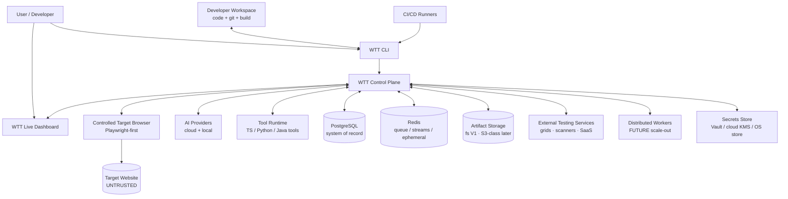

| Relationship | Description |
|---|---|
| User → CLI / Dashboard | Primary invocation via `wtt <URL>`; dashboard for live control, approvals, evidence review. |
| CLI ↔ Workspace | Discovers project, reads config/scope, inspects Git/code (localhost, policy-gated), applies checkpointed patches. |
| Control Plane ↔ Dashboard | Dashboard API (REST + WebSocket/SSE); dashboard holds no authoritative state. |
| Control Plane → Controlled Browser | Exclusive automation channel (Playwright/CDP/BiDi); target site is untrusted input. |
| Control Plane ↔ AI Providers | Task-routed model calls with fallback, budgets, redaction; local models for degraded/offline paths. |
| Control Plane ↔ Tool Runtime | Capability dispatch through the Tool Gateway honoring the single Tool Contract. |
| Control Plane ↔ DB/Redis/Store | Durable state, queue/streaming/ephemeral state, large binaries respectively. |
| Control Plane ↔ External Services | Adapter-mediated grids, scanners, SaaS analyzers; replaceable. |
| CI/CD → CLI | Headless `--ci` execution with exit codes + JUnit/SARIF/JSON artifacts. |
| Control Plane ↔ Workers | Local pool in V1; remote/K8s workers later via the same job contract. |
| Control Plane ↔ Secrets Store | References resolved at use-time via Credential Broker; never persisted in clear. |

---

## 8. Architectural Style

**ARCH-030 (`RECOMMENDED ARCHITECTURE`): pragmatic evolution, not Day-1 microservices.**

```text
Phase 1 (V1): Modular Monolith + Worker Processes
Phase 2:      Distributed Worker Architecture (same contracts, remote executors)
Phase 3:      Selective Service Separation (only proven bottlenecks / tenancy boundaries)
```

Why not microservices first: WTT's hardest problems are domain-coupling problems (session ↔ events ↔ evidence ↔ findings ↔ fixes ↔ verification), not scaling problems. A modular monolith keeps transactions simple (session creation, fix application, gate calculation), preserves strong consistency where it matters (§9.3), keeps local-first UX fast (no network hops for core loop), and still scales execution horizontally because browsers/tools/AI already run in isolated worker processes behind capability contracts. Distribution is introduced where it pays (browser grids, load workers, fleet scale) without rewriting the core.

Likely initial topology (finalized below in §14–§15):

```text
WTT CLI
   │
   ▼
WTT Control Plane (modular monolith, in-process modules + local services)
   │
   ├── Session Manager · AI Orchestrator · Tool Registry/Resolver
   ├── Execution Engine / Scheduler · Event System · Finding Engine
   ├── Artifact Service · Policy Engine · Dashboard API · Report/Gate services
          │
          ├──────── Browser Workers (child processes, Playwright)
          ├──────── Tool Workers (TS in-proc/worker-thread/child; adapters)
          ├──────── Python AI Workers (subprocess JSONL → FastAPI service)
          └──────── Java Heavy Workers (JAR/service, only where justified)
```

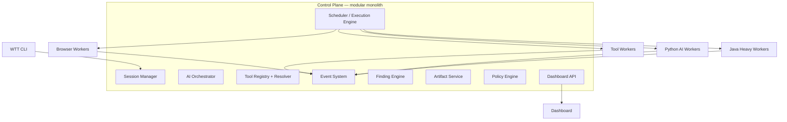


## 9. Domain Model

Canonical domain entities (PRD glossary, `APPROVED BY PRD`): Project · Target · Environment · Session · Run · Test Plan · Test · Scenario · Step · Workflow · Capability · Tool · Tool Execution · Agent · Agent Execution · Worker · Job · Evidence · Artifact · Finding (raw/normalized/canonical) · Root Cause Report · Fix · Verification · Quality Score · Gate Verdict · Report · Audit Event · Scope Policy · Secret Reference.

### 9.1 Data ownership (no dual authorities)

| Domain object | Single owning component |
|---|---|
| Session state transitions | Session Manager (§13–§14) |
| Run/test/step verdicts | Execution Engine + Test Verdicting (deterministic rules; §21) |
| Canonical finding state | Finding Engine (§38) |
| Artifact metadata + bytes placement | Artifact Service (§37) |
| Tool capability advertisements | Tool Registry; execution records by Execution Engine (§27/§15) |
| Fix lifecycle + workspace mutation | Remediation Service (§41) |
| Verification verdicts | Verification Service, independent of Fix Agent (§42) |
| Quality gate verdicts | Gate Evaluator (deterministic rules; §22.4/PRD §58) |
| Policy decisions (allow/approve/deny) | Policy Engine (§14.3, §53) |
| Scope/authorization data | Scope Store via Policy Engine (§13, §53) |
| Audit records | Audit Sink (append-only; §59) |
| Dashboard view state only (tabs/filters) | Dashboard client (§17); never domain truth |

### 9.2 Consistency model

- **Strong consistency:** session transitions, fix application, gate calculation, finding state transitions, audit appends — single-writer owners + DB transactions.
- **Eventual consistency:** dashboard streams, cross-worker indexes, historical analytics, dedup learning.
- **Ephemeral state:** heartbeats, locks, queue depth, live cursors — Redis with TTLs, safe to lose.
- **Durable state:** everything needed for resume/report/audit — PostgreSQL + artifact store.

### 9.3 Transaction boundaries

Key transactions (kept local, never distributed where avoidable): session creation (session + scope snapshot + run + audit); tool result submission (execution record + evidence links + events, idempotent); finding creation (raw → normalized → canonical link + events); fix application (checkpoint + patch + checks + events, rollback on failure); verification result (verdict + gate inputs + events); gate calculation (inputs snapshot + verdict + waiver refs + events). Cross-worker coordination uses the outbox pattern (§34.3): DB commit first, event relay second, idempotent consumers.

---

## 10. Primary Runtime Flow

Canonical `wtt <URL>` sequence (`APPROVED BY PRD` stages; architecture assigns each stage an owner):

```text
User → wtt <URL> → CLI Parser → Configuration Resolver → Target Normalizer →
Scope/Authorization Policy → Session Creation → Environment Detection →
Control Plane Startup → Event Runtime Startup → Dashboard Startup →
AI Orchestrator Startup → Browser Worker Allocation → Target Browser Launch →
Website Discovery → Technology Fingerprinting → Application Graph Creation →
Testing Plan Generation → Capability Resolution → Tool Selection →
Tool/Worker Execution → Evidence Capture → Finding Normalization →
Root Cause Correlation → Optional Remediation → Verification → Regression →
Quality Evaluation → Report → Session Completion
```

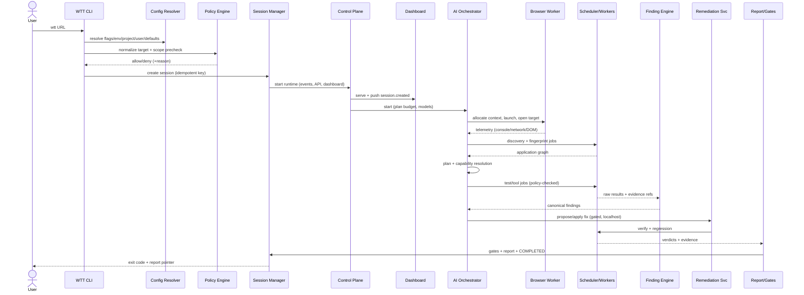

Stage ownership: CLI Parser/Config (CLI, §11–§12) · Target/Scope (Target Resolver + Policy Engine, §13/§14.3) · Session (Session Manager) · Environment Detection (`doctor` probes, §11.5) · Runtime/Event/Dashboard (Control Plane boot, §14) · Orchestrator (AI layer, §24) · Browser (Browser Workers, §16) · Discovery/Fingerprint/Graph (§18–§19) · Plan/Capabilities/Tools (§20, §24, §27) · Execution/Evidence (§15, §32–§33, §36) · Findings (§38) · RCA (§39) · Remediation (§41) · Verification/Regression (§42–§44) · Gates/Report (§22.4, §51.3) · Completion (Session Manager + CLI exit mapping).

---

## 11. CLI Architecture

```text
cli/
 ├── parser            deterministic POSIX-style parsing, did-you-mean, --help generation
 ├── commands          run/init/test/resume/stop/status/report/sessions/projects/tools/config/doctor/version
 ├── configuration     layered resolution + schema validation + --explain provenance
 ├── target-resolver   normalization, locality detection, redirect policy, scope precheck client
 ├── session-client    control-plane API client (create/attach/stream/stop/resume/report)
 ├── output-renderer   human/verbose/debug/quiet/json/junit/sarif, color/no-color, progress
 ├── process-manager   supervised runtime tree (control plane, workers, browsers, dashboard)
 ├── signal-handler    SIGINT/SIGTERM/disconnect → graceful drain → forced abort
 └── machine-output    --json/--format emitters, stdout/stderr separation, exit-code mapping
```

ARCH-100: The CLI is a thin-but-capable client: it parses, resolves config, pre-validates target/scope for fast failure, supervises local processes, renders output, and maps outcomes to PRD exit codes (0/1/2/3/4/5/6, `APPROVED BY PRD`). It MUST NOT implement planning, gating, or finding logic — those live server-side so headless/API/CI paths share one implementation.

ARCH-101: Configuration precedence (`APPROVED BY PRD`): CLI argument → environment variable (`WTT_*`) → project configuration → user configuration → WTT defaults. `wtt config --explain <key>` shows source + (redacted) value.

ARCH-102: Signal handling (`APPROVED BY PRD` semantics): first SIGINT/SIGTERM → graceful shutdown (stop scheduling, drain with timeout, persist, flush evidence, mark session); second SIGINT → force-abort with best-effort persistence. Terminal disconnect behaves like SIGTERM; `--detach` (RECOMMENDED) leaves the session running under the process manager for later `attach`/`resume`.

ARCH-103: Crash recovery: stale-lock detection, interrupted executions marked (never silently dropped), artifacts salvaged, resume offered. Resume is idempotent via checkpoint keys (§61).

---

## 12. Configuration Architecture

Configuration domains: global · user · project · target · environment · session overrides · tool · AI (providers/models/routes/budgets) · security policy (scope, classifications, approvals) · browser (engines, viewports, emulation) · worker (pools, quotas, affinity) · retention/artifacts · observability · integrations.

ARCH-110 (`RECOMMENDED ARCHITECTURE`): file layout keeps PRD-hinted names as defaults without freezing them:

```text
./wtt.config.yaml            project config (or .json; TOML MAY)
./.wtt/
   scope.yaml                allow/deny boundary (versioned, attributable)
   environments.yaml         target/env registry entries
   gates.yaml                quality thresholds + waivers
   tools.yaml                tool pins, enable/disable, budgets
~/.wtt/
   config.yaml               user defaults (models, editors, telemetry opt-in)
   credentials.refs.yaml     secret REFERENCES only (never values)
```

ARCH-111: Every config document carries `apiVersion`; schemas are versioned and strictly validated (unknown keys warn with pointer, never silently ignored); `wtt config validate` type-checks + scope-checks without running tests; migrations are explicit (`wtt config migrate`) with backups.

---

## 13. Project / Target / Session Model

Disambiguation (`APPROVED BY PRD`, enforced by ownership):

- **Project** — persistent logical application (durable container: targets, environments, scope, policy, history).
- **Target** — one specific normalized URL + environment + scope context under test.
- **Environment** — named deployment context (`local/development/qa/staging/production/custom`) with credentials/scope/policy references + data classification.
- **Session** — one `wtt <URL>` lifecycle (`WTT-YYYYMMDD-NNNNNN`), the unit of planning, evidence, verdict, and audit.
- **Run** — a sub-execution pass within a session (initial + reruns/regressions), sharing session lineage.

### 13.1 Session state machine

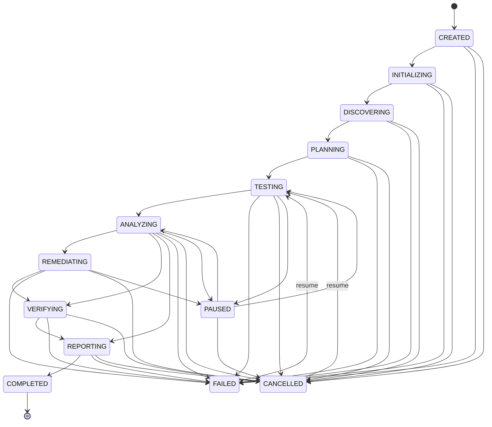

ARCH-120: Legal transitions are exactly the edges above (forward progression + `FAILED/CANCELLED` from any active state + `PAUSED` ↔ active for pausable states + `resume` from `FAILED/CANCELLED/PAUSED`). All other transitions are invalid: rejected, logged, and surfaced. Every transition is event-sourced (`session.state_changed` with `from/to/reason/actor`), guarded by a single-writer Session Manager with optimistic concurrency (version column), and checkpointed so resume never duplicates completed work (idempotency keys per stage).


## 14. Control Plane

**Purpose:** decide. The Control Plane owns session lifecycle, configuration, project state, agent coordination, tool selection, registry, scheduling, event routing, findings, policy enforcement, report/gate coordination, and the dashboard API. It performs no heavy execution itself — it delegates to the Execution Plane (§15).

**Owns:** session/run/test registries, plans, policies, finding/canonical state machine, gate verdicts, report models, event routing, audit emission. **Does Not Own:** browser automation, tool binaries, model weights, artifact bytes (owns metadata only), worker internals.

**Inputs:** CLI/API commands, worker results, browser telemetry, model outputs, approvals. **Outputs:** plans, job dispatches, verdicts, reports, dashboard streams. **Dependencies:** PostgreSQL, Redis, artifact store, secrets broker, model gateway. **Persistence:** durable domain state in Postgres; outbox table for events. **Events Published:** `session.*`, `plan.*`, `finding.*`, `fix.*` (lifecycle), `quality.*`, `report.*`, `approval.*`, `audit.*`. **Events Consumed:** `tool.*`, `worker.*`, `browser.*`, `network.*`, `console.*`, `artifact.*`, `verification.*`. **Failure Modes:** DB outage → read-only degraded + pause scheduling; queue outage → local in-process fallback queue with backpressure; crash → recovery via outbox + checkpoints. **Security:** all mutations policy-checked; all privileged crossings authenticated. **Scaling:** vertical first; read replicas + selective module extraction later (§75). **V1 Status:** REQUIRED (modular monolith, §8).

### 14.1 Module map (control-plane internals)

```text
Session Manager · Config Service · Target/Scope Service · AI Orchestrator host ·
Tool Registry + Resolver · Scheduler · Event Router · Finding Engine ·
Artifact Service (metadata) · Policy Engine · Remediation Service ·
Verification Service · Change Impact · Test Selector · Gate Evaluator ·
Report Builder · Credential Broker · Audit Sink · Dashboard API · OTel harness
```

### 14.2 Control Plane vs Execution Plane

| Concern | Control Plane | Execution Plane |
|---|---|---|
| Role | Decide, coordinate, record, gate | Perform: drive browsers, run tools, analyze, verify |
| State | Authoritative (Postgres-backed) | Ephemeral job state, heartbeats, partials |
| AI | Plans, selects, diagnoses | Executes deterministic actions; returns evidence |
| Failure blast radius | Session-scoped, recoverable | Job-scoped, retryable, quarantinable |
| Scale | One logical owner per session (V1) | Horizontally sharded workers |

### 14.3 Policy Engine (deterministic authority)

Every consequential action flows through: `request(capability, args, cwd, target, actor) → classification → scope match → environment policy → decision(allow/approve/deny + matched rule + policy version) → audit`. Deny wins over allow; absence of authorization denies gated classes. The Policy Engine is pure deterministic code with unit-testable tables — no LLM in the decision path (§24.4, §53).

---

## 15. Execution Plane

**Purpose:** perform work in isolated, replaceable executors behind one job contract. **Owns:** job-local execution only. **Does Not Own:** session/finding/gate truth.

Executor families: Browser Workers · Discovery Workers · API Workers · Visual Workers · Accessibility Workers · Performance Workers · Security Workers · Database Workers · Code Workers · AI Workers · Load Workers · Reporting Workers. Each executor MUST be deployable as in-process module, `worker_threads`, child process, local service, Docker container, remote service, or Kubernetes job — selected by deployment profile, invisible to the tool contract (§29–§33).

**Inputs:** capability jobs (validated input + budget + policy token + idempotency key). **Outputs:** structured results + evidence/artifact refs + usage/cost. **Dependencies:** queue + event relay + artifact upload endpoint + credential broker (scoped). **Persistence:** none authoritative (checkpoints via control plane). **Events Published:** `worker.*`, `tool.*`, `browser.*`, `network.*`, `console.*`, `artifact.*` (creation notices with refs). **Events Consumed:** job assignments, cancellation. **Failure Modes:** crash/timeout → job marked, partials salvaged, retry per policy or DLQ; browser escape attempts → context kill + audit. **Security:** least-privilege capability tokens, scoped network/filesystem, no secret persistence. **Scaling:** horizontal per family with quotas. **V1 Status:** REQUIRED (local pool + Redis/BullMQ-class queue).

---

## 16. Browser Architecture

**Purpose:** real-browser automation + developer-grade observation for Surface B. **Owns:** browser processes, contexts, pages, action execution, locator resolution, DevTools bridging, browser-side evidence capture. **Does Not Own:** test verdicts, findings, plans.

Core modules (`RECOMMENDED ARCHITECTURE`, Playwright-first with engine ports):

```text
BrowserManager (binaries, versions, launch profiles)
BrowserPool (quotas, leases, reclamation)
BrowserContextManager (isolation unit per session/scope)
PageManager / TabManager (tabs, popups, dialogs, downloads, uploads)
ActionExecutor (deterministic action primitives with idempotency keys)
LocatorEngine (role/name/text/test-id first; CSS/XPath fallback + recorded fallbacks)
NavigationManager (waits, redirects, scope re-check on cross-origin hops)
DialogManager · DownloadManager · UploadManager · PermissionManager
EvidenceCollector (screenshots, video, HAR, trace, DOM/AX snapshots)
DevToolsBridge (CDP / WebDriver BiDi / Playwright instrumentation → WTT events)
```

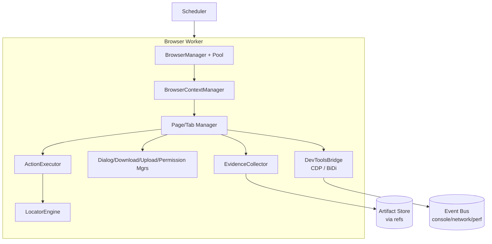

ARCH-160: Engine replaceability. All automation flows through `BrowserDriver` ports (`launch/navigate/act/observe/evidence`). Playwright is the V1 implementation; Selenium/WebdriverIO/remote grids (BrowserStack/Sauce/LambdaTest) are later adapters implementing the same port. No orchestrator/agent code imports engine SDKs directly.

ARCH-161: Process isolation model (`RECOMMENDED ARCHITECTURE`): one WTT test session → dedicated browser **context**(s) (cookie/storage/credential isolation, independent network interception); contexts may share a browser process in V1 for resource efficiency, with per-context evidence attribution. Dashboard (Surface A) and target (Surface B) MUST be separate contexts at minimum, separate processes by default when headed locally, and always separate origins — see §16.1. Private/secret contexts (authenticated roles) are never reused across roles without explicit reset + audit.

### 16.1 Two-browser-surface architecture

`RECOMMENDED ARCHITECTURE` default: **two separate OS-level browser windows backed by two isolated browser contexts in separate browser processes** — Window 1 renders Surface A (dashboard origin, e.g. `http://127.0.0.1:<wtt-port>`), Window 2 renders Surface B (target origin). Rationale: strongest storage/process isolation, visible side-by-side UX, independent crash domains, and straightforward headed/CI parity (CI simply never opens Window 1/2 while keeping contexts headless).

- Surface A responsibilities: session state, events, progress, agent/tool/worker/browser activity, console, network, findings, evidence, fixes, verification, reports — read views + policy-gated actions through the Dashboard API only.
- Surface B responsibilities: website navigation/automation, DevTools collection, DOM interaction, network observation, screenshots/video/HAR/trace, storage/auth handling.
- Isolation boundaries: distinct origins (dashboard loopback origin vs target origin); no shared `localStorage`/cookies/credentials; Content-Security-Policy + `X-Frame-Options`/frame-ancestors preventing embedding either way; dashboard APIs require session tokens that Surface B contexts never possess; target-origin JS cannot postMessage to dashboard windows (no cross-window handles exposed; synchronization flows only via control-plane events). Target-triggered navigation outside scope pauses active work and requires re-authorization (§13/PRD §12).
- Alternatives (two tabs, single window split) are permitted UX options later but MUST preserve the origin + storage + token isolation guarantees above.

---

## 17. Dashboard Architecture

**Purpose:** live operational visualization + policy-gated control surface (Surface A). **Owns:** view state only (tabs, filters, panel sizes, selections). **Does Not Own:** any domain truth — verdicts, finding/fix states, and session status are server-authoritative.

```text
Dashboard UI (React + TypeScript + Vite — RECOMMENDED, §78)
   ├── REST/HTTP API (queries, mutations, artifact fetch, paginated history)
   └── WebSocket/SSE (live event fanout with reconnect + backfill cursors)
              │
        Control Plane (Dashboard API + Event Router)
```

ARCH-170: State separation. Server-authoritative: test/finding/fix/session/verification/gate states (TanStack Query-class cache with invalidation by event cursor). Live transient: event streams, meters, tails (ephemeral, backfillable). Client-only: selection, filters, layout. Reconnect replays from the last cursor; conflicts resolve server-wins with visible refresh.

ARCH-171: Dashboard security. Binds to loopback by default (LAN/remote bind requires explicit flag + auth); authenticated sessions where required (local token V1; OIDC/SSO enterprise, §51); all untrusted content (page text, logs, console, payloads) sanitized and never rendered as raw HTML; target sites can never invoke privileged dashboard APIs (token + origin + capability checks; §16.1). Dangerous actions show blast radius and require confirmation + audit.

ARCH-172: Deep links for session/run/test/step/finding/artifact/fix/verification/report; every CLI/API output links into the UI. CI never requires the dashboard window, but artifacts remain fetchable via API/CLI.


## 18. Discovery Architecture

**Purpose:** build the canonical Application Map (never disconnected crawler dumps). **Owns:** frontier, crawl budgets, URL canonicalization, dedup. **Does Not Own:** verdicts or plans.

Pipeline:

```text
Seed URL → Frontier (prioritized, scope-filtered)
 → Raw Fetch tier (sitemap/robots/headers — cheap, polite)
 → Browser Discovery tier (JS/SPA rendering via Browser Workers)
 → DOM/Link/Route/API/Form/Asset Extraction
 → Technology Fingerprinting (passive first; probes gated)
 → Canonical Application Graph upsert (dedup by canonical URL + route pattern)
```

ARCH-180: URL canonicalization (scheme/host case, default ports, trailing slash, IDNA, sorted query allowlist per route, hash-route normalization, redirect-chain resolution with capped hops). SPA routes fingerprinted by route pattern + DOM signature to avoid infinite parameterized duplication. Pagination/infinite-scroll handled as bounded expansion strategies with budgets; robots/sitemap honored as hints within scope; authenticated discovery uses role-scoped contexts with credential-broker tokens. Discovery checkpoints the frontier for resume and emits `discovery.*` + `target.*` events. Engine adapters (Playwright/Crawlee/Katana/Puppeteer/Selenium/Scrapy/Cheerio/BS4-class) plug behind `crawler.*` capabilities; results merge by canonical node identity.

---

## 19. Application Knowledge Graph

**Purpose:** queryable structural memory powering planning, generation, RCA, impact, selection, coverage, and verification. **Owns:** graph nodes/edges/versioning (project + session overlays). **Does Not Own:** raw evidence bytes (referenced).

Node types: Application · Page · Route · Element · Form · Action · Workflow · API Endpoint · Service · Role · Permission · Data Entity · External Dependency · Test · Finding · Artifact. Edge types: `NAVIGATES_TO · CALLS · REQUIRES_ROLE · CONTAINS · TRIGGERS · READS · WRITES · DEPENDS_ON · TESTED_BY · AFFECTED_BY` (+ `DUPLICATE_OF` for finding merges, `HEALS` for locator repairs).

ARCH-190 (`RECOMMENDED ARCHITECTURE`): relational representation in PostgreSQL (nodes/edges tables + JSONB attributes + GIN indexes, closure/materialized views for hot traversals) for V1 — sufficient for single-app graphs, transactional with findings/fixes, no new infrastructure. A dedicated graph store is `FUTURE`, adopted only on measured traversal pain (migration trigger in §49.3/§75). Writes are event-sourced and versioned per session/run; cross-session learning overlays (historical failure graph) are project-scoped with retention + tenant isolation.

---

## 20. Test Planning

**Purpose:** convert knowledge + objectives + policy into an inspectable, budgeted Execution Plan. **Owns:** plan documents. **Does Not Own:** execution or verdicts.

Plan model: Test Objective → Test Plan (scope, capabilities, budgets, parallelism, dependencies, approval points, verification strategy) → Scenarios → Steps (action + assertion + evidence requirements) → Assertions (deterministic oracles preferred; AI-vision assertions carry region + rationale + confidence).

ARCH-200: Generation inputs (PRD §48–§49): discovery/graph, user requirements, known workflows, OpenAPI/GraphQL/DB schemas, existing tests, historical failures, code changes. Capability flags (`--functional`, `--security`, …) constrain the planner as intent hints; the plan records included capabilities with rationale AND excluded ones with rationale (scope/budget/fingerprint/policy). `--plan`/`--dry-run` renders the plan with zero side effects. Generated tests carry provenance (inputs, model/rule-pack versions, confidence, review state) and start quarantined until verification passes.

---

## 21. Functional Execution

**Purpose:** deterministic execution of browser/API actions, strictly separated from LLM reasoning. The AI decides *what* should be tested; the Execution Engine decides *how* deterministic actions are performed and judged. This separation is load-bearing for reliability, replay, and safety.

ARCH-210: Action primitives are versioned, idempotent-keyed, budget-bounded operations (`navigate/click/fill/assert/...`) executed by Browser/API Workers with condition-based waits (never sleep-first), locator fallback chains, and per-step evidence capture. Assertions evaluate against declared oracles; verdicts (`pass/fail/skip + rationale`) are computed by deterministic verdicting rules, never by free-text model assertion alone. Flaky-prone executions feed the Flakiness Engine (§44.2); healed locators are labeled and quarantined until stable (PRD §51).

---

## 22. API Architecture

Covers both WTT's testing of target APIs (§22.1–§22.3) and WTT's own control APIs (detailed in §51; summarized in §22.4–§22.5 to satisfy the required structure).

### 22.1 Protocol-neutral target-API testing

Components: Endpoint Registry (discovered + declared) · Request Builder (protocol-neutral op model) · Auth Injector (broker-scoped tokens) · Schema Validator (OpenAPI/JSON-Schema/GraphQL/Protobuf/XSD) · Assertion Engine (status/schema/contract/behavioral) · Traffic Correlator (UI action ↔ API call ↔ DB effect joins) · Evidence Collector (redacted request/response pairs). Protocols (REST/GraphQL/gRPC/SOAP/WebSocket/SSE) and harnesses (Newman/Bruno/Karate/Hurl/REST-Assured-class) are adapters behind `api.*`/`contract.*`/`mock.*` capabilities; activation is fingerprint/flag-driven.

### 22.2 Contract & mock discipline

Contract diffs (OpenAPI Diff-class), fuzz-conformance (Schemathesis-class), mock-conformance (Prism-class), consumer-driven flows (Pact-class) where configured. Fault-injection scenarios (5xx/timeout/slow/empty/malformed/rate-limit/dependency-down) run against virtualized dependencies (WireMock/MockServer/MSW-class) or sandboxed doubles — never against production dependencies.

### 22.3 Messaging/event-backends

Kafka/RabbitMQ/AMQP/MQTT/NATS/Redis-Streams/cloud queues tested via `messaging.*` adapters (publish/consume, ordering, redelivery, DLQ, schema conformance) only when discovery/config indicates relevance; broker credentials are scoped secret references.

### 22.4 WTT control-plane APIs (summary; contracts in `API_SPEC.md`)

Versioned REST (`/api/v1/...`: projects, targets, sessions, tests, findings, artifacts, tools, workers, fixes, reports, gates, config/scope validation, audit) + WebSocket/SSE streams; OpenAPI-published; local-token auth V1 (OIDC/OAuth enterprise); RBAC; idempotency keys; pagination/filter/sort; stable error envelope; rate limits; mutation audit. Internal Worker API and Tool Execution Protocol are separate surfaces, never exposed unnecessarily (§51).

### 22.5 Quality gates (evaluator placement)

Gate Evaluator is a deterministic control-plane service consuming canonical results: per-gate rules (Functional/Regression/Security/Performance/Accessibility/Coverage/Reliability/Critical-Findings) with versioned thresholds + waivers → `READY | CONDITIONALLY_READY | NOT_READY` with full input snapshots. WTT computes verdicts; deployment authority stays external unless explicitly integrated.

---

## 23. Authentication / Authorization

### 23.1 Authentication architecture (target auth under test)

Separate credentials from session state. Abstractions: `CredentialReference` (opaque ref, never value) · `Identity` (test persona) · `AuthenticationProfile` (mechanism + flow + scope) · `BrowserAuthState` / `APIAuthState` / `TokenState` (derived, TTL'd, labeled sensitive). Flows (login/logout/registration/MFA/WebAuthn/SSO/OAuth/OIDC/SAML/LDAP/magic-link/rotation/…) execute as workflows with setup (broker-injected test accounts), execution (UI + API + email/OTP capture), assertions (cookie/token/storage/session state), teardown (logout/invalidate/cleanup). Raw credentials never touch logs/events/artifacts/reports; auth artifacts get restricted retention.

### 23.2 RBAC / authorization testing (target authz under test)

Test-matrix representation (`Identity × Role × Permission × Resource × Action → Expected vs Actual`) executed across UI affordance, direct route, API call, and (where configured) database effect — correlated into one verdict per cell. Permission matrices derive from discovery + config + scope-gated probing (rate-limited, audited; production defaults to read-only mapping). Defensive reporting only: no exploitation beyond in-scope proof-of-grant/deny.

### 23.3 WTT platform authorization (WTT's own users — never mixed with §23.2)

Local V1: loopback token + OS-user trust. Team/enterprise (`FUTURE`-leaning, contracts now): organizations → workspaces → projects → roles; platform permissions (run sessions, approve gates, manage scope/policy, reveal secrets, administer) are disjoint from target-app roles under test. Confusing the two is a design violation.


## 24. AI Orchestration

**Purpose:** plan, delegate, constrain, correlate, diagnose, and decide — without ever implementing execution or policy itself. The Orchestrator is a set of cooperating subcomponents, not a monolithic "AI brain":

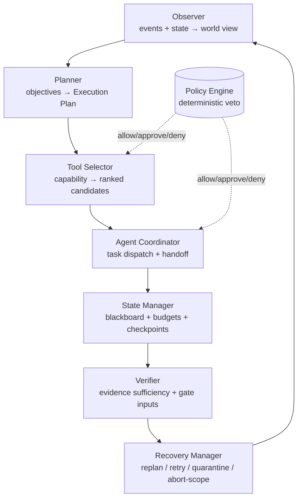

**Owns:** plans, task graph, budget ledgers, replan triggers. **Does Not Own:** session truth (Session Manager), policy decisions (Policy Engine), verdicts (verdicting/gates), artifact bytes.

### 24.1 Closed loop

`observe → plan → delegate → constrain → execute → correlate → diagnose → remediate(gated) → verify → gate → report`, with explicit replan triggers: new discovery, failures, approvals/denials, timeouts, budget pressure, user intervention. Every loop iteration records structured decision metadata (task, selected capability, reason category, input refs, model, output action, confidence) — observable AI without storing private chain-of-thought (§55.3).

### 24.2 Capability resolution (AI asks, resolver chooses)

The orchestrator emits `CapabilityRequest`s; the deterministic Tool Resolver (§27) scores implementations by: capability match → scope/policy eligibility → platform support → health → cost/budget → historical reliability → priority, with deterministic tie-breaks. The plan explains selections AND rejections.

### 24.3 Degraded determinism

If models are unavailable, the orchestrator falls back to a rules-based planner (discovery + smoke + evidence), loudly labeled `degraded/non-AI`. It never fabricates AI activity. Budgets (tokens/cost/time/actions/workers) trigger prioritization and early termination of low-yield branches — never silent overrun.

### 24.4 Deterministic supremacy

Permissions, scope, session state, tool execution, database writes, and quality rules are owned by deterministic components. LLM output is untrusted input to those components: validated against schemas, constrained to declared capabilities, and policy-checked before any effect. The model proposes; the gateway disposes.

---

## 25. Agent Architecture

Agent roster (`APPROVED BY PRD` direction; per-agent specs in `AGENTS.md`): Discovery · Browser · Functional · Workflow · API · Auth · Authorization · Accessibility · Visual · Performance · Security · Database · Network · Log · Code · Root Cause · Fix · Verification · Regression · Report agents (plus Target/Release coordination).

Each agent declares: identity · purpose · input schema · output schema · capabilities requested · permissions granted · context/memory budget · lifecycle (`created→ready→running→awaiting→completed/failed/cancelled`) · timeout · retry behavior · audit trail.

ARCH-250: Agents act ONLY through the Tool Gateway with granted capabilities — no direct model/shell/browser/network access. Context is least-privilege (session summary + task slice + evidence pointers; never secret stores or foreign sessions). Long memory is explicit (graph/store-backed, retentioned).

### 25.1 Structured agent communication

Free-form agent-to-agent conversation is prohibited. Agents communicate via orchestrator-mediated structured task messages + events + the session blackboard (application map, auth state, matrices):

```text
TaskRequest { taskId, capability, inputRef, budget, idempotencyKey }
TaskResult { taskId, status, outputRef, evidenceRefs, usage }
FindingReference / EvidenceReference / CapabilityRequest / VerificationRequest
```

This yields reliability (schema-validated), observability (every handoff evented), security (policy-checked hops), replayability (deterministic transcripts), and debuggability (causal chains via correlation/causation IDs).

### 25.2 Cancellation, retry, failure taxonomy

Cooperative + preemptive cancellation (token → tool-cancel → browser/terminal abort → partial salvage → `agent.cancelled`). Bounded retries with backoff/jitter + idempotency keys; exhaustion escalates. Failures classify as: retriable-infra · tool-bug · auth/scope-denial · target-fault · flaky-automation · ai-error — each with a prescribed next action (retry/heal/replan/quarantine/escalate/abort-scope). Infinite retry is prohibited.

---

## 26. Model Provider Architecture

Core abstraction (`RECOMMENDED ARCHITECTURE`): `ModelProvider` (auth, endpoints, limits) · `Model` (id, version, context window) · `ModelCapability` (reasoning/code/vision/classification/structured-output/tool-calling/large-context) · `ModelRoute` (task → ordered model preference + fallback) · `Invocation` (request/response envelope, redacted) · `Usage` (tokens, latency, cost, retries).

```text
Task → Required Capability → Policy (data-class, residency, cost) →
Preferred Model → Fallback Model(s) → Invocation + Usage ledger
```

ARCH-260: Provider adapters (OpenAI/Anthropic/Google/Azure/AWS-Bedrock/Ollama/OpenAI-compatible/enterprise) implement one port; orchestrator code never imports vendor SDKs. Routing defaults (planning→reasoning, coding→code, vision→multimodal, classification→lightweight, reporting→general) are configurable. Every call records provider/model/task/tokens/latency/cost/retries/correlation IDs; 429/5xx handling uses backoff + quota surfacing + graceful degradation. Credentials are secret references; payloads are PII/secret-minimized per provider data policy; local-model routes support offline/degraded operation.

### 26.1 AI security boundary (untrusted content)

Four strictly separated instruction strata: `SYSTEM POLICY` (immutable WTT guardrails) · `TRUSTED WTT INSTRUCTIONS` (orchestrator/agent charters) · `USER INSTRUCTIONS` (constrained by policy) · `UNTRUSTED TARGET CONTENT` (page text, DOM, comments, API responses, downloads, tool output derived thereof — NEVER instructions). Controls: untrusted tagging + provenance labels on all retrieved content; instruction-like content detection → flag + log + quarantine from planning context; tool-arg validation/allowlisting for page-derived values; policy/approval paths unreachable from untrusted strata; rendering sanitization. Target content MUST NEVER redefine WTT policy (invariant §79).

---

## 27. Tool Registry

**Purpose:** the single marketplace of *what WTT can do*. **Owns:** capability taxonomy, manifests, versions, health/availability, resolution scoring. **Does Not Own:** execution (Execution Engine) or policy verdicts (Policy Engine).

Five-level separation (`APPROVED BY PRD` concept):

```text
Capability            accessibility.scan  (stable, product-named, versioned)
Tool                  axe-core-adapter    (a named offering)
Tool Implementation   axe-core-adapter@2.3.1+esbuild-bundle (pinned build)
Tool Instance         its deployment (local child proc / service / worker image)
Tool Execution        one invocation (inputs, policy token, result, evidence)
```

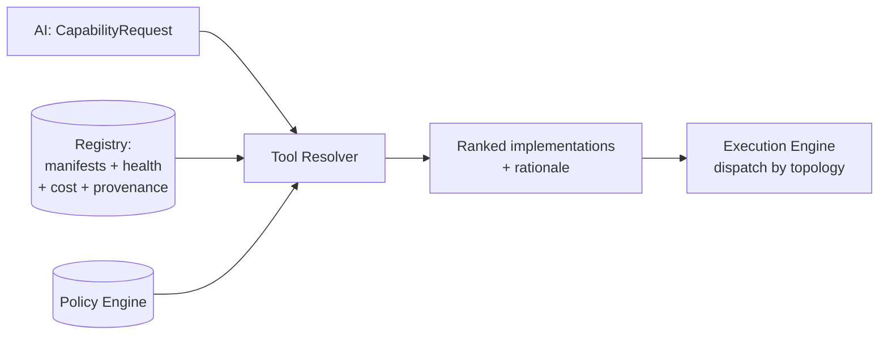

ARCH-270: Resolution factors (deterministic, explainable): capability match → scope/policy eligibility → platform support → health → cost/budget → historical reliability → priority → stable tie-break. Registry supports versioning, deprecation, aliasing, side-by-side versions; breaking capability changes require major version + migration note. Namespaces follow PRD §21 (`browser.*`, `api.*`, `security.*`, …), extensible without core changes.

---

## 28. Tool Contract

The single logical contract every tool honors regardless of language/topology. Field classes (`RECOMMENDED ARCHITECTURE` serialization in `TOOL_SDK.md` + `contracts/`):

**Mandatory:** `id · name · version · description · capabilities[] · runtime{type,language,entrypoint} · inputSchema · outputSchema · permissions[] · riskClassification · timeout · cancellable · supportedOS[]`.

**Conditionally mandatory:** `resourceRequirements` (when non-trivial) · `dependencies[]` (external binaries/services) · `retryPolicy` (when retry-safe + idempotent) · `evidenceTypes[]` (when producing evidence) · `healthCheck` (services/long-lived) · `costMetadata` (metered/licensed) · `installation` (non-bundled).

**Optional:** `supportedEnvironments[] · aliases[] · deprecation · UI hints · diagnostics`.

ARCH-280: Gateway enforcement: input/output schema validation (fail fast with diagnostics); permission/risk cross-check against the request's policy token; timeout + cancellation propagation; evidence/finding declarations (undeclared side effects prohibited); provenance recording (author/source/hash/signature). Version negotiation: tools declare contract version; gateway rejects incompatible majors with actionable upgrade guidance.

---

## 29. Tool Runtime

ARCH-290: Execution shapes per tool (declared in manifest, chosen by scheduler + topology — the tool-facing contract is identical):

| Shape | Mechanism | Best for |
|---|---|---|
| In-process | TS module / `worker_threads` | cheap, hot-path, zero-spawn (gateway, resolvers, verdicting) |
| Child process | spawn + stdin/stdout JSON Lines, stderr diagnostics, exit codes | short-lived, crash-isolated tools (all 3 languages) |
| Local service | Unix socket/named pipe/loopback HTTP/gRPC | stateful/persistent (browser pool, model gateway, analyzers) |
| Container | image + mounted workspace + capped egress | untrusted/heavy deps, reproducible scanners |
| Remote/distributed | queue job + gRPC/event relay + artifact refs | scale-out (load, grids, fleet analysis) |

Tool lifecycle states: `DISCOVERED → AVAILABLE ⇄ UNAVAILABLE → INSTALLING → READY → RUNNING → (READY | DEGRADED | FAILED) → DISABLED`, with registration, discovery, dependency/version/health checks, execution, cancellation, upgrade, disable/uninstall. A crash in any tool (Lighthouse/ZAP/Python/Java worker) is contained to its job and MUST NOT terminate the session (§61).

---

## 30. Language Architecture

Official implementation languages: TypeScript/JavaScript · Python · Java (`APPROVED BY PRD`); selection is requirements-driven per tool (ecosystem, concurrency, startup, native deps, distribution, ops cost). Never force one language; never triple-implement (PRD §23 invariant).

- **TypeScript tools:** in-process / `worker_threads` / child process / Node service. Natural home: control plane, CLI, gateway, browser engine, dashboard, adapters with npm ecosystems.
- **Python tools:** subprocess (JSONL) / HTTP service (FastAPI) / gRPC / container. Natural home: AI/vision/ML analysis, data validation, scientific/parse-heavy adapters.
- **Java tools:** JAR process / service / gRPC / container / distributed worker. Natural home: high-throughput, long-running, CPU-intensive distributed processing — only where justified (`RECOMMENDED`: JVM workers are opt-in per deployment, never a V1 prerequisite for localhost runs).
- Manifests record `runtime.language` + rationale pointer; SDKs (`@wtt/tool-sdk`, `wtt-tool-sdk`, `wtt-tool-sdk-java`) provide manifest helpers, validation, logging, events, cancellation, timeouts, artifact/evidence/finding APIs, health, and test harnesses; `wtt tools create --language …` scaffolds all of the above.

---

## 31. Inter-Language Communication

Protocol hierarchy (`RECOMMENDED ARCHITECTURE`):

```text
Local short-lived:   stdin/stdout JSON Lines + structured stderr + exit codes
Local persistent:    Unix socket / named pipe → loopback HTTP → gRPC (by throughput need)
Distributed:         gRPC + message queue + event relay (never bespoke RPC)
Schemas:             JSON Schema (payloads) · OpenAPI (HTTP surfaces) · Protobuf (hot/typed paths)
```

ARCH-310: Canonical `contracts/` package (`contracts/proto` + JSON Schemas + OpenAPI) is the single source for events, manifests, session states, DTOs, worker messages, finding/artifact types. Bindings generate TypeScript/Python/Java clients — no hand-maintained parallel schemas. Large payloads are never inlined: artifacts move via store + signed/local refs; messages carry metadata only.

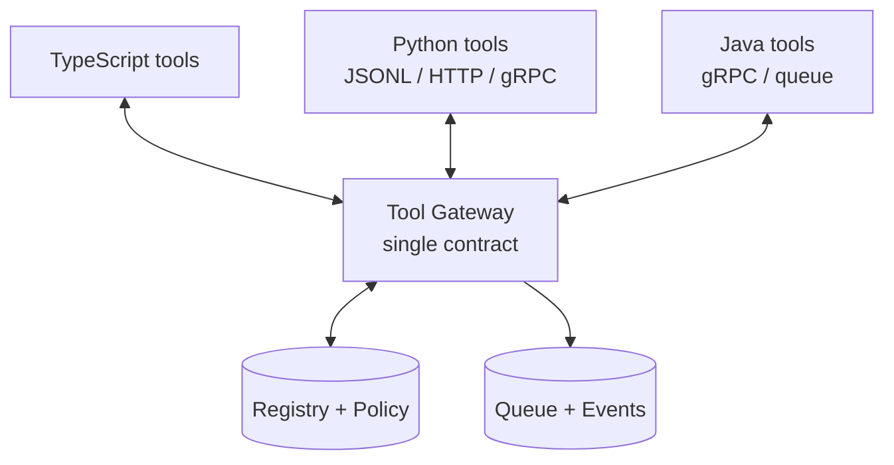


## 32. Worker Architecture

**Purpose:** horizontally scalable executors behind one registration + job contract. **Owns:** job execution + heartbeats. **Does Not Own:** scheduling decisions, truth, or policy.

Registration advertisement: `workerId · capabilities[] · language/runtime · cpu/ram/disk/network/gpu/browserSlots · platform · browser availability · tool availability · status · heartbeat · currentJobs[]`.

Worker states: `REGISTERING → READY ⇄ BUSY → DRAINING → OFFLINE` (+ `DEGRADED`, `FAILED`). Draining is graceful (finish/Checkpoint + requeue unstarted); `FAILED` triggers DLQ + quarantine + `wtt worker doctor` diagnostics.

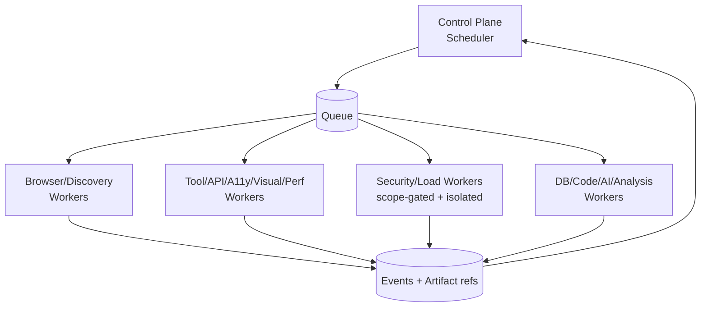

ARCH-320: Same-machine, remote VM, Docker, Kubernetes, and cloud runners are deployment bindings of one worker contract (V1: local pool + Redis-backed queue). Remote browsers (grids/K8s pools) are scheduled as worker resources with session affinity + evidence shipping.

---

## 33. Scheduler

**Purpose:** match jobs to capable, permitted, healthy executors under budgets. **Owns:** dispatch decisions + queue priorities. **Does Not Own:** policy verdicts (queries Policy Engine) or results.

Match dimensions: capability · priority · resource requirements · target constraints (locality/scope) · security classification · browser requirements · workspace affinity (code-remediation jobs MUST NOT land on workers without the workspace) · data locality · tool availability · cost/budget. Capability negotiation is declarative: jobs request `capability + requirements` (e.g., `performance.lighthouse` on `chromium` with `mem ≥ 2Gi`); the scheduler resolves an environment or queues with a visible reason. Queues support priority, dependencies, parallelism caps, sharding keys, retry/timeout/cancel/resume/checkpoint, and DLQ with replay tooling.

---

## 34. Event Architecture

**Purpose:** the nervous system — every consequential occurrence becomes a structured, versioned, redacted event. Canonical envelope (`APPROVED BY PRD` concept):

```json
{
  "eventId": "...",
  "eventType": "tool.completed",
  "version": 1,
  "sessionId": "...",
  "timestamp": "...",
  "source": "worker/browser-3",
  "correlationId": "...",
  "causationId": "...",
  "actor": "agent:functional",
  "payload": {}
}
```

Event families: `session.* · target.* · browser.* · discovery.* · agent.* · tool.* · worker.* · test.* · network.* · console.* · finding.* · rootcause.* · fix.* · verification.* · artifact.* · report.* · quality.* · audit.* · approval.* · plan.*`.

ARCH-340: Semantics. At-least-once delivery with idempotent consumers (dedupe on `eventId`); ordering per `(sessionId, stream)` via monotonic sequence + UTC timestamp (clock reconciliation, no global wall-clock dependence); schema versioning with additive-then-major discipline and reader-tolerant consumers; retention per family (hot streams short, audit/gates long); DLQ + poison-message quarantine with replay; backpressure via batching/sampling/aggregation/limits so console/network floods and multi-hundred-MB artifacts can never collapse the bus (large bodies referenced, never embedded).

### 34.3 Outbox relay

Control-plane mutations commit domain rows + outbox rows in one DB transaction; a relay publishes to Redis streams/fanout and marks relayed. Consumers (dashboard fanout, audit sink, integrations, projections) are independently replayable from persisted cursors. This preserves "DB commit first, event second" without distributed transactions.

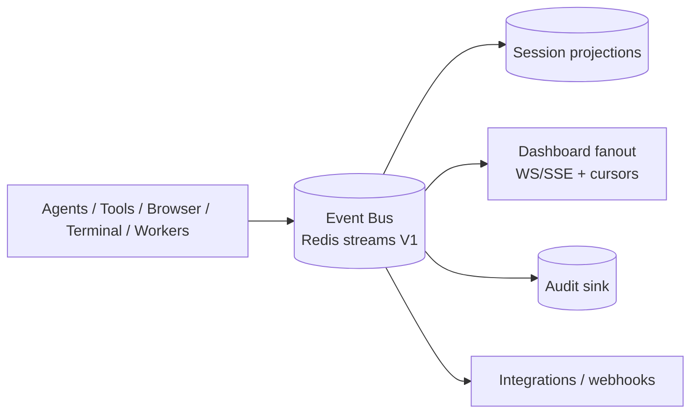

---

## 35. Realtime Architecture

V1 (`RECOMMENDED ARCHITECTURE`): in-process TypeScript emitter (hot path) + persisted important events (Postgres) + Redis Pub/Sub-or-Streams fanout + WebSocket/SSE dashboard delivery with reconnect + cursor backfill. No polling as primary; stale disconnects are visibly indicated with resync.

ARCH-350: Migration triggers (when NATS/Kafka become justified): multi-control-plane fanout, cross-region workers, replay-at-scale analytics, or sustained throughput beyond Redis-stream operations comfort — measured, not fashionable. The event envelope and consumer contracts MUST NOT change across transports.

---

## 36. Evidence Architecture

Unified Evidence model. Types: Screenshot · Video · HAR · Trace · DOM Snapshot · Accessibility Snapshot · Console · Network (request/response) · WebSocket frames · API Request/Response · Database Evidence · Log Evidence · Metric Evidence · Code Evidence · Git Diff · Auth-State Proof (sensitive).

ARCH-360: Every evidence object references `session/run/test/step/timestamp/tool/agent/URL/finding/correlationId/hash/storageLocation`. Capture is correlation-first (DevToolsBridge, ActionExecutor, API layer emit joinable keys); sensitive classes are redacted/masked at capture with strict-access originals only under explicit policy + audit. Evidence sufficiency is a first-class check: the Verifier refuses verdicts/fixes/gates that lack required evidence, and states what is missing.

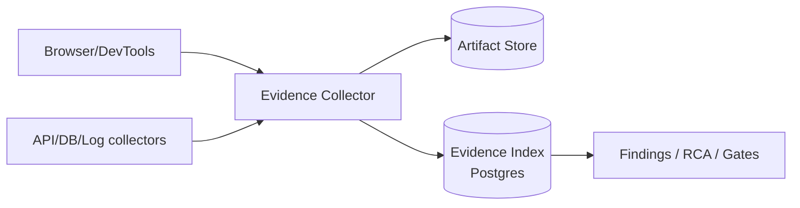

---

## 37. Artifact Architecture

**Purpose:** large-binary lifecycle (bytes) + metadata ownership. V1: local filesystem rooted at scoped directories (`RECOMMENDED`); team/enterprise: S3-compatible backends (MinIO/AWS S3/Azure Blob/GCS) behind one `ArtifactStore` port. Metadata (IDs, hashes, provenance, retention class, links) lives in PostgreSQL; bytes NEVER live in Postgres.

ARCH-370: Content-addressed layout (SHA-256), dedup by hash, compression per class, encryption in transit + at rest, access control (sensitive classes need capability + audit), streaming upload/download, pre-signed/local-secure access, retention jobs per class (video short → metadata long; PRD defines no fixed defaults, so values are policy-configured), orphan detection + GC, archival tiering. Events carry `artifact.created` notices with references only.

---

## 38. Finding Architecture

Three-tier model: `Raw Tool Finding` (vendor-shaped, immutable) → `Normalized Finding` (WTT-shaped, severity/confidence proposed) → `Canonical Finding` (deduplicated, correlated, owned, lifecycle-managed).

Pipeline: `Tool Results → Normalization → Deduplication → Correlation (graph + history) → Severity scoring → Confidence scoring → Ownership mapping → Canonical Finding`.

Finding states: `OPEN → INVESTIGATING → FIX_PROPOSED → FIX_APPLIED → VERIFYING → RESOLVED` (+ `FALSE_POSITIVE`, `ACCEPTED`/deferred-with-expiry, `REGRESSED`). Transitions are attributed, evented, single-owned by the Finding Engine.

ARCH-380: Dedup keys combine URL + element/node + rule + stack trace + API + source file + DOM path + visual region + root-cause signature + semantic similarity. REQUIRED behavior: axe + Lighthouse + AI readability signals on one node collapse to ONE canonical finding with multiple evidence sources (PRD §56). Severity (`critical/high/medium/low/info`) fuses tool severity + exploitability + reachability + data sensitivity with transparent inputs; confidence (`0–1` + rationale) stays separate. False positives are first-class (rationale, fingerprint suppression with scope + expiry, learning feedback). Ownership routes via CODEOWNERS-style + graph-derived mapping.

---

## 39. Root Cause

Root Cause Engine correlates browser evidence, DOM, console, network, API, database, logs, metrics, traces, code, Git, deployment info, and historical findings:

```text
Finding → Evidence Graph assembly → Candidate Causes (deterministic rules + targeted AI hypotheses)
 → Impact Analysis (graph blast radius) → Confidence Ranking → Root Cause Report
 (cause, confidence, evidence for/against, affected component, impact, recommended fix,
  symptom vs contributing-factor vs root-cause labels, next-evidence-needed when uncertain)
```

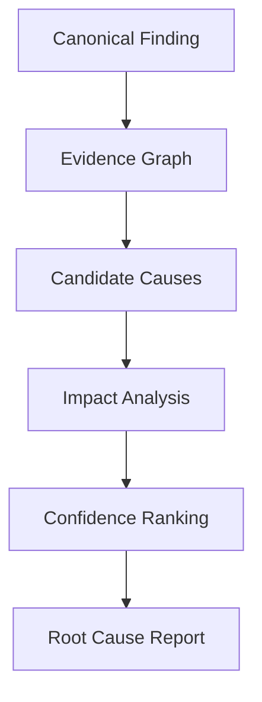

ARCH-390: LLM hypotheses are NEVER confirmed causes — confirmation requires evidence entailment (failing assertion + stack/frame + code span + reproduction or counterfactual pass). Investigations are dashboard-visible, replayable, and reusable as regression oracles. Low-confidence reports trigger targeted evidence collection within budget instead of guessing.

---

## 40. Code Intelligence

Workspace Analyzer subsystems (localhost/code-access, workspace-bounded): Git Analyzer · Language Detector · AST Parsers (TS/Python/Java + web templates) · Module/Dependency Graph · Route Mapper · Component Mapper · API Mapper · Database Mapper · Test Mapper. Indexing is incremental (watch + diff-driven) and persisted per project; full re-index is explicit and rare.

ARCH-400 — Targeted Context Resolution (mandatory algorithm):

```text
Failure → Evidence → Affected page/API/component →
Directly connected files → Relevant dependency edges (1 hop, ranked) →
Minimum required context (~N files/symbols budget)
   → expand ONLY while confidence < threshold AND budget remains,
     each expansion logged with evidence justification
```

Full-codebase rereads per defect are prohibited as default strategy. Outputs feed RCA (§39), change impact (§43), test selection (§44), and patch scoping (§41) with file/AST evidence links. Build/quality adapters (lint/typecheck/coverage/mutation per PRD §45) run as gated `build.*` executions with normalized reports.


## 41. Auto-Remediation

Strict stage separation: Diagnosis (§39–§40) · Patch Planning (minimal scope, file allowlist from targeted context) · Patch Generation (diff-producing, never direct writes) · Patch Application (controlled applier) · Validation (lint/compile/unit/API) · Verification (§42) · Rollback. The LLM NEVER writes to arbitrary files — it emits candidate diffs consumed by the controlled applier.

Auto-fix transaction (`APPROVED BY PRD` flow, architecturally transactional):

```text
Create checkpoint (git stash/branch or workspace snapshot + before-hashes)
 → Generate candidate patch → Validate paths (workspace-bounded, allowlisted)
 → Validate permissions (PROJECT_WRITE granted, env permits)
 → Apply patch → Compile/lint → Unit/API tests → Browser verification → Regression
 → COMMIT (verified) or ROLLBACK (any failure → restore checkpoint, mark fix.failed)
```

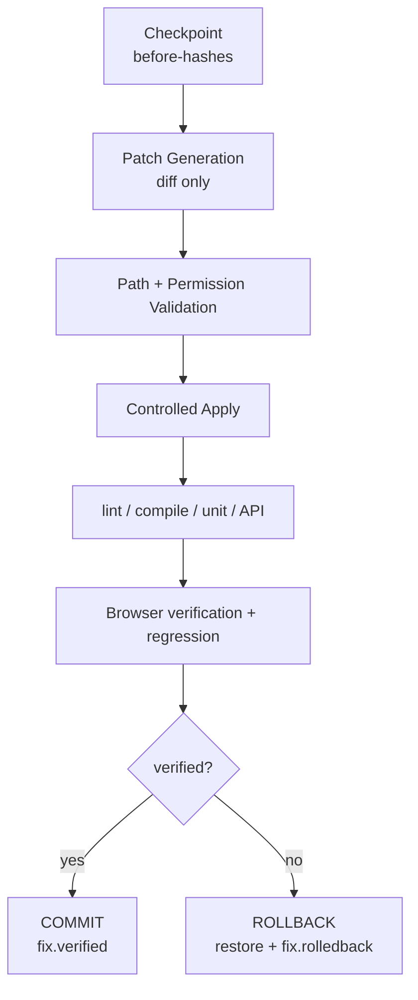

ARCH-410: Persisted per fix: before/after hashes, unified diff, reason, agent, model, policy decision, evidence refs, verification record. Unrelated hunks are rejected by policy. Remote/no-code-access targets receive guidance artifacts (suggested diffs, config changes, tickets), never mutation. No auto-push/merge/deploy/prod-DB-write by default (§53.3). Fix states (`proposed→approved/denied→applied→verified/failed→rolled-back`) are evented and dashboard-visible with diffs + checks.

Git integration: status/branch/commit/diff/stash-checkpoint/restore via `git.*` capabilities; push/merge require explicit configuration + approval + audit.

---

## 42. Verification

**Purpose:** independently prove or refute a fix. The Verification Service is organizationally and logically separate from patch generation: the agent that wrote the patch MUST NOT be the authority that marks it fixed.

Verification set = original failing scenario + directly affected tests + required regression set (from Change Impact, §43). Each verification run captures fresh evidence, evaluates deterministic oracles, and records `verification.passed/failed` with inputs + artifacts. Failed verification triggers rollback (default) or policy-defined escalation — never a silent half-patched workspace. Healing/flake labeling (§44.2) applies to verification runs so infra noise cannot masquerade as fix failure (or success).

---

## 43. Change Impact

Inputs: Git diff · AST graph · component/route/API/database graphs · test graph · historical failures. Outputs: affected components/workflows · tests to run (ranked) · risk score · regression scope · explanation chain (`changed file → dependents → covering tests → risk rationale`).

ARCH-430: The engine is deterministic-first (graph reachability + coverage mapping) with AI-assisted ranking/explanation layered on top. Results feed Test Selection (§44) and the remediation verification set (§42). Every impact claim links to graph edges so engineers can challenge it.

---

## 44. Intelligent Test Selection

Strategies (composable, explicit precedence): full-suite · change-based · risk-based · historical-failure · business-criticality · dependency-based · flakiness-aware · release-scope-based. Goal: run the right tests, not every test.

ARCH-440: Each run records strategy + included/excluded tests with rationale + coverage delta + risk acceptance for skips. Deselection is conservative near gates: skipped critical/risky tests become explicit gate caveats, never silent passes. Selection inputs (impact, flake scores, criticality tags) are versioned so gate replays are reproducible.

### 44.2 Flakiness architecture

Persisted per test: history, browser/env/runtime, duration + variance, failure signatures, network conditions, selector stability. Outputs: flakiness score + likely-cause class + recommended action (quarantine/heal/fix-wait/split/infra-fix/investigate-app). Scores are dashboard/API-visible; flaky tests cannot gate releases without quarantine + caveat. Self-healing (§21/§44.3) and flake scoring share signals but remain separate pipelines with separate audit trails.

### 44.3 Self-healing (test automation, NOT app fixing)

Selector/locator/role/text recovery, DOM-similarity + visual fallback, wait/timing repair, retry optimization. Every heal is logged, versioned, confidence-scored, reversible, and verified (N consecutive passes or quarantine); healed runs are labeled; drift beyond thresholds raises an app-change finding alongside the heal. Healing logic lives in the Execution Engine (LocatorEngine/WaitEngine), invoked by workers, approved by policy — Fix Agent scope is strictly the application.

---

## 45. Visual / Accessibility / Performance

Shared engine shape — Capture → Baseline/Threshold → Comparison → Classification → Review — with normalized WTT findings + linked evidence. Vendor tools are adapters; WTT owns canonical results.

- **Visual:** Playwright captures + pixelmatch/OpenCV-class diff + AI semantic diff (Percy/Applitools/Chromatic/Backstop-class optional); baselines are branch/env-aware, versioned, approvable, attributable; AI verdicts carry rationale + region annotations + confidence; responsive/component/theme diffs supported.
- **Accessibility:** axe-core-class static analysis + browser AX-tree inspection mandatory; Pa11y/Lighthouse/Accessibility-Insights/WAVE-class optional; AT automation (NVDA/JAWS/VoiceOver/TalkBack/Narrator) is `FUTURE`-pluggable. Findings map to WCAG criteria with node/tree-excerpt/contrast/keyboard-trace evidence.
- **Performance:** Lighthouse/Lighthouse-CI/WebPageTest/Sitespeed/Web-Vitals/Chrome-perf APIs behind `performance.*`; metrics (LCP/INP/CLS/FCP/TTFB/timings/long-tasks/shifts/CPU/mem) stored as time series with per-metric × page-type × environment budgets; violations link to contributing requests/scripts and gate when configured.
- **Responsive/UI/UX/SEO:** viewport-matrix execution with diffable evidence (§PRD 35–36); SEO checks (meta/crawl/config depth V1 per `ARCH-OD-012`) behind `seo.*`.
- **Load/stress** (isolated, gated): k6/JMeter/Gatling/Locust-class engines in dedicated Load Workers, never sharing interactive browser processes; explicit authorization + rate/concurrency caps + abort conditions + monitoring hooks; every run audited (profile, peak RPS/concurrency, duration, observed impact). Production load beyond passive/smoke is denied by default.
- **Network/DNS/TLS:** diagnostics (curl/HTTPie/ping/traceroute/mtr/packet-capture-gated) + proxy inspection (mitmproxy-class, explicit certs, redaction) + DNS/DNSSEC + TLS (chain/expiry/hostname/versions/ciphers/HSTS/OCSP) via OpenSSL/SSLyze/testssl-class adapters; configuration weakness vs active vulnerability distinguished.

---

## 46. Security Testing

Policy-gated tiers (never auto-escalated): passive security analysis → safe configuration validation → active security testing → high-impact testing (explicit approval + scope + audit). Adapters: ZAP/Nuclei/Wapiti/Nikto-class DAST, Semgrep/CodeQL/SonarQube/Bandit-class SAST, Snyk/Trivy/Grype/OSV-class SCA, Gitleaks/TruffleHog-class secrets, Syft/CycloneDX/SPDX SBOM, Checkov/tfsec/Terrascan/KICS-class IaC, kube-bench/Kubescape/Polaris-class K8s, cloud-config validators — each behind `security.*`/`sast.*`/`sca.*`/`secret.*`/`container.*`/`iac.*` capabilities with safe profiles first.

ARCH-460: The Security Agent proposes; the Policy Engine + scope artifacts + environment defaults dispose. WTT NEVER unleashes all scanners: selection is risk + fingerprint + scope-driven. Session/HTTP hardening checks (cookies/JWT/OAuth/OIDC/SAML/CSRF/CSP/CORS/HSTS/clickjacking/referrer/permissions-policy/mixed-content/cache/logout/token-lifecycle) run as configuration validation. Security findings use defensive wording (evidence + CVSS-style mapping + WTT confidence + remediation; no weaponization detail), export to SARIF, and are fully audited. External-tool results convert through anti-corruption adapters (`ZapAdapter`, `SemgrepAdapter`, `TrivyAdapter`, …) into canonical WTT structures — vendor models never leak into the domain.


## 47. Data Persistence

Persistence map (one writer per row-family, §9.1):

| Data | Store | Owner |
|---|---|---|
| Projects/targets/envs/sessions/runs/plans/tests/steps/workflows | PostgreSQL | Session Manager, planners |
| Events requiring persistence + outbox + audit | PostgreSQL | Event Router, Audit Sink |
| Tool/worker registries + executions + jobs/DLQ records | PostgreSQL (+ Redis hot view) | Registry, Scheduler |
| Findings (raw/normalized/canonical) + suppressions + ownership | PostgreSQL | Finding Engine |
| Artifact metadata + evidence index | PostgreSQL | Artifact Service |
| Artifact bytes | Filesystem V1 → S3-compatible | Artifact Service |
| Fixes/verifications/checkpoints refs | PostgreSQL | Remediation/Verification Svcs |
| Quality scores/gates/reports | PostgreSQL | Gate Evaluator, Report Builder |
| Queue jobs, locks, heartbeats, ephemeral cursors, cache | Redis (TTL'd) | Scheduler, workers |
| Graph nodes/edges (relational, §19) | PostgreSQL | Graph Store |
| Config/scope/policy snapshots per session | PostgreSQL (immutable copy) | Config/Policy |
| Secrets | External stores only; refs in PG | Credential Broker |

---

## 48. PostgreSQL

**Purpose:** system of record. Architectural entity view (full schema in `DATABASE.md`):

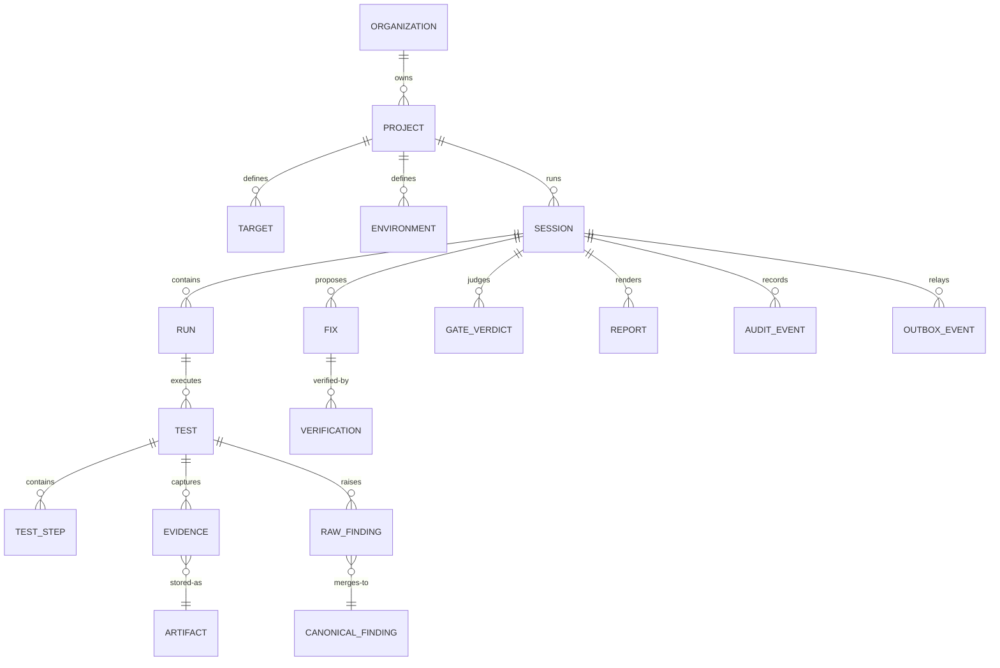

ARCH-480: Conventions — stable prefixed IDs; UTC timestamps + monotonic seqs; optimistic-concurrency versions on state machines; redaction-safe text columns for untrusted content; JSONB for flexible attributes with GIN indexes; migrations owned by the control plane (forward-only numbered, rollback-tested, backup-gated, deployment-ordered: migrate → deploy → verify). No large binaries in rows. HA/read-replicas are enterprise deployment options, not V1 requirements.

---

## 49. Redis / Queue

ARCH-490: Redis is used ONLY for justified runtime concerns: queue backing, distributed locks, ephemeral state, safe caches, worker heartbeats, event streaming fanout. It is NEVER authoritative durable business storage — anything required for resume/report/audit MUST be recoverable from Postgres + artifact store after Redis loss.

V1 (`RECOMMENDED ARCHITECTURE`): BullMQ-class queues on Redis (priorities, dependencies, retries, timeouts, DLQ, idempotency keys, rate limiting) + Redis Streams for event fanout. Migration triggers toward NATS/RabbitMQ/Kafka/Temporal: multi-control-plane routing, cross-region workers, durable replay-at-scale, saga/orchestration complexity — each adopted behind the same job/event contracts when measured need appears (`ARCHITECTURE DECISION REQUIRED` candidates in §81 carry PRD OD-002).

---

## 50. Object Storage

`ArtifactStore` port with backend adapters: filesystem (V1 default, scoped roots) → MinIO / AWS S3 / Azure Blob / GCS (team/enterprise). ARCH-500: content-addressed (hash-named) objects, multipart streaming, server-side encryption + TLS, per-class retention jobs, orphan GC, archival tiering, pre-signed (or local-capability) URLs for dashboard/CI fetch. Backend choice is deployment configuration; session/evidence/finding contracts never change across backends.

---

## 51. APIs

Layered surfaces (endpoint details in `API_SPEC.md`):

```text
Public Control API   /api/v1/projects|targets|sessions|tests|findings|artifacts|
                     tools|workers|fixes|reports|gates|config|audit  (OpenAPI, versioned)
Dashboard API        above + WS/SSE streams + cursor backfill (same authN/Z)
Internal Worker API  job claim/heartbeat/result/artifact-upload (mTLS/token, network-restricted)
Tool Exec Protocol   stdio-JSONL / local-RPC / gRPC per §31 (never public)
```

ARCH-510: REST conventions — auth (local token V1; OIDC/OAuth enterprise), RBAC, idempotency keys on mutations, pagination/filter/sort, stable versioned error envelope (`code/category/severity/retryable/userMessage/technicalMessage/correlationId`), rate limits, mutation audit. Compatibility: additive changes minor; removals major with deprecation window; CLI ↔ Control Plane ↔ Dashboard ↔ Workers ↔ SDKs negotiate versions and fail with actionable mismatch errors (never silent skew).

### 51.3 Report pipeline

`Session Data + Findings + Evidence + Metrics + Fixes + Verification → Report Model (canonical, versioned) → renderers (HTML/PDF/JSON/CSV/XLSX/JUnit/SARIF/Markdown)`. Tool-native reports are artifacts, never authoritative. `wtt report` renders offline from persisted state; CI gets deterministic JUnit/SARIF ordering.

---

## 52. Secrets

ARCH-520: Secrets are REFERENCES end-to-end (`secretRef: vault://… | env://… | keychain://…`), resolved at use-time. Adapters: OS keychain (V1 localhost), environment injection (CI), HashiCorp Vault, AWS Secrets Manager, Azure Key Vault, GCP Secret Manager, K8s/Docker secrets. Secret classes (test accounts, API keys, DB creds, OAuth secrets, cloud creds) carry scope + TTL + rotation guidance.

Credential Broker flow: `Tool → permission check → broker → short-lived scoped credential (lease, auto-expiry) → use → audit (access logged, value never logged)`. Redaction is automatic and layered: CLI output, structured logs, events, dashboard streams, evidence (HAR/payloads/cookies/headers), reports — with deterministic placeholders and need-to-know reveal (RBAC + audit). No plaintext credentials in config/DB-logs/events/artifacts/reports (invariant).

---

## 53. Security Architecture

### 53.1 Threat model → controls (summary; full analysis in `SECURITY.md`)

| Threat | Architectural control |
|---|---|
| Prompt/indirect-prompt injection, malicious page/API/file content | 4-strata instruction separation; untrusted tagging; arg validation; policy unreachable from content (§26.1) |
| Command injection / unsafe shell | Capability→planner→policy→validator→scoped executor→audit pipeline (§63); no string-shell by default |
| Tool hijacking / plugin compromise | Manifest validation, hash/signature, permission declarations, sandbox, quarantine, audit (§53.4) |
| SSRF / network overreach | Scoped network authority (`target-only/target+declared/internet-read-only/none`), egress allowlists, metadata-IP denial |
| Path traversal / FS escape | Scoped roots (workspace/runtime/artifacts/sandbox), traversal denial, symlink policy (§63) |
| Credential leakage | Refs-only, broker leases, layered redaction, restricted retention (§52) |
| Malicious target / downloads / browser escape | Context isolation, download quarantine + scan policy, no dashboard-origin access (§16.1) |
| Cross-session / cross-tenant leakage | Session-scoped contexts/queues/keys, tenant isolation at every store, broker scoping |
| Artifact poisoning | Hash-addressed, provenance-signed, consumer re-verification |
| Supply-chain compromise | Lockfiles, SBOM, signed releases, provenance, dependency/secret/container scanning |
| AI excessive agency / unsafe auto-fix | Deterministic policy veto, classification gates, approvals, transactional rollback (§41–§42) |

### 53.2 Risk classification (architecture-level)

`READ_ONLY · SAFE_TEST · PROJECT_WRITE · ACTIVE_NETWORK · SECURITY_ACTIVE · LOAD_ACTIVE · SYSTEM_CHANGE · DESTRUCTIVE · BLOCKED` — mapped 1:1 to PRD §13 operation classes. Classification drives: auto-execution eligibility, approval requirements, environment restrictions (prod defaults deny active/load/destructive/system-change), audit depth, and UX (blast-radius confirmations). Denylists beat allowlists; unknown classifies as `BLOCKED` until declared.

### 53.3 Environment-specific policy (defaults, configurable)

- **LOCAL:** project writes, build/unit tests, fix application permitted (workspace-trust + checkpoint + audit).
- **STAGING:** active testing + limited writes + load-if-approved (scope + caps + monitoring + abort plan).
- **PRODUCTION:** passive + safe-functional + read-only; strict rate limits; no code modification, no destructive/system-change, no active security/load beyond smoke — relaxation requires explicit auditable policy change.
- **Safe Mode** (explicit profile): read-only inspection only — no code modification, no active security/load, no destructive actions. Recommended default for first-touch production runs.

### 53.4 Plugin & supply-chain security

Third-party plugins are code execution: publisher identity, manifest validation, checksum/signature verification (policy-gated), version pins, permission declarations enforced at runtime, sandboxing, disable/quarantine on anomaly, full audit. WTT itself ships with locked dependencies, SBOM, signed artifacts, release provenance, and dependency/secret/container scanning in its own pipeline. WTT dogfoods its dashboard scans in explicit test environments (never recursive uncontrolled runs).

### 53.5 Data classification & retention

Classes: public · internal · confidential · secret · sensitive-evidence (PII/cookies/customer data/internal URLs). Handling: minimization pre-capture, masking at capture, encryption in transit/at rest, strict-access originals, tenant isolation, log sanitization, provider data-policy configuration. Retention is policy-per-class (e.g., video short, screenshots medium, metadata/gates/audit long — values configured, not hardcoded). No legal-compliance claims; WTT emits technical evidence labeled as such.

---

## 54. Trust Boundaries

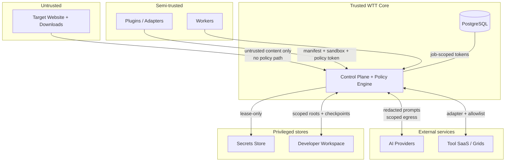

Allowed crossings: untrusted content enters ONLY as tagged data; plugins/workers cross ONLY with validated manifests + scoped tokens; AI providers receive ONLY redacted, minimized payloads; secrets cross ONLY as short-lived leases to authorized jobs; workspace writes cross ONLY via checkpointed applier within scoped roots; dashboard↔target origins NEVER cross directly (event-mediated sync only).


## 55. Observability

OpenTelemetry throughout: CLI startup, session lifecycle, agent invocations, model requests, tool executions, browser actions, worker jobs, DB calls, queue waits, artifact writes, report generation — all correlated via `traceId + sessionId + jobId + correlationId`. Local-first: full signal value in dashboard + CLI without external SaaS; export (Prometheus/Grafana/Loki/Tempo/Jaeger/Elastic/Sentry/Datadog/New-Relic-class) is opt-in via OTel exporters with redaction.

### 55.3 Observable AI (without chain-of-thought exposure)

Recorded per decision: task, selected capability, reason category, input references, model, output action, confidence where appropriate, tokens/cost. Private reasoning traces are NEVER required or persisted.

---

## 56. Logging

Structured JSON Lines (file) + human console. Required fields: `timestamp · level · service · module · sessionId · runId · workerId · toolId · agentId · correlationId · traceId · message · metadata`. Automatic redaction of passwords/tokens/cookies/API keys/authorization headers at the logging layer (defense in depth with source-side redaction). Log levels: default concise, `--verbose` dense, `--debug` diagnostic; `--quiet` essential-only. Human intervention (pause/resume/cancel/skip/approve/deny/take-control/disable-autofix/approve-fix/rollback) is always log- + audit-visible.

---

## 57. Metrics

Illustrative metric families (exact names finalized in `OBSERVABILITY.md`): `wtt_sessions_total/_failed · wtt_active_sessions · wtt_tool_execution_duration · wtt_tool_failures_total · wtt_browser_actions_total · wtt_worker_queue_depth · wtt_worker_utilization · wtt_ai_tokens · wtt_ai_cost · wtt_findings_total · wtt_fix_success_rate · wtt_event_lag · wtt_artifact_bytes · wtt_gate_verdicts`. Per-session queryable + fleet-aggregatable; spend meters live in dashboard/CLI.

---

## 58. Tracing

WTT-OTel spans nest: `session → run → plan → agent-task → tool-execution → browser-action/model-call/artifact-write`. Span attributes carry redacted policy decisions, resolver rationale, retry counts, and budget consumption. Trace exemplars link metrics ↔ logs ↔ events ↔ evidence for single-click diagnosis from any dashboard surface.

---

## 59. Audit

Append-only, tamper-evident (`RECOMMENDED`: hash-chained rows; `ARCHITECTURE DECISION REQUIRED` vs WORM/ledger per PRD OD-009), retained per policy, exportable (JSON/CSV), replay-queryable by session/correlation. Recorded: session creation, scope/policy changes, approvals/denials, security scans, command executions, file modifications, secret accesses (access-only), fix lifecycle incl. rollback, configuration changes, gate verdicts + waivers, user takeovers. Auto-remediation audit includes proposal, checkpoint, diff, checks, apply, retest, verification, rollback — each with actor/timestamp/hash/evidence.

---

## 60. Error Handling

Standard taxonomy: `ValidationError · ConfigurationError · AuthorizationError · TargetUnavailableError · ToolUnavailableError · ToolExecutionError · BrowserError · WorkerError · AgentError · AIProviderError · StorageError · DatabaseError · PolicyViolation · TimeoutError · CancellationError`. Every error carries `code · category · severity · retryable · userMessage · technicalMessage · correlationId`.

Retry discipline: safe-retry (idempotent reads, timeouts) with backoff/jitter + budgets · retry-with-backoff (transient infra) · non-retryable (validation, auth-denial, policy) · requires-user-action (credentials, scope, approvals). Destructive/system-change failures NEVER auto-retry. User-facing errors state what happened, what was preserved, exact next command (`resume`/`report`/`doctor`), and diagnostics location; stacks stay in debug logs.

---

## 61. Resilience

Design for: browser crash · worker/tool crash · AI timeout · queue outage · DB outage · network loss · dashboard disconnect. Posture: persist → salvage partials → mark interrupted (never drop) → resume idempotently.

- Fault isolation: each tool/browser-context/worker/model-call is its own failure domain; crashes route to retry-per-policy or DLQ with diagnostics + replay.
- Checkpoints at: discovery complete · plan complete · workflow complete · tool-batch complete · pre-remediation · post-remediation · pre-report. Resume continues from the latest checkpoint key.
- Backpressure: batching/sampling/aggregation/limits on hot streams (network/console/HAR/video); slow dashboard consumers get cursors + summarization, never unbounded buffers.
- Degraded modes: AI-unavailable → rules planner (labeled); queue-down → in-process fallback with caps; DB-down → pause scheduling, serve cached reads, protect in-flight evidence; Redis-loss → rebuild ephemeral state, truth intact in Postgres.

---

## 62. Cross Platform

Windows/macOS/Linux (x64 baseline, arm64 SHOULD) via an OS abstraction layer: paths (no hardcoded separators), process spawning (no `/bin/sh` or PowerShell assumptions), file watching, symlinks, permissions, line endings, browser install locations, sandbox primitives per OS. CI matrices prove parity; no capability silently no-ops — unsupported-on-platform fails with explicit messaging + alternatives. Core logic never depends on Docker/K8s/AWS/Linux specifics; those are deployment adapters.

---

## 63. Process Execution

Abstractions: `CommandRunner` (validated argv, no string-shell default) · `ProcessHandle` (stdout/stderr streaming with caps, exit code/signal, timeout, cwd, filtered env, resource limits) · `ProcessSupervisor` (restarts per policy, orphan reaping, tree kill on cancel).

Terminal security pipeline (every command): `Agent requests capability → Command Planner (argv construction) → Policy Engine (classification × scope × env) → Command Validator (allow/deny tables) → Workspace Validator (scoped roots) → Risk Classification → Approval if needed → Process Executor (isolated, redacted stream) → Structured result + Audit`. Each execution records origin, requested capability, cwd, env (filtered), classification, authorization, timeout, result. Filesystem roots: project workspace · WTT runtime dir · artifact dir · temp sandbox; `../` traversal, system dirs, SSH keys, browser profiles, and unrelated home dirs are denied unless explicitly permitted. Network authority per job: `target-only · target+declared-APIs · internet-read-only · none` (production security/load tools get the strictest applicable).

Human browser takeover: control state is explicit (`AI_CONTROLLED ⇄ USER_CONTROLLED ⇄ SHARED`); conflicting simultaneous actions are prevented by action leases; every takeover/return is evented + audited.


## 64. Deployment Architecture

Progressive tiers, identical domain contracts: (1) Local single-node (default) · (2) Team service (Compose) · (3) Enterprise scale (K8s + managed data + grids). Deliverables: npm CLI package · Node runtime · Python worker package/container · Java worker JAR/container (opt-in) · dashboard static app · Docker images · Helm later (`FUTURE`).

Update discipline: CLI version check, tool↔contract compatibility matrix, event/schema/config migration compatibility, plugin compatibility gates, migration-safe DB upgrades, documented backup/restore. Offline mode: localhost + local models + local tools + local artifacts keep working; external integrations degrade gracefully with explicit status. Air-gapped enterprise (private models/registry/mirrors, no internet) is `FUTURE` unless PRD reprioritizes — adapters already isolate the seams.

---

## 65. Local Topology

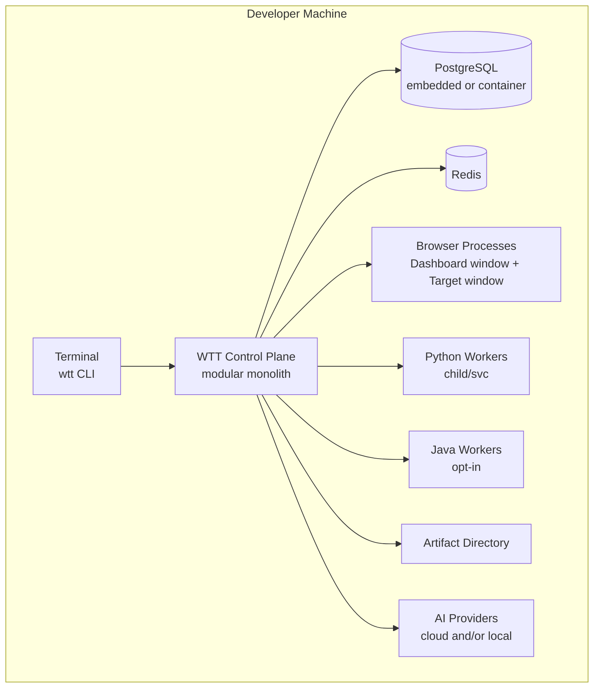

V1-mandatory locally: CLI, control plane, Postgres, Redis, one browser engine, dashboard, artifact dir, ≥2 model routes incl. local-compatible. Optional in V1: Java workers (only for justified heavy jobs), containers (native-first for headed UX), external grids/SaaS.

---

## 66. Docker Topology

Compose-profile services (`RECOMMENDED`): `wtt-control · wtt-dashboard(static/served) · postgres · redis · python-worker · java-worker(opt-in) · minio(S3-compatible)`. Browsers stay native by default for headed UX; headless browser containers are opt-in. Native and containerized modes MUST remain interchangeable via configuration (same queue/event/artifact contracts, different bindings).

---

## 67. CI Topology

```text
CI Runner → wtt --ci --headless <URL> → WTT Runtime →
Browser/Tool Workers → Quality Gates → Exit Code + Report artifacts
(JUnit/SARIF/JSON/HTML uploaded; dashboard window never required)
```

CI contracts: `--ci` implies headless + no-prompt + structured logs + deterministic ordering; pre-approval tokens replace interactive approvals (fail closed otherwise); scope verification runnable without tests; artifact paths printed for upload; gate verdicts map deterministically to pipeline pass/fail.

---

## 68. Enterprise Topology

`FUTURE` architecture (contracts stable from V1):

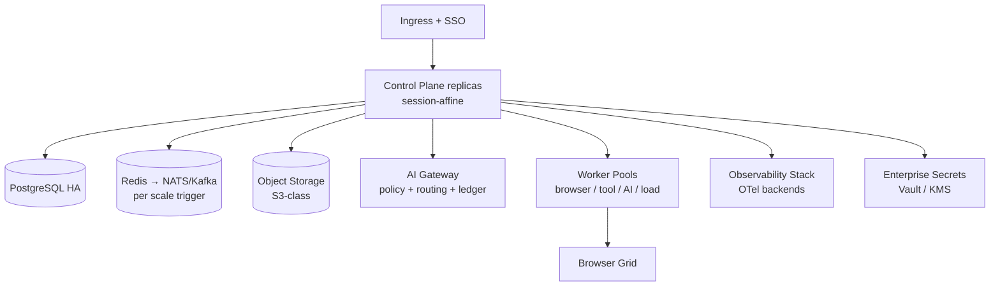

Adds: multi-tenancy (org→workspace→project→tenant→user→role with store-level isolation), central control plane, HA data, enterprise secrets/SSO/RBAC, fleet dashboards, CI fleets, audit retention/legal-hold. V1 MUST NOT carry SaaS-tenancy complexity; it MUST NOT paint itself into a corner either (tenant keys + isolation seams designed now, enforced later).

---

## 69. Scalability

Independent scaling axes: Control Plane (vertical → session-sharded replicas) · Browser Workers (pool → grid) · Discovery/API/A11y/Visual/Perf Workers (queue-sharded) · AI Workers (model-gateway + GPU where needed) · Load Workers (isolated fleets) · Artifact Storage (fs → S3-class) · Database (tuned single → replicas → partitioned hot tables) · Event Delivery (Redis streams → NATS/Kafka on trigger). Likely bottlenecks: browser memory/CPU per context, DevTools event volume, artifact upload bandwidth, model rate limits/cost, Postgres hot-row contention on session/event tables — each instrumented (§57) with quotas + backpressure + sharding answers.

---

## 70. Performance

Architectural expectations (budgets, not SLAs — PRD defines no hard numbers): fast CLI startup (lazy provider/tool loading, warm caches); sub-second dashboard event-to-glass at sustained 10k events/min (PRD NFR direction); minimal browser-action overhead (action batching, persistent contexts, warm pools); high-throughput worker dispatch (prefetch + affinity, no head-of-line blocking across sessions); streaming artifact upload (multipart, backpressured); bounded AI latency (routing, timeouts, fallbacks, caching of safe derived data only). Every expectation is measured (§57–§58) and regressed in WTT's own pipeline.

---

## 71. Cost / Resources

Workers declare `cpu/ram/disk/network/gpu/browserSlots`; the scheduler packs under per-machine and per-session quotas with idle reclamation — developer laptops MUST NOT be melted by default profiles. Execution profiles (`QUICK/STANDARD/DEEP/FULL/CUSTOM`) configure capability sets + budgets, never hardcoded workflows.

Cost ledger collects, per invocation: model, tokens, request count, runtime, tool license units, worker duration, storage bytes — attributable to organization/project/session/agent/tool. The orchestrator weighs value vs cost (prioritization, early termination, model downgrade, budget-pause with partial-report caveats). Spend meters are live in dashboard/CLI and itemized in reports.

---

## 72. Extensibility

New tools, agents, browsers, AI providers, workers, test types, report formats, artifact stores, and queues MUST plug in without core rewrites: implement the port (Tool Contract / `BrowserDriver` / provider adapter / `ArtifactStore` / queue binding), register the manifest, declare permissions — the resolver, scheduler, and dashboard pick it up. Anti-corruption layers are mandatory at every external seam (`WTT Capability → Adapter → External Tool`); vendor models never leak into the domain. Feature flags gate new agents, experimental tools, auto-fix, distribution, and security modules. Shared `contracts/` package + generated TS/Python/Java bindings prevent schema drift. Historical analytics (regression/flake/perf/recurrence/fix-effectiveness/quality trends) persist from canonical data with sensitive-raw-data minimization. External adapters (`LighthouseAdapter`, `AxeAdapter`, `ZapAdapter`, `K6Adapter`, `SemgrepAdapter`, `TrivyAdapter`, …) convert vendor results to canonical findings/evidence.

---

## 73. Versioning

Versioned: public APIs (`/api/v1`, OpenAPI) · event envelopes + payload schemas · tool manifests + Tool Contract · worker job contract · DB migrations · configuration `apiVersion`s · artifact/report formats · agent charters/prompt-packs + policy bundles. Strategy: additive-first (minor), explicit deprecation windows, major on removal; old sessions/reports/manifests/event records remain READABLE after upgrades via versioned readers + recorded migrations; version negotiation at every handshake (CLI↔CP↔dashboard↔workers↔SDKs) with actionable mismatch errors; policy bundles pinned per session for replay fidelity.


## 74. V1 Architecture

Exact V1 shape delivering `wtt <URL> → session → dashboard → controlled browser → discovery → basic AI planning → functional testing → console/network evidence → findings → report`:

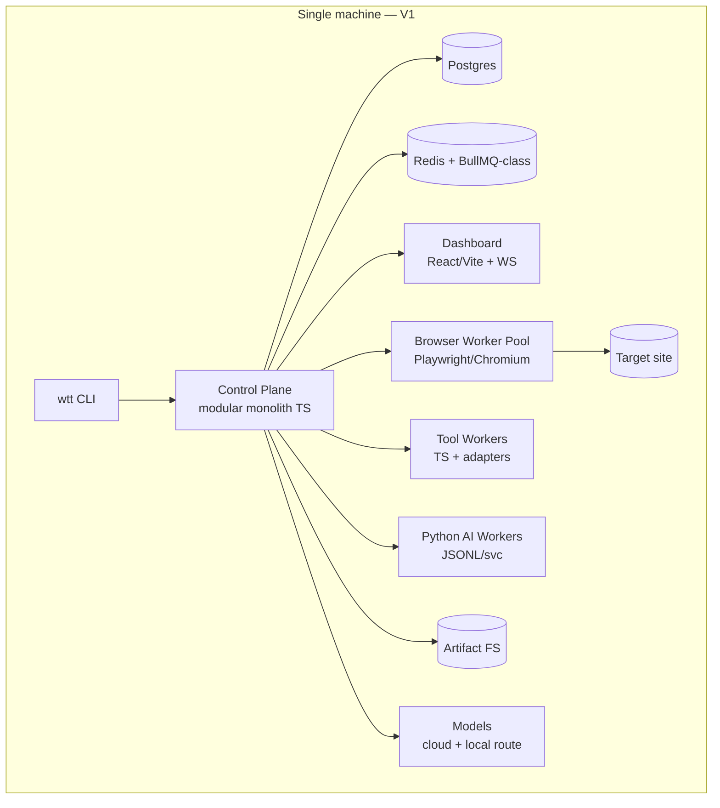

V1 includes (§74 PRD CORE, architecturally): layered CLI with exit codes/machine output/resume; target/env/scope/policy pipeline with production-safe defaults; event-sourced sessions; two-window headed UX (headless CI parity); dashboard IA with stubs for later surfaces; orchestrator + plan/dry-run + degraded rules planner; V1 agent subset; registry/contract/gateway + Playwright engine + JS discovery + core fingerprinting + axe/Lighthouse-smoke/API-observer/responsive/visual-baseline/network-TLS adapters + terminal engine with safety gates; correlated evidence + hashes; normalized findings + FP workflow; localhost fix pipeline with rollback; basic healing/flake; local pool + Redis queue with DLQ; canonical bus + backfill + audit; HTML/JSON/Markdown + JUnit (+SARIF) reports; deterministic gates; Postgres + Redis + FS artifacts (+S3-compatible config); Windows/macOS/Linux; `doctor` health system validating Node/browsers/Python/Java/DB/queue/tools/models/disk/ports/permissions BEFORE runs fail halfway.

Explicitly NOT V1-mandatory: Kafka/K8s/graph-DB/service-mesh/microservice splits, Java for lightweight jobs, remote workers for localhost runs, SaaS tenancy, mobile/desktop runners, AT automation, full load/security breadth, MCP server.

---

## 75. Evolution Roadmap

- **V2 (depth):** API/auth/RBAC matrices, visual/a11y/perf engines to full depth, advanced evidence (video/trace/DOM at scale), ranked RCA, responsive/UI/SEO breadth, contract/messaging depth where discovered.
- **V3 (autonomy):** auto-remediation to full pipeline maturity, change-impact-driven regression, intelligent selection at scale, security adapters breadth (still gated), advanced AI (vision-first planning, learning loops with guardrails).
- **Enterprise (scale + governance):** distributed workers + browser grid, multi-tenancy, central control plane, S3-class artifacts, HA Postgres, enterprise secrets/SSO/RBAC, fleet dashboards, CI fleets, integrations (tickets/test-mgmt/chat), plugin ecosystem + MCP.
- Triggers rule evolution: each step adopts new infrastructure ONLY on measured triggers (§49.3, §35, §69), behind unchanged contracts. Long-term scalability without contaminating V1 complexity.

---

## 76. Architectural Risks

| Risk | Prob. | Impact | Mitigation (architectural) | Domain |
|---|---|---|---|---|
| AI unpredictability / hallucinations | H | H | Deterministic authority, schema validation, evidence-gated verdicts, degraded planner, budgets | AI/Orch. |
| Target prompt injection → policy breach | H | H | 4-strata separation, untrusted tagging, arg validation, audit, red-team fixtures | Security |
| Tool version conflicts / breakage | M | M | Pinned manifests, side-by-side versions, contract negotiation, quarantine, `doctor` | Tools |
| Browser instability / resource hogging | H | M | Pool quotas, per-context isolation, salvage+retry, warm pools, grid offload path | Browser |
| Event volume flood | M | M | Backpressure, sampling/aggregation, refs-not-bodies, cursor backfill | Events |
| Artifact storage growth | H | M | Dedup, compression, retention jobs, tiering, quotas | Artifacts |
| Cross-language complexity | M | M | Single `contracts/` source, generated bindings, SDK harnesses, gateway validation | Platform |
| Worker compatibility skew | M | M | Version negotiation, capability advertisement, quarantine | Workers |
| Plugin supply-chain compromise | M | H | Signing/hash, sandbox, least-privilege, disable/quarantine, audit | Security |
| Unsafe auto-fix damage | M | H | Transactional checkpoint/verify/rollback, minimal diffs, env bans, approvals | Remediation |
| Distributed-state complexity | M | H | Local-first, outbox, idempotency, no distributed txns, phased fabric | Platform |
| Resource exhaustion (laptop melt) | M | M | Declared resources, quotas, profiles, idle reclamation, isolation of load workers | Sched. |
| False/noisy findings erode trust | H | M | Normalization/dedup, confidence separation, FP workflow, quarantine | Findings |
| Secret/PII leakage via evidence | M | H | Refs-only broker, layered redaction, minimization, restricted retention | Privacy |

---

## 77. Required ADRs

| ADR | Subject | Decides |
|---|---|---|
| ADR-001 | Control-plane shape | Modular monolith module map + extraction seams |
| ADR-002 | Event transport | In-proc + PG + Redis Streams V1; NATS/Kafka triggers |
| ADR-003 | Worker queue | BullMQ-class V1; Temporal/RabbitMQ/Kafka evolution |
| ADR-004 | Tool contract | Serialization (JSON Schema/OpenAPI/Protobuf mix) + versioning |
| ADR-005 | Browser engine | Playwright-first ports; Selenium/grid adapter plan |
| ADR-006 | Artifact storage | FS layout + S3-port; retention/encryption/GC |
| ADR-007 | Inter-language RPC | JSONL/HTTP/gRPC selection + `contracts/` ownership |
| ADR-008 | AI provider abstraction | Port, routing, fallback, ledger, redaction |
| ADR-009 | Auto-fix security | Transactional applier, checkpoints, env bans, approvals |
| ADR-010 | Monorepo strategy | `apps/·packages/·services/·tools/·contracts/·docs` layout, ownership, CI |
| ADR-011 | Graph persistence | Relational V1 vs extension vs future graph store |
| ADR-012 | Audit immutability | Hash chain vs WORM vs ledger |
| ADR-013 | Dashboard realtime | WS vs SSE vs hybrid + cursor protocol |
| ADR-014 | Control-plane framework | Fastify vs NestJS vs other (PRD OD-001) |

Monorepo sketch (`RECOMMENDED`): `apps/{cli,control-plane,dashboard} · packages/{core,contracts,tool-sdk-ts,browser-engine,event-schema} · services/{python-ai,java-worker} · tools/{adapters…} · contracts/{proto,schemas,openapi} · docs/`. Benefits: atomic contract changes, shared types, one CI truth. Risks: boundary erosion (mitigate: package-level import rules + ownership + dependency-direction checks in CI).

---

## 78. Technology Decisions

| Concern | Recommended | Alternatives | Reason | Status |
|---|---|---|---|---|
| Control-plane language | TypeScript/Node.js | Python/Java core | Browser/npm/IO fit; huge adapter ecosystem; single-language hot path | RECOMMENDED ARCHITECTURE |
| CLI framework | TS CLI (commander/yargs-class) | oclif/custom | Maturity, typing, testability | RECOMMENDED ARCHITECTURE |
| Backend framework | Fastify-class (or NestJS) | Hono/Express | Perf + schema-first; final via ADR-014 | ARCHITECTURE DECISION REQUIRED (PRD OD-001) |
| Browser engine | Playwright-first + ports | Selenium-first | CDP/BiDi depth, contexts, tracing, language fit | RECOMMENDED ARCHITECTURE |
| Database | PostgreSQL | — | Relational+JSONB, transactions, extensions, ops maturity | APPROVED BY PRD (baseline) |
| Queue | BullMQ-class on Redis | NATS/Temporal/RabbitMQ | Zero-new-infra V1, DLQ/retry/scheduling built-in | RECOMMENDED ARCHITECTURE (PRD OD-002 open for evolution) |
| Event transport | In-proc + PG + Redis Streams | NATS/Kafka | Local-first, replayable, trigger-gated scale-up | RECOMMENDED ARCHITECTURE |
| Realtime dashboard | WebSocket + SSE + cursors | WS-only/SSE-only | Live duplex + simple stream fallback, backfill both | RECOMMENDED ARCHITECTURE |
| Artifact storage | Filesystem V1, S3-port next | DB blobs (rejected) | Blobs never in rows; port keeps backends swappable | APPROVED BY PRD (baseline) |
| Python comms | JSONL subprocess → FastAPI svc | gRPC-only | Lowest ops for short-lived; services where stateful | RECOMMENDED ARCHITECTURE |
| Java comms | gRPC/service/container | stdio-only | Throughput + long-lived fit; opt-in deployment | RECOMMENDED ARCHITECTURE |
| AI gateway | In-CP routed gateway + adapters | External SaaS gateway | Policy-coupled routing/ledger/redaction; local-model path | RECOMMENDED ARCHITECTURE |
| Observability | OpenTelemetry + exporters | Vendor SDK direct | Portability, correlation, local-first | APPROVED BY PRD |

---

## 79. Architecture Invariants

Non-negotiable; any violation is a release-blocking defect:

```text
1.  WTT policy cannot be overridden by target content (any stratum, any path).
2.  No tool executes without registered capabilities + policy decision + audit.
3.  Every project write is attributable (actor, diff, hashes, checkpoint, reason).
4.  Every fix has an explicit verification status; unverified fixes never read "fixed".
5.  Every active security/load/destructive action has scope authorization + audit.
6.  Every finding references evidence (or records explicit evidence-waiver + reason).
7.  Every session has a stable, unique, sortable ID across restarts and concurrency.
8.  The dashboard is never authoritative state storage.
9.  AI cannot bypass the Policy Engine on any path (no backdoor clients).
10. Secrets never enter general event logs, error messages, or reports.
11. Large artifacts are referenced, never embedded, in event payloads.
12. Agents communicate via structured tasks + events, never free-form RPC meshes.
13. Session/finding/fix/gate mutations have exactly one owning component each.
14. Resume never duplicates completed work (idempotent checkpoints everywhere).
15. Production defaults deny active/destructive classes until explicitly overridden + audited.
```

---

## 80. Acceptance Criteria

Given `wtt http://localhost:5173`, the architecture explains each step:

1. **CLI receives URL** — parser + `run` command validate shape (§11).
2. **Target normalized** — Target Resolver canonicalizes + classifies localhost (§13).
3. **Scope validated** — Policy Engine precheck against scope files + env defaults (§14.3).
4. **Session created** — Session Manager transaction (session + scope snapshot + run + outbox + audit) with stable ID (§13–§14).
5. **Runtime starts** — process manager boots CP modules, Postgres/Redis clients, artifact roots, health gates (§14–§15, `doctor`).
6. **Dashboard available** — Dashboard API + WS/SSE serve; loopback URL printed + auto-opened (§17, §35).
7. **Browser starts** — Scheduler allocates Browser Worker; BrowserManager launches headed context pool (§15–§16, §32–§33).
8. **Target opens** — PageManager navigates with scope/redirect guards; control state `AI_CONTROLLED` (§16).
9. **Telemetry starts** — DevToolsBridge streams console/network/DOM/perf as versioned events (§16, §34).
10. **Discovery executes** — frontier + fetch/browser tiers + canonicalization + checkpoints (§18).
11. **AI receives structured state** — Observer builds world view from graph + events + budgets (never raw dumps) (§19, §24).
12. **Capabilities selected** — Planner + Tool Selector + Resolver rank with rationale; exclusions explained (§20, §24, §27).
13. **Tools execute** — policy-checked jobs dispatch to TS/Python workers; heartbeats + cancellation wired (§15, §29–§33).
14. **Events stream** — bus → WS/SSE → dashboard with cursors + backpressure (§34–§35).
15. **Evidence persisted** — collectors write bytes to store + index rows; hashes + links (§36–§37).
16. **Findings normalized** — raw → normalized → canonical with dedup + severity/confidence + ownership (§38).
17. **Failure enters RCA** — Evidence Graph → candidates → impact → ranked report with next-evidence guidance (§39–§40).
18. **Local fix proposed** — targeted context → minimal diff (no direct writes) + blast-radius preview (§40–§41).
19. **Patch applied with policy** — checkpoint → path/permission validation → controlled apply → compile/lint/unit/API (§41, §63).
20. **Verification runs** — independent Verification Service executes original + affected + regression sets (§42–§44).
21. **Failed remediation rolls back** — checkpoint restore, `fix.rolledback`, audit, resume-safe (§41–§42, §61).
22. **Report created** — canonical Report Model → HTML/JSON/Markdown/JUnit(+SARIF) with gates + caveats (§51.3).
23. **Session finalizes** — REPORTING → COMPLETED (or FAILED/CANCELLED), outbox drained, audit sealed (§13).
24. **Process exits correctly** — ordered shutdown, exit-code mapping (0/1/2/3/4/5/6), resume/report pointers printed (§11).

---

## 81. Open Architecture Decisions

| ID | Decision | Status | Due |
|---|---|---|---|
| PRD OD-001…OD-012 | Control-plane framework; queue evolution; graph store; unknown-flag strictness; browser matrix; model routing floor; approval transport; artifact backends; audit immutability; SBOM/signing depth; MCP scope; SEO depth | ARCHITECTURE DECISION REQUIRED | Per PRD §80 phases |
| ARCH-OD-013 | PRD §15 WTT-RTE-005 wording ("distributed прикрепление") — confirm "distributed attachment"; PRD amendment | ARCHITECTURE DECISION REQUIRED | Phase 0 |
| ARCH-OD-014 | Fastify vs NestJS final (ADR-014) | ARCHITECTURE DECISION REQUIRED | Phase 0 |
| ARCH-OD-015 | Redis Streams vs Pub/Sub for V1 fanout (+ BullMQ interplay) | ARCHITECTURE DECISION REQUIRED | Phase 0 |
| ARCH-OD-016 | Dashboard WS vs SSE vs hybrid default (ADR-013) | ARCHITECTURE DECISION REQUIRED | Phase 1 |
| ARCH-OD-017 | Contract serialization split (JSON Schema vs Protobuf boundaries, ADR-004/007) | ARCHITECTURE DECISION REQUIRED | Phase 0 |
| ARCH-OD-018 | Browser process-per-context vs shared-process default on low-RAM machines | ARCHITECTURE DECISION REQUIRED | Phase 1 |
| ARCH-OD-019 | Audit hash-chain vs WORM vs ledger (ADR-012) | ARCHITECTURE DECISION REQUIRED | Phase 0 |
| ARCH-OD-020 | NATS/Kafka/Temporal adoption triggers + thresholds (quantified) | ARCHITECTURE DECISION REQUIRED | Phase 9 |

No PRD requirement conflicts detected beyond the editorial note in ARCH-OD-013: every architectural choice above either implements a PRD MUST/SHOULD or is explicitly labeled `RECOMMENDED ARCHITECTURE` / `ARCHITECTURE DECISION REQUIRED` / `FUTURE`.

---

## 82. Appendices

### A. Data-flow diagrams (required set — pointers)

CLI startup (§10–§11) · Browser flow (§16) · AI/tool routing (§24 + §27) · Event flow (§34) · Evidence flow (§36) · Auto-fix flow (§41) · Distributed worker flow (§32) · Local deployment (§65) · Enterprise deployment (§68). Each diagram above is normative to its section's prose; conflicts resolve in favor of the section text + §81.

### B. Capability negotiation example

```text
Job requests:  capability=performance.lighthouse, engine=chromium, mem>=2Gi, net=target-only
Scheduler:     eligible workers={local-bw-1(mem 8Gi, chromium ok)} → dispatch w/ policy token + idempotency key
               else QUEUED(reason=no-capable-worker{chromium,mem}) — visible in dashboard + CLI
```

### C. Health-check system (`wtt doctor`)

Validates Node/browsers/Python/Java/Postgres/Redis/tools/models/disk/ports/permissions/scope files pre-run with remediation hints + exit codes — architecture guarantees no predictable dependency fails halfway through a session (§11.5/PRD §11).

### D. Testability of WTT itself

Layers: unit (domain/rules/policy tables) · contract (Tool Contract, event schemas, API, worker jobs — consumer-driven) · integration (CP+PG+Redis, queue relays) · browser (fixture apps, headed+headless) · worker/tool-adapter (hermetic fakes) · end-to-end (`wtt <fixture-URL>` golden runs) · chaos (kill browsers/workers/queue/DB mid-run, assert resume) · security (injection/SSRF/traversal/evil-fixture suites) · upgrade (old session/report/event readability). Dogfooding: WTT scans its own dashboard in explicit ephemeral environments only.

### E. Developer experience guarantees

One-command setup per OS · `doctor` preflight · actionable errors with next commands · plan/dry-run previews · plugin scaffolds + SDK harnesses · debug logging + trace exemplars · deep links everywhere · schema generation from `contracts/` · offline-tolerant localhost flows.

### F. Changelog

| Version | Date | Change |
|---|---|---|
| 0.1.0 | 2026-09-07 | Initial canonical architecture derived from PRD v0.1.0: full §1–§82, 15+ Mermaid diagrams, component specs, trust boundaries, V1 definition, evolution roadmap, risks, ADRs, technology decisions, invariants. |

---

## Architecture Decision Summary

Modular-monolith control plane (TS/Node) + isolated worker processes is the V1 shape; distribution and selective service splits follow measured triggers. Playwright-first browser automation behind replaceable ports; two-window/two-context dashboard/target isolation; capability-driven AI subordinate to a deterministic Policy Engine; one Tool Contract across TS/Python/Java with JSONL/HTTP/gRPC bindings from a single `contracts/` source; Postgres as truth, Redis as queue/stream/ephemeral, filesystem→S3 artifacts; canonical events with outbox relay; normalized findings; transactional auto-fix with independent verification; deterministic quality gates. All choices trace to PRD requirements; non-final choices are labeled, not smuggled.

## Required ADRs

ADR-001…ADR-014 per §77 — to be written in Phase 0/1 before the corresponding implementation milestones, each recording context, decision, alternatives, consequences, and PRD trace.

## Open Architecture Decisions

PRD OD-001…OD-012 plus ARCH-OD-013…ARCH-OD-020 per §81. Nothing architectural is assumed silently: V1 proceeds on `RECOMMENDED ARCHITECTURE` where marked, and blocks on `ARCHITECTURE DECISION REQUIRED` only where flagged.

## V1 Architecture Summary

Single-machine excellence: CLI → modular control plane → Postgres + Redis/BullMQ-class → headed dashboard + controlled Chromium target windows → JS discovery + core fingerprinting + relational app graph → rules-assisted AI planning → TS/Python tool workers → correlated evidence + canonical findings → optional localhost transactional fix → deterministic gates → multi-format reports. Browser grids, Kafka, K8s, graph stores, SaaS tenancy, and MCP stay future — reachable without rewrites.

## Architecture Evolution Summary

V1 proves the loop on stable contracts → V2 deepens quality engines + auth matrices + RCA → V3 matures autonomy (impact-driven regression, gated security breadth, advanced AI) → Enterprise scales out (workers, grids, HA data, governance, integrations, ecosystem). Each transition is trigger-gated and contract-preserving: today's modular monolith is tomorrow's distributed platform by deployment topology, not by redesign.

---

## Architecture Review Checklist (author verification — all MUST be true)

```text
[x] wtt <URL> preserved as primary UX (§2, §10–§11)
[x] localhost + authorized remote URLs supported (§7, §13, §53.3)
[x] dashboard and target browser clearly separated + isolated (§16.1, §17, §54)
[x] Playwright primary yet replaceable via ports (§16)
[x] AI separated from deterministic policy (§14.3, §24.4, §53)
[x] target content cannot override trusted instructions (§26.1, §54, §79)
[x] TS/Python/Java per-need behind one contract (§28–§31)
[x] single Tool Contract (§28) + inter-language protocols (§31)
[x] tool permissions/risk levels defined (§28, §53.2, §63)
[x] event model defined (§34) + realtime V1 + triggers (§35)
[x] session lifecycle explicit (§13.1)
[x] findings canonical + normalized (§38)
[x] large artifacts referenced, not embedded (§34, §36–§37)
[x] evidence-based root cause (§39) + targeted code inspection (§40)
[x] transactional reversible remediation (§41) + independent verification (§42)
[x] controlled terminal access (§63) + isolated secrets (§52)
[x] security/load actions gated (§46, §53.2–§53.3)
[x] horizontal workers (§32–§33) + local-without-K8s (§65, §74)
[x] V1 vs future separated (§74–§75) + tech choices tabled (§78)
[x] unresolved decisions marked, not invented (§81)
```

*End of ARCHITECTURE v0.1.0 — WTT Website Testing Tool.*
