# WTT — Website Testing Tool
## Database, Persistence & Data Architecture Specification

| Field | Value |
|---|---|
| Document Status | CANONICAL SPECIFICATION — all behavior `PLANNED` (repository inspected 2026-09-07: docs only, no implementation) |
| Version | 0.1.0 |
| Last Updated | 2026-09-07 |
| Source PRD | `PRD.md` (Product Requirements Document) |
| Source Architecture | `ARCHITECTURE.md` (System Architecture) |
| Source Rules | `RULES.md` (Repository & Engineering Rules) |
| Source Phases | `PHASES.md` v0.2.0 (`WTT-P00–P48`) |
| Source Design | `DESIGN.md` v0.1.0 |
| Source Tools | `TOOLS.md` v0.1.0 |
| Source Tool Matrix | `TOOL-MATRIX.md` v0.1.0 |
| Database Decision Status | `DATABASE_DECISION_REQUIRED` items in §99; zero blocking conflicts (§3) |
| Schema Scope | V1_REQUIRED (§82) · POST_V1 (§83) · ENTERPRISE (§84) · FUTURE (explicitly marked) |

> **Source-of-truth check.** All seven sources read. **No blocking source conflict.** Two variances dispositioned without contradiction (recorded in §3): (a) finding-lifecycle vocabulary differs between PRD `WTT-FND-003` and ARCH §38 — ARCH operationalizes PRD; DATABASE.md adopts ARCH state names as canonical with an explicit PRD↔ARCH mapping (§40). (b) Session resume edges: PRD `WTT-SES-010` says "resumable where defined"; ARCH-120 defines them — compatible, ARCH is the definition. No `DATABASE_DECISION_REQUIRED` arises from conflicts; all open decisions (§99) are genuinely undecided selections (ORM, migration tool, PG version, ID generation, audit mechanism, RPO/RTO).

## Table of Contents

1. [Document Control](#1-document-control)
2. [Purpose](#2-purpose)
3. [Source-of-Truth Hierarchy](#3-source-of-truth-hierarchy)
4. [Database Goals](#4-database-goals)
5. [Database Principles](#5-database-principles)
6. [Persistence Architecture](#6-persistence-architecture)
7. [PostgreSQL Responsibilities](#7-postgresql-responsibilities)
8. [Redis Responsibilities](#8-redis-responsibilities)
9. [Artifact/Object Storage Responsibilities](#9-artifactobject-storage-responsibilities)
10. [Data Ownership](#10-data-ownership)
11. [Domain Entity Overview](#11-domain-entity-overview)
12. [Identity Strategy](#12-identity-strategy)
13. [Time Strategy](#13-time-strategy)
14. [Organization / Workspace](#14-organization--workspace)
15. [Projects](#15-projects)
16. [Targets](#16-targets)
17. [Environments](#17-environments)
18. [Authorization / Scope](#18-authorization--scope)
19. [Sessions](#19-sessions)
20. [Runs](#20-runs)
21. [Test Plans](#21-test-plans)
22. [Tests / Steps](#22-tests--steps)
23. [Workflows](#23-workflows)
24. [Discovery / Application Graph](#24-discovery--application-graph)
25. [Pages / Routes](#25-pages--routes)
26. [API Endpoints](#26-api-endpoints)
27. [Capabilities / Tools](#27-capabilities--tools)
28. [Tool Executions](#28-tool-executions)
29. [Agents / AI](#29-agents--ai)
30. [Workers / Jobs](#30-workers--jobs)
31. [Events](#31-events)
32. [Evidence](#32-evidence)
33. [Artifacts](#33-artifacts)
34. [Findings](#34-findings)
35. [Finding Sources](#35-finding-sources)
36. [Finding Evidence](#36-finding-evidence)
37. [Finding History](#37-finding-history)
38. [Root Cause](#38-root-cause)
39. [Code Intelligence](#39-code-intelligence)
40. [Change Impact](#40-change-impact)
41. [Fixes](#41-fixes)
42. [Patches](#42-patches)
43. [Verification](#43-verification)
44. [Regression](#44-regression)
45. [Quality Gates](#45-quality-gates)
46. [Reports](#46-reports)
47. [Audit](#47-audit)
48. [Command Execution](#48-command-execution)
49. [Configuration](#49-configuration)
50. [Secrets](#50-secrets)
51. [Target Databases](#51-target-databases)
52. [Historical Analytics](#52-historical-analytics)
53. [Cost / Usage](#53-cost--usage)
54. [Relationships](#54-relationships)
55. [Transactions](#55-transactions)
56. [Idempotency](#56-idempotency)
57. [Locking](#57-locking)
58. [Consistency](#58-consistency)
59. [Event Outbox](#59-event-outbox)
60. [Indexing](#60-indexing)
61. [JSONB Policy](#61-jsonb-policy)
62. [Search](#62-search)
63. [High-Volume Data](#63-high-volume-data)
64. [Retention](#64-retention)
65. [Archival](#65-archival)
66. [Partitioning](#66-partitioning)
67. [Caching](#67-caching)
68. [Privacy](#68-privacy)
69. [Security](#69-security)
70. [Encryption](#70-encryption)
71. [Database Roles](#71-database-roles)
72. [Multi-Tenancy](#72-multi-tenancy)
73. [Migrations](#73-migrations)
74. [Backfills](#74-backfills)
75. [Backup / Restore](#75-backup--restore)
76. [Observability](#76-observability)
77. [Query Performance](#77-query-performance)
78. [Error Handling](#78-error-handling)
79. [Local Development](#79-local-development)
80. [Testing Strategy](#80-testing-strategy)
81. [Phase Mapping](#81-phase-mapping)
82. [V1 Schema](#82-v1-schema)
83. [Post-V1 Schema](#83-post-v1-schema)
84. [Enterprise Schema](#84-enterprise-schema)
85. [Scaling Strategy](#85-scaling-strategy)
86. [Entity Ownership Matrix](#86-entity-ownership-matrix)
87. [Storage Matrix](#87-storage-matrix)
88. [Durability Matrix](#88-durability-matrix)
89. [Consistency Matrix](#89-consistency-matrix)
90. [Transaction Matrix](#90-transaction-matrix)
91. [Sensitivity Matrix](#91-sensitivity-matrix)
92. [Retention Matrix](#92-retention-matrix)
93. [Index Matrix](#93-index-matrix)
94. [ER Diagrams](#94-er-diagrams)
95. [Data Flow Diagrams](#95-data-flow-diagrams)
96. [Database Invariants](#96-database-invariants)
97. [Acceptance Criteria](#97-acceptance-criteria)
98. [Required ADRs](#98-required-adrs)
99. [Open Decisions](#99-open-decisions)
100. [Final Validation Checklist](#100-final-validation-checklist)

---

## 1. Document Control

WTT-DB-CTL-001: This document is the authoritative persistent data model for WTT. Status `PLANNED` throughout: it specifies shape, ownership, and rules — not completed behavior. Requirement IDs use prefix `WTT-DB-*`; open selections use `DB-OD-NNN` (§99). "RECOMMENDED" = DATABASE.md's own recommendation where sources are silent (never presented as sourced approval); "APPROVED" = sourced MUST/architecture.

## 2. Purpose

WTT-DB-PUR-001: Answer §2's question set for one canonical lifecycle (`wtt <URL>` → Project → Target → Environment → Session → Runs/Tests/Tool Executions → Evidence/Artifacts → Findings → Root Cause → Fix → Verification → Quality Gate → Report → Historical Analytics): what data exists, who owns it, where it lives, how it stays consistent, what is durable vs ephemeral vs forbidden, and how V1 stays separable from enterprise scale. Success = a future agent can implement `WTT-P01` (or `WTT-P32`) persistence from this document alone (§279).

## 3. Source-of-Truth Hierarchy

WTT-DB-HIE-001: `PRD.md` (product/data requirements) → `ARCHITECTURE.md` (service boundaries, state ownership) → `RULES.md` (database/security/change constraints) → `PHASES.md` (entity timing) → `DESIGN.md` (user-facing data) → `TOOLS.md` (tool execution/catalog persistence) → `TOOL-MATRIX.md` (normalized tool/capability metadata) → `DATABASE.md` (authoritative persistent model). DATABASE.md MUST NOT silently change higher-level behavior.

WTT-DB-HIE-002: Conflict dispositions (non-blocking; format per §1):

| # | Conflicting Sources | Affected Entity | Conflicting Requirements | Risk | Decision Required |
|---|---|---|---|---|---|
| D-001 | PRD `WTT-FND-003` vs ARCH §38 | Finding lifecycle enum | PRD: `open→triaged→accepted/false-positive/deferred→in-fix→fixed→verified→closed/regressed`; ARCH: `OPEN→INVESTIGATING→FIX_PROPOSED→FIX_APPLIED→VERIFYING→RESOLVED (+FALSE_POSITIVE/ACCEPTED/REGRESSED)` | Low: vocabularies map 1:1 (§41 table); both require attributed + evented transitions | NO — adopt ARCH names canonical; mapping table normative |
| D-002 | PRD `WTT-SES-010` vs ARCH-120 | Session resume edges | PRD: "resumable where defined"; ARCH defines resume from `FAILED/CANCELLED/PAUSED` | None: ARCH is the referenced definition | NO — adopt ARCH-120 edge set exactly (§19) |

No `DATABASE_DECISION_REQUIRED` arises from source conflict.

## 4. Database Goals

WTT-DB-GOL-001: (a) PostgreSQL = system of record for structured WTT state (PRD `WTT-DM-001`, ARCH §48). (b) Single-writer ownership per aggregate (ARCH §9.1). (c) Resume/report/audit recoverable from PostgreSQL + artifact store after Redis loss (ARCH-490). (d) Bytes never in rows (ARCH-370; RULES `WTT-RULE-ART-001`). (e) Secrets by reference only (PRD `WTT-SCR-001`; RULES invariant 6). (f) V1 shippable on one PostgreSQL + Redis + local filesystem (PRD §74 persistence line).

## 5. Database Principles

WTT-DB-PRN-001: One mutable domain, one owner (§10/§86). Strong consistency for lifecycle/fix/gate/finding/audit; eventual for streams/analytics; ephemeral for heartbeats/locks (ARCH §9.2). Local transactions only; outbox + idempotent consumers across systems (§59). Append-oriented history; current-state + history tables (§37). Explicit typing over JSONB (§61). Workload-based indexing (§60). Configurable retention, never invented durations (§64). No premature sharding/graph-DB/warehouse/CQRS/event-sourcing (§§66/85).

## 6. Persistence Architecture

WTT-DB-ARC-001: Three stores + external observability (ARCH §§47–50):

```text
PostgreSQL (system of record) …… §7
Redis (queues/locks/ephemeral/cache/fanout, TTL'd) …… §8
Artifact/Object store (bytes; FS V1 → S3-compatible) …… §9
External observability (OTel exporters, OPT-IN) …… PRD WTT-OBS-002
```

Control plane persists durable domain state in Postgres + outbox table; workers/queue mechanics live in Redis; artifact bytes live in object storage with PG-held metadata (ARCH §14).

## 7. PostgreSQL Responsibilities

WTT-DB-PG-001: PostgreSQL owns authoritative structured state (ARCH §47 map): projects/targets/environments/sessions/runs/plans/tests/steps/workflows · events requiring persistence + outbox + audit · tool/worker registries + executions + jobs/DLQ records · findings (raw/normalized/canonical) + suppressions + ownership · artifact metadata + evidence index · fixes/verifications/checkpoint refs · quality scores/gates/reports · graph nodes/edges (relational) · config/scope/policy snapshots (immutable copies) · secret *references* (never values). Migrations owned by control plane: forward-only numbered, rollback-tested, backup-gated, deployment-ordered migrate→deploy→verify (ARCH-480).

## 8. Redis Responsibilities

WTT-DB-RD-001: Redis ONLY for justified runtime concerns (ARCH-490): queue backing (BullMQ-class V1 RECOMMENDED), distributed locks, ephemeral state, safe caches, worker heartbeats, event-streaming fanout (Streams vs Pub/Sub = `ARCH-OD-015`, inherited). NEVER authoritative durable business storage: anything needed for resume/report/audit MUST be recoverable from Postgres + artifact store after Redis loss. RULES `WTT-RULE-DB-007`: stale cache MUST NOT override durable state.

## 9. Artifact/Object Storage Responsibilities

WTT-DB-OBJ-001: Bytes live here; PostgreSQL holds IDs/hashes/provenance/retention/links (ARCH §37, ARCH-370). V1: local filesystem at scoped roots (RECOMMENDED); team/enterprise: MinIO/AWS S3/Azure Blob/GCS behind one `ArtifactStore` port (PRD `WTT-EVD-003`). Content-addressed (SHA-256), dedup by hash, per-class retention + orphan GC + archival tiering, pre-signed/local-secure access. Session/evidence/finding contracts never change across backends.

## 10. Data Ownership

WTT-DB-OWN-001: Single-writer map (normative; from ARCH §9.1; full matrix §86): Session state transitions → Session Manager · Run/test/step verdicts → Execution Engine + deterministic Test Verdicting · Canonical finding state → Finding Engine · Artifact metadata + bytes placement → Artifact Service · Capability advertisements → Tool Registry; execution records → Execution Engine · Fix lifecycle + workspace mutation → Remediation Service · Verification verdicts → Verification Service (independent of Fix Agent) · Quality gate verdicts → Gate Evaluator (deterministic rules) · Policy decisions → Policy Engine · Scope/authorization data → Scope Store via Policy Engine · Audit records → Audit Sink (append-only) · Dashboard = view state only, never domain truth.

WTT-DB-OWN-002: Forbidden paths: frontend direct mutation of authoritative state · workers updating unrelated tables · tools writing canonical findings directly (raw → pipeline only) · AI agents bypassing domain services · any module issuing raw SQL outside its repository boundary (§§69/78, RULES `WTT-RULE-DB-003`).

---

## 11. Domain Entity Overview

WTT-DB-DOM-001: Canonical entities (ARCH §9 `APPROVED BY PRD` + PRD `WTT-DM-001` + phase-grounded extensions). Every entity below is justified by a phase (§81); enterprise-only entities are marked `ENTERPRISE` and MUST NOT ship in V1 migrations (§190):

```text
Core: organizations(E) · workspaces(E) · projects · targets · environments ·
      authorization_profiles · scope_snapshots · sessions · session_transitions · runs
Testing: test_plans(+versions) · scenarios · tests · test_steps(def) ·
      test_executions · test_step_executions · assertion_executions ·
      workflows(+versions/nodes/edges/executions)
Discovery: pages · routes · api_endpoints(+versions/observations) ·
      technology_fingerprints · graph_nodes · graph_edges · crawl_frontier
Tools: capabilities · tools · tool_implementations · tool_configurations ·
      tool_health · tool_executions · tool_selections
Agents/AI: agent_definitions · agent_executions · agent_tasks · ai_invocations ·
      model_usage_daily(E-scale aggregation)
Workers: workers · worker_capabilities · worker_jobs · job_attempts · dead_letters
Events: events(durable) · outbox_events · consumer_cursors · processed_messages
Evidence: evidence · artifacts · network_exchanges · console_logs · metric_samples
Findings: raw_findings · normalized_findings · canonical_findings · finding_sources ·
      finding_evidence · finding_status_history · finding_suppressions ·
      finding_occurrences(POST_V1) · visual_baselines · visual_captures · visual_comparisons
RCA/Code: root_cause_analyses · root_cause_candidates · root_cause_evidence ·
      repositories · commits · source_files · code_references ·
      change_sets · impact_analyses · impact_targets
Remediation: fixes · patches · patch_files · patch_validations · checkpoints ·
      verifications · verification_checks · regression_plans · regression_executions ·
      healing_records · flake_records(P33)
Governance: quality_policies · quality_rules · gate_evaluations · gate_results ·
      quality_overrides · quality_waivers · reports · report_exports ·
      audit_events · command_executions · configurations · configuration_snapshots ·
      secret_references · target_database_profiles · notifications · integration_syncs
Enterprise: users · roles · sso_metadata · cost_records · usage_records · data_exports(E)
```

## 12. Identity Strategy

WTT-DB-ID-001: Every table: `id uuid PRIMARY KEY` (storage type DECIDED — Postgres-native, unambiguous). Generation function = `DB-OD-001` (`DATABASE_DECISION_REQUIRED`: UUIDv7 RECOMMENDED for time-sortability vs ULID-string; ULID MUST NOT be forced into `uuid` columns).

WTT-DB-ID-002: External/public IDs: prefixed, sortable, collision-free per PRD `WTT-SES-020` (`ses_ · run_ · tst_ · fnd_ · art_ · fix_ · ver_ · …` — Proposed; finalized here as REQUIRED format `<prefix>_<ulid-or-uuidv7-base32>`). Stored in `public_id text UNIQUE NOT NULL` on user/API-visible entities (sessions, runs, tests, findings, artifacts, fixes, verifications, reports, gates). Internal UUIDs never leave the trust boundary in URLs; human refs (`WTT-YYYYMMDD-NNNNNN` session display, PRD `WTT-SES-001`) are display-only, stored in `display_ref` where needed, never PKs.

WTT-DB-ID-003: Mutable names/URLs are NEVER primary identity. Targets key by `id`; URLs are attributes + fingerprint columns (§16).

## 13. Time Strategy

WTT-DB-TM-001: All durable timestamps `timestamptz` (UTC on write; presentation TZ is UI/runtime config). Standard columns: `created_at NOT NULL DEFAULT now()` · `updated_at NOT NULL DEFAULT now()` (maintained by repository, not trigger-magic — explicit, testable) · lifecycle stamps (`started_at/completed_at/failed_at/cancelled_at/paused_at`) nullable · `deleted_at` ONLY on soft-deleted entities (§80–81). Event ordering uses `(monotonic_seq, timestamp)` per (session, stream) — no global wall-clock dependence (ARCH-340; PRD `WTT-EVT-003`).

## 14. Organization / Workspace

WTT-DB-ORG-001: `FUTURE / ENTERPRISE` — NOT V1. V1 is single-operator local-first (PRD §74; ARCH-1451 excludes SaaS tenancy from V1). Specified now only to keep the enterprise path open:

```text
organizations(id, name, slug UNIQUE, created_at) — ENTERPRISE (P47)
workspaces(id, organization_id FK, name, slug UNIQUE per org) — ENTERPRISE (P47)
users/roles/sso_metadata — ENTERPRISE (P47), §84
```

WTT-DB-ORG-002: V1 tables carry NO tenant columns (§109: no redundant IDs without ownership rules). Enterprise migration path (expand/contract): add nullable `organization_id` → backfill single default org → `NOT NULL` + RLS (§72). Ownership chain Organization → Project → … (PRD `WTT-DM-002`) applies from P47 on; V1 chain starts at Project.

## 15. Projects

WTT-DB-PRJ-001: **Purpose:** persistent logical application identity; durable container for targets/envs/scope/policy/history (PRD `WTT-SES-001`). **Ownership:** Project Service (control plane). **Release/Phase:** V1_REQUIRED · P01.

- **PK:** `id uuid`. **Fields:** `name text` · `slug text` · `description text` · `repository_ref text` (URL/path, not identity) · `default_config_id uuid FK→configurations NULL` · `status text CHECK (ACTIVE/ARCHIVED)` · `created_at/updated_at`.
- **FKs/cardinality:** Project 1:N Target · 1:N Environment · 1:N Session · 1:N Configuration.
- **Uniqueness:** `slug UNIQUE` (V1; per-workspace from P47). **Indexes:** `slug` (REQUIRED).
- **Lifecycle:** created by `wtt init`/first run; archived, never hard-deleted while sessions exist. **Mutation:** Project Service only. **Delete:** RESTRICT while children exist; ARCHIVE sets status. **Security:** INTERNAL. **Retention:** metadata long-lived; archival per policy (§64). **High-volume:** no.

## 16. Targets

WTT-DB-TGT-001: **Purpose:** one normalized URL + environment + scope context under test (PRD `WTT-SES-001`). Never the Project identity. **Ownership:** Target Manager. **Release/Phase:** V1_REQUIRED · P01 (auth/scope rows complete P02).

- **PK:** `id uuid`. **Fields:** `project_id FK` · `environment_id FK` · `normalized_url text NOT NULL` · `display_url text NOT NULL` (original evidence preserved, §172) · `scheme/host/port/path_prefix` (parsed, queryable) · `target_type text CHECK (LOCALHOST/LAN/REMOTE_AUTHORIZED/…)` · `fingerprint text` (canonicalization hash; dedup aid) · `authorization_profile_id FK NULL` · `status` · `first_seen/last_seen` · `created_at/updated_at`.
- **Cardinality:** Project 1:N Target; Target 1:N Session; Target N:1 Environment (per-session env override via session.environment_id).
- **Uniqueness:** `(project_id, fingerprint)` UNIQUE (prevents dup targets; concurrent creates race-safe). **Indexes:** `(project_id, fingerprint)` REQUIRED; `host` RECOMMENDED.
- **Lifecycle:** resolved/created at session start; fingerprint stable across runs. **Mutation:** Target Manager only. **Delete:** RESTRICT (history preserved). **Security:** CONFIDENTIAL (internal URLs/hostnames). **Retention:** with project. **High-volume:** no.

## 17. Environments

WTT-DB-ENV-001: **Purpose:** named deployment context with credentials/scope/policy refs + data classification (ARCH §13). **Ownership:** Environment Service + Policy Engine (policy content). **Release/Phase:** V1_REQUIRED · P01/P02.

- **PK:** `id uuid`. **Fields:** `project_id FK` · `name text` (`local/development/qa/staging/production/custom` + CUSTOM names) · `classification text CHECK (LOCAL/DEVELOPMENT/QA/STAGING/PRODUCTION/CUSTOM)` · `risk_policy_ref text` · `configuration_id FK NULL` · `data_classification text` · `created_at/updated_at`.
- **Cardinality:** Project 1:N Environment; Environment 1:N Target/Session.
- **Uniqueness:** `(project_id, name)` UNIQUE. **Indexes:** `(project_id, name)` REQUIRED.
- **Lifecycle:** seeded defaults at `wtt init` (local/staging/production); custom added per policy. **Mutation:** Environment Service; policy edits audited. **Delete:** RESTRICT. **Security:** INTERNAL (refs only; secret values never here). **Retention:** with project.
- **Policy effect:** classification drives write/load/retention/approval defaults (PRD `WTT-AUTHZ-012`; production denies active/destructive/load by default).

## 18. Authorization / Scope

WTT-DB-AUT-001: **Purpose:** model authorization WITHOUT unsafe plaintext (PRD §13; P02 registries). **Ownership:** Scope Store via Policy Engine (ARCH §9.1). **Release/Phase:** V1_REQUIRED · P02.

- **Tables:** `authorization_profiles(id, project_id, name, profile_type CHECK (LOCAL/LAN/DEV/QA/STAGING/PRODUCTION/CUSTOM), validity_from/validity_to, created_by, approved_by NULL, status, created_at)` · `scope_rules(id, profile_id FK, rule_type CHECK (ALLOW_DOMAIN/DENY_DOMAIN/ALLOW_PATH/DENY_PATH/NETWORK_SCOPE), value text, precedence int)` — deny wins (P02) · `scope_snapshots(id, session_id FK UNIQUE, profile_id, rules_hash, rules_json jsonb (frozen copy), decided_at)` — immutable per session.
- **Cardinality:** Profile 1:N ScopeRule; Session 1:1 ScopeSnapshot.
- **Uniqueness:** `(profile_id, rule_type, value)`; `scope_snapshots.session_id` UNIQUE. **Indexes:** `(profile_id, rule_type)` REQUIRED.
- **Lifecycle:** profiles versioned by insert-new (no silent edits while sessions active); snapshot frozen at session creation. **Mutation:** Policy Engine only; every decision logged (principal/target/class/rule/version — P02). **Delete:** RESTRICT (snapshots immutable). **Security:** CONFIDENTIAL (scope topology); proof secrets NEVER in logs (§13-master). **Retention:** snapshots live with session; profiles long-lived.
- **Rule:** unresolved/denied scope blocks session creation (P02 acceptance); cross-origin escape requires re-authorization.

## 19. Sessions

WTT-DB-SES-001: **Purpose:** one `wtt <URL>` lifecycle — unit of planning, evidence, verdict, audit (PRD `WTT-SES-001`). **Ownership:** Session Manager, single writer + optimistic concurrency (ARCH-120). **Release/Phase:** V1_REQUIRED · P01.

- **PK:** `id uuid`; `public_id text UNIQUE` (`ses_…`); `display_ref text` (`WTT-YYYYMMDD-NNNNNN`, sortable, unique across restarts/concurrency — ARCH invariant 7).
- **Fields:** `project_id/target_id/environment_id FKs` · `configuration_snapshot_id FK` · `status text CHECK (CREATED/INITIALIZING/DISCOVERING/PLANNING/TESTING/ANALYZING/REMEDIATING/VERIFYING/REPORTING/COMPLETED/FAILED/CANCELLED/PAUSED)` · `version int NOT NULL DEFAULT 1` (optimistic concurrency) · `mode/profile text` · `started_at/completed_at/failed_at/cancelled_at` · `created_by text` · `failure_code text NULL` · `resume_cursor text NULL` · `idempotency_key text NULL` · `created_at/updated_at`.
- **Cardinality:** Project/Target/Environment 1:N Session; Session 1:N Run; Session 1:1 ScopeSnapshot.
- **Uniqueness:** `public_id`, `display_ref` UNIQUE. **Indexes:** `(project_id, created_at)` REQUIRED; `status` partial (`status IN (active…)`) RECOMMENDED; `display_ref` REQUIRED.
- **Lifecycle:** exactly ARCH-120 edges (forward + FAILED/CANCELLED from any active + PAUSED↔active + resume from FAILED/CANCELLED/PAUSED). Illegal transitions rejected + logged + surfaced. Every transition emits `session.state_changed(from/to/reason/actor)` + `session_transitions` row (§15-master). **Mutation:** Session Manager only, `WHERE id AND version` + version bump. **Delete:** RESTRICT; archival via retention (§64). **Security:** INTERNAL (aggregates links to sensitive children). **Retention:** SESSION_METADATA class, policy-driven (PRD `WTT-SES-022`).
- **Concurrency:** concurrent sessions vs same project/env supported with quotas + leases + idempotency keys (PRD `WTT-SES-021`); no unnecessary global uniqueness.

## 20. Runs

WTT-DB-RUN-001: **Purpose:** discrete execution pass within a session — initial + reruns/regressions share session lineage (ARCH §13; PRD `WTT-SES-001`). Session↔Run separation is ARCHITECTURE-REQUIRED (not `DATABASE_DECISION_REQUIRED`): Session = user lifecycle; Run = execution pass. **Ownership:** Session Manager (lifecycle) + Execution Engine (verdicts). **Release/Phase:** V1_REQUIRED · P01.

- **PK:** `id uuid`; `public_id (run_…)` UNIQUE. **Fields:** `session_id FK` · `run_type CHECK (INITIAL/RERUN/REGRESSION/VERIFICATION/SYNTHETIC)` · `status CHECK (CREATED/RUNNING/PAUSED/COMPLETED/FAILED/CANCELLED)` · `sequence int` (per-session ordering) · `trigger text` (user/schedule/regression-policy) · `started_at/completed_at` · `created_at`.
- **Cardinality:** Session 1:N Run; Run 1:N TestExecution/ToolExecution.
- **Uniqueness:** `(session_id, sequence)` UNIQUE. **Indexes:** `(session_id, sequence)` REQUIRED.
- **Lifecycle:** new run per pass; history immutable (§82). **Delete:** RESTRICT. **Security:** INTERNAL. **Retention:** with session.

---

## 21. Test Plans

WTT-DB-TPL-001: **Purpose:** versioned test DEFINITION, separate from execution (P11). **Ownership:** Test Planning Service. **Release/Phase:** V1_REQUIRED · P11 (suites/workflows matrices P11–P19 per §79).

- **Tables:** `test_plans(id, project_id, name, description, created_at)` · `test_plan_versions(id, plan_id FK, version int, definition_hash, definition_json jsonb (small, versioned), created_by, created_at)` — immutable · `scenarios(id, plan_version_id FK, name, goal, sequence)` · `tests(id, scenario_id FK NULL, plan_version_id FK, name, test_level CHECK (UNIT/COMPONENT/INTEGRATION/API/BROWSER_E2E), definition_hash, timeout_ms, created_at)` · `test_step_definitions(id, test_id FK, sequence, action, target_ref, input_ref (secret-free refs only), expected_json jsonb)`.
- **Cardinality:** Plan 1:N Version; Version 1:N Scenario/Test; Test 1:N StepDefinition (ordered).
- **Uniqueness:** `(plan_id, version)`; `(test_id, sequence)`; `definition_hash` for change detection. **Indexes:** `(plan_version_id)` REQUIRED.
- **Lifecycle:** new version per edit (never mutate a version referenced by executions). **Delete:** RESTRICT. **Security:** INTERNAL. **Retention:** with project; versions retained while executions reference them.

## 22. Tests / Steps

WTT-DB-TEX-001: **Purpose:** EXECUTION records (immutable history) + verdicts by deterministic rules (ARCH §9.1/§21). **Ownership:** Execution Engine + Test Verdicting. **Release/Phase:** V1_REQUIRED · P11.

- **Tables:** `test_executions(id, public_id (tex_…) UNIQUE, session_id, run_id FKs, test_id FK NULL (ad-hoc/exploratory), plan_version_id NULL, status CHECK (QUEUED/RUNNING/PASS/FAIL/SKIPPED/BLOCKED/INCONCLUSIVE/CANCELLED), expected_summary/actual_summary text, duration_ms, attempt_no, browser_context_json jsonb (small), environment_id, failure_signature text NULL, started_at/completed_at, created_at)` · `test_step_executions(id, test_execution_id FK, step_definition_id NULL, sequence, action, target_ref, expected_text/actual_text, status, duration_ms, started_at/completed_at)` · `assertion_executions(id, step_execution_id FK, assertion_name, expected_json/actual_json (redacted, small), passed BOOLEAN, message)`.
- **Cardinality:** Run 1:N TestExecution; TestExecution 1:N StepExecution; Step 1:N Assertion.
- **Uniqueness:** `(run_id, test_id, attempt_no)` UNIQUE (ad-hoc: surrogate). **Indexes:** `(session_id, status)` · `(run_id, status)` REQUIRED; `failure_signature` RECOMMENDED (flake analysis).
- **Lifecycle:** append-only; reruns = new rows (attempt_no+1). **Mutation:** Execution Engine only. **Delete:** RESTRICT. **Security:** INTERNAL; secrets NEVER in input/expected/actual (refs only, §19-master). **Retention:** TEST_RESULTS class. **High-volume:** yes at scale → workload indexes first, partitioning only when measured (§66).

## 23. Workflows

WTT-DB-WFL-001: **Purpose:** business-workflow definitions + executions (happy/negative/role-specific/recovery paths — P15). Relational model; no graph-DB complexity (master §20). **Ownership:** Workflow Service. **Release/Phase:** V1_REQUIRED (definitions+executions core) · P15.

- **Tables:** `workflows(id, project_id, name, created_at)` · `workflow_versions(id, workflow_id, version, definition_hash, created_at)` immutable · `workflow_nodes(id, version_id FK, node_type CHECK (STEP/DECISION/FORK/JOIN/END), ref_type/ref_id (explicit FKs per type — no polymorphic mush, §170), config_json small)` · `workflow_edges(id, version_id FK, from_node FK, to_node FK, condition text NULL)` · `workflow_executions(id, session_id, run_id, version_id, status, started_at/completed_at)` · `workflow_node_executions(id, execution_id FK, node_id FK, status, test_execution_id NULL)`.
- **Uniqueness:** `(version_id, …)` per level; edge `(version_id, from_node, to_node, condition)` UNIQUE. **Indexes:** `(session_id)`, `(version_id)` REQUIRED. **Delete:** RESTRICT. **Security:** INTERNAL. **Retention:** with session/project.

## 24. Discovery / Application Graph

WTT-DB-GRF-001: **Purpose:** crawl frontier + connected application knowledge, modeled RELATIONALLY in V1 (ARCH §19/§47; PRD OD-003 leaves extension open — no graph DB without evidence). **Ownership:** Discovery Engine (frontier/pages) + Graph Store (nodes/edges). **Release/Phase:** V1_REQUIRED · P09–P10.

- **Tables:** `crawl_frontier(id, session_id FK, url text, depth int, state CHECK (QUEUED/FETCHED/RENDERED/FAILED/SKIPPED), priority int, discovered_from FK NULL, attempts int, next_retry_at NULL, created_at)` · `graph_nodes(id, project_id, session_id NULL (session provisional → project-promoted), node_type CHECK (PAGE/ROUTE/ELEMENT/FORM/API_ENDPOINT/SERVICE/ROLE/PERMISSION/DATA_ENTITY/THIRD_PARTY/WORKFLOW/COMPONENT), key text (stable within type), label, fingerprint, first_seen/last_seen, properties_json small)` · `graph_edges(id, project_id, session_id NULL, from_node FK, to_node FK, edge_type CHECK (NAVIGATES_TO/CONTAINS/CALLS/TRIGGERS/REQUIRES_ROLE/READS/WRITES/DEPENDS_ON/TESTED_BY/AFFECTED_BY), created_at)`.
- **Uniqueness:** `(session_id, url)` frontier; `(project_id, node_type, key)` nodes; `(from_node, to_node, edge_type)` edges. **Indexes:** `(session_id, state, priority)` REQUIRED (frontier pump); `(project_id, node_type)` · `(from_node)`/`(to_node)` REQUIRED; recursive CTEs for reachability (§171).
- **Lifecycle:** frontier rows transient-per-session (retention SHORT); promoted nodes/edges project-scoped with retention. **Delete:** frontier CASCADE on session archival OK (recomputable); nodes/edges RESTRICT. **Security:** INTERNAL (URLs may be CONFIDENTIAL — internal hostnames). **High-volume:** frontier/edges yes → partial index on QUEUED; partitioning only when measured.

## 25. Pages / Routes

WTT-DB-PAG-001: **Purpose:** canonical page/route inventory without crawler duplicates (P09). **Ownership:** Discovery Engine. **Release/Phase:** V1_REQUIRED · P09.

- **Tables:** `pages(id, project_id, session_id NULL, canonical_url text, route_pattern text NULL, title text NULL, status_code int NULL, fingerprint text (content+structure hash), first_seen/last_seen, created_at)` · `routes(id, project_id, route_type CHECK (CLIENT/SERVER/DYNAMIC_PATTERN/REDIRECT), pattern text, parameters_json small, target_route_id NULL, created_at)` · `observed_urls(id, page_id FK NULL, route_id NULL, session_id, observed_url text (unedited evidence), status_code, observed_at)` — separates definition from instance (§23-master).
- **Uniqueness:** `(project_id, canonical_url)`; `(project_id, route_type, pattern)`. **Indexes:** `canonical_url` (trigram OPTIONAL, §62) · `(project_id, fingerprint)` RECOMMENDED. **Delete:** RESTRICT (pages/routes); observed_urls CASCADE with session archival. **Security:** INTERNAL/CONFIDENTIAL (URLs). **Retention:** project inventory long; observations session-scoped.

## 26. API Endpoints

WTT-DB-API-001: **Purpose:** protocol-neutral endpoint inventory + observations (ARCH §22.1; P17–P19). **Ownership:** API Discovery/Testing Services. **Release/Phase:** V1_REQUIRED (REST core P17) · P17–P19 (GraphQL/gRPC/messaging POST_V1 depth per V1-004).

- **Tables:** `api_endpoints(id, project_id, protocol CHECK (REST/GRAPHQL/GRPC/SOAP/WEBSOCKET/SSE/MESSAGING), method text NULL, path text, host_service text, auth_type text NULL, schema_ref text NULL (artifact/config ref), first_seen/last_seen, created_at)` · `api_endpoint_versions(id, endpoint_id FK, version int, schema_hash, schema_artifact_id NULL, created_at)` immutable · `api_observations(id, endpoint_id FK, session_id, observed_at, status_code NULL, duration_ms NULL, exchange_id FK NULL)` — dynamic secrets NEVER part of identity (§24-master).
- **Uniqueness:** `(project_id, protocol, method, path, host_service)`; `(endpoint_id, version)`. **Indexes:** `(project_id, path)` REQUIRED; `(session_id)` on observations REQUIRED. **Delete:** RESTRICT (endpoints); observations CASCADE with session. **Security:** CONFIDENTIAL (paths/hosts); bodies via artifact refs only (§92). **Retention:** inventory long; observations session-scoped, sampled at scale.

## 27. Capabilities / Tools

WTT-DB-TOL-001: **Purpose:** persist registry/execution/health data aligned with TOOLS.md/TOOL-MATRIX.md WITHOUT duplicating static manifests inconsistently. **Canonical-source rule (master §25): HYBRID** — manifests in code (TOOLS.md §13 fields) are canonical for static metadata; DB holds registration + runtime state + history. **Ownership:** Tool Registry (defs/health) + Execution Engine (executions). **Release/Phase:** V1_REQUIRED · P08.

- **Tables:** `capabilities(capability_id text PK (stable such as browser.navigate — TOOLS §15; stable even when default tool changes), namespace, name, description, category, risk_classification, status, introduced_phase, created_at)` — seeded from manifests, code-canonical · `tools(tool_id text PK (domain.tool, TOOLS §14), display_name, vendor, implementation_type, tier, status, manifest_hash, manifest_json jsonb (pinned copy of code manifest at registration), introduced_phase, created_at)` · `tool_implementations(id, tool_id FK, version text, adapter_version text, runtime, language, entrypoint, config_schema_json, created_at)` · `tool_capabilities(tool_id, capability_id, PRIMARY KEY (tool_id, capability_id))` · `tool_configurations(id, tool_id, scope_type/scope_id (project/env/session), config_json (secret-free), updated_at)` · `tool_health(id, tool_id FK, worker_id NULL, state CHECK (UNKNOWN/CHECKING/READY/DEGRADED/UNAVAILABLE/MISCONFIGURED/INCOMPATIBLE/DISABLED), checked_at, details_json small)` — latest-state row per (tool, worker) + history sampled, not every check forever · `tool_dependencies(tool_id, depends_on, PRIMARY KEY (tool_id, depends_on))` (detectable graph, no loops — TOOLS §26).
- **Uniqueness:** capability_id/tool_id global UNIQUE (§78-master). **Indexes:** `capabilities(namespace)` · `tool_capabilities(capability_id)` REQUIRED (resolver hot path).
- **Lifecycle:** registration versioned by manifest_hash; unregistration MUST NOT destroy historical execution records (TOOLS §38). **Delete:** RESTRICT (defs); health rows TTL'd. **Security:** INTERNAL. **Retention:** defs long; health SHORT.

## 28. Tool Executions

WTT-DB-TEX-002: **Purpose:** every meaningful tool invocation persisted (TOOLS §29–30). **Ownership:** Execution Engine. **Release/Phase:** V1_REQUIRED · P08.

- **Table:** `tool_executions(id, public_id (txe_…) UNIQUE, session_id, run_id FKs, tool_id FK, tool_version text, adapter_version text, capability_id FK, worker_id FK NULL, agent_execution_id NULL, status CHECK (QUEUED/PREPARING/RUNNING/SUCCEEDED/FAILED/CANCELLED/TIMED_OUT/BLOCKED/DEGRADED — TOOLS §29), input_ref text (artifact/config ref, redacted summary inline ONLY), output_ref text, error_code text NULL (TOOLS §32 taxonomy), duration_ms, trace_id text NULL (OTel), correlation_id, idempotency_key text NULL, policy_token_ref text NULL, budget_json small, started_at/completed_at, created_at)` + `tool_selections(id, session_id, requested_capability, selected_tool, tool_version, reason_code, fallback_occurred BOOLEAN, alternatives_json small, decided_at)` (reproducibility WITHOUT hidden reasoning — master §187).
- **Uniqueness:** `idempotency_key UNIQUE where NOT NULL` (scoped per §56). **Indexes:** `(session_id, status)` · `(run_id)` · `(tool_id, created_at)` · `correlation_id` REQUIRED; partial on active statuses RECOMMENDED.
- **Lifecycle:** append-only; retries = new rows linked by `retry_of`. Massive raw outputs → artifacts, refs only. **Delete:** RESTRICT. **Security:** INTERNAL; inputs redacted. **Retention:** TEST_RESULTS class. **High-volume:** yes → see §63.

## 29. Agents / AI

WTT-DB-AI-001: **Purpose:** agent task lifecycle + AI usage metadata WITHOUT private chain-of-thought (ARCH §55.3; PRD `WTT-MOD-005`). **Ownership:** AI Orchestrator. **Release/Phase:** V1_REQUIRED (orchestrator/agent metadata P13-core? — P13 is POST_V1 breadth but V1 includes AI orchestration core per V1-003/004 splits: agent_definitions/executions/tasks + ai_invocations ship V1; eval/trajectory depth POST_V1 P41–P42).

- **Tables:** `agent_definitions(agent_type text PK, description, allowed_capabilities_json, max_autonomy_level, introduced_phase)` — code-seeded · `agent_executions(id, session_id, agent_type FK, task_ref, status CHECK (QUEUED/RUNNING/SUCCEEDED/FAILED/CANCELLED/TIMED_OUT), plan_summary text (structured, CoT-free), started_at/completed_at, created_at)` · `agent_tasks(id, agent_execution_id FK, sequence, action_type, target_ref, status, result_ref, started_at/completed_at)` · `ai_invocations(id, session_id, agent_execution_id NULL, tool_execution_id NULL, provider, model, task_type, tokens_in/tokens_out int, latency_ms, cost_estimate numeric NULL (estimate only — no invented precision, §246-master), retry_count, fallback_from text NULL, status, redaction_policy_version, created_at)` — NO prompts-with-secrets, NO raw reasoning traces (refs to redacted artifacts where debugging requires + policy).
- **Uniqueness/Indexes:** `(session_id, created_at)` on executions/invocations REQUIRED; `(provider, model, created_at)` RECOMMENDED (cost rollups).
- **Delete:** RESTRICT (executions); definitions versioned. **Security:** CONFIDENTIAL (prompts/outputs may carry customer data — minimize + redact). **Retention:** AI_USAGE class (§64).

## 30. Workers / Jobs

WTT-DB-WRK-001: **Purpose:** logical job state in PG (queue broker owns delivery mechanics only — master §68). **Ownership:** Scheduler. **Release/Phase:** V1_REQUIRED (local pool + job records) · P35 depth (leases/schedules/fleets) POST_V1/ENTERPRISE.

- **Tables:** `workers(id, public_id (wrk_…) UNIQUE, worker_type, capabilities_json, state CHECK (REGISTERING/READY/BUSY/DEGRADED/DRAINING/OFFLINE/FAILED), last_seen_at, created_at)` — heartbeats in REDIS (transient); PG holds registration + meaningful transitions only · `worker_capabilities(worker_id, capability, PRIMARY KEY(worker_id, capability))` · `worker_jobs(id, session_id NULL, run_id NULL, tool_execution_id NULL, job_type, payload_ref (queue message mirrored MINIMALLY — broker owns bytes), status CHECK (QUEUED/ASSIGNED/RUNNING/SUCCEEDED/FAILED/CANCELLED/TIMED_OUT/RETRY_WAIT/DEAD_LETTER), priority int, attempts int, max_attempts int, idempotency_key text UNIQUE, scheduled_for NULL, started_at/completed_at, created_at)` · `job_attempts(id, job_id FK, attempt_no, worker_id NULL, status, error_code NULL, started_at/completed_at)` · `dead_letters(id, job_id FK UNIQUE, reason, payload_ref, quarantined_at, replayed_at NULL, replay_of NULL)`.
- **Uniqueness:** `worker_jobs.idempotency_key` UNIQUE. **Indexes:** `(status, priority, scheduled_for)` partial (`status IN (QUEUED,RETRY_WAIT)`) REQUIRED; `(session_id)` REQUIRED.
- **Lifecycle:** attempts append-only; DLQ replay = new job with `replay_of` link, explicit + audited. **Delete:** jobs RESTRICT while session live; terminal cleanup per retention. **Security:** INTERNAL. **Retention:** SHORT for terminal job rows (aggregates kept); DLQ per policy. **High-volume:** yes → hot dequeue via Redis/BullMQ; PG is record, not pump.

---

## 31. Events

WTT-DB-EVT-001: **Purpose:** durable events + replay backbone (PRD §54; ARCH §34; P04). **Classification (master §32):** `DURABLE` (session/test/finding/fix/verification/gate/security-sensitive — PG) · `EPHEMERAL` (heartbeats/cursors — Redis) · `ARTIFACT_BACKED` (console/network floods — metadata PG + bodies in artifacts, sampled/aggregated) · `AGGREGATED` (counters/rollups — PG summaries). **Ownership:** Event Router. **Release/Phase:** V1_REQUIRED · P04.

- **Tables:** `events(id uuid, event_id text UNIQUE (dedupe key — ARCH-340), event_type text, schema_version int, session_id FK NULL (global events allowed), stream text, seq bigint (monotonic per (session,stream)), source text, correlation_id, causation_id NULL, actor text, occurred_at timestamptz, payload_json jsonb (redacted, size-capped — large bodies referenced, never embedded), created_at)` · `consumer_cursors(consumer text, stream text, session_id NULL, last_seq bigint, updated_at, PRIMARY KEY (consumer, stream, session_id))` · `processed_messages(event_id text PK, consumer text, processed_at)` (inbox/dedupe for at-least-once — master §74; TTL'd).
- **Uniqueness:** `events.event_id` UNIQUE; `(session_id, stream, seq)` UNIQUE. **Indexes:** `(session_id, stream, seq)` REQUIRED (replay/backfill); `(event_type, occurred_at)` RECOMMENDED; `correlation_id` REQUIRED.
- **Lifecycle:** append-only; retention per family (hot streams short, audit/gates long — ARCH-340). **Delete:** retention-job deletes ONLY (never ad-hoc); audit-class events follow audit retention. **Security:** INTERNAL; payloads redaction-enforced at envelope layer (P04). **High-volume:** yes → sampling/aggregation/backpressure; time-partition candidate (measured only, §66).

## 32. Evidence

WTT-DB-EVD-001: **Purpose:** logical proof attached to test/finding (ARCH §36) SEPARATE from Artifact bytes (§34-master): Evidence = logical node; Artifact = stored object. **Ownership:** Evidence Collector/Artifact Service (index). **Release/Phase:** V1_REQUIRED · P07.

- **Table:** `evidence(id, public_id (evd_…) UNIQUE, session_id, run_id NULL, test_execution_id NULL, step_execution_id NULL, tool_execution_id NULL, finding_id NULL (linked post-hoc via finding_evidence, §36), evidence_type CHECK (SCREENSHOT/ELEMENT_SCREENSHOT/VIDEO/HAR/TRACE/DOM_SNAPSHOT/ACCESSIBILITY_TREE/CONSOLE/NETWORK_EXCHANGE/WEBSOCKET_FRAMES/API_REQUEST/API_RESPONSE/DATABASE_EVIDENCE/LOG_EVIDENCE/METRIC_EVIDENCE/CODE_EVIDENCE/GIT_DIFF/AUTH_STATE_PROOF/OTHER), artifact_id FK NULL (bytes-backed) / inline_json jsonb NULL (tiny structured ONLY — never HAR/logs), url text NULL, observed_at, correlation_id, hash text NULL, redaction_applied BOOLEAN, created_at)`.
- **Uniqueness:** `public_id`. **Indexes:** `(session_id, evidence_type)` · `(test_execution_id)` · `(correlation_id)` REQUIRED — one-hop joins (PRD `WTT-EVD-004`).
- **Lifecycle:** append-only; sufficiency checked by Verifier (missing evidence blocks verdicts — ARCH-360). **Delete:** RESTRICT (tombstones on artifact expiry — DESIGN §47). **Security:** up to SENSITIVE (sensitive classes redacted at capture; strict-access originals policy+audited). **Retention:** per-class (§64); tombstone rows survive bytes.

## 33. Artifacts

WTT-DB-ART-001: **Purpose:** metadata/reference for every stored object (PRD `WTT-EVD-002`; ARCH-370). Bytes NEVER in rows. **Ownership:** Artifact Service. **Release/Phase:** V1_REQUIRED · P07 (enterprise backends/leases P40).

- **Table:** `artifacts(id, public_id (art_…) UNIQUE, session_id FK, type CHECK (extensible list §36-master + OTHER + registry table artifact_types), storage_provider text (FILESYSTEM/MINIO/S3/AZURE_BLOB/GCS), storage_key text, mime_type text NULL, size_bytes bigint, sha256 text, provenance_json (tool/agent/url/correlation — small), lifecycle_state CHECK (PENDING/UPLOADING/AVAILABLE/ARCHIVED/DELETED/MISSING/CORRUPT — master §113 + upload states §232), retention_class text, encryption_ref text NULL (ref, not key), created_at, expires_at NULL)`.
- **Uniqueness:** `(storage_provider, storage_key)` UNIQUE; `sha256` NON-unique index (dedup by hash; distinct evidence rows MAY share bytes — master §174). **Indexes:** `(session_id, type)` · `(sha256)` · `(lifecycle_state, expires_at)` (GC pump) REQUIRED.
- **Lifecycle:** PENDING→UPLOADING→AVAILABLE; retention job → ARCHIVED/DELETED (metadata row → tombstone state, never silent vanish). Reconciliation job handles DB-without-object and object-without-DB (§231-master). **Delete:** via lifecycle only. **Security:** classification inherited from evidence; access = project/session permission + signed/local-secure URL + expiry (§230-master). **Retention:** per-class, policy-configured (no invented durations). **High-volume:** metadata yes → GC/retention jobs bounded + observable.

## 34. Findings

WTT-DB-FND-001: **Purpose:** canonical quality observations via three-tier pipeline Raw → Normalized → Canonical (ARCH §38; RULES `WTT-RULE-FND-001`). Raw tool messages are NEVER final. **Ownership:** Finding Engine. **Release/Phase:** V1_REQUIRED (V1-selected slice: normalization/dedup/triage per PRD §74 "Findings" line) · P30 (depth POST_V1).

- **Tables:** `raw_findings(id, session_id, run_id NULL, tool_execution_id FK, vendor_tool text, vendor_rule_id text NULL, vendor_severity text NULL (preserved, never adopted raw), raw_json jsonb (size-capped; overflow → artifact), observed_at, created_at)` — immutable · `normalized_findings(id, raw_finding_id FK, session_id, category text, title text, description text, proposed_severity, confidence NUMERIC(3,2) NULL + rationale, location_json (page/route/api/code/network/infra refs — NOT browser-only, §39-master), fingerprint text, created_at)` — immutable · `canonical_findings(id, public_id (fnd_…) UNIQUE, project_id FK (cross-session recurrence scope), session_id FK (discovering session), category, title, description, severity CHECK (CRITICAL/HIGH/MEDIUM/LOW/INFO — canonical, RULES FND-003), confidence NUMERIC(3,2) + confidence_rationale (separate from severity — PRD FND-004), status CHECK (lifecycle enum §41, ARCH §38 names canonical), fingerprint text NOT NULL, affected_url NULL, affected_route_id NULL, affected_api_id NULL, code_reference_id NULL, first_seen_session_id, first_seen_at, last_seen_at, occurrence_count int, owner_ref text NULL (CODEOWNERS+graph — PRD FND-006), root_cause_status CHECK (NONE/RUNNING/RANKED/CONFIRMED/INCONCLUSIVE), version int, created_at/updated_at)`.
- **Cardinality:** Raw 1:1 Normalized (per raw); Normalized N:1 Canonical (dedup collapse); Canonical 1:N Occurrence (POST_V1, §243-master).
- **Uniqueness:** `canonical_findings(project_id, fingerprint)` UNIQUE (cross-session identity; fingerprint per §45-master — never title-only). **Indexes:** `(project_id, status, severity)` · `(session_id, severity)` · `(fingerprint)` · `(status)` partial-open REQUIRED.
- **Lifecycle:** states §40; transitions attributed+evented+single-owned; findings reach terminal states ONLY via authorized workflow, never silent delete (RULES FND-004). **Delete:** RESTRICT (FP/accept = states, §§240–241). **Security:** CONFIDENTIAL (may embed sensitive context — minimized). **Retention:** long (project history); occurrences per policy.

## 35. Finding Sources

WTT-DB-FSRC-001: **Purpose:** N-source support per canonical finding (axe + Lighthouse + AI → ONE finding — PRD `WTT-FND-002`). **Ownership:** Finding Engine. **Release/Phase:** V1_REQUIRED · P30.

- **Table:** `finding_sources(id, canonical_finding_id FK, normalized_finding_id FK, source_tool text, contributed_at, weight_rationale text NULL)`.
- **Uniqueness:** `(canonical_finding_id, normalized_finding_id)` UNIQUE. **Indexes:** `(canonical_finding_id)` REQUIRED. **Delete:** RESTRICT. **Security:** INTERNAL.

## 36. Finding Evidence

WTT-DB-FEV-001: **Purpose:** explicit N:M Finding↔Evidence (one finding many proofs; one proof many findings). **Ownership:** Finding Engine. **Release/Phase:** V1_REQUIRED · P30.

- **Table:** `finding_evidence(canonical_finding_id FK, evidence_id FK, role text (SUPPORTING/CONTRADICTING/CONTEXT — contradictions MANDATORY display, DESIGN §37), linked_at, PRIMARY KEY (canonical_finding_id, evidence_id))`.
- **Rule:** every finding references evidence OR records explicit evidence-waiver + reason (ARCH invariant 6): `canonical_findings.evidence_waiver_reason NULL` + waiver audit. **Delete:** RESTRICT. **Security:** inherits evidence classification.

## 37. Finding History

WTT-DB-FHST-001: **Purpose:** current state (fast queries) + append-only history (audit) — master §83. **Ownership:** Finding Engine. **Release/Phase:** V1_REQUIRED · P30.

- **Table:** `finding_status_history(id, canonical_finding_id FK, from_status, to_status, reason text, actor text (user/agent/tool), actor_type, occurred_at, correlation_id)`.
- **Indexes:** `(canonical_finding_id, occurred_at)` REQUIRED. **Delete:** RESTRICT (audit-grade; retention = finding retention). **Security:** INTERNAL.

## 38. Root Cause

WTT-DB-RCA-001: **Purpose:** ranked, testable explanations with for/against evidence — hypotheses NEVER auto-confirmed (ARCH-390; RULES RCA-001/002). **Ownership:** Root Cause Engine. **Release/Phase:** V1_SELECTED slice (basic P30) · depth POST_V1 (P30/P31).

- **Tables:** `root_cause_analyses(id, canonical_finding_id FK, status CHECK (NONE/RUNNING/RANKED/CONFIRMED/INCONCLUSIVE), concluded_at NULL, verification_plan_ref text NULL (REQUIRED before remediation consumes — DESIGN §37), agent_ref text NULL, model_ref text NULL (refs, not CoT), created_at)` · `root_cause_candidates(id, analysis_id FK, rank int, title, causal_chain_json (steps w/ evidence per link; gaps explicit), label CHECK (SYMPTOM/CONTRIBUTING_FACTOR/PROBABLE_ROOT_CAUSE/CONFIRMED_ROOT_CAUSE), confidence_label CHECK (CONFIRMED/HIGH_CONFIDENCE/PROBABLE/POSSIBLE/UNKNOWN — RULES RCA-002), confidence NUMERIC NULL, rationale text, status CHECK (OPEN/SUPPORTED/REFUTED/INCONCLUSIVE), suggested_test_ref NULL, created_at)` · `root_cause_evidence(candidate_id FK, evidence_id FK, polarity CHECK (SUPPORTING/CONTRADICTING), PRIMARY KEY (candidate_id, evidence_id))`.
- **Confirmation rule:** CONFIRMED requires evidence entailment (failing assertion + stack/frame + code span + reproduction/counterfactual — ARCH-390). **Uniqueness:** `(analysis_id, rank)` UNIQUE. **Indexes:** `(canonical_finding_id)` REQUIRED. **Delete:** RESTRICT. **Security:** CONFIDENTIAL (code refs). **Retention:** with finding.

## 39. Code Intelligence

WTT-DB-CODE-001: **Purpose:** source-aware references WITHOUT storing repo contents (P31). Prefer path + commit SHA + symbol + line range + hash. **Ownership:** Code Intelligence Service. **Release/Phase:** POST_V1 · P31 (V1: code refs embedded in finding location_json only).

- **Tables:** `repositories(id, project_id FK, remote_ref text, default_branch text, created_at)` · `commits(id, repository_id FK, sha text, message_head text NULL, committed_at NULL)` · `source_files(id, repository_id FK, path text, language text NULL)` · `code_references(id, source_file_id FK, commit_sha text NULL, symbol text NULL, start_line/end_line int NULL, span_hash text NULL, created_at)` · `hotspots(id, project_id FK, code_reference_id NULL, path text, score NUMERIC, window_started_at, computed_at)` (recomputable aggregates).
- **Uniqueness:** `(repository_id, sha)`; `(repository_id, path)`; `(source_file_id, symbol, start_line, end_line, span_hash)` RECOMMENDED. **Indexes:** `(repository_id, path)` REQUIRED. **Delete:** RESTRICT (refs); hotspots recomputable. **Security:** CONFIDENTIAL (source topology). **Rule:** minimum-necessary context (RULES invariant 7); no full-repo reads per defect (ARCH §40).

## 40. Change Impact

WTT-DB-IMP-001: **Purpose:** deterministic-first impact answers with challengeable graph-edge links (ARCH-430). **Ownership:** Change Impact Engine. **Release/Phase:** POST_V1 · P31.

- **Tables:** `change_sets(id, session_id NULL, repository_id NULL, base_sha, head_sha, created_at)` · `changed_files(change_set_id FK, path text, change_type, PRIMARY KEY (change_set_id, path))` · `impact_analyses(id, change_set_id FK, status, risk_score NUMERIC NULL, explanation_chain_json (changed file → dependents → covering tests → rationale), created_at)` · `impact_targets(id, analysis_id FK, target_type CHECK (ROUTE/COMPONENT/API/TEST/WORKFLOW/FINDING), target_ref_type text, target_id uuid (typed per target_type w/ check — §170: explicit, not mush), created_at)`.
- **Indexes:** `(change_set_id)` · `(analysis_id)` REQUIRED. **Delete:** CASCADE within analysis; RESTRICT across. **Security:** CONFIDENTIAL. **Retention:** with session/project per policy.

---

## 41. Fixes

WTT-DB-FND-LIF-001: **Canonical finding lifecycle (states for §34):** `OPEN → INVESTIGATING → FIX_PROPOSED → FIX_APPLIED → VERIFYING → RESOLVED`, with `FALSE_POSITIVE · ACCEPTED (deferred-with-expiry) · REGRESSED` (ARCH §38). Allowed edges: forward flow + any-active→FALSE_POSITIVE/ACCEPTED (authorized workflow only) + RESOLVED→REGRESSED (returning issue; links prior occurrence, §242-master) + REGRESSED→INVESTIGATING. PRD↔ARCH vocabulary map (disposition D-001, normative):

| PRD `WTT-FND-003` | Canonical state |
|---|---|
| open | OPEN |
| triaged | INVESTIGATING |
| accepted / deferred | ACCEPTED (+expiry) |
| false-positive | FALSE_POSITIVE |
| in-fix | FIX_PROPOSED / FIX_APPLIED |
| fixed | FIX_APPLIED |
| verified | VERIFYING → RESOLVED |
| closed | RESOLVED |
| regressed | REGRESSED |

WTT-DB-FIX-LIF-001: **Canonical fix lifecycle:** `PROPOSED → APPROVED/DENIED → APPLYING → APPLIED → VALIDATING → VERIFIED/FAILED → ROLLED_BACK` (ARCH-410 key states + transient `APPLYING/VALIDATING` refinement; `DENIED`≈"rejected" — vocabulary unified as DENIED). All transitions evented + dashboard-visible with diffs + checks (ARCH-410). FAILED fixes are NEVER overwritten (new attempt = new row).

WTT-DB-FIX-001: **Purpose:** remediation attempts with full lineage (ARCH §41; RULES FIX-001 flow). One finding → MANY attempted fixes; failed attempts preserved. **Ownership:** Remediation Service. **Release/Phase:** POST_V1 · P32 (V1: NO fix tables — guidance artifacts only).

- **Tables:** `fixes(id, public_id (fix_…) UNIQUE, canonical_finding_id FK, root_cause_candidate_id NULL, session_id FK, status (above), strategy text, risk_text text, created_by_agent text NULL, model_ref NULL, policy_decision_ref text (REQUIRED), applied_at NULL, created_at/updated_at, version int)` · `checkpoints(id, fix_id FK, checkpoint_type CHECK (GIT_STASH/GIT_BRANCH/WORKSPACE_SNAPSHOT/FILE_HASHES), git_ref text NULL, snapshot_artifact_id NULL, before_hashes_json (small), created_at)` — created BEFORE any mutation (RULES FIX-002) · `patch_validations(id, fix_id FK, validation_type CHECK (LINT/TYPECHECK/COMPILE/UNIT_TEST/API_TEST/BROWSER_RETEST), status, execution_ref (tool/test execution FK), duration_ms, output_ref, created_at)`.
- **Cardinality:** Finding 1:N Fix; Fix 1:N Checkpoint/Validation (checkpoints 1:1 typical, N allowed for multi-stage). **Uniqueness:** `public_id`. **Indexes:** `(canonical_finding_id, created_at)` · `(session_id, status)` REQUIRED.
- **Lifecycle:** mandatory flow Failure→Reproduce→Evidence→RootCause→MinimalScope→Proposal→PolicyValidation→Checkpoint→Apply→Validate→Verify→Regression (RULES FIX-001). **Delete:** RESTRICT (even failed). **Security:** CONFIDENTIAL (diffs may carry code/secrets-adjacent context — rotate-not-echo, P32). **Retention:** with finding/session, long.

## 42. Patches

WTT-DB-PAT-001: **Purpose:** diff-producing (never direct-write) patch records; LLM emits candidate diffs, controlled applier consumes (ARCH §41). **Ownership:** Remediation Service. **Release/Phase:** POST_V1 · P32.

- **Tables:** `patches(id, fix_id FK, before_hash text, after_hash text, reason text, diff_artifact_id FK NULL (large diffs → artifacts), diff_inline_text NULL (small diffs only, size-capped), files_inspected_json small, files_changed_json small, unrelated_hunks_rejected BOOLEAN, created_at)` · `patch_files(id, patch_id FK, path text (workspace-bounded + allowlisted — RULES FIX-003), change_type, before_hash/after_hash, created_at)`.
- **Uniqueness:** `patches(fix_id, created_at)` non-unique (multi-proposal allowed; selected flag `selected_for_apply BOOLEAN`). **Indexes:** `(fix_id)` REQUIRED. **Rule:** minimum scope — fewest files, each change reasoned (RULES FIX-004); remote/no-code targets get guidance artifacts, never mutation (ARCH-410). **Delete:** RESTRICT. **Security:** CONFIDENTIAL. **Retention:** with fix.

## 43. Verification

WTT-DB-VER-001: **Purpose:** INDEPENDENT proof/refutation of a fix — the patch author MUST NOT be the verifying authority (ARCH §42; RULES VER-002). Separate entity from Fix. **Ownership:** Verification Service. **Release/Phase:** POST_V1 · P30 (verification rows; generation/apply → P32).

- **Tables:** `verifications(id, public_id (ver_…) UNIQUE, fix_id FK, session_id FK, status CHECK (QUEUED/RUNNING/VERIFIED/FAILED/INCONCLUSIVE/ROLLED_BACK), original_scenario_ref (test/scenario FK — REQUIRED per RULES VER-001), affected_tests_json small, regression_set_json small, evidence_comparison_json small, result_summary text, verified_by text (service/manual-actor + rationale — RULES VER-003), started_at/completed_at, created_at)` · `verification_checks(id, verification_id FK, check_type CHECK (ORIGINAL_SCENARIO/AFFECTED_TEST/REGRESSION_TEST/EVIDENCE_COMPARISON), execution_ref, passed BOOLEAN NULL, details_ref, created_at)`.
- **Cardinality:** Fix 1:N Verification (attempts); Verification 1:N Check.
- **Uniqueness:** `public_id`. **Indexes:** `(fix_id, created_at)` · `(session_id)` REQUIRED.
- **Rule:** failed verification → rollback default or policy escalation, never silent half-patch (ARCH §42); healing/flake labels apply so infra noise ≠ verdict (ARCH §42). **Delete:** RESTRICT. **Security:** INTERNAL. **Retention:** with fix, long.

## 44. Regression

WTT-DB-REG-001: **Purpose:** regression execution WITHOUT duplicating the test-execution model — relationships to existing executions (master §56). **Ownership:** Verification Service + Change Impact (scope). **Release/Phase:** POST_V1 · P30/P31.

- **Tables:** `regression_plans(id, session_id NULL, verification_id NULL, trigger CHECK (FIX_VERIFY/CHANGE_IMPACT/SCHEDULED/MANUAL), scope_json (ranked test refs from impact — ARCH-430), created_at)` · `regression_executions(id, plan_id FK, run_id FK (reuses Run/TestExecution!), status, started_at/completed_at)` · `regression_results(id, regression_execution_id FK, test_execution_id FK (link, not copy), included BOOLEAN, created_at)`.
- **Rule:** results are LINKS to `test_executions`; no parallel verdict store. **Delete:** plans RESTRICT; results CASCADE with execution archival. **Security:** INTERNAL. **Retention:** with session.

## 45. Quality Gates

WTT-DB-GAT-001: **Purpose:** deterministic verdicts from named rules over measured evidence (ARCH §22.5; DESIGN §46). **Ownership:** Gate Evaluator (deterministic control-plane service). **Release/Phase:** V1_REQUIRED (local evaluation display from P02/P30 exit-code semantics — DESIGN §46; full center P39 POST_V1).

- **Tables:** `quality_policies(id, project_id FK, name, version int, created_at)` · `quality_rules(id, policy_id FK, gate_name CHECK (FUNCTIONAL/REGRESSION/SECURITY_CONFIG/PERFORMANCE_SMOKE/ACCESSIBILITY/COVERAGE/RELIABILITY/CRITICAL_FINDINGS — PRD V1 CORE + extensions), rule_name, threshold_json (versioned thresholds), created_at)` · `gate_evaluations(id, session_id FK, policy_id FK, inputs_hash text (snapshot hash — DESIGN §46), evaluated_at, evaluator_version text, evaluation_source CHECK (LOCAL/CI_SYNCED))` — immutable · `gate_results(id, evaluation_id FK, gate_name, rule_id FK, verdict CHECK (READY/CONDITIONALLY_READY/NOT_READY), observed_json, margin_text NULL, evidence_links_json, created_at)` — immutable · `quality_waivers(id, policy_id FK, gate_name, rule_id NULL, granted_by, basis text, scope_json, expires_at, created_at)` (expired waivers auto-flag, never silently pass) · `quality_overrides(id, evaluation_id FK, original_verdict, override_verdict, reason, actor, created_at)` — original NEVER rewritten (§239-master).
- **Cardinality:** Policy 1:N Rule; Evaluation 1:N Result; Evaluation 1:N Override.
- **Uniqueness:** `(policy_id, version)`; `(session_id, policy_id, evaluated_at)` non-unique (re-eval allowed; history kept). **Indexes:** `(session_id, evaluated_at)` REQUIRED.
- **Rule:** gate verdicts recomputed on finding/verification/policy change create NEW evaluations; historical evaluations preserved (§185-master). Deployment authority stays external (ARCH §22.5). **Delete:** RESTRICT. **Security:** INTERNAL. **Retention:** long (release evidence).

## 46. Reports

WTT-DB-REP-001: **Purpose:** report METADATA; bytes in artifacts (ARCH §51.3: canonical versioned Report Model → renderers; tool-native reports are artifacts, never authoritative). **Ownership:** Report Builder. **Release/Phase:** V1_REQUIRED (deterministic core formats; precursors from P11+) · depth P30.

- **Tables:** `reports(id, public_id (rep_…) UNIQUE, session_id FK, report_type CHECK (EXECUTIVE/FUNCTIONAL/UI_UX/API/PERFORMANCE/ACCESSIBILITY/SECURITY/SEO/DATABASE/RELIABILITY/COMPATIBILITY/AI/AGENT/COMPLIANCE_EVIDENCE/RELEASE_READINESS — PRD REP-002), status CHECK (QUEUED/GENERATING/READY/FAILED), inputs_hash text (session+findings+evidence+tool-versions+config — §60-master), model_version text, caveats_json, created_at)` · `report_exports(id, report_id FK, format CHECK (HTML/PDF/JSON/CSV/XLSX/JUNIT/SARIF/MARKDOWN — PRD REP-001), artifact_id FK (bytes), generated_by, generated_at, bytes_hash text)` — same inputs → identical bytes (regeneration proof).
- **Uniqueness:** `public_id`; `(report_id, format, inputs_hash)` UNIQUE (deterministic dedup). **Indexes:** `(session_id, report_type)` REQUIRED.
- **Rule:** `wtt report <session>` renders offline from persisted state; CI JUnit/SARIF deterministic ordering (PRD REP-005; ARCH §51.3). Generation uses snapshots/refs, never one giant transaction (§233-master). **Delete:** RESTRICT (metadata); bytes per artifact retention. **Security:** CONFIDENTIAL (redaction applied pre-render). **Retention:** REPORTS class.

## 47. Audit

WTT-DB-AUD-001: **Purpose:** immutable, queryable audit trail (PRD `WTT-AUD-001/002/003`; ARCH §59). **Ownership:** Audit Sink (append-only). **Release/Phase:** V1_REQUIRED · P01–P04 (emission points grow per phase).

- **Table:** `audit_events(id, occurred_at, actor text, actor_type CHECK (USER/AGENT/TOOL/WORKER/SYSTEM/POLICY), action text, resource_type, resource_id uuid NULL, session_id NULL, result CHECK (ALLOWED/DENIED/FAILED/COMPLETED), risk_class text NULL, correlation_id, prev_hash text NULL, row_hash text NULL (hash chain — RECOMMENDED per PRD Proposed + ARCH §59; mechanism = DB-OD-007 inheriting PRD OD-009 / ARCH-OD-019: hash-chain vs WORM vs ledger), metadata_json (redacted, size-capped))`.
- **Recorded (ARCH §59 + RULES SEC-012):** session creation · scope/policy changes · approvals/denials · security scans · load tests · command executions · file modifications · secret accesses (access-only) · fix lifecycle incl. rollback · config changes · gate verdicts + waivers · user takeovers. Auto-remediation: proposal/checkpoint/diff/checks/apply/retest/verification/rollback each with actor/timestamp/hash/evidence (PRD AUD-002).
- **Uniqueness:** `id`. **Indexes:** `(session_id, occurred_at)` · `(correlation_id)` · `(action, occurred_at)` REQUIRED (replay queries).
- **Lifecycle:** append-only; NO updates/deletes from normal flows (restricted admin path + retention only — §62-master). **Security:** CONFIDENTIAL (values never include secrets — RULES invariant 6). **Retention:** AUDIT class, longest; exportable JSON/CSV.

## 48. Command Execution

WTT-DB-CMD-001: **Purpose:** terminal-execution persistence with redaction (P03 pipeline; PRD §61–62). **Ownership:** Terminal Execution Engine. **Release/Phase:** V1_REQUIRED · P03.

- **Table:** `command_executions(id, session_id FK, tool_execution_id NULL, command_name text (allowlisted planner id — never raw shell), argv_redacted_json (argv-only; secrets → [REDACTED:class]), cwd text, classification CHECK (8-class per P03 + BLOCKED), risk_class, approval_ref NULL, status, exit_code NULL, signal NULL, duration_ms, stdout_ref/stderr_ref (artifact refs when large; small capped inline SEPARATE columns stdout_head), agent_or_tool_origin text, correlation_id, started_at/completed_at)`.
- **Rule:** destructive NEVER auto-retries (P03); BLOCKED refuses with guidance + audit. **Uniqueness:** `id`. **Indexes:** `(session_id, started_at)` · `(classification)` REQUIRED. **Delete:** RESTRICT. **Security:** SENSITIVE (commands may touch secrets-adjacent paths — redacted capture). **Retention:** with session; audit-linked rows follow audit retention.

## 49. Configuration

WTT-DB-CFG-001: **Purpose:** layered config + immutable per-session snapshots for reproduction. **Determination (master §64): HYBRID** — files (`wtt init` scaffolds: targets/scope/auth-profiles/gates/retention — PRD `WTT-CLI-002`) are human-canonical; DB holds resolved layers + frozen snapshots. **Ownership:** Config Service. **Release/Phase:** V1_REQUIRED · P01 (snapshot), layers grow per phase.

- **Tables:** `configurations(id, scope_type CHECK (GLOBAL/PROJECT/TARGET/ENVIRONMENT/TOOL), scope_id uuid NULL, tool_id NULL, config_json jsonb (secret-free — refs only), version int, updated_by, updated_at)` · `configuration_snapshots(id, session_id FK UNIQUE, resolved_hash text, layers_json (frozen resolved layers), profile_name text, tool_selection_ref (→tool_selections), quality_policy_ref, redaction_policy_version, created_at)` — immutable.
- **Uniqueness:** `(scope_type, scope_id, tool_id, version)`; `snapshots.session_id` UNIQUE. **Indexes:** `(scope_type, scope_id)` REQUIRED.
- **Rule:** every completed session knows its config (hash/profile/selection/policy — §186-master); huge blobs avoided (refs + hashes); secrets redacted. **Delete:** RESTRICT (snapshots); layer history retained N versions (policy). **Security:** INTERNAL (secret-free by construction).

## 50. Secrets

WTT-DB-SEC-001: **Purpose:** references ONLY — values NEVER in normal tables (PRD `WTT-SCR-001`; RULES SEC-010 NON-NEGOTIABLE). **Ownership:** Credential Broker. **Release/Phase:** V1_REQUIRED (refs + env/file-dev-vault) · P40 (broker depth/rotation).

- **Table:** `secret_references(id, provider CHECK (ENVIRONMENT/OS_KEYCHAIN/VAULT/AWS_SECRETS_MANAGER/AZURE_KEY_VAULT/GOOGLE_SECRET_MANAGER/KUBERNETES_SECRET/DOCKER_SECRET/FILE_DEV_VAULT), secret_identifier text (path/name — NOT value), scope_type/scope_id, purpose text, ttl_seconds NULL, rotation_guidance text NULL, created_at)` + `secret_accesses(id, secret_reference_id FK, session_id NULL, accessor text, lease_id text NULL (short-lived broker lease — RULES SEC-011), accessed_at, result)` — access-only audit (values never logged).
- **Classes** (PRD SCR-002): test accounts · API keys · DB credentials · OAuth secrets · cloud credentials — each with scope/TTL/rotation. **Uniqueness:** `(provider, secret_identifier, scope_type, scope_id)` UNIQUE. **Indexes:** `(scope_type, scope_id)` REQUIRED.
- **Rule:** test credentials = refs; NO plaintext passwords/OTP seeds/private keys/tokens/cookies persisted (master §67) unless an explicitly approved encrypted-credential architecture exists (none approved — default refs + temp runtime). **Delete:** RESTRICT refs; access rows follow audit retention. **Security:** SECRET (metadata about secrets is itself sensitive).

---

## 51. Target Databases

WTT-DB-TDB-001: **Purpose:** test TARGET databases — NEVER confused with the WTT control database (master §100; invariant 16). Distinct connection types, credential namespaces, config keys, permission models. **Ownership:** Database Testing Service (P27). **Release/Phase:** POST_V1 · P27 (V1 localhost DB correlation via ad-hoc refs only, PRD `WTT-UX-011`).

- **Tables:** `target_database_profiles(id, project_id FK, environment_id FK, db_type text, host_ref text (metadata, not secret), port int NULL, database_name text, secret_reference_id FK (creds by ref), access_policy CHECK (READ_ONLY/TEST_WRITE), created_at)` · `target_db_query_evidence(id, session_id FK, profile_id FK, query_fingerprint text (normalized), executed_at, result_summary_json (counts/durations/schema-shape — NOT full sensitive sets), artifact_ref NULL, redaction_applied BOOLEAN)`.
- **Rules:** production target DB defaults READ_ONLY (master §226; RULES `WTT-RULE-DB-006`); writes require explicit test policy + approval + audit (master §§226–227); masking on surfacing (§228-master). **Uniqueness:** `(project_id, environment_id, database_name)` UNIQUE. **Indexes:** `(session_id)` REQUIRED. **Delete:** RESTRICT profiles; query rows with session. **Security:** SENSITIVE.
- **Connection labeling (master §225):** every connection carries purpose `WTT_CONTROL · TARGET_READ_ONLY · TARGET_TEST_WRITE · ANALYTICS`.

## 52. Historical Analytics

WTT-DB-ANL-001: **Purpose:** relational history for recurrence/flakiness/perf/coverage/fix-rate/tool-reliability/duration trends WITHOUT a V1 warehouse (master §§156–157: warehouse = FUTURE/ENTERPRISE only when justified). **Ownership:** Analytics/History Service (P36 depth). **Release/Phase:** POST_V1 rollups · P36 (V1 persists the RAW immutable history enabling them; history views P04-events/P36-trends — DESIGN §47).

- **V1-persisted enablers:** all execution/finding/transition rows (immutable) · `flake_records(id, test_id NULL, test_fingerprint text, session_id, run_id, result, duration_ms, browser_context_json small, failure_signature, retry_count, occurred_at)` + `flake_scores(test_fingerprint, window, score, computed_at)` (scores DERIVED, recomputable — master §245) · `performance_summaries` (§63) · tool reliability computed FROM tool_executions (never opaque-score-only — master §248) · `session_summaries(session_id PK, pages_discovered, tests_run/passed/failed, findings_by_severity_json, tools_executed, computed_at, inputs_hash)` (DERIVED, rebuildable — master §§178–179; counters NEVER canonical).
- **Compare honesty (DESIGN §47):** deltas cite config-hash/scope/tool-versions/windows; incomparable pairs render `not comparable: <cause>`; purged detail renders tombstones/`detail purged` markers.
- **Indexes:** `(test_fingerprint, occurred_at)` · `(session_id)` REQUIRED. **Security:** INTERNAL. **Retention:** summaries longer than detail.

## 53. Cost / Usage

WTT-DB-CST-001: **Purpose:** AI/remote/worker/storage usage records (PRD §60, `WTT-MOD-005`, OBS-003). No invented financial precision. **Ownership:** Cost Service (P36). **Release/Phase:** POST_V1 · P36 (V1: ai_invocations + tool_executions carry raw signals; rollups POST_V1).

- **Tables:** `usage_records(id, session_id FK, usage_type CHECK (AI_TOKENS/REMOTE_TOOL/WORKER_TIME/BROWSER_TIME/STORAGE_BYTES/EGRESS), quantity NUMERIC, unit text, provider_ref NULL, occurred_at)` · `cost_records(id, session_id NULL, project_id NULL, cost_type, amount_estimate NUMERIC NULL (estimate; NULL when provider data unavailable — NEVER fabricated), currency text NULL, inputs_ref, computed_at)` · `resource_summaries(id, session_id FK, cpu_seconds NULL, memory_mb_seconds NULL, worker_seconds, browser_seconds, storage_bytes, computed_at)` (high-level only; detailed telemetry → observability backend).
- **Indexes:** `(session_id)` · `(project_id, computed_at)` REQUIRED. **Security:** INTERNAL. **Retention:** AI_USAGE class; attribution ENTERPRISE (§84).

## 54. Relationships

WTT-DB-REL-001: Cardinality register (normative; 1:N default, N:M explicit join tables with uniqueness — master §169):

```text
Project 1:N Target · Environment · Session · Configuration · TestPlan · Workflow
Target 1:N Session · Environment 1:N Session
Session 1:1 ScopeSnapshot · ConfigurationSnapshot · SessionSummary
Session 1:N Run · SessionTransition · TestExecution · ToolExecution · Evidence ·
  Artifact · RawFinding · CanonicalFinding · AgentExecution · AIInvocation ·
  WorkerJob · Event · CommandExecution · Fix · Verification · GateEvaluation ·
  Report · AuditEvent · Notification · RegressionPlan
Run 1:N TestExecution · ToolExecution · RegressionExecution
Test 1:N TestStepDefinition; TestExecution 1:N TestStepExecution 1:N AssertionExecution
Capability N:M Tool (tool_capabilities) · Worker N:M Capability (worker_capabilities)
Finding N:M Evidence (finding_evidence) · Finding 1:N Fix · Fix 1:N Verification
Fix 1:N Patch · Checkpoint · PatchValidation; Patch 1:N PatchFile
Finding 1:N RootCauseAnalysis 1:N RootCauseCandidate N:M Evidence (polarity)
Page 1:N ObservedURL; Route 1:N ObservedURL; APIEndpoint 1:N Version 1:N Observation
QualityPolicy 1:N QualityRule; GateEvaluation 1:N GateResult 1:N Override
Report 1:N ReportExport; GraphNode 1:N GraphEdge (from/to)
```

WTT-DB-REL-002: FKs are REAL (master §79 — never dropped for imagined performance). Weak refs allowed ONLY where documented: cross-boundary text-FK refs to the registry (enforced), `target_ref` in agent tasks (typed + validated), analytics rollup links. Polymorphic `entity_type/entity_id` mush is FORBIDDEN except two documented cases (`workflow_nodes.ref_*` and `impact_targets.target_*`, each with per-type CHECK + application validation + tests).

## 55. Transactions

WTT-DB-TXN-001: Critical transactions (kept LOCAL, never distributed — ARCH §9.3). Matrix §90.

- **Session creation:** session + scope snapshot + initial run + config snapshot + outbox(`session.created`) + audit — ONE transaction (ARCH §80 step 4).
- **Tool result submission:** execution status update + evidence links + outbox + idempotency record — ONE transaction, idempotent (§56).
- **Finding creation:** raw + normalized + canonical-link/upsert + sources + evidence links + history + outbox — ONE transaction (no partial canonical state).
- **Finding transition:** status update (version-checked) + history row + outbox — ONE transaction.
- **Fix application:** checkpoint + patch + fix-status + validations + outbox — ONE transaction per stage boundary; apply-stage failures ROLLBACK workspace + mark `fix.failed` (ARCH §41).
- **Verification:** verdict + checks + gate inputs + finding transition (VERIFYING→RESOLVED/failed) + outbox — controlled transaction (same-aggregate ordering; cross-aggregate via outbox, not 2PC).
- **Gate evaluation:** inputs snapshot + results + outbox — ONE transaction (immutable insert).
- **Run completion:** run status + session progress outbox — ONE transaction.
- **Worker heartbeat / cursor advance / metrics:** NO durable transaction (Redis / autonomous lightweight writes).

## 56. Idempotency

WTT-DB-IDM-001: Stable idempotency keys REQUIRED for retry-susceptible writes (PRD `WTT-APIR-002` API keys; ARCH-120 stage keys; ARCH-340 event dedupe): tool result submission · artifact registration · finding creation · job completion · verification submission · report generation/export · DLQ replay · webhook/integration delivery.

- **Mechanism:** `idempotency_keys(key text PK, scope text (per-operation scope, e.g. session/tool), status CHECK (IN_PROGRESS/COMPLETED/FAILED), response_ref text NULL (stored response for replay), created_at, expires_at)` + UNIQUE constraints on natural keys (`event_id`, job keys, `(report_id, format, inputs_hash)`). Conflict response: return stored result (replay semantics), never duplicate effects.
- **Scope rules:** keys scoped to (operation, aggregate) — e.g. tool-result keys per `(tool_execution_id, attempt)`; session-create keys per CLI invocation UUID. **Retention:** TTL'd post-completion (bounded replay window; policy-configured, not invented).
- **Rule:** resume NEVER duplicates completed work (ARCH invariant 14); crash recovery marks interrupted executions, then idempotent resume (PRD `WTT-CLI-052`, `WTT-ERR-002`).

## 57. Locking

WTT-DB-LCK-001: Lock by use case (master §§75–76): session/finding/fix/verification transitions → optimistic concurrency (`version` column, `UPDATE … WHERE id AND version`, retry-once-then-escalate) · queue dequeue/allocation → `SELECT … FOR UPDATE SKIP LOCKED` (hot, short) · shared resource allocation (ports/devices) → PG advisory locks (session-scoped, documented keyspace) or Redis locks with TTL + owner-fencing, ownership documented per resource (PG advisory/row locks preferred for DB-owned state, master §126) · singleton jobs (retention GC, outbox relay) → advisory lock. NO broad global locks; explicit lock timeouts everywhere (master §118).

## 58. Consistency

WTT-DB-CON-001: Consistency tiers (ARCH §9.2; matrix §89). **Strong** (single-writer + DB transactions): session transitions · fix application · gate calculation · finding transitions · audit appends · authorization/policy reads-that-gate (never stale-gated). **Eventual** (acceptable lag, master §235): dashboard streams/counters · cross-worker indexes · historical analytics · dedup learning · search indexes · notifications · external integrations. **Ephemeral** (safe to lose): heartbeats · locks · queue depth · live cursors. Reconnect/restart: load authoritative PG state FIRST, then continue live events (master §181); dashboard rebuilds from backend, never from its own memory (master §180).

## 59. Event Outbox

WTT-DB-OUT-001: **Transactional outbox is APPROVED** (ARCH §9.3, §34.3: "DB commit first, event second" — architecture JUSTIFIES use per master §73). Timing P04 (PHASES: "events/outbox/cursors").

- **Table:** `outbox_events(id, aggregate_type, aggregate_id, event_type, event_id UNIQUE (same as events.event_id — both rows in ONE transaction), payload_ref (events row ref; payload lives in events, not duplicated), created_at, relayed_at NULL, relay_attempts int)` · relay: polls `relayed_at IS NULL` (advisory-locked singleton), publishes to Redis streams/fanout, marks relayed; consumers independently replayable from cursors (§31).
- **Failure handling:** relay crash → rows stay unrelayed, picked up on restart (recovery master §182); poison events → DLQ + quarantine + replay (ARCH-340). **Rule:** NO 2PC across PG/Redis/object-store/tools (master §72); outbox + idempotent consumers + compensation instead.
- **Inbox:** `processed_messages` (§31) + `idempotency_keys` (§56) prevent double-processing under at-least-once delivery.

## 60. Indexing

WTT-DB-IDX-001: Workload-based principles (master §§84–86; matrix §93): index the join/filter spine (`project_id · target_id · session_id · run_id · status · severity · category · created_at · tool_id · capability_id · fingerprint · correlation_id`) · composite for compound patterns (`(session_id,status) · (project_id,created_at) · (session_id,severity) · (capability_id,tool_id)`) · partial for hot subsets (open findings · active sessions · queued jobs · failed executions) · GIN for JSONB flex attrs (ARCH-480) + trigram OPTIONAL for URL/text search (§62). Every non-obvious index marked RECOMMENDED/WORKLOAD_DEPENDENT until query patterns measured. NO blind index-everything; N+1 elimination via batching/joins/preloading/aggregates (RULES `WTT-RULE-DB-005`).

---

## 61. JSONB Policy

WTT-DB-JSN-001: JSONB allowed ONLY for: extensible metadata · tool-specific normalized metadata (size-capped) · small structured payloads · configuration fragments (master §87). FORBIDDEN: entire session/finding models · giant HAR/logs · anything needing joins/constraints (design relational entities instead). Every durable polymorphic payload carries `schema_version` + migration strategy for stored JSON (master §88: additive-first; readers tolerant; backfill jobs version-bump on read-or-sweep). GIN indexes where queried (ARCH-480). Size caps enforced at write (overflow → artifact + ref).

## 62. Search

WTT-DB-SRC-001: PostgreSQL-native search V1: B-tree + `pg_trgm` (OPTIONAL extension — trigram indexes for findings/sessions/routes/URLs/test-names) + full-text (`tsvector`, WORKLOAD_DEPENDENT). Elasticsearch/OpenSearch ONLY when large-log/high-volume-text/distributed-search requirements justify — ENTERPRISE/FUTURE (master §91). No separate search cluster in V1.

## 63. High-Volume Data

WTT-DB-HIV-001: Separation rules (master §§92–95): **Network bodies** — metadata rows (`network_exchanges(id, session_id, run_id NULL, test_execution_id NULL, url, method, status_code, req_headers_redacted_json small, resp_headers_redacted_json small, req_body_artifact_id NULL, resp_body_artifact_id NULL, duration_ms, started_at)`) + body artifacts + configurable retention; NEVER every body inline. **Console/logs** — `console_logs`-class rows for modest sessions; scale path = artifact files → Loki/OpenSearch/external (OPT-IN, never premature — master §93). **Metrics** — summaries in PG (`metric_samples` capped / `performance_summaries`: LCP/INP/CLS/FCP/TTFB + device/viewport/network/CPU/browser/env/timestamp context — RULES FND-005: contextless measurements are misleading); detailed timeseries → observability backend. **Visual** — `visual_baselines(id, project_id, route/page, viewport, browser, environment, baseline_version, artifact_id, created_by, created_at)` (changes EXPLICIT — approval + audit) · `visual_captures` · `visual_comparisons(id, capture_id, baseline_id, result, diff_score, threshold, diff_artifact_id)`; NEVER compare unrelated environments blindly (RULES FND-005). **Security/load results** — authorization context persisted WITH results (scan profile/scope/authorization ref — master §§98–99); raw load samples outside the relational model.

## 64. Retention

WTT-DB-RET-001: Retention CLASSES (configurable; NO invented durations — master §111; PRD defines no fixed defaults, ARCH-370 confirms policy-configured): SESSION_METADATA · TEST_RESULTS · EVENTS (per family: hot short, audit/gates long) · SCREENSHOTS · VIDEO · HAR · TRACE · AUDIT · REPORTS · AI_USAGE · JOB_RECORDS · HEALTH_CHECKS. Every class: `default_policy_source` (project/env override chain) · configurable? YES · archive? per-class (§92 matrix).

WTT-DB-RET-002: Safe cleanup pipeline (master §112): identify eligible (bounded batches) → delete artifact OBJECTS → verify → update metadata to tombstone states (never dangling pointers without state) → audit the cleanup. Retention jobs are bounded/restartable/observable/batchable (same discipline as backfills §74).

## 65. Archival

WTT-DB-ARC-002: Hot (live PG + available artifacts) → Warm (aged PG rows, cheap storage) → Archived artifacts (cold tier + tombstone metadata). Enterprise mechanism; V1 = retention + tombstones only (no complex archival infrastructure without need — master §114). Trend points from purged detail carry `detail purged` markers (DESIGN §47).

## 66. Partitioning

WTT-DB-PRT-001: NO partitioning in V1. Candidates LATER, only when measured volume warrants (master §115): events · tool_executions · network metadata · audit_events · metric samples. Strategy when triggered: time-based (monthly, pg-native declarative) ± project-based; documented trigger = sustained query/maintenance pain + size evidence, not fashion. Sharding: NEVER in V1 (master §116; §85 triggers first).

## 67. Caching

WTT-DB-CAC-001: Cache derived/non-critical/recomputable data ONLY (master §124). NEVER cache authorization/policy outcomes without defined invalidation + TTL + version-pinning (stale security decisions are release-blocking defects). Redis key conventions `wtt:{domain}:{scope}:{id}:{version}`; TTLs mandatory; fallback = read-through to PG (authoritative); invalidation on domain writes via outbox consumer (master §125). Counters/summaries rebuildable from source (§52).

## 68. Privacy

WTT-DB-PRV-001: Classification (ARCH §53.5): PUBLIC · INTERNAL · CONFIDENTIAL · SECRET · SENSITIVE_EVIDENCE (PII/cookies/customer data/internal URLs). Handling: minimization pre-capture · masking at capture · encryption transit+rest · strict-access originals (policy + audit) · tenant isolation (enterprise) · log sanitization · provider data-policy config. Matrix §91. Redaction points (PRD `WTT-SCR-003`): CLI output · logs · events · dashboard streams · evidence (HAR/payloads/screenshots where feasible) · reports — deterministic placeholders (`[REDACTED:<class>]`), need-to-know reveal (RBAC + audit). Production-data default: minimize/sample/mask/limit; full capture needs explicit policy + justification + shorter retention (PRD `WTT-PRV-002`). NO legal-compliance claims; technical evidence labeled as evidence (PRD `WTT-PRV-003`).

## 69. Security

WTT-DB-SEC-002: Rules (RULES §§20/37/38; PRD §64): parameterized queries / safe ORM APIs / validated dynamic identifiers ONLY — never SQL from untrusted target/page/AI content (master §§150/153). AI agents: NO unrestricted SQL — capability request → policy → approved DB adapter → validated operation → sanitized result (master §151). External tools: NO control-DB access unless explicitly designed; separate credentials for WTT-internal vs target DBs (master §152). Domain Service → Repository/Data-access boundary → DB; no ad-hoc cross-table queries (master §§206–207 — repositories where ownership boundaries exist, no ceremony for trivial reads). Review triggers: §§213–215-master (new authoritative entity/cross-domain write/JSON-instead-of-relational/new external DB/replication/tenant-boundary/encryption/partitioning/destructive; credentials/secrets/authz/audit/tenant/PII/target-writes/AI-access/exports; high-volume/metrics/large-JSON/aggregations/high-cardinality indexes). AI-training/external-provider: record externalization classification + redaction requirements, never provider promises (master §155); DB-derived externalization (AI providers/report systems/test-mgmt/notifications) privacy-gated FIRST (master §154).

## 70. Encryption

WTT-DB-ENC-001: Expectations (honest scoping — master §106): TLS in transit (REQUIRED) · storage/backup encryption (deployment-tier responsibility — V1 local: OS/filesystem; managed/enterprise: provider PITR encryption — claimed ONLY where actually configured) · artifact encryption (in transit + at rest per ARCH-370) · sensitive application-level encryption (only where ARCH-appropriately designed; NO overclaiming). Secrets: never in DB values at all (§50) — encryption is defense-in-depth, not the control.

---

## 71. Database Roles

WTT-DB-ROL-001: Least-privilege roles (master §107): `wtt_migrate` (DDL, migrations only) · `wtt_app` (runtime DML, no DDL/truncate) · `wtt_readonly` (analytics/dashboard-read) · `wtt_backup` (backup/replication) · `wtt_ops` (maintenance: vacuum/index/retention jobs). NEVER run normal traffic as superuser. Migrations NEVER run as `wtt_app`. Local-dev roles documented in §79 with explicit-reset guards (§§221–223-master: reset commands verify environment classification + DB identity + explicit flag; NEVER auto DROP/TRUNCATE/reset/seed-destructive on startup — production or dev data loss forbidden).

## 72. Multi-Tenancy

WTT-DB-TEN-001: V1 = single-tenant (no tenant columns, §14). Enterprise path (P47): `organization_id` added via expand/contract + backfill single default org → `NOT NULL` → PostgreSQL RLS evaluated THEN (master §108: no automatic V1 RLS). RLS adoption + partition thresholds = `DB-OD` items (§99). Cross-tenant safety: server/database-side enforcement, never frontend filtering (master §110); tenant isolation included in test plan (§80) when multi-tenancy exists.

## 73. Migrations

WTT-DB-MIG-001: Workflow (master §§127–130, ARCH-480, RULES `WTT-RULE-DB-002`): Requirement → Architecture check → Schema design → versioned Migration → repository/service update → tests → migration test (empty + existing + compat + failure behavior; destructive adds backup/recovery verification — master §216) → rollback/recovery review → docs. Every migration: versioned · reviewable · deterministic · tested · data-preserving (or destructive-behavior documented) · rollback-or-forward-recovery considered. NEVER mutate production schema ad hoc from app startup unless explicitly approved controlled behavior (none approved).

WTT-DB-MIG-002: Conventions: forward-only numbered (ARCH-480) · rollback-tested · backup-gated · deployment-ordered (migrate → deploy → verify) · expand/contract for compatibility (add → deploy compatible app → backfill → switch → remove later — master §129) · destructive drops need explicit review + backup + impact + recovery doc (master §130) · lock impact considered (no long table locks in prod deploys — master §132). Migration TOOL = `DB-OD-002` (`DATABASE_DECISION_REQUIRED`; candidates Prisma/Drizzle/Knex/Flyway/Liquibase/raw-SQL — unset until implementation stack supports the decision). Schema version tracked; app detects incompatible schema and fails LOUD (master §§133/217 — never silent skew). ORM/query layer = `DB-OD-003` (assess migration control/typing/raw-SQL/perf/transactions/maintenance — master §208; NO popularity choice).

WTT-DB-MIG-003: Ownership: ONE migration system owns the control schema (control plane). Python/Java workers MUST NOT run competing migrations against core tables (master §211); cross-language via OpenAPI/JSON Schema/Protobuf/generated clients, never three hand-maintained models (master §§209–210). Schema drift detection at startup/prod (`wtt doctor` checks: DB reachable · migration current · extensions available · permissions · pool healthy — PRD `WTT-CLI-009`; no passwords in output).

## 74. Backfills

WTT-DB-BKF-001: Large backfills: bounded batches · restartable (cursor/checkpoint) · observable (progress/audit) · no massive transactions (master §131). Ordered inside expand/contract (§73). Backfill jobs reuse the singleton advisory-lock discipline (§57).

## 75. Backup / Restore

WTT-DB-BKP-001: Tiers: V1-local = documented logical backup + filesystem artifact copy (simple, explicit) · team/managed = provider backup + PITR where offered · enterprise = PITR + tested restores + retention policy. Restore TESTING is mandatory for prod/enterprise (periodic, scheduled, audited — master §140; untested backup = no backup). RPO/RTO = `DB-OD-004` (`DECISION_REQUIRED` — never invented, master §141). Backup encryption claimed only where actually configured (§70).

## 76. Observability

WTT-DB-OBS-001: Monitor (master §§142–146): connectivity · pool saturation/wait · query/transaction duration · locks/deadlocks/timeouts · disk · replication (where applicable) · migration state · errors. OTel-correlated (PRD `WTT-OBS-001`); `pg_stat_statements` + `EXPLAIN (ANALYZE)` in appropriate envs (prod use controlled); query FINGERPRINTS for analytics (normalized, never sensitive raw SQL everywhere — master §145); sensitive SQL parameters NEVER blindly logged.

## 77. Query Performance

WTT-DB-QRY-001: No invented SLAs; critical query classes must stay efficient (master §266): session creation · session overview · live findings · test/tool-result updates · finding detail · history lists · report generation — measured later. Dashboard patterns (master §121): overview/counts/summaries served from indexed spine + derived summaries (never full-history scans); cursor pagination for large real-time histories (offset only where well-designed — master §120); statement/transaction/lock timeouts at appropriate layers (master §118); pooling strategy (app pool; PgBouncer only when needed; NEVER one connection per browser/tool execution — master §117). N+1 forbidden in perf-critical flows (RULES `WTT-RULE-DB-005`). Read models/CQRS/materialized views: purpose-built read models allowed WITHOUT second authoritative states; full CQRS and event-sourcing NOT introduced unless complexity genuinely requires + architecture approves (master §§268–270); materialized summaries/counters only when required, always rebuildable (§52).

## 78. Error Handling

WTT-DB-ERR-001: Normalized DB error codes (master §147): `DB_CONNECTION_FAILED · DB_TIMEOUT · DB_CONSTRAINT_VIOLATION · DB_DEADLOCK · DB_LOCK_TIMEOUT · DB_MIGRATION_REQUIRED · DB_SCHEMA_INCOMPATIBLE · DB_READ_ONLY_VIOLATION` — mapped into ARCH §60 taxonomy (`DatabaseError` + code/category/severity/retryable/messages/correlationId). Raw DB internals NEVER reach users (PRD `WTT-ERR-003`). Deadlocks: retry ONLY safe/idempotent transactions (master §148). FK violations: domain layer translates to meaningful domain errors (master §149). Destructive/system-change failures NEVER auto-retry (ARCH §60).

## 79. Local Development

WTT-DB-DEV-001: Local strategy (master §134; decision at implementation within constraint): developer PostgreSQL (installed or Compose-managed — Compose RECOMMENDED, not mandated) + local Redis + filesystem artifacts. Cloud DB NEVER required for local WTT. Lifecycle: WTT MUST NOT unexpectedly delete/recreate dev data (master §221); resets explicit + guarded (§71). Extensions (master §219): REQUIRED: none beyond stock (all V1 needs met without extensions) · OPTIONAL: `pg_trgm` (search) · NOT_YET_REQUIRED: uuid-ossp/pgcrypto (core `gen_random_uuid()` suffices; UUIDv7 gen TBD per DB-OD-001), PostGIS/Bloom/vector (no justified use). PG version support = `DB-OD-005` (no source defines it — master §220).

## 80. Testing Strategy

WTT-DB-TST-001: Required coverage (master §§249–255): constraints · transactions · repositories · migrations (up/down/compat) · concurrency (simultaneous transitions · duplicate worker result · duplicate artifact registration · fix/verify races) · idempotency (duplicate delivery, replay) · retention (expiry/tombstone/GC) · authorization (deny-wins, prod defaults) · tenant isolation (when multi-tenancy exists). Unit tests without full browser env where possible; integration against REAL PostgreSQL (never exclusively in-memory fakes where PG behavior matters); Testcontainers considered per-runtime (Node/Python/Java) without mandate; rollback tests where supported else documented forward-recovery; failure injection (connection loss/timeout/deadlock/lock-contention/storage failure) on critical flows. Isolated test DBs (temp DB/schema/rollback; parallel-safe namespacing); NEVER integration-test against prod. Seeds/fixtures separated (dev-demo vs test-fixture vs prod-init; factories outside prod tables).

---

## 81. Phase Mapping

WTT-DB-PHZ-001: ENTITY → PHASE MATRIX (from PHASES §79 + phase sections; authoritative timing — V1 migrations MUST NOT create POST_V1/ENTERPRISE tables, §190):

| Entity group | Introduced | Enhanced | Release |
|---|---|---|---|
| projects/targets/environments/sessions/runs + outbox stub | P01 | — | V1_REQUIRED |
| authorization_profiles/scope_rules/scope_snapshots | P02 | P47 (org policies) | V1_REQUIRED |
| command_executions + execution audits | P03 | P32/P38 (apply legs) | V1_REQUIRED |
| events/outbox_events/consumer_cursors/processed_messages | P04 | P35/P36 (scale/telemetry) | V1_REQUIRED |
| evidence + artifacts (metadata) | P07 | P40 (backends/leases) | V1_REQUIRED |
| capabilities/tools/implementations/configs/health/executions/selections | P08 | per-phase (new adapters) | V1_REQUIRED |
| crawl_frontier/pages/routes/observed_urls/fingerprints | P09 | — | V1_REQUIRED |
| graph_nodes/graph_edges | P10 | P31 (code graph) | V1_REQUIRED |
| test_plans/versions/scenarios/tests/step_definitions | P11 | P14 (generation) | V1_REQUIRED |
| test_executions/step_executions/assertion_executions | P11 | P33 (healing/flakes) | V1_REQUIRED |
| workflows/versions/nodes/edges/executions | P15 | — | V1_REQUIRED |
| authn/authz test records (via test_executions + findings) | P16 | — | V1_REQUIRED |
| api_endpoints/versions/observations | P17 | P18–P19 (proto depth) | V1_REQUIRED (REST) |
| visual_baselines/captures/comparisons | P20 | — | V1_REQUIRED |
| a11y/perf/network/config results (via findings + summaries) | P21–P24 | — | V1_REQUIRED (selected) |
| raw/normalized/canonical findings + sources/evidence/history/suppressions | P30 | P31+ (depth) | V1_REQUIRED (selected slice) |
| root_cause_analyses/candidates/evidence | P30 | P31 | V1_SELECTED slice / POST_V1 |
| gate_evaluations/results/waivers/overrides (local display) | P02/P30 | P39 (center) | V1_REQUIRED (display) |
| reports/exports | P11+ (precursors) | P30 (depth) | V1_REQUIRED |
| audit_events | P01–P04 | every phase (emission) | V1_REQUIRED |
| configurations/snapshots | P01 | per-phase (layers) | V1_REQUIRED |
| secret_references/accesses | P01 (refs) | P40 (broker) | V1_REQUIRED (refs) |
| repositories/commits/source_files/code_references/hotspots | P31 | — | POST_V1 |
| change_sets/impact_analyses/impact_targets | P31 | — | POST_V1 |
| fixes/patches/patch_files/validations/checkpoints | P32 | — | POST_V1 |
| verifications/checks/regression_plans/executions | P30 | P32 (flow) | POST_V1 |
| healing_records/flake_records/quarantine | P33 | — | POST_V1 |
| load_runs/samples (via tool_executions + summaries) | P34 | — | POST_V1 |
| workers/capabilities/jobs/attempts/dead_letters (depth) | P08/P35 | P35 | V1 (pool) / POST_V1 (dist) |
| metric_samples/performance_summaries/usage/cost/resource rows | P36 | — | POST_V1 |
| builds/provenance (P38) · ci/gate-syync (P39) · notifications/syncs (P40) | P38–P40 | — | POST_V1 |
| evals/trajectories/safety (P41–P42) · ml (P43) · devices (P44) · extensions (P45) · monitors (P46) | P41–P46 | — | POST_V1 |
| organizations/workspaces/users/roles/sso/tenancy/cost-attribution/central-audit | P47 | — | ENTERPRISE |
| hardening artifacts (P48) | P48 | — | ENTERPRISE/GA |

## 82. V1 Schema

WTT-DB-V1-001: WTT V1 DATABASE MODEL — exact minimal schema supporting `wtt <URL>` → session → browser → discovery → testing → evidence → findings → report (master §262, refined from PHASES): projects · targets · environments · authorization_profiles · scope_rules · scope_snapshots · sessions · session_transitions · runs · command_executions · events · outbox_events · consumer_cursors · processed_messages · idempotency_keys · evidence · artifacts (+artifact_types registry) · capabilities · tools · tool_implementations · tool_capabilities · tool_configurations · tool_health · tool_dependencies · tool_executions · tool_selections · crawl_frontier · pages · routes · observed_urls · technology_fingerprints · graph_nodes · graph_edges · test_plans · test_plan_versions · scenarios · tests · test_step_definitions · test_executions · test_step_executions · assertion_executions · workflows · workflow_versions · workflow_nodes · workflow_edges · workflow_executions · workflow_node_executions · api_endpoints · api_endpoint_versions · api_observations · visual_baselines · visual_captures · visual_comparisons · raw_findings · normalized_findings · canonical_findings · finding_sources · finding_evidence · finding_status_history · finding_suppressions · root_cause_analyses · root_cause_candidates · root_cause_evidence (V1-selected slice) · agent_definitions · agent_executions · agent_tasks · ai_invocations · workers · worker_capabilities · worker_jobs · job_attempts · dead_letters · network_exchanges · console_logs · quality_policies · quality_rules · gate_evaluations · gate_results · quality_waivers · quality_overrides · reports · report_exports · audit_events · configurations · configuration_snapshots · secret_references · secret_accesses · notifications · integration_syncs (minimal V1 shape; depth P40).

WTT-DB-V1-002: V1 explicitly EXCLUDES (§190 + ARCH-1451 + V1-004/005/006): organizations/workspaces/users/roles/SSO · fixes/patches/checkpoints/verifications/regressions (P32) · code-intelligence/change-impact (P31) · healing/flake/quarantine (P33) · load/chaos/synthetic depth · cost attribution · warehouse/search-cluster/graph-DB · sharding · multi-region. A V1 migration creating any excluded table is a defect.

## 83. Post-V1 Schema

WTT-DB-P1-001: POST-V1 DATABASE MODEL (master §263 + §81 rows): P31 code intelligence + change impact · P30-verification/P32-remediation full flow (fixes → checkpoints → patches → validations → verifications → regressions → resolve/rollback) · P33 healing/vision/flakiness · P34 load depth · P35 distributed orchestration depth · P36 observability rollups/cost/usage · P37 chaos/DR · P38 builds/quality/coverage/mutation/provenance · P39 CI gates center · P40 backends/broker/notifications/sync depth · P41–P46 AI/mobile/synthetic/extension entities. Each phase migration adds ONLY its §81 rows (no speculative tables).

## 84. Enterprise Schema

WTT-DB-ENT-001: ENTERPRISE DATABASE MODEL (master §264; P47/P48): organizations · workspaces · users · roles · user_role_assignments · sso_metadata · tenant_policies · organization_id backfill on tenant-scoped tables + RLS (evaluated then, §72) · shared worker fleets (pools/schedules/quotas) · central secret-reference namespaces · usage/cost attribution (per-org/project/env) · enterprise audit retention/export · data_exports (governed) · archival/cold-tier state. ONLY when required; V1 MUST NOT pre-create these (§190) but MUST NOT block the §14 migration path.

## 85. Scaling Strategy

WTT-DB-SCL-001: Evolution (master §265): single PostgreSQL (+app pooling) → PgBouncer/read-replicas where useful (enterprise deployment options, NOT V1 — ARCH-480) → time-partition high-volume tables (measured only, §66) → external analytics/search where justified (enterprise/future). Triggers are MEASURED (sustained latency/throughput/maintenance pain + size evidence), never fashionable. Sharding/multi-region distributed SQL: NOT until triggers + ADR + architecture approval. Vertical-first (ARCH §14); module extraction later (§75).

---

## 86. Entity Ownership Matrix

WTT-DB-MTX-OWN-001: ENTITY OWNERSHIP MATRIX (master §192; from ARCH §9.1 + entity sections):

| Entity | Authoritative Owner | Writers | Readers |
|---|---|---|---|
| projects | Project Service | Project Service | All (scoped) |
| targets | Target Manager | Target Manager | Session/Agents/Tools (read) |
| environments | Environment Service | Env Service + Policy Engine (policy) | All (scoped) |
| authorization_profiles/scope_rules | Policy Engine | Policy Engine | Gate checks (read) |
| scope_snapshots | Policy Engine | Policy Engine (insert-only) | Session/Workers (read) |
| sessions/session_transitions | Session Manager | Session Manager | Dashboard/API (read) |
| runs | Session Manager | Session Mgr + Execution Engine (verdicts) | All (scoped) |
| test_plans/versions/scenarios/tests | Test Planning Service | Planning + AI Generation (P14, policy-gated) | Execution (read) |
| test_executions/steps/assertions | Execution Engine + Test Verdicting | Execution Engine | Dashboard/Reports/RCA (read) |
| workflows (+executions) | Workflow Service | Workflow Service | Execution (read) |
| crawl_frontier/pages/routes/observations/fingerprints | Discovery Engine | Discovery Engine | Graph/Test Selection (read) |
| graph_nodes/graph_edges | Graph Store | Graph Store (+P31 code ext) | RCA/Impact/Selection (read) |
| api_endpoints/versions/observations | API Services | API Services | Tests/Findings (read) |
| capabilities/tools/implementations/configs/health | Tool Registry | Registry (+code-seeded manifests) | Resolver/Scheduler (read) |
| tool_executions/tool_selections | Execution Engine | Execution Engine | Agents/Dashboard (read) |
| agent_definitions/executions/tasks | AI Orchestrator | Orchestrator + Agents (own tasks) | Audit/Dashboard (read) |
| ai_invocations | AI Orchestrator | Gateway (metered) | Cost/Dashboard (read) |
| workers/capabilities/jobs/attempts/dead_letters | Scheduler | Scheduler + Workers (own claims) | Dashboard (read) |
| events/outbox/cursors/processed | Event Router (+Relay) | Owners (via txn) + Relay | Consumers (replay) |
| evidence | Evidence Collector | Collectors | Findings/RCA/Gates (read) |
| artifacts (metadata) | Artifact Service | Artifact Service | All via capability URLs |
| raw/normalized findings | Finding Engine (pipeline) | Pipeline stages | Canonical linker (read) |
| canonical_findings/sources/evidence-links/history/suppressions | Finding Engine | Finding Engine | RCA/Gates/Reports (read) |
| root_cause_analyses/candidates | Root Cause Engine | RCA Engine | Remediation (read, w/ plan) |
| repositories/commits/files/code_refs/hotspots | Code Intelligence | Code Intel | RCA/Impact (read) |
| change_sets/impact_analyses/targets | Change Impact Engine | Impact Engine | Selection/Verification (read) |
| fixes/patches/checkpoints/validations | Remediation Service | Remediation Service | Verification/Audit (read) |
| verifications/checks/regressions | Verification Service | Verification Service | Gates/Findings (read) |
| healing/flake/quarantine | Healing/Flake Services | Healing/Flake (consent-gated) | Selection/Verification (read) |
| quality_policies/rules/evaluations/results/waivers/overrides | Gate Evaluator (+Policy Admin for policy) | Evaluator (immutable inserts) | Dashboard/CI (read) |
| reports/exports | Report Builder | Report Builder | Consumers (read) |
| audit_events | Audit Sink | All (append via sink) | Audit queries (scoped) |
| command_executions | Terminal Engine | Terminal Engine | Audit/Session (read) |
| configurations/snapshots | Config Service | Config Service (+files) | All (resolved read) |
| secret_references/accesses | Credential Broker | Broker |Scoped resolvers (lease) |
| target_db_profiles/query_evidence | DB Testing Service | DB Testing Service | Findings/Reports (read) |
| network_exchanges/console_logs/metric_samples | Collectors | Collectors | Evidence/Analytics (read) |
| visual_baselines/captures/comparisons | Visual Service | Visual (+approved baseline changes) | Findings/Gates (read) |
| usage/cost/resource rows + summaries | Cost/Analytics Services | Metering + rollup jobs | Dashboard/Enterprise (read) |
| notifications/integration_syncs | Integration Hub | Hub | Dashboard (read) |
| organizations/workspaces/users/roles/sso (E) | Enterprise Control Plane | Enterprise CP | All (scoped, RLS) |

## 87. Storage Matrix

WTT-DB-MTX-STO-001: STORAGE RESPONSIBILITY MATRIX (master §193):

| Data | PostgreSQL | Redis | Artifact Store | External Observability |
|---|---|---|---|---|
| Session/run/lifecycle state | YES (authoritative) | Hot view only | No | No |
| Scope/config snapshots | YES (immutable) | No | No | No |
| Queue messages | Logical record | YES (delivery) | No | No |
| Worker heartbeats/locks/cursors | Meaningful transitions only | YES (TTL'd) | No | No |
| Durable events + outbox + audit | YES | Fanout copy | No | Export opt-in |
| High-volume console/network | Metadata/samples | No | Bodies | Loki/ES opt-in (scale) |
| Tool/test executions + verdicts | YES | No | Large outputs | Metrics export |
| Evidence index | YES | No | Bytes (linked) | No |
| Artifact metadata | YES | No | YES (bytes) | No |
| Findings/RCA/fixes/verifications/gates/reports(meta) | YES | No | Large diffs/reports | No |
| Metrics summaries | YES (capped) | Scratch | No | YES (detail, opt-in) |
| Caches/counters (rebuildable) | Source of truth | YES (derived) | No | No |
| Secrets | REFS ONLY | Leases (TTL'd, brokered) | NEVER | NEVER |

## 88. Durability Matrix

WTT-DB-MTX-DUR-001: DURABILITY MATRIX (master §194): `DURABLE_CRITICAL` (loss = integrity failure; backed up + PITR-eligible) · `DURABLE` (persisted, standard retention) · `RECOMPUTABLE` (rebuildable from sources) · `EPHEMERAL` (safe to lose) · `ARTIFACT` (bytes in object store + PG metadata).

| Data class | Durability |
|---|---|
| sessions/runs/transitions/scope+config snapshots | DURABLE_CRITICAL |
| findings/history/RCA/fixes/checkpoints/verifications/gates/audit | DURABLE_CRITICAL |
| test/tool executions + verdicts · reports metadata · outbox (until relayed) | DURABLE_CRITICAL |
| evidence index + artifact metadata | DURABLE_CRITICAL (bytes: ARTIFACT) |
| plans/tests/workflows defs · registry (defs) · idempotency keys (window) | DURABLE |
| jobs/attempts/DLQ records · cursors · processed_messages | DURABLE (bounded TTL where noted) |
| health rows · worker registrations | DURABLE (short) |
| summaries/scores/counters/materialized rollups | RECOMPUTABLE |
| queue depth/locks/heartbeats/live cursors/caches | EPHEMERAL |
| screenshots/video/HAR/traces/diffs/report bytes | ARTIFACT |

## 89. Consistency Matrix

WTT-DB-MTX-CON-001: CONSISTENCY MATRIX (master §195; ARCH §9.2):

| Data | Consistency Requirement |
|---|---|
| Session state + transitions | Strong (single-writer + txn + version) |
| Finding lifecycle + history | Strong (single-writer + txn) |
| Fix/verification state | Strong (transactional stages) |
| Quality gate evaluation | Strong (immutable snapshot insert) |
| Audit appends | Strong (append-only + hash chain) |
| Authorization/policy reads-that-gate | Strong (never stale-gated) |
| Tool/test result submission | Strong per-record (idempotent txn) |
| Dashboard live events/counters | Eventual |
| Worker heartbeats/locks | Ephemeral |
| Historical analytics/rollups/search indexes | Eventual |
| Notifications/external integrations | Eventual (at-least-once + idempotent) |

## 90. Transaction Matrix

WTT-DB-MTX-TXN-001: TRANSACTION / IDEMPOTENCY MATRIX (master §196 + §278):

| Operation | Transaction Needed | Locking/Idempotency |
|---|---|---|
| Create session (+scope/run/config/outbox/audit) | YES (one txn) | Creator-side key; unique display_ref |
| Session transition | YES (row + history + outbox) | Optimistic `version` |
| Submit tool/test result | YES (status + links + outbox + key) | Idempotency key per (execution, attempt) |
| Create canonical finding | YES (raw→norm→canon + sources + links + history + outbox) | Fingerprint upsert + creation key |
| Finding transition | YES (status + history + outbox) | Optimistic `version` |
| Propose/apply fix stage | YES per stage (checkpoint+patch+status+outbox) | Fix `version`; checkpoint-first |
| Submit verification | YES (verdict + checks + gate inputs + finding txn) | Verification key; ordered aggregates |
| Evaluate gates | YES (snapshot + results + outbox) | Immutable insert; no updates |
| Register artifact | YES (metadata + evidence link + key) | Registration key; hash dedup (non-unique) |
| Enqueue/claim job | Lightweight (record) / broker (delivery) | `SKIP LOCKED` claim; job key |
| Relay outbox event | Relay txn (publish + mark) | Advisory-locked singleton; event_id dedupe |
| Advance cursor / heartbeat / metrics | NO durable txn | Autonomous write / Redis TTL |
| DLQ replay | YES (new job + link + audit) | Explicit + audited; new key, `replay_of` link |

## 91. Sensitivity Matrix

WTT-DB-MTX-SEN-001: SECURITY / SENSITIVITY MATRIX (master §198; classes ARCH §53.5):

| Entity/Data | Classification | Redaction | Encryption |
|---|---|---|---|
| secret_references/accesses | SECRET | Values never present; identifiers scoped | Transit + at-rest (deployment) |
| command_executions (argv/capture) | SENSITIVE | argv + streams redacted at capture | Transit + at-rest |
| evidence/artifacts (HAR/bodies/shots/auth-proofs) | SENSITIVE_EVIDENCE | Masked at capture; strict originals | Transit + at-rest; capability URLs |
| target_db_query_evidence · target profiles | SENSITIVE | Summaries only; masking on surface | Transit + at-rest |
| ai_invocations (prompts/outputs) | CONFIDENTIAL | PII/secret-minimized pre-send | Transit + at-rest |
| findings/RCA/fixes/patches (code context) | CONFIDENTIAL | Minimized context; rotate-not-echo | Transit + at-rest |
| scope/authz data · repo refs · user identifiers | CONFIDENTIAL | Topology minimized in logs | Transit + at-rest |
| sessions/runs/tests/executions/events/audit(meta) | INTERNAL | Payloads redacted; values never secrets | Transit (+at-rest per tier) |
| capabilities/tools/registry/quality/reports(meta) | INTERNAL | Config secret-free by construction | Transit (+at-rest per tier) |
| public docs/exports (shared links) | PUBLIC (scoped) | Redaction pre-render; expiring links | Transit |

## 92. Retention Matrix

WTT-DB-MTX-RET-001: RETENTION MATRIX (master §197; NO invented durations — policy-configured):

| Data Class | Default Policy Source | Configurable? | Archive? |
|---|---|---|---|
| SESSION_METADATA | env policy → project override | YES | Summary survives |
| TEST_RESULTS | env policy → project override | YES | Summaries survive |
| EVENTS (hot families) | stream policy (short) | YES | Aggregates only |
| EVENTS (audit/gate/security) | audit policy (long) | YES | YES |
| SCREENSHOTS / VIDEO / HAR / TRACE | artifact class policy | YES | Tiered → tombstones |
| AUDIT | audit policy (longest) | YES (floor) | YES |
| REPORTS (bytes + metadata) | report policy | YES | YES (metadata long) |
| AI_USAGE / COST | usage policy | YES | Rollups survive |
| JOB_RECORDS / HEALTH / CURSORS | operational policy (short) | YES | NO (recomputable) |

## 93. Index Matrix

WTT-DB-MTX-IDX-001: INDEX RECOMMENDATION MATRIX (master §199):

| Index | Status | Serves |
|---|---|---|
| `sessions(display_ref)` · `(project_id, created_at)` | REQUIRED | §19 identity + history lists |
| `(session_id, status)` on runs/executions/findings/jobs | REQUIRED | Live boards, pumps |
| `(session_id, stream, seq)` + `events.event_id` UNIQUE | REQUIRED | Replay/backfill/dedupe |
| `(project_id, fingerprint)` findings · `(project_id, canonical_url)` pages | REQUIRED | Dedup, inventory |
| `correlation_id` (events/executions/evidence/audit) | REQUIRED | One-hop correlation (§176-master) |
| `tool_capabilities(capability_id)` · `capabilities(namespace)` | REQUIRED | Resolver hot path |
| `(session_id, severity)` findings · `(session_id, evidence_type)` | REQUIRED | Finding/evidence boards |
| `(status, priority, scheduled_for)` partial queued-jobs | REQUIRED | Scheduler dequeue |
| `(lifecycle_state, expires_at)` artifacts | REQUIRED | Retention GC pump |
| `(session_id, started_at)` commands/observations | REQUIRED | Session timelines |
| `failure_signature` · `(test_fingerprint, occurred_at)` | RECOMMENDED | Flake science (P33) |
| GIN on queried JSONB attrs · trigram on URLs/titles | RECOMMENDED / WORKLOAD_DEPENDENT | Flex queries, search |
| `(provider, model, created_at)` ai_invocations | RECOMMENDED | Cost rollups |
| `(action, occurred_at)` audit · `(event_type, occurred_at)` | RECOMMENDED | Audit/replay queries |
| `(from_node)/(to_node)` graph edges | REQUIRED | Reachability CTEs |

---

## 94. ER Diagrams

WTT-DB-ERD-001: Grouped Mermaid ERDs (readable slices, never one giant diagram — master §261). PK/FK/type detail lives in entity sections; diagrams show shape + cardinality.

**Core:**

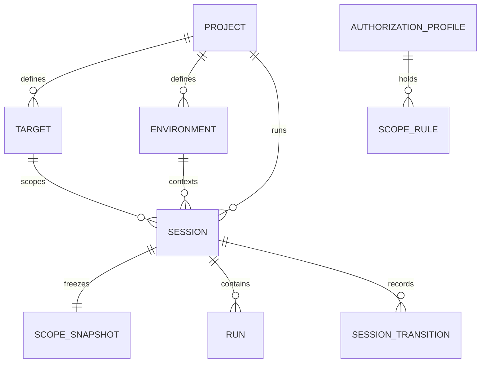

**Execution / Testing:**

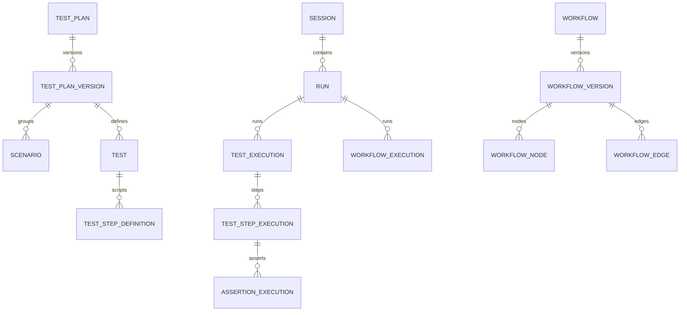

**Discovery:**

```mermaid
erDiagram
    SESSION ||--o{ CRAWL_FRONTIER : pumps
    PROJECT ||--o{ PAGE : inventories
    PROJECT ||--o{ ROUTE : defines
    PAGE ||--o{ OBSERVED_URL : evidences
    ROUTE ||--o{ OBSERVED_URL : evidences
    PROJECT ||--o{ API_ENDPOINT : exposes
    API_ENDPOINT ||--o{ API_ENDPOINT_VERSION : versions
    API_ENDPOINT ||--o{ API_OBSERVATION : observes
    PROJECT ||--o{ GRAPH_NODE : knows
    GRAPH_NODE ||--o{ GRAPH_EDGE : from
    GRAPH_NODE ||--o{ GRAPH_EDGE : to
```

**Tools / Workers / Agents:**

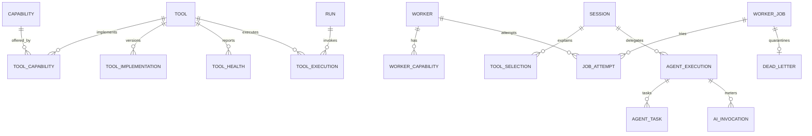

**Evidence / Findings:**

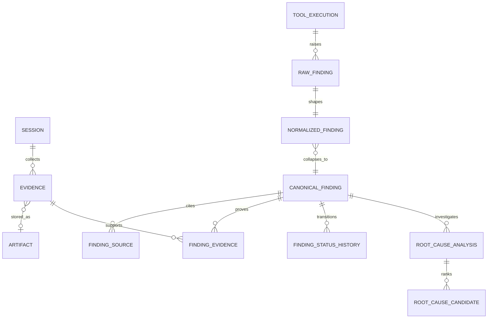

**Remediation:**

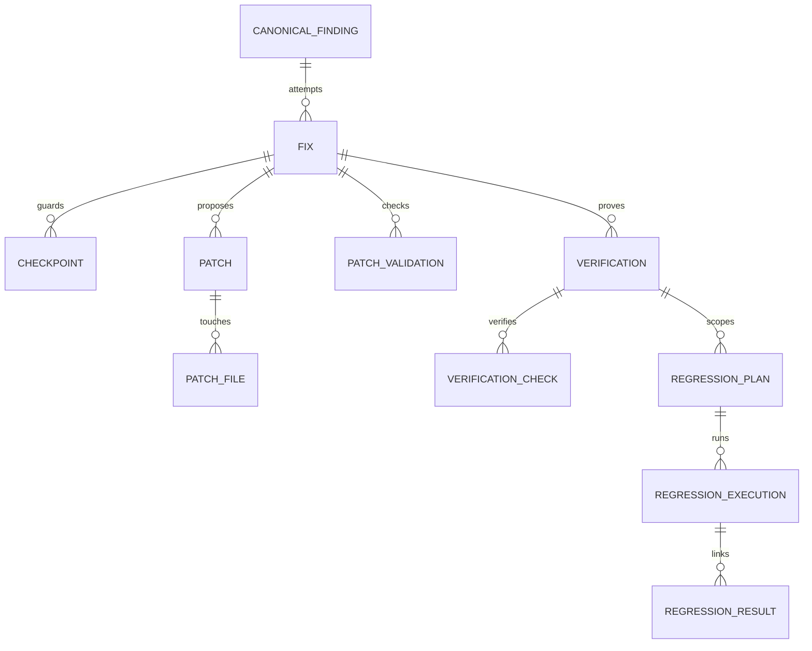

**Governance:**

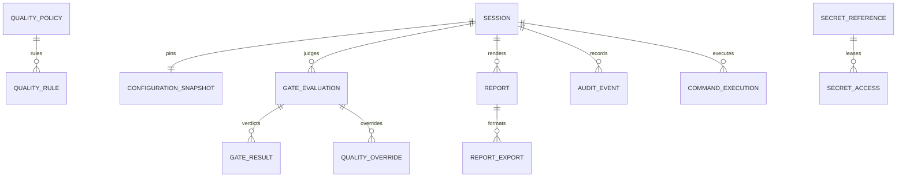

**Enterprise (P47 — future, not V1):**

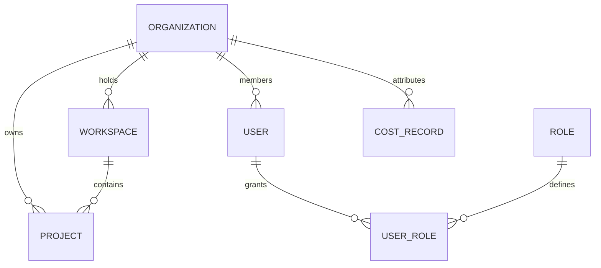

## 95. Data Flow Diagrams

WTT-DB-FLW-001: Main end-to-end data flow (persistence boundaries marked `[(PG)]` / `[(OBJ)]` / `[(REDIS)]`):

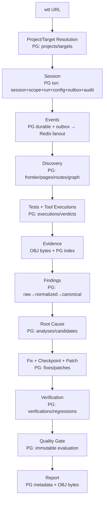

WTT-DB-FLW-002: Artifact flow:

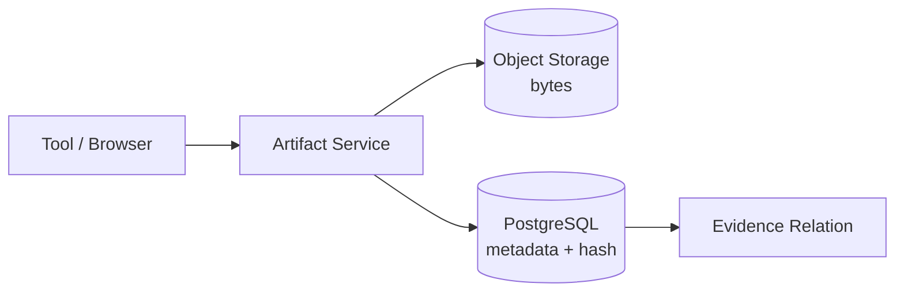

WTT-DB-FLW-003: Event persistence (transactional outbox, APPROVED):

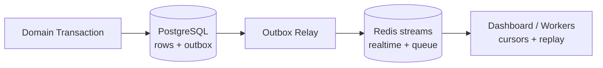

WTT-DB-FLW-004: Remediation data flow:

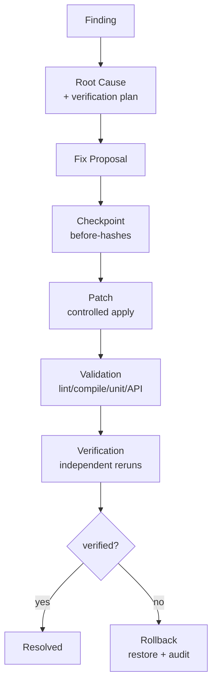

---

## 96. Database Invariants

WTT-DB-INV-001: DATABASE INVARIANTS (non-negotiable; violation = release-blocking defect):

```text
1.  PostgreSQL is authoritative for structured WTT state unless architecture explicitly says otherwise.
2.  Redis is never the only durable source of critical state.
3.  Large artifacts are never stored as ordinary DB blobs.
4.  Every important entity has stable, immutable identity (UUID PK + prefixed public ID).
5.  Every mutable domain has exactly one authoritative owner.
6.  Session lifecycle transitions are controlled (ARCH-120 edges, versioned, evented).
7.  Findings preserve source + evidence provenance (raw → normalized → canonical).
8.  Vendor findings never become canonical state directly.
9.  Root-cause hypotheses are distinguishable from confirmed causes (labels + entailment rule).
10. Failed fixes are never overwritten by later attempts.
11. Verification is separate from remediation (independent service + records).
12. Audit history is never silently rewritten.
13. Raw secrets are never stored in normal application tables.
14. Target content can never generate arbitrary SQL.
15. AI can never execute unrestricted SQL.
16. WTT control DB and target app DB are always distinguished (labels/creds/config).
17. Production target DB access defaults to read-only.
18. Retryable writes are idempotent where appropriate.
19. Cross-system operations avoid unsafe distributed transactions (outbox + idempotency).
20. Historical sessions remain reproducible (snapshots + versions + hashes).
21. Tool/adapter versions remain traceable (every execution carries them).
22. Schema changes use migrations (forward-only, tested, owned).
23. Destructive migrations require explicit review (+backup + recovery).
24. Tenant isolation is server-side when multi-tenancy exists.
25. V1 creates no unnecessary enterprise tables/infrastructure.
```

## 97. Acceptance Criteria

WTT-DB-ACC-001: Scenario A (WTT session): `wtt http://localhost:5173` persists Project/Target/Session + config fingerprint + state transitions + tool executions + test results + artifact metadata + findings + final status with zero inconsistent partial state (single transactions + outbox + recovery).

WTT-DB-ACC-002: Scenario B (finding): one defect from multiple tools yields ONE canonical finding + N sources + M evidence refs (fingerprint dedup; axe+Lighthouse+AI collapse REQUIRED).

WTT-DB-ACC-003: Scenario C (remediation): a fix preserves finding → root cause → checkpoint → patch → validation → verification → rollback history with failed attempts intact and audit-complete.

WTT-DB-ACC-004: Scenario D (crash recovery): after crash, WTT identifies unfinished sessions + running jobs/tools + incomplete remediation, marks `INTERRUPTED` (no ghost jobs), salvages partials, and offers idempotent resume/report (PRD `WTT-CLI-052`) — NEVER auto-resuming dangerous operations without policy.

WTT-DB-ACC-005: Scenario E (artifacts): screenshot/video/HAR bytes live in object storage; PG holds reliable metadata + refs; lifecycle states detect drift (AVAILABLE/ARCHIVED/DELETED/MISSING/CORRUPT).

## 98. Required ADRs

WTT-DB-ADR-001: REQUIRED ADRs (decision records, not files — master §272): `ADR-DB-001 PostgreSQL Selection` (effectively settled: PRD Proposed + ARCH system-of-record; record it) · `ADR-DB-002 ORM / Query Layer` (DB-OD-003) · `ADR-DB-003 Migration Strategy + tool` (DB-OD-002; forward-only/expand-contract settled, tool open) · `ADR-DB-004 Artifact Storage backends per tier` (inherits PRD OD-008) · `ADR-DB-005 Event Outbox` (settled APPROVED; record relay/transport notes + ARCH-OD-015 fanout) · `ADR-DB-006 Multi-Tenancy / RLS` (P47; DB-OD-008) · `ADR-DB-007 High-Volume Event Storage` (sampling/partition triggers; thresholds DB-OD) · `ADR-DB-008 Search Strategy` (PG-native V1; OpenSearch trigger).

## 99. Open Decisions

WTT-DB-OD-000: OPEN DATABASE DECISIONS — unresolved selections (status `DATABASE_DECISION_REQUIRED` unless noted). Nothing here is silently decided:

| ID | Decision | Recommendation (DATABASE.md) | Status |
|---|---|---|---|
| DB-OD-001 | UUIDv7 vs ULID (ID generation; storage `uuid` fixed) | UUIDv7 (native sortable) | DATABASE_DECISION_REQUIRED |
| DB-OD-002 | Migration tool (numbered forward-only settled) | None (stack-dependent) | DATABASE_DECISION_REQUIRED |
| DB-OD-003 | ORM / query layer | None (assess per §208) | DATABASE_DECISION_REQUIRED |
| DB-OD-004 | RPO / RTO values | None (business input) | DATABASE_DECISION_REQUIRED |
| DB-OD-005 | PostgreSQL version support floor | None (no source) | DATABASE_DECISION_REQUIRED |
| DB-OD-006 | Enum implementation (PG ENUM vs lookup vs text+check) | text + CHECK (migration flexibility) | RECOMMENDED (not approved) |
| DB-OD-007 | Audit immutability mechanism | hash-chained rows (PRD/ARCH proposed) | DATABASE_DECISION_REQUIRED (inherits OD-009/ARCH-OD-019) |
| DB-OD-008 | RLS adoption + tenant-column rollout | P47 expand/contract + RLS evaluated then | DATABASE_DECISION_REQUIRED |
| DB-OD-009 | Retention durations + partition thresholds | Policy-configured; measured triggers | DATABASE_DECISION_REQUIRED |
| DB-OD-010 | Cross-session canonical-issue identity depth | Fingerprint UNIQUE now; occurrence split POST_V1 | RECOMMENDED (not approved) |

WTT-DB-OD-011: DATABASE DECISION MATRIX (master §260; actual source decisions):

| Concern | Recommended | Alternative | Status |
|---|---|---|---|
| Primary DB | PostgreSQL (system of record) | — | Approved (PRD Proposed + ARCH) |
| Cache/Queue | Redis (BullMQ-class + Streams fanout) | NATS/Kafka/Temporal (triggered) | Recommended + OD-002/ARCH-OD-015/020 |
| ORM | TBD (assess per §208) | Prisma/Drizzle/Kysely/Knex/native pg | DATABASE_DECISION_REQUIRED |
| Migration Tool | TBD (forward-only numbered settled) | Prisma/Drizzle/Knex/Flyway/Liquibase/raw SQL | DATABASE_DECISION_REQUIRED |
| Artifact Store | Filesystem V1 → S3-compatible | MinIO/S3/Blob/GCS matrix | Approved direction + OD-008 |
| Search | PostgreSQL native (trigram/FTS) | OpenSearch later (enterprise) | Recommended |
| Graph | Relational nodes/edges | Dedicated graph (Future) | Recommended + OD-003 |
| Audit mechanism | Hash-chained rows | WORM / ledger | DATABASE_DECISION_REQUIRED (OD-009) |
| ID generation | UUIDv7 (storage uuid fixed) | ULID | DATABASE_DECISION_REQUIRED |
| PG version floor | — | — | DATABASE_DECISION_REQUIRED |
| RPO/RTO | — | — | DATABASE_DECISION_REQUIRED |

## 100. Final Validation Checklist

WTT-DB-VAL-001: FINAL DATABASE VALIDATION CHECKLIST (master §275 — all verified before finalize):

```text
[x] PRD.md read completely.            [x] ARCHITECTURE.md read completely.
[x] RULES.md read completely.          [x] PHASES.md read completely.
[x] DESIGN.md read completely.         [x] TOOLS.md read completely.
[x] TOOL-MATRIX.md read completely.
[x] PostgreSQL authority explicit (§7). [x] Redis boundary explicit (§8).
[x] Artifact boundary explicit (§9).
[x] Project/Target/Environment/Session defined (§§15–19).
[x] Run relationship resolved — separation ARCHITECTURE-REQUIRED (§20).
[x] Testing (§§21–22) · Tool execution (§28) · Evidence (§32) · Artifact (§33) ·
    Finding (§34) · RCA (§38) · Fix (§41) · Verification (§43) · Report (§46) ·
    Audit (§47) models defined.
[x] Raw vs canonical findings distinguished (§34). [x] N-source findings (§35).
[x] Finding history preserved (§37).   [x] Failed fixes preserved (§41).
[x] Verification independent (§43).
[x] Event persistence + classification defined (§31). [x] High-volume safe (§63).
[x] Bytes never in rows (§§9/33).      [x] JSONB disciplined (§61).
[x] Transactions (§55/§90) · Idempotency (§56) · Locking (§57) · Retry safety
    (§56/§78) · Cross-system consistency (§§58–59) defined.
[x] Indexing (§60/§93) · Query perf (§77) · Pagination (§77) · N+1 rule (§77).
[x] Migrations (§73) · Destructive control (§73) · Backfills (§74) ·
    Schema compat (§73) addressed.
[x] Secrets = references (§50).        [x] No unrestricted AI SQL (§69).
[x] No target-influenced SQL (§69).    [x] Control/target DBs separated (§51).
[x] Prod target DB read-only default (§51).
[x] Privacy (§68/§91) · Retention (§64/§92) · Audit integrity (§47) ·
    Backup/restore (§75) defined.
[x] V1 vs enterprise separated (§§82–84). [x] No premature sharding (§66).
[x] No premature graph DB (§24).       [x] No premature warehouse/search (§§52/62).
[x] Entity→phase (§81) · Ownership (§86) · Storage (§87) · Consistency (§89) ·
    Transaction (§90) matrices exist.
[x] ERDs readable + grouped (§94).     [x] Open decisions explicit (§99).
[x] No unsupported implementation claims invented (PLANNED throughout; Proposed/
    Recommended labeled; durations/versions/RPO-RTO left DECISION_REQUIRED).
```

---

## WTT V1 DATABASE MODEL

§82 (normative table list) + §81 V1_REQUIRED rows + §86 ownership + §55 transactions: a P01 agent implements projects/targets/environments/sessions/runs (+outbox stub) with forward-only migrations, UUID PKs + prefixed public IDs, ARCH-120 transitions, session-creation transaction, and tests per §80 — nothing more.

## POST-V1 DATABASE MODEL

§83: per-phase additions only (§81 POST_V1 rows); remediation chain Finding → Root Cause → Fix → Checkpoint → Patch → Patch Validation → Verification → Regression → Resolve-or-Rollback (§§34–44) with complete history + auditability.

## ENTERPRISE DATABASE MODEL

§84: P47/P48 entities only when required; V1 must not pre-create them nor block the §14 migration path.

## ENTITY → PHASE MATRIX

§81 (normative).

## ENTITY OWNERSHIP MATRIX

§86 (normative).

## STORAGE RESPONSIBILITY MATRIX

§87 (normative).

## DURABILITY MATRIX

§88 (normative).

## CONSISTENCY MATRIX

§89 (normative).

## TRANSACTION / IDEMPOTENCY MATRIX

§90 (normative).

## SECURITY / SENSITIVITY MATRIX

§91 (normative).

## RETENTION MATRIX

§92 (normative).

## INDEX RECOMMENDATION MATRIX

§93 (normative).

## DATABASE DECISION MATRIX

§99 decision matrix (normative).

## DATABASE INVARIANTS

§96 (25 invariants, normative).

## REQUIRED ADRs

§98 (ADR-DB-001–008).

## OPEN DATABASE DECISIONS

§99 (DB-OD-001–010, all explicit).

## FINAL DATABASE VALIDATION CHECKLIST

§100 (all items verified).

*End of DATABASE.md v0.1.0 — §§1–100 · 25 invariants · 10 open decisions · 0 conflicts · 0 invented behaviors.*
