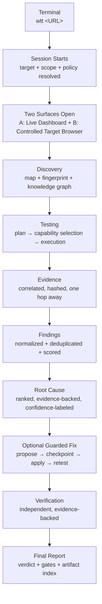
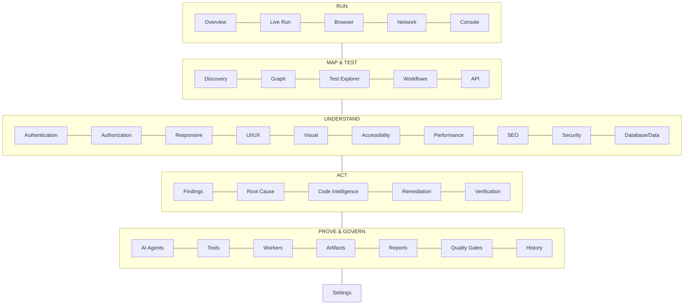
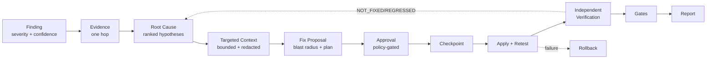
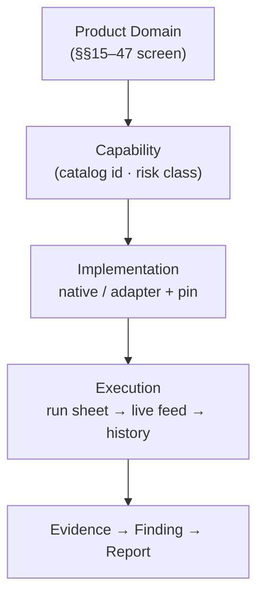
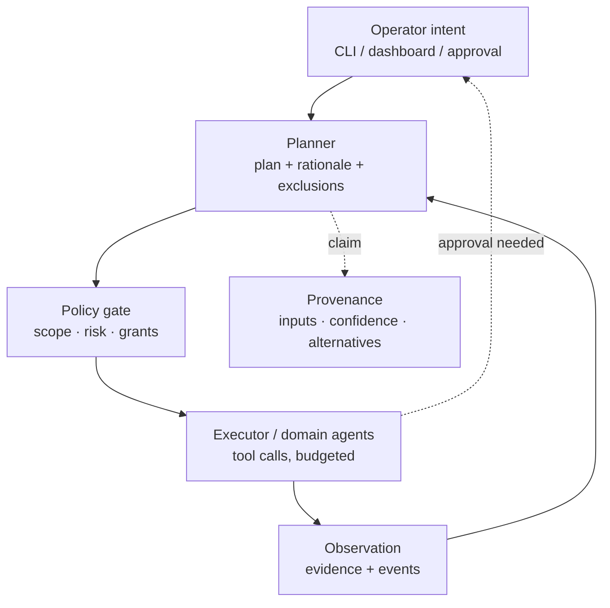

# WTT — Website Testing Tool
## Product Design, UI/UX & Interaction Specification

| Field | Value |
|---|---|
| Document Status | **Canonical — Draft for Review** |
| Version | 0.1.0 (Pre-implementation) |
| Last Updated | 2026-09-07 |
| Source PRD | `PRD.md` v0.1.0 — product requirements, UX requirements, V1 scope, terminology |
| Source Architecture | `ARCHITECTURE.md` v0.1.0 — system boundaries, surfaces, contracts, topologies |
| Source Rules | `RULES.md` v0.1.0 — mandatory engineering, safety, and UI constraints |
| Source Phases | `PHASES.md` v0.2.0 (`WTT-P00–P48`) — implementation order and feature availability |
| Source Tool Catalog | **No standalone catalog file exists in repo.** Catalog structure taken from `PHASES.md` §70 (domains A–CZ, IDs 1–1235). Row-level verification pending `PHZ-OD-010`. |
| Design Status | **Canonical — Draft for Review** (this document is the UX source of truth once ratified) |

> **Source-of-truth check.** `PRD.md` (87 sections), `ARCHITECTURE.md` (90 sections), `RULES.md` (61 sections), `PHASES.md` (96 sections + appendix) were read in full before authoring. **No `DESIGN BLOCKED — SOURCE CONFLICT`.** One scoping nuance is inherited, not blocking: PRD §74 (V1 CORE lists localhost fix pipeline, basic healing/flake, local-pool workers, gates) vs PHASES §16/§94 (P32/P33/P35/P39 depth POST_V1 with freeze-time ratification). Disposition: inherited as `DES-OD-001` (refs `PHZ-OD-006`); maturity labels in this document are phase-driven per PHASES, with V1-conditional screens explicitly marked. See §3.3, §79, §83.
> Known editorial note (non-semantic, from sources): PRD §15 `WTT-RTE-005` non-English token, tracked as `ARCH-OD-013`.

---

## Table of Contents

1. [Document Control](#1-document-control)
2. [Purpose](#2-purpose)
3. [Source Documents](#3-source-documents)
4. [Product Design Vision](#4-product-design-vision)
5. [Design Principles](#5-design-principles)
6. [User Personas / Design Context](#6-user-personas--design-context)
7. [Canonical User Journey](#7-canonical-user-journey)
8. [Product Surfaces](#8-product-surfaces)
9. [Information Architecture](#9-information-architecture)
10. [Navigation](#10-navigation)
11. [Global App Shell](#11-global-app-shell)
12. [Header](#12-header)
13. [Sidebar](#13-sidebar)
14. [Context Bar](#14-context-bar)
15. [Overview](#15-overview)
16. [Live Run](#16-live-run)
17. [Browser Workspace](#17-browser-workspace)
18. [Network](#18-network)
19. [Console](#19-console)
20. [Discovery](#20-discovery)
21. [Application Graph](#21-application-graph)
22. [Test Explorer](#22-test-explorer)
23. [Test Detail](#23-test-detail)
24. [Workflow Testing](#24-workflow-testing)
25. [API](#25-api)
26. [Authentication](#26-authentication)
27. [Authorization](#27-authorization)
28. [Responsive](#28-responsive)
29. [UI/UX](#29-uiux)
30. [Visual Regression](#30-visual-regression)
31. [Accessibility](#31-accessibility)
32. [Performance](#32-performance)
33. [SEO](#33-seo)
34. [Security](#34-security)
35. [Database / Data](#35-database--data)
36. [Findings](#36-findings)
37. [Root Cause](#37-root-cause)
38. [Code Intelligence](#38-code-intelligence)
39. [Auto Remediation](#39-auto-remediation)
40. [Verification](#40-verification)
41. [AI Agents](#41-ai-agents)
42. [Tools](#42-tools)
43. [Workers](#43-workers)
44. [Artifacts](#44-artifacts)
45. [Reports](#45-reports)
46. [Quality Gates](#46-quality-gates)
47. [History](#47-history)
48. [Settings](#48-settings)
49. [CLI UX](#49-cli-ux)
50. [CI UX](#50-ci-ux)
51. [Design System](#51-design-system)
52. [Tokens](#52-tokens)
53. [Typography](#53-typography)
54. [Color](#54-color)
55. [Spacing](#55-spacing)
56. [Density](#56-density)
57. [Icons](#57-icons)
58. [Buttons](#58-buttons)
59. [Badges](#59-badges)
60. [Tables](#60-tables)
61. [Forms](#61-forms)
62. [Drawers](#62-drawers)
63. [Dialogs](#63-dialogs)
64. [Code/Diff Viewers](#64-codediff-viewers)
65. [Charts / Visualization](#65-charts--visualization)
66. [Loading](#66-loading)
67. [Empty States](#67-empty-states)
68. [Errors](#68-errors)
69. [Partial Failure](#69-partial-failure)
70. [Permissions](#70-permissions)
71. [Security Confirmation UX](#71-security-confirmation-ux)
72. [Realtime UX](#72-realtime-ux)
73. [Responsive Strategy](#73-responsive-strategy)
74. [Accessibility](#74-accessibility)
75. [Motion](#75-motion)
76. [Content / Terminology](#76-content--terminology)
77. [Tool Catalog → UX Mapping](#77-tool-catalog--ux-mapping)
78. [Phase → UX Mapping](#78-phase--ux-mapping)
79. [V1 Design Scope](#79-v1-design-scope)
80. [Future / Enterprise Scope](#80-future--enterprise-scope)
81. [Design Invariants](#81-design-invariants)
82. [Acceptance Tests](#82-acceptance-tests)
83. [Open Design Decisions](#83-open-design-decisions)
84. [Design Review Checklist](#84-design-review-checklist)
85. [Appendices](#85-appendices)

---

## 1. Document Control

WTT-DES-DOC-001: This document is the canonical UX source of truth for WTT. It defines product UX, information architecture, navigation, layouts, interaction patterns, states, design tokens, components, accessibility, responsive behavior, and data visualization. Engineering agents MUST build frontend surfaces from this document without redesigning layouts, inventing patterns, or changing product behavior.

WTT-DES-DOC-002: Identifiers follow `WTT-DES-<AREA>-<NNN>`, are stable across versions, and MUST be cited in UX reviews and frontend implementation plans. Deprecated identifiers are marked `DEPRECATED`, never reused.

WTT-DES-DOC-003: Authority order is `PRD.md → ARCHITECTURE.md → RULES.md → PHASES.md → TOOL CATALOG → DESIGN.md` (this document). This document MUST NOT invent functionality absent from higher sources, MUST NOT silently change product behavior, and MUST record conflicts as `DESIGN BLOCKED — SOURCE CONFLICT`. None exists at authorship (see header).

WTT-DES-DOC-004: Labels used throughout: `V1 Required`, `V1 Optional`, `Post-V1`, `Enterprise`, `Experimental` (maturity, §78–§80); `PROPOSED` (design direction needing ratification, never silent architecture); `Design Decision Required` (explicitly unresolved, tracked in §83).

## 2. Purpose

WTT-DES-PUR-001: `DESIGN.md` MUST be the single source of truth for WTT product UX, information architecture, navigation, dashboard layout, interaction patterns, CLI UX, browser/test UX, agent UX, tool UX, evidence UX, finding UX, root-cause UX, remediation UX, verification UX, reporting UX, responsive design, design tokens, visual language, components, states, accessibility, data visualization, motion, density, error UX, security UX, and empty/loading UX.

WTT-DES-PUR-002: The document MUST be detailed enough that a frontend engineering agent receiving `PRD.md + ARCHITECTURE.md + RULES.md + PHASES.md + DESIGN.md` and instructed *"Implement the WTT-P05 Dashboard UI"*, *"Implement the Finding Detail screen"*, or *"Implement the Root Cause and Fix workflow"* can implement without redesigning the product, inventing layouts, introducing unrelated UI patterns, or changing product behavior.

WTT-DES-PUR-003: This document covers the WTT product application only (dashboard, target-browser relationship, CLI/CI UX). Marketing/public-website design is out of scope (no source requires it).

## 3. Source Documents

### 3.1 Normative inputs

| Source | Version | Authority for design |
|---|---|---|
| `PRD.md` | v0.1.0 | Requirements, personas, CLI shape, dashboard areas (§17), agents, lifecycle, V1 scope (§74), terminology (App. B) |
| `ARCHITECTURE.md` | v0.1.0 | Two-surface isolation (§16.1), dashboard state rules (§17), session state machine (§13.1), finding states (§38), contracts, topologies |
| `RULES.md` | v0.1.0 | UI/dashboard rules (§33), AI authority limits, secrets/redaction, error taxonomy, non-negotiable invariants (§54) |
| `PHASES.md` | v0.2.0 | Phase-gated availability (`WTT-P00–P48`), V1 boundary (§16), catalog domains A–CZ (§70) |
| Tool Catalog | via PHASES §70 | 1,235 capabilities across domains A–CZ; progressive disclosure target (§77) |

### 3.2 Interpretive mappings (transparent, not invention)

WTT-DES-SRC-001: Where higher sources describe the same concept at different precision, this document uses the most precise normative definition and records the mapping:
- **Finding lifecycle:** canonical states from ARCH §38 (`OPEN → INVESTIGATING → FIX_PROPOSED → FIX_APPLIED → VERIFYING → RESOLVED`, plus `FALSE_POSITIVE`, `ACCEPTED`, `REGRESSED`); PRD §56 terms (`triaged`, `in-fix`, `fixed`, `verified`, `closed`, `deferred`) are documented synonyms/prior labels in §36, not separate states.
- **Risk classification:** canonical 9-class set from ARCH §53.2 (`READ_ONLY · SAFE_TEST · PROJECT_WRITE · ACTIVE_NETWORK · SECURITY_ACTIVE · LOAD_ACTIVE · SYSTEM_CHANGE · DESTRUCTIVE · BLOCKED`); PRD §13 operation classes map 1:1 per ARCH §53.2; PRD §62 terminal classes are the terminal-facing subset.
- **Verification verdicts:** canonical set from PHASES P30 (`VERIFIED_FIXED · PARTIALLY_FIXED · NOT_FIXED · REGRESSED · INCONCLUSIVE`); `ROLLED_BACK` is a fix-lifecycle outcome (PRD §50), shown adjacent, never as a verification verdict.
- **Surfaces:** PRD §16 "two-page" terminology is refined by ARCH §16.1 (default: two isolated OS windows/contexts); this document uses Surface A (dashboard) / Surface B (target browser) with ARCH isolation guarantees.

### 3.3 Inherited scoping nuance (non-blocking)

WTT-DES-SRC-002: PRD §74 V1 CORE includes localhost fix pipeline, basic healing/flake, local-pool workers, and gates; PHASES §16/§94 places P32/P33/P35/P39 depth POST_V1 with boundary ratification at V1 freeze (`PHZ-OD-006`). This document inherits that disposition as `DES-OD-001`: affected screens are designed now (required by this specification's completeness rule) and labeled `V1-conditional` in §78–§79. No functionality is invented; availability follows PHASES.

## 4. Product Design Vision

WTT-DES-VIS-001: WTT MUST feel like a **developer tool + testing IDE + browser DevTools + observability console + AI engineering workspace**. It MUST NOT feel like a generic SaaS admin template, marketing dashboard, CRM, simple analytics page, decorative AI chat interface, or card-heavy toy dashboard.

WTT-DES-VIS-002: Primary experiential qualities (all screens, all states):

```text
Professional · Technical · Dense but readable · Fast · Precise ·
Operational · Evidence-driven · Trustworthy · Real-time · Low-noise ·
Scalable · Keyboard-friendly
```

WTT-DES-VIS-003: Information density follows professional engineering tools (DevTools, GitHub, Linear, Grafana, Datadog, Sentry, VS Code, JetBrains, modern observability platforms) without copying any of them. Compact type scale, restrained chrome, data-first layouts.

WTT-DES-VIS-004: Trust is the core emotion. Every screen MUST let the user answer: *what is WTT doing, why, under what authorization, with what evidence, and how do I stop / approve / replay it?* (PRD `WTT-UX-022`). There is no "AI magic" surface: every autonomous claim carries provenance, inputs, and confidence.

## 5. Design Principles

WTT-DES-PRN-001: **Information over decoration.** Prioritize `status · evidence · actions · relationships · severity · progress · context · history` over hero areas, oversized cards, whitespace theater, gradient decoration, illustrations, and empty regions.

WTT-DES-PRN-002: **Server-authoritative honesty.** The dashboard visualizes and requests; it never decides `PASS / RESOLVED / VERIFIED / READY` (RULES `WTT-RULE-ARC-004/006`). Optimistic UI MUST reconcile visibly; conflicts resolve server-wins with a visible refresh (ARCH §17).

WTT-DES-PRN-003: **Capability-aware presence.** Screens, navigation entries, and actions appear only when the capability exists for the current project/target/permission/phase (§72 in PHASES sense; §§10, 67 here). Not-run capabilities render as `Not Run / Unavailable / Partial` — never as fake zeros or fake 100% (RULES `WTT-RULE-VER-005`, `WTT-RULE-AI-004`).

WTT-DES-PRN-004: **Progressive disclosure at catalog scale.** 1,235 capabilities MUST NOT become 1,235 navigation entries. Hierarchy is always `Product Domain → Capability → Implementation / Tool` (§77).

WTT-DES-PRN-005: **Evidence is one hop away.** From any finding, test failure, gate verdict, or AI claim, the supporting evidence (screenshot, DOM node, network call, console entry, trace, artifact) MUST be reachable by direct navigation, never by manual search (PRD §16 `WTT-BRS-023`, §55 `WTT-EVD-004`).

WTT-DES-PRN-006: **State is never color-alone.** Every status/severity/verdict pairs color with icon + label + shape/badge treatment, and MUST remain legible in monochrome and to screen readers (§§59, 74).

WTT-DES-PRN-007: **Danger is explicit.** Destructive, active-security, load, production-write, and remediation actions state `what · where · risk · scope` before confirmation, show blast radius, and are audited (PRD §17 `WTT-DASH-031`, RULES §37). No dark patterns; no over-confirmation of harmless actions.

WTT-DES-PRN-008: **Target content is hostile input.** All target-supplied text (URLs, HTML, console, API bodies, headers, evidence) is escaped/sanitized before render; secrets render as `••••••••` / `[REDACTED]` with an explanation affordance, never as silent gaps (RULES §§33/37, PRD §63–§65).

WTT-DES-PRN-009: **Desktop-first, laptop-honest.** Primary design target is desktop/laptop at 100% zoom (§73). Narrow viewports degrade by tier, never by destroying desktop density.

WTT-DES-PRN-010: **`wtt <URL>` remains primary.** The CLI is the product entrypoint (RULES invariant 1); the dashboard visualizes and controls but MUST never become a prerequisite for execution (ARCH `ARCH-P-001`).

## 6. User Personas / Design Context

WTT-DES-PER-001: Design priority follows PRD §8 (`WTT-PER-020`): **developer immediacy first, team governance second, enterprise scale third** — without breaking earlier tiers.

| Persona (PRD) | Design implications |
|---|---|
| Individual full-stack developer (`WTT-PER-001`) | Zero-config start; Overview answers "what broke, why, is it fixed" in seconds; keyboard-first; localhost fix loop front-and-center |
| QA engineer (`WTT-PER-002`) | Test Explorer, matrices, evidence depth, report/gate clarity; triage speed over novelty |
| QA automation engineer (`WTT-PER-003`) | Locator/heal/flake transparency; CI UX; deterministic outputs; selectors with strategy+fallbacks visible |
| Frontend engineer (`WTT-PER-004`) | DOM/style evidence, visual diffs, viewport matrix, a11y node evidence; DevTools-grade inspectors |
| Backend engineer (`WTT-PER-005`) | API explorer, contract diffs, UI→API→DB trace joins; redacted payloads by default |
| DevOps / SRE (`WTT-PER-006`) | Perf/load (gated), deploy-gated runs, observability, artifact lifecycle; environment always visible |
| Security engineer (`WTT-PER-007`) | Scope/authorization pre-display; defensive wording; SARIF/export; audit completeness |
| Engineering lead (`WTT-PER-008`) | Executive report, gates with named conditions, risk + coverage honesty (tested vs not-tested) |
| Product engineering team (`WTT-PER-009`) | Shared sessions, finding triage, fix verification states; stable deep links |
| Enterprise QA org (`WTT-PER-010`) | RBAC-gated actions, retention/audit surfaces, fleet views; local parity never broken |
| CI/CD platform (`WTT-PER-011`, non-human) | Headless parity: exit codes, JUnit/SARIF, deterministic ordering; no dashboard dependency |
| AI coding agent (`WTT-PER-012`, non-human) | Machine-readable output, stable contracts; MCP is Future — no MCP UI in this design |

WTT-DES-PER-002: Jobs-to-be-done (PRD §9) map to dashboard destinations: defect verification → Overview + Finding Detail + Verification (§§15, 36, 40); workflow coverage → Workflows (§24); auth proof → Auth/AuthZ matrix (§§26–27); UI regressions → Responsive/Visual/A11y (§§28–31); API contracts → API (§25); Web Vitals → Performance (§32); release verdict → Gates + Reports (§§45–46); CI gating → CI UX (§50); localhost fix → Remediation (§39); flake → Test Detail + Live Run (§§16, 23); defensive review → Security (§34).

## 7. Canonical User Journey

WTT-DES-JRN-001: The canonical journey is fixed (PRD §10, ARCH §10). Design MUST preserve every stage's visibility; implementations MAY parallelize but MUST NOT skip validation, session creation, authorization/scope enforcement, evidence capture, or reporting (`WTT-UX-002`).



WTT-DES-JRN-002: **Step 1 — Terminal.** Running `wtt http://localhost:5173` MUST immediately communicate, in scan order: `Target · Mode · Session · Authorization · Browser · AI · Runtime · Dashboard URL · Current Phase`, then checklist state (`✓ Target reachable`, `✓ Session initialized`, …), then streaming stage progress (`Discovering application…`). Exact rules in §49; no decorative ASCII art.

WTT-DES-JRN-003: **Step 2 — Surfaces.** Dashboard (Surface A) opens foreground with Overview live; target browser (Surface B) opens the target visibly in headed mode. Both URLs/ports are printed and auto-opened (`--no-open` override; PRD `WTT-BRS-001`).

WTT-DES-JRN-004: **Step 3 — Live loop.** Discovery grows the map live; the plan shows included/excluded capabilities with rationale; execution streams browser/agent/tool events; evidence attaches continuously; findings triage live; RCA ranks with confidence; fixes (where permitted) show diff → checkpoint → apply → retest → verify/rollback; gates compute deterministically; the report renders with full provenance.

WTT-DES-JRN-005: **Interruption.** Ctrl+C / close / crash MUST visibly persist, flush evidence, mark `CANCELLED`/`FAILED`, and offer `resume` + `report` (PRD `WTT-UX-020`). Resume MUST continue from checkpoints without duplicating completed work; unresumable states MUST explain why.

WTT-DES-JRN-006: **Dry-run preview.** Every side-effecting autonomous action MUST be previewable via `--plan` / `--dry-run` with zero side effects (PRD `WTT-UX-021`); the dashboard plan view MUST match CLI plan semantics exactly.

## 8. Product Surfaces

WTT-DES-SUR-001: Two primary surfaces exist after start (PRD §16, ARCH §16.1). They share no origin, no storage, no tokens, and no trust; synchronization flows only through control-plane events.

| | Surface A — WTT Live Dashboard | Surface B — Controlled Target Browser |
|---|---|---|
| Role | Engineering command center: state, streams, triage, approvals, evidence review, reports | The actual application under test, driven by WTT |
| Origin | Dashboard loopback origin (e.g. `http://127.0.0.1:<wtt-port>`) | Target origin (e.g. `http://localhost:5173`) |
| Trust | Trusted WTT client; privileged APIs via session token | Untrusted content; no privileged API access ever |
| Default placement | Foreground window on launch (headed) | Adjacent OS window; side-by-side friendly |
| Failure domain | Dashboard crash MUST NOT kill the session | Target/browser crash is salvaged + retried per policy |

WTT-DES-SUR-002: **Distinguishability.** The user MUST always know which surface is which: the dashboard carries persistent WTT chrome (header with `WTT` mark + session context, §12); the target window carries a WTT control strip indicating `WTT-CONTROLLED · <Session> · <AI CONTROL | USER CONTROL | SHARED>` plus target URL and environment badge. The strip is rendered by the automation layer, never by target DOM (target DOM cannot spoof, hide, or click it).

WTT-DES-SUR-003: **AI visibility.** Every AI-driven browser action MUST be attributable (agent/tool/step) in the dashboard Live Run feed (§16) within the realtime budget (PRD `WTT-NFR-001`), and the Surface B strip MUST show the current action summary (`Browser Agent · Click "Checkout" · step 4/9`). No silent driving.

WTT-DES-SUR-004: **Takeover.** Control modes are `AI_CONTROLLED ⇄ USER_CONTROLLED ⇄ SHARED` (ARCH §63, RULES `WTT-RULE-BRW-004`). Dashboard (§17) and Surface B strip both expose `Take Control / Return Control to AI / Pause Browser Agent`. Takeover/return is evented + audited; conflicting simultaneous actions are prevented by action leases — the UI MUST disable the non-owner's action affordances with a visible lease holder, never fail silently on click.

WTT-DES-SUR-005: **Synchronization.** Selecting a test/step/finding in Surface A MUST surface corresponding Surface B evidence (screenshot, DOM node highlight, network request, console entry) and vice versa where feasible (PRD `WTT-BRS-023`). Sync is event-mediated with visible cursors; if the event stream lags, Surface A MUST show staleness (§72), never fake liveness.

WTT-DES-SUR-006: **Window behavior (PROPOSED, ref ARCH §16.1).** Default: two separate OS windows, separate processes, dashboard foreground on launch, target visible (cascaded, not hidden). Alternatives (two tabs, split window) are permitted later only if origin + storage + token isolation is preserved. Multi-monitor: dashboard on one screen + target on another MUST work; single-monitor MUST remain fully usable (§§73, and multi-monitor notes in §17). Headless/CI: no windows open; CLI progress + session link + report + artifacts remain available (§50).

---

## 9. Information Architecture

WTT-DES-IA-001: The dashboard organizes by **operational workflow**, not by tool catalog. Top-level groups follow the canonical journey (session → observe → test → understand → act → prove → configure):



WTT-DES-IA-002: Every screen carries a stable deep route (ARCH §17 deep-linking): `/sessions/:id/overview`, `/live`, `/browser`, `/network`, `/console`, `/discovery`, `/graph`, `/tests`, `/tests/:testId`, `/workflows`, `/workflows/:id`, `/api`, `/auth`, `/authz`, `/responsive`, `/ui`, `/visual`, `/a11y`, `/performance`, `/seo`, `/security`, `/data`, `/findings`, `/findings/:findingId`, `/rca/:findingId`, `/code`, `/fix`, `/fix/:fixId`, `/verification`, `/agents`, `/tools`, `/workers`, `/artifacts`, `/reports`, `/gates`, `/history`, `/settings/:section`. Findable items MUST support full copy-paste round-trip (a pasted link restores view + selection + applicable filters/scrub position, §10 `WTT-DES-NAV-008`).

WTT-DES-IA-003: Screens never orphan evidence: finding ↔ test ↔ step ↔ evidence ↔ artifact ↔ report section ↔ source line are bidirectional navigations (§36 `WTT-DES-FND-006`).

WTT-DES-IA-004: Navigation entries are phase/permission/capability-gated (§10). Entries for unimplemented phases render per §67 (roadmap state), never as dead links.

## 10. Navigation

WTT-DES-NAV-001: Persistent left sidebar across all widths ≥ tier-1 breakpoint (§73). Sidebar groups: `RUN` (Overview, Live Run, Browser, Network, Console), `MAP & TEST` (Discovery, Graph, Tests, Workflows, API), `QUALITY` (Auth, AuthZ, Responsive, UI/UX, Visual, A11y, Performance, SEO, Security, Data), `ACT` (Findings, Root Cause, Code, Remediation, Verification), `GOVERN` (Agents, Tools, Workers, Artifacts, Reports, Gates, History), `CONFIGURE` (Settings). Group order is fixed; within-group order is fixed.

WTT-DES-NAV-002: Each entry shows `icon + label + state affordance`: live indicator (for streaming areas), count badge (findings by max severity, queue depth, failing tests), and phase tag (`V1` / `Post-V1` / `Enterprise` / `Experimental`) only where non-obvious or gated — never 27 tags at once.

WTT-DES-NAV-003: Contextual tab systems live **below** the global shell: e.g. Test Explorer tabs (`All · Suites · Capabilities · Failures · Flaky`), Finding Detail tabs (`Summary · Evidence · Root Cause · Fix & Verification · History`), Browser tabs (`Viewport · DOM · Actions · Console↗`). Tabs preserve selection in URL query state (deep-linkable).

WTT-DES-NAV-004: Secondary navigation hierarchy depth MUST NOT exceed 3 (`Section → Sub-view → Item detail`). Deeper structures use drawers, not routes.

WTT-DES-NAV-005: Related-item navigation uses consistent patterns: chips for filters, breadcrumbs for hierarchy, "linked from" rails for evidence joins, bidirectional arrows for test↔finding↔evidence.

WTT-DES-NAV-006: Command palette (`Ctrl+K`/`⌘K`) + global search (`/`) MUST exist: navigate to any screen, any finding/test/artifact by ID, any tool by name/capability, run CLI-equivalent actions (`resume`, `report`, `approve`, `pause`), toggle appearance/density. Palette results are permission- and phase-aware.

WTT-DES-NAV-007: Keyboard shortcuts (PRD `WTT-UX-024`): `g then o/l/b/n/c/d/g/t/f/r/...` section jumps; `j/k` row move; `Enter` open; `e` evidence; `a` approve; `p` pause/resume; `?` shortcut sheet. All shortcuts discoverable, remappable later (Post-V1), and MUST NOT collide with target-page keys (dashboard shortcuts are inert when Surface B is focused).

WTT-DES-NAV-008: Deep-linking contract: every meaningful view (row, tab, timeline scrub, diff hunk, graph node, evidence item, report section, gate rule) MUST have a stable address; shared links MUST render the same state for authorized users, or an explicit `not-authorized / expired / missing` state — never a silent redirect to Overview.

## 11. Global App Shell

WTT-DES-SHL-001: Shell regions (fixed, all screens): `Header` (§12) → `Sidebar + Content` row → content column (`Context Bar` §14 + `View` + optional `Inspector drawer` §62). The Control Strip belongs to Surface B only (§8); the shell MUST NOT mimic it.

WTT-DES-SHL-002: Layout skeleton (low-fidelity hierarchy; implement from tokens §§52–56, not pixel art):

```text
┌─────────────────────────────────────────────────────────────────┐
│ HEADER  WTT ▸ Project ▸ Session   [env] [mode]   search  user ▾ │
├──────────┬──────────────────────────────────────────────────────┤
│ SIDEBAR  │ CONTEXT BAR: target · session · phase · progress     │
│          ├──────────────────────────────────────────────────────┤
│ RUN      │                                                      │
│  Overview│  VIEW (scroll region; tables virtualized)            │
│  Live Run│                                                      │
│ MAP&TEST │                                                      │
│  ...     │                                                      │
│          ├──────────────────────────────────────────────────────┤
│ status   │ STATUS STRIP: stream · workers · model · cost · time │
└──────────┴──────────────────────────────────────────────────────┘
```

WTT-DES-SHL-003: The content column MUST NOT horizontal-scroll at tier-1 widths; wide content (tables, diffs, traces) scrolls inside its own panel with sticky headers/first columns.

WTT-DES-SHL-004: A persistent status strip (bottom of content) shows: `event-stream state (live/degraded/reconnecting/offline) · session phase · active workers n/m · model + spend-so-far · elapsed/remaining · queue depth`. Redundant with header by design: header = identity/context; strip = liveness/cost.

WTT-DES-SHL-005: Focus management: route changes move focus to the view heading; drawers/modals trap + restore focus; toasts never steal focus (§74).

## 12. Header

WTT-DES-HDR-001: Header content, left→right: `WTT mark + version-chip · Project switcher · Session switcher (id + phase pill) · Environment badge (LOCALHOST/STAGING/PROD…) · Mode badge (READ-ONLY/GUARDED/FULL per §17-source mode) · global search trigger · stream-state dot · user/role menu`.

WTT-DES-HDR-002: Environment badge is a safety instrument, not decoration: production-like environments render high-contrast `PROD` with warning treatment; localhost renders neutral. Mis-targeting prevention: changing target/environment requires explicit confirmation showing old → new (PRD `WTT-SCP-006`).

WTT-DES-HDR-003: Session switcher lists sessions (`WTT-YYYYMMDD-NNNNNN`, phase, verdict-so-far, recency) with search; switching sessions preserves current screen where meaningful, else lands on that session's Overview with a notice.

WTT-DES-HDR-004: User/role menu shows identity, role, session-vs-RBAC distinction (RBAC design §27), and sign-out / token-scope info (Post-V1 multi-user; V1 single-operator shows `Local operator`).

WTT-DES-HDR-005: The header MUST remain usable when the backend is unreachable: cached identity/context + explicit `OFFLINE — showing last known state · Retry` (no fake liveness, §72).

## 13. Sidebar

WTT-DES-SBR-001: Persistent, collapsible to icon rail (persisted preference), collapsible groups (persisted). Collapse MUST NOT hide safety state: active `ASSISTED`/approval-pending/session-failed indicators re-surface as rail badges + header pills.

WTT-DES-SBR-002: Per-entry states: `default · active · live (streaming dot) · badge(count/severity) · gated (lock + tooltip: required role/phase) · roadmap (Post-V1/Enterprise tag) · error (area-level failure)`.

WTT-DES-SBR-003: The sidebar bottom holds a compact session card: `session id (truncated, copyable) · phase pill · progress bar · pause/resume/stop (permission-gated)`.

WTT-DES-SBR-004: No functionality may exist ONLY in a collapsed-away region: rail tooltips + palette entries duplicate every label.

## 14. Context Bar

WTT-DES-CTX-001: Every screen renders the session truth line: `Target URL (truncated, copy + open-in-Browser-view) · Environment · Session id · Lifecycle phase (ARCH §13.1) · Overall progress · Current stage detail (Discovering · 42/120 routes) · Scope mode chip · Authorization basis chip · Data-quality banner slot`.

WTT-DES-CTX-002: Data-quality banners (RULES `WTT-RULE-VER-004/005`) render here and propagate: `PARTIAL — 3/40 tools failed (details) · DEGRADED COVERAGE — auth-gated areas skipped (reason) · STALE — stream lag 45s · CACHED — offline snapshot`. Report/gate screens MUST re-surface the worst applicable banner; verdicts never render without their caveats (§§45–46).

WTT-DES-CTX-003: Scope + authorization chips open the scope drawer: allowed origins/paths, forbidden classes, production-write posture, approval requirements — drawn from session policy, with "why excluded" for every excluded capability (PRD `WTT-UX-016`).

WTT-DES-CTX-004: The context bar MUST NOT duplicate the header identity block: header = who/where (project/session/env/mode); context bar = what-now (phase/progress/scope-quality).

## 15. Overview

WTT-DES-OVV-001 (Introduced: `WTT-P05`; Initial: KPIs + stage pipeline + findings summary + agents + recent events; Later: quality scores P30, trends P36, gate widgets P39, cost widgets P13/P36): Overview MUST answer in one viewport: `Is the target healthy? What is running? What broke? What needs me?`

WTT-DES-OVV-002: Layout (fixed zones, responsive reflow §73):

```text
┌─────────────────────────────────────────────────────────────────┐
│ CONTEXT BAR (§14)                                               │
├──────────────┬────────────────────────────────┬─────────────────┤
│ KPI GRID     │ STAGE PIPELINE (session states │ ATTENTION QUEUE │
│ 6-8 tiles:   │ as horizontal stepper, live)   │ approvals · crit│
│ Target state │                                │ failures · risks│
│ Findings crit│ QUALITY SUMMARY (per-dimension │                 │
│ Tests p/f/s  │ status tiles, §15.4)           │ AGENTS (active) │
│ Coverage     ├────────────────────────────────┤                 │
│ Verdict-so-  │ TIMELINE (session events, live │ RECENT EVENTS   │
│ far + gates  │ + filterable)                  │ (correlated)    │
└──────────────┴────────────────────────────────┴─────────────────┘
```

WTT-DES-OVV-003: **KPI tiles** (PRD `WTT-UX-008`): each tile = `label · value · delta/trend (with baseline reference) · status treatment · source link`. Required tiles: `Target reachability`, `Findings (critical/high/total, deduplicated note)`, `Tests (passed/failed/skipped/flaky)`, `Coverage breadth (tested vs not-tested areas)`, `Quality verdict-so-far (NOT READY until gates decide — never premature PASS)`, `Session progress`. Optional V1 tiles: `Spend-so-far`, `Evidence count`. Tiles showing `0` MUST distinguish `true zero` from `not yet evaluated` (`—`, §66/§67).

WTT-DES-OVV-004: **Quality scores per dimension** (PRD §68 inputs, RULES §34): Functional · UI/UX · API · Performance · Accessibility · Security · Reliability · SEO(V1-selected). Tile treatment: `score (0–100, one decimal max) · confidence marker · calculation status (final/partial/not-evaluated) · inputs link (rules contributing) · timestamp`. Rules: scores render ONLY with stated inputs; `not-evaluated` renders as `— Evaluated: no`; `partial` carries the exact missing-input list. No invented formula is displayed or implied (formula ownership: RULES `WTT-RULE-SCR-001`).

WTT-DES-OVV-005: **Stage pipeline** mirrors ARCH §13.1 (`CREATED → INITIALIZING → DISCOVERING → PLANNING → TESTING → ANALYZING → REMEDIATING → VERIFYING → REPORTING → COMPLETED`, plus `PAUSED/FAILED/CANCELLED`). Current stage pulses; completed stages link to their outputs; skipped stages show `skipped: reason`. REMEDIATING/VERIFYING stages render only when applicable (fix permitted + proposed), else `not-applicable`.

WTT-DES-OVV-006: **Attention queue** ranks items needing the operator: `approval requests (with expiry) · critical failures · ASSISTED-needed items · risk-class escalations · reconnect/partial-failure notices`. Each row: `severity · title · context (session/stage) · age · primary action`. Queue empty-state: `All clear — N items auto-resolved this session` (§67), never blank.

WTT-DES-OVV-007: **Activity timeline** (PRD `WTT-UX-013`): unified, filterable (`stage · agent · tool · severity · mine`), live-appending with pause-scroll + "N new" pill, every entry deep-linkable to source (test/finding/evidence/log). Timeline MUST show lifecycle transitions, agent starts/stops, approvals, tool failures, checkpoints, rollbacks, gate evaluations.

## 16. Live Run

WTT-DES-RUN-001 (Introduced: `WTT-P05`; Initial: live feed + plan + progress; Later: multi-session views P35, replay P36): Live Run is the operational cockpit during execution: plan vs actual, streaming events, per-domain progress, controls.

WTT-DES-RUN-002: Layout:

```text
┌─────────────────────────────────────────────────────────────────┐
│ CONTEXT BAR + RUN CONTROLS: pause · resume · stop · approve ctr │
├──────────────────┬──────────────────────────────┬───────────────┤
│ PLAN (selected   │ LIVE FEED (virtualized,      │ RIGHT RAIL:   │
│ capabilities w/  │ filterable, pause-scroll)    │ BROWSER mini  │
│ include/exclude  ├──────────────────────────────┤ AGENTS mini   │
│ + rationale)     │ DOMAIN PROGRESS (per-area    │ QUEUE mini    │
│                  │ bars: tests/api/a11y/...)    │ COST mini     │
└──────────────────┴──────────────────────────────┴───────────────┘
```

WTT-DES-RUN-003: **Plan panel** (PRD `WTT-UX-016`, `WTT-PLAN-003`): every planned capability row shows `include/exclude · rationale · risk class · estimated cost/time (if estimated) · adapter/native badge (P10)`. Excluded capabilities MUST show `why` (scope, policy, missing prereq, phase-gated). Plan changes mid-run (re-planning) render as diff entries (`added/removed + reason + approver`).

WTT-DES-RUN-004: **Live feed** rows: `timestamp (explicit tz §76) · level/stage icon · source (agent/tool/system) · message · correlation links`. Row click opens correlated entity; multi-select enables `copy as CLI filter`, `create finding note` (permission-gated). Feed MUST sustain high-volume runs via virtualization + sampling notice (§72).

WTT-DES-RUN-005: **Run controls** (permission-gated, audited): `Pause` (drains to safe point, shows draining state), `Resume` (from checkpoints), `Stop` (confirms with salvage summary: what persists, what is lost), `Approve/Reject` (bulk approval center for pending `ASSISTED` items with risk summaries). Controls MUST disable with reasons when the session state disallows them (e.g. `Resume` disabled on `COMPLETED` with tooltip), never dead-click.

WTT-DES-RUN-006: If the session is `COMPLETED/FAILED/CANCELLED`, Live Run converts to read-only replay (scrub where event log permits; controls replaced by `Resume`/`Re-run`/`Report`), making post-mortem the same surface as operations.

---

## 17. Browser Workspace

WTT-DES-BWS-001 (Introduced: `WTT-P06`; Initial: target context + DOM/events + takeover; Later: CDP streaming depth P07, replay/scrub P36): The Browser workspace mirrors Surface B state inside Surface A. It MUST NOT embed the live target page in the dashboard origin (ARCH §16.1 isolation); it shows event-sourced mirrors: viewport snapshots, DOM/css snapshots, action log, console↗, network↗.

WTT-DES-BWS-002: Layout: `Viewport mirror (latest screenshot / frame stream w/ staleness age + pause) · Action timeline (who/what/result per action) · DOM snapshot explorer (frozen tree, searchable, node→evidence) · Element picker readout (selector strategy + fallbacks + heal history) · Control mode bar (AI/USER/SHARED + Take/Return control + lease holder)`.

WTT-DES-BWS-003: Every mirrored frame carries `captured-at timestamp · action correlation (step/action id) · staleness age · stream state`. If frames stop, the workspace MUST show `STALE — last frame Ns ago (cause if known)`, never a frozen frame presented as live.

WTT-DES-BWS-004: DOM snapshots are frozen evidence: nodes show `tag · classes · key attrs · computed box (x/y/w/h) · visibility · selector used + alternatives · heal events`. Clicking a node opens linked evidence (screenshot crop, a11y node result, visual diff region).

WTT-DES-BWS-005: Multi-window rules (PRD §16 `WTT-BRS-010..015`, ARCH §16.1): dashboard lists target contexts (`window/tab/iframe/worker` as applicable) with `origin · type · state · driver session`; cross-origin iframes limited to generic metadata (no content spoof). New tabs/popups during runs are captured as events with disposition (`captured/handled/blocked:nreason`).

WTT-DES-BWS-006: Takeover UX: `Take Control` switches mode with visible countdown-free immediate effect + audit entry; while `USER_CONTROLLED`, AI action buttons disable with `Held by you`; `Return Control to AI` re-enables with re-plan notice. Mode changes are announced to AT (assertive) and logged.

## 18. Network

WTT-DES-NET-001 (Introduced: `WTT-P07`; Initial: request table + detail + timing; Later: WS/GraphQL depth P18, replay-compare P36): DevTools-grade, read-dense network inspector over captured traffic.

WTT-DES-NET-002: Request table columns: `status · method · domain · path (truncated, full in tooltip/copy) · type · size (compressed/uncompressed) · time (total + waterfall mini-bar) · initiator (script/line or action id) · cached · issue badges (failed/CORS/TLS/mixed-content/slow)`. Virtualized; filters: `text · status class · type · domain · failed-only · slow-only (threshold control) · 3rd-party-only · blocked-only`; saved filter presets per session.

WTT-DES-NET-003: Request detail tabs: `Headers (request/response, sensitive values redacted per §76 + RULES §37) · Payload (pretty JSON/form, size-capped with truncation affordance §65) · Response (preview by content-type, size-capped) · Timing (DNS/TCP/TLS/TTFB/download breakdown bars) · Initiator chain · Related (test step, finding, console entries, HAR export row)`.

WTT-DES-NET-004: HAR export + per-request `copy as cURL (redacted)` + `copy as fetch (redacted)`. Secrets in copied commands are redacted by default with an explicit `include secrets` gate (permission + audit, §71).

WTT-DES-NET-005: Failure emphasis: failed requests pin a summary strip (`N failed · M 4xx · K 5xx · J blocked`) linking to filtered table; each failed row links candidate cause (DNS/TLS/CORS/offline/target-error) where diagnosed (§23 P23).

## 19. Console

WTT-DES-CON-001 (Introduced: `WTT-P07`; Initial: message stream + source links; Later: source-map resolution (P07 depth, P31 code linkage)): Console mirrors target console + WTT-injected diagnostics, clearly badged by origin (`target` vs `wtt`).

WTT-DES-CON-002: Message rows: `level (error/warn/info/debug) · timestamp · origin badge · message (escaped, expandable stack) · source (url:line:col, opens evidence/DOM context where mapped) · count (collapsed repeats) · correlation (action/test/finding links)`.

WTT-DES-CON-003: Filters: `level · origin · text/regex · errors-only · source file · time window`; `preserve log across navigations` toggle (default ON for test runs); export `JSON/NDJSON + text`.

WTT-DES-CON-004: Console errors auto-correlate: rows that produced findings show finding chips inline; rows matched to known frameworks map to `possible cause` hints from the knowledge base (labeled as hints with confidence, never diagnoses).

## 20. Discovery

WTT-DES-DSC-001 (Introduced: `WTT-P09`; Initial: sitemap/routes, tech fingerprint, crawl progress; Later: API discovery depth P17/P18, auth-aware crawl states P16): Discovery shows WHAT the app is: routes, parameters, forms, APIs, technologies, entry points — the map everything else tests against.

WTT-DES-DSC-002: Layout: `Crawl progress (queues: pending/active/done/blocked + robots/scope stops) · Route table (method-less URL inventory: path · params · forms · auth-gated? · tested? · findings count) · Technology panel (detected stack w/ version + confidence + source: header/js/cookie/fingerprint) · Entry points (forms/APIs/uploads/auth) · Exclusions (out-of-scope + reason, §14 scope drawer link)`.

WTT-DES-DSC-003: Route rows: `path · discovered-via (crawl/sitemap/JS/declared) · parameters (names + inferred types) · auth requirement (none/login/role/unknown) · coverage state (untested/queued/testing/tested/blocked) · linked tests/findings`. `auth-gated` unknowns render as `unknown — not assumed public`, never as public.

WTT-DES-DSC-004: Technology detection honesty: `name · version (or unknown) · confidence (high/med/low + evidence link) · detection source · last-seen`. Low-confidence items MUST NOT drive scary wording; CVE/version-risk language is forbidden until P25+ verification exists (no fake security findings, RULES `WTT-RULE-VER-002`).

WTT-DES-DSC-005: Discovery incompleteness is first-class: `coverage stops` (scope boundary, auth wall, rate limit, JS-render wall, time budget) each render with `cause · affected subtree · resume/extend action (permission-gated)`.

## 21. Application Graph

WTT-DES-GRF-001 (Introduced: `WTT-P10` graph store; visual explorer Initial with P05/P10: node-link map; Later: UI→API→DB joins P17/P18/P27, risk overlay P24/P25, time-travel P36): The graph answers `how is this app connected, and what does this failure touch?`

WTT-DES-GRF-002: Canvas: node-link map with `node type shapes (page/API/component/DB-table/state) · edge types (navigates/calls/reads/writes/renders) · severity heat overlay · selection detail rail · minimap · layout controls (force/layered/radial) · depth limiter · path mode (shortest path A→B, blast-radius from node)`. Canvas MUST have a list-view fallback (same data, table form) for AT + low-power + export parity (§74).

WTT-DES-GRF-003: Node detail rail: `identity · type · properties · incoming/outgoing edges (expandable) · linked tests/findings/evidence · coverage state · blast-radius preview (downstream count by type)`. Graph selections deep-link (`?node=…&depth=…`).

WTT-DES-GRF-004: Rendering budget: `≤500 nodes interactive default; beyond that: cluster + expand-on-demand + explicit sampling notice`. Layout MUST be deterministic per dataset (stable node positions for screenshots/comparison), with a `shuffle-avoid` layout seed control.

WTT-DES-GRF-005: Graph NEVER shows data the session is not authorized for: auth-gated subtrees render as `restricted` placeholders when discovered-but-unreadable, and are absent (not shown) when undiscovered.

## 22. Test Explorer

WTT-DES-TST-001 (Introduced: `WTT-P11`; Initial: tree + list + status; Later: flake analytics P33, quarantine UX P33, matrix views P16/P20+): Test Explorer is the test inventory + triage surface.

WTT-DES-TST-002: Layout:

```text
┌─────────────────────────────────────────────────────────────────┐
│ CONTEXT BAR + TEST FILTER BAR (text · status · suite · cap · tag)│
├──────────────┬──────────────────────────────────┬───────────────┤
│ TREE (suite/ │ RESULT LIST (virtualized rows:   │ PREVIEW RAIL: │
│ capability/  │ status · name · suite · dur ·    │ selected test │
│ file) w/     │ flake · env · run-at)            │ summary + top │
│ counts       ├──────────────────────────────────┤ failure +     │
│              │ MATRIX TOGGLE (viewport×browser× │ evidence peek │
│ SUITE HEALTH │ auth where applicable, §22.5)    │ + open detail │
└──────────────┴──────────────────────────────────┴───────────────┘
```

WTT-DES-TST-003: Status vocabulary is fixed: `PASSED · FAILED · SKIPPED (reason required, visible) · FLAKY (score + history link) · QUARANTINED (policy + expiry) · NOT RUN · RUNNING · BLOCKED (prereq/dependency shown)`. `SKIPPED` without reason is a data error and MUST render as `SKIPPED — reason missing (data issue)`, never silently.

WTT-DES-TST-004: Rows show `status · name · suite/capability path · duration · flake indicator · environment tags · last-run time · failure signature (dedup key) · evidence count`. Bulk actions (permission-gated): `re-run · quarantine (with expiry + reason) · assign · export selection`.

WTT-DES-TST-005: Matrix toggle pivots results by `viewport × browser × auth-role × theme` where the run produced them; empty cells render `not-run` (never blank, never zero-implied), blocked cells render `blocked: reason`.

WTT-DES-TST-006: Suite health rollups: `pass rate (with denominator + window) · flake rate · mean duration + p95 · quarantine count · trend sparkline (baseline-labeled)`. Baselines MUST be explicit (`vs last 5 runs on main`, never unlabeled deltas).

## 23. Test Detail

WTT-DES-TDT-001 (Introduced: `WTT-P11`; Later: heal-diff views P33, multi-run compare P36): Test Detail proves a single test result: what ran, what happened, why it failed, what it touched.

WTT-DES-TDT-002: Header: `status · name · suite path · run context (session/runner/env/build) · duration (with budget marker) · flake score + sparkline · quarantine state · actions (re-run, quarantine, copy link, export)`.

WTT-DES-TDT-003: **Step timeline** (PRD `WTT-UX-018`): vertical step list where each step shows `index · kind (navigate/click/type/assert/network/wait/ai-action/hook) · description (human + technical toggle) · status · duration · retry attempts (each attempt expandable with its own evidence) · evidence thumbnails (screenshot/DOM/network/console) · locator used (strategy + value + fallbacks tried + heal event if any)`. Failed step auto-expands with `expected vs actual` block (§64 diff rules).

WTT-DES-TDT-004: Tabs: `Steps · Assertions (each: expected/actual/matcher/location) · Evidence (all attachments, filterable) · Logs (scoped runner logs) · History (run-over-run: status dots + duration + flake events; select two to compare) · Related (findings opened by this test, covering workflows, graph nodes)`.

WTT-DES-TDT-005: Locators are evidence: `strategy · value · resolved element count (≠1 is flagged) · fallbacks tried · heal events (old→new + confidence + approver where required) · stability note`. Healed locators MUST show the heal as a first-class event, and healing approval follows policy (PRD §44/`WTT-RULE-POL-002`).

WTT-DES-TDT-006: Re-run UX: `re-run once · re-run N× (flake probe, capped) · re-run in debug (headed + slow-mo affordance where supported) · re-run changed-context only`. Re-runs create linked run records; the original result is never overwritten.

## 24. Workflow Testing

WTT-DES-WFL-001 (Introduced: `WTT-P15`; Initial: workflow list + run view; Later: data-driven matrices + scheduling (P15 depth); visual authoring (Future, §80)): Workflows are multi-step user journeys (login→search→checkout) with data, assertions, and recovery.

WTT-DES-WFL-002: Workflow list rows: `name · trigger (manual/scheduled/event) · steps count · last verdict · pass rate (windowed) · data variants count · owner/updated`. Detail header adds `version · tags · environment bindings · schedule state`.

WTT-DES-WFL-003: Run view: `step graph (linear + branches with taken-path highlight) · per-step status/evidence (same step contract as §23) · data variant selector (row-by-row results for data-driven runs) · shared-state inspector (session/storage/cookies snapshots per step, redacted) · failure break (first-failure focus + downstream-skipped reasons)`.

WTT-DES-WFL-004: Data-driven results render as `variant matrix`: rows = data rows (labeled, secrets masked), columns = key assertions, cells = pass/fail/not-run; cell click opens the step evidence for that variant.

WTT-DES-WFL-005: Workflow authoring (V1 scope: view + trigger + parameter override; advanced visual authoring: Future, §80 — no owning phase in P00–P48): parameter overrides use typed forms with validation + secrets handling (§61); `dry-run` previews planned steps with zero side effects (§7).

## 25. API

WTT-DES-API-001 (Introduced: `WTT-P17` REST depth; contracts `WTT-P19`; other protocols (`WTT-P18`) activate only when discovered): API workspace = endpoint inventory + request lab + contract conformance + schema diffs.

WTT-DES-API-002: Endpoint inventory rows: `method · path (templated) · auth requirement · contract source (OpenAPI/discovered/none) · last status · latency p50/p95 · breaking-drift badge · findings count`. Group by `tag/resource · auth · contract-state`.

WTT-DES-API-003: Request lab: `method+url builder (from inventory or raw, scope-validated) · auth selector (session auth profiles, never raw secrets in UI §76) · headers/body editors (JSON-aware, schema-hinted) · send (risk-classed: read-only vs mutating with confirmation §71) · response view (status/time/size · pretty body · headers · schema validation result · save-as-test/regression)`.

WTT-DES-API-004: Contract conformance: `spec vs observed diff (added/removed/changed operations, schema deltas) · breaking-change flags (with rule citation) · version compare (spec A vs spec B) · drift timeline`. Every breaking flag links evidence (captured request/response pair).

WTT-DES-API-005: Protocol honesty: REST depth is V1; WebSocket/GraphQL/gRPC/async depth renders only when discovered + implemented (capability-aware §5); undiscovered protocols show `not detected in this target` with the detection basis (what was probed), never a fake empty table.

## 26. Authentication

WTT-DES-ATHN-001 (Introduced: `WTT-P16`; Initial: login-flow tests + session handling matrix; Later: MFA/SSO depth, token-lifecycle analytics): Authentication proves identity flows work: login, logout, session, password/MFA/SSO recovery paths.

WTT-DES-ATHN-002: Views: `Login flows (per-flow: steps, verdict, evidence; failed logins show failure stage precisely) · Session matrix (cookie/token storage, expiry, rotation-on-privilege-change, concurrent-session behavior) · Password & recovery (policy checks, reset-flow integrity — test accounts only, §27 safeguards) · MFA/SSO (configured-method coverage, fallback behavior)`.

WTT-DES-ATHN-003: Credentials in UI: test identities render as `label + scope (role/env) + owner + rotation state`; secret values NEVER render (reference by vault/label only, RULES §37). Login evidence screenshots MUST mask password fields automatically (redaction proof: masked-region markers).

WTT-DES-ATHN-004: Session handling display uses explicit lifecycle diagrams per flow (`issued → validated → refreshed/rotated → expired/revoked`), each transition evidence-linked. `Unknown` transitions render as unknown with the probe gap stated.

## 27. Authorization

WTT-DES-ATHZ-001 (Introduced: `WTT-P16`; Initial: RBAC matrix + IDOR/BOLA-style access probes (scope-gated); Later: ABAC depth, policy-diff): Authorization proves access control: who can do what, and that denials hold.

WTT-DES-ATHZ-002: **RBAC test matrix**: rows = `role × resource/action`, columns = `expected (policy/declared/unknown) · observed (allowed/denied/error) · verdict (match/mismatch/unverifiable) · evidence (probe request/response, redacted)`. Mismatches (especially `expected-deny → observed-allow`) escalate visually + open/attach findings; `policy unknown` cells MUST NOT render as passes — they render `unverifiable: no policy source` with an action to attach policy.

WTT-DES-ATHZ-003: Probe safeguards (PRD §34/`WTT-RULE-POL-002`): access probes run under explicit authorization basis shown per run (`test accounts · scope · rate limits · forbidden targets`); horizontal-escalation probes (other users' objects) require test-owned fixtures and render the fixture-ownership proof; any probe touching non-fixture data is blocked pre-execution with a visible block reason (ARCH §53 gates UI §71).

WTT-DES-ATHZ-004: Authorization views MUST separate `product access control under test` from `WTT operator RBAC` (operator roles gating WTT actions, §70): two distinct matrix components, visually distinguished labels (`Target RBAC` vs `Operator RBAC`), never mixed in one table.

---

## 28. Responsive

WTT-DES-RSP-001 (Introduced: `WTT-P20`; V1 matrix per PRD §74/V1 CORE): Responsive proves layout integrity across the V1 viewport/browser matrix — no invented devices beyond the run matrix.

WTT-DES-RSP-002: Matrix view: rows = routes/key screens, columns = `viewport × browser` cells from the executed matrix; cells: `pass/fail/not-run + thumbnail + issue count`. Matrix header states the executed set (`360×640 · 768×1024 · 1280×800 · 1920×1080 × Chromium (+ others if run)`); unrun combos are absent, not grey-faked.

WTT-DES-RSP-003: Issue detail per cell: `issue class (overflow/clipped/tap-target/contrast-at-size/hidden-content/broken-layout) · element path + screenshot crop with highlight · viewport/breakpoint context · CSS clue (rule + media query where mapped) · linked finding`. Overflow issues MUST show the overflow axis + pixel extent, not just a flag.

WTT-DES-RSP-004: Comparison mode: `viewport A vs B side-by-side (same route, synced scroll regions) · breakpoint ladder strip (render widths across breakpoints for one route)`. Diff emphasis is structural (layout/visibility), pixel-diff belongs to §30.

## 29. UI/UX

WTT-DES-UI-001 (Introduced: `WTT-P20`; Initial: heuristic checks + issue list; Later: journey-friction analytics, design-system conformance): UI/UX intelligence surfaces usability defects with restraint: heuristics, never taste.

WTT-DES-UI-002: Issue classes (fixed vocabulary): `broken-interaction · dead-control · misleading-state · focus-loss · keyboard-trap · missing-feedback · destructive-without-confirm · inconsistent-labeling · readability (size/contrast/spacing) · touch-target · motion-risk`. Each issue: `heuristic citation (which rule) · location (route + element) · evidence (screenshot/video frame + DOM) · severity (usability impact, not security severity — labeled distinctly) · reproduction steps`.

WTT-DES-UI-003: Wording guardrails (RULES `WTT-RULE-AI-004`, `WTT-RULE-VER-002`): heuristic findings MUST read as observations (`Submit button shows no loading state after click`) with cited rule + evidence, never as brand judgments (`ugly`, `unprofessional`) and never as WCAG failures unless the a11y engine (P21) confirmed them.

## 30. Visual Regression

WTT-DES-VSL-001 (Introduced: `WTT-P20`; Initial: baseline/diff/approve; Later: component-level diffing, cross-env baselines): Visual proves pixels: baselines, diffs, approvals — with anti-flake honesty.

WTT-DES-VSL-002: Diff viewer: `baseline vs current slider + side-by-side + highlight-mask toggle · diff stats (changed pixels %, regions count, largest region) · region list (click → zoom) · ignore-region editor (persistent per test/viewport, audited) · anti-flake metadata (retries, stabilization waits, dynamic-content masks applied)`. Baselines show `captured-by/at/env/commit` provenance; missing baseline renders `no baseline — capture or adopt current (approval-gated)`.

WTT-DES-VSL-003: Approval flow: `approve (accept current as baseline, reason optional, permission-gated) · reject (opens/attaches finding) · approve-with-ignore-regions`. Every approval writes `who/when/why` history; bulk-approve requires explicit scope selection + reason (no silent mass-baselining).

WTT-DES-VSL-004: Flake containment: diffs within noise thresholds render `within tolerance (threshold cited)` not `passed clean`; repeated borderline diffs surface `stability warning` linking flake policy (§22/P33).

## 31. Accessibility

WTT-DES-A11Y-001 (Introduced: `WTT-P21`; Initial: axe-class engine results + node evidence; Later: manual-assist flows, AT-matrix depth): Accessibility proves inclusive function: violations keyed to rules, nodes, and remediation.

WTT-DES-A11Y-002: Results views: `violations (rule · impact critical/serious/moderate/minor · nodes count · WCAG mapping; axe-core-class rules V1 per PRD V1 CORE) · needs-review (incomplete items are FIRST-CLASS, never hidden) · passes (counts + sample, expandable) · inapplicable (count only)`. Rule rows: `rule id · WCAG SC + level · impact · help text (engine-provided) · nodes affected (each: target selector + HTML excerpt + screenshot crop) · fix guidance (engine-provided) · linked findings`.

WTT-DES-A11Y-003: Node evidence: every violation node MUST show `page location · DOM excerpt · visual crop with outline · selector · why-it-fails (engine check breakdown) · suggested fix (engine-provided, labeled as suggestion until verified)`.

WTT-DES-A11Y-004: Honesty rules: automated a11y results MUST carry the persistent caveat `automated checks cover a subset of WCAG; manual review required for full conformance`; `0 violations` renders as `0 violations detected by <engine> <version> on <N> pages (ruleset <id>)` with the evaluated scope stated — never as `accessible`/`compliant` (§45 report wording inherits this).

## 32. Performance

WTT-DES-PERF-001 (Introduced: `WTT-P22` Web Vitals + budgets; load/stress Post-V1 P34): Performance proves speed: Vitals, budgets, traces — lab data labeled as lab data.

WTT-DES-PERF-002: Views: `Web Vitals board (LCP/INP/CLS + TTFB/FCP per route: value · budget · status · run conditions) · Budget table (metric · budget · observed · margin · trend · offending asset/test) · Waterfall (network-joined, §18 deep-link) · Trace viewer (main-thread summary: long tasks, layout shifts with element attribution) · History (run-over-run per route, deploy markers)`.

WTT-DES-PERF-003: Run-conditions block (mandatory, adjacent to every perf number): `throttling profile · runs count · aggregation (median/p75 cited) · environment · variance note`. Single-run numbers render as `single-run (unverifiable trend)`; variance above threshold renders `high variance — re-run recommended` with one-click re-run.

WTT-DES-PERF-004: Budgets: `pass/warn/fail` with numeric margins; failing budgets link `top contributors (asset/endpoint/request chain)` with evidence; budget edits are permission-gated + versioned + audited.

WTT-DES-PERF-005: Load/stress surfaces (P34, Post-V1 — designed, gated): virtual-user curves, throughput/latency distributions, error-rate overlays, saturation markers, environment-guard rails (prod-load is approval + policy-gated with explicit blast-radius §71). Pre-P34, any load affordance renders roadmap state (§67), never a disabled fake.

## 33. SEO

WTT-DES-SEO-001 (Introduced: `WTT-P29` selected subset V1: meta/ headings/ canonical/ robots-sitemap basics + i18n basics; full packs Post-V1): SEO proves discoverability basics with crawl-evidence, not rank promises.

WTT-DES-SEO-002: Views: `page table (route · title/meta presence+length · canonical · indexability verdict + blocking cause) · issue list (missing/duplicate/conflicting signals, each with element + fetched-HTML evidence) · robots/sitemap check (fetch status + parse result + referenced-URL sampling) · i18n basics (lang attr · hreflang presence/consistency where implemented)`.

WTT-DES-SEO-003: Forbidden language: no `ranking`, `traffic`, or `score-out-of-100 SEO grade` unless a sourced, versioned, explainable rule set computes it (RULES §34); V1 renders `checks passed/total + issue counts`, with `not-evaluated` for unrun packs.

## 34. Security

WTT-DES-SEC-001 (Introduced: passive/config depth V1-selected `WTT-P24`; active DAST Post-V1 `WTT-P25`; supply-chain P26; secrets P24/P26): Security proves defensive posture. V1 = passive + configuration checks; active testing is phase- and authorization-gated with explicit UX (§71).

WTT-DES-SEC-002: V1 views: `headers/TLS/cookie posture (per-origin: HSTS/CSP/frame/XCTO/referrer/version-disclosure; TLS version/cipher/expiry; cookie flags) · tech-risk notes (version-based, confidence-labeled, CVE references only where sourced+versioned) · secrets-exposure findings (redacted evidence, rotation guidance) · scope posture (what active testing is NOT authorized here)`. Every item: `check id · observed value (redacted where secret) · expected · severity (security scale) · evidence · remediation guidance (sourced)`.

WTT-DES-SEC-003: Active-testing UX (Post-V1 P25; designed now, hard-gated): pre-flight screen showing `authorization basis (required artifact) · scope (in/out, §14) · risk classes enabled · rate limits · forbidden targets · production posture · approval chain state`; execution shows `payload-class progress (never raw exploit payloads in UI) · findings as they confirm (CONFIRMED-only escalation wording) · stop conditions + kill switch`. Raw payloads/exfiltrated data MUST NEVER render (RULES §37); security findings show `affected control + proof-of-presence (redacted) + impact + fix`, never weaponizable detail.

WTT-DES-SEC-004: Defensive wording (RULES `WTT-RULE-AI-004`): severities follow the security scale; `possible` items are labeled possible; absence of findings renders `no findings under <scope> with <checks vX> — not a guarantee of security`, never `secure`.

## 35. Database / Data

WTT-DES-DATA-001 (Introduced: `WTT-P27` database (+ `WTT-P28` data quality/files/email); Initial: read-only inspection + UI→API→DB joins; Later: migration-diff, seed management): Data proves persistence integrity under least-privilege, read-first access.

WTT-DES-DATA-002: Views: `connection inventory (name · type · env · privilege level READ-ONLY default · allowed schemas · owner) · schema browser (tables/columns/types/row counts, sampled) · query lab (read-only default; mutating statements blocked with visible policy reason unless an approved migration-test flow §71) · UI→API→DB trace joins (entity journey across layers) · data-quality checks (null/orphan/duplicate/constraint results with row-sample evidence, PII-masked)`.

WTT-DES-DATA-003: PII/secrets handling: cell values render through the redaction pipeline (RULES §37); masked cells show `masked: <class>` with an `explain` affordance; unmasking is permission-gated + purpose-stated + audited (§71). Row samples are capped with `showing N of M` honesty.

WTT-DES-DATA-004: File/email/data-file surfaces (PRD §40-class capabilities): `uploads (accepted/rejected + validation cause) · downloads (integrity + content checks) · email assertions (test-mailbox only, headers/body with redaction) · CSV/Excel/PDF assertions (parse + cell-level diffs)`. Production mailboxes/data are never valid targets — the UI refuses with a visible reason, not a silent empty state.

## 36. Findings

WTT-DES-FND-001 (Introduced: canonical center `WTT-P30` (V1-selected); precursor lists from P11/P17/P20+ feed it): Findings is the triage authority: deduplicated, severity-graded, confidence-labeled, evidence-backed issues.

WTT-DES-FND-002: Center layout: `filter rail (severity · confidence · status · domain · tool · age · assignee · verification state · saved views) · finding table (severity · confidence · title · domain · status · age · evidence count · owner) · bulk bar (assign · status · export · compare) · dedup notice (N raw → M canonical, signature link)`.

WTT-DES-FND-003: Canonical status machine (ARCH §38): `OPEN → INVESTIGATING → FIX_PROPOSED → FIX_APPLIED → VERIFYING → RESOLVED`, plus `FALSE_POSITIVE · ACCEPTED (deferred, expiry required) · REGRESSED`. Transitions are permission-gated + reason-required (configurable) + audited; illegal transitions are absent from the UI (not error-on-click). `ACCEPTED` without expiry is rejected by the form with guidance.

WTT-DES-FND-004: Severity is two-axis, always paired: `severity (Critical/High/Medium/Low/Info — impact) + confidence (Confirmed/High/Probable/Possible/Unknown — certainty)` (PRD `WTT-FND-010`). UI MUST render both chips on every finding reference (table, graph node, timeline, report); sorting/filtering operate on each axis independently.

WTT-DES-FND-005: Finding Detail layout:

```text
┌─────────────────────────────────────────────────────────────────┐
│ TITLE + SEVERITY + CONFIDENCE + STATUS stepper + actions        │
│ (assign · status · propose-fix · verify · export · link)        │
├───────────────────────────────┬─────────────────────────────────┤
│ Tabs: SUMMARY                 │ RIGHT RAIL: provenance (tool/   │
│  what/where/impact · repro    │  version/ruleset · run) ·       │
│ EVIDENCE (one-hop grid)       │ dedup signature · linked tests/ │
│ ROOT CAUSE (§37 inline link)  │ artifacts · history/audit ·     │
│ FIX & VERIFICATION (§§39-40)  │ related findings                │
│ HISTORY (all transitions)     │                                 │
└───────────────────────────────┴─────────────────────────────────┘
```

WTT-DES-FND-006: Evidence one-hop grid (PRD `WTT-UX-009`, `WTT-EVD-004`): `screenshots · video frames · DOM excerpts · network pairs · console rows · traces · logs · artifacts · source excerpts` — each tile opens its native viewer at the exact item (network row, console line, diff hunk, graph node). Missing evidence renders `expected evidence missing: <cause>` (retention/permission/capture-failure), never an empty tab.

WTT-DES-FND-007: Deduplication transparency: canonical finding shows `signature (algorithm+version cited) · merged raw findings (expandable list) · first/last seen · occurrence count · split action (permission-gated, reasoned)`; suspected duplicates show `possible-duplicate` links with confidence, never auto-merge in UI.

## 37. Root Cause

WTT-DES-RCA-001 (Introduced: basic `WTT-P30` (V1-selected); depth `WTT-P31`): RCA turns a finding into ranked, testable explanations — each with evidence and confidence, none presented as fact until verified.

WTT-DES-RCA-002: RCA workspace layout:

```text
┌─────────────────────────────────────────────────────────────────┐
│ FINDING REF (severity/confidence/status) + RCA STATE chip       │
│ (none · running · ranked · confirmed · inconclusive)            │
├───────────────────────────────┬─────────────────────────────────┤
│ HYPOTHESIS RANKING (ordered): │ SELECTED HYPOTHESIS:            │
│  H1 82% probable · 4 evid ·   │  causal chain (steps w/         │
│  H2 45% possible · 2 evid ·   │  evidence per link) ·           │
│  H3 ruled-out (reason+proof)  │  code refs · tests suggested ·  │
│ [Run deeper analysis (gated)] │  confirm/refute actions         │
└───────────────────────────────┴─────────────────────────────────┘
```

WTT-DES-RCA-003: Hypothesis rows: `rank · title · confidence (label + numeric + rationale link) · supporting evidence count (linked) · contradicting evidence count (linked — contradictions are MANDATORY display, never hidden) · status (open/supported/refuted/inconclusive) · suggested test/fix (links to §39 proposal draft)`.

WTT-DES-RCA-004: Causal chains render as verifiable step lists (`event → event → failure`), each link carrying `evidence + timestamp + source`; gaps render as `gap: <what is unknown> + probe action`. Chains MUST NOT render as confident narratives when links are missing.

WTT-DES-RCA-005: RCA honesty: `INCONCLUSIVE` is a complete outcome with `what was tried · what is missing · what would resolve it (data/access/permission)`; the UI MUST NOT pressure-convert inconclusive analyses into low-confidence claims.

WTT-DES-RCA-006: Every RCA conclusion offered to remediation MUST carry `confidence + evidence set + verification plan (how the fix will be proven)`; remediation MUST refuse conclusion-less proposals visibly (§39).

## 38. Code Intelligence

WTT-DES-CODE-001 (Introduced: `WTT-P31`; Initial: symbol search + references + targeted context; Later: cross-repo (P31 depth), historical risk (P39 Git linkage)): Code Intelligence maps failures to code precisely, with minimal sufficient context (PRD §48–§49 targeted-context rules).

WTT-DES-CODE-002: Views: `symbol search (files/symbols/tests, scope-limited to project paths) · references (callers/callees/imports, depth-capped) · failure→code map (stack frames + executed-lines attribution per hypothesis §37) · targeted-context preview (the EXACT excerpt set that will accompany an AI/fix action, with line ranges + token estimate + redaction applied)`.

WTT-DES-CODE-003: Targeted-context rules in UI: the preview MUST show `included ranges · excluded ranges + why (relevance cutoff cited) · secrets redacted (count) · size vs budget`; operators can `add/remove ranges (audited)` before the AI/fix action consumes them. No unbounded "send whole file/repo" affordance exists.

WTT-DES-CODE-004: Source rendering: syntax-highlighted, line-numbered, with `go-to-frame · copy-lines · open-in-diff (when a proposal exists) · blame-lite (last-change ref where VCS available, read-only)`. Editing source in the dashboard is FORBIDDEN — changes flow only through §39 proposals (guarded, checkpointed).

## 39. Auto Remediation

WTT-DES-FIX-001 (Introduced: `WTT-P32`; V1-conditional per `DES-OD-001`: localhost minimal pipeline in PRD V1 CORE, full depth Post-V1): Remediation is the guarded fix loop: `propose → review → checkpoint → apply → retest → verify/rollback`. Every stage is visible, pausable, and reversible.

WTT-DES-FIX-002: Fix Center layout: `proposal queue (finding · confidence · risk class · blast radius · state) · proposal detail (§39.3) · checkpoint ledger (snapshots with restore points) · apply/retest console (live command/test output, redacted) · rollback control`.

WTT-DES-FIX-003: Proposal detail (Fix/Diff view):

```text
┌─────────────────────────────────────────────────────────────────┐
│ FIX FOR <finding> · confidence · risk class · blast radius      │
│ STATE: proposed → approved → checkpointed → applied → retested  │
├─────────────────────────────────────────────────────────────────┤
│ UNIFIED DIFF (per-file hunks, §64) + rationale + alternatives   │
│ considered (why rejected) + verification plan + rollback plan   │
│ [Approve & checkpoint] [Edit proposal (bounded)] [Reject+reason]│
│ APPROVAL POLICY: <rule> · required approver: <role/self>        │
└─────────────────────────────────────────────────────────────────┘
```

WTT-DES-FIX-004: Fix states (PRD `WTT-FIX-004`): `PROPOSED · APPROVED · CHECKPOINTED · APPLIED · RETEST_PASSED/FAILED · VERIFIED (via §40 only) · ROLLED_BACK · REJECTED`. Dashboard transitions request server transitions; terminal states (`VERIFIED`, `ROLLED_BACK`) render with full provenance (who/what/when/evidence).

WTT-DES-FIX-005: Blast radius block (mandatory pre-approval): `files touched · tests affected (direct + downstream via graph) · services/data touched (or none — stated) · reversibility (checkpoint id + restore scope) · forbidden-touch check (protected paths/policies, pass/block + rule citation)`.

WTT-DES-FIX-006: Apply/retest console streams `checkpoint id · patch apply result · lint/typecheck · targeted retests (each linked) · full-affected retests · failures with one-hop evidence`; `Rollback` is one click from any post-apply state, confirms with `restore scope + data-loss warning (if any, explicit)`, and renders `ROLLED_BACK` with before/after proof.

WTT-DES-FIX-007: Forbidden patterns: auto-apply without checkpoint; fix loops without iteration caps (cap + backoff visible); silent re-proposal after rejection (re-proposals link prior rejection + address it); fixes on non-approved environments (environment gate visible).

## 40. Verification

WTT-DES-VER-001 (Introduced: `WTT-P30` verification records (V1-selected subset); depth with P32/P39): Verification independently proves fixes: separate evidence, separate verdict — never self-attestation by the fixer.

WTT-DES-VER-002: Verification view layout:

```text
┌─────────────────────────────────────────────────────────────────┐
│ VERIFICATION FOR <finding/fix> · INDEPENDENCE chip (verifier ≠  │
│ proposer: agent/tool identity + separation basis)               │
├───────────────────────────────┬─────────────────────────────────┤
│ PLAN (checks to run, each     │ RESULTS (per check: pass/fail + │
│ with pass criteria + evidence │ fresh evidence + timestamp) →   │
│ type required)                │ VERDICT + rationale + caveats   │
│ [Run verification] [Re-verify │ REGRESSION SWEEP (affected      │
│ after changes]                │ tests re-run: results linked)   │
└───────────────────────────────┴─────────────────────────────────┘
```

WTT-DES-VER-003: Verdicts (PHASES P30 canonical): `VERIFIED_FIXED · PARTIALLY_FIXED (residual list required) · NOT_FIXED · REGRESSED · INCONCLUSIVE (missing-proof list required)`. Verdict card shows `verdict · verifier identity · evidence set (fresh timestamps — reused pre-fix evidence is flagged as invalid) · criteria checklist (each pass/fail) · caveats · next action`.

WTT-DES-VER-004: Independence rules in UI: verifier identity MUST differ from proposer identity (displayed comparison); self-verification attempts are blocked with visible reason; verification evidence MUST postdate the fix (timestamps compared, violations flagged); regression sweeps MUST include affected-downstream tests (§39 blast radius linkage).

WTT-DES-VER-005: `PARTIALLY_FIXED` and `INCONCLUSIVE` are complete, reportable outcomes: residual/missing-proof lists are mandatory fields; reports/gates consume them as non-passing for the affected criteria unless policy explicitly conditions them (§46).

---

## 41. AI Agents

WTT-DES-AGT-001 (Introduced: browser agent `WTT-P06`; orchestrator + planner `WTT-P13`; healer `WTT-P33`; domain agents phase with their engines): Agents are supervised operators with identity, scope, budget, and audit — never ambient magic.

WTT-DES-AGT-002: Agent roster follows PRD `WTT-AGT-001` (planner, executor, browser, API, auth, a11y, visual, perf, security, DB, RCA, fixer, verifier, reporter, healer, orchestrator-class roles): each card shows `name · role · state (idle/active/paused/blocked/failed) · current task (with session/stage link) · model + spend-so-far + budget · tools granted (count + expand) · last action + age`.

WTT-DES-AGT-003: Agent detail: `task queue (assigned/running/done with links) · action stream (every tool call: args summary (redacted) · result · duration · policy decision) · reasoning summaries (OUTCOME-level summaries only — chain-of-thought NEVER rendered, RULES `WTT-RULE-AI-001`) · approvals (requested/granted/denied with basis) · budget (tokens/time/cost with caps + throttles) · incidents (failures/timeouts/policy-blocks with cause)`.

WTT-DES-AGT-004: Multi-agent view: `active-agent graph (who spawned whom, who waits on whom) · handoff log (task transfers with context-hash + acceptance state) · conflict surfacing (lease contention, plan disagreements resolved by orchestrator with rationale) · global pause (all agents to safe points, §16 controls mirrored)`.

WTT-DES-AGT-005: Agent control (permission-gated): `pause/resume agent · cancel task (with salvage note) · revoke tool grant (immediate, audited) · adjust budget (bounded, reasoned) · reassign task`. Destructive controls confirm with blast radius (§71). No affordance exists to silently broaden agent scope — scope changes are approval flows.

WTT-DES-AGT-006: Agent transparency rule: any agent claim (plan choice, exclusion, RCA hypothesis, fix proposal) MUST link `inputs considered · policy applied · confidence · alternatives rejected + why`. Claims without provenance render with a `provenance-missing (data issue)` flag, never clean.

## 42. Tools

WTT-DES-TOOL-001 (Introduced: registry/safety `WTT-P08`; execution depth with owners): Tools center exposes the 1,235-capability catalog as `Domain → Capability → Implementation`, with safety posture on every row.

WTT-DES-TOOL-002: Layout:

```text
┌─────────────────────────────────────────────────────────────────┐
│ TOOL SEARCH (name · capability · domain · risk class · adapter) │
├──────────────┬──────────────────────────────┬───────────────────┤
│ DOMAIN TREE  │ CAPABILITY TABLE (name ·     │ DETAIL RAIL:      │
│ (A-CZ w/     │ risk class · adapter/native  │ implementations   │
│ counts + run │ · health · version · last    │ (versions, pins)  │
│ state)       │ run · docs link)             │ inputs schema     │
│              ├──────────────────────────────┤ (redacted ex) ·   │
│ HEALTH strip │ IMPLEMENTATION TABS (native/ │ runs history ·    │
│ (down/       │ adapter variants, §42.4)     │ policy + grants   │
│ degraded)    │                              │ + [Run (gated)]   │
└──────────────┴──────────────────────────────┴───────────────────┘
```

WTT-DES-TOOL-003: Capability rows: `capability id (catalog id, copyable) · name · domain · risk class chip (ARCH §53.2) · native/adapter badge (P10; adapters show upstream + version pin) · health (ok/degraded/down/unknown + last-checked) · permission requirement · last run (verdict + age) · docs/runbook link`.

WTT-DES-TOOL-004: Implementation tabs per capability: each variant shows `type (native/adapter) · version pin + drift state (pinned/floating/outdated) · input schema (typed, redacted examples) · output contract · cost/weight class · sandbox posture · runs (history with verdicts) · enable/disable (permission-gated, reasoned)`.

WTT-DES-TOOL-005: Tool detail execution: `Run` opens the gated run sheet (`inputs form (validated, secrets-vaulted) · target/scope binding · risk class + blast radius · dry-run toggle · approval requirement (if any) · [Dry-run] [Run]`) ; runs stream into Live Run feed + tool history; failures show `error taxonomy entry (ARCH §64/RULES) · retry guidance · fallback suggestion (alternate implementation where one exists)`.

WTT-DES-TOOL-006: Adapter honesty: adapter rows MUST show `upstream name + version pin + adapter version + drift/mismatch warnings + fallback availability`; unmaintained/out-of-policy adapters render `blocked/quarantined: <rule>` with remediation path, never silent absence.

WTT-DES-TOOL-007: Tool risk in planning: capability selection views (Live Run plan, §16) MUST surface each tool's risk class + required grants; plan-time policy denials render inline (`denied: <rule> + appeal/action`), never as post-run surprises.

## 43. Workers

WTT-DES-WRK-001 (Introduced: local pool visibility from execution phases; full center `WTT-P35` Post-V1; V1 shows pool mini-views in Live Run/Overview): Workers center governs distributed execution: pool health, queues, leases, scaling.

WTT-DES-WRK-002: Views: `pool board (worker cards: id · state · load · current job (linked) · capabilities · version · last heartbeat) · queue board (queued/running/done/failed/DLQ with age histograms + priority lanes) · job detail (dag position · inputs (redacted) · attempts · logs · worker history · cancel/retry (gated)) · DLQ (poison items with cause + replay/discard (gated, reasoned))`.

WTT-DES-WRK-003: Worker states (ARCH §32/RULES §23): `REGISTERING → READY ⇄ BUSY → DRAINING → OFFLINE`, plus `DEGRADED · FAILED`. State chips pair color+icon+label (§59); `DEGRADED/FAILED` cards MUST show `cause · since · affected jobs · recovery action`; flapping workers show `flap warning (N transitions/M min)`.

WTT-DES-WRK-004: Queue honesty: depths show `count + oldest-age + throughput (jobs/min, windowed)`; stuck queues (`oldest age > threshold with idle workers`) escalate with `diagnose` linking scheduler/audit; priorities render as lanes, never hidden reordering.

WTT-DES-WRK-005: Scaling controls (permission-gated, Enterprise depth P35/P41): `desired replicas (bounded) · drain worker · cordon capability · pause queue (with resume) · purge DLQ (reasoned, audited, never silent)`. Every control states blast radius pre-confirmation (§71).

## 44. Artifacts

WTT-DES-ART-001 (Introduced: evidence capture `WTT-P07`; immutable store + lifecycle `WTT-P40`; viewers deepen per domain): Artifacts are tamper-evident, retained-by-policy, content-addressed evidence objects.

WTT-DES-ART-002: Browser: `filterable table (name · type icon · size · hash (truncated, copy + verify affordance) · created-by (agent/tool/stage) · session/run link · retention class + expiry · integrity state) · preview pane (type-aware: image/video/text/JSON/HAR/log viewers, size-capped §65) · lineage (derived-from chain) · download/export (permission-gated, redaction-applied where required)`.

WTT-DES-ART-003: Integrity UX: `hash verified (algorithm cited) · verification timestamp · mismatch state (quarantined + incident-linked, never silently served)`; retention shows `policy · expiry countdown · legal-hold state (Enterprise)`; expired/purged artifacts render tombstones (`purged <when> under <policy>`, links preserved as tombstones, never 404-dead-ends).

WTT-DES-ART-004: Large artifacts: `size + streaming preview (first-N + tail) · download-in-parts where supported · bandwidth/time estimate`; video artifacts support `frame scrub + key-frame index (failure/action markers)`.

## 45. Reports

WTT-DES-REP-001 (Introduced: `WTT-P30` reporting depth; precursors emit partial reports from P11+): Reports are deterministic, caveat-carrying, multi-audience verdict documents — HTML-first, print-faithful.

WTT-DES-REP-002: Report types (PRD §57): `Executive · Functional · UI/UX · API · Performance · Accessibility · Security · SEO · Database · Reliability · Compatibility · AI · Agent · Compliance Evidence · Release Readiness`. Formats (PRD §57): `HTML · PDF · JSON · CSV · XLSX · JUnit XML · SARIF · Markdown`. The report center shows `type × format matrix with generation state + determinism note (same inputs → same bytes, ARCH §19)`.

WTT-DES-REP-003: Report viewer (HTML): `cover (target · session · verdict · caveats banner §14 · generation provenance: inputs hash + tool versions + policy) · table of contents (deep-linked) · per-section (narrative + tables + charts + evidence links + method notes) · appendix (inputs · versions · scope · audit refs · glossary) · print stylesheet (page numbers, repeated table headers, chart alt-text, no clipped content §64-print)`.

WTT-DES-REP-004: Caveat propagation (RULES `WTT-RULE-VER-004`): every report MUST surface `partial/degraded/not-evaluated` states from its inputs; section headers carry data-quality chips; verdicts MUST NOT render without adjacent caveats. `0 findings` sections render `0 <severity> findings under <scope/checks vX>` with scope restated — never bare zeros.

WTT-DES-REP-005: Wording guardrails: `accessible/compliant/secure/passed-clean` are FORBIDDEN unless the measured criteria + scope + method are stated in the same block; a11y sections inherit §31 caveat; security sections inherit §34 wording; perf sections inherit lab-data labels (§32).

WTT-DES-REP-006: Report actions: `generate (format set + audience preset) · regenerate (same inputs → identical bytes proof: hash compare) · compare reports (A vs B: deltas by section, §47) · share link (scoped, expiring, permission-gated) · export bundle (report + evidence manifest)`.

## 46. Quality Gates

WTT-DES-GATE-001 (Introduced: local evaluation display from `WTT-P02/P30` exit-code semantics (V1); full center `WTT-P39` Post-V1): Gates render deterministic verdicts from named rules over measured evidence — no judgment without citation.

WTT-DES-GATE-002: Gate board: `gate rows (Functional · Regression · Security-config · Performance-smoke · Accessibility · Coverage · Reliability · Critical-Findings, PRD V1 CORE) · verdict (READY / CONDITIONALLY READY (named conditions) / NOT READY — full words, never RAG-alone) · rule checklist (each: rule · threshold · observed · margin · pass/fail) · evidence links (every rule links its inputs) · evaluation provenance (inputs hash · policy version · evaluated-at · evaluator)`.

WTT-DES-GATE-003: `CONDITIONALLY READY` MUST enumerate conditions as checkable items (`condition · owner · expiry/waiver ref · residual risk note`); waivers render `who granted · basis · expiry · scope`, and expired waivers auto-flag (never silently pass).

WTT-DES-GATE-004: Gate failures link `failing rules → offending findings/tests/budgets → evidence → fix/verify loop`; `NOT READY` MUST state `which rules failed + by how much + what would flip each rule` (actionable, measured).

WTT-DES-GATE-005: Pre-P39 behavior: gates render from the same rule semantics with `evaluation source: local (exit-code semantics)` labeled; Post-P39 adds `CI policy sync state · required/optional gates per branch policy · override audit`.

## 47. History

WTT-DES-HIST-001 (Introduced: session history `WTT-P04` events depth; trends + compare views `WTT-P36`): History proves trends and deltas: sessions, runs, reports, baselines over time.

WTT-DES-HIST-002: Views: `session list (id · target · started · duration · phase/verdict · findings delta · gates) · run-over-run (per suite/test: status dots + duration + flake markers) · trend charts (findings by severity, pass rate, vitals, budgets — all baseline-labeled §65) · compare mode (A vs B: tests delta, findings delta (new/fixed/regressed), gate delta, config delta)`.

WTT-DES-HIST-003: Compare honesty: deltas MUST cite `compared inputs (config hash · scope · tool versions · data windows)`; incomparable pairs (different scope/major version) render `not comparable: <cause>` with a `compare anyway (annotated)` escape hatch, never silent diffs.

WTT-DES-HIST-004: Retention: history views respect artifact retention (§44): aged-out evidence renders tombstones in historical views; trend points derived from purged detail carry `detail purged` markers.

## 48. Settings

WTT-DES-SET-001 (Introduced: `WTT-P05` foundation; sections deepen per phase): Settings are explicit, sourced, validated, and reversible — with config-source transparency (PRD `WTT-UX-026`).

WTT-DES-SET-002: Sections: `Project (name · targets · environments) · Scope & Policy (allow/deny, risk-class enables, production posture — §14 drawer is the read view; this is the edit view) · Authentication profiles (vaulted refs only) · Tools (enable/disable, pins, health thresholds) · Agents (budgets, grants, autonomy caps) · Quality (budgets, thresholds, gate rules) · Notifications (channels, severities, quiet hours) · Retention (artifacts/logs/reports) · Appearance (theme, density, motion) · Keyboard (map + conflicts) · API tokens (Post-V1/Enterprise) · Roles (operator RBAC, §70) · Audit (view/export)`.

WTT-DES-SET-003: Every setting row shows `effective value · source (project file/env/CLI/flag + precedence path) · override affordance (where permitted) · validation state · last-changed (who/when) · reset-to-source`. Editing a sourced value MUST show `you are overriding <source>; effective after <scope>`; secrets fields are write-only + vault-backed (§61).

WTT-DES-SET-004: Dangerous settings (production posture, risk-class enables, retention shortening, auth-profile changes) require confirmation with blast radius + reason + audit (§71); changes apply with `effective-from` semantics stated (immediate vs next-run).

WTT-DES-SET-005: Settings MUST include `export effective config (redacted) · import/validate (dry-run diff first) · config health (schema version · unknown keys · deprecated keys with migration path)`.

## 49. CLI UX

WTT-DES-CLI-001: CLI is the primary entrypoint (RULES invariant 1). Command surface follows PRD §11 (`wtt <URL> · init · run · resume · report · approve · doctor · tools · agents · config · history · help`); flags per PRD `WTT-CLI-002..009`; exit codes `0/1/2/3/4/5/6` (PRD §11 `WTT-CLI-010`, ARCH §11).

WTT-DES-CLI-002: `wtt <URL>` output contract (scan order, PRD `WTT-UX-003..007`): `target line (url · env · mode) · session line (id · resume command) · authorization line (basis + scope summary) · surfaces line (dashboard URL · target window state) · AI line (model(s) + budget posture) · runtime checklist (✓/✗ rows: reachable, session, browser, tools, scope files — each failure actionable) · stage progress (current stage + counts + rates) · findings ticker (new critical/high as they land) · completion block (verdict · gates summary · report paths · artifact count · next commands)`.

WTT-DES-CLI-003: Progress rules: stages show `name · counts (done/total where bounded; rate where unbounded) · elapsed`; spinners MUST yield to log lines on non-TTY (CI-safe §50); `--quiet/--json/--ndjson` produce machine output with stable schemas (PRD §11, ARCH §9.2); human and machine outputs MUST agree on verdicts/exit codes.

WTT-DES-CLI-004: Error contract (ARCH §64 + PRD `WTT-UX-026`-class copy): `error code (stable, e.g. WTT-E-4102) · one-line cause · context (target/stage/tool/attempt) · what to do next (command suggestion) · docs link · log path`; errors never dump stack traces by default (`--verbose` escalates); secrets never appear in CLI output (§76).

WTT-DES-CLI-005: Interactive prompts (init/config/approve flows): `defaulted · validatable inline · re-ask on invalid with reason · --yes/--non-interactive escape · dry-run preview for side-effecting choices`; `approve` lists `pending items with risk summaries + selective approve/reject + reason capture`.

WTT-DES-CLI-006: `wtt doctor` (PRD `WTT-CLI-009`): checks `Node · Browser binaries · Python · Java · Postgres · Redis · disk · ports · permissions · network egress · tool health (catalog adapters) · models/AI reachability · scope/auth files`. Each check: `pass/warn/fail · observed value · expected · fix command (copy-pasteable) · docs link`; summary ends with `ready / ready-with-warnings / blocked` + exit code; `--fix` applies only safe, previewed, reversible fixes.

WTT-DES-CLI-007: Terminal rendering: no decorative ASCII art (PRD `WTT-TERM-003`); color + symbol + text triples (never color-alone); respects `NO_COLOR`; wraps at terminal width with truncation that preserves IDs/URLs (copy-safe).

## 50. CI UX

WTT-DES-CI-001 (Introduced: exit-code/artifact contract from execution phases; provider actions depth `WTT-P39/P40`): CI consumes WTT headlessly with zero dashboard dependency and zero interaction.

WTT-DES-CI-002: Contract surface: `exit codes (0 pass · 1 test/findings failure · 2 infra/tool failure · 3 config/scope failure · 4 auth failure · 5 internal error · 6 partial/degraded — PRD §11/ARCH §11) · artifacts (JUnit XML · SARIF · JSON verdict · HTML report · logs index) · annotations (failing test/finding → file:line where mapped) · summary block (gates · counts · caveats · report links)`.

WTT-DES-CI-003: CI output rules: non-TTY-safe (no spinners/cursor tricks); deterministic ordering; timestamps explicit-tz; secrets redacted; `partial/degraded` MUST exit `6` with caveats in the summary (never silent pass, never fake fail-as-1 — RULES `WTT-RULE-VER-004`).

WTT-DES-CI-004: Provider UX (GitHub Actions-class, P39/P40): `action inputs mirror CLI flags (no divergent semantics) · PR comments (verdict + gates + top findings + report link; updated in place, rate-limited) · check runs (per-gate) · artifact upload paths documented · fork/PR-secret safety notes (redaction + scope posture surfaced)`.

WTT-DES-CI-005: CI failure triage links MUST deep-link to dashboard views (§10) AND include `run it locally` reproduction commands (same inputs pinned: config hash + tool versions + seed).

---

## 51. Design System

WTT-DES-SYS-001: One design system serves dashboard + reports (HTML/PDF) + CLI-adjacent web views. Implementation stack follows ARCH §78 as approved (React + TypeScript + Vite; styling approach per repo conventions) — this section specifies behavior and tokens, never code (§178-source rule: no source code in design).

WTT-DES-SYS-002: Component inventory with phase maturity (`FOUNDATION` = P05 shell-ready · `CORE` = V1 functional depth · `ADVANCED` = Post-V1 depth · `ENTERPRISE` = RBAC/multi-user/fleet-gated):

| Component | Maturity | Used by |
|---|---|---|
| AppShell / Header / Sidebar / ContextBar / StatusStrip | FOUNDATION | §§11–14, all screens |
| KPI tile · Stage stepper · Attention queue · Timeline | CORE | §15 |
| Live feed · Plan panel · Domain progress · Run controls | CORE | §16 |
| Viewport mirror · DOM snapshot tree · Action timeline · Mode bar | CORE | §17 |
| Data table (virtualized, §60) · Filter rail · Saved views | FOUNDATION | §§18–22, 25–36, 41–47 |
| Detail header (status stepper + actions) · Tab system | FOUNDATION | §§23, 36–40 |
| Step timeline · Attempt expander · Locator evidence card | CORE | §§23–24 |
| Request lab · Schema-aware JSON editor · Contract diff | CORE | §25 |
| RBAC matrices (Target / Operator, distinct) | CORE (target P16) / ENTERPRISE (operator P47) | §27 (+ §70 operator) |
| Responsive matrix · Viewport compare · Breakpoint ladder | CORE | §28 |
| Visual diff viewer (slider/side-by-side/mask) · Baseline manager | CORE | §30 |
| Violation browser (rule→nodes) · Node evidence card | CORE | §31 |
| Vitals board · Budget table · Waterfall · Trace summary | CORE | §32 |
| Posture tables (headers/TLS/cookies) · Active-test preflight | CORE / ADVANCED (active P25) | §34 |
| Schema browser · Query lab (read-first) · Join trace | ADVANCED (P27/P28) | §35 |
| Finding center + detail + evidence grid + dedup panel | CORE | §36 |
| Hypothesis ranker · Causal chain · Contradiction panel | CORE | §37 |
| Symbol search · References · Targeted-context preview | ADVANCED (P31) | §38 |
| Proposal queue · Diff review · Blast-radius card · Checkpoint ledger · Apply console | ADVANCED (P32) | §39 |
| Verification planner · Verdict card · Regression sweep | CORE (records P30) / ADVANCED (depth) | §40 |
| Agent roster · Agent detail · Action stream · Budget meter · Handoff log | CORE | §41 |
| Tool center (§42 layout) · Capability row · Run sheet | CORE | §42 |
| Pool board · Queue board · Job detail · DLQ | ADVANCED (P35) | §43 |
| Artifact browser · Type previews | CORE (evidence previews P07) / ADVANCED (store + retention P40) | §44 |
| Report center · Report viewer · Compare | CORE (center/viewer) / ADVANCED (compare P36) | §45 |
| Gate board · Rule checklist · Waiver card | CORE (display) / ADVANCED (P39 policy) | §46 |
| History + trend + A/B compare | CORE (history) / ADVANCED (trends + compare P36) | §47 |
| Settings sections · Source badges · Dangerous-change flow | FOUNDATION | §48 |
| Command palette · Global search · Shortcut sheet | CORE | §10 |
| Buttons · Badges · Forms (§§58–61) · Drawers · Dialogs (§§62–63) | FOUNDATION | all |
| Code/diff viewers (§64) · Charts (§65) | FOUNDATION (viewers) / CORE (charts) | §§23, 36–40, 45 |
| Toasts · Banners · Skeletons · Empty/error/partial states | FOUNDATION | §§66–70 |
| Confirmation sheets (risk-classed, §71) | FOUNDATION | all dangerous actions |
| Fleet views · Org RBAC admin · Retention legal-hold · SSO/SCIM panels | ENTERPRISE | §§43, 44, 48, 80 |

WTT-DES-SYS-003: No screen may introduce a one-off pattern where an inventory component exists; new components require a design amendment (versioned) + inventory row. One-off density/sizing hacks are forbidden — use §§52–56 tokens.

## 52. Tokens

WTT-DES-TOK-001: Token layers: `primitive (palette ramps, font stacks, base scale) → semantic (intent-mapped: bg/surface/border/text/status/action) → component (per-component bindings)`. Screens reference semantic tokens only; components bind component tokens; primitives never appear in screen specs.

WTT-DES-TOK-002: Token matrix (names normative; values illustrative placeholders for implementation — hue-neutral here, contrast-governed in §54):

| Token family | Semantic tokens (light / dark pair required) |
|---|---|
| Surface | `bg-canvas · bg-surface · bg-raised · bg-sunken · bg-overlay` |
| Border | `border-subtle · border-default · border-strong · border-focus (3:1+ vs adjacent)` |
| Text | `text-primary · text-secondary · text-tertiary · text-inverse · text-link (+visited/hover/active)` |
| Status | `status-info · status-success · status-warning · status-danger · status-neutral` (each: `bg · border · text · icon` quadruple) |
| Severity | `sev-critical · sev-high · sev-medium · sev-low · sev-info` (quadruples; ordered luminance ramp) |
| Confidence | `conf-confirmed · conf-high · conf-probable · conf-possible · conf-unknown` (quadruples; pattern + label, §59) |
| Verdict | `verdict-ready · verdict-conditional · verdict-notready · verdict-unverifiable` (quadruples) |
| Phase | `phase-active · phase-done · phase-pending · phase-skipped · phase-failed · phase-paused` |
| Risk class | `risk-read · risk-test · risk-write · risk-network · risk-security · risk-load · risk-system · risk-destructive · risk-blocked` (ordered heat ramp + icons) |
| Environment | `env-localhost · env-dev · env-staging · env-prod` (`prod` = danger-adjacent treatment) |
| Mode | `mode-ai · mode-user · mode-shared` (distinct hues + icons, §17) |
| Action | `action-primary · action-danger · action-ghost · action-subtle` (each: `bg/border/text/hover/active/disabled/focus-ring`) |
| Data-viz | `data-1..8` categorical (colorblind-safe set, §65) + `data-sequential` ramp + `data-diverging` pair |
| Code | `code-bg · code-text · code-line-num · code-add · code-del · code-hunk · code-highlight` |
| Motion | `motion-instant(0) · motion-fast(80ms) · motion-base(160ms) · motion-slow(280ms) · ease-standard/out/in` + `motion-reduced` (0/disabled, §75) |
| Shape | `radius-none/sm/md/lg/full · border-width-thin/med/thick` |
| Shadow/elev | `elev-0..4` (restrained; dark-mode elev = lighter-surface, not glow) |
| Z | `z-content/dropdown/sticky/drawer/dialog/toast/debug` (fixed scale, no ad-hoc z) |
| Opacity | `opacity-disabled/hint/overlay-scrim/selected-wash` |

WTT-DES-TOK-003: Theming: `system (default) · light · dark` (PROPOSED default: follow system; product default when system unknown: dark — developer-tool convention, ratify in review §84). Theme switch is instant, persisted per operator, and MUST NOT lose screen state. Reports render in both themes + print (§45).

WTT-DES-TOK-004: Density is a token consumer, not a token fork: `comfortable · compact (default) · dense` scale spacing/type/row-height via multipliers (§56); components MUST NOT hard-code per-density values.

## 53. Typography

WTT-DES-TYP-001: Families: `sans (UI text; system-stack-first for perf + native feel) · mono (code/IDs/URLs/hashes/timestamps/logs/CLI-echo) · (no display/serif faces anywhere)`. Tabular numerals for all counts/metrics/timedeltas.

WTT-DES-TYP-002: Scale (compact default, 100% zoom): `display-1 (report covers only, 28/36) · h1 (20/28, view titles) · h2 (16/24, panel titles) · h3 (14/20, section) · body (13/20, primary) · small (12/16, secondary/meta) · micro (11/14, captions/badges — never for essential actions) · code (12.5/18 mono)`. Line-length cap `72ch` for prose blocks; data tables exempt.

WTT-DES-TYP-003: Hierarchy rules: one `h1` per view (focus target §11); panel titles `h2`; card titles `h3`; status/severity NEVER conveyed by type size alone; truncated text MUST expose full value via tooltip + copy + expand (IDs/URLs copy-safe, never mid-token ellipsis for hashes — truncate middle with full-copy).

WTT-DES-TYP-004: i18n readiness (P29): no concatenated sentences, no embedded variables in word order–sensitive positions, locale-aware number/date formatting with explicit-tz timestamps (§76); pseudo-locale review before V1 freeze.

## 54. Color

WTT-DES-CLR-001: Roles: `neutral chrome (grays) · single primary action hue (links/primary buttons/focus) · status hues (info/success/warning/danger) · ordered severity ramp (critical→info, luminance-ordered) · heat-ordered risk ramp (§52) · env/mode accents (§§12/17) · data-viz set (§65)`. Decorative gradients, brand washes, and illustration palettes are forbidden in product surfaces.

WTT-DES-CLR-002: Contrast (WCAG 2.2 AA minimum, §74): `text on bg 4.5:1 (3:1 large) · UI components + focus indicators 3:1 · status/severity pairs pass in BOTH themes · charts pass by label/pattern redundancy, not hue alone`. Contrast is validated per theme at freeze (§84 checklist).

WTT-DES-CLR-003: State semantics (fixed, §119-source mapping): `success=pass/verified/ready/healthy · warning=degraded/conditional/quarantined/flaky/attention · danger=fail/critical/blocked/destructive destructive-adjacent · info=running/planned/linked/neutral-progress · neutral=not-run/draft/archived/disabled`. Never invert (e.g. never green-for-fail), never use danger hue for neutral emphasis.

WTT-DES-CLR-004: Dark mode is first-class (all tokens paired §52); `prefers-color-scheme` respected; forced-colors mode MUST remain fully usable (badges keep borders/labels, charts keep patterns, focus stays visible).

## 55. Spacing

WTT-DES-SPC-001: Base unit `4px`; scale `0/4/8/12/16/20/24/32/48/64`. Layout grid: `12-col content grid, 24px gutters (compact), 16px panel padding, 8px card padding scale`. All spacing from tokens; magic numbers forbidden.

WTT-DES-SPC-002: Rhythm: `view padding 24 (tier-1) · panel gap 16 · section gap 24 · field gap 12/8 (label/control) · table cell Y 8 (compact) · list row gap 4/8`. Nested panels indent by `16`, never by ad-hoc margins.

WTT-DES-SPC-003: Viewport rules: content `max-width 1720px` centered with fluid margins above; tier-1 min `1280` no page-level horizontal scroll (§73); panels scroll internally with sticky heads.

## 56. Density

WTT-DES-DEN-001: Densities: `comfortable (row 40, text body 14) · compact (row 32, body 13 — DEFAULT) · dense (row 26, body 12.5, tables/logs only — forms/dialogs stay compact minimum for touch+AT)`. Density is per-operator persisted; per-view override allowed for tables/logs/matrices.

WTT-DES-DEN-002: Density MUST NOT hide safety information: severity/confidence/risk/env chips, caveat banners, and approval states render at all densities; dense mode truncates descriptions first, never statuses.

WTT-DES-DEN-003: Touch targets: interactive elements ≥ `24px` (compact/dense) with `40px` preferred for primary/confirm actions; icon-only buttons carry `aria-label` + tooltip (§74).

## 57. Icons

WTT-DES-ICO-001: Single stroke-icon set (`16px` grid, `1.5px` stroke, round caps; `20px` for nav, `12px` for inline). Fixed semantic bindings (never remap): `✓-in-shape=pass · ✕-in-shape=fail · ▲/●-severity · ◐=partial · ⏸=paused · ▶=run/resume · ⏹=stop · ⏳=queued · 🔒-analog=locked/gated (drawn, never emoji) · ⚠=warning · ⓘ=info · ⌄=expand · ⌘/Ctrl glyphs in shortcuts`. Emoji are forbidden as status carriers (may appear only inside target-content mirrors, escaped).

WTT-DES-ICO-002: Every icon-only control has `aria-label + tooltip (label + shortcut where applicable)`; status icons always pair with text labels in tables/badges (§59); decorative icons are `aria-hidden`.

WTT-DES-ICO-003: Severity/confidence/verdict/risk icons MUST be shape-distinct (circle/triangle/diamond/octagon/square + fill/outline variants) so monochrome + colorblind users get full signal (§74).

## 58. Buttons

WTT-DES-BTN-001: Variants: `primary (one per view region max — the safe forward action) · secondary · tertiary/ghost · danger (destructive; never the default focus) · danger-ghost · link-button (inline navigation)`. Sizes: `sm (28) · md (32, default) · lg (40, confirmations/empty-state CTAs)`. States: `default/hover/active/focus-visible ring/disabled(reason via tooltip + aria-disabled)/loading(spinner + label preserved + cancel where possible)`.

WTT-DES-BTN-002: Placement grammar: `primary right in dialogs/sheets (with safe secondary left) · destructive actions right-most + separated in toolbars · run controls grouped (pause/resume/stop) with state-driven enablement (§16) · bulk bars appear above tables on selection with count`.

WTT-DES-BTN-003: Dangerous buttons REQUIRE confirmation sheets (§71) except `Stop` (immediate + salvage summary after — stopping must never be delayed by a dialog) and `Pause` (immediate); `Rollback` confirms with scope (§39).

WTT-DES-BTN-004: Disabled buttons MUST explain why (tooltip + `aria-describedby`): `permission (role needed + request path) · phase-gated (phase + roadmap link) · state (session state + what changes it) · prereq (missing input + link)`. No dead controls.

## 59. Badges

WTT-DES-BDG-001: Badge families (shape + color + icon + text, never color-alone): `status (pill) · severity (octagon→circle ordered shapes) · confidence (shield-ish outline w/ fill level + label) · verdict (rounded-rect, full word) · risk class (heat chip + icon) · env (flag chip) · mode (AI/USER/SHARED) · phase (stepper node) · count (numeric pill, tabular) · tag (neutral, filterable) · policy (lock/deny/warn variants)`.

WTT-DES-BDG-002: Every badge has `full-text label (no cryptic codes in primary UI; codes allowed as secondary, e.g. C1 tooltip `RA-004`) · tooltip (definition + link to rule/policy) · monochrome-safe shape/icon · AT text (role/status announced, e.g. `severity critical, confidence probable`)`.

WTT-DES-BDG-003: Badge stacking order on entities: `severity → confidence → status/verdict → risk → env → counts → tags`; overflow beyond 4 collapses into `+N (expandable list)`, with severity/confidence/status never collapsed.

## 60. Tables

WTT-DES-TBL-001: One table system everywhere: `sticky header + sticky first column (identity) · virtualized beyond 200 rows (with `showing N of M · sampled?` honesty) · column chooser + pinning + resize (persisted per view) · sort (stable, multi-sort with order badges) · row select (checkbox, bulk bar §58) · row expand (detail drawer, not inline mega-rows) · keyboard nav (j/k/Enter/e, §10) · empty/filtered-empty/loading/error/partial states (§§66–69)`.

WTT-DES-TBL-002: Grids/matrices (RBAC, responsive, variant, gate rules): same engine + `frozen row+col headers · cell-status treatment (fill + icon + label-on-focus/hover) · cell→evidence drill (Enter/click opens source) · legend row (always visible) · export CSV (values + labels, redacted)`.

WTT-DES-TBL-003: Performance honesty: `render budget stated per view (e.g. first 500 rows, remainder on scroll) · server-paged views show total + page + sort-server-side markers · client-filtered views show `filtered client-side (N/M)`; counts MUST agree between table, badges, and exports (same query, same number).

WTT-DES-TBL-004: Tables MUST NOT paginate away failures: filtered `failures-only` views default-sort severity-then-recency; bulk-select across pages requires explicit `select all N (server-side)` with scope confirmation (§71 for bulk dangerous actions).

## 61. Forms

WTT-DES-FRM-001: Controls: `text · textarea (auto-grow, capped) · number (min/max/step + unit suffix) · select (searchable beyond 8 options) · multi-select (chip display) · radio · checkbox · switch (immediate-effect switches confirm first, §71) · date/time (explicit tz, §76) · duration · JSON (schema-validated, §25/§64) · secret (write-only, vault-backed, reveal-forbidden §76) · file (type/size-capped, scanned per policy) · scope-path (allow/deny list editor with validation + test-match preview)`.

WTT-DES-FRM-002: Validation: inline on blur + on submit; errors name the field + rule + fix (`Timeout must be 1–600s (got 0) — increase to ≥1`); warnings (non-blocking) visually distinct from errors; async validation shows `checking…` + result; forms NEVER clear user input on failed submit.

WTT-DES-FRM-003: Layout: `label-above (default) · label-left (settings grids) · required marked + announced · help text under field · errors under field + summary region at top (focus-moved, §74) · destructive/irreversible settings isolated in `Danger zone` panels with confirmations (§71)`.

WTT-DES-FRM-004: Autosave (PRD `WTT-UX-027`-draft-class behavior): draft-bearing forms (notes, proposals edits, report annotations) autosave with `Saved HH:MM:SS · Saving… · Save failed (retry + local copy preserved)` states; settings apply explicitly (`Save/Discard` + dirty dot + unsaved-changes guard on navigate).

WTT-DES-FRM-005: Secrets handling: secret inputs are write-only; values never round-trip to UI; `test connection` actions report `reachable/auth-ok` without echoing secrets; rotation shows `rotated <when> by <whom>` receipts.

## 62. Drawers

WTT-DES-DRW-001: Right-side inspector drawer (width `420–560`, resizable, persisted) for `row detail peek · evidence quick-view · scope/policy read · agent/task peek · artifact preview`; full detail lives on routes (§9), drawers never nest beyond one level (second opens replace, with back-stack).

WTT-DES-DRW-002: Behavior: `URL-synced (drawer state deep-linkable, closable via route) · focus-trapped while open · Esc closes (with unsaved-guard where editable) · backdrop non-modal for peek (content interactive) / modal for edit flows · responsive: full-sheet below tier-2 (§73)`.

WTT-DES-DRW-003: Drawers MUST show data-quality + staleness of their content (`live · snapshot <age> · stale`) and refresh affordances; drawer content never claims liveness it lacks (§72).

## 63. Dialogs

WTT-DES-DLG-001: Modal dialogs for `confirmations (§71) · bounded creation/edit (≤7 fields, else route) · approvals · run sheets (§42) · shortcut sheet · destructive acknowledges`. Sizes `sm(440)/md(640)/lg(880)`; `lg` only for diff-bearing confirmations.

WTT-DES-DLG-002: Structure: `title (action-named: `Quarantine 14 tests`) · body (what/where/blast-radius/irreversibility) · inputs (reason/selective scope as needed) · footer (safe secondary left `Cancel` · primary right, danger-styled when destructive) · audit note (`logged to audit`)`. Focus starts on the safe control for destructive dialogs (danger never default-focused).

WTT-DES-DLG-003: Dialogs never stack (one modal at a time; follow-ups queue); long operations inside dialogs show `progress + cancel + background-it` (never frozen modal); completion converts to inline result + `View` link, not auto-dismiss on failure.

## 64. Code/Diff Viewers

WTT-DES-CDV-001: One code viewer: `mono · line numbers · syntax highlight · wrap-toggle (default off, horizontal scroll + minimap-link) · line select + deep-link (`#L12-L18`) · copy lines/selection · search-in-file (regex optional) · secret redaction pass (masked spans + class tooltips §76) · large-file mode (chunked render + `rendered N/M lines` + jump)`.

WTT-DES-CDV-002: Diff viewer: `unified + split toggle · hunk headers (old/new ranges) · hunk expand context · per-hunk link · whitespace toggle (default: show-meaningful, flag whitespace-only hunks) · moved-code detection label where available · ignore-region overlay (§30) · proposal mode (§39: approve-per-hunk optional + comment threads Post-V1)`.

WTT-DES-CDV-003: JSON/payload viewer: `tree + raw toggle · pretty/compact · path breadcrumbs + copy-path · value search · size cap with truncation map (`…N more keys`, expandable in chunks) · schema-validation overlay (errors pinned to paths) · redaction applied pre-render with class markers`.

WTT-DES-CDV-004: Print rules (reports/PDF): code/diffs wrap or paginate without clipping; line numbers repeat per page block; colors map to print-safe patterns (add/del keep +/- glyphs + labels); tables repeat headers + avoid row splits; charts include data tables in appendix (§45).

## 65. Charts / Visualization

WTT-DES-CHT-001: Chart grammar: `every chart = title · axes labeled with units · baseline/window stated · data-quality chip (partial/stale/sampled) · legend (pattern+color) · empty state (not-run vs zero-data, §67) · data-table toggle (AT + export parity) · deep-link (selection → source rows)`. Charts without stated baselines are forbidden.

WTT-DES-CHT-002: Allowed types by question: `trend over runs → line/area (CI bands where variance known) · distribution → histogram/box (perf) · composition → stacked bar (never pie for >4 slices; pie forbidden for severity) · severity/counts → grouped bar with labels · matrix → heat grid with cell labels (§60) · flow → sankey/step (funnel for workflows) · timeline → event lane (session/agent) · graph → node-link (§21) · budget → bullet/threshold bar`.

WTT-DES-CHT-003: Accessibility + honesty: `colorblind-safe palette (§52 data-*) · pattern fills for print/monochrome · direct labels on key values (no tooltip-only data) · y-axes start at 0 for counts (or break explicitly marked) · sampling noted (`1:100 sampled`) · live-updating charts pause on hover/focus + announce via polite region (never assertive per tick)`.

WTT-DES-CHT-004: Correlation views (PRD trend/correlation-class): `deploy markers on trends · multi-metric overlay (dual axes labeled, max 2) · brush-to-filter (selection filters the backing table) · anomaly flags (rule-cited, confidence-labeled, never unexplained red dots)`.

## 66. Loading

WTT-DES-LDG-001: Loading taxonomy: `skeleton (known shape: tables/cards/timelines — shimmer restrained, motion-safe §75) · spinner (unknown shape/row-level, ≤3 visible simultaneously; beyond that use progress bars) · progress (bounded: determinate bar + counts + rate + ETA-with-basis) · streaming (unbounded: `live · N so far · rate` + pause)`. Every loading state carries a timeout→error path (§68) and a cancel path where the operation is cancelable.

WTT-DES-LDG-002: Skeletons MUST match the loaded layout (same rows/columns/panels) to avoid layout shift; content swaps without focus loss; headings render before rows (AT order stable).

WTT-DES-LDG-003: Route transitions: `≤200ms optimistic shell persist + content skeleton; slow routes show `still loading (N s) · cancel · retry`; failed routes render §68 error views, never blank screens or infinite spinners.

## 67. Empty States

WTT-DES-EMP-001: Empty vocabulary (fixed, never interchanged): `not-run (capability exists, no run yet → CTA run/enable) · zero-data (ran, truly empty → state what was evaluated) · filtered-empty (filters match nothing → clear-filters) · not-applicable (N/A with reason) · not-authorized (permission + request path, §70) · roadmap (phase-gated → phase + scope note, never dead link) · purged (retention tombstone §44) · disconnected (stream down → retry + cached note §72)`.

WTT-DES-EMP-002: Empty-state anatomy: `icon (neutral, non-celebratory for failures) · title (state word first: `No findings yet — discovery running`) · one-line cause/context · primary action (contextual: Run/Enable/Clear/Resume/View scope) · secondary (docs/policy link)`. Destructive CTAs never appear in empty states.

WTT-DES-EMP-003: Zero-vs-not-run is load-bearing: counts/tiles/charts MUST render `—` (not-run) vs `0` (measured zero) distinctly, with tooltips stating evaluation scope; reports inherit the distinction (§45).

## 68. Errors

WTT-DES-ERR-001: Error anatomy (ARCH §64 taxonomy + RULES copy rules): `error code (stable, copyable) · title (what failed, plain words) · cause (one line, no blame) · scope (what else is affected: stage/tests/evidence) · action (primary fix: retry/resume/reconfigure/open-scope — command-linked where CLI-applicable §49) · secondary (view logs · copy diagnostics (redacted) · docs) · incident ref (audit id where created)`.

WTT-DES-ERR-002: Placement: `view-level (full-panel error with retry, preserves nav+context) · panel-level (failed widget degrades, siblings live) · row-level (inline error chip + expand) · toast (transient failures only, with view action — never the sole record)`. Errors MUST persist until resolved/dismissed-with-reason; auto-dismiss of errors is forbidden.

WTT-DES-ERR-003: Copy rules: plain language, no stacks by default (`details` expander holds redacted diagnostics), no secrets (redaction §76), no fake certainty (`possibly` + ranked causes where ambiguous), every error names the owning subsystem (`runner · browser · tool:<id> · policy · network · storage`).

WTT-DES-ERR-004: Recovery paths: `retry (same inputs) · retry-with-fallback (alternate tool/path where exists) · resume (from checkpoint §7) · skip-with-reason (permission-gated, audited, caveat-propagating §69) · escalate (open finding/incident with diagnostics attached)`.

## 69. Partial Failure

WTT-DES-PRT-001: Partial failure is a designed state, not an edge: `PARTIAL (some inputs missing/failed — results shown with exclusions listed) · DEGRADED (reduced fidelity — method + impact stated) · STALE (data older than budget — age + refresh)`. Banners render in context bar (§14) + affected views + reports/gates (§§45–46).

WTT-DES-PRT-002: Every partial/degraded/stale render MUST include `what is missing (enumerated) · why (cause per item) · impact (which conclusions are unsafe) · action (retry/resume/extend/accept-with-caveat (gated+audited))`; verdicts computed over partial inputs MUST carry the caveat into gates/reports/exports (exit code 6 in CI, §50).

WTT-DES-PRT-003: Tool-failure rows (Live Run/Tools): `tool · stage · error code · attempts · fallback used? · exclusion effect (which capabilities lost) · retry/replace/disable (gated)`; adapter failures additionally show `pin state + upstream status + owner/runbook`.

## 70. Permissions

WTT-DES-PRM-001: Operator RBAC surfaces (distinct from Target RBAC §27): `role viewer (read+export-redacted) · operator (run/pause/approve-low-risk) · approver (risk-class approvals) · admin (policy/tools/retention) · (auditor read-only+export-signed — Enterprise)`. Every gated control shows `required role + current role + request path` on disable (§58); gated routes render `not-authorized` (§67) with the same.

WTT-DES-PRM-002: Permission UX rules: `deny-by-default rendering (unknown permission = hidden/gated, never enabled-then-error) · just-in-time explanation (why this action needs approval: risk class + policy rule cited) · delegation visibility (who can approve, pending approvers) · break-glass (Emergency: reason-forced + time-boxed + heavily audited — Enterprise, §80; never in V1 UI as active control)`.

WTT-DES-PRM-003: Tool-unavailable vs forbidden: `unavailable (down/unhealthy/uninstalled → health + install/enable path) · forbidden (policy/role → rule + appeal path) · phase-gated (roadmap §67)` render distinctly; conflating them is forbidden (different owner, different fix).

WTT-DES-PRM-004: Audit visibility: `every approval/denial/override/role-change renders in History + finding/test audit rails + Settings→Audit with `who/what/when/why/inputs-hash``; audit exports are signed + complete-or-explicitly-partial (§45 report honesty inherits).

## 71. Security Confirmation UX

WTT-DES-CNF-001: Confirmation tiers (risk-classed, ARCH §53/RULES §22): `T0 none (reads, navigation, filters) · T1 inline (reversible writes: quarantine-with-expiry, save view — undo offered) · T2 dialog (bounded side effects: run tool, re-run tests, approve fix — what/where/blast-radius shown) · T3 high-assurance (active-security/load/prod-touch/remediation-apply/retention-purge: T2 + typed scope restatement or dual control per policy + reason required + audit emphasis)`.

WTT-DES-CNF-002: T2/T3 sheet anatomy: `action title · target + environment (prod flagged) · scope (in/out enumerated, links) · risk class chip + policy rule · blast radius (affected counts by type) · reversibility (checkpoint/undo path or `irreversible` stated) · cost/time estimate (where known) · dry-run result link (required for T3 where supported) · reason field (T3 required) · approver display (self/dual/pending) · [Cancel safe-left] [Confirm danger-right, never default-focused]`.

WTT-DES-CNF-003: Standing approvals (per-session/per-scope, policy-bounded): shown as `grant chips (scope · risk classes · expiry · grantor)` in context bar + approvals center; expiry is visible + announced; revocation is one click (gated) + immediate + audited.

WTT-DES-CNF-004: Forbidden: pre-checked danger confirmations; confirm-shaming copy; `Are you sure?` without what/where/risk; bundling unrelated dangers into one confirm; silent scope expansion between dry-run and run (re-preview required on any input change — `inputs changed since dry-run: re-preview required` state).

## 72. Realtime UX

WTT-DES-RT-001: Transport honesty: `LIVE (stream connected, lag < budget) · LAGGING (lag Ns, budget stated) · RECONNECTING (attempt N/backoff + what is buffered) · OFFLINE (last-known snapshot + age + retry) · PAUSED (operator-paused stream, buffered count)`. The header dot + status strip (§11) always show the worst applicable state; views add local staleness chips.

WTT-DES-RT-002: Stream controls: `pause/resume (per view + global) · buffer indicator (`N buffered while paused`) · catch-up behavior (jump-to-live vs replay, explicit) · rate guard (high-volume auto-samples with `sampled 1:N (rule)` notice + unsample action (bounded))`.

WTT-DES-RT-003: Optimistic updates: allowed for `triage metadata (assign/label/note)` with `pending → confirmed/conflict` treatment; FORBIDDEN for `statuses/verdicts/approvals/policy` (server-decided §5). Conflicts render `server-wins: <field> changed by <who> — your edit preserved as draft (review)` with one-click adopt/retry.

WTT-DES-RT-004: Presence (multi-operator, Post-V1/Enterprise-active; designed): `who is viewing (avatars by session/view) · who is editing (field-level lock + lease) · follow mode (optional cursor-follow for pairing)`; V1 renders single-operator state cleanly without fake presence.

## 73. Responsive Strategy

WTT-DES-RWD-001: Desktop-first tiers: `T1 ≥1280 (full shell: sidebar + context + multi-column; design target 1280–2560) · T2 1024–1279 (sidebar→rail default; 3-col→2-col; tables scroll-in-panel) · T3 768–1023 (rail→overlay nav; single column; drawers→sheets; matrices→cards-with-same-data) · T4 <768 (monitoring tier: status/overview/approvals/findings-read + deep links; complex authoring deferred with `open on desktop` handoff, never broken forms)`.

WTT-DES-RWD-002: Breakpoint behavior rules: `no page-level horizontal scroll at T1/T2 · tables keep sticky identity col + scroll internally · charts keep data-table parity at all tiers · confirmation sheets stay fully visible + actionable at T4 (approvals are T4-supported) · CLI/CI UX unaffected (terminal-first §49)`.

WTT-DES-RWD-003: Zoom/reflow: usable at `200% zoom` (T3-equivalent reflow, no clipped actions); `prefers-reduced-motion` honored (§75); narrow-height viewports keep run controls + context bar pinned.

WTT-DES-RWD-004: Touch: T4 targets ≥ `44px` for primary/confirm/nav; hover-only information is forbidden at all tiers (focus/tap equivalents required).

## 74. Accessibility

WTT-DES-AXD-001: Target: WCAG 2.2 AA for the dashboard + HTML reports (PRD `WTT-NFR-008`); shell usable with keyboard-only, screen reader, voice control, switch devices, 200% zoom, forced-colors, reduced-motion.

WTT-DES-AXD-002: Landmarks + headings: `header/nav/main/aside/footer + h1-per-view (§53) + skip links (content/nav/search) + aria-current on nav + live regions (status strip polite; approvals/failures assertive-on-arrival, throttled)`.

WTT-DES-AXD-003: Widgets: `tables (real `<table>` semantics or grid-role with full keyboard map §60) · tabs (roving tabindex, arrow keys) · dialogs/drawers (trap+restore+label §62–63) · charts (title+desc+data-table+sonification-forbidden-as-only-channel) · canvas-graph (list fallback §21) · code/diff (line-nav + plain-text copy) · toasts (status region, action-focusable, no timeout-only dismissal for errors §68)`.

WTT-DES-AXD-004: Never-color-alone (§5) + focus-visible everywhere + target-size (§56) + motion (§75) + contrast (§54) are release gates (§84); a11y regressions fail V1 (PRD V1 CORE includes axe-class self-checks where applicable — the dashboard MUST pass its own a11y engine on core flows).

## 75. Motion

WTT-DES-MOT-001: Motion vocabulary: `fade (view/drawer enter) · slide-8 (drawers/sheets/menus) · pulse-soft (live indicators only) · progress-sweep (determinate bars) · skeleton-shimmer (restrained, §66) · none everywhere else`. Durations from tokens (§52); `prefers-reduced-motion` collapses all to `instant/crossfade` + disables shimmer/pulse/spinners→static-with-text.

WTT-DES-MOT-002: Motion rules: `≤1 animated element per view region default (live pulse excepted) · no motion that conveys state alone (label persists post-animation) · no auto-play video (artifacts play on demand) · no parallax/decorative scroll effects · loading motion always paired with text + cancel (§66)`.

WTT-DES-MOT-003: Live-region + motion interplay: streaming appends MUST NOT auto-scroll screen-reader focus; `N new` pills + manual catch-up (§72); assertive announcements reserved for `approval-needed · session-failed · prod-risk-blocked · reconnect-lost-data-risk`.

## 76. Content / Terminology

WTT-DES-CNT-001: Canonical glossary (PRD App. B + RULES naming): `session · run · stage · capability · tool (implementation) · adapter · finding (canonical) · occurrence · hypothesis · proposal · checkpoint · verification · verdict · gate · waiver · artifact · evidence · scope · authorization basis · risk class · control mode · quarantine · flake · baseline`. UI copy MUST use these terms; synonyms (`issue≈finding`, `bug≈finding`) appear only as `aka` search aliases, never as primary labels.

WTT-DES-CNT-002: Dates/times/IDs/URLs: `timestamps = ISO-8601 + explicit offset (`2026-09-07T10:30:00+05:30`) with relative secondary (`2m ago`, tooltip=absolute) · durations = largest-2-units (`2h 14m`) + exact tooltip · session IDs `WTT-YYYYMMDD-NNNNNN` (copy-safe, middle-truncate only) · hashes middle-truncated + full-copy + algorithm label · URLs truncated tail-preserving (`…/checkout?session=••`) with full-copy + open actions`.

WTT-DES-CNT-003: Redaction rendering: secrets/PII render as `••••••••` (inline) / `[REDACTED:<class>]` (structured) with `why-redacted tooltip + unmask path (gated §35) + redaction-proof markers on screenshots (masked regions outlined, never silently blurred-away context)`. Redaction MUST be visually explicit — silent gaps are forbidden (§5).

WTT-DES-CNT-004: Voice: `second-person imperative for actions (`Run verification`) · plain-words cause before code (`Browser closed unexpectedly (WTT-E-4102)`) · measured claims only (`detected`, `observed`, `under <scope>` — never `guaranteed`, `proven-secure`, `fully-tested`) · errors name owner + next step (§68)`.

WTT-DES-CNT-005: Numbers: `counts exact <10k, compact beyond (`12.4k` + exact tooltip) · percents with denominators (`83% (41/49)`) · money with currency + basis (`₹/$ 1.24 · 2.1M tokens · per <price-source+date>`) · never fake precision (one decimal max on scores §15; no 99.99% claims without cited method)`.

---

## 77. Tool Catalog → UX Mapping

WTT-DES-TCM-001: The 1,235-capability catalog (domains A–CZ, PHASES §70) MUST surface through product domains, never as a flat tool list. Mapping rule: `catalog domain → primary screen (§§15–47) + Tools-center rows (§42) + plan/select-time rows (§16)`. Every capability row renders `capability name · catalog id · risk class · native/adapter · health · docs`.

WTT-DES-TCM-002: Domain → UX map (primary surface; `+T` = also in Tools center, `+P` = also in plan/selection, `+R` = also in Reports):

| Domains | IDs | Capabilities | Primary UX |
|---|---|---|---|
| A | 1–6 | WTT Core Runtime | §14 context bar (target/session/env) + §48 Settings +T +P |
| B | 7–24 | AI Orchestration | §41 Agents + §16 plan +T +P |
| C–D | 25–49 | Tool Platform + Protocols | §42 Tools (registry/admin) + §48 Settings |
| E–G | 50–106 | Discovery + Assets + Fingerprinting | §20 Discovery + §21 Graph +R |
| H | 107–122 | App Intelligence Graphs | §21 Graph +T +P |
| I–K | 123–201 | Browser Automation + DevTools + Evidence | §§16–19 (Browser/Network/Console) +T +P |
| L–M | 202–241 | Functional + E2E | §§22–23 Tests + §16 +R |
| N–P | 242–284 | Unit/Component + Python + Java | §§22–23 (suites) + §46 gates +R |
| Q–R | 285–322 | AuthN + AuthZ | §§26–27 +R |
| S–V | 323–373 | REST + GraphQL + gRPC/SOAP/Realtime + Messaging | §25 API +T +P +R |
| W–Y | 374–400 | Contracts + Property + Mocking | §25 (contracts/virtualization) + §§22–23 +R |
| Z–AB | 401–448 | Visual + UI/UX + Responsive | §§28–30 +R |
| AC | 449–471 | Accessibility | §31 +R |
| AD | 472–479 | Web Performance | §32 +R |
| AE–AF | 480–498 | Load & HTTP Load | §32 (gated P34 panels) + §71 preflight +R |
| AG–AJ | 499–528 | Network + Proxy + DNS + TLS | §18 Network + §23 (P23 diagn.) +R |
| AK | 529–536 | Defensive Security (DAST) | §34 (active, gated P25) + §71 +R |
| AL | 537–551 | Security Configuration | §34 (V1 passive) +R |
| AM–AQ | 552–600 | SAST + SCA + Secrets + SBOM + Container/Infra | §34 (P26 panels) + §36 +R |
| AR–AS | 601–627 | Kubernetes + Cloud Security | §34 (P26 panels) +R |
| AT–AU | 628–639 | Webhook/SSE Delivery + Test Data | §25 (delivery) + §35 (test data) +T |
| AV–AX | 640–661 | Localization Voice + Consent + Personas | §35 Data + §33 (i18n surf.) +T |
| AY | 662–667 | Risk Hotspots | §37 RCA + §15 attention +R |
| AZ–BA | 668–698 | CMS + Content | §35 Data + §36 +R |
| BB | 699–709 | SEO | §33 +R |
| BI–CB | 710–758 | Data Quality + ETL + BI | §35 Data +R |
| CC–CD | 759–789 | File/Media + Payments | §35 Data (gated fixtures) +R |
| CE–CF | 790–821 | E-Commerce + Privacy/Rights | §35 Data + §24 (journeys) +R |
| CG–CQ | 822–837 | LLM App Testing + Eval/Safety | §80 Future panels (P41) +R |
| CH–CR | 838–853 | AI Agent/Trajectory + AI Safety | §80 Future panels (P42, Experimental-gated) +R |
| CX | 854–869 | Mobile & Desktop | §80 Future panels (P44) +R |
| BC–BD | 870–900 | Integration Connectors + Email | §25 (connectors) + §35 (email) +T |
| BP | 901–908 | Git & VCS | §47 History (markers) + §38 (blame-lite) +T |
| BE–BF | 909–925 | Database + Storage | §35 Data +T +R |
| BG–BH | 926–939 | i18n + Feeds + Trends + History | §33 (i18n V1-sel.) + §47 (trends/history) +R |
| BS–CM | 940–958 | Secrets Mgmt + Notifications + Artifact Store + Work Mgmt | §48 (secrets) + §72 (notif.) + §44 (artifacts) + §45 (exports) |
| BK | 959–970 | Root-Cause & Finding Intelligence | §§36–37 +R |
| BL | 971–985 | Code Coverage | §§22–23 (coverage overlays; collection P38) +R |
| BM | 986–1001 | Fix Verification | §40 + §39 linkage +R |
| BN/BO | 1002–1021 | Self-Healing + Resilience/Flake | §§22–23 (heal/flake) + §16 +R |
| CY | 1022–1027 | Hardening & GA Readiness | §84 checklist inputs + §48 (readiness) |
| CI–CJ | 1028–1046 | Test Selection + AI Generation | §16 plan (selection) + §§22–23 (generated) + §41 |
| CK | 1047–1053 | ML Testing | §80 Future panels (P43) +R |
| BQ–BR | 1054–1078 | Chaos + Envs/DR | §80 panels (P37; prod-gated Experimental) +R |
| CN | 1079–1089 | Learning & Strategy | §41 (strategy) + §16 (plan rationale) |
| CO | 1090–1098 | Continuous/Synthetic | §80 panels (P46) + §15 (status) |
| BT | 1099–1111 | Monitoring & Observability | §47 trends + §15 KPIs + §16 |
| BU | 1112–1127 | Distributed Execution | §43 Workers + §16 |
| CP | 1128–1135 | Enterprise Control Plane | §§43/48/70 (fleet/RBAC/audit) |
| CS | 1136–1164 | Live Dashboard widgets | §§11–16 shell + §51 inventory |
| CT | 1165–1185 | Real-Time Events | §72 + §16 feed + §11 strip |
| CV/CW | 1186–1206 | Terminal Runtime + Safety | §49 CLI + §71 |
| CU | 1190–1194 | CI / Release Core | §50 + §46 |
| BW–BZ | 1207–1225 | Build + Code Quality + Deps + Supply Ops | §§22–23 (quality gates feed) + §46 +R |
| CZ | 1222–1235 | Cost / Resource Intelligence | §15 KPIs + §16 + §41 budgets |

WTT-DES-TCM-003: Capabilities MUST NOT appear in product-domain screens before their owning phase ships: pre-phase they render only as roadmap rows in Tools center (§67), and plan/selection views MUST exclude them (not list-then-fail).

## 78. Phase → UX Mapping

WTT-DES-PHM-001: Phase-gated availability (maturity: `V1` = P00–P23 full · `V1-sel` = V1-selected subset (P24/P29/P30) · `V1-cond` = V1-conditional minimal slice per `DES-OD-001` (ratify at freeze) · `V1-opt` = V1-Optional gated per PRD §74 · `Post-V1` · `Ent` = Enterprise · `Exp` = Experimental-gated (PROPOSED, §83)):

| Phase | Title (PHASES) | Maturity | Screens introduced | Screens changed/deepened |
|---|---|---|---|---|
| WTT-P00 | Governance, Product Contract & Eng Foundation | V1 | — (no UI; enables all) | — |
| WTT-P01 | Core Domain Model & Control Plane | V1 | — (domain; session/target model behind §14) | — |
| WTT-P02 | Target, Env, AuthZ & Scope Engine | V1 | Scope drawer (§14), scope editor (§48) | Header env/mode (§12), confirmations (§71) |
| WTT-P03 | CLI, Process Runtime & Terminal Safety | V1 | CLI UX incl. `doctor` (§49) | Confirmations T-tiers (§71) |
| WTT-P04 | Event System, Session State & Real-Time | V1 | Realtime UX (§72), History list (§47) | Status strip (§11), all live views |
| WTT-P05 | Live Dashboard Foundation | V1 | Shell/header/sidebar/context (§§11–14), Overview (§15), Live Run (§16), Settings foundation (§48) | — |
| WTT-P06 | Browser Automation Core | V1 | Browser workspace (§17), Surface-B strip (§8) | Live Run (agent feed), Agents (browser agent §41) |
| WTT-P07 | Browser DevTools & Evidence Engine | V1 | Network (§18), Console (§19), evidence capture + previews (§44) | Browser (§17), Test Detail evidence (§23) |
| WTT-P08 | Tool Contract, Capability Registry & Plugins | V1 | Tools center (§42) | Plan panel (§16), Settings→Tools (§48) |
| WTT-P09 | Website/Asset Discovery & Fingerprinting | V1 | Discovery (§20) | Overview map widgets (§15) |
| WTT-P10 | Application Knowledge Graph | V1 | Graph explorer (§21) | RCA chains (§37), Fix blast radius (§39) |
| WTT-P11 | Functional Testing Engine | V1 | Test Explorer (§22), Test Detail (§23) | Findings precursors (§36), Reports (§45), Gates (§46) |
| WTT-P12 | Unit/Component/BDD/Property/Mocking | V1 | Unit/component suites in §§22–23 | Coverage overlays (§§22–23), Gates (§46) |
| WTT-P13 | AI Orchestrator & Dynamic Tool Selection | V1 | Agents core (§41), plan panel depth (§16) | Cost budgets (§§15–16, §41), Tools selection (§42) |
| WTT-P14 | AI Test Generation & Selection | V1 | Generated-test views (§§22–23), selection rationale (§16) | Agents (§41), History (§47) |
| WTT-P15 | Business Workflow Testing | V1 | Workflows (§24) | Test Detail steps (§23), Reports (§45) |
| WTT-P16 | AuthN & AuthZ Testing | V1 | Authentication (§26), Authorization (§27) | Discovery auth states (§20), Test matrix (§22) |
| WTT-P17 | REST API Testing | V1 | API workspace (§25 REST) | Graph joins (§21), Findings (§36) |
| WTT-P18 | GraphQL/gRPC/SOAP/WS/SSE/Messaging | V1 / V1-opt depth | Protocol panels in §25 (discovery-gated) | Network (§18), API inventory (§25) |
| WTT-P19 | API Contract/Schema/Virtualization | V1 | Contract conformance (§25) | API lab (§25), Gates (§46) |
| WTT-P20 | UI/UX, Responsive & Visual | V1 | Responsive (§28), UI/UX (§29), Visual (§30) | Test matrix (§22), Findings (§36) |
| WTT-P21 | Accessibility Engine | V1 | Accessibility (§31) | Findings (§36), Reports (§45), Gates (§46) |
| WTT-P22 | Web Performance & Vitals | V1 | Performance lab panels (§32) | Gates perf-smoke (§46), History trends (§47) |
| WTT-P23 | Network/Proxy/DNS/TLS Diagnostics | V1 | Diagnostics depth in §18 | Console correlat. (§19), Findings (§36) |
| WTT-P24 | Passive Security & Sec Config | V1-sel | Security passive panels (§34) | Gates sec-config (§46), Overview (§15) |
| WTT-P25 | Authorized DAST | Post-V1 | Security active panels + preflight (§34) | Confirmations T3 (§71), Findings (§36) |
| WTT-P26 | Source/Dep/Supply-Chain/Infra Security | Post-V1 | Security P26 panels (§34) | Artifacts SBOM (§44), Reports (§45) |
| WTT-P27 | Database Testing | Post-V1 | Database panels (§35) | Graph UI→API→DB joins (§21) |
| WTT-P28 | Data Quality/ETL/BI/File/Email | Post-V1 | Data panels (§35) | API delivery (§25), Workflows (§24) |
| WTT-P29 | Localization/Payment/E-com/SEO/Privacy | V1-sel / Post-V1 full | SEO + i18n basics (§33 V1-sel) | Data panels (§35 full), Workflows (§24) |
| WTT-P30 | RCA, Finding Intelligence & Evidence Integrity | V1-sel / Post-V1 full | Findings (§36), RCA basic (§37), Verification records (§40), Reports (§45) | Overview scores (§15), Gates display (§46) |
| WTT-P31 | Source-Code Intelligence & Change Impact | Post-V1 | Code Intelligence (§38), RCA depth (§37) | Fix proposals (§39), Console (§19) |
| WTT-P32 | Guarded Auto-Remediation | Post-V1 / V1-cond* | Remediation (§39), checkpoints | Findings states (§36), Gates (§46) |
| WTT-P33 | Browser AI/Vision/Healing/Flake | Post-V1 / V1-cond* | Heal + flake UX (§§22–23), vision depth (§§17/29) | Agents healer (§41), Test Detail (§23) |
| WTT-P34 | Load/Distributed Load/Stress | Post-V1 | Load panels (§32 gated) | Confirmations T3 (§71), Workers (§43) |
| WTT-P35 | Orchestration/Queues/Workers | Post-V1 / V1-cond* | Workers center (§43) | Live Run (§16), Overview (§15) |
| WTT-P36 | Observability/Logs/APM/Tracing | Post-V1 | Trends + compare (§47), trace views | Overview KPIs (§15), History (§47) |
| WTT-P37 | Chaos/Reliability/DR | Post-V1 / Exp(prod) | Reliability panels (§80) | Confirmations T3 (§71), Gates (§46) |
| WTT-P38 | Build/Quality/Coverage/Mutation | Post-V1 | Quality panels (§§22–23 feed, §46) | Gates (§46), History (§47) |
| WTT-P39 | CI/CD/Git/Deployment | Post-V1 / V1-cond* | CI UX depth (§50), Gates center (§46) | History markers (§47), Code blame-lite (§38) |
| WTT-P40 | Artifacts/Secrets/Notif/Integrations | Post-V1 | Artifact store (§44 depth), notif. center (§72), secrets admin (§48) | All evidence links (§36), Reports export (§45) |
| WTT-P41 | AI/LLM App Testing | Post-V1 | Target-AI panels (§80) | Findings (§36), Reports (§45) |
| WTT-P42 | AI Agent/Trajectory/Safety | Post-V1 / Exp(red-team) | Trajectory + safety panels (§80) | Findings (§36), Confirmations (§71) |
| WTT-P43 | ML Testing | Post-V1 | ML panels (§80) | Reports (§45) |
| WTT-P44 | Mobile & Desktop | Post-V1 | Mobile/desktop panels (§80) | Responsive (§28 linkage) |
| WTT-P45 | Tool SDK & Ecosystem | Post-V1 | SDK/extension admin (§42/§48) | Tools registry (§42) |
| WTT-P46 | Continuous/Synthetic Monitoring | Post-V1 | Monitoring panels (§80) | Overview status (§15), Notifications (§72) |
| WTT-P47 | Enterprise Control Plane | Ent | Fleet, org RBAC, audit depth, SSO (§§43/48/70) | All gated controls (§70), History (§47) |
| WTT-P48 | Hardening & GA | V1→GA | Readiness views (§84 inputs) | All (perf/a11y/security bars enforced) |

`*V1-cond` = minimal slice (localhost fix pipeline · basic healing/flake · local-pool visibility · local gate display) exists in PRD V1 CORE but full phase is Post-V1 per PHASES §94; boundary ratified at V1 freeze (`DES-OD-001`).

WTT-DES-PHM-002: Implementation rule: engineers implement screens at the owning phase's maturity — P20 screens MUST NOT ship active UI during P05; pre-phase screens MUST render roadmap states (§67) with the owning phase cited. Design-ahead is complete; ship-gating follows this table.

## 79. V1 Design Scope

WTT-DES-V1-001: V1 SHIPS (active UI): shell + header/sidebar/context/strip (§§11–14) · CLI incl. doctor (§49) · Overview (§15) · Live Run (§16) · Browser/Network/Console (§§17–19) · Discovery + Graph (§§20–21) · Tests (§§22–23) · Workflows (§24) · API REST + discovery-gated protocols + contracts (§25) · AuthN/AuthZ (§§26–27) · Responsive/UI/UX/Visual (§§28–30) · Accessibility (§31) · Performance lab (§32) · Network diagnostics (§18/§23-P23) · Security passive (§34 V1-sel) · SEO + i18n basics (§33 V1-sel) · Findings + basic RCA (§§36–37 V1-sel) · Verification records (§40 V1-sel) · Agents (§41) · Tools (§42) · Evidence previews (§44 P07-slice) · Reports (§45) · Gate display, local-eval semantics (§46) · History list (§47) · Settings foundation (§48) · Design system FOUNDATION+CORE (§51) · All state/realtime/motion/a11y systems (§§52–76).

WTT-DES-V1-002: V1 ROADMAP (designed, gated): load panels (§32/P34) · active-security panels + preflight (§34/P25) · P26 security panels (§34) · database/data panels (§35/P27–P28) · P29 full packs (§§33/35) · code intelligence (§38/P31) · remediation (§39/P32 full) · workers center (§43/P35 full) · trends/compare (§47/P36) · gates center depth + CI actions (§§46/50/P39 full) · artifact store depth + notifications center (§§44/72/P40) · reliability/ML/target-AI/mobile/SDK/monitoring/enterprise panels (§80).

WTT-DES-V1-003: V1-CONDITIONAL (ship iff freeze ratifies `DES-OD-001`, else roadmap): localhost minimal fix pipeline (§39 slice) · basic healing/flake indicators (§§22–23 slice) · local-pool status (§43 slice via §16/§41) · local gate evaluation display (§46 slice). Each slice MUST degrade to its roadmap state without layout breakage if deferred.

WTT-DES-V1-004: V1 MUST NOT ship: MCP UI (Future per PRD) · AT-integration consoles (seam-only per PRD/P21) · mobile/desktop testing UI (P44) · marketing pages (§2) · any screen claiming P32+ functionality as active before its phase (§78 rule).

## 80. Future / Enterprise Scope

WTT-DES-FUT-001: ENTERPRISE (P47 + enterprise slices): org/fleet views (multi-project, multi-session command) · operator RBAC admin + delegation + break-glass (reasoned, time-boxed, audited) · SSO/SCIM panels · retention legal-hold · signed audit exports · data-residency indicators · cost allocation/chargeback (CZ depth) · SLA/schedule governance for P46 monitoring. All enterprise UI MUST degrade to clean single-operator V1 without fake controls.

WTT-DES-FUT-002: POST-V1 PRODUCT (designed in place, §78): P25/P26 security depth · P27/P28 data depth · P29 full packs · P31 code intel · P32 remediation full · P33 vision/healing full · P34 load · P35 workers · P36 observability · P37 chaos (prod = Experimental-gated) · P38 quality/mutation · P39 CI/gates full · P40 store/notifications/integrations · P41 target-AI testing · P42 trajectory/safety (red-team = Experimental-gated) · P43 ML · P44 mobile/desktop · P45 SDK ecosystem · P46 synthetic monitoring.

WTT-DES-FUT-003: FUTURE (no owning phase; no active UI designed — seams only): MCP server UI · AT-integration consoles (screen-reader driver matrices beyond P21 scope) · plugin marketplace · visual workflow builder (§24) · natural-language report querying · multi-tenant SaaS hosting. Seams: navigation MUST accommodate these as future groups without re-architecture (reserved group slots documented in §9 implementation notes: `ASSURE` group for P41–P43, `SCALE` group for P35/P46, `EXTEND` group for P44/P45).

WTT-DES-FUT-004: Explicit non-goals (no design, no seam): public marketing site · target-site authoring/CMS · general RPA console beyond test workflows · offensive tooling UI beyond defensive DAST wording (§34) · social/collaboration features beyond review/approval/audit.

## 81. Design Invariants

WTT-DES-INV-001..020 — the 20 non-negotiable UX invariants (violation = design defect, §84):

1. Dashboard visualizes and requests; it never decides PASS/RESOLVED/VERIFIED/READY — servers decide, UI reconciles visibly (§5).
2. `wtt <URL>` works end-to-end without the dashboard; no execution capability requires dashboard interaction (§5).
3. Every autonomous action shows what/why/authorization/evidence/stop before and during execution (§4).
4. Severity and confidence are always paired; neither renders alone on findings (§36).
5. Not-run/not-evaluated/unknown NEVER render as zero/pass/clean/secure/compliant (§§5, 67).
6. Every finding/test-failure/gate-rule/AI claim reaches its evidence in one hop (§5).
7. Target content is hostile: escaped/sanitized; secrets explicit-redacted, never silent gaps (§5).
8. Confirmations state what/where/risk/scope/reversibility; danger is never default-focused (§71).
9. Optimistic UI is forbidden for statuses/verdicts/approvals/policy; conflicts resolve server-wins visibly (§72).
10. Chain-of-thought is never rendered; only outcome-level summaries with provenance (§41).
11. Every screen is deep-linkable; shared links reproduce state or explain precisely why not (§10).
12. Navigation is capability/phase/permission-aware; pre-phase UI is roadmap state, never dead or fake (§10).
13. State is never color-alone: color + icon + label + shape everywhere (§5).
14. Reports/gates/verdicts carry their caveats (partial/degraded/not-evaluated) into every render and export (§§45–46).
15. Verification is independent: verifier ≠ proposer, evidence postdates fix, or the UI blocks/flags (§40).
16. Dry-run previews exist for every side-effecting autonomous action; changed inputs invalidate previews (§§7, 71).
17. Interruption is safe: cancel/crash persists, salvages, and offers resume + report (§7).
18. Density/theme/motion are operator choices that never hide safety information (§§52–56, 75).
19. Keyboard-only + screen-reader + 200%-zoom + reduced-motion + forced-colors operation is complete, not partial (§74).
20. No invented functionality: every control maps to a sourced requirement + owning phase; unmapped controls are defects (§§3, 77–78).

## 82. Acceptance Tests

WTT-DES-ACC-001: Scenario A — First localhost run. `wtt http://localhost:5173` → CLI shows target/mode/session/authorization/surfaces/AI/checklist/stages (§49); two surfaces open (§8); Overview answers healthy/running/broken/needs-me (§15); discovery map grows live (§20); plan lists include/exclude + rationale (§16); a finding opens with severity+confidence+one-hop evidence (§36); report generates with caveats (§45); exit code matches verdict (§50). Fail if: any fake zero, any decided-verdict by UI, any missing evidence hop.

WTT-DES-ACC-002: Scenario B — Triage to verified fix. Finding → RCA ranked hypotheses with contradictions shown (§37) → targeted-context preview bounded + redacted (§38) → proposal with blast radius + verification plan (§39) → approval per policy → checkpoint → apply → retest streaming → independent verification with fresh evidence → verdict `VERIFIED_FIXED` (§40) → gate rule flips with provenance (§46). Fail if: self-verification possible, reused pre-fix evidence accepted, checkpoint missing, contradictions hidden.

WTT-DES-ACC-003: Scenario C — Guarded active testing. Scope drawer shows in/out + authorization basis (§14); active-security run requires T3 preflight (basis/scope/risk/limits/approvals §34); raw payloads never render; `Stop` halts immediately with salvage (§16); interruption offers resume + report (§7); audit records every approval/denial (§70). Fail if: silent scope expansion, unredacted secret, delayed stop, missing audit entry.

WTT-DES-ACC-004: Scenario D — Degraded run honesty. Kill 2 tool adapters mid-run → banners `PARTIAL` with enumerated missing inputs (§69); affected tiles show partial + missing-input lists (§15); report carries caveats per section (§45); gates show unverifiable rules (§46); CI exits 6 with caveats (§50); exports match UI counts (§60). Fail if: any bare zero, any un-caveated verdict, exit-code mismatch, count disagreement.

WTT-DES-ACC-005: Scenario E — Permission + phase gating. Viewer role: dangerous controls disabled with role+request-path (§70); gated routes show not-authorized (§67); operator role: approvals show risk+policy (§71); pre-P32 build: remediation renders roadmap with owning phase (§78), plan excludes P32 capabilities (§77); deep links to gated content explain (§10). Fail if: enabled-then-error, dead link, fake control, missing owning-phase citation.

WTT-DES-ACC-006: Responsive acceptance. T1 (1280–2560): no page horizontal scroll, full shell (§73); T2: rail + 2-col, tables internal-scroll; T3: overlay nav + single column + sheets; T4: monitoring tier (status/approvals/findings-read) + desktop handoff, approvals fully actionable; 200% zoom: no clipped actions. Fail on any tier breakage or hover-only information.

WTT-DES-ACC-007: Accessibility acceptance. Keyboard-only completion of scenarios A–C; screen-reader pass (landmarks/headings/live-regions/data-tables/graph-fallback per §74); axe-class self-check on core flows with 0 critical/serious; contrast AA both themes; forced-colors + reduced-motion + monochrome review of status/severity/verdict/risk (§§54, 59). Fail on any blocking finding.

## 83. Open Design Decisions

| ID | Decision | Status | Disposition |
|---|---|---|---|
| DES-OD-001 | V1 freeze boundary: PRD §74 minimal slices (localhost fix · basic heal/flake · local pool · local gates) vs PHASES Post-V1 placement (P32/P33/P35/P39) | Design Decision Required | Inherited from `PHZ-OD-006`; affected screens designed + labeled `V1-conditional` (§79). Ratify at freeze; no redesign needed either way. |
| DES-OD-002 | Default appearance when system theme unknown: dark-first (PROPOSED, §52) | PROPOSED | Ratify in design review (§84); implementation default + persisted override. |
| DES-OD-003 | Approval transport UX for non-local/CI approvals (ChatOps/ticket/signed-token) | Design Decision Required | Blocked on PRD `OD-007` (approval transport). Dashboard approvals center designed (§16); remote transports un-designed until PRD decides. |
| DES-OD-004 | Audit anchoring UX (tamper-evidence display depth) | Design Decision Required | Blocked on PRD `OD-009` / ARCH `OD-019`. Current design: hash + provenance display (§44); anchoring proofs TBD. |
| DES-OD-005 | Experimental-gating policy for P42 red-team + P37 prod-chaos UX (PROPOSED Exp tier, §78) | PROPOSED | Safety-design judgment; ratify with security review. Default-deny recommended. |
| DES-OD-006 | Standalone TOOL_CATALOG.md authorship (row-level UX verification) | Design Decision Required | Inherited from `PHZ-OD-010`. §77 maps structure-level (domains A–CZ); row-level (1–1235) verification pass required when catalog file lands. |
| DES-OD-007 | Command-palette action scope: read/nav-only in V1 vs mutating actions (approve/pause/run) | PROPOSED: include mutating with same gating+confirmations as buttons | Ratify in review; no new capabilities either way (§10). |
| DES-OD-008 | T4 (<768px) monitoring-tier exact screen set (PROPOSED: status/overview/approvals/findings-read) | PROPOSED | Ratify with mobile-needs review (§73). |
| DES-OD-009 | Notification channels in V1 (in-app only vs email/webhook minima) | Design Decision Required | P40 owns channels (Post-V1); V1 in-app toasts+center assumed. Confirm no V1 external-channel requirement. |
| DES-OD-010 | Report brand/cover customization (logo/colors for customer-facing PDFs) | Design Decision Required | Product call; no source requirement. PROPOSED: minimal (project name + monochrome-safe) in V1. |

## 84. Design Review Checklist

WTT-DES-RVW-001: Review gates (all MUST pass; cite section + evidence per item):

- [ ] Sources: every control maps to PRD/ARCH/RULES/PHASES requirement + owning phase (§§77–78); zero invented functionality (Invariant 20).
- [ ] V1 scope: ship/roadmap/conditional sets match §79; no P32+ active UI before its phase (§78 rule); `DES-OD-001` disposition recorded.
- [ ] Honesty: no fake zeros/passes/clean-states (§§5, 67); caveats propagate to reports/gates/exports (§§45–46); counts agree UI↔export (§60).
- [ ] Authority: UI never decides verdicts (§5); optimistic rules honored (§72); server-wins conflicts visible.
- [ ] Safety: confirmations tiered with what/where/risk/scope/reversibility (§71); danger never default-focused; stop immediate; dry-run validatable.
- [ ] Evidence: one-hop rule holds for findings/failures/gates/claims (§5); missing evidence states cause; tombstones for purged (§44).
- [ ] Findings/RCA/Fix/Verify: severity+confidence paired (§36); contradictions shown (§37); independence enforced (§40); checkpoints mandatory (§39).
- [ ] Secrets: redaction explicit everywhere incl. CLI/copy/cURL/exports/screenshots (§76); unmask gated + audited (§35).
- [ ] Realtime: stream states honest (live/lagging/reconnecting/offline/paused §72); staleness never presented as live.
- [ ] Responsive: T1–T4 behaviors per §73; 200% zoom; no hover-only info; approvals work at T4.
- [ ] Accessibility: §82 scenario G pass (keyboard/SR/contrast/forced-colors/reduced-motion/monochrome).
- [ ] Motion: vocabulary + reduced-motion collapse per §75; no state-by-motion-alone.
- [ ] Content: canonical terms (§76); measured claims only; timestamps explicit-tz; IDs/URLs copy-safe.
- [ ] Tokens/system: screens use semantic tokens only (§52); no one-off components (§51); density never hides safety (§56).
- [ ] Deep links: every meaningful view addressable + round-trips (§10); gated/missing states explicit.
- [ ] Open decisions: §83 items triaged (ratified / carried with owner + date); PROPOSED items explicitly accepted or revised.

## 85. Appendices

### Appendix A — Required UX diagrams

A.1 Main UX flow: §7 `WTT-DES-JRN-001`. A.2 Dashboard IA: §9 `WTT-DES-IA-001`. A.3–A.5 below.

A.3 Finding journey (finding → evidence → RCA → fix → verification → report):



A.4 Tool hierarchy (catalog → UX disclosure):



A.5 AI interaction (supervised agency loop):



### Appendix B — Status vocabulary registry (normative)

Session: `CREATED · INITIALIZING · DISCOVERING · PLANNING · TESTING · ANALYZING · REMEDIATING · VERIFYING · REPORTING · COMPLETED · PAUSED · FAILED · CANCELLED` (§15). Finding: `OPEN · INVESTIGATING · FIX_PROPOSED · FIX_APPLIED · VERIFYING · RESOLVED · FALSE_POSITIVE · ACCEPTED · REGRESSED` (§36). Fix: `PROPOSED · APPROVED · CHECKPOINTED · APPLIED · RETEST_PASSED/FAILED · VERIFIED · ROLLED_BACK · REJECTED` (§39). Verification: `VERIFIED_FIXED · PARTIALLY_FIXED · NOT_FIXED · REGRESSED · INCONCLUSIVE` (§40). Test: `PASSED · FAILED · SKIPPED · FLAKY · QUARANTINED · NOT RUN · RUNNING · BLOCKED` (§22). Worker: `REGISTERING · READY · BUSY · DRAINING · OFFLINE · DEGRADED · FAILED` (§43). Gate: `READY · CONDITIONALLY READY · NOT READY` (§46). Stream: `LIVE · LAGGING · RECONNECTING · OFFLINE · PAUSED` (§72). Empty: `not-run · zero-data · filtered-empty · N/A · not-authorized · roadmap · purged · disconnected` (§67). Control mode: `AI_CONTROLLED · USER_CONTROLLED · SHARED` (§17). Severity: `Critical · High · Medium · Low · Info`. Confidence: `Confirmed · High · Probable · Possible · Unknown`.

### Appendix C — Glossary pointer

Terms defer to PRD Appendix B + RULES naming + §76. On conflict, PRD glossary wins; record as `DESIGN BLOCKED — SOURCE CONFLICT` (none at authorship).

### Appendix D — Version history

| Version | Date | Change |
|---|---|---|
| 0.1.0 | 2026-09-07 | Initial canonical draft for review. Covers §§1–85: full product UX, design system, matrices, invariants, acceptance. Sources: PRD/ARCH/RULES v0.1.0, PHASES v0.2.0, catalog via PHASES §70. |

*End of DESIGN.md v0.1.0 — Canonical Draft for Review.*
