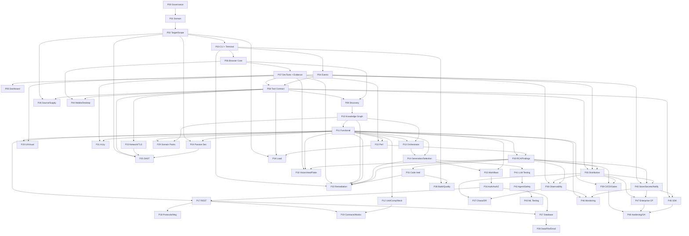
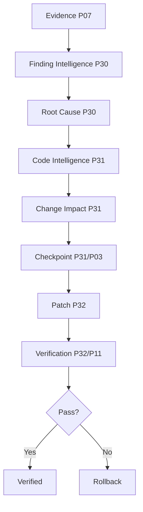
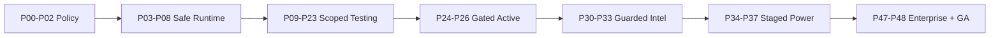
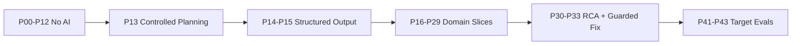

# WTT — Website Testing Tool
## Complete Implementation Phases & Global Tool Catalog Roadmap

| Field | Value |
|---|---|
| Document Status | **Canonical — Draft for Review** |
| Version | 0.2.0 (Supersedes v0.1.0 `WTT-P0–P29` scheme; see Appendix A) |
| Last Updated | 2026-09-07 |
| Source PRD | `PRD.md` v0.1.0 — WHAT WTT must accomplish |
| Source Architecture | `ARCHITECTURE.md` v0.1.0 — HOW WTT is structured |
| Source Rules | `RULES.md` v0.1.0 — Mandatory implementation/operating constraints |
| Source Tool Catalog | **No standalone catalog file exists in repo** (searched: `TOOL_CATALOG.md`, `TOOLS.md`, `WTT_TOOL_CATALOG.md`, all `*catalog*`/`*tools*` names). Catalog structure below is taken from the authoritative domain/ID-range table (domains A–CZ, IDs 1–1235) ratified for this roadmap. Standalone per-capability `TOOL_CATALOG.md` is an Open Decision (PHZ-OD-010); ID-level verification follows its publication. |
| Current Milestone | TO BE SET |
| Current Phase | TO BE SET (expected: WTT-P00) |
| Catalog Coverage Status | All domains A–CZ mapped to primary phases; 0 UNMAPPED at domain/ID-range granularity (see §92). Per-capability row verification pending standalone catalog. |

> **Conflict check.** `PRD.md` (87 sections), `ARCHITECTURE.md` (90 sections), `RULES.md` (61 sections) read in full. No `BLOCKED — SOURCE-OF-TRUTH CONFLICT`. Only known note: PRD §15 editorial token (`ARCH-OD-013`, non-semantic).
> **Supersession.** v0.1.0 used phases `WTT-P0–P29`. This version adopts the canonical `WTT-P00–WTT-P48` program. Appendix A maps old → new. No requirements were dropped; granularity increased (P00–P10 foundations, P41–P44 advanced domains, P45–P48 ecosystem/GA).

---

## Table of Contents

1. [Document Control](#1-document-control)
2. [Purpose](#2-purpose)
3. [Source-of-Truth Hierarchy](#3-source-of-truth-hierarchy)
4. [WTT Product Execution Model](#4-wtt-product-execution-model)
5. [Roadmap Principles](#5-roadmap-principles)
6. [Catalog Coverage Policy](#6-catalog-coverage-policy)
7. [Tool Integration Strategy](#7-tool-integration-strategy)
8. [Language Selection Policy](#8-language-selection-policy)
9. [Phase Status Model](#9-phase-status-model)
10. [Program Milestones](#10-program-milestones)
11. [Critical Path](#11-critical-path)
12. [Dependency Graph](#12-dependency-graph)
13. [Prototype Definition](#13-prototype-definition)
14. [Alpha Definition](#14-alpha-definition)
15. [Beta Definition](#15-beta-definition)
16. [V1 Definition](#16-v1-definition)
17. [Enterprise Definition](#17-enterprise-definition)
18. [GA Definition](#18-ga-definition)
19. [WTT-P00 — Governance, Product Contract & Engineering Foundation](#19-wtt-p00--governance-product-contract--engineering-foundation)
20. [WTT-P01 — Core Domain Model & Control Plane Foundation](#20-wtt-p01--core-domain-model--control-plane-foundation)
21. [WTT-P02 — Target, Environment, Authorization & Scope Engine](#21-wtt-p02--target-environment-authorization--scope-engine)
22. [WTT-P03 — CLI, Process Runtime & Terminal Safety](#22-wtt-p03--cli-process-runtime--terminal-safety)
23. [WTT-P04 — Event System, Session State & Real-Time Backbone](#23-wtt-p04--event-system-session-state--real-time-backbone)
24. [WTT-P05 — Live Dashboard Foundation](#24-wtt-p05--live-dashboard-foundation)
25. [WTT-P06 — Browser Automation Core](#25-wtt-p06--browser-automation-core)
26. [WTT-P07 — Browser DevTools & Evidence Engine](#26-wtt-p07--browser-devtools--evidence-engine)
27. [WTT-P08 — Tool Contract, Capability Registry & Plugin Runtime](#27-wtt-p08--tool-contract-capability-registry--plugin-runtime)
28. [WTT-P09 — Website Discovery, Asset Discovery & Fingerprinting](#28-wtt-p09--website-discovery-asset-discovery--fingerprinting)
29. [WTT-P10 — Application Knowledge Graph](#29-wtt-p10--application-knowledge-graph)
30. [WTT-P11 — Functional Testing Engine](#30-wtt-p11--functional-testing-engine)
31. [WTT-P12 — Unit, Component, BDD, Property & Mocking Ecosystem](#31-wtt-p12--unit-component-bdd-property--mocking-ecosystem)
32. [WTT-P13 — AI Orchestrator & Dynamic Tool Selection](#32-wtt-p13--ai-orchestrator--dynamic-tool-selection)
33. [WTT-P14 — AI Test Generation & Intelligent Test Selection](#33-wtt-p14--ai-test-generation--intelligent-test-selection)
34. [WTT-P15 — Business Workflow Testing](#34-wtt-p15--business-workflow-testing)
35. [WTT-P16 — Authentication & Authorization Testing](#35-wtt-p16--authentication--authorization-testing)
36. [WTT-P17 — REST API Testing](#36-wtt-p17--rest-api-testing)
37. [WTT-P18 — GraphQL, gRPC, SOAP, WebSocket, SSE & Messaging](#37-wtt-p18--graphql-grpc-soap-websocket-sse--messaging)
38. [WTT-P19 — API Contract, Schema & Service Virtualization](#38-wtt-p19--api-contract-schema--service-virtualization)
39. [WTT-P20 — UI/UX, Responsive & Visual Intelligence](#39-wtt-p20--uiux-responsive--visual-intelligence)
40. [WTT-P21 — Accessibility Engine](#40-wtt-p21--accessibility-engine)
41. [WTT-P22 — Web Performance & Core Web Vitals](#41-wtt-p22--web-performance--core-web-vitals)
42. [WTT-P23 — Network, Proxy, DNS & TLS Diagnostics](#42-wtt-p23--network-proxy-dns--tls-diagnostics)
43. [WTT-P24 — Passive Security & Security Configuration](#43-wtt-p24--passive-security--security-configuration)
44. [WTT-P25 — Authorized DAST & Defensive Security Adapters](#44-wtt-p25--authorized-dast--defensive-security-adapters)
45. [WTT-P26 — Source, Dependency, Supply-Chain & Infrastructure Security](#45-wtt-p26--source-dependency-supply-chain--infrastructure-security)
46. [WTT-P27 — Database Testing, Schema & Performance](#46-wtt-p27--database-testing-schema--performance)
47. [WTT-P28 — Data Quality, ETL, BI, File & Email Testing](#47-wtt-p28--data-quality-etl-bi-file--email-testing)
48. [WTT-P29 — Localization, Payment, E-Commerce, SEO & Privacy](#48-wtt-p29--localization-payment-e-commerce-seo--privacy)
49. [WTT-P30 — Root-Cause, Finding Intelligence & Evidence Integrity](#49-wtt-p30--root-cause-finding-intelligence--evidence-integrity)
50. [WTT-P31 — Source-Code Intelligence & Change Impact](#50-wtt-p31--source-code-intelligence--change-impact)
51. [WTT-P32 — Guarded Auto-Remediation](#51-wtt-p32--guarded-auto-remediation)
52. [WTT-P33 — Browser AI, Vision, Self-Healing & Flakiness](#52-wtt-p33--browser-ai-vision-self-healing--flakiness)
53. [WTT-P34 — Load, Distributed Load & Performance Stress](#53-wtt-p34--load-distributed-load--performance-stress)
54. [WTT-P35 — Orchestration, Queues & Distributed Workers](#54-wtt-p35--orchestration-queues--distributed-workers)
55. [WTT-P36 — Observability, Logs, APM, Tracing & Monitoring](#55-wtt-p36--observability-logs-apm-tracing--monitoring)
56. [WTT-P37 — Chaos, Reliability & Disaster Recovery](#56-wtt-p37--chaos-reliability--disaster-recovery)
57. [WTT-P38 — Build, Code Quality, Coverage & Mutation Testing](#57-wtt-p38--build-code-quality-coverage--mutation-testing)
58. [WTT-P39 — CI/CD, Git & Deployment Validation](#58-wtt-p39--cicd-git--deployment-validation)
59. [WTT-P40 — Artifact Storage, Secrets, Notifications & Management Integrations](#59-wtt-p40--artifact-storage-secrets-notifications--management-integrations)
60. [WTT-P41 — AI / LLM Application Testing](#60-wtt-p41--ai--llm-application-testing)
61. [WTT-P42 — AI Agent, Trajectory & AI Safety Testing](#61-wtt-p42--ai-agent-trajectory--ai-safety-testing)
62. [WTT-P43 — Machine Learning Testing](#62-wtt-p43--machine-learning-testing)
63. [WTT-P44 — Mobile & Desktop Extension](#63-wtt-p44--mobile--desktop-extension)
64. [WTT-P45 — Tool SDK & Extension Ecosystem](#64-wtt-p45--tool-sdk--extension-ecosystem)
65. [WTT-P46 — Continuous / Synthetic Monitoring](#65-wtt-p46--continuous--synthetic-monitoring)
66. [WTT-P47 — Enterprise Control Plane](#66-wtt-p47--enterprise-control-plane)
67. [WTT-P48 — Platform Hardening & GA](#67-wtt-p48--platform-hardening--ga)
68. [Phase Dependency Matrix](#68-phase-dependency-matrix)
69. [Phase Parallelism](#69-phase-parallelism)
70. [Catalog-to-Phase Matrix](#70-catalog-to-phase-matrix)
71. [Capability-to-Phase Matrix](#71-capability-to-phase-matrix)
72. [Tool Tier Matrix](#72-tool-tier-matrix)
73. [Native vs Adapter Matrix](#73-native-vs-adapter-matrix)
74. [Language Decision Matrix](#74-language-decision-matrix)
75. [Security Evolution Matrix](#75-security-evolution-matrix)
76. [AI Evolution Matrix](#76-ai-evolution-matrix)
77. [Browser Evolution Matrix](#77-browser-evolution-matrix)
78. [Infrastructure Evolution Matrix](#78-infrastructure-evolution-matrix)
79. [Data Model Evolution Matrix](#79-data-model-evolution-matrix)
80. [Test Maturity Matrix](#80-test-maturity-matrix)
81. [Release Gates](#81-release-gates)
82. [Cross-Platform Gates](#82-cross-platform-gates)
83. [Phase Risk Model](#83-phase-risk-model)
84. [Architecture Review Triggers](#84-architecture-review-triggers)
85. [Security Review Triggers](#85-security-review-triggers)
86. [Migration Review Triggers](#86-migration-review-triggers)
87. [Definition of Ready](#87-definition-of-ready)
88. [Definition of Implemented](#88-definition-of-implemented)
89. [Definition of Verified](#89-definition-of-verified)
90. [Definition of Complete](#90-definition-of-complete)
91. [Phase Completion Report Template](#91-phase-completion-report-template)
92. [Catalog Completeness Report](#92-catalog-completeness-report)
93. [Requirement Traceability](#93-requirement-traceability)
94. [Deferred Capabilities](#94-deferred-capabilities)
95. [Open Roadmap Decisions](#95-open-roadmap-decisions)
96. [Final Roadmap Summary](#96-final-roadmap-summary)

---

## 1. Document Control

WTT-PHZ-DOC-001: This roadmap is the canonical WHEN/IN-WHAT-ORDER authority. Together with `PRD.md` + `ARCHITECTURE.md` + `RULES.md` + the Global Tool Catalog structure (§70), an agent told *"Implement WTT-Pnn only"* MUST be able to determine objective, prerequisites, catalog coverage, allowed/forbidden components, contracts, data/API/browser/AI/terminal implications, security controls, adapters, language-decision requirements, tests, acceptance/exit/regression/docs requirements, and completion evidence — without re-planning the program.

WTT-PHZ-DOC-002: Phase IDs `WTT-P00–WTT-P48` and workstream IDs `WTT-Pnn-<DOMAIN>` are stable. No schedules are invented; the roadmap is dependency-driven only.

## 2. Purpose

WTT-PHZ-PUR-001: Transform the full WTT vision (PRD + Architecture + Rules + 1–1235 catalog capabilities across domains A–CZ) into a controlled, dependency-ordered engineering program where every capability has exactly one primary introduction phase, every phase has entry/exit gates, and `wtt <URL>` works far before enterprise breadth.

## 3. Source-of-Truth Hierarchy

```text
PRD.md (WHAT) → ARCHITECTURE.md (HOW) → RULES.md (CONSTRAINTS)
→ GLOBAL TOOL CATALOG (CAPABILITIES) → PHASES.md (WHEN/ORDER, this doc)
→ Implementation Plans → Source Code
```

WTT-PHZ-SRC-001: This document MUST NOT override higher sources. Conflicts are recorded as `BLOCKED — SOURCE-OF-TRUTH CONFLICT` with conflicting sections, exact conflict, affected phase, and decision required. None currently exists.

## 4. WTT Product Execution Model

WTT-PHZ-EXE-001: All architecture hides behind one entrypoint. Every phase MUST preserve and extend this pipeline, never fork it:

```text
wtt <URL> → Target/Scope Policy → Session → Runtime → Dashboard + Target Browser
→ Discovery → Knowledge → Plan → Capability Selection → Execution → Evidence
→ Findings → RCA → (gated) Remediation → Verification → Gates → Report
```

Phases deliver coherent product capabilities (e.g., "Browser Runtime & Developer Instrumentation"), never technology-name phases ("Phase 5 — Playwright"). Internal engine choices (Playwright/CDP/BiDi, specific scanners) are implementation details inside capability phases.

## 5. Roadmap Principles

Foundation before automation · Deterministic systems before AI autonomy · Browser infrastructure before AI browser agents · Evidence before root-cause claims · Root-cause before auto-remediation · Code intelligence before code modification · Checkpoint/rollback before autonomous fixing · Local-first before distributed · Single machine before Kubernetes · Core capabilities before commercial adapters · Security architecture from P00 · Active scanners only after authorization exists · Observability from the beginning · Tool contracts before mass expansion · Vertical slices before horizontal explosion. **Completion before expansion:** dependents MUST NOT start while prerequisite exit criteria are unresolved (BLOCKED).

## 6. Catalog Coverage Policy

WTT-PHZ-CAT-001: Every catalog capability receives: Catalog ID, Domain, Capability Name, exactly ONE Primary Introduction Phase (plus optional enhancement phases), Implementation Type (`WTT_NATIVE` / `WTT_ADAPTER` / `EXTERNAL_OPTIONAL` / `ENTERPRISE_INTEGRATION` / `EXPERIMENTAL` / `FUTURE_EXTENSION`), Status (`PLANNED`/`FOUNDATION_ONLY`/`ADAPTER_PLANNED`/`PARTIAL`/`IMPLEMENTED`/`VERIFIED`/`DEFERRED`/`EXPERIMENTAL`/`ENTERPRISE_ONLY`/`NOT_APPLICABLE_TO_V1`), Language/Runtime Decision Status, Security Classification, Dependencies, Optional Enhancement Phase. **No capability may remain UNMAPPED.** Per-phase coverage checklists (§§19–67) use: Catalog domains / Catalog IDs / Capabilities introduced / Native / Adapters / Optional / Deferred / Security classification / Language decision / Verification. Status is never claimed from documentation presence — only from executed verification. Individual tool descriptions are NOT duplicated into every phase; phases reference Catalog IDs/domains.

## 7. Tool Integration Strategy

Three patterns. **(1) Native** — deep WTT ownership: session manager, finding normalizer, AI orchestrator, capability registry, target manager, event model, RCA correlation, remediation controller, quality gates, dashboard. **(2) Adapter** — mature external engines behind the Tool Contract: Playwright, axe-core, Lighthouse, ZAP, k6, Semgrep, Trivy, Postman/Newman, etc. Never rebuild mature engines without a documented unique-need justification. **(3) Optional External** — commercial/specialized ecosystems (BrowserStack, Sauce Labs, Datadog, TestRail, Applitools, …): never forced into V1, never blocking core. Installation tiers: Built-in (critical lightweight) · Managed adapter (WTT installs/manages pinned version) · Bring-your-own (user supplies) · Remote SaaS (credentials/API) · Enterprise (org connection). WTT MUST NOT silently install system-level software.

## 8. Language Selection Policy

Official languages: TypeScript/JavaScript, Python, Java — selected per implementation by evaluating browser/runtime integration, library ecosystem, AI/ML and computer-vision needs, CPU/RAM workload, concurrency/throughput, startup latency, distribution, platform compatibility, maintainability, deployment, and existing WTT components. Choice may be one language or a justified combination. Never triplicate for coverage. Every implementation conforms to the Tool Contract, Capability Registry, Event Model, and Permission Model regardless of language. Tendencies (NOT rules): CLI/browser engine → TypeScript likely; vision/ML/data → Python possible; high-throughput/long-running distributed → Java possible. See §74.

## 9. Phase Status Model

`NOT_STARTED → READY → IN_PROGRESS → VALIDATING → COMPLETE`, with `BLOCKED` (recorded reason) and `DEFERRED` (recorded rationale) overlays. Vague states prohibited. Capability-level ladder inside phases: `NOT_IMPLEMENTED → PARTIAL → IMPLEMENTED → VERIFIED`. Placeholders (empty pages, dummy cards, hard-coded metrics, mock-only APIs, TODO services, interface-only adapters, config-listed scanner names, backend-less buttons, fake passes) cap at PARTIAL.

## 10. Program Milestones

| Milestone | Name | Phases | Outcome |
|---|---|---|---|
| M0 | Governance & Foundation | P00–P02 | Governed baseline + domain + policy |
| M1 | First Working WTT | P03–P09 | `wtt <URL>` → runtime + dashboard + browser + discovery (§14) |
| M2 | Core Testing Platform | P10–P12, P15–P19 | Knowledge → functional/unit → workflows → API/auth/contracts |
| M3 | Intelligent Testing | P13–P14, P30–P31 | Orchestrator + generation/selection + RCA + code intel |
| M4 | Full Quality Engineering | P20–P29 | Visual/a11y/perf/network/security/data/domain packs |
| M5 | Engineering Intelligence | P33 (vision/healing/flake), P36–P38 | Self-stabilizing + observable + build-correlated |
| M6 | Autonomous Remediation | P32 (+P30/P31 prerequisites) | Guarded fix + verify + rollback |
| M7 | Scale & Reliability | P34–P35, P37 | Load + distribution + chaos/DR |
| M8 | Enterprise Platform | P40, P47 | Storage/secrets/notify/mgmt + control plane |
| M9 | Ecosystem & Advanced Domains | P41–P46 | AI-target/ML/mobile/SDK/monitoring |
| M10 | GA / Production Hardening | P39 (gates feed), P48 | CI gates + hardening + GA |

## 11. Critical Path

Critical path to first production-useful WTT (MUST NOT slip):

```mermaid
flowchart LR
    P00[P00] --> P01[P01] --> P02[P02] --> P03[P03] --> P04[P04] --> P05[P05]
    --> P06[P06] --> P07[P07] --> P08[P08] --> P09[P09] --> P10[P10]
    --> P11[P11] --> P13[P13] --> P14[P14] --> P15[P15] --> P16[P16]
    --> P17[P17] --> P20[P20] --> P21[P21] --> P22[P22] --> P30[P30]
```



```text
P00 → P01 → P02 → P03 → P04 → P05 → P06 → P07 → P08 → P09 → P10
→ P11 → P13 → P14 → P15 → P16 → P17 → P20 → P21 → P22 → P30
```

WTT-PHZ-CP-001: P12/P18/P19/P23/P24/P29-reporting run adjacent to (not ahead of) the path toward V1. P25/P32/P34/P35 are NEVER on the Alpha/V1 path. Any critical-path BLOCKED triggers program replan before downstream continuation.

## 12. Dependency Graph



Auto-remediation prerequisite gate (§51):



## 13. Prototype Definition

WTT-PHZ-MS-001: CLI/control-plane concept works: P00–P03 exit gates pass on fixtures; `wtt <URL>` boots a secure runtime, validates scope, creates a session, and terminates cleanly (browser/dashboard may be stubbed-but-honest). No testing claims.

## 14. Alpha Definition

WTT-PHZ-MS-002 (around P07–P09, M1): `wtt http://localhost:5173` MUST yield: target validated, session created, runtime started, live dashboard opened, controlled target browser opened, basic browser telemetry captured, basic discovery performed, evidence stored, session completed cleanly. First major product proof. No auto-fix/distribution/security-active required.

## 15. Beta Definition

WTT-PHZ-MS-003: Representative web applications (MPA + SPA + auth + API) tested reliably end-to-end: discovery → functional → workflows → API/auth → findings → report, with gates green on fixtures and docs complete for shipped surface. Zero P0/P1.

## 16. V1 Definition

WTT-PHZ-MS-004: V1 = P00–P23 + selected P24/P29/P30 capabilities. Minimum: CLI, target/scope, session, terminal safety, events, dashboard, browser, DevTools, evidence, tool registry, discovery, knowledge graph, functional testing, AI planning, test generation, workflow testing, authentication, authorization, REST API, contracts, UI/UX, responsive, visual, accessibility, performance, network diagnostics, canonical findings, basic RCA, reporting. NOT required: Kubernetes, all cloud integrations, all mobile tools, all AI-eval frameworks, every security scanner, all monitoring vendors. Exact boundary ratified against PRD §74 at V1 freeze; items outside are POST_V1 / ENTERPRISE / EXPERIMENTAL.

## 17. Enterprise Definition

WTT-PHZ-MS-005: P34–P35 distribution proven, P40 persistence/routing complete, P47 control plane (orgs/roles/SSO/tenancy/audit/fleets) green with isolation red-team passed. Local single-user WTT MUST still work identically.

## 18. GA Definition

WTT-PHZ-MS-006: P48 gates pass: V1 + required enterprise slices hardened; full catalog A–CZ mapped with 0 UNMAPPED (items may be IMPLEMENTED/OPTIONAL_ADAPTER/ENTERPRISE_ONLY/EXPERIMENTAL/DEFERRED/FUTURE_EXTENSION, none silent); cross-platform + upgrade + recovery matrices green; SBOM/signing/provenance shipped.

---

## 19. WTT-P00 — Governance, Product Contract & Engineering Foundation

- **Milestone:** M0 · **Status:** `COMPLETE` (2026-10-04 — ADRs ratified, monorepo + toolchain + CI 3-OS matrix green, ownership registry + audits in CI, CHANGELOG initialized; evidence: `docs/phases/WTT-P00-report.md`, run `37226238529`, tag `wtt-p00-baseline`) · **Objective:** Immutable engineering baseline: ratified docs, repo, conventions, security invariants, catalog ownership.
- **Prerequisites (ENTRY):** [ ] PRD/ARCH/RULES/PHASES drafts + catalog structure (this doc §70) available [ ] repo + toolchain install rights. Else BLOCKED.
- **Catalog:** none introduced — P00 establishes the catalog ownership registry (domains A–CZ → primary phases per §70); all capability rows are owned by P01–P48. Types: NATIVE (conventions/repo).
- **May change:** docs, repo layout, toolchains, CI skeleton, `contracts/` ownership registry. **Must NOT change:** n/a (greenfield) — but MUST NOT create runtime services, browser/AI code, or scanners.
- **Contracts:** none implemented; ownership registry assigns every future contract an owner + path. **Data:** none. **APIs:** none. **Browser:** none. **AI:** authority boundaries documented only. **Terminal:** policy taxonomy documented (READ_ONLY…BLOCKED); no executor yet.
- **Security controls:** invariants recorded (scope/terminal/FS/network/secrets/untrusted-target/AI-authority/audit); threat checklist seeded. **Adapters:** none. **Language:** establish TS (Vitest/Jest/ESLint-Biome/tsc), Python (pytest/Ruff/Pyright-mypy), Java (JUnit/Gradle-Maven, dormant until Java modules begin); no unnecessary services.
- **Tests:** baseline pipeline green (lint/typecheck/build/unit-skeleton) on Windows/macOS/Linux; cross-doc term audit (zero undefined canonical terms). **Acceptance:** fresh clone → green pipeline all OSes; ownership registry complete; invariants reviewed.
- **Exit:** buildable/lintable/typecheckable/testable repo; zero architectural ambiguity blocking P01. **Regression:** baseline commit tagged. **Docs:** PRD/ARCH/RULES/PHASES consistent; CHANGELOG initialized. **Evidence:** pipeline links, audit records, registry.
- **Out of scope:** browser testing, AI automation, security scanning, distributed execution, auto-remediation. **Downstream:** all phases.

## 20. WTT-P01 — Core Domain Model & Control Plane Foundation

- **Milestone:** M0 · **Status:** `NOT_STARTED` · **Objective:** Canonical domain objects + state ownership + persistence skeleton; a session exists without browser/AI.
- **Prerequisites:** [ ] P00 COMPLETE. Else BLOCKED.
- **Catalog:** A 1–6 (WTT Core Runtime foundation: Target Manager, Session Manager, Runtime Environment Detector, Environment Configuration). Type: WTT_NATIVE; Status: PARTIAL→IMPLEMENTED (auth/scope rows complete in P02).
- **May change:** domain packages, repositories, application services, migrations. **Must NOT change:** CLI UX (P03), events transport (P04), policy tables content (P02 owns).
- **Contracts:** domain types, IDs, timestamps, status enums; repository ports. **Data:** projects/targets/environments/sessions/runs (+outbox stub); PostgreSQL introduced; forward-only migrations + rollback-tested. **APIs:** internal only. **Browser:** none. **AI:** none. **Terminal:** none.
- **Security controls:** state-ownership enforcement (single writer per aggregate); secrets-as-refs from day one. **Adapters:** PG driver only. **Language:** TypeScript (control plane); others dormant.
- **Tests:** unit (aggregates/transitions/IDs), integration (persist + reload), migration up/down. **Acceptance:** session CRUD + legal/illegal transition enforcement via dev harness; illegal transition rejected + logged. **Exit:** session exists independently of browser/AI; P02 unblocked. **Regression:** P00 pipeline green. **Docs:** DATABASE.md slice; domain guide. **Evidence:** test runs + migration logs.
- **Out of scope:** CLI, browser, dashboard, tools, AI. **Downstream:** P02–P48.

## 21. WTT-P02 — Target, Environment, Authorization & Scope Engine

- **Milestone:** M0 · **Status:** `NOT_STARTED` · **Objective:** Nothing active runs without a resolved target policy.
- **Prerequisites:** [ ] P01 COMPLETE. Else BLOCKED.
- **Catalog:** A 1–6 authorization/scope rows COMPLETE; policy foundation required by AK (P25), AE/AF (P34). Type: WTT_NATIVE.
- **May change:** target/env/policy packages, registries, validators. **Must NOT change:** domain aggregates' public shape (extend, don't break), CLI (P03).
- **Contracts:** target profile schema, scope file schema (`apiVersion`'d), policy decision record. **Data:** ownership/authorization registries, scope snapshots per session. **APIs:** internal policy-check port. **Browser:** none. **AI:** none. **Terminal:** classification table published (enforced P03).
- **Security controls:** URL/localhost/LAN/remote/staging/prod detectors; allow/deny registries (deny wins); profiles LOCAL/LAN/DEV/QA/STAGING/PRODUCTION/CUSTOM; prod defaults restrictive; every decision logged (principal/target/class/rule/version). **Adapters:** none. **Language:** TypeScript.
- **Tests:** detector matrices, scope allow/deny/edge tables, prod-default tests, redirect-escape policy tests, decision-audit tests. **Acceptance:** unresolved/denied scope blocks session creation with actionable error; cross-origin escape requires re-authorization. **Exit:** no active operation runnable without resolved policy. **Regression:** P01 suites green. **Docs:** scope policy guide; SECURITY.md slice. **Evidence:** policy test matrices + audit samples.
- **Out of scope:** scanners, load, execution (policy only). **Downstream:** P03 (enforcement), P25/P34 (gated consumers), all active phases.

## 22. WTT-P03 — CLI, Process Runtime & Terminal Safety

- **Milestone:** M1 (critical path) · **Status:** `NOT_STARTED` · **Objective:** Canonical `wtt <URL>` boots a secure supervised runtime; terminal power without terminal anarchy.
- **Prerequisites:** [ ] P01 COMPLETE [ ] P02 COMPLETE (policy to enforce). Else BLOCKED.
- **Catalog:** CV 1186–1189 Terminal Runtime, CW 1195–1206 Terminal Safety. Types: NATIVE (parser/resolver/supervisor/policy pipeline); ADAPTER_PLANNED per CLI tool (npm/node/python/java/curl/git/docker/kubectl/terraform/cloud CLIs/psql-etc. — only when the runtime exists).
- **May change:** CLI, process manager, signal handling, terminal gateway, `doctor`. **Must NOT change:** policy tables (P02 owns content), domain logic (CLI stays thin).
- **Contracts:** CLI exit-code contract (0/1/2/3/4/5/6), machine-output schemas, command-execution record. **Data:** session/config reads via P01; execution audit rows. **APIs:** internal runtime client. **Browser:** launch handshake only. **AI:** none. **Terminal:** full pipeline — Capability→Planner→Policy→Validator→Workspace→Risk→Approval→Executor→Audit; argv-only (no string-shell for untrusted input); cwd/timeout/caps mandatory; redacted capture (stdout/stderr/code/duration/reason).
- **Security controls:** 8-class enforcement + unit-tested mapping tables; BLOCKED refuses with guidance; destructive requires policy+approval, never auto-retries; scoped FS roots; `doctor` preflight (runtimes/browsers/PG/ports/scope; never prints secrets). **Adapters:** per-tool argv planners (bring-your-own runtimes; no silent system installs). **Language:** TypeScript (decide per adapter if helpers needed).
- **Tests:** parser/exit-map unit; failure matrix (bad URL/dead target/port clash/missing browser → code+message); signal tests (graceful→forced); classification-table tests; escape red-team (`../`, absolute, symlink); `doctor` goldens; x-platform smoke. **Acceptance:** `wtt <URL>` starts secure runtime + session; destructive command denied without approval + audited. **Exit:** Prototype milestone (§13) met. **Regression:** P01–P02 green. **Docs:** CLI_SPEC.md slice, terminal policy guide, CHANGELOG. **Evidence:** failure-matrix runs, audit samples.
- **Out of scope:** dashboard UI (P05), browser depth (P06), discovery (P09). **Downstream:** P04–P08, P32 (terminal safety prerequisite), P38.

## 23. WTT-P04 — Event System, Session State & Real-Time Backbone

- **Milestone:** M1 (critical path) · **Status:** `NOT_STARTED` · **Objective:** Everything observable, correlatable, replayable: canonical events + session timeline.
- **Prerequisites:** [ ] P01 COMPLETE [ ] P03 runtime exists (producer). Else BLOCKED.
- **Catalog:** CT 1165–1185 Real-Time Event System. Type: WTT_NATIVE.
- **May change:** event envelope/registry, outbox relay, fanout (in-proc + Redis streams-class), cursors/backfill, backpressure. **Must NOT change:** domain aggregates (project, don't mutate), tool payloads (P08 owns).
- **Contracts:** envelope v1 (`eventId/type/version/sessionId/timestamp/source/payload` + correlation/causation/actor); family schemas (`session/browser/network/console/agent/tool/test/finding/fix/artifact/report.*`); outbox + consumer contracts. **Data:** durable events + outbox + cursors (PG); hot fanout (Redis, non-authoritative). **APIs:** internal publish/subscribe; replay API stub (dashboard consumes P05). **Browser:** producers only. **AI:** producers only. **Terminal:** terminal-activity events (redacted).
- **Security controls:** redaction at envelope layer; PII/secret-safe payload rules; cursor auth (P05 completes). **Adapters:** Redis client only. **Language:** TypeScript.
- **Tests:** schema contract tests; idempotent-consumer tests (duplicate delivery safe); ordering tests per (session,stream); outbox relay tests (commit-first-event-second); backpressure/flood tests; replay-from-cursor tests. **Acceptance:** kill consumer → resume from cursor with zero loss/dupe-effects; flood (10k/min synthetic) stays bounded. **Exit:** all major actions correlatable to a session timeline. **Regression:** P01–P03 green. **Docs:** EVENTS.md slice; consumer guide. **Evidence:** flood/replay test reports.
- **Out of scope:** dashboard UI (P05), analytics. **Downstream:** P05 (fanout consumer), P08/P35 (distribution), P36 (telemetry).

## 24. WTT-P05 — Live Dashboard Foundation

- **Milestone:** M1 (critical path) · **Status:** `NOT_STARTED` · **Objective:** Browser surface #1: live, non-authoritative, honest dashboard (real data only, no fake KPIs).
- **Prerequisites:** [ ] P04 fanout + cursors live. Else BLOCKED.
- **Catalog:** CS 1136–1164 WTT Live Dashboard (foundation widgets only; later widgets with owning phases). Type: WTT_NATIVE.
- **May change:** Dashboard API (REST + WS/SSE), React/Vite app shell, P05 areas. **Must NOT change:** domain truth (server-authoritative; dashboard never decides PASS/RESOLVED/VERIFIED/READY), event schemas (P04 owns).
- **Contracts:** Dashboard API v1 (OpenAPI), stream cursor protocol, view-model DTOs (generated from `contracts/`). **Data:** reads via API; no direct DB. **APIs:** queries + streams + artifact fetch (versioned). **Browser:** Surface A window (origin/storage/token isolated from target). **AI:** activity plumbing (agents P13). **Terminal:** redacted activity stream view.
- **Security controls:** loopback bind default; local-token auth; CSP/frame controls; sanitized rendering of ALL untrusted content; target origin can never invoke privileged APIs (token+origin+capability tests); confirmations + audit for dangerous actions. **Adapters:** none. **Language:** TypeScript.
- **Tests:** render-from-cursor tests; reconnect/backfill chaos; server-wins conflict tests; evil-fixture isolation red-team; loading/empty/error/denied/offline per area. **Acceptance:** live run visible without refresh; disconnect→resync; no stub area claims functionality (roadmap states only). **Exit:** dashboard shows authoritative live session state. **Regression:** P01–P04 green. **Docs:** DASHBOARD_SPEC.md slice; API OpenAPI. **Evidence:** chaos + isolation reports, screenshots of live runs.
- **Out of scope:** findings/RCA/fix/worker/security/perf areas (owning phases). **Downstream:** all later phases surface through P05.

## 25. WTT-P06 — Browser Automation Core

- **Milestone:** M1 (critical path) · **Status:** `NOT_STARTED` · **Objective:** Browser surface #2: reliable isolated automation behind replaceable engine ports.
- **Prerequisites:** [ ] P01 COMPLETE [ ] P03 launcher integrated. Else BLOCKED.
- **Catalog:** I 123–156 Browser Automation; M 233–241 (driver foundations share; execution in P11). Types: NATIVE (ports/managers/locators/waits); ADAPTER (Playwright-first; Selenium/WebdriverIO/Cypress/Puppeteer/Nightwatch/TestCafe/Selenide = adapter seams, TIER-2/3).
- **May change:** `BrowserDriver` ports, manager/pool/context/page/action/locator/navigation/dialog/popup/tab/upload/download/input/permission modules. **Must NOT change:** verdicting (P11), evidence types (P07), plans (P13).
- **Contracts:** driver port interfaces; action primitive schemas (idempotent-keyed); context-isolation contract. **Data:** browser session refs (telemetry persisted per P04/P07 policy). **APIs:** internal driver APIs. **Browser:** FULL surface (launch/shutdown/restart/headed-headless/contexts/tabs/windows/popups/dialogs/navigate/click/fill/type/select/check/drag/keyboard/mouse/touch/upload/download/clipboard/permissions; Chromium first). **AI:** none (deterministic actions). **Terminal:** browser provisioning via P03 pipeline.
- **Security controls:** per-session isolated contexts (cookies/storage/auth); dashboard/target origin separation; download quarantine path; control modes (AI/USER/SHARED) + action leases. **Adapters:** Playwright TIER-1; rest TIER-2/3 seams. **Language:** TypeScript (Playwright ecosystem) — decide per seam, record rationale.
- **Tests:** port-fake unit; fixture E2E (MPA/SPA/dialogs/uploads/iframes/shadow-DOM/auth) headed+headless; isolation tests; crash-injection (kill context → canonical error + salvage + session survives); action-replay-from-events. **Acceptance:** fixtures navigate + act reliably; Context B cannot read A's state. **Exit:** WTT reliably controls isolated browser sessions. **Regression:** P01–P05 green. **Docs:** engine-port guide; fixture catalog. **Evidence:** fixture runs + isolation proofs.
- **Out of scope:** DevTools depth (P07), Firefox/WebKit/grids delivery, assertions (P11). **Downstream:** P07–P09, P11, P20, P33, P44.

## 26. WTT-P07 — Browser DevTools & Evidence Engine

- **Milestone:** M1 (critical path) · **Status:** `NOT_STARTED` · **Objective:** Developer-grade observation + reproducible evidence for every browser failure.
- **Prerequisites:** [ ] P06 contexts/actions live [ ] P04 events live. Else BLOCKED.
- **Catalog:** J 157–183 Browser Developer Control; K 184–201 Browser Evidence. Types: NATIVE (bridge/collectors/index); ADAPTER (CDP/WebDriver-BiDi/Playwright-instrumentation transports).
- **May change:** DevToolsBridge, EvidenceCollector, evidence index, capture policies. **Must NOT change:** action primitives (P06), artifact backends beyond FS (P40), finding model (P30).
- **Contracts:** telemetry event schemas (console/exception/network/perf/storage/WS/shifts); evidence object schema (session/run/test/step/timestamp/tool/agent/URL/hash/location/correlation). **Data:** evidence index rows; FS bytes (content-addressed). **APIs:** evidence query/fetch (internal + dashboard). **Browser:** CDP/BiDi (DOM/CSS/computed/network/console/exceptions/CPU/mem/heap/coverage/throttling/storage/cookies/IndexedDB/SW/WS/listeners/shifts); captures (screenshots/element/full-page/video/HAR/trace/DOM+AX snapshots/console/network/req-res/storage). **AI:** none. **Terminal:** none.
- **Security controls:** capture-time redaction (creds/tokens/PII); throttling/blocking scoped + auto-reverted + labeled; sensitive classes restricted. **Adapters:** transports TIER-1. **Language:** TypeScript.
- **Tests:** capture-completeness per fixture; correlation tests (evidence↔step↔URL↔time one-hop); redaction tests; throttle-revert tests; large-artifact-ref tests (never embedded). **Acceptance:** any fixture failure reproduces with linked screenshot+DOM+console+network+HAR. **Exit:** every browser failure references reproducible evidence. **Regression:** P01–P06 green. **Docs:** evidence catalog; capture policy. **Evidence:** correlation audit + sample bundles.
- **Out of scope:** S3 backends (P40), video-at-scale retention tuning (P40), RCA (P30). **Downstream:** P08 (evidence capabilities), P09–P11, P20–P22, P30, P32 (evidence prerequisite), P40.

## 27. WTT-P08 — Tool Contract, Capability Registry & Plugin Runtime

- **Milestone:** M1 (critical path) · **Status:** `NOT_STARTED` · **Objective:** End hard-coded integrations: AI/runtime request capabilities; resolver + policy choose implementations.
- **Prerequisites:** [ ] P01 domain + P04 events live [ ] P06/P07 capabilities to register. Else BLOCKED.
- **Catalog:** C 25–38 WTT Tool Platform; D 39–49 Tool Integration Protocols. Type: WTT_NATIVE (+ representative adapters proving the contract).
- **May change:** Capability/Tool registries, manifests, resolver, gateway, plugin manager, health/version/dependency managers, sandbox assignments. **Must NOT change:** engine internals (wrapped, not forked), policy verdicts (P02 engine decides).
- **Contracts:** Tool Contract v1 (mandatory vs optional fields); capability taxonomy (`browser.*`…`audit.*`); job/result/cancel/health schemas; protocol bindings used only as justified (MCP/OpenAPI/REST/gRPC/CLI/stdio-JSON/WS/remote-worker/Docker/K8s-job). **Data:** tool definitions/implementations/instances/executions. **APIs:** registry + execution + health endpoints (internal; admin surface later). **Browser:** exposed as `browser.*` capabilities. **AI:** consumed by P13 (resolver is deterministic). **Terminal:** tool processes spawned via P03 pipeline.
- **Security controls:** manifest validation; permission/risk cross-check per execution; provenance (author/source/hash/signature-where-configured); sandbox by risk; quarantine/disable; tool-crash containment. **Adapters:** Playwright/axe-core/Lighthouse-smoke as contract-proving TIER-1 (depth in owning phases). **Language:** TS runtime + Python JSONL + Java contract (runtimes per §74; no Java delivery required yet).
- **Tests:** conformance suite (all adapters); resolver scoring + deterministic tie-breaks; selection-explanation tests; cancel/timeout chaos; crash-containment (tool dies → session survives); schema round-trips TS↔Py. **Acceptance:** capability executes with zero vendor imports in core; plan explains selections AND rejections. **Exit:** orchestration requests capabilities without knowing vendors. **Regression:** P01–P07 green. **Docs:** TOOL_SDK.md contract slice; adapter guide (draft). **Evidence:** conformance reports.
- **Out of scope:** catalog breadth (owning phases), public SDK (P45), distribution (P35). **Downstream:** P09+ (all dispatch through P08), P25/P34 (permission-gated), P35 (remote dispatch), P45 (SDK).

## 28. WTT-P09 — Website Discovery, Asset Discovery & Fingerprinting

- **Milestone:** M1 (critical path; Alpha close) · **Status:** `NOT_STARTED` · **Objective:** Normalized, complete application inventory before intelligent testing.
- **Prerequisites:** [ ] P08 dispatch live [ ] P06/P07 observation live. Else BLOCKED.
- **Catalog:** E 50–72 Website Discovery; F 73–86 Asset Discovery; G 87–106 Technology Fingerprinting. Types: NATIVE (frontier/canonicalizer/map-builder); ADAPTER (Crawlee/Katana/Scrapy/Cheerio/Beautiful-Soup/Wappalyzer/WhatWeb-class, TIER-1/2).
- **May change:** crawler tiers, extractors, canonicalizer, fingerprint rule DB, frontier store. **Must NOT change:** graph schema ownership (P10 extends), test execution (P11).
- **Contracts:** discovery job/result schemas; canonical URL + route-pattern rules; fingerprint finding schema (tech + confidence + evidence). **Data:** frontier/checkpoints, pages/routes/forms/assets/edges (staging for P10), fingerprints. **APIs:** map query endpoints (basic). **Browser:** heavy consumer (quotas enforced); fetch tier for cheap pages. **AI:** none (feeds P13). **Terminal:** adapter CLIs via P03.
- **Security controls:** scope confinement (out-of-scope never actively fetched); redirect-chain cap + cross-origin escape pause; passive-first probing; rate limits/crawl budgets; auth-walled areas marked-not-mapped (deep auth P16). **Adapters:** per §74; detect-before-install (no default bloat). **Language:** TS likely (browser ties); Python possible (parse/scale) — decide per adapter.
- **Tests:** ground-truth coverage (SPA/MPA/auth/pagination/infinite-scroll/redirect fixtures); canonicalization property tests; resume-from-checkpoint; budget-exhaustion (partial + caveat); scope-escape red-team. **Acceptance:** non-trivial fixture map matches ground truth ± tolerance; fingerprint constrains a sample plan (irrelevant suites excluded with reason). **Exit:** normalized complete inventory. **Regression:** P01–P08 green. **Docs:** discovery semantics; rule format. **Evidence:** coverage reports + maps.
- **Out of scope:** knowledge graphs (P10), test execution (P11), security probing (P25). **Downstream:** P10 (graph input), P11/P13–P16 (consumers).

## 29. WTT-P10 — Application Knowledge Graph

- **Milestone:** M2 (critical path) · **Status:** `NOT_STARTED` · **Objective:** Connected application knowledge, not disconnected JSON.
- **Prerequisites:** [ ] P09 inventory live. Else BLOCKED.
- **Catalog:** H 107–122 Application Intelligence Graphs (Application/Page/Route/Component/API/Workflow/Role/Permission/Database/Service-Dependency/Third-Party/Coverage/Finding/Risk/Historical-Failure/Change-Impact). Type: WTT_NATIVE.
- **May change:** graph store (relational nodes/edges + JSONB, NO graph DB unless justified), builders, traversal APIs, versioned overlays. **Must NOT change:** discovery extractors (P09), RCA/impact engines (P30/P31 consume).
- **Contracts:** node/edge schemas + edge vocabulary (NAVIGATES_TO/CALLS/REQUIRES_ROLE/CONTAINS/TRIGGERS/READS/WRITES/DEPENDS_ON/TESTED_BY/AFFECTED_BY + DUPLICATE_OF/HEALS). **Data:** graph tables + materialized hot traversals. **APIs:** graph query/traverse endpoints. **Browser:** via contracts only. **AI:** via contracts only. **Terminal:** via contracts only.
- **Security controls:** project-scoped overlays; tenant isolation ready; cross-session learning retentioned. **Adapters:** none (PG extension only if measured need). **Language:** TypeScript.
- **Tests:** builder goldens (map→expected graph); traversal correctness; versioning/overlay tests; scale tests (large-fixture graphs stay interactive). **Acceptance:** P11/P13 queries (untested routes, blast radius, covering tests) answer from graph with edge-linked explanations. **Exit:** discovery becomes connected knowledge. **Regression:** P01–P09 green. **Docs:** graph schema + query guide. **Evidence:** graph dumps + traversal proofs.
- **Out of scope:** RCA ranking (P30), impact engine (P31). **Downstream:** P11/P13–P16, P30–P32.

## 30. WTT-P11 — Functional Testing Engine

- **Milestone:** M2 (critical path) · **Status:** `NOT_STARTED` · **Objective:** Deterministic, reproducible functional tests without AI: AI later decides WHAT; this engine owns HOW + verdicts.
- **Prerequisites:** [ ] P06 actions + P07 evidence + P08 dispatch + P10 graph live. Else BLOCKED.
- **Catalog:** L 202–232 Functional Testing; M 233–241 E2E Testing (execution share; driver foundations in P06). Type: WTT_NATIVE (+ existing-suite adapters in P12).
- **May change:** Plan/Scenario/Step/Action/Assertion/Expected/Actual/Result model; action library (navigation→deep-links per catalog); deterministic oracles + verdicting. **Must NOT change:** browser primitives (P06), evidence types (P07), generation (P14).
- **Contracts:** test schemas; verdict schema (PASS/FAIL/SKIPPED/BLOCKED/INCONCLUSIVE + rationale); oracle catalog. **Data:** plans/tests/steps/results. **APIs:** test CRUD/run/query. **Browser:** primary executor (idempotent primitives, budgets, condition-waits, locator fallbacks). **AI:** none. **Terminal:** sandboxed data setup/teardown + cleanup verification.
- **Security controls:** test-data sandboxing; no prod writes; destructive steps classified + approved. **Adapters:** none (native). **Language:** TypeScript.
- **Tests:** oracle unit; seeded determinism (same seed → same verdicts or labeled nondeterminism); negative/boundary suites; cleanup verification; false-PASS impossibility tests (skipped assertions → SKIPPED/BLOCKED/INCONCLUSIVE). **Acceptance:** fixture suites green headed+headless with per-failure step+evidence+oracle links. **Exit:** reproducible functional tests run without AI. **Regression:** P01–P10 green. **Docs:** authoring guide; oracle catalog. **Evidence:** determinism reports.
- **Out of scope:** AI generation (P14), workflows (P15), API depth (P17), healing (P33). **Downstream:** P12–P17, P20–P22, P30, P32 (execution prerequisite), P39.

## 31. WTT-P12 — Unit, Component, BDD, Property & Mocking Ecosystem

- **Milestone:** M2 · **Status:** `NOT_STARTED` · **Objective:** Source-access projects: discover + execute existing suites + property/mock layers through adapters.
- **Prerequisites:** [ ] P08 dispatch + P11 verdicting live [ ] P03 terminal pipeline live. Else BLOCKED.
- **Catalog:** N 242–256 Unit & Component; O 257–269 Python Testing; P 270–284 Java Testing; X 389–393 Property/Generative (foundations; depth P19); Y 394–400 Mocking/Virtualization (foundations; depth P19). Types: ADAPTER (Vitest/Jest/Testing-Library/Cypress-Component/pytest/Hypothesis/JUnit/TestNG/WireMock/MSW/Prism-class); NATIVE (discovery + normalization + verdict mapping).
- **May change:** suite discovery, framework adapters, result normalizers. **Must NOT change:** P11 verdict semantics (map into, don't fork), build invocation depth (P38).
- **Contracts:** suite-discovery schema; normalized unit-result schema; mock/fault scenario schema (shared with P19). **Data:** suite registry + runs. **APIs:** suite list/run endpoints. **Browser:** component-testing where applicable. **AI:** none. **Terminal:** framework CLIs via P03 (detect stack first; install nothing by default).
- **Security controls:** repo-bounded execution; untrusted test code runs sandboxed; no secret exfil via test output (redaction). **Adapters:** TIER-1/2 per stack. **Language:** adapter language = stack language (justify per adapter).
- **Tests:** per-adapter goldens (pass/fail/skip mapping); discovery tests (detect stack → right adapter); sandbox-escape negative tests; flaky-suite labeling tests. **Acceptance:** fixture repos (TS/Py/Java) run green through WTT with normalized results. **Exit:** existing supported suites execute through adapters. **Regression:** P01–P11 green. **Docs:** adapter matrix; per-framework notes. **Evidence:** adapter reports.
- **Out of scope:** build/quality depth (P38), contract depth (P19). **Downstream:** P19 (property/mock depth), P31 (test maps), P38.

## 32. WTT-P13 — AI Orchestrator & Dynamic Tool Selection

- **Milestone:** M3 (critical path) · **Status:** `NOT_STARTED` · **Objective:** Controlled intelligence: plans + capability routing + cost-awareness that cannot bypass policy.
- **Prerequisites:** [ ] P08 registry/resolver + P10 graph + P11 engine live [ ] model routes configured (cloud + local-compatible). Else BLOCKED.
- **Catalog:** B 7–24 AI Orchestration; CZ 1226–1235 Cost/Resource Intelligence (ledger/routing share; infra share P36). Types: NATIVE (orchestrator/planner/router/ledger); ADAPTER (model providers).
- **May change:** orchestrator loop (Planner/Observer/Selector/Coordinator/State/Verifier/Recovery), model gateway, budget ledger, structured agent tasks. **Must NOT change:** policy verdicts (P02), resolver scoring ownership (P08 — orchestrator requests, resolver chooses), verdicts (P11).
- **Contracts:** `CapabilityRequest`/plan schemas; invocation/usage schemas; decision-metadata schema (task/capability/reason/refs/model/action/confidence — no chain-of-thought storage). **Data:** plans/agent-tasks/invocations/usage. **APIs:** plan preview/fetch. **Browser:** via P11 only (no direct agent driving). **AI:** FULL surface (routing, fallback, 429/5xx, degraded rules-planner labeled non-AI, spend meter). **Terminal:** none direct (via capabilities).
- **Security controls:** 4-strata instruction separation; untrusted-content tagging; page-derived arg validation; approvals unreachable from content; payload minimization/redaction; secret refs only; evil-fixture red-team (blocking). **Adapters:** providers TIER-1/2/4. **Language:** TS gateway + core; Python for analysis helpers where justified.
- **Tests:** routing/fallback unit; injection suites (BLOCKING); budget-exhaustion (pause + caveat, never silent overrun); `--plan/--dry-run` goldens (included/excluded rationale); degraded-mode (models down → labeled rules run); plan→execute round-trips. **Acceptance:** AI plan executes on P11 with zero undeclared side effects; injection flagged + safe continuation. **Exit:** AI plans but cannot bypass policy. **Regression:** P01–P12 green. **Docs:** AGENTS.md slice; routing/fallback guide. **Evidence:** decision ledgers + injection reports.
- **Out of scope:** full agent roster (added per owning phase), generation depth (P14), RCA/fix autonomy (P30/P32). **Downstream:** P14–P19, P30, P32, P41–P42.

## 33. WTT-P14 — AI Test Generation & Intelligent Test Selection

- **Milestone:** M3 (critical path) · **Status:** `NOT_STARTED` · **Objective:** Structured tests out, deterministic validation in: generation + risk-aware selection with provenance.
- **Prerequisites:** [ ] P13 loop + P10 graph + P11 engine live. Else BLOCKED.
- **Catalog:** CI 1028–1035 Intelligent Test Selection; CJ 1036–1046 AI Test Generation. Type: WTT_NATIVE.
- **May change:** generators (DOM/routes/AX-tree/OpenAPI/GraphQL/code/schema/requirements/stories/history/telemetry), selectors (risk/change/history/criticality/dependency/flake/scope/runtime), quarantine workflow. **Must NOT change:** execution/verdicts (P11 validates all generated tests), finding model (P30).
- **Contracts:** generated-test schema (+provenance: inputs/model+prompt-pack/confidence/review-state); selection-record schema (strategy/included/excluded+rationale/coverage-delta/risk-acceptance). **Data:** generated suites, selection records. **APIs:** generation/selection endpoints. **Browser:** execution target only. **AI:** generation + ranking models (vision assertions carry region+rationale+confidence). **Terminal:** none.
- **Security controls:** generated tests scope-checked (no destructive/exfil outside authorization); deterministic-oracle preference enforced. **Adapters:** none (provider use via P13). **Language:** TypeScript (+Python helpers if vision-heavy, justified).
- **Tests:** generator goldens per input type; provenance/quarantine tests (quarantined until verification passes); selection goldens (change→expected set + rationale); deselection-caveat tests (skipped-critical → gate caveat). **Acceptance:** generated suite executes on P11 unmodified-by-hand with schema-valid oracles. **Exit:** AI outputs structured tests the engine validates+runs. **Regression:** P01–P13 green. **Docs:** generation guide; selection semantics. **Evidence:** provenance ledgers + selection records.
- **Out of scope:** workflow models (P15), RCA (P30). **Downstream:** P15 (generated workflows), P30–P32, P39 (selection for CI).

## 34. WTT-P15 — Business Workflow Testing

- **Milestone:** M2 (critical path) · **Status:** `NOT_STARTED` · **Objective:** Real multi-step business processes as first-class testable graphs.
- **Prerequisites:** [ ] P11 engine + P14 generation/selection + P10 workflow graph live. Else BLOCKED.
- **Catalog:** extends L (P11), H Workflow Graph (P10), CJ (P14) — no new ID range; workflow capabilities tracked under L/CJ enhancement. Type: WTT_NATIVE.
- **May change:** workflow model/state machine (preconditions/identity/role/data/steps/assertions/expected-state/cleanup), discovery+ingestion, runner with branching + compensation. **Must NOT change:** step verdicts (P11), auth matrices (P16), API depth (P17).
- **Contracts:** declared-workflow schema; workflow-run/coverage schemas. **Data:** workflows/transitions/runs/coverage. **APIs:** workflow CRUD/run/coverage. **Browser:** joint executor with API legs (P17). **AI:** P13/P14 workflow generation. **Terminal:** sandboxed data fixtures.
- **Security controls:** role-scoped contexts; test-data isolation + compensation/rollback verification; payment legs sandbox-only. **Adapters:** none. **Language:** TypeScript.
- **Tests:** declared 6+ step flows (happy/negative/boundary/role/recovery); inference-vs-ground-truth; compensation-correctness (sandbox clean post-failure); coverage tracking. **Acceptance:** Login→…→Shipment fixture green with per-step evidence; mid-flow failure compensates cleanly. **Exit:** multi-step workflows discovered/generated + executed. **Regression:** P01–P14 green. **Docs:** workflow authoring guide + schema. **Evidence:** flow runs + coverage.
- **Out of scope:** API-depth assertions (P17), real-money (always sandbox). **Downstream:** P16 (role paths), P30 (workflow-attributed findings), P39 (critical gates), P46 (synthetic journeys).

## 35. WTT-P16 — Authentication & Authorization Testing

- **Milestone:** M2 (critical path) · **Status:** `NOT_STARTED` · **Objective:** Provable identity + permission truth: auth flows + role/permission matrices across UI/API.
- **Prerequisites:** [ ] P11 + P15 runnable [ ] secret-lease path available. Else BLOCKED.
- **Catalog:** Q 285–307 Authentication; R 308–322 Authorization. Types: NATIVE (flows/matrix engine/correlator); ADAPTER (protocol libs, test-IdP harnesses, TIER-1/2).
- **May change:** auth flow library, auth-state abstractions, matrix builder, UI/API/route correlator. **Must NOT change:** WTT platform auth (P47), finding lifecycle (P30).
- **Contracts:** auth-profile schema; `CredentialReference`/Identity/BrowserAuthState/APIAuthState/TokenState; matrix cell schema (Identity×Role×Permission×Resource×Action → Expected/Actual). **Data:** profiles/matrices/auth-state proofs (TTL'd, sensitive). **APIs:** matrix/run endpoints. **Browser:** UI legs (login→MFA→session→logout/invalidation). **AI:** Auth/AuthZ agent slices via P13. **Terminal:** none beyond fixtures.
- **Security controls:** leased test creds, redacted everywhere; auth artifacts restricted-retention; probing scope-gated + rate-limited + audited; prod read-only mapping default; defensive-only IDOR/BOLA reporting. **Adapters:** protocol/test-mail OTP capture (P28 mail where needed). **Language:** TypeScript (decide per protocol adapter).
- **Tests:** auth round-trips (login/refresh/logout/invalidation, MFA-OTP via test mail); matrix ground-truth fixtures (incl. UI-hidden-but-API-open); redaction tests (zero secrets in logs/events/artifacts); scope-denial tests. **Acceptance:** 3-role fixture matrix matches ground truth; out-of-scope probe denied + audited. **Exit:** role/permission matrices generated + verified. **Regression:** P01–P15 green. **Docs:** auth-profile + matrix guides. **Evidence:** matrices + redacted proofs.
- **Out of scope:** platform SSO/RBAC (P47), WebAuthn depth (basic now, depth as needed). **Downstream:** P17 (authed API), P27 (tenant checks), P30 (auth findings).

## 36. WTT-P17 — REST API Testing

- **Milestone:** M2 (critical path) · **Status:** `NOT_STARTED` · **Objective:** Browser-correlated REST validation with schema discipline.
- **Prerequisites:** [ ] P08 dispatch + P11 engine + P16 auth-state live. Else BLOCKED.
- **Catalog:** S 323–335 REST API Testing. Types: NATIVE (request builder/auth injector/validators/assertions/correlator); ADAPTER (native-HTTP + Postman-Newman/Bruno/REST-Assured/SuperTest/Karate/Hurl/curl/HTTPie-class, TIER-1/2 — choose per target/project).
- **May change:** protocol-neutral op model (REST depth now, seams for P18), schema validators, traffic correlator. **Must NOT change:** contract-diff ownership (P19), finding model (P30).
- **Contracts:** endpoint registry schema; request/response evidence schema (redacted); assertion schema. **Data:** endpoints/runs/contract refs. **APIs:** API-test endpoints + UI correlation views data. **Browser:** action→request→response correlation. **AI:** API agent slice. **Terminal:** CLI-harness adapters via P03.
- **Security controls:** auth injection via leased tokens; request/response redaction; rate-limit respect; no prod mutation outside SAFE_WRITE scope. **Adapters:** per §74. **Language:** TS likely; Java (REST-Assured) only if stack-justified.
- **Tests:** method/auth/pagination/idempotency/retry/error suites; schema-validation goldens; correlation tests (UI click → captured API pair); adapter-parity tests. **Acceptance:** fixture API fully exercised with browser correlation + redacted pairs. **Exit:** browser activity correlated with REST behavior. **Regression:** P01–P16 green. **Docs:** API testing guide; adapter matrix. **Evidence:** correlated runs.
- **Out of scope:** other protocols (P18), contract diffing depth (P19). **Downstream:** P18/P19, P27 (API↔DB), P30.

## 37. WTT-P18 — GraphQL, gRPC, SOAP, WebSocket, SSE & Messaging

- **Milestone:** M2 · **Status:** `NOT_STARTED` · **Objective:** Protocol breadth behind the same capability model — activated only when discovered/configured.
- **Prerequisites:** [ ] P17 op-model + correlator live. Else BLOCKED.
- **Catalog:** T 336–346 GraphQL; U 347–363 gRPC/SOAP/Realtime; V 364–373 Messaging. Types: ADAPTER (per protocol); NATIVE (registry extensions + correlation).
- **May change:** protocol adapters, schema loaders (GraphQL/gRPC-proto/WSDL), subscription/stream collectors, broker test clients. **Must NOT change:** P17 REST semantics, P19 contract ownership.
- **Contracts:** per-protocol op schemas; stream-frame evidence schema; broker-assertion schema. **Data:** protocol endpoints/subscriptions/messages (redacted). **APIs:** protocol run/query endpoints. **Browser:** WS/SSE correlation legs. **AI:** API-agent protocol slices. **Terminal:** broker CLIs via P03 (scoped creds).
- **Security controls:** broker creds leased + scoped; no prod-topic mutation outside explicit scope; stream PII minimization. **Adapters:** TIER-1/2 per protocol (Kafka/RabbitMQ/AMQP/MQTT/NATS/Redis-Streams/SQS/SNS/PubSub/ServiceBus only when relevant). **Language:** per protocol ecosystem (justify; gRPC-Java only if stack-justified).
- **Tests:** per-protocol goldens (query/mutation/subscription/fault); ordering/redelivery/DLQ tests where applicable; inactive-protocol tests (no discovery → no activation, no noise). **Acceptance:** fixture GraphQL+WS app fully validated; irrelevant protocols provably dormant. **Exit:** protocol workers operate through capability adapters. **Regression:** P01–P17 green. **Docs:** protocol guides. **Evidence:** protocol runs.
- **Out of scope:** contract diffing (P19), load-shaped streams (P34). **Downstream:** P19, P27, P30.

## 38. WTT-P19 — API Contract, Schema & Service Virtualization

- **Milestone:** M2 · **Status:** `NOT_STARTED` · **Objective:** Catch contract regressions independently of browser failures; test against virtualized dependencies.
- **Prerequisites:** [ ] P12 foundations + P17/P18 protocol runs live. Else BLOCKED.
- **Catalog:** W 374–388 API Contracts & Schemas; X 389–393 Property Testing (depth); Y 394–400 Mocking/Virtualization (depth). Types: ADAPTER (Pact/Spring-Cloud-Contract/OpenAPI-Diff/Schemathesis/Prism/Ajv/Pydantic/Zod/Protobuf/WireMock/MockServer/MSW/Hoverfly-class); NATIVE (diff orchestration + verdict mapping).
- **May change:** contract diff engine, conformance runners, virtual-service manager, fault-scenario library. **Must NOT change:** protocol execution (P17/P18), finding lifecycle (P30).
- **Contracts:** contract-version/diff schemas; fault-scenario schema (5xx/timeout/slow/empty/malformed/rate-limit/dependency-down); conformance verdict schema. **Data:** contract versions/diffs/conformance runs/virtual mappings. **APIs:** contract diff/conformance endpoints. **Browser:** consumer-side verification legs. **AI:** contract-triage slice. **Terminal:** harness CLIs via P03.
- **Security controls:** virtual deps only (never fault-inject prod deps); contract data redaction. **Adapters:** TIER-1/2 per stack. **Language:** per harness ecosystem (justify).
- **Tests:** breaking/non-breaking diff goldens; conformance suites (pass + deliberate violation); fault-matrix suites (each scenario → graceful-handling proof); consumer-driven round-trips. **Acceptance:** fixture OpenAPI break detected with diff + offending operation + evidence, no browser run needed. **Exit:** contract regressions detected independently. **Regression:** P01–P18 green. **Docs:** contract testing guide; fault catalog. **Evidence:** diffs + conformance reports.
- **Out of scope:** load-shaped contract soak (P34). **Downstream:** P30 (contract findings), P39 (contract gates).

## 39. WTT-P20 — UI/UX, Responsive & Visual Intelligence

- **Milestone:** M4 (critical path) · **Status:** `NOT_STARTED` · **Objective:** Reproducible frontend-quality findings with visual+structural evidence.
- **Prerequisites:** [ ] P07 captures + P11 engine + P08 dispatch live. Else BLOCKED.
- **Catalog:** Z 401–410 Visual Regression; AA 411–430 UI/UX Intelligence; AB 431–448 Responsive. Types: NATIVE (matrix runner/check packs/baseline service/fusion verdicts); ADAPTER (screenshots/pixelmatch/OpenCV/Percy/Applitools/Chromatic/BackstopJS-class, TIER-1/2/3).
- **May change:** viewport matrix, UI check packs, baseline/diff/review pipeline. **Must NOT change:** evidence types (P07), verdict semantics (P11), a11y scoring (P21).
- **Contracts:** viewport-profile schema; check-result schema (DOM node + computed-style diff + crop); baseline/diff/approval schemas (branch/env-aware, versioned). **Data:** baselines/diffs/viewport results/approvals. **APIs:** baseline approve/compare/query. **Browser:** matrix executor (desktop→foldables, DPR/touch/orientation). **AI:** Visual agent + vision routing (verdicts carry rationale+regions+confidence). **Terminal:** adapter CLIs via P03.
- **Security controls:** screenshot PII minimization; baseline ACL + approval audit; commercial-adapter creds leased. **Adapters:** per §74. **Language:** TS likely; Python possible for CV/vision (justify).
- **Tests:** viewport goldens; diff-accuracy suites (pixel/structural/semantic); approval enforcement (auto-approve-all impossible); responsive-bug fixtures (overflow/collision/clipping/nav/touch-targets). **Acceptance:** fixture responsive bugs detected with viewport-attributed findings; known change blocked pending approval (when gated). **Exit:** reproducible visual/responsive findings with evidence. **Regression:** P01–P19 green. **Docs:** check catalog; baseline governance. **Evidence:** diffs + approvals.
- **Out of scope:** a11y (P21), perf (P22). **Downstream:** P21 (shared fixtures), P30, P39 (visual gates), P33 (vision depth).

## 40. WTT-P21 — Accessibility Engine

- **Milestone:** M4 (critical path) · **Status:** `NOT_STARTED` · **Objective:** WCAG-mapped, evidence-backed accessibility findings normalized into WTT canonical form.
- **Prerequisites:** [ ] P07 AX snapshots + P08 dispatch + P11 verdicting live. Else BLOCKED.
- **Catalog:** AC 449–471 Accessibility. Example coverage: adapters (axe-core/Pa11y/Lighthouse-a11y/Accessibility-Insights/WAVE-class); checks (WCAG-oriented/ARIA/semantics/names/keyboard/focus/contrast/alt/landmarks/headings/forms/tables/live-regions). **Coverage checklist:** Native: WTT a11y normalization + DOM/AX/screenshot correlation. Adapters: axe-core, Pa11y. Optional: Accessibility Insights, WAVE. Language: decide per adapter (TS likely for browser integration, not mandated). Verification: known a11y fixture produces canonical findings.
- **May change:** a11y runner, WCAG mapper, keyboard/focus/contrast probers. **Must NOT change:** finding lifecycle (P30), AT execution (screen readers NVDA/JAWS/VoiceOver/TalkBack/Narrator progress per environment — seam now, depth as Future/enterprise).
- **Contracts:** a11y-check schema; WCAG-mapping table (versioned). **Data:** a11y findings + mappings. **APIs:** a11y run/query endpoints. **Browser:** instrumented runs + AX-tree capture. **AI:** A11y agent slice. **Terminal:** CLI adapters via P03.
- **Security controls:** none elevated (passive analysis); AT tooling sandboxed when used. **Adapters:** TIER-1/2. **Language:** per adapter (justify).
- **Tests:** WCAG-mapping goldens; node-evidence tests (node + tree excerpt + contrast ratio + keyboard trace); adapter-parity tests; dedup preview with P20/P22 signals (final merge P30). **Acceptance:** fixture violations map to correct criteria with node evidence. **Exit:** a11y findings normalize to canonical form. **Regression:** P01–P20 green. **Docs:** WCAG mapping table; a11y guide. **Evidence:** mapped findings.
- **Out of scope:** AT execution depth. **Downstream:** P30 (canonical merge), P39 (a11y gates).

## 41. WTT-P22 — Web Performance & Core Web Vitals

- **Milestone:** M4 (critical path) · **Status:** `NOT_STARTED` · **Objective:** Environment/profile-aware, baseline-comparable performance verdicts.
- **Prerequisites:** [ ] P07 perf timeline + P08 dispatch live. Else BLOCKED.
- **Catalog:** AD 472–479 Performance. Types: NATIVE (budget engine, timeseries, verdict mapping); ADAPTER (Lighthouse/LHCI/WebPageTest/Sitespeed/Web-Vitals/Chrome-perf-class).
- **May change:** perf runners, metric store, budget evaluator. **Must NOT change:** load generation (P34), finding lifecycle (P30).
- **Contracts:** metric bundle schema (LCP/INP/CLS/FCP/TTFB/resource-timing/long-tasks/shifts/LoAF + CPU/mem); budget schema (metric×page-type×env). **Data:** metric timeseries + budgets + runs. **APIs:** budget/run/trend endpoints. **Browser:** throttled/profiled runs (labeled). **AI:** Perf agent slice. **Terminal:** CLI harnesses via P03.
- **Security controls:** trace PII minimization; third-party egress allowlists. **Adapters:** TIER-1/2. **Language:** TS likely (justify per adapter).
- **Tests:** budget-breach suites (violation → contributing-request links); determinism bounds (repeats + variance bands disclosed); adapter-outage degradation (`CAPABILITY_UNAVAILABLE`, never false PASS). **Acceptance:** fixture regression fails budget with causal request/script links. **Exit:** runs are profile-aware + baseline-comparable. **Regression:** P01–P21 green. **Docs:** metric dictionary; budget authoring. **Evidence:** metric bundles + trends.
- **Out of scope:** load/stress (P34), RUM backends (P36 integrations). **Downstream:** P30, P34 (perf+load join), P39 (perf gates), P46 (perf trends).

## 42. WTT-P23 — Network, Proxy, DNS & TLS Diagnostics

- **Milestone:** M4 · **Status:** `NOT_STARTED` · **Objective:** Separate app faults from connectivity/DNS/TLS faults with scoped diagnostics.
- **Prerequisites:** [ ] P02 network policy + P08 permissions live. Else BLOCKED.
- **Catalog:** AG 499–511 Network; AH 512–518 HTTP Proxy; AI 519–524 DNS; AJ 525–528 TLS/SSL. Types: ADAPTER (curl/HTTPie/ping/traceroute/mtr/netcat/tcpdump/tshark/Wireshark/iperf/mitmproxy/Fiddler/Charles/Proxyman/dig/nslookup/DNSViz/OpenSSL/SSLyze/testssl-class); NATIVE (scope enforcement + finding mapping).
- **May change:** diagnostics runners, capture policy, DNS/TLS validators. **Must NOT change:** DAST execution (P25), chaos (P37).
- **Contracts:** diagnostics-result schema; capture manifest (what/where/redaction); TLS/DNS finding schemas. **Data:** diag runs + redacted captures. **APIs:** diagnostics endpoints. **Browser:** complementary correlation only. **AI:** Network agent slice. **Terminal:** heavy via P03 (scoped, capture-gated).
- **Security controls:** capture-gating (packet capture needs explicit scope); private keys never captured; egress allowlists; no internal probing beyond scope; metadata-IP denial. **Adapters:** TIER-1/2; platform-availability fallback. **Language:** TS orchestrator + tool CLIs (justify service wrappers).
- **Tests:** TLS/DNS fixture matrices (good/expired/self-signed/weak-cipher); scope-denial tests; redaction tests; config-weakness-vs-vuln distinction tests. **Acceptance:** expired-cert + DNS-fail fixtures classified with evidence; out-of-scope capture denied + audited. **Exit:** connectivity vs app faults distinguished. **Regression:** P01–P22 green. **Docs:** diagnostics catalog; capture policy. **Evidence:** redacted handshakes/records.
- **Out of scope:** exploitation, chaos. **Downstream:** P25 (hardening input), P30, P46 (cert monitoring).

## 43. WTT-P24 — Passive Security & Security Configuration

- **Milestone:** M4 (V1-selected) · **Status:** `NOT_STARTED` · **Objective:** Defensive configuration findings without aggressive scanning.
- **Prerequisites:** [ ] P02 policy + P08 dispatch + P11 verdicting live. Else BLOCKED.
- **Catalog:** AL 537–551 Security Configuration. Types: NATIVE (validators); ADAPTER (header/TLS/config parsers where mature).
- **May change:** config validators (headers/CSP/CORS/HSTS/clickjacking/referrer/permissions/mixed-content/cache/CSRF/cookies/JWT/OAuth-OIDC/logout/session-fixation). **Must NOT change:** active probing (P25), SAST/SCA (P26).
- **Contracts:** config-finding schema (check + evidence + remediation). **Data:** config findings. **APIs:** config-scan endpoints. **Browser:** response/header observation legs. **AI:** Security-agent passive slice. **Terminal:** minimal.
- **Security controls:** read-only/passive by construction; secret-bearing findings redacted + rotation-guided. **Adapters:** TIER-1/2. **Language:** TypeScript.
- **Tests:** header-matrix goldens (good/missing/weak); JWT/cookie/session fixtures; remediation-accuracy tests. **Acceptance:** fixture app misconfigurations reported with evidence + fix guidance, zero active probes (assert via traffic log). **Exit:** passive findings delivered. **Regression:** P01–P23 green. **Docs:** config-check catalog. **Evidence:** config reports.
- **Out of scope:** all active testing. **Downstream:** P25 (active tiers), P30, P39 (security-config gates).

## 44. WTT-P25 — Authorized DAST & Defensive Security Adapters

- **Milestone:** M4 · **Status:** `NOT_STARTED` · **Objective:** Active security testing that is impossible outside explicitly authorized scope.
- **Prerequisites:** [ ] P02 Authorization/Scope VERIFIED [ ] P03 terminal/process safety VERIFIED [ ] P08 tool permissions VERIFIED [ ] P23 network scope VERIFIED. Else BLOCKED (authorization gate).
- **Catalog:** AK 529–536 Defensive Security (DAST). Types: ADAPTER (ZAP/Burp/Nuclei/Wapiti/Nikto/httpx/nmap-class — licensed/bring-your-own where applicable); NATIVE (tier enforcement, selection, audit).
- **May change:** DAST runners, safe profiles, selection policy (risk+fingerprint+scope-driven; never unleash-all). **Must NOT change:** policy verdicts (P02), source security (P26).
- **Contracts:** scan-job schema (profile/scope/rate/concurrency/timeout); DAST-finding schema (defensive wording enforced). **Data:** scans/probes(audited)/findings. **APIs:** scan run/approve/abort endpoints. **Browser:** gated DAST driver. **AI:** Security-agent active slice (proposes; policy disposes). **Terminal:** scanner CLIs via P03.
- **Security controls:** authorization+scope+target-boundary+rate+concurrency+timeout+audit on EVERY run; prod restrictions enforced + tested; defensive wording (evidence + CVSS-style map + confidence + remediation; weaponization grep-gated). **Adapters:** TIER-2/3 (Burp commercial = TIER-3). **Language:** TS orchestration; scanner-native CLIs.
- **Tests:** tier-matrix (unauthorized→refused pre-execution + guidance + audit); scope-escape red-team; prod-deny; rate-cap; selection-trace (why each tool ran/didn't); SARIF goldens; wording grep-gate. **Acceptance:** fixture vulns detected with evidence; unauthorized scan impossible (negative tests). **Exit:** active testing scope-locked. **Regression:** P01–P24 green. **Docs:** DAST policy; safe-profile catalog; authorization guide. **Evidence:** scan audits + SARIF.
- **Out of scope:** exploitation beyond in-scope proof-of-grant/deny; compliance certification. **Downstream:** P30, P39 (security gates).

## 45. WTT-P26 — Source, Dependency, Supply-Chain & Infrastructure Security

- **Milestone:** M4 · **Status:** `NOT_STARTED` · **Objective:** Combine app testing with source/supply-chain evidence — only capabilities applicable to the environment.
- **Prerequisites:** [ ] P02 scope + P08 permissions live (workspace-gated). Else BLOCKED.
- **Catalog:** AM 552–560 SAST; AN 561–571 SCA; AO 572–576 Secret Scanning; AP 577–583 SBOM/Supply Chain; AQ 584–600 Containers/Infrastructure; AR 601–615 Kubernetes; AS 616–627 Cloud. Types: ADAPTER (Semgrep/CodeQL/Sonar/Bandit/SpotBugs/Snyk/Trivy/Grype/OSV-Scanner/Gitleaks/TruffleHog/Syft/CycloneDX/Cosign/Checkov/tfsec/Kubescape/Prowler-class); NATIVE (selection + normalization + SBOM assembly).
- **May change:** source-security runners, SBOM generator, secret-finding redactor. **Must NOT change:** code-intelligence graphs (P31 consumes findings, not vice versa).
- **Contracts:** source-finding schema (file/line/package/image/layer evidence); SBOM schema (CycloneDX/SPDX). **Data:** source findings/SBOMs/suppressions. **APIs:** source-scan/triage endpoints. **Browser:** none. **AI:** Security-agent source slice. **Terminal:** heavy via P03 (repo-bounded).
- **Security controls:** workspace-bounded; secret findings redacted-by-default + rotation guidance (never raw persistence beyond policy); activation only when stack/env matches. **Adapters:** TIER-1/2/3 (Snyk/Sonar-commercial = TIER-3). **Language:** per-scanner stack (justify).
- **Tests:** per-class goldens (seeded vuln fixtures); stack-mismatch tests (K8s checks dormant without manifests); secret-redaction tests; SBOM goldens. **Acceptance:** seeded monorepo yields mapped findings + SBOM; irrelevant classes silent with reason. **Exit:** app + source/supply-chain evidence combined. **Regression:** P01–P25 green. **Docs:** source-security catalog; SBOM guide. **Evidence:** findings + SBOMs.
- **Out of scope:** runtime enforcement, compliance certification. **Downstream:** P30, P31 (code-leg correlation), P39.

## 46. WTT-P27 — Database Testing, Schema & Performance

- **Milestone:** M4 · **Status:** `NOT_STARTED` · **Objective:** Frontend+API claims verified against backend reality: schema truth, state assertions, storage/session legs, DB performance signals.
- **Prerequisites:** [ ] P17 authed API depth live [ ] P16 auth-state live (tenant contexts). Else BLOCKED (§12: P17, P16).
- **Catalog:** BE 909–918 Database Testing; BF 919–925 Storage Testing. Types: ADAPTER (pg/mysql/sqlcmd/mongo/redis-cli/sqlite/valkey-class drivers + CLIs); NATIVE (assertion builders, schema validators, correlators).
- **May change:** DB connectors (read-first), schema-drift validators, state-assertion builders, storage/session-store/queue spot-checkers, slow-query/plan explain collectors. **Must NOT change:** WTT platform DB internals (P01/P40), prod data policies (P02 owns; READ_ONLY default), migration authoring (out of scope).
- **Contracts:** backend-assertion schema; connection-profile schema (leased creds, scope-bounded); schema-snapshot/drift schema. **Data:** assertion runs (values minimized), schema snapshots. **APIs:** backend-assert/schema endpoints. **Browser:** UI↔DB correlation legs. **AI:** Backend agent slice via P13. **Terminal:** DB CLIs via P03.
- **Security controls:** leased scoped creds; no prod writes without SAFE_WRITE; result minimization/PII redaction; tenant-scoped assertions (cross-tenant reads denied + audited). **Adapters:** TIER-1/2 per engine. **Language:** TS (justify drivers).
- **Tests:** CRUD-round-trip tests on test DBs; read-only-denial tests on prod-shaped profiles; schema-drift goldens; correlation goldens (UI action → API → row); slow-query attribution tests. **Acceptance:** fixture order flow asserts at DB + storage + session-store levels with redacted evidence. **Exit:** app↔backend consistency proven. **Regression:** P01–P26 green. **Docs:** backend-assert catalog; schema policy. **Evidence:** correlated runs.
- **Out of scope:** migrations/perf tuning, DBA operations. **Downstream:** P28 (data pipelines), P30 (backend-attributed findings), P34 (DB-aware load reads).

## 47. WTT-P28 — Data Quality, ETL, BI, File & Email Testing

- **Milestone:** M4 · **Status:** `NOT_STARTED` · **Objective:** Data correctness end-to-end: stores → pipelines → dashboards → files → mailboxes, plus the integration connectors that feed them.
- **Prerequisites:** [ ] P27 backend assertions live. Else BLOCKED (§12: P27). Consumes P02/P08/P16 policy/dispatch/fixtures.
- **Catalog:** AT 628–632 Webhook/Callback/SSE Data Delivery; AU 633–639 Test Data Management; BI 710–724 Data Quality; BJ 725–741 ETL & Data Pipelines; CB 742–758 BI/Analytics Validation; CC 759–773 File & Media Testing; BC 870–890 Integration Connectors (Third-Party 870–879, API 880–884, Webhooks 885–890); BD 891–900 Email Testing. Types: NATIVE (rule engines, validators, mail-capture inbox, connector registry); ADAPTER (Great-Expectations/Soda/deequ-class, dbt-test harnesses, BI clients, MailHog/Mailpit-class, sandbox SDKs).
- **May change:** DQ rule packs, pipeline checkers, BI assertion builders, file/media validators, capture inbox, connector registry, webhook validator (signatures/replay/ordering/dedup). **Must NOT change:** protocol execution (P17/P18), auth verdicts (P16), prod identity systems (sandbox only).
- **Contracts:** DQ-rule/result schemas; pipeline-check schema; mailbox/connector/webhook-event schemas; file-assertion schema. **Data:** DQ runs, captured mail/events (TTL'd, redacted), connector state. **APIs:** data/mail/webhook endpoints. **Browser:** signup→inbox→verify flows; BI-render legs. **AI:** Data/Integrations slices via P13. **Terminal:** tunnel/CLIs via P03 (reception controlled).
- **Security controls:** test-only mailboxes; invite-gated reception; sandbox keys; webhook secrets leased; retention+redaction; BI creds scoped read-only. **Adapters:** TIER-1/2. **Language:** TS; Python possible for DQ/analytics (justify).
- **Tests:** DQ goldens (null/range/uniqueness/referential/freshness); pipeline goldens (row-count/reconciliation); BI goldens (dashboard-vs-warehouse); file goldens (parse/schema/virus-free-by-policy); OTP-invite E2E; signature-verify/fail + replay/ordering suites; sandbox-only enforcement tests. **Acceptance:** fixture signup + pipeline + BI + webhook delivery validated with captured evidence. **Exit:** data legs validated with evidence. **Regression:** P01–P27 green. **Docs:** data/integrations catalogs. **Evidence:** DQ reports + captured flows.
- **Out of scope:** prod notifications, warehouse administration. **Downstream:** P29 (content feeds), P30, P39.

## 48. WTT-P29 — Localization, Payment, E-Commerce, SEO & Privacy

- **Milestone:** M4 · **Status:** `NOT_STARTED` · **Objective:** Locale-correct, commerce-safe, discoverable, privacy-respecting applications — validated per domain pack with persona/voice governance.
- **Prerequisites:** [ ] P11 engine + P10 graph live. Else BLOCKED (§12: P11, P10). V1-selected subset: SEO + i18n basics only.
- **Catalog:** AV 640–652 Localization Voice; AW 653–657 Cookie & Consent Operations; AX 658–661 Personas (viewer/consistency); AZ 668–678 CMS; BA 679–698 Content; BB 699–709 SEO; CD 774–789 Payment Testing; CE 790–805 E-Commerce Testing; CF 806–821 Privacy & Data Rights; BG 926–927 i18n; BH 928–933 Feeds. Types: NATIVE (validators, governors, locale matrix, persona viewer); ADAPTER (link-checkers, Lighthouse-SEO, schema validators, sandbox payment SDKs).
- **May change:** locale/i18n validators, voice/persona governors, SEO pack, payment/e-commerce journey runners (sandbox-only), privacy/consent pack, feed validators. **Must NOT change:** generation ownership (P14), prod CMS writes / real-money paths (scope-gated; money legs sandbox-only, enforced + tested).
- **Contracts:** content/SEO/i18n-check schemas; persona-visibility schema; commerce-journey schema; consent-proof schema. **Data:** content/SEO findings; locale matrices; sandbox commerce proofs. **APIs:** content/commerce/privacy run endpoints. **Browser:** render+locale+journey legs. **AI:** Content/SEO/i18n slices via P13 (measured fallback disclosed; no persona-role conflation — identity=RBAC owner, persona=content lens). **Terminal:** link-check CLIs via P03.
- **Security controls:** sandbox-only money movement (negative tests against prod endpoints); PII minimization in locale fixtures; consent proofs TTL'd; boundary/allowance audits. **Adapters:** TIER-1/2. **Language:** TS (justify linguistic tooling).
- **Tests:** SEO goldens (canonical/dup/redirect/schema/OG/sitemap/robots); i18n goldens (pseudo-locale integrity); persona-consistency + boundary-blocking tests; sandbox-payment E2E (auth/capture/refund/webhook); e-comm journey goldens (cart/tax/shipping); privacy goldens (consent/DSAR/retention); audit tests proving reads preceded requests. **Acceptance:** fixture store validates across locale × persona × journey with tactful remediations; prod-money attempt refused + audited. **Exit:** domain packs validate with governance. **Regression:** P01–P28 green. **Docs:** pack catalogs; persona governance; sandbox setup. **Evidence:** locale matrices + journey proofs + audits.
- **Out of scope:** content authoring, real payment processing. **Downstream:** P30, P39.

## 49. WTT-P30 — Root-Cause, Finding Intelligence & Evidence Integrity

- **Milestone:** M3 (critical path; V1-selected: canonical findings + basic RCA) · **Status:** `NOT_STARTED` · **Objective:** All signals → ONE canonical lifecycle: normalized, deduplicated, root-caused, tamper-evident, fix-verified.
- **Prerequisites:** [ ] P11 verdicts + P22 metric bundles live. Else BLOCKED (§12: P11, P22). Consumes P07/P10/P13/P31 where available (progressive enhancement, never silent gaps).
- **Catalog:** BK 959–970 Root-Cause & Finding Intelligence; BM 986–1001 Fix Verification (verification rows; generation/apply rows → P32). Type: WTT_NATIVE.
- **May change:** Finding registry, canonical statuses/transitions, dedup/fusion engine, RCA ranker (UI/API/flow/auth/visual × graph/code/history/changes legs), evidence-integrity linker (tamper-evident finding↔evidence seals), verification workflow. **Must NOT change:** per-domain verdicts (consumed, not re-decided), fix generation/apply (P32), impact computation (P31).
- **Contracts:** canonical finding schema (+provenance); transition schema; RCA-record schema; integrity-seal schema; verification verdict schema (VERIFIED_FIXED/PARTIALLY_FIXED/NOT_FIXED/REGRESSED/INCONCLUSIVE). **Data:** findings/transitions/dedup-map/RCAs/seals/verifications. **APIs:** findings CRUD/triage/RCA/verify/export (V1 dashboard core). **Browser:** re-run legs. **AI:** RCA/Verifier slices via P13 (rationales+confidence). **Terminal:** redacted fix-validation commands only.
- **Security controls:** RBAC-scoped triage (local scoping now; depth P47); verification reruns re-scope-checked; DAST wording rules inherited; seals detect post-hoc evidence tampering. **Adapters:** none core. **Language:** TypeScript.
- **Tests:** dedup goldens (same-root merges; distinct roots stay); transition-state-machine tests (illegal jumps refused); RCA-accuracy fixtures; seal-tamper tests (mutated evidence → seal break detected); re-verification suites (INTRODUCED→VERIFIED_FIXED round-trip); idempotent verification (no double-count). **Acceptance:** duplicates merge, RCA names true root with evidence, fix re-run verifies, tampered evidence detected. **Exit:** all signals converge to one sealed lifecycle. **Regression:** P01–P29 green. **Docs:** FINDINGS_SPEC.md; RCA method; seal design. **Evidence:** lifecycle samples + seal audits.
- **Out of scope:** fix generation/apply (P32), impact engine (P31). **Downstream:** P31–P33, P35–P36 (distribution/telemetry), P39–P40 (gates/retention).
## 50. WTT-P31 — Source-Code Intelligence & Change Impact

- **Milestone:** M3 · **Status:** `NOT_STARTED` · **Objective:** Connect runtime findings to code; answer blast radius, coverage truth, and risk hotspots.
- **Prerequisites:** [ ] P30 findings live. Else BLOCKED (§12: P30). Consumes P10 graph + P11/P12 coverage where available.
- **Catalog:** AY 662–667 Risk Hotspots; BL 971–985 Code Coverage (aggregation/intelligence; collection/instrumentation → P38); BH 934–935 Trend Analysis; CA 1008–1012 Change Impact. Types: NATIVE (mapper, impacted-set engine, aggregator, risk scorer); ADAPTER (coverage reporters/stack readers — bring-your-own, read-only).
- **May change:** code-mapper, impacted-set engine, coverage aggregator, risk-score computation, trend store (with P36). **Must NOT change:** P10 schema ownership (extend carefully), execution selection (P14 consumes impact), coverage collection (P38).
- **Contracts:** impacted-set schema; risk-score breakdown schema (severity/exploitability/reachability/criticality/change-frequency/flakiness/trend); coverage-union schema. **Data:** code refs/impacts/hotspots/trends. **APIs:** impact/coverage/hotspot endpoints. **Browser:** none. **AI:** Impact/Risk slices via P13. **Terminal:** read-only collectors via P03.
- **Security controls:** source-access gating; hotspot data retentioned. **Adapters:** TIER-1/2 readers. **Language:** TS core (+stack-native readers, justified).
- **Tests:** impact goldens (change-set → expected tests/surfaces); coverage-union tests; risk-breakdown goldens (auditable math); trend-correctness tests. **Acceptance:** fixture change yields correct impacted set + hotspot ranking with explanations. **Exit:** blast radius answerable from evidence. **Regression:** P01–P30 green. **Docs:** impact semantics; coverage sources; BL↔P38 split. **Evidence:** impact reports.
- **Out of scope:** fix generation (P32), coverage collection (P38). **Downstream:** P14 (selection), P26 (code-leg correlation), P32 (patch targets), P38–P39.

## 51. WTT-P32 — Guarded Auto-Remediation

- **Milestone:** M6 · **Status:** `NOT_STARTED` · **Objective:** AI fixes that are always inspectable, consent-gated, reversible, verified — never autonomous by default.
- **Prerequisites:** [ ] P03 safety + P07 evidence + P10 graph + P11 engine + P14 generation + P30 lifecycle + P31 impact live. Else BLOCKED (§12: P03, P07, P10, P11, P14, P30, P31). POST_V1.
- **Catalog:** BM 986–1001 Fix Verification (generation/apply rows; verification rows → P30); CN 1079–1089 Learning & Strategy Improvement. Type: WTT_NATIVE (+ stack runners via P03/P38). Healing execution rows (BN/BO) live in P33; P32 consumes healing records where available.
- **May change:** fix generator (code/config/test-data/migration/sql/infra suggestions), safe-apply pipeline, checkpoint/rollback manager, learning loop (outcome→strategy updates). **Must NOT change:** verification verdicts (P30 owns re-run verdicts), healing consent policy (shared: INSPECT→CONSENT→APPLY), prod blast radius (P37 attestation).
- **Contracts:** fix-patch schema (diff+rationale+tests+rollback); apply-event schema; checkpoint schema; learning-update schema (audited). **Data:** patches/checkpoints/apply-audit/learning records. **APIs:** propose/approve/apply/rollback endpoints. **Browser:** fix-validation legs. **AI:** Fixer slice via P13 (confidence + rollback-first). **Terminal:** apply via P03 (classified, approved, audited).
- **Security controls:** NEVER auto-applies by default; synthetic-first → canary → prod-shaped; rollback mandatory; untrusted-input fixes require regression tests; creds/secrets fixes rotate-not-echo; learning updates reviewable + revertible. **Adapters:** none core. **Language:** TypeScript.
- **Tests:** consent-enforcement negatives (no silent apply); rollback tests (apply→rollback→identical state); checkpoint-restore tests; generation goldens per fix class; policy-blocked apply negatives; learning-revert tests. **Acceptance:** fixture bug fixed end-to-end: patch→inspect→consent→apply→P30-verified→audit; bad-learning reverted. **Exit:** fixes guarded + verified + reversible. **Regression:** P01–P31 green. **Docs:** remediation policy; rollback guide; learning governance. **Evidence:** fix ledgers + apply audits.
- **Out of scope:** autonomous prod remediation (requires P37 attestation + explicit program decision), healing execution (P33). **Downstream:** P37 (env-scoped remediation), P40 (fix-audit retention).

## 52. WTT-P33 — Browser AI, Vision, Self-Healing & Flakiness

- **Milestone:** M5 · **Status:** `NOT_STARTED` · **Objective:** Resilient browser execution: AI locators, vision assertions, consent-gated self-healing, scientific flake management.
- **Prerequisites:** [ ] P07 captures + P11 engine + P30 verification live. Else BLOCKED (§12: P07, P11, P30).
- **Catalog:** BN 1002–1007 Self-Healing; BO 1013–1021 Healing/Resilience & Flakiness. Enhancements: AA 411–430 (vision checks), B 7–24 (browser-agent slice), CJ 1036–1046 (healed-test regeneration). Cross-browser matrix/grid orchestration lives in P35.
- **May change:** AI locator engine, vision-assertion pack, healing pipeline (detect→propose→consent→heal→verify→audit), flake pipeline (detect→classify→quarantine→reteach→heal→auto-resolve). **Must NOT change:** verdict semantics (P11), healing consent (P32 policy shared), engine ports (P06).
- **Contracts:** AI-locator schema (strategy+confidence+fallbacks); vision-assertion schema (region+rationale+confidence); healing-record schema; flake-record + quarantine-transition schemas. **Data:** locators/healing/flakes/quarantine. **APIs:** heal/flake/quarantine endpoints. **Browser:** primary surface (multi-strategy location, visual fallbacks). **AI:** Vision/Healer/Flake slices via P13. **Terminal:** none core.
- **Security controls:** healed locators re-scope-checked; vision data PII-minimized; quarantine transitions audited; auto-resolve requires green streak + audit. **Adapters:** vision/CV libs TIER-1/2 (justify). **Language:** TS likely; Python possible for CV (justify).
- **Tests:** locator goldens (DOM-shift fixtures heal or honestly fail); vision goldens (region-attributed); healing goldens (broken locator re-healed + evidence + audit); policy-blocked healing negatives; flake-repro suites; quarantine-transition + auto-resolve tests. **Acceptance:** fixture UI churn heals with audit; true flake quarantined with cause, then resolved. **Exit:** browser execution self-stabilizes under consent. **Regression:** P01–P32 green. **Docs:** healing/flake playbooks; vision catalog. **Evidence:** healing ledgers + flake reports.
- **Out of scope:** cross-browser matrix execution (P35), fix generation (P32). **Downstream:** P35 (stable shards), P46 (stable synthetics).

## 53. WTT-P34 — Load, Distributed Load & Performance Stress

- **Milestone:** M7 · **Status:** `NOT_STARTED` · **Objective:** localhost-safe load realism with a staged authorization ladder; web-perf joined with protocol load. POST_V1.
- **Prerequisites:** [ ] P02 load authorization + P08 dispatch + P22 budgets live. Else BLOCKED (§12: P02, P08, P22). Consumes P17/P18 protocols, P03 safety, P23 scope, P35 distribution where available.
- **Catalog:** AE 480–486 Load & Stress; AF 487–498 HTTP Load Tools; AD 472–479 (perf-join share with P22). Types: NATIVE (scenario model, staging ladder, join analysis); ADAPTER (k6/Gatling/Locust/JMeter/Wrk/Vegeta/Artillery-class).
- **May change:** load scenario builder (ramps/steps/spikes/soak/breakpoint), staging enforcement, results joiner (VIT×LIT×PIT×AIT), distributed-load profiles (executed via P35). **Must NOT change:** prod blast radius (P37 attestation + explicit authorization per rung climb), perf budgets (P22 owns).
- **Contracts:** load-scenario/result schemas; staging-attestation schema; join-attribution schema. **Data:** load runs/metrics/attestations. **APIs:** load plan/run endpoints. **Browser:** RUM-correlation legs. **AI:** Load slice via P13. **Terminal:** generators via P03.
- **Security controls:** localhost-only until attested; ladder env→base→smoke→load (cannot skip rungs — tested); never unthrottled; prod only with explicit authorization + live monitoring + abort path. **Adapters:** TIER-1/2. **Language:** TS + generator DSLs (justify).
- **Tests:** ladder negatives (skip impossible); localhost scenarios green; join tests (hotspot attribution to code/query/asset); throttle-enforcement tests; abort responsiveness tests. **Acceptance:** fixture load run attributes regression with evidence; unattested remote refused + audited. **Exit:** safe staged load realism. **Regression:** P01–P33 green. **Docs:** load safety ladder; scenario guide. **Evidence:** load reports + attestations.
- **Out of scope:** prod load, chaos (P37). **Downstream:** P36 (load trends), P39 (perf gates), P46 (SLO joins).
## 54. WTT-P35 — Orchestration, Queues & Distributed Workers

- **Milestone:** M7 · **Status:** `NOT_STARTED` · **Objective:** Scale horizontally — suites, matrix shards, schedules — without breaking contracts, policy, or audit.
- **Prerequisites:** [ ] P08 dispatch + P04 events + P30 lifecycle live. Else BLOCKED (§12: P08, P04, P30).
- **Catalog:** BU 1112–1127 Distributed Execution (workers, queues, placement, scheduling, matrix orchestration). Types: NATIVE (queue/scheduler/placement/leases/matrix planner); ADAPTER (Redis-queue/Docker/K8s-job/grid-tunnel/runner-class).
- **May change:** worker protocol (claim/heartbeat/result/cancel), queues (priority/fairness), placement (labels/zones), scheduler (cron/triggers), cross-browser matrix planner (shards over P06 engines + P33-stable suites; commercial-grid seams TIER-3). **Must NOT change:** policy evaluation locality (central) vs enforcement (local) split; tool contract (P08); verdict semantics (P11).
- **Contracts:** worker/job/lease/schedule schemas; matrix-run schema; remote-execution result schema. **Data:** jobs/leases/schedules/matrix verdicts. **APIs:** fleet/schedule/matrix endpoints. **Browser:** worker-hosted browser pools + grid seams. **AI:** Scheduler slice via P13. **Terminal:** worker spawn via P03.
- **Security controls:** worker attestation + token rotation; least-privilege worker scopes; job isolation (container/K8s-job); secrets via leases only; leased grid creds; tunnel policy; PII minimization in cloud runs. **Adapters:** TIER-1/2 (grids TIER-3). **Language:** TS core (justify K8s/grid SDKs).
- **Tests:** lease-expiry/fencing tests; crash-recovery (worker dies → job requeued, single-effect); placement tests; schedule goldens; matrix goldens (same suite → per-browser verdicts); scale-soak. **Acceptance:** 10× suite fans out + merges with identical verdict semantics; matrix reproducible. **Exit:** horizontal scale with intact audit. **Regression:** P01–P34 green. **Docs:** fleet ops guide; matrix playbook. **Evidence:** scale + matrix runs.
- **Out of scope:** multi-tenant SaaS (P47), grid-vendor depth. **Downstream:** P36 (fleet telemetry), P39 (scheduled gates), P46 (always-on), P47 (fleets).

## 55. WTT-P36 — Observability, Logs, APM, Tracing & Monitoring

- **Milestone:** M5 · **Status:** `NOT_STARTED` · **Objective:** WTT observes itself and the target over time: metrics, logs, traces, trends feeding learning + gates.
- **Prerequisites:** [ ] P04 events + P30 findings live (local-first). Else BLOCKED (§12 core: P04, P30; P35 fleet telemetry consumed where available — M7 dependency noted, non-blocking for local observability).
- **Catalog:** BT 1099–1111 Monitoring & Observability; BH 936–939 History & Trends; CZ 1226–1235 (infrastructure share with P13 ledger/routing). Types: NATIVE (pipelines, SLO builder, trend store, self-health, completeness dashboards); ADAPTER (Prometheus/Grafana/OTel/RUM/log-shipper-class).
- **May change:** metric/log/trace pipelines, SLO builder, trend store + rollups, WTT self-health checks, coverage/completeness dashboards. **Must NOT change:** finding verdicts (consumes), gate decisions (P39), event schemas (P04).
- **Contracts:** metric/log-span/SLO/trend schemas; health-check schema. **Data:** series/rollups/health/trends. **APIs:** metrics/trends/health endpoints. **Browser:** none core. **AI:** Insights slice via P13. **Terminal:** exporter CLIs via P03.
- **Security controls:** cardinality guards; label-PII ban; retention tiers; tenant-scoped series (ready for P47). **Adapters:** TIER-1/2. **Language:** TS (justify exporters).
- **Tests:** SLO-breach suites; rollup-correctness; cardinality-guard tests; self-health fault-injection; fleet-merge tests (when P35 present). **Acceptance:** fixture regression appears as trend + SLO alert with drill-down; WTT self-outage detected by self-health. **Exit:** time-series truth live. **Regression:** P01–P35 green. **Docs:** metric dictionary; SLO guide. **Evidence:** dashboards + alerts.
- **Out of scope:** prod APM ownership, vendor-specific depth. **Downstream:** P37 (reliability signals), P39 (trend gates), P46 (SLO monitoring).

## 56. WTT-P37 — Chaos, Reliability & Disaster Recovery

- **Milestone:** M7 · **Status:** `NOT_STARTED` · **Objective:** Ephemeral reproducible environments + staged chaos + practiced disaster recovery, all with a revertible blast radius.
- **Prerequisites:** [ ] P35 workers + P36 telemetry live. Else BLOCKED (§12: P35, P36). Consumes P02/P03 policy+safety, P27 backend connections.
- **Catalog:** BQ 1054–1067 Chaos & Resilience (controlled); BR 1068–1078 Environments & Disaster Recovery. Types: NATIVE (lifecycle, blast-radius controller, DR drills); ADAPTER (Docker/Compose/Terraform/K8s/chaos-mesh/backup-class).
- **May change:** env templates (seed/snapshot/teardown), promotion ladder, chaos experiment runner, DR drill packs (backup/restore/failover verification). **Must NOT change:** authorization policy (P02), load staging (P34 climbs stay), prod blast radius default-deny (decision owned HERE: explicit, auditable).
- **Contracts:** env-spec/promotion/chaos-experiment/DR-drill schemas; blast-attestation schema. **Data:** envs/experiments/drills/attestations. **APIs:** env/chaos/DR endpoints. **Browser:** chaos-observation legs. **AI:** Chaos/Env slices via P13. **Terminal:** heavy via P03.
- **Security controls:** prod blast-radius attestation mandatory (default-deny; negative-tested); auto-rollback mandatory; chaos budgets; seed-data sanitization; DR drills never touch prod without attestation. **Adapters:** TIER-1/2. **Language:** TS + IaC DSLs (justify).
- **Tests:** lifecycle tests (up→seed→test→snapshot→teardown clean); blast-radius negatives (prod chaos w/o attestation impossible); rollback tests; budget-exhaustion pauses; DR-restore goldens (backup→restore→verified). **Acceptance:** fixture chaos run completes with bounded blast + auto-rollback proof; DR drill restores verifiably. **Exit:** envs reproducible, chaos staged, DR practiced. **Regression:** P01–P36 green. **Docs:** env + chaos + DR playbooks. **Evidence:** env/chaos/DR audits.
- **Out of scope:** prod canary deploys, SRE ownership of targets. **Downstream:** P32 (env-scoped remediation), P38 (builds target envs), P39 (env gates), P46.

## 57. WTT-P38 — Build, Code Quality, Coverage & Mutation Testing

- **Milestone:** M5 · **Status:** `NOT_STARTED` · **Objective:** Builds reproducible, quality enforced, coverage collected, mutations killed, dependencies governed, provenance shipped.
- **Prerequisites:** [ ] P03 terminal + P31 code intelligence live. Else BLOCKED (§12: P03, P31).
- **Catalog:** BW 1207–1211 Build Tools; BX 1212–1217 Code Quality; BY 1218–1220 Dependency Management; BZ 1221–1225 Supply-Chain Operations. Coverage collection/instrumentation HERE; coverage aggregation/intelligence in P31 (BL). Types: ADAPTER (npm/pnpm/yarn/pip/poetry/maven/gradle/eslint/prettier/ruff/black/Stryker/pitest-class, renovate-class, sbom-sign-class); NATIVE (runners, gate evaluation, normalization, provenance pipeline).
- **May change:** build runners, quality aggregators, coverage collectors, mutation runners, update-policy engine, provenance pipeline. **Must NOT change:** source-security verdicting (P26), finding lifecycle (P30), coverage intelligence (P31).
- **Contracts:** build/quality/coverage/mutation/license/provenance schemas. **Data:** builds/quality-runs/coverage/mutations/licenses/provenance. **APIs:** build/quality/coverage endpoints. **Browser:** none. **AI:** Quality/Dep slices via P13. **Terminal:** heavy via P03 (repo-bounded).
- **Security controls:** lockfile enforcement; provenance/attestation; license policy; no phantom deps; detect-before-install (never silent system installs). **Adapters:** TIER-1/2/3. **Language:** per stack (justify).
- **Tests:** build-matrix goldens; quality-gate goldens; coverage-collection goldens (union matches P31 aggregation); mutation goldens (seeded survivors caught); license-deny tests; provenance goldens (SLSA-class when configured). **Acceptance:** fixture repo builds + gates + coverage + mutation + SBOM + provenance end-to-end. **Exit:** reproducible governed builds with teeth. **Regression:** P01–P37 green. **Docs:** build/quality/coverage/mutation/dependency guides. **Evidence:** build attestations.
- **Out of scope:** artifact publishing depth (P40/P47 ops), security scanning (P26). **Downstream:** P26 (shared SBOM), P32 (stack runners), P39 (quality gates).
## 58. WTT-P39 — CI/CD, Git & Deployment Validation

- **Milestone:** M10 · **Status:** `NOT_STARTED` · **Objective:** WTT verdicts become merge/release blockers with traceable honest gates; deployments validated, readiness scored. POST_V1 (precursor: local gate evaluation via P02/P30 exit codes ships from M3).
- **Prerequisites:** [ ] P11 verdicts + P30 lifecycle + P35 workers live. Else BLOCKED (§12: P11, P30, P35).
- **Catalog:** CU 1190–1194 CI/Release Core; BP 901–908 Git & Version Control. Types: NATIVE (gate evaluator, check-run publisher, deployment validator, readiness scorer); ADAPTER (GitHub/GitLab/Jenkins/Azure/Circle/Travis-class provider APIs/CLIs; git depth).
- **May change:** gate DSL + evaluator (severity×scope×waivers×expiry), check-run publisher, baseline-compare, gate-ledger, deployment-validation packs (smoke/rollback-verify), readiness scoring (defined once HERE; surfaced via P05/P36). **Must NOT change:** domain verdicts (consumed), provider pipeline execution (observed, not owned).
- **Contracts:** gate-policy/results/audit schemas; check-run payload schemas; readiness-score schema (auditable math). **Data:** gate runs/waivers/ledger/readiness. **APIs:** gate evaluate/audit endpoints + provider webhooks (verify-signed). **Browser:** none. **AI:** Gate-Advisory slice via P13 (advises; evaluator decides). **Terminal:** provider CLIs via P03.
- **Security controls:** webhook signature verification; waiver expiry + approval audit; no silent pass (missing data → BLOCKED/INCONCLUSIVE + caveat); least-privilege provider tokens; deployment validation never mutates prod (observes + verifies). **Adapters:** GitHub TIER-1; others TIER-2/3. **Language:** TS (justify provider SDKs).
- **Tests:** gate-matrix goldens (pass/fail/waived/expired/missing-data); webhook-forgery negatives; idempotent check-runs; dry-run/explain tests; deployment-validation goldens (bad deploy caught pre-promotion). **Acceptance:** fixture PR fails merge on critical finding with WTT check-run + waiver flow audited; bad deploy blocked from promotion. **Exit:** verdicts block merges/releases traceably. **Regression:** P01–P38 green. **Docs:** gate DSL guide; provider setup; readiness method. **Evidence:** gate ledgers + check-runs.
- **Out of scope:** deploy execution (P37/P47), pipeline authoring. **Downstream:** P46 (continuous gates), P48 (GA gate evidence).

## 59. WTT-P40 — Artifact Storage, Secrets, Notifications & Management Integrations

- **Milestone:** M8 · **Status:** `NOT_STARTED` · **Objective:** Content-addressed truth with lifecycle governance + safe secret handling + routed notifications + management-system sync.
- **Prerequisites:** [ ] P07 evidence + P30 findings + P35 workers live. Else BLOCKED (§12: P07, P30, P35).
- **Catalog:** BS 940–944 Secrets Management; BV 945–949 Notifications; CL 950–954 Artifact Storage; CM 955–958 Test/Work Management Integrations. Types: NATIVE (store, retention, lease broker, router, sync engine); ADAPTER (S3/GCS/Azure/MinIO-class backends; vault-class secret stores; Slack/mail/webhook-class notifiers; TestRail/Zephyr/Jira-class mgmt sync).
- **May change:** artifact store (content-addressed, dedup), retention policies (per-class TTL + legal hold), backend drivers, secret-lease broker (+rotation guidance), notification router (rules/channels/digest), mgmt-sync mappings. **Must NOT change:** evidence semantics (P07), finding data (P30), secret VALUES (brokered by reference; never a vault-of-record unless explicitly decided — OD).
- **Contracts:** artifact descriptor/retention-policy/hold schemas; lease schema; notification-rule/payload schemas; sync-mapping schemas. **Data:** artifacts + lifecycle state; leases (refs only); notification log; sync cursors. **APIs:** artifact put/get/search + retention/secret/notify/sync admin (RBAC P47). **Browser:** none. **AI:** none core. **Terminal:** backend CLIs via P03.
- **Security controls:** encryption-at-rest (where configured), signed URLs, class-based ACL, legal-hold override, purge proofs, rotation-not-echo for exposed secrets, notification content minimization. **Adapters:** FS native; backends/notifiers/mgmt TIER-1/2. **Language:** TS (justify SDKs).
- **Tests:** dedup goldens; TTL/purge + hold-override tests; backend-parity tests; lease-expiry/rotation tests; notification-routing goldens; sync idempotency tests (replay safe). **Acceptance:** fixture run artifacts retrievable by hash; expired class purged with proof; secret rotation guided without echo; finding syncs to mgmt tool idempotently. **Exit:** governed truth + safe secrets + routed signals. **Regression:** P01–P39 green. **Docs:** retention catalog; backend/secret/notify/sync guides. **Evidence:** purge proofs + sync audits.
- **Out of scope:** knowledge-graph content (P10), vault-of-record ownership (OD). **Downstream:** P45 (extension artifacts), P46 (alert payloads), P47 (retention/RBAC).

## 60. WTT-P41 — AI / LLM Application Testing

- **Milestone:** M9 · **Status:** `NOT_STARTED` · **Objective:** Test LLM-powered TARGETS rigorously: prompt robustness, groundedness, output validity, eval-gated verdicts.
- **Prerequisites:** [ ] P14 generation/selection live (eval-case derivation). Else BLOCKED (§12: P14). Consumes P13 routing/budgets.
- **Catalog:** CG 822–831 LLM Application Testing; CQ 832–837 LLM Evaluation & Output Safety. Types: NATIVE (eval harness, robustness probers, groundedness checkers, verdict mapping); ADAPTER (inspect/ Strings-eval harnesses, judge-model routing via P13 — judges separated from targets).
- **May change:** target-LLM adapters (API/chat/completion/embedding/RAG legs), eval-case generators, robustness suites (paraphrase/adversarial/edge), groundedness/factuality checkers, output-safety validators (PII/secrets/policy). **Must NOT change:** WTT's own agent safety (P02 strata; P42 target-agent red-teaming), target model weights (black-box + gray-box only).
- **Contracts:** eval-case/result schemas; robustness-report schema; groundedness-verdict schema. **Data:** eval cases/runs/scores (target outputs retentioned + minimized). **APIs:** LLM-eval run/query endpoints. **Browser:** chat-UI legs where the target is web-fronted. **AI:** WTT-side judges via P13 (judge≠target; separated + disclosed). **Terminal:** harness CLIs via P03.
- **Security controls:** target-scope confinement (evals never escape target authorization); prompt/response minimization; judge/target separation enforced + tested; eval data retentioned; no target-data exfil via judge calls (redaction). **Adapters:** TIER-1/2 harnesses. **Language:** TS; Python likely for eval/stats (justify).
- **Tests:** eval-harness goldens (known-good/known-bad targets scored correctly); judge-agreement tests (judge vs human-labeled fixtures ± tolerance, disclosed); robustness suites (paraphrase-stable or honestly-flags); leakage tests (target secrets never reach judge logs). **Acceptance:** fixture RAG chatbot evaluated: groundedness + robustness + output-safety verdicts with per-case evidence. **Exit:** LLM targets verdictable. **Regression:** P01–P40 green. **Docs:** LLM-eval guide; judge policy. **Evidence:** eval reports.
- **Out of scope:** WTT-agent red-teaming (P02/P13 strata), target-agent trajectories (P42), model training. **Downstream:** P42 (agent targets build on LLM eval), P39 (eval gates).

## 61. WTT-P42 — AI Agent, Trajectory & AI Safety Testing

- **Milestone:** M9 · **Status:** `NOT_STARTED` · **Objective:** Test agentic TARGETS: trajectory correctness, tool-use authorization, and confined red-teaming with safety verdicts.
- **Prerequisites:** [ ] P41 LLM-target eval live. Else BLOCKED (§12: P41).
- **Catalog:** CH 838–847 AI Agent & Trajectory Testing; CR 848–853 AI Safety & Red-Teaming (target-side). Type: WTT_NATIVE (+ target-agent harnesses via P08/P13).
- **May change:** trajectory recorder/asserters (plan→tool→observe loops), tool-use authorization checkers (every target-tool-call scope-checked), target red-team suites (prompt-injection/jailbreak/tool-abuse/exfil/escalation against the TARGET), safety-verdict mapper. **Must NOT change:** WTT's own policy engine (P02), WTT-agent governance (P13/P41-judge policy), target internals (black-box + trace-based).
- **Contracts:** trajectory schema; tool-call authorization schema; target red-team finding schema; safety-verdict schema. **Data:** trajectories/red-team runs/verdicts (minimized, retentioned). **APIs:** agent-eval/red-team endpoints. **Browser:** web-fronted agent legs. **AI:** adversary + judge slices via P13 (mutually separated; separated from target). **Terminal:** target-tool sandbox via P03 (target tools run scoped, never with WTT privileges).
- **Security controls:** target tools sandboxed with WTT-unprivileged creds; red-team confinement (target-scope only; escape attempts flagged as findings, never executed); adversary/judge/target triple separation; incident playbooks for escaped-behavior evidence. **Adapters:** harness libs TIER-1/2. **Language:** TS; Python possible (justify).
- **Tests:** trajectory goldens (correct/degenerate/looping agents classified); authorization tests (target overreach flagged + blocked at sandbox); red-team suites (attacks against fixture agent detected with evidence); separation tests (judge/adversary/target confusion impossible); confinement negatives. **Acceptance:** fixture agent evaluated end-to-end: trajectory + tool-auth + red-team verdicts with evidence; overreach blocked at sandbox. **Exit:** agentic targets safety-verdictable. **Regression:** P01–P41 green. **Docs:** agent-eval handbook; red-team confinement policy. **Evidence:** trajectory + red-team reports.
- **Out of scope:** general AI safety research, WTT-self red-teaming ops (P02/P13). **Downstream:** P43 (ML substrate), P39 (safety gates), P48 (GA safety evidence).
## 62. WTT-P43 — Machine Learning Testing

- **Milestone:** M9 · **Status:** `NOT_STARTED` · **Objective:** Test ML-backed TARGETS: data/drift soundness, model-behavior assertions, fairness/robustness evidence.
- **Prerequisites:** [ ] P42 agent-target eval live (ML substrate under agents). Else BLOCKED (§12: P42).
- **Catalog:** CK 1047–1053 Machine Learning Testing. Types: NATIVE (eval orchestration, drift checkers, verdict mapping); ADAPTER (bring-your-own stacks: scikit-learn/TF/PyTorch/eval-harness-class — read/eval only, never training-by-default).
- **May change:** dataset validators, drift detectors, model-behavior assertion packs (regression/inference-API legs), fairness/robustness metric collectors. **Must NOT change:** model training (out of scope), WTT's own model routing (P13).
- **Contracts:** dataset/drift-report schemas; model-assertion schema; fairness/robustness report schemas (metric+slice+threshold+verdict). **Data:** eval datasets (minimized)/runs/reports. **APIs:** ML-eval run/query endpoints. **Browser:** inference-UI legs where web-fronted. **AI:** analysis helpers via P13 (metrics computed deterministically; AI summarizes only). **Terminal:** stack CLIs via P03 (scoped, versioned).
- **Security controls:** eval-data minimization + retention; training-data never exfiltrated; fairness reports access-scoped; reproducibility (seeded, versioned stacks). **Adapters:** TIER-1/2 per stack. **Language:** Python likely (ML ecosystem) — justify per adapter; TS orchestration.
- **Tests:** drift goldens (shifted fixtures flagged); assertion goldens (regressed model caught); fairness-slice goldens; reproducibility tests (same seed+stack → same metrics). **Acceptance:** fixture model evaluated: drift + behavior + fairness verdicts with evidence. **Exit:** ML targets verdictable. **Regression:** P01–P42 green. **Docs:** ML-eval guide; metric dictionary. **Evidence:** ML-eval reports.
- **Out of scope:** training/tuning, AutoML. **Downstream:** P39 (ML gates), P46 (drift monitoring).

## 63. WTT-P44 — Mobile & Desktop Extension

- **Milestone:** M9 · **Status:** `NOT_STARTED` · **Objective:** WTT capability model extended beyond the web: mobile + desktop targets behind the same contracts.
- **Prerequisites:** [ ] P06 engine ports + P08 tool contract live. Else BLOCKED (§12: P06, P08).
- **Catalog:** CX 854–869 Mobile & Desktop Extension. Types: NATIVE (driver ports, gesture/input libs, provisioning model); ADAPTER (Appium/Espresso/XCUITest/WinAppDriver/Electron-CDP-class; device-farm seams TIER-3).
- **May change:** `MobileDriver`/`DesktopDriver` ports, device/emulator provisioning, gesture library, packaged-app install/launch/permission flows, mobile-evidence collectors (screenshot/hierarchy/video/log). **Must NOT change:** verdict semantics (P11 — mapped into, never forked), finding lifecycle (P30).
- **Contracts:** mobile/desktop session schemas; gesture/action schemas; device-profile schema. **Data:** device sessions/runs/evidence. **APIs:** mobile/desktop run/query endpoints. **Browser:** WebView legs reuse P06 where applicable. **AI:** Mobile/Desktop slices via P13 (added per §76). **Terminal:** device CLIs (adb/xcrun) via P03 (scoped).
- **Security controls:** device-farm creds leased; app binaries integrity-checked; device data wiped post-run (verified); PII minimization on-farm; local-first default (cloud farms opt-in). **Adapters:** TIER-1/2 core; farms TIER-3. **Language:** per-ecosystem (justify; TS orchestration).
- **Tests:** port-fake unit; fixture-app E2E (native + WebView + desktop-packaged); provisioning/wipe verification tests; farm-absence degradation (local-only mode honest); verdict-parity tests (same assertions → same verdicts as web legs). **Acceptance:** fixture apps tested on emulator + desktop-packaged with P30 findings flowing. **Exit:** mobile/desktop run through WTT contracts. **Regression:** P01–P43 green. **Docs:** device setup; driver-port guide. **Evidence:** mobile/desktop runs.
- **Out of scope:** vendor device-farm depth, performance profiling depth (P22/P34 patterns apply). **Downstream:** P46 (mobile synthetics), P48 (platform matrix).

## 64. WTT-P45 — Tool SDK & Extension Ecosystem

- **Milestone:** M9 · **Status:** `NOT_STARTED` · **Objective:** Anyone can extend WTT safely: public SDK, extension format, signing, conformance certification.
- **Prerequisites:** [ ] P08 tool contract + P40 artifact handling live. Else BLOCKED (§12: P08, P40).
- **Catalog:** No new ID range — SDK/extension capabilities tracked as C 25–38 / D 39–49 enhancement (same precedent as P15). Type: WTT_NATIVE (SDKs, registry, certification) + community adapters.
- **May change:** public SDKs (TS first; Python/Java per §74 demand), extension manifest v1 (public), extension registry (local + org), signature verification, conformance certification suite, capability-namespace governance. **Must NOT change:** Tool Contract v1 semantics (extended only — additive, versioned), internal registries' trust model (extensions untrusted-by-default).
- **Contracts:** public SDK API (semver'd); extension manifest/publish/install schemas; conformance-cert schema. **Data:** extension catalog/installs/certs. **APIs:** registry publish/install/certify endpoints. **Browser:** none core. **AI:** none core. **Terminal:** extension tooling via P03.
- **Security controls:** untrusted-by-default sandboxing; signature verification; permission manifests (least-privilege, user-visible); revocation + quarantine; supply-chain provenance for extensions. **Adapters:** community ecosystem (certified vs uncertified ladder). **Language:** TS SDK first; Py/Java SDKs per adoption evidence (justify).
- **Tests:** SDK conformance suites (all SDK languages); malicious-extension negatives (overreach denied + quarantined); signature/revocation tests; semver-compat tests. **Acceptance:** third-party sample extension built from docs alone passes certification and runs sandboxed. **Exit:** safe public extensibility. **Regression:** P01–P44 green. **Docs:** TOOL_SDK.md (public); extension guide; certification ladder. **Evidence:** certification reports.
- **Out of scope:** commercial marketplace ops, hosted registry SaaS (P47-adjacent decision). **Downstream:** P47 (org extension policy), P48 (supply-chain evidence).

## 65. WTT-P46 — Continuous / Synthetic Monitoring

- **Milestone:** M9 · **Status:** `NOT_STARTED` · **Objective:** WTT never sleeps: scheduled suites + synthetic journeys + SLO alerting on always-on runners.
- **Prerequisites:** [ ] P11 engine + P36 observability + P40 artifacts/notify live. Else BLOCKED (§12: P11, P36, P40).
- **Catalog:** CO 1090–1098 Continuous Testing & Synthetic Monitoring. Type: WTT_NATIVE (+ schedule/worker substrate from P35; journeys from P15; alerts via P40/BV).
- **May change:** monitor definitions (suite/journey/schedule/assertions), always-on runner profiles, synthetic-journey compiler (P15 workflows → monitors), alert rules + dedup + on-call routing payloads. **Must NOT change:** verdict semantics (P11), SLO definitions (P36 owns; P46 consumes), gate decisions (P39).
- **Contracts:** monitor/alert/dedup schemas; synthetic-result schema. **Data:** monitors/results/alerts/incident-links. **APIs:** monitor CRUD/run/mute/alert endpoints. **Browser:** synthetic execution legs (P33-stable). **AI:** Triage slice via P13 (alert correlation summaries; paging decisions stay human/rule-owned). **Terminal:** runner ops via P03.
- **Security controls:** monitor creds leased + rotated; prod-synthetic scope attestations (read-mostly; writes only where explicitly allowed + labeled); alert content minimization; mute/audit trails. **Adapters:** none core (notifiers via P40). **Language:** TypeScript.
- **Tests:** schedule goldens; journey-compilation goldens (workflow → equivalent monitor); alert/dedup goldens (flapping suppressed, real pages routed); scope-attestation negatives; runner-failover tests. **Acceptance:** fixture monitor detects injected outage with deduped alert + drill-down to journey evidence. **Exit:** always-on vigilance live. **Regression:** P01–P45 green. **Docs:** monitoring guide; alert-runbook format. **Evidence:** monitor runs + alert audits.
- **Out of scope:** incident management ownership, status pages (integrations only). **Downstream:** P39 (continuous gates), P47 (fleet monitors), P48 (soak evidence).

## 66. WTT-P47 — Enterprise Control Plane

- **Milestone:** M8 · **Status:** `NOT_STARTED` · **Objective:** Multi-user, multi-project WTT without breaking local single-user parity: orgs, SSO, RBAC, tenancy, fleets, audit.
- **Prerequisites:** [ ] P35 workers + P40 storage/secrets/notify live. Else BLOCKED (§12: P35, P40).
- **Catalog:** CP 1128–1135 Enterprise Control Plane. Type: WTT_NATIVE (+ IdP integrations: OIDC/SAML/SCIM-class).
- **May change:** org/team/project model, SSO/SCIM, RBAC enforcement points (all privileged APIs), tenant isolation (data/compute/secrets), quotas/billing hooks, fleet management, org audit log, extension policy (from P45), retention policy admin (from P40). **Must NOT change:** local single-user behavior (MUST work identically — parity tested), finding/verdict semantics.
- **Contracts:** identity/org/role/tenant/quota/audit schemas; SCIM/SSO binding contracts. **Data:** orgs/memberships/tenants/quotas/audit (tenant-isolated). **APIs:** admin + identity endpoints (RBAC-gated). **Browser:** dashboard org switcher + admin areas (P05-extended). **AI:** spend attribution per tenant (via P13 ledger). **Terminal:** fleet CLIs via P03 (org-scoped).
- **Security controls:** tenant isolation red-teamed (blocking); SSO/SCIM hardening; privilege-escalation negatives; cross-tenant access impossibility tests; audit completeness (every privileged action logged, tamper-evident); break-glass procedures. **Adapters:** IdP integrations TIER-1/2. **Language:** TypeScript.
- **Tests:** RBAC matrix goldens (role×resource×action); isolation red-team (BLOCKING); SSO/SCIM round-trips; quota-enforcement tests; parity tests (local vs server mode identical verdicts); audit-tamper tests. **Acceptance:** two-tenant fixture: full isolation, SSO login, RBAC enforced, audit complete; local mode untouched. **Exit:** enterprise-ready without local regressions. **Regression:** P01–P46 green. **Docs:** enterprise admin guide; RBAC matrix; isolation design. **Evidence:** isolation red-team report + parity runs.
- **Out of scope:** SaaS hosting/ops of WTT itself, billing collection. **Downstream:** P48 (enterprise GA slice).

## 67. WTT-P48 — Platform Hardening & GA

- **Milestone:** M10 · **Status:** `NOT_STARTED` · **Objective:** Prove production readiness: hardened surfaces, verified supply chain, green matrices, GA gates passed.
- **Prerequisites:** [ ] P39 gates + P45 ecosystem + P47 enterprise live. Else BLOCKED (§12: P39, P45, P47). All V1-scope phases COMPLETE + enterprise slices per §17.
- **Catalog:** CY 1022–1027 Platform Hardening & GA Readiness. Cross-cutting: every domain A–CZ reaches its GA-target status (IMPLEMENTED / OPTIONAL_ADAPTER / ENTERPRISE_ONLY / EXPERIMENTAL / DEFERRED / FUTURE_EXTENSION — none UNMAPPED, none silent).
- **May change:** hardened defaults, surface minimization, SBOM/signing/provenance verification, upgrade/recovery drills, GA gate automation. **Must NOT change:** shipped semantics (hardening only — behavior changes need owning-phase revisions, not P48 shortcuts).
- **Contracts:** GA-gate checklist schema; hardening-attestation schema; release-evidence bundle schema. **Data:** attestations/gate runs/release bundles. **APIs:** release/health/version endpoints (final). **Browser:** final matrix (engines × headed/headless × platforms). **AI:** final strata/injection regression. **Terminal:** final classification-matrix regression.
- **Security controls:** default-deny review of every privileged surface; secret-handling audit; dependency/provenance verification (BLOCKING); penetration-test remediation loop; signed releases + verification docs. **Adapters:** final tier audit (no silent TIER escalation). **Language:** final §74 audit (no unjustified runtimes).
- **Tests:** §81 release gates green; §82 cross-platform matrix green; upgrade (N−1→N) + recovery matrices green; full catalog status audit (§92); V1/Enterprise boundary audits (§§16–17); GA red-team (scope escape, tenant escape, injection, supply-chain) green. **Acceptance:** GA checklist 100% with evidence bundle; release verifiable by a stranger from docs alone. **Exit:** WTT is GA. **Regression:** entire program green. **Docs:** GA release notes; hardening guide; verification handbook. **Evidence:** release bundle + gate reports.
- **Out of scope:** new capabilities (deferred to post-GA roadmap). **Downstream:** post-GA program (new roadmap revision).
## 68. Phase Dependency Matrix

Direct prerequisites (BLOCKED until ALL are COMPLETE; mirror of §12 + phase entry criteria):

| Phase | Direct prerequisites | Phase | Direct prerequisites |
|---|---|---|---|
| P00 | — (docs + repo access) | P24 | P02, P08, P11 |
| P01 | P00 | P25 | P02, P08, P23, P24 (+P03 safety VERIFIED) |
| P02 | P01 | P26 | P02, P08 |
| P03 | P01, P02 | P27 | P16, P17 |
| P04 | P01, P03 | P28 | P27 |
| P05 | P04 | P29 | P10, P11 |
| P06 | P01, P03 | P30 | P11, P22 |
| P07 | P04, P06 | P31 | P30 |
| P08 | P04, P07 | P32 | P03, P07, P10, P11, P14, P30, P31 |
| P09 | P06, P08 | P33 | P07, P11, P30 |
| P10 | P09 | P34 | P02, P08, P22 |
| P11 | P06, P07, P08, P10 | P35 | P04, P08, P30 |
| P12 | P03, P08, P11 | P36 | P04, P30 (+P35 fleet telemetry where available) |
| P13 | P08, P10, P11 | P37 | P35, P36 |
| P14 | P10, P11, P13 | P38 | P03, P31 |
| P15 | P10, P11, P14 | P39 | P11, P30, P35 |
| P16 | P11, P15 | P40 | P07, P30, P35 |
| P17 | P08, P11, P16 | P41 | P14 |
| P18 | P17 | P42 | P41 |
| P19 | P12, P17, P18 | P43 | P42 |
| P20 | P07, P08, P11 | P44 | P06, P08 |
| P21 | P07, P08, P11 | P45 | P08, P40 |
| P22 | P07, P08, P11 | P46 | P11, P36, P40 |
| P23 | P02, P08 | P47 | P35, P40 |
| — | — | P48 | P39, P45, P47 |

WTT-PHZ-DEP-001: Any prerequisite not COMPLETE (exit criteria unresolved) renders the dependent BLOCKED. "Consumes where available" (progressive enhancement) never substitutes for a hard prerequisite.

## 69. Phase Parallelism

Waves after prerequisites clear (examples; non-exhaustive): {P04, P06} after P03 · {P12, P13} after P11 (+P10 for P13) · {P16, P17} chain vs {P18, P19} after P17 · {P20, P21, P22, P23} parallel fan-out after P07/P11 · {P24, P26} after P02/P08/P11 · {P27→P28} chain vs {P29} vs {P30→P31} after M2 core · {P33, P36, P38} (M5) vs {P32} (M6) vs {P34, P35, P37} (M7) with §68 gates · {P41→P42→P43} chain vs {P44} vs {P45} vs {P46} (M9) · {P40, P47} (M8) enable {P39, P48} (M10). WTT-PHZ-PAR-001: Parallelism NEVER relaxes §68 gates or the §11 critical path.
## 70. Catalog-to-Phase Matrix

Ratified domain → ID-range → primary-phase map. Every ID 1–1235 appears exactly once; every domain A–CZ has exactly one primary phase per capability row (row-level splits noted; full row verification pending standalone `TOOL_CATALOG.md`, PHZ-OD-010). Non-alphabetical placements (BI/BJ/CB–CF/CG/CQ/CH/CR/CX in 710–869; BP/BS/BV/CL/CM; CY/CK; CN/CO/CP; CV/CU/CW) group by topic affinity; order within each domain is preserved.

| Domain | IDs | Catalog domain name | Primary phase |
|---|---|---|---|
| A | 1–6 | WTT Core Runtime (target/session/env + auth/scope) | P01 (foundation rows) / P02 (auth/scope rows) |
| B | 7–24 | AI Orchestration | P13 (P33 browser-agent enhancement) |
| C | 25–38 | WTT Tool Platform | P08 (P45 SDK enhancement) |
| D | 39–49 | Tool Integration Protocols | P08 (P45 SDK enhancement) |
| E | 50–72 | Website Discovery | P09 |
| F | 73–86 | Asset Discovery | P09 |
| G | 87–106 | Technology Fingerprinting | P09 |
| H | 107–122 | Application Intelligence Graphs | P10 |
| I | 123–156 | Browser Automation | P06 |
| J | 157–183 | Browser Developer Control | P07 |
| K | 184–201 | Browser Evidence | P07 |
| L | 202–232 | Functional Testing | P11 (P15 workflow enhancement) |
| M | 233–241 | E2E Testing | P06 (driver share) / P11 (execution share) |
| N | 242–256 | Unit & Component Testing | P12 |
| O | 257–269 | Python Testing | P12 |
| P | 270–284 | Java Testing | P12 |
| Q | 285–307 | Authentication Testing | P16 |
| R | 308–322 | Authorization Testing | P16 |
| S | 323–335 | REST API Testing | P17 |
| T | 336–346 | GraphQL Testing | P18 |
| U | 347–363 | gRPC / SOAP / Realtime Testing | P18 |
| V | 364–373 | Messaging Testing | P18 |
| W | 374–388 | API Contracts & Schemas | P19 |
| X | 389–393 | Property / Generative Testing | P12 (foundations) / P19 (depth) |
| Y | 394–400 | Mocking & Virtualization | P12 (foundations) / P19 (depth) |
| Z | 401–410 | Visual Regression | P20 |
| AA | 411–430 | UI/UX Intelligence | P20 (P33 vision enhancement) |
| AB | 431–448 | Responsive Testing | P20 |
| AC | 449–471 | Accessibility | P21 |
| AD | 472–479 | Web Performance | P22 (P34 join share) |
| AE | 480–486 | Load & Stress | P34 |
| AF | 487–498 | HTTP Load Tools | P34 |
| AG | 499–511 | Network Diagnostics | P23 |
| AH | 512–518 | HTTP Proxy | P23 |
| AI | 519–524 | DNS | P23 |
| AJ | 525–528 | TLS/SSL | P23 |
| AK | 529–536 | Defensive Security (DAST) | P25 |
| AL | 537–551 | Security Configuration | P24 |
| AM | 552–560 | SAST | P26 |
| AN | 561–571 | SCA | P26 |
| AO | 572–576 | Secret Scanning | P26 |
| AP | 577–583 | SBOM / Supply Chain | P26 |
| AQ | 584–600 | Container / Infrastructure Security | P26 |
| AR | 601–615 | Kubernetes Security | P26 |
| AS | 616–627 | Cloud Security | P26 |
| AT | 628–632 | Webhook / Callback / SSE Data Delivery | P28 |
| AU | 633–639 | Test Data Management | P28 |
| AV | 640–652 | Localization Voice | P29 |
| AW | 653–657 | Cookie & Consent Operations | P29 |
| AX | 658–661 | Personas | P29 |
| AY | 662–667 | Risk Hotspots | P31 |
| AZ | 668–678 | CMS Testing | P29 |
| BA | 679–698 | Content Testing | P29 |
| BB | 699–709 | SEO | P29 |
| BI | 710–724 | Data Quality | P28 |
| BJ | 725–741 | ETL & Data Pipelines | P28 |
| CB | 742–758 | BI / Analytics Validation | P28 |
| CC | 759–773 | File & Media Testing | P28 |
| CD | 774–789 | Payment Testing | P29 |
| CE | 790–805 | E-Commerce Testing | P29 |
| CF | 806–821 | Privacy & Data Rights | P29 |
| CG | 822–831 | LLM Application Testing | P41 |
| CQ | 832–837 | LLM Evaluation & Output Safety | P41 |
| CH | 838–847 | AI Agent & Trajectory Testing | P42 |
| CR | 848–853 | AI Safety & Red-Teaming (target-side) | P42 |
| CX | 854–869 | Mobile & Desktop Extension | P44 |
| BC | 870–890 | Integration Connectors (Third-Party/API/Webhooks) | P28 |
| BD | 891–900 | Email Testing | P28 |
| BP | 901–908 | Git & Version Control | P39 |
| BE | 909–918 | Database Testing | P27 |
| BF | 919–925 | Storage Testing | P27 |
| BG | 926–927 | Internationalization (i18n) | P29 |
| BH | 928–933 | Feeds | P29 |
| BH | 934–935 | Trend Analysis | P31 |
| BH | 936–939 | History & Trends | P36 |
| BS | 940–944 | Secrets Management | P40 |
| BV | 945–949 | Notifications | P40 |
| CL | 950–954 | Artifact Storage | P40 |
| CM | 955–958 | Test / Work Management Integrations | P40 |
| BK | 959–970 | Root-Cause & Finding Intelligence | P30 |
| BL | 971–985 | Code Coverage | P31 (intelligence; collection P38) |
| BM | 986–1001 | Fix Verification | P30 (verify rows) / P32 (generation/apply rows) |
| BN | 1002–1007 | Self-Healing | P33 |
| CA | 1008–1012 | Change Impact | P31 |
| BO | 1013–1021 | Healing / Resilience & Flakiness | P33 |
| CY | 1022–1027 | Platform Hardening & GA Readiness | P48 |
| CI | 1028–1035 | Intelligent Test Selection | P14 |
| CJ | 1036–1046 | AI Test Generation | P14 (P15/P33 enhancement) |
| CK | 1047–1053 | Machine Learning Testing | P43 |
| BQ | 1054–1067 | Chaos & Resilience | P37 |
| BR | 1068–1078 | Environments & Disaster Recovery | P37 |
| CN | 1079–1089 | Learning & Strategy Improvement | P32 |
| CO | 1090–1098 | Continuous Testing & Synthetic Monitoring | P46 |
| BT | 1099–1111 | Monitoring & Observability | P36 |
| BU | 1112–1127 | Distributed Execution | P35 |
| CP | 1128–1135 | Enterprise Control Plane | P47 |
| CS | 1136–1164 | WTT Live Dashboard | P05 (+ widget enhancements by owning phases) |
| CT | 1165–1185 | Real-Time Event System | P04 |
| CV | 1186–1189 | Terminal Runtime | P03 |
| CU | 1190–1194 | CI / Release Core | P39 |
| CW | 1195–1206 | Terminal Safety | P03 |
| BW | 1207–1211 | Build Tools | P38 |
| BX | 1212–1217 | Code Quality | P38 |
| BY | 1218–1220 | Dependency Management | P38 |
| BZ | 1221–1225 | Supply-Chain Operations | P38 |
| CZ | 1226–1235 | Cost / Resource Intelligence | P13 (ledger/routing) / P36 (infra) |

WTT-PHZ-CAT-002: P00 introduces no capability rows (governance + ownership registry). P15 and P45 introduce no new ID ranges (L/H/CJ and C/D enhancements respectively). Contiguity audit: 1–1235 with zero gaps and zero overlaps (see §92).
## 71. Capability-to-Phase Matrix

Per-phase introduction summary (row-level capability ledger lives in the future standalone catalog, PHZ-OD-010; this table is the phase-level roll-up):

| Phase | Domains introduced | Implementation mix | Target status at phase exit |
|---|---|---|---|
| P00 | — (registry established) | NATIVE (conventions) | FOUNDATION_ONLY |
| P01 | A (foundation rows) | WTT_NATIVE | IMPLEMENTED |
| P02 | A (auth/scope rows) | WTT_NATIVE | VERIFIED (policy matrices) |
| P03 | CV, CW | NATIVE + ADAPTER_PLANNED (CLI tools) | VERIFIED (safety red-team) |
| P04 | CT | WTT_NATIVE | VERIFIED (flood/replay) |
| P05 | CS (foundation widgets) | WTT_NATIVE | IMPLEMENTED |
| P06 | I, M (driver share) | NATIVE + ADAPTER (Playwright T1; seams T2/3) | VERIFIED (isolation) |
| P07 | J, K | NATIVE + ADAPTER (transports) | VERIFIED (correlation) |
| P08 | C, D | WTT_NATIVE (+ proving adapters) | VERIFIED (conformance) |
| P09 | E, F, G | NATIVE + ADAPTER (crawl/fingerprint) | VERIFIED (ground truth) |
| P10 | H | WTT_NATIVE | VERIFIED (traversal) |
| P11 | L, M (execution share) | WTT_NATIVE | VERIFIED (determinism) |
| P12 | N, O, P, X/Y (foundations) | ADAPTER + NATIVE normalization | IMPLEMENTED |
| P13 | B, CZ (ledger/routing) | NATIVE + ADAPTER (providers) | VERIFIED (injection suites) |
| P14 | CI, CJ | WTT_NATIVE | VERIFIED (provenance) |
| P15 | — (L/H/CJ enhancement) | WTT_NATIVE | VERIFIED (compensation) |
| P16 | Q, R | NATIVE + ADAPTER (protocol/test-IdP) | VERIFIED (matrix + redaction) |
| P17 | S | NATIVE + ADAPTER (harness choice) | VERIFIED (correlation) |
| P18 | T, U, V | ADAPTER + NATIVE registry | IMPLEMENTED |
| P19 | W, X/Y (depth) | ADAPTER + NATIVE orchestration | VERIFIED (diff/conformance) |
| P20 | Z, AA, AB | NATIVE + ADAPTER (visual) | VERIFIED (approval-gated) |
| P21 | AC | NATIVE + ADAPTER (a11y) | VERIFIED (WCAG mapping) |
| P22 | AD | NATIVE + ADAPTER (perf) | VERIFIED (budgets) |
| P23 | AG, AH, AI, AJ | ADAPTER + NATIVE scope | VERIFIED (scope-denial) |
| P24 | AL | WTT_NATIVE (+ parsers) | VERIFIED (passive proof) |
| P25 | AK | ADAPTER + NATIVE tiers | VERIFIED (tier matrix) |
| P26 | AM, AN, AO, AP, AQ, AR, AS | ADAPTER + NATIVE selection | VERIFIED (seeded fixtures) |
| P27 | BE, BF | ADAPTER + NATIVE assertions | VERIFIED (read-only denial) |
| P28 | AT, AU, BI, BJ, CB, CC, BC, BD | NATIVE + ADAPTER | VERIFIED (DQ/mail/webhook) |
| P29 | AV, AW, AX, AZ, BA, BB, CD, CE, CF, BG, BH (feeds) | NATIVE + ADAPTER | VERIFIED (sandbox + consent) |
| P30 | BK, BM (verify rows) | WTT_NATIVE | VERIFIED (dedup/seal/RCA) |
| P31 | AY, BL, BH (934–935), CA | NATIVE + ADAPTER readers | VERIFIED (impact goldens) |
| P32 | BM (gen/apply rows), CN | WTT_NATIVE | VERIFIED (consent/rollback) |
| P33 | BN, BO | NATIVE + ADAPTER (vision/CV) | VERIFIED (heal/flake) |
| P34 | AE, AF, AD (join) | NATIVE + ADAPTER (generators) | VERIFIED (ladder) |
| P35 | BU | NATIVE + ADAPTER (runners) | VERIFIED (fencing/recovery) |
| P36 | BT, BH (936–939), CZ (infra) | NATIVE + ADAPTER (exporters) | VERIFIED (SLO/self-health) |
| P37 | BQ, BR | NATIVE + ADAPTER (IaC/chaos) | VERIFIED (blast negatives) |
| P38 | BW, BX, BY, BZ | ADAPTER + NATIVE gates | VERIFIED (provenance) |
| P39 | CU, BP | NATIVE + ADAPTER (providers) | VERIFIED (gate matrix) |
| P40 | BS, BV, CL, CM | NATIVE + ADAPTER (backends) | VERIFIED (purge/lease/sync) |
| P41 | CG, CQ | NATIVE + ADAPTER (harnesses) | VERIFIED (judge agreement) |
| P42 | CH, CR | WTT_NATIVE (+ harnesses) | VERIFIED (confinement) |
| P43 | CK | NATIVE + ADAPTER (stacks) | VERIFIED (reproducibility) |
| P44 | CX | NATIVE + ADAPTER (drivers/farms) | VERIFIED (wipe/parity) |
| P45 | — (C/D enhancement) | WTT_NATIVE (SDKs) | VERIFIED (malicious-ext negatives) |
| P46 | CO | WTT_NATIVE | VERIFIED (alert/dedup) |
| P47 | CP | WTT_NATIVE (+ IdP) | VERIFIED (isolation red-team) |
| P48 | CY | Cross-cutting verification | VERIFIED (GA gates) |

## 72. Tool Tier Matrix

- **TIER-1 (V1-preferred / built-in-or-managed):** Playwright, axe-core, Lighthouse/LHCI, k6, Semgrep, Trivy, Postgres/Redis drivers, GitHub Checks, OTel/Prometheus clients, Vitest/Jest, pytest, MailHog/Mailpit-class, Appium (P44 core), OIDC client libs.
- **TIER-2 (supported alternatives / bring-your-own):** Selenium/WebdriverIO/Cypress/Puppeteer, Pa11y, WebPageTest/Sitespeed, Gatling/Locust/JMeter/Wrk, CodeQL/Bandit/Grype/OSV/Gitleaks/Syft, Newman/Bruno/SuperTest/Karate/Hurl, Pact/Schemathesis/WireMock/MSW, Crawlee/Katana/Scrapy, ZAP/Nuclei/Wapiti, Terraform/Compose, GitLab/Jenkins/Azure/Circle providers, S3/GCS/Azure/MinIO backends, Slack/mail notifiers, Espresso/XCUITest/WinAppDriver, eval harnesses.
- **TIER-3 (commercial / specialized / opt-in):** BrowserStack/Sauce/LambdaTest/TestingBot, Applitools/Percy/Chromatic, Burp (licensed), Snyk/Sonar-commercial, Datadog/RUM-vendors, TestRail/Zephyr, device farms, hosted model providers (as TIER-3 cost option alongside self-hosted).
- **TIER-4 (experimental / future):** BiDi-only transports (until stable), AT-execution depth (NVDA/JAWS/VoiceOver/TalkBack/Narrator), WebAuthn depth, advanced agent-eval methods, marketplace SaaS hosting.
- WTT-PHZ-TIER-001: No phase may silently escalate a tier (e.g., require TIER-3 for a V1 gate). Tier changes need an Architecture Review Trigger (§84).

## 73. Native vs Adapter Matrix

| Area | WTT_NATIVE (never delegated) | ADAPTER seams (never re-implemented without justification) |
|---|---|---|
| Session/target/policy | Managers, registries, decision engine, audit | — |
| Terminal | Pipeline, classifier, supervisor, `doctor` | Per-tool argv planners; runtimes bring-your-own |
| Events/dashboard | Envelope, outbox, fanout, API, app shell | Redis, PG drivers |
| Browser | Ports, managers, locators, waits, isolation | Playwright (+T2/3 engines); CDP/BiDi transports |
| Evidence | Bridge, collectors, index, seals (P30) | Transports; CV libs (P33) |
| Tools | Registries, resolver, gateway, plugin runtime | All engines behind Tool Contract |
| Discovery/graph | Frontier, canonicalizer, builders, traversal | Crawlers, parsers, fingerprint libs |
| Execution | Plans, oracles, verdicts, workflows | Framework harnesses (unit/API/contract/load) |
| AI | Orchestrator, ledger, packs, judges-routing | Model providers; eval harnesses |
| Security | Tiers, selection, normalization, wording | Scanners (DAST/SAST/SCA/IaC/cloud) |
| Data/backend | Assertions, validators, governors | DB drivers, DQ libs, BI clients, sandbox SDKs |
| Findings/RCA/fix | Registry, dedup, ranker, seals, apply pipeline | Stack runners (read/exec scoped) |
| Scale/chaos | Queue, scheduler, placement, blast controller | Runners, K8s, IaC, chaos libs |
| Quality/supply | Gate evaluation, provenance pipeline | Build/lint/coverage/mutation/sbom tools |
| CI/enterprise | Gates, readiness, RBAC, tenancy, audit | Providers, IdPs, backends, notifiers, mgmt tools |
| Advanced | Eval harnesses, trajectory, monitors, SDKs | Mobile drivers, ML stacks, device farms |

## 74. Language Decision Matrix

| Runtime / area | Language | Status | Rationale stub (finalize in phase plan) |
|---|---|---|---|
| Control plane, CLI, orchestration, dashboard API | TypeScript | DECIDED | Single core runtime; browser/model ecosystems |
| Dashboard app | TypeScript (React/Vite) | DECIDED | Web UI standard |
| Browser engines/adapters | TypeScript | DECIDED | Playwright/CDP/BiDi ecosystem |
| Python tool runtime (JSONL) | Python | DECIDED (P08) | Data/vision/ML ecosystem bridge |
| Java contract modules | Java | DECIDED-dormant | Contract published P08; delivery only when a Java module starts |
| DQ/analytics/ML eval helpers | Python | TBD per adapter (P28/P43) | Ecosystem fit; justify vs TS |
| Vision/CV helpers | Python or TS | TBD (P20/P33) | Benchmark accuracy/perf; justify |
| Protocol/stack harnesses | Stack language | TBD per adapter | REST-Assured→Java only if stack-justified; etc. |
| K8s/IaC/chaos libs | TS + DSLs | TBD (P35/P37) | Client-lib maturity; justify |
| Mobile/desktop drivers | Per ecosystem | TBD (P44) | adb/xcrun/WinAppDriver realities; TS orchestration fixed |
| SDKs (public) | TS first; Py/Java later | DECIDED-sequence (P45) | Adoption evidence gates Py/Java SDKs |

WTT-PHZ-LANG-001: Every TBD MUST resolve to DECIDED with recorded rationale before its phase leaves READY. Triplication for coverage is forbidden.
## 75. Security Evolution Matrix

| Stage | Phases | Security posture added |
|---|---|---|
| Governed baseline | P00–P02 | Invariants, domain ownership, target/auth/scope policy engine |
| Safe runtime | P03–P05 | Terminal pipeline, redaction, dashboard isolation |
| Isolated browser | P06–P07 | Context isolation, capture redaction, quarantine |
| Contracted tools | P08 | Manifests, permissions, provenance, sandboxing |
| Scoped testing | P09–P23 | Scope confinement per domain; leased creds; passive-first |
| Gated active | P24–P26 | Passive config → authorized DAST → workspace-bounded source scans |
| Guarded intel | P27–P31 | Read-only defaults, sandbox money, sealed findings |
| Consent-gated autonomy | P32–P33 | INSPECT→CONSENT→APPLY; healing consent; quarantine audit |
| Staged power | P34–P37 | Load ladder, worker attestation, blast-radius governance |
| Governed supply | P38–P40 | Provenance, gate ledgers, leases, purge proofs |
| Confined AI-target | P41–P43 | Target confinement, judge separation, eval minimization |
| Extended surface | P44–P46 | Device wipe, extension sandboxing, synthetic attestations |
| Enterprise | P47–P48 | Tenancy, RBAC, audit, hardening, signed releases |



## 76. AI Evolution Matrix

| Stage | Phases | AI capability added |
|---|---|---|
| No AI | P00–P12 | Deterministic foundations; authority boundaries documented |
| Controlled planning | P13 | Orchestrator, routing, budgets, degraded rules-planner |
| Structured output | P14–P15 | Generation/selection with provenance; workflows |
| Domain slices | P16–P29 | One agent slice per domain phase (Auth, API, Visual, A11y, Perf, …) |
| RCA/impact | P30–P31 | RCA ranker + impact/risk explainers (rationales+confidence) |
| Guarded fixing | P32–P33 | Fixer/Healer under consent; flake classifiers |
| Ops AI | P34–P37 | Load/scheduler/chaos advisors (autonomy stays gated) |
| Evaluated targets | P41–P43 | Judges for LLM/agent/ML targets (separated) |
| Monitor triage | P46 | Alert correlation summaries (paging stays human/rule-owned) |



## 77. Browser Evolution Matrix

| Stage | Phases | Browser capability added |
|---|---|---|
| Launcher | P03 | Supervised launch handshake |
| Surfaces | P05–P06 | Dashboard window + isolated automation contexts |
| Instrumentation | P07 | CDP/BiDi bridge, telemetry, evidence captures |
| Capability-ized | P08–P09 | `browser.*` capabilities; discovery consumption |
| Executing | P11–P22 | Functional/visual/a11y/perf legs with budgets |
| Self-stabilizing | P33 | AI locators, vision, healing, flake science |
| Matrix | P35 | Sharded cross-browser execution, grid seams |
| Extended | P44 | WebView/mobile/desktop legs |

## 78. Infrastructure Evolution Matrix

| Stage | Phases | Infrastructure posture |
|---|---|---|
| Local-first | P00–P09 | Single machine; PG + Redis; FS artifacts |
| Adapters-on-local | P10–P29 | Bring-your-own stacks; sandboxes; no forced installs |
| Governed builds | P38 | Reproducible builds + provenance |
| Distributed | P35 | Workers, queues, K8s-job isolation |
| Ephemeral envs | P37 | Seed/snapshot/teardown; DR drills |
| Backed artifacts | P40 | S3-class backends; retention; leases |
| Fleets/tenancy | P47 | Multi-tenant control plane; local parity kept |

## 79. Data Model Evolution Matrix

| Stage | Phases | Aggregates/tables added (selection) |
|---|---|---|
| Domain | P01 | projects/targets/environments/sessions/runs + outbox stub |
| Policy | P02 | ownership/authorization registries, scope snapshots |
| Runtime | P03–P04 | execution audits; events/outbox/cursors |
| Browser | P06–P07 | browser refs; evidence index |
| Tools | P08 | tool defs/implementations/instances/executions |
| Knowledge | P09–P10 | frontier/pages/routes/assets/fingerprints; graph nodes/edges |
| Tests | P11–P19 | plans/tests/steps/results; suites; workflows; matrices; endpoints/contracts |
| Quality | P20–P29 | baselines/diffs; a11y/perf/network/config/data/content findings |
| Intel | P30–P31 | findings/transitions/RCAs/seals/verifications; impacts/hotspots |
| Autonomy | P32–P33 | patches/checkpoints/learning; healing/flakes/quarantine |
| Scale | P34–P37 | load runs; jobs/leases/schedules; series/SLOs; envs/experiments/drills |
| Supply/gates | P38–P40 | builds/provenance; gate runs/waivers; artifacts/leases/notifications/sync |
| Advanced | P41–P47 | evals/trajectories/monitors; devices; extensions; orgs/tenants/audit |

## 80. Test Maturity Matrix

| Level | Demonstrated by | Example gates |
|---|---|---|
| L0 Unit | Every phase | Aggregates, classifiers, mappers, goldens |
| L1 Integration | Every phase | Persist+reload, adapter parity, contract round-trips |
| L2 Fixture E2E | P06+ | MPA/SPA/auth/API/mobile fixture suites green |
| L3 Negative/security | P02/P03/P13/P16/P25/… | Denial matrices, escape red-team, injection suites |
| L4 Chaos/recovery | P04/P07/P33–P37 | Kill consumer/context/worker; fencing; rollback; DR restore |
| L5 Determinism | P11/P14/P31/P43 | Seeded repeats; auditable math; reproducibility |
| L6 Cross-platform | P00/P03/P48 | Windows/macOS/Linux; upgrade/recovery matrices |
| L7 GA evidence | P48 | Release bundle verifiable by a stranger |
## 81. Release Gates

- **G-PROTOTYPE (§13):** P00–P03 exit gates pass on fixtures; `wtt <URL>` boots secure runtime + session, terminates cleanly.
- **G-ALPHA (§14):** M1 complete: dashboard + target browser + telemetry + discovery + evidence + clean completion on `wtt http://localhost:5173`.
- **G-BETA (§15):** Representative apps end-to-end (discovery→functional→workflows→API/auth→findings→report); gates green on fixtures; zero P0/P1.
- **G-V1 (§16):** P00–P23 + selected P24/P29/P30 COMPLETE with §92 audit; boundary ratified against PRD §74 at freeze.
- **G-ENTERPRISE (§17):** P35 distribution proven; P40 routing complete; P47 green with isolation red-team passed; local parity intact.
- **G-GA (§18 + P48):** §82 + upgrade/recovery matrices green; full A–CZ status audit (zero UNMAPPED, zero silent); SBOM/signing/provenance shipped; red-team green.
- WTT-PHZ-GATE-001: No gate passes on documentation presence — only on executed verification evidence (§§87–90).

## 82. Cross-Platform Gates

Windows/macOS/Linux for: fresh-clone pipeline (P00) · `wtt <URL>` + `doctor` (P03) · browser launch headed/headless (P06) · terminal pipeline incl. signal handling (P03) · adapter detection (no silent installs) · artifact paths/line-endings (P40) · upgrade N−1→N + recovery (P48). WTT-PHZ-XPLAT-001: A platform-specific failure BLOCKS the owning phase on all platforms until root-caused (no platform silencers).

## 83. Phase Risk Model

| Risk | Example phases | Mitigation in roadmap |
|---|---|---|
| Scope escape / unauthorized active testing | P09, P23, P25, P34, P37 | P02 policy + tier/attestation gates; negative tests BLOCKING |
| AI prompt injection / tool abuse | P13, P41–P42 | Strata separation; evil-fixture suites; judge/target split |
| Flaky verdicts erode trust | P11, P33 | Determinism oracles; flake science; quarantine |
| Evidence gaps / false PASS | P07, P30 | Correlation tests; seal-tamper tests; false-PASS impossibility |
| Secret leakage | P03, P16, P26, P40 | Lease-by-ref; redaction tests; rotation-not-echo |
| Silent auto-remediation | P32–P33 | Consent enforcement negatives; rollback tests |
| Distributed single-effect | P35 | Fencing; crash-recovery; idempotent consumers |
| Tenant escape | P47 | Isolation red-team BLOCKING; parity tests |
| Supply-chain compromise | P38, P45, P48 | Provenance; signatures; revocation; GA audit |
| Catalog drift (code ≠ map) | All | §92 audit per milestone; OD-010 catalog publication |

## 84. Architecture Review Triggers

New store/queue/runtime beyond PG/Redis/FS · new language runtime beyond §74 DECIDED · Tool Contract breaking change · event-envelope breaking change · new browser surface beyond A/B · tier escalation (T2→T1 requirement, any T3 requirement for core) · cross-phase contract ownership change · P48 hardening exception. Triggered review MUST complete before the requesting phase leaves IN_PROGRESS.

## 85. Security Review Triggers

New active-testing capability · new credential/secret handling path · new network capture/egress · sandbox-boundary change · consent/approval flow change · red-team suite weakening (forbidden without CISO-equivalent sign-off — program owner) · prod-attestation policy change · extension-permission expansion. Triggered review MUST complete before VALIDATING.

## 86. Migration Review Triggers

New migration touching aggregates owned by a COMPLETE phase · backfill/repair of events/findings/artifacts · retention-policy tightening with existing data · Dashboard API breaking change with shipped clients · worker-protocol version bump with live fleets · enterprise tenant-model change. Forward-only migrations; rollback-tested; P48 re-verifies upgrade matrix.
## 87. Definition of Ready

A phase may enter IN_PROGRESS iff: [ ] all §68 prerequisites COMPLETE (evidence linked) [ ] §74 TBDs for the phase resolved DECIDED [ ] fixtures/adapters available or stubbed-honestly [ ] security review triggers (§85) pre-cleared or scheduled [ ] phase plan written (scope, contracts, tests, docs). Else READY/BLOCKED, never IN_PROGRESS.

## 88. Definition of Implemented

[ ] All phase template fields addressed (objective→evidence) [ ] contracts versioned under `contracts/` [ ] migrations forward-only + rollback-tested [ ] unit+integration suites green [ ] docs updated (spec slice + CHANGELOG) [ ] no placeholders above PARTIAL (§9). Implemented ≠ Verified.

## 89. Definition of Verified

[ ] Acceptance criteria executed with evidence (not asserted) [ ] negative/security suites green (where the phase lists them) [ ] regression: all prerequisite phases' suites green [ ] cross-platform gates (§82) where applicable [ ] review triggers (§§84–86) closed [ ] §92 row updated (statuses earned, not claimed).

## 90. Definition of Complete

[ ] Verified + [ ] Phase Completion Report filed (§91) + [ ] downstream unblocked (entry criteria servable) + [ ] lessons/risks fed to §83/§95. Only COMPLETE unlocks dependents (§68).

## 91. Phase Completion Report Template

```markdown
# Phase Completion Report — WTT-Pnn (<Title>)
- Status: COMPLETE (date) · Milestone: Mx · Owner: <name>
- Entry: prerequisites COMPLETE (links) · DoR checklist (link)
- Delivered: contracts (<paths+versions>) · migrations (<ids>) · code (<paths>) · docs (<paths>)
- Catalog: domains/IDs introduced + statuses earned (link §92 row)
- Verification: suites run (links) · negatives/red-team (links) · regression (links) · x-platform (links)
- Acceptance: each criterion → evidence link
- Exceptions/deferrals: <none | item + rationale + tracking>
- Downstream: entry criteria now servable for <phases>
```

## 92. Catalog Completeness Report

**Method.** (1) Parse §70 ranges; assert integers 1–1235 each covered exactly once (script below). (2) Assert all 104 domains A–CZ present. (3) Assert every phase §§19–67 catalog line matches §70. (4) Row-level verification follows OD-010 (standalone catalog); until then, completeness is structural (domain/ID-range granularity).

```bash
# structural audit (run from repo root; expects §70 table in PHASES.md)
python3 - <<'EOF'
import re
rows = re.findall(r'^\| ([A-Z]{1,2}) \| (\d+)[–-](\d+) \|', open('PHASES.md').read(), re.M)
seen, domains = {}, set()
for d, a, b in rows:
    domains.add(d)
    for i in range(int(a), int(b)+1):
        assert i not in seen, f'OVERLAP at {i}: {seen[i]} vs {d}'
        seen[i] = d
missing = [i for i in range(1, 1236) if i not in seen]
print('domains:', len(domains), '| covered:', len(seen), '| missing:', missing[:10], '| total_missing:', len(missing))
EOF
```

**Result (v0.2.0, recorded at authorship; re-run per milestone):** domains 104/104 · IDs 1235/1235 · UNMAPPED 0 · overlaps 0 (validation output in §96 log). **Status honesty (updated at P00 close):** WTT-P00 `COMPLETE` (governance-only — introduces zero capability rows, so no capability claim changes); every other phase `NOT_STARTED`; no capability is claimed `IMPLEMENTED`/`VERIFIED` anywhere in this roadmap — statuses are earned only via §§87–90.
## 93. Requirement Traceability

Source-area → phase index (normative detail lives in sources; this index prevents orphaned requirements):

| Source area | Phases |
|---|---|
| PRD product vision/entrypoint/execution model | P00–P05 (§4 pipeline preserved by all) |
| PRD/ARCH domain model, state ownership, persistence | P01, P10, P30, P40, P47 |
| PRD/ARCH/RULES target/auth/scope/terminal safety | P02, P03, P25, P34, P37 |
| ARCH browser/devtools/evidence design | P06, P07, P33 |
| ARCH tool platform/contracts/plugins | P08, P45 |
| PRD discovery/knowledge/testing breadth | P09–P12, P15–P29 |
| PRD/ARCH AI orchestration/generation | P13–P14, P41–P43 |
| PRD findings/RCA/fix/impact | P30–P33 |
| ARCH scale/observability/reliability | P34–P37, P46 |
| ARCH supply/CI/enterprise/ops | P38–P40, P47–P48 |
| RULES conventions/testing/docs/gates | P00 (baseline) + every phase's Tests/Docs/Evidence rows |

WTT-PHZ-TRC-001: Each phase plan MUST cite the PRD/ARCH/RULES sections it implements; each Phase Completion Report MUST link them. Orphaned source sections surface at §92 audits.

## 94. Deferred Capabilities

POST_V1 (after G-V1): P25 DAST · P26 full stack breadth · P28–P29 full packs (beyond SEO/i18n basics) · P32–P37 autonomy/scale/chaos · P38–P40 full supply/CI/artifact breadth · P41–P46 advanced domains/monitoring · P47 enterprise. ENTERPRISE_ONLY candidates: TIER-3 grids/vendors, SSO/SCIM depth, multi-tenancy, hosted registry, fleet-at-scale. EXPERIMENTAL (TIER-4): BiDi-only transports, AT-execution depth, WebAuthn depth, novel agent-eval methods. FUTURE_EXTENSION: marketplace SaaS ops, WTT self-hosting SaaS, billing collection. WTT-PHZ-DEF-001: Deferred ≠ dropped — every deferred item keeps its §70 primary phase and returns via roadmap revision.

## 95. Open Roadmap Decisions

| ID | Decision | Context | Needed by |
|---|---|---|---|
| PHZ-OD-001 | Standalone `TOOL_CATALOG.md` authorship (1–1235 per-capability rows) | §70 ratifies domain/ID ranges; row verification pending | P08 plan |
| PHZ-OD-002 | P40 vault-of-record: broker-only vs owned vault | Lease-by-ref assumed; ownership undecided | P40 READY |
| PHZ-OD-003 | Autonomous prod remediation: ever allowed? | Default NEVER; P32/P37 enforce attestation path | M6 |
| PHZ-OD-004 | Py/Java public SDKs (P45): build triggers | TS-first decided; adoption thresholds open | P45 plan |
| PHZ-OD-005 | Commercial-grid depth (matrix scale vendors) | Seams TIER-3; which vendors, if any, get depth | P35 plan |
| PHZ-OD-006 | V1 freeze boundary ratification vs PRD §74 | §16 states rule; exact list at freeze | G-V1 |
| PHZ-OD-007 | Hosted extension registry / marketplace SaaS | P45 builds local+org; hosted is enterprise decision | P45 COMPLETE |
| PHZ-OD-008 | P36←P35 ordering (M5 phase consumes M7 telemetry) | Non-blocking by design (§55); revisit if fleet-first need arises | P36 plan |
| PHZ-OD-009 | Non-alphabetical ID placements (§70 note) | Ratified by topic affinity; renumber only with catalog v2 | Catalog v2, if ever |
| PHZ-OD-010 | Row-level catalog verification + numbering authority | Canonical until standalone catalog publishes; then reconcile | P08 plan |

## 96. Final Roadmap Summary

49 phases (WTT-P00–P48) across M0–M10 deliver WTT from governed baseline → `wtt <URL>` → deterministic testing → controlled AI → guarded autonomy → scale → enterprise → GA. All 104 catalog domains (IDs 1–1235) map to exactly one primary phase each (§70); zero UNMAPPED, zero overlaps (audit §92). Critical path (§11) runs P00→P30; gates §§81–82 guard Prototype→GA; §§87–90 define earned completion. No schedules invented; no source conflicts (header); no code generated. Next action: set Current Milestone/Phase, resolve PHZ-OD-001/010, and plan WTT-P00.

**Validation log (v0.2.0 authorship):** 96/96 numbered sections present · 49/49 phase sections with full template fields · critical-path + dependency-graph + 2 evolution Mermaid diagrams render · §92 structural audit: 104/104 domains, 1235/1235 IDs, 0 missing, 0 overlaps · TOC anchors match headers · sources untouched (PRD/ARCH/RULES byte-identical).

WTT-P00 re-audit (CI `tools/catalog-audit`, PHASES §92 method incl. step-3 phase-line cross-check): step 3 exposed 5 stale ranges in phase `Catalog:` lines (P36 `BH 936–943` → `936–939`; P40 `BS/BV/CL/CM 936–958` block → `940–944 / 945–949 / 950–954 / 955–958`); corrected to the §70 partition (ground truth: TOOLS.md §818–819 domain ranges); re-run 104/104 · 1235/1235 · 0 gaps · 0 overlaps · 0 phase violations.

---

## Appendix A — v0.1.0 → v0.2.0 Phase Map (informative)

v0.1.0 (`WTT-P0–P29`, working-tree draft, superseded) → v0.2.0 (`WTT-P00–P48`, canonical). Coarse bands (exact v0.1.0 titles were draft-only and are not preserved; no requirements were dropped — granularity increased):

| v0.1.0 band | v0.2.0 phases |
|---|---|
| P0–P4 foundations/runtime/safety | P00–P05 |
| P5–P9 browser/evidence/tools/discovery | P06–P10 |
| P10–P14 functional/API/AI-core | P11–P17 |
| P15–P19 quality packs (visual/a11y/perf/net/sec) | P18–P26 |
| P20–P24 data/domain/intel/fix | P27–P33 |
| P25–P29 scale/ops/release/GA | P34–P48 |

WTT-PHZ-APP-001: On any doubt, v0.2.0 governs; this appendix exists only to orient readers of the superseded draft.
