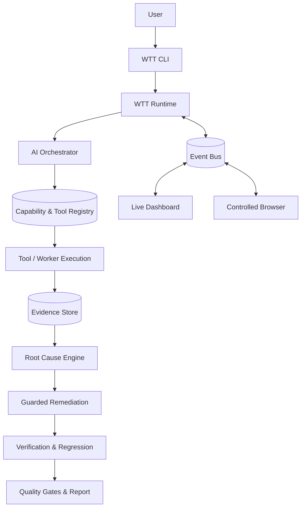
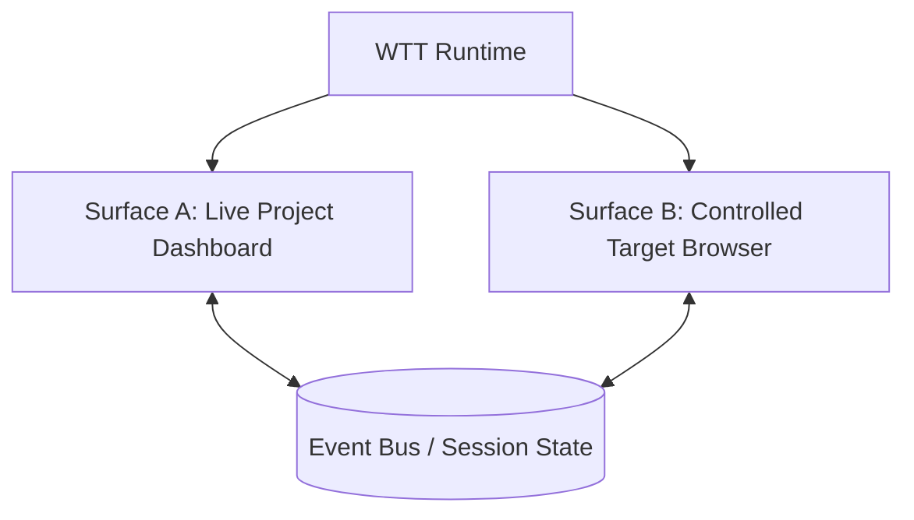
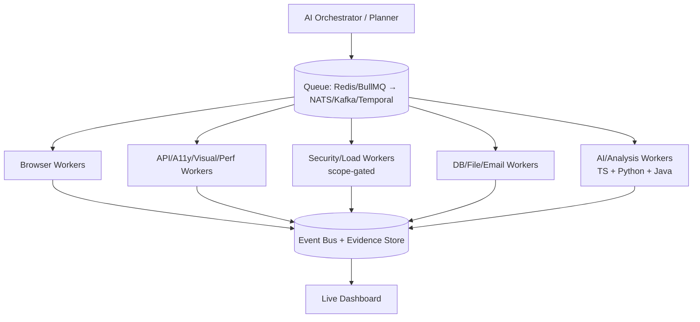
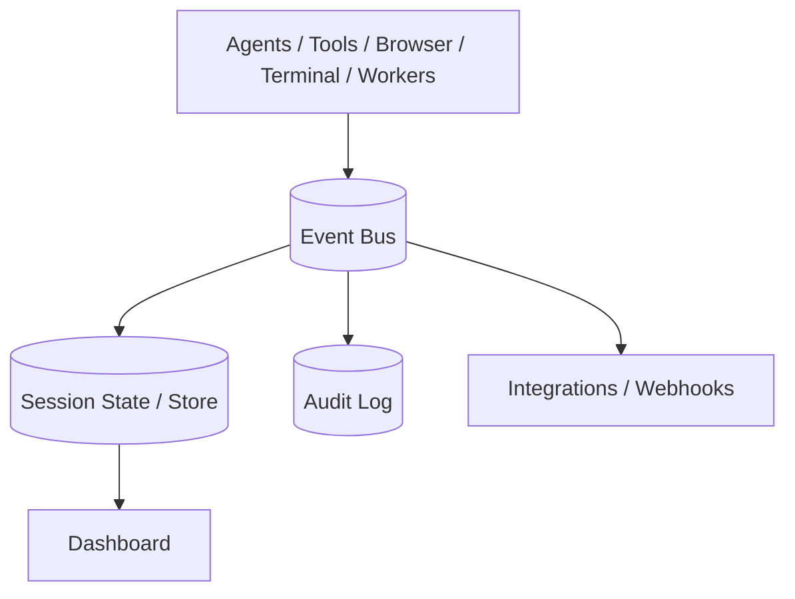
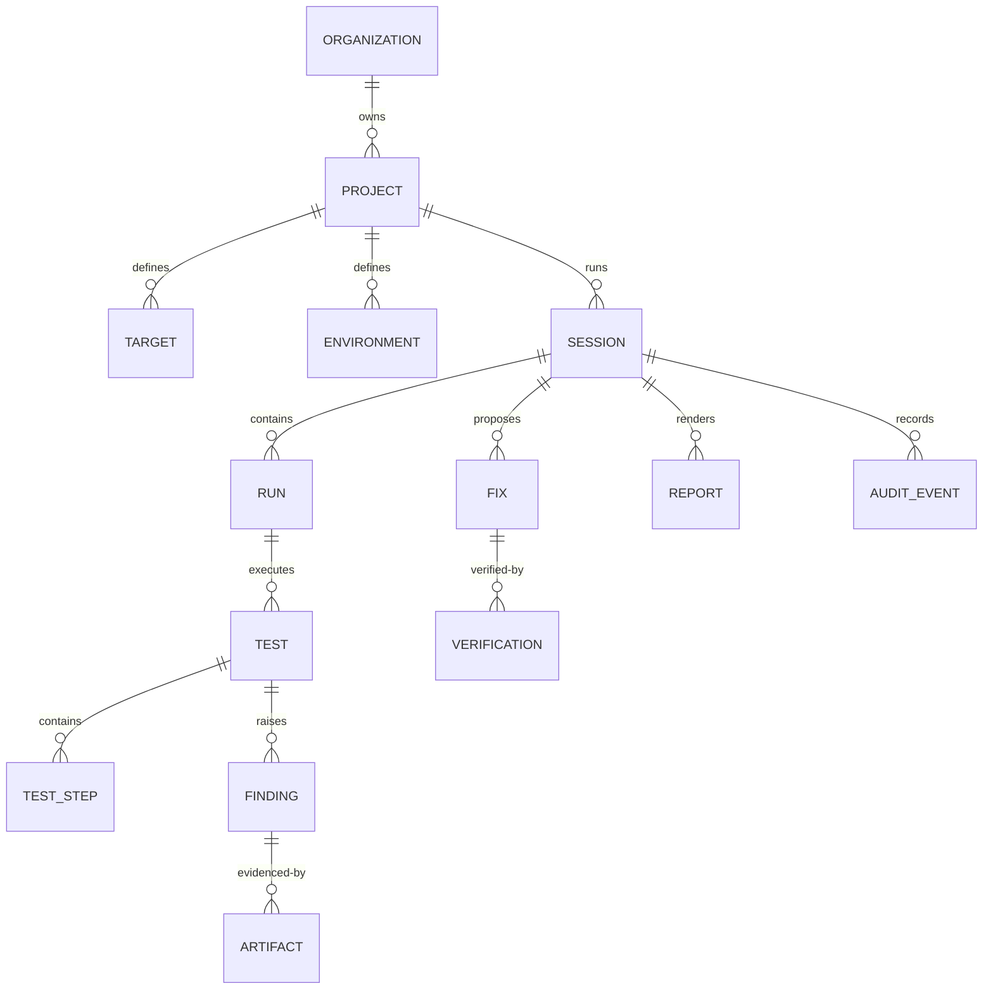
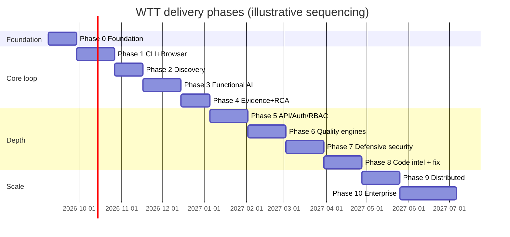
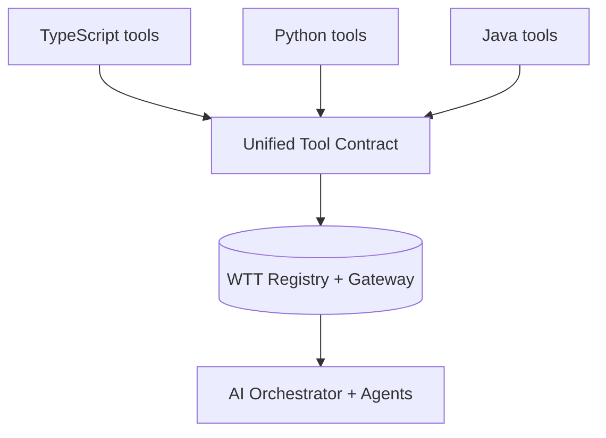

# WTT — Website Testing Tool
## Product Requirements Document

| Field | Value |
|---|---|
| Document Status | **Canonical — Draft for Review** |
| Version | 0.1.0 (Pre-implementation) |
| Last Updated | 2026-09-07 |
| Owners / Stakeholders | _[Product Lead]_ · _[Engineering Lead]_ · _[AI Systems Lead]_ · _[Security Lead]_ · _[QA Platform Lead]_ · _[SRE Lead]_ |
| Product Classification | Enterprise AI-Native Autonomous Website Testing, Engineering, Diagnosis, Remediation, Verification, and Quality Operating System |
| Repository | `rohitsaket/cyber-web-tool` (working title; product name: WTT) |
| Companion Documents (derived from this PRD) | `ARCHITECTURE.md` · `SYSTEM_DESIGN.md` · `SECURITY.md` · `DATABASE.md` · `API_SPEC.md` · `CLI_SPEC.md` · `TOOL_SDK.md` · `AGENTS.md` · `WORKERS.md` · `DASHBOARD_SPEC.md` · `IMPLEMENTATION_PLAN.md` |

> **Reading guide.** This PRD is the canonical product source of truth for WTT. Architecture, ADRs, technical specifications, schemas, API contracts, CLI specifications, UI specifications, agent specifications, tool manifests, worker specifications, implementation phases, epics, stories, acceptance tests, security controls, and deployment plans MUST be derived from it. Where a design choice is not final, it is explicitly labeled **Proposed**, **Recommended**, **Decision Required**, or **Future**. Normative keywords **MUST**, **SHOULD**, **MAY** are used throughout. Stable requirement identifiers (`WTT-<AREA>-<NNN>`) enable traceability.

---

## Table of Contents

1. [Document Control](#1-document-control)
2. [Executive Summary](#2-executive-summary)
3. [Product Vision](#3-product-vision)
4. [Problem Statement](#4-problem-statement)
5. [Product Principles](#5-product-principles)
6. [Goals](#6-goals)
7. [Non-Goals](#7-non-goals)
8. [Personas](#8-personas)
9. [Jobs to Be Done](#9-jobs-to-be-done)
10. [Primary User Experience](#10-primary-user-experience)
11. [CLI Specification](#11-cli-specification)
12. [Target & Environment Model](#12-target--environment-model)
13. [Authorization & Safety Model](#13-authorization--safety-model)
14. [Project / Session Model](#14-project--session-model)
15. [WTT Runtime](#15-wtt-runtime)
16. [Two-Page Browser Experience](#16-two-page-browser-experience)
17. [Live Dashboard](#17-live-dashboard)
18. [AI Orchestration](#18-ai-orchestration)
19. [Agent Architecture](#19-agent-architecture)
20. [AI Provider Abstraction](#20-ai-provider-abstraction)
21. [Tool Registry](#21-tool-registry)
22. [Tool Contract](#22-tool-contract)
23. [Language Selection Policy](#23-language-selection-policy)
24. [Plugin / SDK Model](#24-plugin--sdk-model)
25. [Website Discovery](#25-website-discovery)
26. [Technology Fingerprinting](#26-technology-fingerprinting)
27. [Knowledge Graph](#27-knowledge-graph)
28. [Browser Automation](#28-browser-automation)
29. [DevTools](#29-devtools)
30. [Functional Testing](#30-functional-testing)
31. [Workflow Testing](#31-workflow-testing)
32. [API Testing](#32-api-testing)
33. [Authentication](#33-authentication)
34. [Authorization Testing](#34-authorization-testing)
35. [UI/UX](#35-uiux)
36. [Responsive](#36-responsive)
37. [Visual](#37-visual)
38. [Accessibility](#38-accessibility)
39. [Performance](#39-performance)
40. [Load](#40-load)
41. [Network/DNS/TLS](#41-networkdnstls)
42. [Defensive Security](#42-defensive-security)
43. [Code/Supply Chain Security](#43-codesupply-chain-security)
44. [Database/Data/File/Email](#44-databasedatafileemail)
45. [Code Workspace Intelligence](#45-code-workspace-intelligence)
46. [Root Cause](#46-root-cause)
47. [Change Impact](#47-change-impact)
48. [Intelligent Test Selection](#48-intelligent-test-selection)
49. [AI Test Generation](#49-ai-test-generation)
50. [Auto-Remediation](#50-auto-remediation)
51. [Self-Healing](#51-self-healing)
52. [Flakiness](#52-flakiness)
53. [Distributed Workers](#53-distributed-workers)
54. [Event Architecture](#54-event-architecture)
55. [Evidence & Artifacts](#55-evidence--artifacts)
56. [Finding Model](#56-finding-model)
57. [Reporting](#57-reporting)
58. [Quality Gates](#58-quality-gates)
59. [Observability](#59-observability)
60. [Resource/Cost Management](#60-resourcecost-management)
61. [Terminal Execution](#61-terminal-execution)
62. [Terminal Safety](#62-terminal-safety)
63. [Secrets](#63-secrets)
64. [Security Threat Model](#64-security-threat-model)
65. [Privacy](#65-privacy)
66. [Audit](#66-audit)
67. [Error Handling](#67-error-handling)
68. [Data Model](#68-data-model)
69. [API Requirements](#69-api-requirements)
70. [Integration Requirements](#70-integration-requirements)
71. [Cross-Platform Requirements](#71-cross-platform-requirements)
72. [Non-Functional Requirements](#72-non-functional-requirements)
73. [Deployment Model](#73-deployment-model)
74. [V1 Scope](#74-v1-scope)
75. [Future Scope](#75-future-scope)
76. [Delivery Phases](#76-delivery-phases)
77. [Dependencies](#77-dependencies)
78. [Risks](#78-risks)
79. [Assumptions](#79-assumptions)
80. [Open Decisions](#80-open-decisions)
81. [Acceptance Criteria](#81-acceptance-criteria)
82. [Success Metrics](#82-success-metrics)
83. [Definition of Done](#83-definition-of-done)
84. [Appendices](#84-appendices)

---

## 1. Document Control

### 1.1 Purpose

WTT-DOC-001: This PRD **MUST** be the single canonical product source of truth for WTT. All downstream specifications **MUST** trace requirements to PRD identifiers.

WTT-DOC-002: This PRD **MUST** be implementation-grade: sufficiently detailed that a senior engineering organization can derive architecture, ADRs, schemas, contracts, specs, phases, epics, stories, acceptance tests, security controls, and deployment plans without rediscovering product requirements.

WTT-DOC-003: This PRD **MUST NOT** be treated as marketing material. Vague claims without measurable requirements are out of scope.

### 1.2 Conventions

- **MUST / MUST NOT** — normative, blocking for compliance.
- **SHOULD / SHOULD NOT** — strongly recommended; deviation requires documented rationale.
- **MAY** — permitted, optional.
- **Proposed** — recommended but not yet ratified; engineering may refine with an ADR.
- **Recommended** — preferred direction; alternatives require justification.
- **Decision Required** — explicitly unresolved; tracked in §80.
- **Future** — post-V1; architecture MUST NOT preclude it.

### 1.3 Requirement identifiers

WTT-DOC-004: Stable identifiers **MUST** follow the pattern `WTT-<AREA>-<NNN>` (e.g., `WTT-CLI-001`). Identifiers **MUST** be stable across PRD versions; deprecated requirements **MUST** be marked `DEPRECATED` and never reused.

Area codes used in this PRD include (non-exhaustive): `DOC, VIS, PRN, GOAL, NGL, PER, UX, CLI, TGT, AUTHZ, SES, RTE, BRS, DASH, AI, AGT, MOD, TOOL, LANG, SDK, DSC, FPR, GRA, DEV, FN, WF, API, ATHN, ATHZ, UI, RSP, VSL, A11Y, PERF, LOAD, NET, SEC, SSC, DATA, WS, RCA, IMP, SEL, GEN, FIX, HEAL, FLK, WRK, EVT, EVD, FND, REP, GATE, OBS, COST, TERM, TSEC, SCR, THR, PRV, AUD, ERR, DM, APIR, INT, XPLAT, NFR, DEP, V1, FUT, PHZ, DEP2, RSK, ASM, OPN, ACC, MET, DOD`.

### 1.4 Versioning

WTT-DOC-005: The PRD **MUST** be versioned with semantic intent: `MAJOR` = incompatible redefinition of core UX/model; `MINOR` = new capabilities/phases; `PATCH` = clarifications. Every release **MUST** record a changelog entry in Appendix A.

### 1.5 Glossary

WTT-DOC-006: The PRD **MUST** define terms in Appendix B. Implementations **MUST** use glossary terms consistently (Project, Target, Environment, Session, Run, Test, Scenario, Step, Finding, Evidence, Artifact, Tool Execution, Agent Execution, Fix, Verification, Report).

---

## 2. Executive Summary

WTT (Website Testing Tool) is an **enterprise AI-native autonomous website testing, engineering, diagnosis, remediation, verification, and quality operating system**. Its canonical entrypoint is a single command:

```bash
wtt <URL>
```

From that entrypoint, WTT orchestrates a full quality lifecycle: target validation, session creation, runtime startup, controlled-browser launch, live dashboard, application discovery, technology fingerprinting, dynamic tool selection, functional/API/UI/accessibility/performance/security testing, evidence capture, finding normalization, root-cause diagnosis, guarded auto-remediation (where permitted), retest and regression, fix verification, quality gating, and final reporting.

WTT is **not** a Playwright wrapper, scanner dashboard, or isolated AI test generator. It is an extensible operating system composed of:

- a **CLI-first runtime** with deterministic session lifecycle;
- a **live project dashboard** synchronized with a **controlled target browser**;
- a central **AI Orchestrator** coordinating permissioned **agents** and **tools**;
- a unified multilingual **Tool Registry** (TypeScript/JavaScript, Python, Java) behind a common contract;
- a **terminal execution engine** with a strict safety system;
- **knowledge graphs**, **evidence integrity**, **finding normalization**, and **root-cause intelligence**;
- **distributed workers**, **event bus**, **quality gates**, and **enterprise reporting**.

V1 proves the core loop — `wtt <URL>` → session → dashboard → browser → discovery → functional AI testing → console/network evidence → findings → basic root cause → report — on the architectural foundations that allow hundreds of later capabilities to plug in without re-platforming.

---

## 3. Product Vision

WTT-VIS-001: WTT **MUST** provide a single-command path from "I have a website URL" to "I have verified, evidence-backed quality answers and — where permitted — verified fixes."

WTT-VIS-002: WTT **MUST** be an operating system for website quality, not a fixed bundle of scanners. New tools, agents, browsers, models, workers, integrations, and policies **MUST** be pluggable without redesigning the core.

WTT-VIS-003: WTT **MUST** unify the two worlds engineers actually debug in — the **browser** (what the user sees) and the **terminal/workspace** (where the system runs) — into one orchestrated, observable session.

WTT-VIS-004: WTT **MUST** replace manual coordination labor (launching scanners, merging findings, correlating console/network/API evidence, rerunning tools after fixes) with autonomous orchestration under explicit policy and audit.

WTT-VIS-005: WTT **MUST** earn trust through evidence: every claim (finding, root cause, fix, quality verdict) **MUST** be traceable to captured, hashable, replayable evidence.

WTT-VIS-006: WTT **MUST** be safe by default: passive inspection first; active, invasive, destructive, load, and security operations gated by authorization, scope, and explicit policy — especially on production targets.

**Vision narrative (5-year horizon, non-binding):** any developer, QA organization, or AI coding agent can point WTT at an authorized target and receive continuous, cost-aware, self-improving quality operations: discovery, testing, diagnosis, remediation, verification, release evidence, and historical learning — locally, in CI/CD, and at enterprise scale.

---

## 4. Problem Statement

WTT-VIS-010: The PRD **MUST** recognize the following canonical problems:

1. **Fragmented toolchain.** Teams stitch Playwright, Lighthouse, axe, ZAP, k6, API clients, log viewers, and dashboards manually. Each tool has its own output, severity scale, and evidence format. Correlation is human labor.
2. **Shallow automation.** Conventional frameworks execute pre-scripted steps but do not discover the application, infer workflows, select appropriate tools, diagnose root cause, or verify fixes.
3. **Evidence scattering.** Console errors, network failures, API payloads, screenshots, traces, logs, and code context live in different places. Root cause requires manual joins.
4. **Fix–retest gap.** After a fix, teams manually decide what to rerun. Regression selection is ad hoc; verification is inconsistent.
5. **Unsafe AI agency.** Emerging AI test tools grant broad autonomy without permissioned tool gateways, scope controls, audit trails, or rollback — unacceptable for enterprise and production-adjacent use.
6. **Late quality signal.** Quality feedback arrives after merge/release because running the full matrix is expensive and slow. Risk-based, change-aware selection is missing.
7. **No quality OS.** There is no common session model, event bus, tool contract, artifact store, finding model, or quality-gate framework that lets capabilities compose.

WTT-VIS-011: WTT **MUST** address these problems through orchestration, normalization, correlation, guarded remediation, and extensibility — not by re-implementing every specialized tool.

---

## 5. Product Principles

| ID | Principle | Normative statement |
|---|---|---|
| WTT-PRN-001 | Single entrypoint | `wtt <URL>` **MUST** remain the default product experience. All complexity **MUST** be reachable from, and reducible to, this entrypoint. |
| WTT-PRN-002 | Orchestration over bundling | The runtime **MUST** orchestrate agents/tools/workers; it **MUST NOT** hardwire a fixed scan sequence. |
| WTT-PRN-003 | Dynamic capability selection | The AI Orchestrator **MUST** select tools from discovery + fingerprint + objective + risk + authorization, not launch everything blindly. |
| WTT-PRN-004 | Evidence first | No finding, root cause, fix, or verdict without linked evidence. |
| WTT-PRN-005 | Least privilege | Every agent, tool, worker, and terminal command **MUST** operate under explicit permissions, scope, and policy. |
| WTT-PRN-006 | Safety by default | Passive before active; staging before production; read-only before write; checkpoint before patch; verify before close. |
| WTT-PRN-007 | Targeted context | Root cause and fixes **MUST** inspect the minimum necessary code surface, expanding only on evidence. Full-codebase rereads per defect are prohibited as a default strategy. |
| WTT-PRN-008 | Reversibility | Every mutation (patch, test-heal, config change) **MUST** be logged, versioned, confidence-scored, and reversible. |
| WTT-PRN-009 | Untrusted content | All website content (DOM, scripts, console, network, files, third-party data) **MUST** be treated as untrusted data, never as instructions. |
| WTT-PRN-010 | Best-fit engineering | Language, runtime, and infrastructure choices **MUST** follow engineering fit, not category dogma or resume-driven defaults. |
| WTT-PRN-011 | Open core, enterprise-grade | The architecture **MUST** support local single-node use and scale to distributed, multi-tenant enterprise operation. |
| WTT-PRN-012 | Cost-aware autonomy | AI autonomy **MUST** weigh test value against tokens, time, browsers, workers, and storage. |
| WTT-PRN-013 | Composability | Sessions, events, findings, evidence, tools, agents, workers, gates, and reports **MUST** compose via stable contracts. |
| WTT-PRN-014 | Auditability | Every consequential decision **MUST** be reconstructable from the audit log + artifacts. |

---

## 6. Goals

### 6.1 Product goals

| ID | Goal | Traceability |
|---|---|---|
| WTT-GOAL-001 | A developer can run `wtt <URL>` on localhost and watch live, evidence-backed testing in a dashboard + controlled browser with zero manual tool coordination. | → UX, CLI, Runtime, Browser, Dashboard |
| WTT-GOAL-002 | WTT discovers the application (routes, forms, APIs, workflows, tech stack) and builds a canonical Application Map + Knowledge Graph. | → Discovery, Fingerprint, Graph |
| WTT-GOAL-003 | WTT dynamically selects and executes the right functional, API, UI, accessibility, performance, and (scope-gated) security capabilities. | → AI, Tools, Workers |
| WTT-GOAL-004 | WTT captures correlated evidence (screenshots, video, HAR, traces, DOM, console, network, API, logs) for every test and finding. | → Evidence, Events |
| WTT-GOAL-005 | WTT normalizes and deduplicates findings across tools into canonical findings with severity + confidence. | → Finding Model |
| WTT-GOAL-006 | WTT diagnoses evidence-backed root causes using cross-layer correlation + targeted code intelligence. | → Root Cause |
| WTT-GOAL-007 | WTT proposes, checkpoints, applies, retests, verifies, or rolls back minimal patches where permitted (localhost/workspace). | → Auto-Remediation |
| WTT-GOAL-008 | WTT self-heals its own automation (selectors, waits) separately from fixing the application, with full audit. | → Self-Healing |
| WTT-GOAL-009 | WTT produces release verdicts through configurable quality gates and multi-format reports. | → Gates, Reporting |
| WTT-GOAL-010 | WTT scales from a laptop (single node) to distributed workers and CI/CD quality gates without UX breakage. | → Workers, CI/CD |
| WTT-GOAL-011 | WTT operates safely against staging/production with authorization, scope, rate, and audit controls. | → AuthZ, Safety |
| WTT-GOAL-012 | Third parties can extend WTT via a documented Tool SDK + registry in TypeScript, Python, or Java. | → SDK, Registry |

### 6.2 Engineering goals

WTT-GOAL-020: Architecture **MUST** support incremental delivery per §76 without re-platforming.

WTT-GOAL-021: Core contracts (session, event, tool, finding, evidence, artifact) **MUST** be stable before capability breadth.

WTT-GOAL-022: Every phase **MUST** ship with observability, error recovery, and documentation.

---

## 7. Non-Goals

WTT-NGL-001: The following are explicit **non-goals** for the releases scoped in this PRD (see §74–§76 for phasing):

1. Arbitrary unauthorized internet scanning, exploitation, or data exfiltration.
2. Unbounded destructive, stress, or chaos testing without explicit scope + authorization.
3. Automatic real-money purchases, real-user impersonation, or irreversible production writes.
4. Silent system-level modifications outside the session workspace/policy.
5. Replacing every specialized testing product (APM, full Bl-driven BI validation, native E2E device farms) in V1.
6. Native mobile (iOS/Android) and desktop-app testing as a V1 requirement — architecture MUST allow it, not deliver it (see §75), unless explicitly reprioritized by a PRD amendment.
7. Legal/compliance certification (GDPR, SOC 2, ISO, PCI, HIPAA). WTT MAY generate technical evidence; it MUST NOT claim legal compliance.
8. Fully autonomous production code deployment. WTT MAY produce release verdicts; deployment authority remains external unless explicitly configured.

WTT-NGL-002: Non-goals **MUST** be enforced by scope policy, permission classification, and UX (refusals with actionable guidance), not merely documented.

---

## 8. Personas

| ID | Persona | Description | Primary needs |
|---|---|---|---|
| WTT-PER-001 | Individual full-stack developer | Builds + debugs localhost apps daily. | `wtt localhost` → instant discovery, console/network truth, fix + retest. |
| WTT-PER-002 | QA engineer | Validates behavior, regressions, releases. | Workflows, matrices, evidence, reports, gates. |
| WTT-PER-003 | QA automation engineer | Maintains suites, selectors, pipelines. | Stable locators, self-healing, CI integration, flakiness data. |
| WTT-PER-004 | Frontend engineer | Owns UI/responsive/visual/a11y. | DOM/style evidence, visual diffs, a11y findings, viewport matrix. |
| WTT-PER-005 | Backend engineer | Owns APIs, auth, data, contracts. | API discovery, contract diffs, DB correlation, log traces. |
| WTT-PER-006 | DevOps / SRE | Owns environments, performance, reliability. | Perf/load (gated), deploy-gated runs, observability, artifacts. |
| WTT-PER-007 | Security engineer | Owns defensive posture. | Scope-gated security config, SAST/SCA/secrets evidence, audit. |
| WTT-PER-008 | Engineering lead | Owns release readiness. | Quality gates, executive report, risk + coverage. |
| WTT-PER-009 | Product engineering team | Cross-functional delivery team. | Shared sessions, findings triage, fix verification. |
| WTT-PER-010 | Enterprise QA organization | Multi-project, multi-env, governed. | RBAC, orgs, retention, audit, policy, scale. |
| WTT-PER-011 | CI/CD platform (non-human) | Pipeline runner. | Headless, exit codes, JUnit/SARIF, deterministic gates. |
| WTT-PER-012 | AI coding agent (non-human) | Autonomous dev agent invoking WTT. | Machine-readable output, APIs, MCP (Future), stable contracts. |

WTT-PER-020: Personas **MUST** inform UX priority: developer immediacy first, team governance second, enterprise scale third — without breaking earlier tiers.

---

## 9. Jobs to Be Done

WTT-PER-030: WTT **MUST** support at least the following jobs-to-be-done (mapped to primary personas):

1. "When I change code, help me verify localhost still works — show me what broke, why, and whether the fix worked." (001, 004, 005)
2. "When I open a staging URL, map the app and test critical workflows without me scripting everything." (002, 003, 009)
3. "When auth/RBAC changes, prove who can access what across UI + API." (002, 005, 007)
4. "When UI changes, catch responsive/visual/a11y regressions with evidence I can act on." (004, 002)
5. "When APIs change, validate contracts/schemas and backend consistency." (005, 002)
6. "When performance matters, quantify Web Vitals + resource behavior with traces." (006, 004)
7. "When release approaches, give me a defensible READY / CONDITIONALLY READY / NOT READY with evidence." (008, 010)
8. "When CI runs, gate the pipeline deterministically and emit standard artifacts." (011, 006)
9. "When a defect is found in my workspace, propose a minimal, reversible, verified fix." (001, 005)
10. "When tests flake, tell me the flakiness score, likely cause, and recommended action." (003, 002)
11. "When security review is due, run defensive checks within scope and produce auditable evidence." (007, 008)
12. "When I am an AI agent, let me invoke WTT programmatically and consume structured results." (012)

---


## 10. Primary User Experience

### 10.1 Canonical command

WTT-UX-001: `wtt <URL>` **MUST** be the default product experience. The user **MUST NOT** be required to manually launch separate scanners, open testing browsers, start the dashboard, select tools, coordinate agents, merge findings, correlate evidence, or rerun tools after a fix. The WTT runtime performs orchestration.

```bash
wtt http://localhost:5173
wtt http://127.0.0.1:3000
wtt https://staging.example.com
wtt https://authorized.example.com
```

### 10.2 Canonical execution pipeline

WTT-UX-002: The following pipeline **MUST** be treated as a foundational product requirement. Implementations MAY parallelize or short-circuit stages on evidence, but MUST NOT skip validation, session creation, authorization/scope enforcement, evidence capture, or reporting.

```text
wtt <URL>
      ↓
Parse command
      ↓
Normalize target
      ↓
Validate target
      ↓
Determine localhost / LAN / remote
      ↓
Validate authorization/scope
      ↓
Create WTT session
      ↓
Inspect environment
      ↓
Start WTT runtime
      ↓
Start AI orchestrator
      ↓
Start live dashboard
      ↓
Launch controlled browser
      ↓
Open target URL
      ↓
Discover application
      ↓
Fingerprint technology
      ↓
Build application knowledge
      ↓
Determine testing requirements
      ↓
Select appropriate tools
      ↓
Execute tests
      ↓
Stream live evidence
      ↓
Correlate findings
      ↓
Determine root cause
      ↓
Apply guarded remediation when permitted
      ↓
Retest affected flow
      ↓
Run necessary regression
      ↓
Verify fix
      ↓
Calculate quality/release status
      ↓
Generate final report
```

WTT-UX-003: Each stage **MUST** emit lifecycle events (§54), update session state (§14), and remain visible in the dashboard (§17).

WTT-UX-004: First-run immediacy: from command to first visible browser action on a warm machine against localhost, WTT **SHOULD** target a p50 of < 60s (Proposed target; see §82). Cold installs (browser/tool download) are excluded but MUST show deterministic progress.

### 10.3 Product modes

WTT-UX-010: WTT **MUST** support the following orthogonal mode dimensions (composable via CLI/config):

| Dimension | Modes | Requirement |
|---|---|---|
| Target locality | Localhost / LAN / Remote Authorized | Localhost MAY enable workspace capabilities (§45, §50); remote MUST enforce §13. |
| Browser visibility | Headed / Headless | Headed MUST show interactions; headless MUST be default for CI/workers and MUST preserve evidence parity except visible windows. |
| Autonomy | Interactive / Autonomous / Hybrid | Interactive MUST allow user intervention (pause, approve, drive); Autonomous MUST act within policy without prompts; Hybrid (default where sensible) MUST blend both with clear handoff UX. |
| Depth | Quick / Standard / Deep / Full | Depth profiles MUST bound tools, crawl budget, and AI spend (§60). |

WTT-UX-011: **Localhost Mode** (`http://localhost:*`, `http://127.0.0.1:*`, `http://[::1]:*`, LAN equivalents where configured) MAY include: source-code inspection, Git inspection, build execution, unit testing, backend testing, database correlation, local logs, process management, auto-remediation, code patches, retesting — each gated by workspace trust + policy (§13, §62).

WTT-UX-012: **Remote Authorized URL Mode** (`https://staging.company.com`, etc.) MUST derive capabilities from authorization + scope. WTT MUST never assume ownership of arbitrary public targets. Active/invasive/destructive/stress/security/mutation operations MUST require appropriate authorization/scope and MUST be denied or downgraded otherwise, with actionable messaging.

WTT-UX-013: Mode selection MUST be explicit in session metadata, dashboard header, CLI output, and reports.

### 10.4 Cross-cutting UX guarantees

WTT-UX-020: Interruption (Ctrl+C, window close, crash) MUST trigger graceful shutdown: persist state, flush evidence, mark session `CANCELLED`/`FAILED`, and enable `wtt resume` where safe (§11, §67).

WTT-UX-021: Every autonomous action with side effects MUST be previewable in dry-run/plan form (`--plan`, `--dry-run`) before execution.

WTT-UX-022: The user MUST always be able to answer: *What is WTT doing? Why? Under what authorization? With what evidence? How do I stop/approve/replay it?*

---

## 11. CLI Specification

### 11.1 Command architecture (forward-compatible)

WTT-CLI-001: The CLI **MUST** implement `wtt <URL>` as primary, plus a stable, forward-compatible surface including at minimum:

```bash
wtt <URL>

wtt init

wtt test <URL>

wtt --headed <URL>
wtt --headless <URL>

wtt --quick <URL>
wtt --standard <URL>
wtt --deep <URL>
wtt --full <URL>

wtt --functional <URL>
wtt --ui <URL>
wtt --api <URL>
wtt --accessibility <URL>
wtt --performance <URL>
wtt --security <URL>
wtt --seo <URL>

wtt resume <session>
wtt stop <session>
wtt status <session>

wtt report <session>

wtt sessions
wtt projects

wtt tools
wtt tools list
wtt tools info <tool>
wtt tools doctor
wtt tools install
wtt tools update

wtt config
wtt doctor
wtt version
wtt help
```

WTT-CLI-002: `wtt init` MUST scaffold project configuration (target defaults, scope, auth profiles, quality gates, artifact/retention policy) non-destructively.

WTT-CLI-003: `wtt test <URL>` MUST be equivalent to `wtt <URL>` with explicit verb for scripting clarity.

WTT-CLI-004: Capability flags (`--functional`, `--ui`, `--api`, `--accessibility`, `--performance`, `--security`, `--seo`, …) MUST act as *intent hints* constraining the planner, not as raw tool switches. The orchestrator MUST still apply discovery + authorization gating and MUST explain deselected tools in `--verbose` / plan output.

WTT-CLI-005: Depth flags (`--quick`, `--standard`, `--deep`, `--full`) MUST map to documented budget profiles (§60). Default: `--standard` (Proposed).

WTT-CLI-006: Session commands (`resume`, `stop`, `status`, `report`, `sessions`, `projects`) MUST operate on stable session/project IDs and MUST support `--json` / `--format` for machine consumption.

WTT-CLI-007: Tool commands MUST reflect the Tool Registry (§21): `list` (filterable), `info` (manifest + health + requirements), `doctor` (availability + deps), `install`/`update` (policy-gated, offline-aware).

WTT-CLI-008: `wtt config` MUST support `get/set/list/validate/path` semantics (Proposed) and MUST never print secret values (references only).

WTT-CLI-009: `wtt doctor` MUST validate: Node/Python/Java runtimes, browser binaries, PostgreSQL/Redis reachability, disk space, network egress to target + model providers, tool health, and scope/authorization files — with remediation hints and exit codes.

### 11.2 Ergonomics and parsing

WTT-CLI-020: Argument parsing MUST be deterministic, POSIX-friendly, and documented: long/short flags, `--flag=value` and `--flag value`, repeatable flags, `--no-<flag>` negation, `--` separator, single-URL positional with validation errors suggesting fixes.

WTT-CLI-021: Unknown flags MUST fail fast with "did you mean" suggestions and exit code 2 (unless `--strict-unknown=false` in non-strict scripting compat — Decision Required).

WTT-CLI-022: Interactive prompts MUST be skippable via flags/env/CI auto-detect; prompts MUST have non-interactive safe defaults (deny-by-default for side effects).

### 11.3 Configuration precedence

WTT-CLI-030: Configuration precedence MUST be (highest first):

```text
explicit CLI flags
  > environment variables (WTT_*)
  > project config file (./wtt.config.* / .wtt/*)
  > user config (~/.wtt/*)
  > built-in defaults
```

WTT-CLI-031: Every effective setting MUST be explainable via `wtt config --explain <key>` (Proposed) showing source + value (redacted for secrets).

WTT-CLI-032: Config files MUST support JSON/YAML (TOML MAY). Schemas MUST be versioned; unknown keys MUST warn, not silently ignore.

WTT-CLI-033: Environment variables MUST use the `WTT_` prefix (e.g., `WTT_HEADLESS=1`, `WTT_AI_PROVIDER=openai`, `WTT_SCOPE_FILE=./wtt.scope.yaml`). Secret values MUST be references (`vault:`, `env:`, `file:`) rather than inline where feasible (§63).

### 11.4 Output, logging, exit codes

WTT-CLI-040: Human-readable output MUST be concise by default, information-dense in `--verbose`, and diagnostic in `--debug`. `--quiet` MUST print only essential status + final verdict/path. `--no-color` / `NO_COLOR` MUST disable ANSI. `--json` / `--format json|yaml|junit|sarif` MUST emit machine-readable results to stdout with logs on stderr.

WTT-CLI-041: Exit codes MUST be stable and documented (Proposed):

| Code | Meaning |
|---|---|
| 0 | Success; quality verdict READY (or run completed when gates disabled) |
| 1 | Completed with verdict CONDITIONALLY READY or NOT READY (gates failed) |
| 2 | Usage/config/target/scope error (no run started or safely aborted pre-test) |
| 3 | Authorization/scope denial |
| 4 | Infrastructure failure (DB/queue/browser/AI unavailable) |
| 5 | Interrupted by user (SIGINT/SIGTERM, stop) |
| 6 | Internal error / crash (with recovery pointer) |

WTT-CLI-042: `--ci` MUST imply `--headless`, `--no-prompt`, structured logs, deterministic ordering where feasible, and artifact paths printed for upload.

WTT-CLI-043: Logs MUST be structured (JSON Lines file + human console), correlated by `session_id`/`run_id`/`trace_id`, and MUST include: CLI invocation (redacted), config sources, planner decisions, tool invocations, approvals/denials, retries, and verdict computation inputs.

### 11.5 Lifecycle: interrupts, shutdown, resumability

WTT-CLI-050: `Ctrl+C` (SIGINT) first press MUST initiate graceful shutdown (stop scheduling, drain with timeout, persist, flush evidence); second press MUST force-abort with best-effort persistence. SIGTERM MUST behave like first-press SIGINT.

WTT-CLI-051: `wtt resume <session>` MUST restore `PAUSED`/`CANCELLED`/`FAILED`-recoverable sessions from persisted checkpoints; unresumable states MUST explain why and offer `wtt report` / fresh-run guidance.

WTT-CLI-052: Crash recovery MUST be automatic on next CLI invocation touching the session: detect stale locks, mark interrupted executions, salvage artifacts, and offer resume/report.

---

## 12. Target & Environment Model

### 12.1 Target definition

WTT-TGT-001: A **Target** MUST be a normalized URL plus environment + scope context. Normalization MUST include: scheme defaulting (`http` for localhost, `https` otherwise unless explicit), host lowercasing, default-port elision, trailing-slash policy, IDNA handling, and canonical string form stored on the session.

WTT-TGT-002: The **Target URL Validator** MUST reject: missing host, unsupported schemes, credentials in URL (unless explicitly via auth profile), unresolved hosts (with DNS detail), and unreachable ports (with TCP/TLS diagnostics) — each with actionable errors.

WTT-TGT-003: Detectors MUST classify every target as: **Localhost** (`localhost`, loopback IPv4/IPv6), **LAN** (RFC 1918 / link-local / configured private CIDRs), **Remote** (public). Heuristics MUST further label **Staging-like** vs **Production-like** (host tokens, headers, config, explicit `--env`) but MUST treat labels as advisory unless configured: explicit `--env production` or environment registry entry wins.

WTT-TGT-004: Redirects MUST be followed transparently up to a capped hop count (Proposed default: 5), with final-URL vs original-URL recorded; cross-origin redirects that escape scope MUST pause active testing and require re-authorization.

### 12.2 Environment model

WTT-TGT-010: An **Environment** MUST capture: `name` (local/dev/staging/prod/…), `target URL`, `network locality`, `deployment metadata` (where known), `credentials profile reference`, `scope profile`, `policy profile`, and `data-classification` (synthetic/staging-safe/production-sensitive).

WTT-TGT-011: `wtt init` and `wtt config` MUST make environment declaration trivial; `wtt <URL>` MUST infer a transient environment when none exists and MUST persist it to the session.

WTT-TGT-012: Production environments MUST default to restrictive policies: no active security testing, no load/stress, no destructive writes, no auto-remediation of remote state, and heightened approval + audit. Relaxation MUST require explicit, auditable policy change (§13).

---

## 13. Authorization & Safety Model

### 13.1 Registries and boundaries

WTT-AUTHZ-001: WTT **MUST** implement: **Domain Ownership Registry**, **Authorization Registry**, **Scope Validator**, **Allowed Domains**, **Denied Domains**, and **Test Boundary** as first-class concepts, persisted per project/environment and referenced by every session.

WTT-AUTHZ-002: Scope definition MUST support: exact hosts, wildcards, CIDRs, URL prefixes, port constraints, environment constraints, time windows, and excluded paths/data. Deny MUST override allow. Absence of authorization MUST default-deny gated operations.

WTT-AUTHZ-003: Scope files MUST be versioned, reviewable (`wtt config validate`), and attributable (who/when/why). CI MUST be able to verify scope without running tests.

### 13.2 Operation classification

WTT-AUTHZ-010: Testing operations MUST be classified (minimum taxonomy):

```text
PASSIVE_INSPECTION      crawl rendering, DOM/console/network observation, fingerprinting
FUNCTIONAL_NORMAL       normal user-equivalent interactions (navigate, fill, submit test data)
SAFE_WRITE              writes to synthetic/test fixtures, sandboxed tenants, reversible test data
PROJECT_MODIFICATION    local workspace/code/config changes (checkpointed, reversible)
ACTIVE_SECURITY         probing, fuzzing, scanner payloads, auth bypass attempts
LOAD_STRESS             load, stress, spike, soak beyond smoke thresholds
DESTRUCTIVE             deletion, data destruction, irreversible state change, infra mutation
SYSTEM_CHANGE           host/container/cluster/cloud/network/system configuration change
BLOCKED                 categorically prohibited (e.g., non-scope targets, prod destructive)
```

WTT-AUTHZ-011: Each tool capability + terminal command class MUST declare its classification; the gateway MUST enforce `classification × target × scope × environment × policy → allow | approve | deny`.

WTT-AUTHZ-012: Production targets MUST deny `ACTIVE_SECURITY`, `LOAD_STRESS` (beyond passive/smoke), `DESTRUCTIVE`, and `SYSTEM_CHANGE` by default. Staging MUST require explicit scope for the same. Localhost MUST still require workspace trust for `PROJECT_MODIFICATION`.

WTT-AUTHZ-013: Every allow/approve/deny decision MUST be logged with: principal, target, classification, scope rule matched, policy version, and evidence pointer.

### 13.3 Approvals

WTT-AUTHZ-020: Policies MUST support: `auto-allow`, `require-approval` (interactive/ChatOps/ticket — Proposed), `deny`, per classification × environment, with break-glass override that is always audited and optionally time-boxed.

WTT-AUTHZ-021: In headless/CI, `require-approval` MUST fail closed (deny + actionable message) unless a pre-approval token/scope grant is present.

---

## 14. Project / Session Model

### 14.1 Core entities

WTT-SES-001: The following terms MUST have exactly one meaning across CLI, API, dashboard, DB, and docs (see Appendix B for full definitions):

| Entity | Definition |
|---|---|
| Project | Durable container for targets, environments, scope, policy, and session history (e.g., "checkout-webapp"). |
| Target | Normalized URL + environment + scope context under test. |
| Environment | Named deployment context (local/staging/prod) with credentials/scope/policy references. |
| Session | One `wtt <URL>` invocation lifecycle: `WTT-YYYYMMDD-NNNNNN` (unique, sortable). Holds config, scope, agents, tools, tests, findings, artifacts, fixes, verification, verdict, report. |
| Run | An execution pass within a session (initial + reruns/regressions share session lineage). |
| Test | An executable check with steps, assertions, and evidence linkage. |
| Scenario | A goal-oriented sequence (often a workflow) composed of tests/steps. |
| Step | Atomic action + assertion unit within a test. |
| Finding | A normalized, deduplicated, severity/confidence-scored quality observation. |
| Evidence | Raw correlated observations (console, network, DOM, payloads, logs). |
| Artifact | Persisted file object (screenshot, video, HAR, trace, report, patch). |
| Tool Execution | One tool invocation with inputs, outputs, status, cost, evidence. |
| Agent Execution | One agent task lifecycle with inputs, plan, tool calls, outputs. |
| Fix | A proposed/applied/verified/rolled-back remediation with diff + audit. |
| Verification | A retest/regression pass proving (or refuting) a fix. |
| Report | A rendered quality verdict + findings + evidence index in a given format. |

WTT-SES-002: Each `wtt <URL>` MUST create a uniquely identifiable session (default format `WTT-YYYYMMDD-NNNNNN`; uniqueness MUST hold across restarts and concurrent CLIs).

WTT-SES-003: A session MUST retain: session ID, project, target, environment, start/end, configuration (resolved + sources), scope, authorization, AI configuration, selected tools, agents, workers, browser sessions, tests, findings, artifacts, fixes, verification, quality score, and report pointers.

### 14.2 Lifecycle

WTT-SES-010: Session lifecycle states MUST be deterministic and dashboard-visible:

```text
CREATED → INITIALIZING → DISCOVERING → PLANNING → TESTING
  → ANALYZING → REMEDIATING → VERIFYING → REPORTING → COMPLETED
  ↘ FAILED / CANCELLED / PAUSED (from any active state; resumable where defined)
```

WTT-SES-011: Transitions MUST be event-sourced (§54): every transition emits `session.state_changed` with `from/to/reason/actor`. Illegal transitions MUST be rejected and logged.

WTT-SES-012: `PAUSED` MUST freeze scheduling while preserving browser/worker leases within timeout; `CANCELLED` MUST release resources promptly; `FAILED` MUST preserve partial evidence and enable targeted resume.

### 14.3 Identity, concurrency, retention

WTT-SES-020: IDs MUST be prefixed, sortable, and collision-free (`ses_`, `run_`, `tst_`, `fnd_`, `art_`, `fix_`, `ver_`, … — Proposed; finalized in `DATABASE.md`).

WTT-SES-021: Concurrent sessions against the same project/environment MUST be supported with resource quotas and must not corrupt shared state (leases, idempotency keys).

WTT-SES-022: Retention MUST be policy-driven (per project/environment/data-class): session metadata, evidence, artifacts, videos/traces, and reports each with TTL + archival rules (§55).

---

## 15. WTT Runtime

WTT-RTE-001: The WTT runtime **MUST** be the supervised process tree that owns: CLI lifecycle, session state, event bus, AI Orchestrator, browser pool, tool gateway, terminal gateway, worker clients, artifact store, and dashboard server. Users MUST NOT manually start its parts.

WTT-RTE-002: Startup sequence MUST be: parse → normalize/validate target → classify locality → enforce scope precheck → create session → inspect environment (runtimes, browsers, DB/queue, disk, providers) → start runtime services → start orchestrator → start dashboard → launch controlled browser → open target → begin discovery.

WTT-RTE-003: The runtime MUST expose health (`/healthz`, `/readyz` — Proposed), metrics, and structured logs; degraded dependencies MUST produce explicit degraded-mode behavior (e.g., AI unavailable → deterministic planner fallback where feasible, clearly labeled).

WTT-RTE-004: Shutdown MUST be ordered: stop scheduling → cancel with timeout → flush events/evidence → snapshot session → release browsers/workers → stop servers → print resume/report pointers.

WTT-RTE-005: The runtime MUST support single-node (default) and distributed прикрепление to external queue/workers (§53) via configuration only — no code changes.

Main WTT runtime diagram:




## 16. Two-Page Browser Experience

WTT-BRS-001: On successful start, WTT **MUST** automatically open two primary browser surfaces and keep them synchronized through the event system. Users MUST NOT have to discover ports, tokens, or URLs manually (printed + auto-opened, with `--no-open` override).



### 16.1 Surface A — WTT Live Project Dashboard

WTT-BRS-010: The dashboard is the command center. It **MUST** display the active session in real time, including at minimum:

```text
Project / Session / Target / Environment
Runtime mode / Browser / AI provider+model
Testing phase / Elapsed time / Overall progress

Pages discovered / Pages tested
Routes discovered / APIs discovered / Workflows discovered

Tests queued / running / passed / failed / skipped

Console errors / Network errors / API failures
UI defects / Visual defects / Accessibility findings
Performance findings / Security findings / SEO findings / Reliability findings

Agents active / Tools active / Workers active

Root-cause investigations / Proposed fixes / Applied fixes
Verified fixes / Rolled-back fixes

Screenshots / Videos / HAR / Traces / Logs
DOM snapshots / Network evidence / Reports
```

WTT-BRS-011: The dashboard MUST expose live streams for: AI activity, agent activity, tool activity, worker activity, terminal activity, browser activity, console, network, API, logs, screenshots, video, traces, findings, root-cause analysis, fixes, verification.

### 16.2 Surface B — Target Website (controlled browser)

WTT-BRS-020: Surface B MUST be a real browser session controlled by WTT opening the target URL (e.g., `http://localhost:5173`). The user MUST be able to visually observe the AI interacting with the website in headed mode.

WTT-BRS-021: The target browser MUST support (via engine + DevTools + WTT action layer):

```text
navigation, click, double-click, right-click, hover, typing, form fill, clear,
select, check/uncheck, drag/drop, keyboard, mouse, touch, scrolling,
upload, download, popups, dialogs, new tabs, multiple windows, iframes,
Shadow DOM, Web Components, authentication, cookies, storage, permissions,
responsive viewports, device emulation, network inspection, console inspection,
screenshots, video, traces, HAR, DOM inspection, accessibility tree
```

WTT-BRS-022: Target-browser actions MUST be attributable (agent/tool/step), replayable from events, and pausable in Interactive mode. Destructive/sensitive actions MUST respect §13 and require approval where policy dictates.

WTT-BRS-023: The dashboard and controlled browser MUST remain synchronized: selecting a test/step/finding in the dashboard MUST surface corresponding browser evidence (screenshot, DOM node, network request, console entry), and vice versa where feasible.

---

## 17. Live Dashboard

WTT-DASH-001: The dashboard **MUST** be a professional engineering interface prioritizing information density, real-time observability, clear severity, clear run state, actionability, and evidence accessibility. Decorative dashboards with little operational value are unacceptable.

### 17.1 Information architecture

WTT-DASH-010: The dashboard MUST provide at least these areas (tabs/views; exact nav finalized in `DASHBOARD_SPEC.md`):

```text
Overview / Live Run / Discovery / Tests / Browser / Network / Console /
API / Accessibility / Visual / Performance / Security / Database / Logs /
AI Agents / Tools / Workers / Findings / Fixes / Artifacts / Reports / Settings
```

WTT-DASH-011: Each area MUST define: purpose, primary table/stream, filters, detail drawer, evidence links, and available actions (pause/resume, approve/deny, rerun, export, copy-repro).

### 17.2 Realtime requirements

WTT-DASH-020: All live views MUST consume the event bus (§54) via WebSocket/SSE with reconnect + backfill (no polling as primary). Stale-disconnect MUST be visibly indicated with resync.

WTT-DASH-021: The dashboard MUST render: run timeline, agent/tool/worker activity, terminal stream (redacted), browser action feed with screenshots, console/network/API explorers, finding inbox with triage, fix pipeline with diffs, artifact gallery, and verdict/gate panel.

WTT-DASH-022: Deep links MUST exist for session/run/test/step/finding/artifact/fix/verification/report so any CLI/API output can link into the UI.

### 17.3 Actions and safety

WTT-DASH-030: Dashboard actions MUST honor the same permission gateway as agents: pause/resume, approve/deny gated operations, stop, rerun test/scope, accept/reject proposed fix, rollback applied fix, export report, and manage scope/policy (RBAC-gated in enterprise).

WTT-DASH-031: Dangerous actions MUST require explicit confirmation showing blast radius (target, env, classification, scope rule) and MUST be audited.

---

## 18. AI Orchestration

WTT-AI-001: WTT MUST be built around a central **AI Orchestrator** that coordinates specialized agents and tools. The orchestrator MUST NOT itself implement every capability (browser driving, scanning, DB access); it plans, delegates, constrains, correlates, and decides through the permissioned tool gateway.

WTT-AI-002: The orchestrator MUST implement the closed loop: `observe (events+state) → plan → delegate → constrain → execute → correlate → diagnose → remediate (gated) → verify → gate → report`, with explicit replan triggers (new discovery, failures, approvals, timeouts, budget pressure).

WTT-AI-003: The orchestrator MUST produce an inspectable **Execution Plan**: objectives, selected capabilities with rationale, excluded capabilities with rationale, budgets, parallelism, dependencies, approval points, and verification strategy. `--plan`/`--dry-run` MUST print it without side effects.

WTT-AI-004: The orchestrator MUST enforce dynamic tool selection (§21 planning model): Target → Discovery → Fingerprint → Capabilities → Objective → Risk → Authorization → Requirements → Candidates → Availability → Cost → Selection → Execution Plan.

WTT-AI-005: The orchestrator MUST be deterministic-degradable: if the AI provider is unavailable, WTT MUST fall back to a rules-based planner for core discovery + smoke + evidence (clearly labeled "degraded / non-AI"), never silently pretending AI ran.

WTT-AI-006: Orchestrator decisions (tool selection, test selection, fix approval routing, gate inputs) MUST be logged with inputs, rationale summary, model + tokens/cost, and policy checks — sufficient for audit and replay.

WTT-AI-007: The orchestrator MUST respect budgets (§60): per-session token/cost caps, per-tool timeouts, crawl/action budgets, and worker quotas; approaching caps MUST trigger prioritization, not silent overrun.

---

## 19. Agent Architecture

### 19.1 Agent roster (extensible)

WTT-AGT-001: WTT MUST support specialized agents behind a common lifecycle. The initial roster (Proposed; each a separate specification in `AGENTS.md`) includes:

```text
Target Agent / Discovery Agent / Browser Agent / Functional Agent /
Workflow Agent / API Agent / Authentication Agent / Authorization Agent /
Accessibility Agent / Visual Agent / Performance Agent / Security Agent /
Network Agent / Database Agent / Log Agent / Code Intelligence Agent /
Root Cause Agent / Fix Agent / Verification Agent / Regression Agent /
Reporting Agent / Release Agent
```

WTT-AGT-002: Agents MUST NOT be unrestricted autonomous processes. They MUST operate exclusively through the permissioned tool gateway with declared permissions, and MUST NOT call models, shells, browsers, or networks directly except via granted capabilities.

### 19.2 Agent contract

WTT-AGT-010: Every agent MUST define: responsibilities, inputs, outputs, permissions, lifecycle (`created→ready→running→awaiting→completed/failed/cancelled`), context/memory scope, communication (events + blackboard), cancellation, retry, timeout, failure handling, and observability.

WTT-AGT-011: Agent inputs MUST be schema-validated; outputs MUST be schema-validated findings/plans/patches/verdicts with evidence links and confidence. Invalid I/O MUST fail the execution with diagnostics, not propagate silently.

WTT-AGT-012: Agent context MUST be least-privilege: session summary + task slice + granted evidence pointers — never full secret stores, unrelated sessions, or unbounded history. Long memory MUST be explicit (graph/store-backed) with retention policy.

WTT-AGT-013: Agent communication MUST be event-first (§54) plus a session-scoped blackboard for shared artifacts (application map, auth state, matrices). Direct agent-to-agent RPC is prohibited except via orchestrator-mediated handoff (Proposed).

WTT-AGT-014: Cancellation MUST be cooperative + preemptive: cancel token, tool-cancel propagation, browser/terminal abort, partial-evidence salvage, and `agent.cancelled` event with reason.

WTT-AGT-015: Retry/timeout MUST be policy-driven per agent+tool: bounded attempts, backoff/jitter, idempotency keys, and escalation to orchestrator on exhaustion. Infinite retry is prohibited.

WTT-AGT-016: Failure handling MUST classify: retriable infra, tool bug, auth/scope denial, target fault, flaky automation, AI error — each with prescribed next action (retry, heal, replan, quarantine, escalate, abort-scope).

WTT-AGT-017: Observability MUST include per-agent: state, current plan step, tool calls, tokens/cost, duration, evidence produced, and decision log — all dashboard-visible.

### 19.3 Authority boundaries

WTT-AGT-020: Only the orchestrator (under policy) MAY: approve gated classifications, apply workspace patches, trigger load/security-active work, or finalize verdicts. Agents MUST request, never self-authorize.

WTT-AGT-021: The Fix Agent MUST propose minimal diffs; application of diffs MUST go through the remediation pipeline (§50) with checkpoint + verification + rollback.

---

## 20. AI Provider Abstraction

WTT-MOD-001: WTT MUST NOT be hard-coded to one model provider. A provider abstraction MUST support (non-exhaustive, adapter-based):

```text
OpenAI / Anthropic / Google / Azure-hosted models / AWS Bedrock /
local models / Ollama / OpenAI-compatible endpoints / enterprise models / future providers
```

WTT-MOD-002: Model routing MUST be task-aware (Proposed defaults, configurable):

```text
planning      → reasoning model
coding        → coding model
vision        → multimodal model
classification→ lightweight model
reporting     → general model
```

WTT-MOD-003: The abstraction MUST define: provider registry, model registry, capability detection (reasoning/vision/tool-call/JSON/context), context/token limits, timeouts, fallback chains, retry, cost tracking, latency tracking, and rate-limit handling (429/5xx backoff, quota surfacing, graceful degradation).

WTT-MOD-004: Credentials MUST be secret references (§63), never logged. Requests MUST be redacted for PII/secrets per policy, with per-provider data-policy configuration (retention, zero-retention endpoints where offered).

WTT-MOD-005: Every model call MUST record: provider, model, task type, tokens in/out, latency, cost estimate, retries/fallbacks, and correlation IDs — aggregated per agent/session for §60 and §82.

WTT-MOD-006: Local/offline operation MUST be supportable: deterministic planner + local models where configured; cloud-provider absence MUST NOT brick functional smoke testing (§18 degraded mode).

---

## 21. Tool Registry

WTT-TOOL-001: WTT MUST provide a unified **Capability and Tool Registry**. Tools MUST NOT be hardwired into the AI; the orchestrator discovers capabilities, resolves candidates, and invokes them through the gateway.

WTT-TOOL-002: Capabilities MUST be namespaced (extensible; initial namespaces include):

```text
target.* / authorization.* /
browser.* / devtools.* / crawler.* / discovery.* / technology.* /
ui.* / functional.* / visual.* / accessibility.* /
api.* / graphql.* / grpc.* / soap.* / websocket.* / messaging.* / contract.* / mock.* /
performance.* / load.* / network.* / dns.* / tls.* /
security.* / sast.* / sca.* / secret.* / container.* / iac.* / kubernetes.* /
database.* / data.* / etl.* / bi.* /
email.* / file.* / localization.* /
mobile.* / desktop.* /
git.* / build.* / cicd.* / deployment.* / cloud.* /
logs.* / metrics.* / traces.* / monitoring.* / chaos.* / recovery.* /
ai.* / llm.* / rag.* / agent.* / healing.* / rootcause.* /
test.* / execution.* / worker.* / artifact.* / finding.* / quality.* / release.* /
report.* / dashboard.* / notification.* / integration.* / admin.* / audit.*
```

WTT-TOOL-003: The registry MUST store: manifest (§22), versions, health, availability (installed/missing/unsupported platform), permissions, risk/classification, cost metadata, supported platforms/environments, and ownership/provenance (built-in vs plugin vs third-party).

WTT-TOOL-004: Resolution MUST be multi-factor: capability match → scope/policy eligibility → platform support → health → cost/budget → historical reliability → priority. Ties MUST break deterministically and be explainable in plan output.

WTT-TOOL-005: The registry MUST support versioning, deprecation, aliasing, and side-by-side versions; breaking capability changes MUST require major version + migration note.

---

## 22. Tool Contract

WTT-TOOL-010: Every WTT tool MUST conform to a consistent logical contract regardless of implementation language. Conceptual fields (exact schema finalized in `TOOL_SDK.md`; this PRD defines the required contract, not the final serialization):

```text
tool.id / tool.name / tool.version / tool.description
tool.capabilities
tool.runtime / tool.entrypoint
tool.inputSchema / tool.outputSchema
tool.permissions / tool.riskLevel
tool.timeout / tool.retryPolicy
tool.resourceRequirements
tool.dependencies
tool.healthCheck
tool.execute / tool.cancel
tool.evidenceTypes
tool.costMetadata
tool.supportedPlatforms / tool.supportedEnvironments
```

WTT-TOOL-011: Conceptual manifest example (illustrative, not locked):

```yaml
id: browser.playwright
name: Playwright Browser Engine
version: 1.0.0
capabilities:
  - browser.launch
  - browser.navigate
  - browser.click
  - browser.fill
  - browser.screenshot
  - browser.trace
runtime:
  language: typescript
permissions:
  - network
  - browser
risk:
  level: safe
execution:
  timeout: 300000
  cancellable: true
health:
  supported: true
```

WTT-TOOL-012: Schemas MUST be strongly typed (JSON Schema; OpenAPI/Protobuf where service-based). Inputs/outputs MUST validate at the gateway; schema violations MUST fail fast with diagnostics.

WTT-TOOL-013: Execution MUST be cancellable, timeout-bounded, idempotent-aware, and evidence-emitting. Long-running tools MUST stream progress events + partial artifacts.

WTT-TOOL-014: Tools MUST declare evidence types produced and finding categories emitted; undeclared side effects are prohibited.

WTT-TOOL-015: Provenance (`author`, `source`, `signature` where applicable) MUST be recorded; unsigned/untrusted tools MUST be installable only under explicit policy with warnings (§64).

### Inter-language communication

WTT-TOOL-020: Standard integration MUST be: local subprocess via **stdin/stdout JSON / JSON Lines + structured exit codes**; service processes via **HTTP / WebSocket / gRPC**; distributed workloads via **Redis / NATS / RabbitMQ / Kafka / Temporal** (as configured). Strong schemas REQUIRED (JSON Schema / OpenAPI / Protocol Buffers / gRPC IDL).

---

## 23. Language Selection Policy

WTT-LANG-001: WTT officially supports tool implementation in **TypeScript/JavaScript**, **Python**, and **Java**.

WTT-LANG-002: **Best-fit language selection is mandatory. Do not duplicate every WTT tool in all three languages.** Language MUST be selected per tool according to actual engineering requirements:

```text
runtime environment / browser integration / ecosystem maturity / available libraries /
CPU / memory / concurrency / throughput / startup time / AI-ML requirements /
computer vision / data processing / native integrations / distribution /
operational complexity / maintainability / packaging / deployment
```

WTT-LANG-003: Preferences (not rigid rules): browser/Playwright-facing runtime favors TypeScript; AI/ML/computer-vision analysis favors Python; high-throughput, long-running distributed processing favors Java where justified. A capability MAY combine languages (e.g., AI Browser Testing: TypeScript Playwright runtime + Python vision intelligence + Java distributed heavy execution when required) behind the unified contract.

WTT-LANG-004: Each tool manifest MUST record `runtime.language` + rationale pointer (ADR/notes). Platform support matrices MUST reflect real constraints (e.g., native deps, browser binaries, JVM availability).

WTT-LANG-005: The core control plane baseline is TypeScript/Node (§68 technology baseline, Proposed); Python/Java enter where §23-fit justifies them. Do not force Java/Python microservices where a TypeScript process suffices.

---

## 24. Plugin / SDK Model

WTT-SDK-001: WTT MUST provide Tool Plugin SDKs for TypeScript, Python, and Java (Proposed names: `@wtt/tool-sdk`, `wtt-tool-sdk`, `wtt-tool-sdk-java`).

WTT-SDK-002: Developers MUST be able to scaffold tools via:

```bash
wtt tools create --language typescript
wtt tools create --language python
wtt tools create --language java
```

scaffolding manifest, schemas, handler stubs, tests, Dockerfile/packaging, and docs.

WTT-SDK-003: SDKs MUST provide: tool manifest helpers, schema validation, structured logging, event emission, cancellation, timeout handling, artifact upload, evidence/finding creation, permission declaration, health checks, and a testing harness (unit + contract + gateway-simulated E2E).

WTT-SDK-004: Plugin lifecycle MUST include: install (policy-gated, hash/signature verification where configured), enable/disable, version pin/upgrade, health monitoring, quarantine on failure, and uninstall with artifact retention policy.

WTT-SDK-005: Third-party plugins MUST run under the same gateway permissions as built-ins — no privileged backdoors. Supply-chain controls (§64) apply to all plugins.


## 25. Website Discovery

WTT-DSC-001: WTT MUST implement a comprehensive, JavaScript-aware **Discovery Engine** producing a canonical **Application Map**, not disconnected crawler dumps.

WTT-DSC-002: Discovery MUST cover (where in scope):

```text
recursive crawl / JavaScript-aware crawl / SPA crawl /
sitemap / robots / routes / dynamic routes / client routes / server routes /
links / redirects / pagination / infinite scrolling /
assets / images / scripts / styles / fonts / manifest /
service workers / PWA /
forms / inputs / buttons / interactive elements /
uploads / downloads / iframes / Shadow DOM / Web Components /
third-party integrations / analytics /
APIs / GraphQL / WebSocket / SSE
```

WTT-DSC-003: Engines/adapters MAY include: Playwright, Crawlee, Katana, Puppeteer, Selenium, Scrapy, Cheerio, Beautiful Soup — selected by fit (JS rendering vs raw fetch vs scale). Discovery MUST deduplicate across engines into one map.

WTT-DSC-004: Discovery MUST be budget-bounded (max pages/actions/time per depth profile), politeness-aware (rate limits, robots hints where applicable, scope confinement), and resumable (frontier checkpoints).

WTT-DSC-005: The Application Map MUST record per node: URL/route, page type, forms/inputs, actions, APIs touched, auth requirement, role visibility, tech hints, screenshots, and discovery provenance — and MUST feed planning, test generation, coverage, and change-impact.

---

## 26. Technology Fingerprinting

WTT-FPR-001: WTT MUST fingerprint, where detectable, the application's observable stack:

```text
frontend framework / backend framework / programming language /
CMS / e-commerce engine / web server / reverse proxy / CDN /
database indicators / JS libraries / analytics / tag manager /
payment provider / auth provider / cloud / hosting / WAF / cache /
API gateway / GraphQL / WebSockets / PWA
```

WTT-FPR-002: Adapters MAY include Wappalyzer-style rules, WhatWeb-style probes, HTTP fingerprinting, and a custom WTT fingerprint database. Active probing MUST respect scope/classification (passive header/DOM/JS analysis first).

WTT-FPR-003: Fingerprint results MUST carry confidence + evidence (header, DOM marker, JS global, response pattern) and MUST directly constrain tool selection (e.g., no SOAP/K8s suites when irrelevant).

---

## 27. Knowledge Graph

WTT-GRA-001: WTT MUST maintain structured application knowledge as queryable graphs (logical views; physical store is an architecture decision — Proposed: Postgres + JSONB/graph extension initially, dedicated graph store Future):

```text
Application Graph / Page Graph / Route Graph / Component Graph /
API Graph / Workflow Graph / Role Graph / Permission Graph /
Database Graph / Service Dependency Graph / Third-Party Graph /
Test Coverage Graph / Finding Graph / Risk Graph /
Historical Failure Graph / Change Impact Graph
```

WTT-GRA-002: Graphs MUST power: test generation (what to test), root cause (blast radius + dependency walk), change impact (what changed → what breaks), test selection (what to run), coverage (what is untested), and fix verification (what to retest).

WTT-GRA-003: Graph writes MUST be event-sourced and versioned per session/run; cross-session learning (historical failure graph) MUST be project-scoped with retention policy and MUST NOT leak across tenants.

---

## 28. Browser Automation

WTT-BRW-001: Primary browser engine strategy MUST be **Playwright-first** while keeping the architecture extensible to Selenium, WebdriverIO, Cypress, Puppeteer (adapters). Engine choice MUST be per-capability, not global dogma.

WTT-BRW-002: Browser support MUST include Chromium, Chrome, Edge, Firefox, WebKit (matrix configurable; V1 minimum: Chromium + one additional engine smoke — see §74), plus device emulation (viewport, DPR, touch, geolocation, locale, timezone, color-scheme).

WTT-BRW-003: The browser subsystem MUST implement:

```text
Browser Manager / Browser Pool / Browser Context Manager /
Tab Manager / Page Controller / Action Executor /
Locator Engine / Wait Engine / Retry Engine / Evidence Capture
```

WTT-BRW-004: Locator strategy MUST prefer resilient locators (role/accessible-name/text/test-id) over brittle CSS/XPath; every locator MUST record strategy + fallbacks to enable self-healing (§51).

WTT-BRW-005: Wait/retry MUST be condition-based (load states, network idle where appropriate, element actionability, custom predicates), never fixed sleeps as primary; timeouts MUST be budget-aware and diagnosable.

WTT-BRW-006: Parallelism MUST be pool-managed with quotas (contexts per worker, memory/CPU guards); crashes/hangs MUST be isolated per context with salvage + retry policy.

---

## 29. DevTools

WTT-DEV-001: WTT MUST expose developer-level browser observation via appropriate protocols (Chrome DevTools Protocol; WebDriver BiDi where appropriate; browser-native APIs), abstracted behind `devtools.*` capabilities.

WTT-DEV-002: Capabilities MUST include:

```text
DOM / CSS / computed styles / network / console / exceptions /
CPU / memory / heap / JS coverage / CSS coverage /
request blocking / network throttling / CPU throttling /
cache / storage / cookies / IndexedDB / service workers /
WebSockets / event listeners / layout shifts
```

WTT-DEV-003: Throttling/blocking/emulation MUST be scoped to the test context, clearly labeled in evidence, and auto-reverted after the step/run.

WTT-DEV-004: All DevTools observations MUST be correlatable to session/test/step/URL/timestamp (§55).

---

## 30. Functional Testing

WTT-FN-001: Functional coverage MUST include:

```text
navigation / links / menus / buttons / forms / validation / CRUD /
search / filter / sorting / pagination / infinite scroll /
uploads / downloads / dashboards / charts / tables / data grids /
wizards / steppers / modals / drawers / tooltips / notifications /
keyboard shortcuts / copy-paste / sessions / state persistence /
multi-tab behavior / refresh recovery / deep links
```

WTT-FN-002: Test types MUST include: smoke, sanity, functional, negative, boundary, regression, end-to-end, business-rule, workflow — each with entry/exit criteria and evidence minima defined in test plans.

WTT-FN-003: Every functional test MUST bind: preconditions (auth/role/data), steps (action+assertion), oracles (expected vs actual), evidence attachments, and verdict rationale. Flaky-prone patterns MUST feed the flakiness engine (§52).

---

## 31. Workflow Testing

WTT-WF-001: WTT MUST go beyond random UI actions via **Business Workflow Intelligence**: infer or ingest workflows such as:

```text
Login → Dashboard → Create Customer → Create Order → Approve →
Generate Invoice → Payment → Shipment
```

WTT-WF-002: The system MUST define: workflow discovery (from crawl + API + code + history), workflow modeling (states, transitions, guards, data), workflow dependencies, happy path, negative path, role-dependent path, and recovery path.

WTT-WF-003: Workflow execution MUST support: data setup/teardown (sandboxed), branching assertions, compensation/rollback steps for test data, and cross-role execution matrices.

WTT-WF-004: Critical workflows MUST be coverage-tracked in the Test Coverage Graph and MUST gate release verdicts when configured (§58).

---

## 32. API Testing

WTT-API-001: WTT MUST support REST, GraphQL, gRPC, SOAP, WebSocket, and SSE — each activated only when discovery/fingerprint indicates relevance (or explicit flag/scope).

WTT-API-002: REST capabilities MUST include: GET/POST/PUT/PATCH/DELETE/HEAD/OPTIONS; auth; headers; cookies; payloads; schemas; pagination; filtering; sorting; rate limits; idempotency; retry; error handling — with request/response evidence and schema validation.

WTT-API-003: Adapters MAY include: Postman/Newman, Bruno, Insomnia, REST Assured, SuperTest, Karate, Tavern, Hurl, curl, HTTPie — wrapped behind `api.*` capabilities with normalized results.

WTT-API-004: Contract/schema testing MUST include: OpenAPI, JSON Schema, GraphQL schema, Protobuf, XML Schema — with diffing (OpenAPI Diff), fuzz-conformance (Schemathesis-style), mock-conformance (Prism-style), and validators (Ajv/Pydantic/Zod/Joi as fit). Pact/Spring Cloud Contract/Dredd MAY back consumer-driven flows.

WTT-API-005: Event/messaging testing (when applicable) MUST support: Kafka, RabbitMQ, AMQP, MQTT, NATS, Redis Streams, AWS SQS/SNS, Google Pub/Sub, Azure Service Bus — covering publish/consume, ordering, redelivery, DLQ, and schema-conformance.

WTT-API-006: Mocking/service virtualization MAY use WireMock, MockServer, MSW, Prism, Mountebank, Hoverfly, Mockoon — REQUIRED fault scenarios: server error, timeouts, slow responses, empty/malformed results, rate limits, dependency failure.

---

## 33. Authentication

WTT-ATHN-001: WTT MUST support testing of modern authentication mechanisms where in scope:

```text
login / logout / registration / verification /
password reset / password change / OTP / TOTP / MFA /
passkeys / WebAuthn / SSO / OAuth 2 / OpenID Connect / SAML /
LDAP / Active Directory / social login / magic links /
remember-me / session expiration / refresh tokens / token rotation
```

WTT-ATHN-002: Auth flows MUST be modeled as workflows with: setup (test accounts via secrets §63), execution (UI + API + email/OTP capture), assertions (session/cookie/token/storage state), and teardown (logout, invalidation, data cleanup).

WTT-ATHN-003: Credentials and tokens MUST be handled as secrets end-to-end (injected at runtime, redacted in logs/evidence/reports). Session artifacts MUST be marked sensitive with restricted retention.

---

## 34. Authorization Testing

WTT-ATHZ-001: WTT MUST support authorization models: RBAC, ABAC, ReBAC, PBAC — and levels: object-level, function-level, row-level, column-level, field-level; plus tenant isolation, role hierarchy/inheritance, explicit deny, direct-URL access, API permission, UI permission.

WTT-ATHZ-002: WTT MUST build **permission matrices** (role × resource × action × UI/API affordance) from discovery + config + probing (scope-gated), and MUST flag: hidden-but-reachable endpoints, UI-hidden-but-API-open actions, IDOR/BOLA-shaped gaps (defensive reporting with evidence, no exploitation beyond proof-of-denial/grant within scope), and cross-tenant leakage.

WTT-ATHZ-003: AuthZ probing MUST be strictly scope-gated, rate-limited, and audited; production defaults MUST restrict to read-only permission mapping unless explicitly authorized.

---

## 35. UI/UX

WTT-UI-001: Automated UI/UX validation MUST include:

```text
alignment / spacing / typography / colors / collision / overflow /
z-index / hidden content / broken imagery / missing icons /
empty states / loading states / error states / disabled states /
focus / hover / touch target / readability
```

WTT-UI-002: Detection MUST fuse DOM + computed style + screenshot + AI vision where appropriate; every UI finding MUST attach the minimal visual + structural evidence (cropped screenshot, node path, computed-style diff).

---

## 36. Responsive

WTT-RSP-001: Responsive testing MUST cover the viewport/device matrix (configurable presets):

```text
desktop / laptop / MacBook / tablet / iPad / Android tablet /
iPhone / Android phone / foldables / portrait / landscape /
different DPR / touch
```

WTT-RSP-002: Detection MUST include: horizontal scrolling, overflow, element collisions, text clipping, typography breaks, nav-collapse failures, broken images, responsive-image issues, touch-target violations.

WTT-RSP-003: Results MUST be comparable across viewports (same test, N viewports) with diff-able evidence and viewport-attributed findings.

---

## 37. Visual

WTT-VSL-001: Visual regression MUST support: baseline management (branch/env-aware), pixel diff, structural diff, semantic/AI visual diff, responsive diff, component diff, theme diff.

WTT-VSL-002: Tooling MAY include: Playwright screenshots, pixelmatch, OpenCV, Percy, Applitools, Chromatic, BackstopJS — behind `visual.*` with normalized diff artifacts (baseline, actual, diff, mask, score).

WTT-VSL-003: Baselines MUST be versioned, approvable, and attributable; AI visual verdicts MUST include rationale + region annotations + confidence, never bare pass/fail.

---

## 38. Accessibility

WTT-A11Y-001: Accessibility testing MUST cover: WCAG mapping, ARIA, semantic HTML, accessible names, keyboard operability, focus management, contrast, alt text, landmarks, forms, headings, tables, live regions.

WTT-A11Y-002: Tooling MUST include axe-core class static analysis + browser accessibility-tree inspection; MAY include Pa11y, Lighthouse, Accessibility Insights, WAVE. Assistive-technology integrations (NVDA, JAWS, VoiceOver, TalkBack, Narrator) are Future/enterprise-adjacent and MUST be architecturally pluggable, not V1-required.

WTT-A11Y-003: Findings MUST map to WCAG success criteria with severity + confidence + remediation guidance + evidence (node, tree excerpt, contrast ratio, keyboard trace).

---

## 39. Performance

WTT-PERF-001: Performance testing MUST use where appropriate: Lighthouse, Lighthouse CI, WebPageTest, Sitespeed.io, Web Vitals, Chrome performance APIs — behind `performance.*` with normalized metrics.

WTT-PERF-002: Capture MUST include: LCP, INP, CLS, FCP, TTFB, resource timing, navigation timing, long tasks, layout shifts, long animation frames, JS execution, CPU, memory — with trace + filmstrip/screenshot evidence.

WTT-PERF-003: Budgets MUST be configurable per metric × page-type × environment; violations MUST gate releases when configured and MUST link to contributing requests/scripts.

---

## 40. Load

WTT-LOAD-001: Load/stress tooling MAY include: k6, JMeter, Gatling, Locust, Artillery, Vegeta, wrk/wrk2, hey, autocannon — behind `load.*` with normalized scenarios + reports.

WTT-LOAD-002: Modes MUST include: smoke load, average load, stress, spike, soak, endurance, capacity, volume, concurrency — each with explicit thresholds, ramp profiles, abort conditions, and monitoring hooks.

WTT-LOAD-003: Aggressive load MUST NEVER run against unauthorized targets. Production load beyond passive/smoke MUST be denied by default; staging load MUST require explicit scope + rate caps + monitoring + abort plan. Every load run MUST be audited with target, profile, peak RPS/concurrency, duration, and observed impact.

---

## 41. Network/DNS/TLS

WTT-NET-001: Network diagnostics MAY use: curl, HTTPie, ping, traceroute, mtr, tcpdump/tshark/Wireshark (capture-gated), netcat, iperf — scoped to the target + configured infra.

WTT-NET-002: Proxy/inspection MAY use: mitmproxy, Fiddler, Charles, Proxyman, ZAP/Burp proxy modes — with explicit certificate handling, scope confinement, and sensitive-data redaction.

WTT-NET-003: DNS validation MUST cover: resolution, DNSSEC (where applicable), DNSViz-class checks; TLS validation MUST cover: certificates, chain, expiration, hostnames, TLS versions, cipher configuration, HSTS, OCSP — via OpenSSL/SSLyze/testssl.sh-class adapters.

WTT-NET-004: Findings MUST distinguish configuration weakness vs active vulnerability and MUST link to captured handshakes/records (redacted where sensitive).

---

## 42. Defensive Security

WTT-SEC-001: Active security testing is allowed ONLY against owned or explicitly authorized targets within scope. This is a blocking safety requirement, not a preference.

WTT-SEC-002: Engines MAY include: OWASP ZAP, Burp Suite (where licensed/configured), Nuclei, Wapiti, Nikto, custom WTT scanners — behind `security.*` with safe profiles first.

WTT-SEC-003: WTT MUST implement: scope controls, authorization gates, rate controls, safe profiles, audit logs, and target boundaries. WTT MUST NEVER automatically unleash all scanners; selection MUST be risk + fingerprint + scope-driven with approvals for active classes.

WTT-SEC-004: Session/HTTP security configuration validation MUST cover: cookies, JWT, OAuth, OIDC, SAML, CSRF, CSP, CORS, HSTS, clickjacking, Referrer Policy, Permissions Policy, mixed content, cache security, logout invalidation, token expiration/rotation.

WTT-SEC-005: Security findings MUST include: evidence (request/response, config excerpt), severity (CVSS-style mapping where applicable + WTT confidence), exploitability caveats (defensive wording, no weaponization detail beyond remediation need), and remediation guidance.

---

## 43. Code/Supply Chain Security

WTT-SSC-001: For workspace-available targets, WTT MUST support: SAST, SCA, secret scanning, SBOM, container security, IaC security, Kubernetes security, cloud configuration validation — each as pluggable adapters.

WTT-SSC-002: Integrations MAY include: Semgrep, CodeQL, SonarQube, Bandit, SpotBugs; Snyk, Trivy, Grype, OSV-Scanner; Gitleaks, TruffleHog; Syft, CycloneDX, SPDX; Checkov, tfsec, Terrascan, KICS; kube-bench, Kubescape, Polaris — normalized into canonical findings with file/line/package/image/layer evidence.

WTT-SSC-003: SBOM MUST be generatable (CycloneDX/SPDX) per run where configured; secret findings MUST be redacted-by-default with need-to-know reveal + rotation guidance, never raw secret persistence beyond policy.


## 44. Database/Data/File/Email

### 44.1 Database testing

WTT-DATA-001: Database adapters MUST support (where configured): PostgreSQL, MySQL, MariaDB, SQL Server, Oracle, MongoDB, Redis, Elasticsearch/OpenSearch — via credentialed, scope-gated access only.

WTT-DATA-002: Cross-layer validation MUST support `UI → API → database` equivalence checks (e.g., UI value == API value == database value) with query/payload/screenshot evidence.

WTT-DATA-003: Validation MUST include: schema, migrations, constraints, indexes, foreign keys, query performance (EXPLAIN-class insight), locks/deadlocks, connection pools — read-only by default; writes only to synthetic fixtures under `SAFE_WRITE`.

### 44.2 Data quality

WTT-DATA-010: Data validation MAY integrate: Great Expectations, Soda, dbt, Deequ, Pandera — for pipeline/dataset assertions where the web app surfaces data products.

### 44.3 File testing

WTT-DATA-020: File handling MUST validate: CSV, XLSX, PDF, JSON, XML, YAML, ZIP, images — covering MIME, checksum, encoding, corruption, size limits, and content assertions (parsed + visual where applicable).

### 44.4 Email testing

WTT-DATA-030: Email capture MAY use: Mailpit, MailHog, Mailtrap, smtp4dev, GreenMail. Validation MUST include: delivery, template, HTML + plain-text, links, OTP/verification codes, attachments, SPF/DKIM/DMARC signals (where observable).

### 44.5 Localization (i18n/l10n)

WTT-DATA-040: Localization validation MUST cover: translations, missing translations, RTL layout, Unicode handling, currency/decimal/date/time/timezone/number/address/phone formats, locale fallback, text expansion/truncation — driven by locale matrix config + discovery of locale routes.

---

## 45. Code Workspace Intelligence

WTT-WS-001: For localhost/workspace projects, WTT MAY inspect: Git status, current branch, diff, changed files, routes, components, APIs, services, database code, tests, configuration, ASTs, dependency relationships — strictly within workspace boundaries (§62).

WTT-WS-002: Critical rule: **Do not perform a full-codebase reread for every defect.** WTT MUST use targeted-context analysis:

```text
failure → affected route/page/API → directly connected files →
dependencies required to establish root cause (expand only on evidence)
```

WTT-WS-003: Workspace intelligence MUST power: change impact (§47), test selection (§48), root cause (§46), and minimal patch scoping (§50) — with file/AST evidence links.

WTT-WS-004: Build/code-quality adapters (where configured) MAY include: npm/pnpm/yarn/bun, Maven, Gradle, pip/uv/Poetry; ESLint/Biome/tsc/Prettier; Ruff/Pylint/mypy/Pyright; Checkstyle/PMD/SpotBugs/Error Prone; coverage via Istanbul/c8/Vitest/Jest/coverage.py/pytest-cov/JaCoCo; mutation via Stryker/mutmut/Cosmic Ray/PIT — all as gated `build.*`/`test.*` executions with normalized reports.

---

## 46. Root Cause

WTT-RCA-001: The Root-Cause Engine MUST correlate: browser trace, screenshots, DOM, console, network, API, database, logs, metrics, distributed traces, source code, deployment, and historical failures — into ranked hypotheses, not single-shot guesses.

WTT-RCA-002: Output MUST include: root cause, confidence, supporting evidence, affected component, impact, and recommended fix. The engine MUST differentiate **symptom vs contributing factor vs root cause** explicitly.

WTT-RCA-003: Every hypothesis MUST link to the evidence slice that supports/refutes it; low-confidence conclusions MUST state what additional evidence would resolve them and MUST trigger targeted collection where budget allows.

WTT-RCA-004: Root-cause investigations MUST be dashboard-visible (`rootcause.started/completed`), replayable, and reusable as regression oracles.

---

## 47. Change Impact

WTT-IMP-001: The Change Impact Engine MUST consume: Git diff, AST, dependency graph, route graph, API graph, component graph, coverage graph, and historical failures — to determine: affected workflows, affected tests, required regressions, and risk.

WTT-IMP-002: Impact results MUST feed intelligent test selection (§48) and MUST be explainable (changed file → dependent route/API → covering tests → risk rationale).

---

## 48. Intelligent Test Selection

WTT-SEL-001: Test selection MUST support: risk-based, change-based, historical-failure-based, business-criticality-based, dependency-based, flakiness-aware, release-scope-based strategies — composable with explicit precedence.

WTT-SEL-002: Goal: **run the right tests, not necessarily every test.** Every run MUST record: selection strategy, included/excluded tests with rationale, coverage delta, and risk acceptance where tests were skipped.

WTT-SEL-003: Deselection MUST be conservative for release gates: skipped critical/risky tests MUST surface as explicit gate caveats, never silent passes.

---

## 49. AI Test Generation

WTT-GEN-001: WTT MUST generate testing candidates from: website discovery, DOM, accessibility tree, routes, forms, OpenAPI, GraphQL, database schema, source code, requirements, user stories, existing tests, historical failures, production telemetry (where available).

WTT-GEN-002: Generated tests MUST carry provenance: source inputs, model + prompt-version (or rule-pack version), confidence, and review state. Auto-generated suites MUST be quarantinable and MUST require verification passes before gating releases.

WTT-GEN-003: Generation MUST respect scope/policy (no destructive/data-exfil tests outside authorization) and MUST prefer deterministic oracles over vibe-assertions; AI-vision assertions MUST include region + rationale + confidence.

---

## 50. Auto-Remediation

WTT-FIX-001: Auto-remediation is a major WTT capability for **localhost/code-access scenarios** under explicit policy. Canonical pipeline:

```text
Failure → Reproduce → Collect evidence → Root cause →
Identify minimum affected scope → Inspect directly connected files →
Propose minimal patch → Create Git/workspace checkpoint →
Apply patch → Lint → Typecheck/compile → Relevant unit tests →
Relevant API tests → Browser rerun → Required regression → Verification
```

WTT-FIX-002: If verification fails, WTT MUST roll back to the checkpoint (default) or escalate per policy — never leave the workspace in a half-patched, unverified state without explicit user direction.

WTT-FIX-003: Every fix MUST be: auditable, reversible, diff-visible, evidence-backed, confidence-scored, and retested. WTT MUST NEVER silently rewrite unrelated files; patch scope MUST be minimal + justified, with unrelated hunks rejected by policy.

WTT-FIX-004: Fix states MUST be explicit: `proposed → approved/denied → applied → verified/failed → rolled-back`, all evented (§54) and dashboard-visible with diffs, checks, and evidence.

WTT-FIX-005: Remote targets without code access MUST receive remediation *guidance* (patch suggestions, config changes, ticket-ready reports), not direct mutation. Production workspace mutation MUST be denied by default.

---

## 51. Self-Healing

WTT-HEAL-001: Application-fixing (§50) and test-healing (this section) MUST be strictly separated concepts, pipelines, and audit trails.

WTT-HEAL-002: Test self-healing MAY include: selector repair, locator repair, role/text locator recovery, DOM-similarity matching, visual locator recovery, wait repair, timing repair, retry optimization.

WTT-HEAL-003: Every healing action MUST be: logged, versioned, confidence-scored, reversible, and verified (healed locator MUST pass N consecutive runs or quarantine — Proposed default: 3). Silent healing is prohibited; healed runs MUST be labeled.

WTT-HEAL-004: Healing MUST NOT mask application regressions: if healing coincides with behavior/DOM drift beyond thresholds, WTT MUST raise a finding (possible app change) alongside the heal.

---

## 52. Flakiness

WTT-FLK-001: The Flakiness Engine MUST track: pass/fail history, reruns, timing variance, environment correlation, browser correlation, network correlation, selector stability, duration variance, failure clustering.

WTT-FLK-002: Output MUST include: flakiness score, likely cause class, and recommended action (quarantine, heal locator, fix wait, split test, infra fix, investigate app). Scores MUST be dashboard/API-visible and MUST feed test selection (flaky tests MUST NOT gate releases without quarantine + caveat).

---

## 53. Distributed Workers

WTT-WRK-001: WTT MUST define a worker architecture supporting horizontal scale without UX breakage. Worker types (extensible) include:

```text
Browser / Discovery / API / Accessibility / Visual / Performance /
Load / Security / Database / File / Email / AI / Analysis /
Mobile / Reporting workers
```

WTT-WRK-002: Infrastructure adapters (Proposed progression): local process pool → Redis/BullMQ → NATS/RabbitMQ/Kafka/Temporal → Kubernetes Jobs — selected by scale profile. V1 MUST prove local + Redis/BullMQ-class queueing; Kubernetes/Temporal are post-V1 scale targets (§76).

WTT-WRK-003: The execution fabric MUST support: queue, priority, dependency, parallelism, sharding, retry, timeout, cancellation, resume, checkpoint, dead-letter queue — with per-job idempotency keys and leases.

WTT-WRK-004: Workers MUST be capability-advertised (registry-aware), health-checked, and autoscalable within quotas; failures MUST route to DLQ with diagnostics + replay tooling.

WTT-WRK-005: Remote browsers (Selenium Grid / cloud grids / K8s browser pools — Proposed) MUST be schedulable as worker resources with session affinity + evidence shipping.



---

## 54. Event Architecture

WTT-EVT-001: **Everything must produce events.** Agents, tools, browsers, terminals, workers, and the runtime MUST emit canonical events consumed by session state, dashboard, audit, and integrations.

WTT-EVT-002: Canonical event set (minimum; schemas versioned):

```text
session.created / session.started / session.state_changed / session.completed
agent.started / agent.completed / agent.failed / agent.cancelled
tool.started / tool.completed / tool.failed / tool.cancelled
browser.started / browser.navigation / browser.action
console.error / console.warning
network.request / network.response
test.created / test.started / test.passed / test.failed / test.skipped
finding.created / finding.updated
rootcause.started / rootcause.completed
fix.proposed / fix.applied / fix.failed / fix.rolledback
verification.started / verification.passed / verification.failed
artifact.created / report.generated
approval.requested / approval.granted / approval.denied
worker.started / worker.completed / worker.failed
```

WTT-EVT-003: Every event MUST carry: `event_id`, `session_id`, `correlation_id` (+ `causation_id` where applicable), `timestamp` (UTC, monotonic seq), `actor` (orchestrator/agent/tool/worker/user), `schema_version`, and redacted payload. Clocks MUST be reconciled for ordering (seq + timestamp).

WTT-EVT-004: Delivery MUST be at-least-once with idempotent consumers; the dashboard MUST handle reconnect + backfill; audit/consumers MUST handle replay.



---

## 55. Evidence & Artifacts

WTT-EVD-001: Browser evidence capture MUST include:

```text
screenshots / element screenshots / full-page screenshots /
video / HAR / trace / session recordings /
DOM snapshots / accessibility tree / console / network /
request / response / cookies / localStorage / sessionStorage /
IndexedDB / service-worker state
```

WTT-EVD-002: Every artifact MUST include provenance: artifact ID, session ID, test ID, finding ID (where applicable), tool, agent, timestamp, URL, hash (SHA-256 Proposed), source, correlation ID, metadata.

WTT-EVD-003: Storage MUST support: local filesystem (default), S3-compatible storage, MinIO, AWS S3, Azure Blob, Google Cloud Storage — with lifecycle: retention, compression, deduplication, encryption (at rest + in transit), access control, cleanup, archival.

WTT-EVD-004: Correlation is mandatory: evidence MUST be joinable to session/test/step/timestamp/URL/agent/tool/finding in one hop via indexed keys; orphaned artifacts MUST be detectable + collectible.

WTT-EVD-005: Sensitive evidence (credentials, tokens, PII, payment data) MUST be redacted/masked at capture with strict-access originals only under explicit policy + audit (§65).

---

## 56. Finding Model

WTT-FND-001: WTT MUST implement: normalization, deduplication, correlation, severity scoring, confidence scoring, evidence linking, false-positive management, historical matching, ownership mapping.

WTT-FND-002: Canonicalization example (REQUIRED behavior): a Lighthouse contrast failure + axe contrast failure + AI visual readability issue on the same node MUST collapse to **one canonical WTT finding + multiple evidence sources**, not three competing tickets.

WTT-FND-003: Finding lifecycle MUST be: `open → triaged → accepted/false-positive/deferred → in-fix → fixed → verified → closed/regressed`, with transitions attributed and evented.

WTT-FND-004: Severity MUST combine tool severity + exploitability/impact + reachability + data-sensitivity into a WTT severity (Proposed: `critical/high/medium/low/info`) with transparent scoring inputs; confidence MUST be separate (`0–1` + rationale). Severity ≠ confidence and MUST NOT be conflated.

WTT-FND-005: False positives MUST be first-class: mark with rationale, suppress by fingerprint (rule + scope + expiry), and feed dedup/classifier learning. Suppressions MUST expire or require re-approval (Proposed).

WTT-FND-006: Ownership mapping MUST route findings to code owners/teams (CODEOWNERS-style + graph-derived) for reporting and notifications.


## 57. Reporting

WTT-REP-001: WTT MUST generate reports in: HTML, PDF, JSON, CSV, XLSX, JUnit XML, SARIF, Markdown — each from the same canonical result model (no format-specific truth).

WTT-REP-002: Report types MUST include: Executive, Functional, UI/UX, API, Performance, Accessibility, Security, SEO, Database, Reliability, Compatibility, AI, Agent, Compliance Evidence, Release Readiness.

WTT-REP-003: Every finding entry SHOULD include: title, category, severity, confidence, status, affected URL, affected workflow, expected, actual, steps, evidence, root cause, impact, suggested fix, applied fix (if any), verification.

WTT-REP-004: Reports MUST include: session/provenance header (target, env, scope, policy, models, tools, budgets), verdict + gate table, coverage summary, dedup notes, suppressed-FP appendix (where applicable), and artifact index with hashes.

WTT-REP-005: `wtt report <session>` MUST render any completed/recoverable session offline from persisted state; CI MUST be able to emit JUnit/SARIF with deterministic ordering.

---

## 58. Quality Gates

WTT-GATE-001: WTT MUST implement configurable quality gates for at least: Functional, Regression, Security, Performance, Accessibility, Coverage, Reliability, Critical Findings.

WTT-GATE-002: Gate evaluation MUST produce one of: `READY` / `CONDITIONALLY READY` (with named conditions) / `NOT READY`, with per-gate pass/fail + inputs + thresholds + waivers. Gate logic MUST be versioned and auditable.

WTT-GATE-003: CI execution shape MUST be: Build → Deploy test environment → `wtt <URL>` → Quality gates → Release decision. WTT MUST NOT imply authority to deploy; deployment remains external unless explicitly configured via integration with separate approval.

WTT-GATE-004: Waivers/break-glass MUST be explicit, time-boxed, attributed, and MUST appear in reports as caveats.

---

## 59. Observability

WTT-OBS-001: WTT MUST instrument itself via OpenTelemetry (metrics, logs, traces) with correlation across CLI → runtime → agents → tools → workers → browsers → models.

WTT-OBS-002: Integrations MAY include: Prometheus, Grafana, Loki, Tempo, Jaeger, Elastic, Sentry, Datadog, New Relic — via OTel exporters + documented dashboards/alerts (Proposed).

WTT-OBS-003: Tracked signals MUST include: sessions, tool executions, worker latency, queue latency, browser failures, AI latency, AI cost, test duration, failure rates, resource usage — with per-session and fleet views.

WTT-OBS-004: Self-observability MUST be available locally (dashboard + CLI) without requiring external SaaS; external export MUST be opt-in with redaction.

---

## 60. Resource/Cost Management

WTT-COST-001: WTT MUST track: CPU, RAM, disk, network, browser workers, AI tokens, AI cost, storage, tool cost, execution duration — per tool/agent/test/session and fleet-aggregated.

WTT-COST-002: Depth profiles MUST be defined (Proposed defaults; finalized with benchmarks):

| Profile | Intent | Typical bounds (Proposed) |
|---|---|---|
| QUICK | Smoke + critical-path sanity | tight crawl/action budgets, cheap models, no load/security-active |
| STANDARD | Default balanced run | moderate crawl, core quality engines, gated extras off |
| DEEP | Thorough pre-release | wide crawl, visual/perf/a11y full, expanded API/auth matrices |
| FULL | Exhaustive (scheduled) | maximum configured budgets, sharded workers, all gated suites where authorized |

WTT-COST-003: The AI SHOULD consider test value vs cost: prioritization, early termination of low-yield branches, model downgrade for classification, and budget-exhaustion behavior (pause + report partial with caveats, never silent truncation).

WTT-COST-004: Cost/latency MUST be dashboard-visible live (spend meter) and MUST be reported per session with model/provider breakdown.

---

## 61. Terminal Execution

WTT-TERM-001: WTT MUST safely invoke approved commands via a **Terminal Execution Engine** — approved illustrative set:

```text
npm / npx / pnpm / yarn / bun / node / tsx / tsc /
python / pytest / pip / uv / poetry /
java / javac / mvn / gradle /
curl / httpie / grpcurl / git /
docker / docker compose / kubectl / helm /
terraform / tofu / aws / az / gcloud /
psql / mysql / redis-cli / mongosh
```

WTT-TERM-002: This MUST NOT be unrestricted shell access. Every invocation MUST go through goal → plan → policy check → allow/approve/deny → sandboxed exec → redacted stream → result schema → audit.

WTT-TERM-003: Execution MUST support: working directory pinning, env filtering/injection (secret refs resolved at exec), stdin/args safely encoded (no string-interpolated shells by default), stdout/stderr streaming with size caps, exit-code + signal capture, and artifact capture.

---

## 62. Terminal Safety

WTT-TSEC-001: Operations MUST be classified:

```text
READ_ONLY / SAFE_WRITE / PROJECT_WRITE / ACTIVE_TEST /
SECURITY_ACTIVE / SYSTEM_CHANGE / DESTRUCTIVE / BLOCKED
```

with mapping tables for command + args + cwd + target (e.g., `rm -rf /` → BLOCKED; `kubectl delete ns prod` → BLOCKED/DENY-by-default).

WTT-TSEC-002: Controls MUST include: allowlists, denylists (deny wins), workspace boundaries, filesystem boundaries (no escape from session workspace + explicit mounts), network boundaries (egress allowlist, SSRF guards), resource limits (CPU/RAM/time/output size), timeouts, process isolation (user/sandbox/container where available), environment filtering, audit, and approval policies.

WTT-TSEC-003: Destructive/system-change classes MUST require explicit approval + checkpoint/snapshot where applicable; BLOCKED MUST refuse with guidance (what was blocked, which rule, how to request an exception).

WTT-TSEC-004: All terminal activity MUST be streamed (redacted) to the dashboard and MUST be replayable from the audit log.

---

## 63. Secrets

WTT-SCR-001: WTT MUST NEVER store credentials in plain text in config, DB logs, events, artifacts, or reports. Secrets MUST be references resolved at use-time from adapters: HashiCorp Vault, AWS Secrets Manager, Azure Key Vault, Google Secret Manager, Kubernetes Secrets, Docker Secrets, environment secret references (Proposed set; file-based dev vault allowed for localhost with warnings).

WTT-SCR-002: Secret classes MUST include: test accounts, API keys, database credentials, OAuth secrets, cloud credentials — each with scope (project/env/session), TTL, and rotation guidance.

WTT-SCR-003: Redaction MUST apply at: CLI output, logs, events, dashboard streams, evidence (HAR/payloads/screenshots where feasible), and reports — with deterministic placeholder markers and need-to-know reveal (RBAC + audit).

---

## 64. Security Threat Model

WTT-THR-001: WTT MUST be threat-modeled as a **privileged engineering application** operating against hostile content. Minimum threat set:

```text
malicious target pages / prompt injection from page content /
indirect prompt injection / malicious downloaded files / malicious scripts /
secrets exposure / command injection / path traversal / unsafe shell execution /
SSRF / cross-tenant leakage / artifact poisoning / tool spoofing /
plugin supply-chain compromise / AI excessive agency /
unauthorized code modification / credential leakage
```

WTT-THR-002: Foundational control: **treat all website content as untrusted data.** A page MUST NEVER be able to instruct the AI to violate WTT policy. Concretely: retrieved content MUST be tagged untrusted; tool-call arguments derived from page content MUST be validated/constrained; policy/approval decisions MUST NOT be delegable to page-derived instructions; suspicious instruction-like content MUST be flagged + logged.

WTT-THR-003: Controls MUST include: sandboxing (browser contexts, terminal isolation, worker least-privilege), permissions (gateway-enforced), tool signing + provenance, command policy (§62), URL scope (§13), network policy (egress allowlists, no cloud-metadata access unless explicitly granted), filesystem boundaries, secret isolation, audit logs, user approvals, model/tool separation (models propose; gateway disposes), untrusted-content handling (tagging, sanitization, rendering safeguards).

WTT-THR-004: Supply chain: manifests + SDKs + plugins MUST be hash-pinned with signature verification where configured; installs MUST be policy-gated; SBOM SHOULD be available for WTT itself (Proposed).

WTT-THR-005: Detailed controls, STRIDE/LINDDUN-style analysis, and acceptance tests MUST be specified in `SECURITY.md` derived from this PRD.

---

## 65. Privacy

WTT-PRV-001: WTT MUST implement: credential redaction, PII masking (configurable detectors: email, phone, ID, payment, health-adjacent strings), artifact retention limits, data encryption (in transit + at rest), tenant isolation, secret separation, log sanitization, and AI-provider data-policy configuration (endpoint/retention selection, PII minimization pre-send).

WTT-PRV-002: Production-data handling MUST default to minimization: sample/mask/limit capture; full payload capture MUST require explicit policy + justification + shorter retention.

WTT-PRV-003: WTT MUST NOT automatically claim GDPR, SOC 2, ISO, PCI, HIPAA, or other legal compliance. It MAY generate technical evidence mapped to control frameworks (explicitly labeled as evidence, not certification).

---

## 66. Audit

WTT-AUD-001: WTT MUST record an immutable, queryable audit trail of: who started the session, target, authorization profile, commands, AI decisions, tool calls, browser actions, code modifications, configuration changes, fixes, rollback, and quality decision.

WTT-AUD-002: Auto-remediation MUST be fully auditable: proposal, checkpoint, diff, checks, approvals, apply, retest, verification, rollback — each with actor, timestamp, hash, and evidence pointers.

WTT-AUD-003: Audit storage MUST be tamper-evident (append-only + hash chain — Proposed), retained per policy, exportable (JSON/CSV), and MUST support session replay queries (§54 correlation).

---

## 67. Error Handling

WTT-ERR-001: WTT MUST define explicit behavior for at least:

```text
target unreachable / browser crash / AI provider unavailable /
tool unavailable / tool crash / worker timeout / database failure /
queue failure / network loss / authorization failure /
test timeout / user cancellation / process interruption / WTT restart
```

WTT-ERR-002: Recovery posture MUST be: persist state → recover session → resume safely, wherever possible. Partial evidence MUST be salvaged; interrupted executions MUST be marked (not silently dropped); resume MUST be idempotent.

WTT-ERR-003: User-facing errors MUST be actionable: what happened, what was preserved, what to run next (`resume`/`report`/`doctor`), and where to find diagnostics. Internal stack traces MUST stay in debug logs, not default output.

WTT-ERR-004: Budgets/deadlines MUST fail informative: timeouts MUST name the hung layer (browser/tool/worker/model) with last-heartbeat + captured partials.

---

## 68. Data Model

WTT-DM-001: Persistence baseline MUST be **PostgreSQL or equivalent** (Proposed: PostgreSQL) for system-of-record + **Redis** for cache/queue/realtime fanout (§73 technology baseline). Major entities (relationships + ownership finalized in `DATABASE.md`):

```text
users / organizations / projects / targets / environments /
sessions / runs / test plans / tests / test steps / workflows /
agents / tool definitions / tool executions / workers /
findings / finding evidence / artifacts / fixes / verifications /
quality scores / reports / audit events / configurations / secrets references
```

WTT-DM-002: Ownership boundaries MUST be: Organization → Project → Environment/Target → Session → Run → (Tests, Findings, Fixes, Verifications, Artifacts, Reports). Cross-session entities (historical failure graph, baselines, fingerprints) MUST be project-scoped with explicit retention.

WTT-DM-003: The PRD MUST NOT prematurely fix every column; `DATABASE.md` MUST define tables, keys, indexes, constraints, migrations, and retention jobs. This PRD REQUIRES: stable IDs, event-sourced session transitions, hash-chained audit (Proposed), and redaction-safe text columns for untrusted content.



---

## 69. API Requirements

WTT-APIR-001: WTT MUST expose a versioned control-plane API (REST baseline; WebSocket/SSE for streams; OpenAPI-published) covering: projects, targets, environments, sessions (create/status/stop/resume), runs, tests, findings (triage), fixes (approve/rollback), artifacts (upload/download), reports, tools (list/info/health), workers, gates/verdicts, config/scope validation, and audit query.

WTT-APIR-002: API design MUST require: authentication (local token default; OIDC/OAuth enterprise — Proposed), authorization (RBAC), idempotency keys for mutations, pagination/filtering/sorting, stable error envelope with machine codes, rate limits, and audit on mutations.

WTT-APIR-003: Machine clients (CI, AI coding agents) MUST be able to drive full sessions headlessly via CLI `--json` + API parity; MCP server for agent invocation is Future (§75) and MUST NOT be assumed in V1.

---

## 70. Integration Requirements

WTT-INT-001: CI/CD integrations MUST include (adapters, progressive): GitHub Actions, GitLab CI, Jenkins, Azure Pipelines, CircleCI, Buildkite, TeamCity, Bitbucket — each documented with: setup, `wtt --ci` invocation, artifact upload (JUnit/SARIF/HTML/JSON), gate mapping to pipeline result, and secret/scope wiring.

WTT-INT-002: Notification integrations (Proposed): Slack, Teams, email, webhooks — for verdicts, gate failures, approvals, and fix proposals; payloads MUST be redacted + deep-linked.

WTT-INT-003: Test/issue management (Proposed/Future): Jira, Linear, Azure Boards, TestRail, Zephyr, Xray — finding sync with dedup keys and state mapping.

WTT-INT-004: Monitoring/observability export (§59), artifact storage (§55), secrets (§63), and model providers (§20) MUST all be adapter-based with documented configuration + `doctor` validation.

---

## 71. Cross-Platform Requirements

WTT-XPLAT-001: WTT MUST support **Windows, macOS, and Linux** (x64 baseline; arm64 SHOULD). Platform differences (paths, shells, process isolation, browser install, file watching, symlinks, line endings) MUST be abstracted and tested in CI matrices.

WTT-XPLAT-002: Installation MUST be one-command per platform (Proposed: npm/pnpm + standalone binaries + Docker image), with pinned browser/toolchain provisioning and offline/air-gapped guidance (Future-leaning but architecturally allowed).

WTT-XPLAT-003: No capability MAY silently no-op on a supported platform; unavailable features MUST fail with explicit platform messaging + alternatives.

---

## 72. Non-Functional Requirements

| ID | Category | Requirement |
|---|---|---|
| WTT-NFR-001 | Performance | Session startup (warm, localhost) SHOULD meet §10 targets; dashboard streams MUST stay interactive (< 1s event-to-glass p50 Proposed) under 10k events/min sustained. |
| WTT-NFR-002 | Scalability | MUST scale from 1 node to sharded workers (§53) via config; queue/worker backpressure MUST be explicit, not collapse. |
| WTT-NFR-003 | Availability | Single-node MUST survive tool/browser/worker crashes without losing the session; control-plane HA is enterprise/Future with no V1 blockers. |
| WTT-NFR-004 | Reliability | At-least-once events, idempotent mutations, checkpointed discovery/execution, DLQ with replay. |
| WTT-NFR-005 | Resumability | Interrupt/restart MUST resume safely (§11, §67) with user-visible recovery. |
| WTT-NFR-006 | Observability | §59 REQUIRED from Phase 0; no black-box subsystems. |
| WTT-NFR-007 | Security | §64 controls REQUIRED; threat-acceptance tests MUST gate releases. |
| WTT-NFR-008 | Privacy | §65 REQUIRED; PII/secrets handling MUST be tested with fixtures. |
| WTT-NFR-009 | Maintainability | Monorepo with lint/type/test/coverage gates; ADRs for consequential decisions. |
| WTT-NFR-010 | Extensibility | New tool/agent/worker/integration MUST NOT require core forks (SDK + registry only). |
| WTT-NFR-011 | Portability | §71 REQUIRED. |
| WTT-NFR-012 | Test determinism | Seeds, frozen clocks where feasible, retry-budget accounting, flake quarantine — reproducible verdicts or explicit nondeterminism labels. |
| WTT-NFR-013 | Fault isolation | Browser/tool/worker/model failures MUST NOT cascade to session loss. |
| WTT-NFR-014 | Resource efficiency | Budgets + quotas + idle reclamation; no runaway browsers/workers. |
| WTT-NFR-015 | Developer experience | `wtt doctor`, `--help`, errors-with-next-steps, plan previews, deep links, offline-tolerant flows. |

---

## 73. Deployment Model

WTT-DEP-001: Deployment tiers MUST be (progressive, same session/event/finding contracts):

1. **Local single-node** (default): CLI + runtime + dashboard + browsers + Postgres/Redis (embedded or containerized) on the developer machine.
2. **Team service**: shared control plane + artifact store + workers (Docker Compose baseline — Proposed).
3. **Enterprise scale**: Kubernetes workers/queues, managed Postgres/Redis, S3-class artifacts, Vault-class secrets, OTel backends, SSO/RBAC.

WTT-DEP-002: Technology baseline (Proposed — justify, do not blindly copy; ADRs REQUIRED for deviations):

```text
Frontend: React + TypeScript + Vite + Tailwind CSS + React Router + TanStack Query + Zustand (or equivalent)
Primary backend/control plane: Node.js + TypeScript + Fastify / NestJS / equivalent
Persistence: PostgreSQL + Redis (+ BullMQ-class queue)
Browser: Playwright + CDP + WebDriver BiDi where appropriate
AI/data workers: Python + FastAPI + Pydantic + pytest
Distributed/high-throughput workers where justified: Java 21+ + Spring Boot or lightweight JVM runtime
Observability: OpenTelemetry
```

WTT-DEP-003: Packaging MUST include: versioned CLI, SBOM (Proposed), signed artifacts (where infra allows), migration-safe DB upgrades, and documented backup/restore for Postgres + artifact store.


## 74. V1 Scope

WTT-V1-001: V1 MUST be explicitly separated into:

```text
V1 CORE / V1 OPTIONAL ADAPTERS / POST-V1 / ENTERPRISE / RESEARCH
```

WTT-V1-002: **V1 CORE** (REQUIRED to call V1 complete) — the proven loop:

```text
wtt <URL> → session → dashboard → browser →
discovery → functional AI testing → console/network evidence →
findings → basic root cause → report
```

Concretely, V1 CORE MUST include:

```text
CLI: wtt <URL>, init, test, headed/headless, depth profiles, capability hints,
     resume/stop/status, report, sessions/projects, tools list/info/doctor,
     config, doctor, version, help; exit codes; --json/--ci; graceful shutdown; resume
Target/env: normalization, validation, localhost/LAN/remote + staging/prod heuristics,
            redirect handling, environment model, production-safe defaults
Safety: scope validator, allow/deny domains, classification gateway
        (passive/functional/safe-write/project-write/active/load/destructive/system/blocked),
        approvals (local), audit log
Session/runtime: lifecycle states, event-sourced transitions, persistence,
                 single-node runtime, health/metrics/logs
Two-page UX: auto-open dashboard + controlled browser, headed default locally,
             headless for CI, synchronized selection↔evidence
Dashboard: Overview/Live Run/Discovery/Tests/Browser/Network/Console/API/
           Findings/Fixes/Artifacts/Reports/Settings (others MAY stub with roadmap state)
AI: orchestrator + plan/ dry-run, task-routed providers (≥2 adapters incl. 1 local-compatible),
    degraded deterministic fallback, budgets + spend meter
Agents: Target/Discovery/Browser/Functional/Workflow(basic)/API(basic)/Root Cause(basic)/
        Fix(localhost)/Verification/Regression(basic)/Reporting/Release(gates)
Tools: registry + contract + gateway; Playwright browser engine; JS-aware discovery;
       fingerprinting (core rules); axe-core a11y; Lighthouse-class perf smoke;
       API observer (REST+OpenAPI/JSON-schema); responsive matrix; visual baseline+diff;
       network/DNS/TLS config checks; terminal engine + safety gates
Evidence: screenshots/video/HAR/trace/DOM/console/network/API correlation + hashes
Findings: normalization/dedup/severity+confidence/triage/FP workflow/ownership hooks
Fix (localhost): minimal patch pipeline + checkpoint + lint/typecheck + retest + verify/rollback
Healing/flake: locator self-healing (basic) + flakiness score (basic)
Workers: local pool + Redis/BullMQ-class queue with retry/timeout/cancel/resume/DLQ
Events: canonical bus + reconnect/backfill + audit sink
Reporting: HTML/JSON/Markdown + JUnit XML (+ SARIF where security findings exist)
Gates: Functional/Regression/Security-config/Performance-smoke/A11y/Coverage/
       Reliability/Critical-Findings → READY/CONDITIONALLY/NOT READY
Persistence: Postgres + Redis; local artifact store (+ S3-compatible config)
Cross-platform: Windows/macOS/Linux install + CI matrix
Docs: README/CLI reference/scope policy guide/runbook for V1 surfaces
```

WTT-V1-003: **V1 OPTIONAL ADAPTERS** (ship if ready, MUST NOT block V1): additional crawlers, extra API harnesses (Karate/Hurl), WebSocket/GraphQL depth, email/file depth, SAST/SCA/secret adapters (subset), Nuclei/ZAP passive-safe profiles, TestRail/Jira export (minimal).

WTT-V1-004: **POST-V1** (architecture MUST NOT preclude): full load/stress matrices, active-security breadth, messaging/event depth, mobile/desktop runners, advanced visual AI, AT integrations, Kafka/NATS/Temporal/K8s scale fabric, multi-region workers.

WTT-V1-005: **ENTERPRISE** (gated by org readiness): organizations, SSO/RBAC, cloud artifact backends, Vault-class secrets, retention/legal-hold, fleet dashboards, ticket/test-management sync, MCP server, partner adapters.

WTT-V1-006: **RESEARCH** (no V1 commitment): cross-session autonomous learning loops, natural-language spec-to-suite synthesis at scale, self-evolving oracles, chaos/recovery automation beyond smoke.

---

## 75. Future Scope

WTT-FUT-001: Mobile extension SHOULD be architecturally allowed via `mobile.*` (Appium, Maestro, Detox, Espresso, UIAutomator2, XCUITest) without mandating V1 delivery.

WTT-FUT-002: Desktop extension SHOULD be allowed via `desktop.*` (Playwright Electron, Appium Desktop, Windows/macOS automation) without mandating V1.

WTT-FUT-003: Protocol breadth (gRPC/SOAP depth, ETL/BI depth, i18n breadth, PWA depth, payment-provider sandboxes) MUST be pluggable post-V1.

WTT-FUT-004: Scale fabric (Kafka, NATS, Temporal, Kubernetes operators, remote browser fleets, multi-tenant control plane) MUST be adoptable without breaking V1 contracts.

WTT-FUT-005: Ecosystem (plugin marketplace, MCP server, third-party adapters, compliance-framework mappings) MUST build on the V1 registry/SDK/event/finding contracts.

---

## 76. Delivery Phases

WTT-PHZ-001: Delivery MUST follow realistic phases; each phase MUST exit with working software + tests + docs + observability (no shelfware milestones). Phase scope below is REQUIRED direction; ordering MAY be refined via PRD amendment + ADRs.

### Phase 0 — Foundation and Architecture

```text
PRD (this document) / architecture / ADRs / monorepo / CLI shell /
config / session model / PostgreSQL / Redis / event model /
tool contracts / security model / observability scaffolding
```

Exit: `wtt doctor` passes on all platforms; session create/status/report round-trips; events flow to a stub dashboard.

### Phase 1 — WTT CLI + Browser Runtime

```text
wtt <URL> / Playwright pool / two-page launch / live dashboard shell /
session state / basic browser actions / screenshots / console / network
```

Exit: localhost URL opens dashboard + controlled browser with live action/console/network streams.

### Phase 2 — Discovery Engine

```text
crawl / route graph / forms / links / API discovery /
technology detection / application map
```

Exit: representative SPA + MPA fixtures produce accurate maps with budgets + resume.

### Phase 3 — Functional AI Testing

```text
AI planning / navigation testing / form testing /
workflow discovery / test generation / test execution
```

Exit: AI plans, executes, and evidences functional suites on fixtures with provenance.

### Phase 4 — Evidence + Root Cause

```text
HAR / traces / video / DOM / finding normalization / root-cause correlation
```

Exit: duplicate tool outputs collapse to canonical findings; basic RCA ranks causes with evidence.

### Phase 5 — API / Auth / RBAC

```text
REST / GraphQL / auth flows / sessions / role matrix / API-UI permission correlation
```

Exit: auth-matrix fixtures prove who-can-access-what across UI + API with redacted evidence.

### Phase 6 — Quality Engines

```text
accessibility / visual / responsive / performance / SEO
```

Exit: budgets + baselines + WCAG/perf findings gate representative releases.

### Phase 7 — Defensive Security

Authorization-gated:

```text
security configuration / ZAP / Nuclei adapters / SAST / SCA / secrets
```

Exit: scope-gated runs produce SARIF + auditable evidence; unauthorized targets safely refuse actives.

### Phase 8 — Code Intelligence + Auto Fix

```text
Git / targeted context / root cause depth / patch generation / verification / rollback
```

Exit: localhost fixtures demonstrate minimal verified fixes + rollbacks with full audit.

### Phase 9 — Distributed Execution

```text
workers / queues / sharding / remote browsers / scalability
```

Exit: sharded runs beat single-node wall-clock on fixtures with DLQ + replay proven.

### Phase 10 — Enterprise / Ecosystem

```text
RBAC / organizations / cloud artifact storage / CI/CD / notifications /
test management / plugin SDK / MCP / third-party adapters
```

Exit: enterprise pilot runs governed, multi-project sessions with SSO/RBAC + retention + integrations.



---

## 77. Dependencies

WTT-DEP2-001: External dependencies MUST be inventoried with version policy, license review, and fallback:

```text
Runtimes: Node.js LTS, Python 3.x, Java 21+ (where workers apply)
Browsers: Playwright browser pins + system-browser detection
Infra: PostgreSQL, Redis (+ BullMQ-class), S3-compatible store (optional)
Models: ≥1 cloud provider + ≥1 local-compatible endpoint for degraded/offline paths
Scanners/analyzers: axe-core, Lighthouse-class, ZAP/Nuclei (gated), SAST/SCA/secret adapters
OS/sandbox: container runtime (optional but recommended), per-platform isolation primitives
```

WTT-DEP2-002: Every dependency MUST have: purpose, version pin + upgrade cadence, license, supply-chain verification, `doctor` check, and degraded behavior when absent.

WTT-DEP2-003: Network egress assumptions (target, model providers, registries, artifact stores) MUST be documented + configurable (proxies, mirrors, offline packs).

---

## 78. Risks

| ID | Risk | Mitigation (REQUIRED direction) |
|---|---|---|
| WTT-RSK-001 | AI excessive agency / prompt injection from hostile pages | Permissioned gateway, untrusted-content tagging, approvals, audit, red-team fixtures (§64) |
| WTT-RSK-002 | Unauthorized/over-aggressive testing (security/load/destructive) | Classification + scope + deny-by-default + prod guardrails + safe profiles (§13, §42, §40) |
| WTT-RSK-003 | Flaky automation erodes trust | Self-healing + flakiness scoring + quarantine + provenance (§51, §52) |
| WTT-RSK-004 | Finding floods / false positives | Normalization/dedup/confidence/FP workflow (§56) |
| WTT-RSK-005 | Runaway cost (models/browsers/workers/storage) | Budgets, depth profiles, spend meter, value-vs-cost planning (§60) |
| WTT-RSK-006 | Evidence bloat / PII leakage | Retention/compression/dedup, redaction, minimization (§55, §65) |
| WTT-RSK-007 | Patch damage / half-fixed workspaces | Minimal diffs, checkpoints, verification, rollback, audit (§50) |
| WTT-RSK-008 | Distributed complexity collapses reliability | Phased fabric (local → Redis → NATS/Kafka/Temporal/K8s), DLQ, replay (§53) |
| WTT-RSK-009 | Cross-platform drift | CI matrices, `doctor`, platform abstraction (§71) |
| WTT-RSK-010 | Scope creep (1000 tools in V1) | §74 gating: V1 proves the loop on stable contracts; adapters follow |

---

## 79. Assumptions

WTT-ASM-001: Users invoking `wtt <URL>` against non-localhost targets either own the target or hold explicit authorization; WTT MUST still verify scope artifacts rather than trust claims.

WTT-ASM-002: Localhost runs imply workspace availability only when the CLI runs inside (or is explicitly pointed at) the project directory with trust confirmation; presence of code MUST NOT auto-grant destructive rights.

WTT-ASM-003: Model providers are metered, rate-limited, and occasionally unavailable; degraded deterministic operation MUST remain useful.

WTT-ASM-004: Browsers are resource-heavy and crashy; pooling, quotas, and salvage paths MUST be designed in, not bolted on.

WTT-ASM-005: Enterprise pilots will demand RBAC/SSO/retention/audit before breadth; contracts MUST anticipate governance from Phase 0.

---

## 80. Open Decisions

WTT-OPN-001: The following MUST be tracked as explicit decisions (owner + due phase); implementations MUST NOT silently assume outcomes:

| ID | Decision | Options | Due |
|---|---|---|---|
| OD-001 | Control-plane framework | Fastify vs NestJS vs other (TS baseline) | Phase 0 |
| OD-002 | Queue/fabric starting point | BullMQ vs NATS vs Temporal-lite | Phase 0/9 |
| OD-003 | Graph storage | Postgres+extension vs JSONB-only vs dedicated graph (Future) | Phase 2 |
| OD-004 | Strict unknown-flag behavior | fail-fast vs compat leniency | Phase 1 |
| OD-005 | V1 browser matrix | Chromium+? (Firefox/WebKit timing) | Phase 1 |
| OD-006 | Model routing defaults + local-model floor | provider set, context floors | Phase 3 |
| OD-007 | Approval transport (non-local) | ChatOps/ticket/API tokens | Phase 5/10 |
| OD-008 | Artifact default backends per tier | local/MinIO/S3/Blob/GCS matrix | Phase 1/10 |
| OD-009 | Audit immutability mechanism | hash chain vs WORM store vs ledger | Phase 0 |
| OD-010 | SBOM/signing depth for V1 | SBOM-only vs signed plugins | Phase 7/10 |
| OD-011 | MCP server scope | read-only results vs full session control | Phase 10 |
| OD-012 | SEO engine depth in V1 | config/meta/crawl checks vs full auditing | Phase 6 |

---

## 81. Acceptance Criteria

### 81.1 Core experience (localhost)

WTT-ACC-001: **Given** a reachable localhost URL, **when** the user executes `wtt http://localhost:5173`, **then** WTT MUST:

```text
- validate the URL
- initialize a session (stable ID, persisted)
- start its runtime (health OK, degraded paths labeled)
- open the live dashboard (auto-open + printed URL)
- launch a controlled browser and open the target (visible in headed)
- begin discovery (map grows live with budgets)
- select relevant testing capabilities (plan shows why included/excluded)
- stream browser/agent/tool events (no manual refresh)
- capture evidence (screenshots/console/network minimum; HAR/trace/video per profile)
- produce findings (normalized, severity+confidence, evidence-linked)
- complete or safely terminate the run (verdict + report pointer)
- preserve run history (resume/report works after exit/restart)
```

WTT-ACC-002: Interrupting mid-run (Ctrl+C) MUST persist, flush evidence, mark `CANCELLED`, and offer `resume` + `report`; re-running `resume` MUST continue without duplicating completed work (idempotent checkpoints).

### 81.2 Remote authorization

WTT-ACC-010: For remote URLs, WTT MUST apply authorization/scope policy **before** active testing: out-of-scope or unauthorized active/security/load/destructive work MUST be denied/downgraded with actionable scope guidance; passive inspection + report MUST still complete where allowed.

WTT-ACC-011: Production-classified targets MUST refuse active security/load/destructive/system-change by default; any override MUST be explicit, audited, and visible in the report.

### 81.3 Fix loop (localhost)

WTT-ACC-020: On a fixture with a known defect, WTT MUST reproduce, evidence, diagnose (ranked cause + confidence), propose a minimal diff, checkpoint, apply, lint/typecheck, retest the affected flow, run required regression, verify, and either close with verification evidence or roll back with rationale — all replayable from audit + artifacts.

### 81.4 Gates and reports

WTT-ACC-030: CI invocation (`wtt --ci --headless <URL>`) MUST exit with documented codes, emit JUnit (+ SARIF where applicable) + JSON/HTML, and map gate results deterministically to pipeline pass/fail.

---

## 82. Success Metrics

WTT-MET-001: WTT MUST measure at least the following KPIs (instrumented per §59; numerical targets below are **Proposed** initial goals, not commitments, and MUST be recalibrated with benchmarks):

```text
successful WTT session initialization rate   (Proposed: p95 of valid invocations ≥ 99%)
time-to-first-browser-action                 (Proposed: p50 < 60s warm localhost)
website discovery coverage                   (routes/forms/APIs/workflows found vs fixture ground truth)
critical workflow coverage                   (% critical workflows exercised per run)
test pass/fail accuracy                      (verdict agreement vs fixture oracle)
false-positive rate                          (per finding category; trending down)
finding deduplication rate                   (% raw tool outputs collapsed; dup-escape rate)
root-cause precision                         (% verified fixes matching top-1/top-3 cause)
auto-fix verification rate                   (% applied fixes passing verification)
rollback rate                                (% applied fixes rolled back; with reason split)
flaky test rate                              (% tests quarantined/flaky; MTTR to stable)
average run duration                         (per depth profile; cost-normalized)
AI cost per run                              (tokens + $ per profile; budget adherence)
tool failure rate                            (per tool/version; infra vs bug split)
worker utilization                           (queue latency, throughput, DLQ rate)
session recovery rate                        (% interrupted sessions resumable to verdict)
```

WTT-MET-002: Metrics MUST be per-session queryable and fleet-aggregatable, with dashboards for developers (run view) and leads (trend view).

---

## 83. Definition of Done

WTT-DOD-001: A WTT release (including each phase exit) MUST satisfy:

```text
- All committed PRD-mapped requirements implemented + traced (Goal→Capability→Requirement→Phase→Test→Evidence)
- Acceptance criteria (§81) passing on fixtures + representative apps
- Threat-acceptance tests passing for touched safety surfaces (§64)
- Scope/authorization tests passing incl. production-deny defaults (§13)
- Event/evidence/finding contracts conformance-tested (§54–§56)
- Tool contract + SDK harness passing for touched tools (§22–§24)
- Observability (logs/metrics/traces) + doctor checks for new surfaces (§59, §11)
- Docs updated (CLI reference, scope guide, runbooks, dashboards) with examples
- Cross-platform CI green (Windows/macOS/Linux) (§71)
- Performance/cost budgets characterized (§60, §72); regressions explained
- Audit + report outputs reviewed for redaction + correctness (§63, §65, §66)
- No unresolved P0/P1 defects; P2+ triaged with owners
```

---

## 84. Appendices

### Appendix A — Changelog

| Version | Date | Change |
|---|---|---|
| 0.1.0 | 2026-09-07 | Initial canonical PRD created from master prompt: full §1–§84 structure, requirement IDs, diagrams, phasing, V1 scope, acceptance criteria. |

### Appendix B — Glossary (normative terms)

| Term | Meaning |
|---|---|
| Project | Durable container for targets, environments, scope, policy, session history. |
| Target | Normalized URL + environment + scope context under test. |
| Environment | Named deployment context with credentials/scope/policy references. |
| Session | One `wtt <URL>` lifecycle with full state, evidence, verdict. |
| Run | An execution pass within a session (initial + reruns/regressions). |
| Test / Scenario / Step | Executable check / goal sequence / atomic action+assertion. |
| Finding | Normalized, deduplicated, scored quality observation. |
| Evidence | Raw correlated observations. |
| Artifact | Persisted file object with provenance + hash. |
| Tool Execution | One tool invocation with I/O, status, cost, evidence. |
| Agent Execution | One agent task lifecycle with plan, calls, outputs. |
| Fix | Proposed/applied/verified/rolled-back remediation with diff + audit. |
| Verification | Retest/regression pass proving or refuting a fix. |
| Report | Rendered verdict + findings + evidence index in a format. |
| Scope | Allowed/denied boundary for testing activity. |
| Classification | Operation risk class (passive → destructive/blocked). |
| Orchestrator | Central AI planner/delegator/constrainer/correlator/decider. |
| Gateway | Permission-enforcing invocation point for tools/terminal. |

### Appendix C — Requirement index (areas)

```text
DOC · VIS · PRN · GOAL · NGL · PER · UX · CLI · TGT · AUTHZ · SES · RTE ·
BRS · DASH · AI · AGT · MOD · TOOL · LANG · SDK · DSC · FPR · GRA · BRW ·
DEV · FN · WF · API · ATHN · ATHZ · UI · RSP · VSL · A11Y · PERF · LOAD ·
NET · SEC · SSC · DATA · WS · RCA · IMP · SEL · GEN · FIX · HEAL · FLK ·
WRK · EVT · EVD · FND · REP · GATE · OBS · COST · TERM · TSEC · SCR · THR ·
PRV · AUD · ERR · DM · APIR · INT · XPLAT · NFR · DEP · V1 · FUT · PHZ ·
DEP2 · RSK · ASM · OPN · ACC · MET · DOD
```

### Appendix D — Traceability practice

WTT-DOC-010: Every epic/story/ADR/test **SHOULD** carry `PRD:` links (e.g., `PRD: WTT-CLI-001, WTT-SES-010`). Every phase-exit review MUST present the chain:

```text
Product Goal → Capability → Requirement → Implementation Phase → Test → Evidence
```

### Appendix E — Competitive differentiation (why WTT is not a wrapper)

WTT is not a Playwright wrapper, Selenium GUI, scanner dashboard, Lighthouse wrapper, ZAP UI, or AI test generator. Differentiation is architectural:

```text
single CLI entrypoint / AI orchestration / dynamic capability selection /
browser + terminal integration / deep developer evidence / cross-layer correlation /
application knowledge graph / root-cause intelligence / targeted code intelligence /
guarded auto-remediation / automatic re-verification / unified findings /
live dashboard / extensible multilingual tool system / distributed worker architecture
```

### Appendix F — Multi-language worker contract (diagram)



---

## Final Document Validation (PRD author checklist — all MUST be true)

```text
[x] wtt <URL> remains the primary UX (§10, §11)
[x] localhost and remote authorized targets both covered (§10, §12, §13)
[x] dashboard and target-browser surfaces explicitly defined (§16, §17)
[x] AI dynamically selects tools (§18, §21)
[x] every tool uses the common WTT contract (§22)
[x] language selection based on technical need (§23)
[x] TypeScript/JavaScript, Python, and Java all supported (§23, §24)
[x] terminal execution controlled rather than unrestricted (§61, §62)
[x] browser DevTools capabilities covered (§29)
[x] functional/API/UI/accessibility/performance/security categories covered (§30–§43)
[x] active security/load operations scope-gated (§13, §40, §42)
[x] website content treated as untrusted; pages cannot steer policy (§64)
[x] root-cause analysis evidence-based (§46)
[x] auto-fix inspects minimum necessary code (§45, §50)
[x] modifications reversible and verified (§50, §51, §66)
[x] findings normalized and deduplicated (§56)
[x] evidence and artifacts traceable (§55)
[x] live dashboard real-time (§17, §54)
[x] distributed execution supported architecturally (§53)
[x] V1 separated from long-term scope (§74, §75)
[x] acceptance criteria measurable (§81)
[x] unresolved questions explicitly identified (§80)
```

*End of PRD v0.1.0 — WTT Website Testing Tool.*
